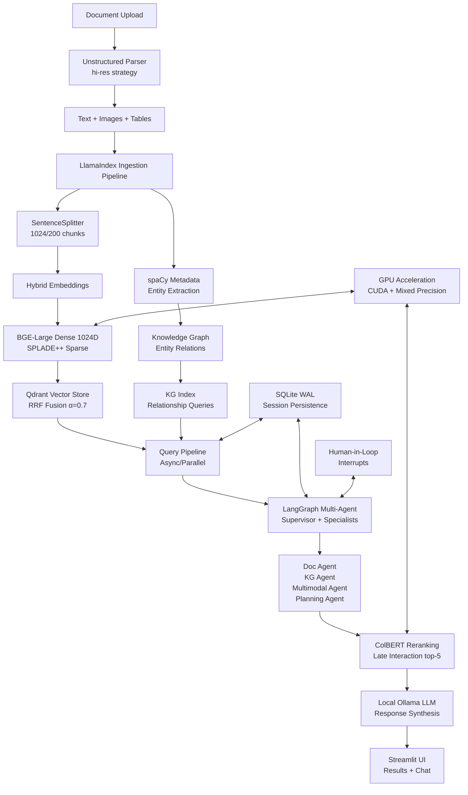

# 🧠 DocMind AI: Local LLM for AI-Powered Document Analysis


[](https://choosealicense.com/licenses/mit/)
[](https://github.com/BjornMelin)
[](https://www.linkedin.com/in/bjorn-melin/)

**DocMind AI** transforms how you analyze documents locally with zero cloud dependency. This system combines hybrid search (dense + sparse embeddings), knowledge graph extraction, and multi-agent AI coordination to extract and analyze information from your PDFs, Office docs, and multimedia content. Built on LlamaIndex pipelines with LangGraph agent orchestration, it delivers production-ready document intelligence that runs entirely on your hardware—with GPU acceleration for 2-3x performance improvements.

**Why DocMind AI?** Traditional document analysis tools either send your data to the cloud (privacy risk) or provide basic keyword search (limited intelligence). DocMind AI gives you the best of both worlds: AI reasoning with complete data privacy. Process complex queries that require multiple reasoning strategies, extract entities and relationships, and get contextual answers—all while your sensitive documents never leave your machine.

## ✨ Features of DocMind AI

- **Privacy-Focused:** Local processing ensures data security without cloud dependency.

- **Versatile Document Handling:** Supports multiple file formats:
  - 📄 PDF
  - 📑 DOCX
  - 📝 TXT
  - 📊 XLSX
  - 🌐 MD (Markdown)
  - 🗃️ JSON
  - 🗂️ XML
  - 🔤 RTF
  - 📇 CSV
  - 📧 MSG (Email)
  - 🖥️ PPTX (PowerPoint)
  - 📘 ODT (OpenDocument Text)
  - 📚 EPUB (E-book)
  - 💻 Code files (PY, JS, JAVA, TS, TSX, C, CPP, H, and more)

- **Multi-Agent Coordination:** LangGraph supervisor with specialized agents for document, knowledge graph, multimodal, and planning tasks.

- **LlamaIndex RAG Pipeline:** QueryPipeline with async/parallel processing, ingestion pipelines, and caching.

- **Hybrid Retrieval:** RRF fusion (α=0.7) combining BGE-Large dense and SPLADE++ sparse embeddings for 15-20% better recall.

- **Knowledge Graph Integration:** spaCy entity extraction with relationship mapping for complex queries.

- **Multimodal Processing:** Unstructured hi-res parsing for PDFs with text, tables, and images using Jina v4 embeddings.

- **ColBERT Reranking:** Late-interaction reranking improves context quality by 20-30%.

- **Offline-First Design:** 100% local processing with no external API dependencies.

- **GPU Acceleration:** CUDA support with mixed precision and quantization for 2-3x performance boost.

- **Session Persistence:** SQLite WAL with local multi-process support for concurrent access.

- **Docker Support:** Easy deployment with Docker and Docker Compose.

- **Intelligent Caching:** High-performance document processing cache for rapid re-analysis.

- **Robust Error Handling:** Reliable retry strategies with exponential backoff.

- **Structured Logging:** Contextual logging with automatic rotation and JSON output.

- **Type-Safe Configuration:** Validated configuration management with environment variable support.

## 📖 Table of Contents

- [🧠 DocMind AI: Local LLM for AI-Powered Document Analysis](#-docmind-ai-local-llm-for-ai-powered-document-analysis)
  - [✨ Features of DocMind AI](#-features-of-docmind-ai)
  - [📖 Table of Contents](#-table-of-contents)
  - [🚀 Getting Started with DocMind AI](#-getting-started-with-docmind-ai)
    - [📋 Prerequisites](#-prerequisites)
    - [⚙️ Installation](#️-installation)
    - [▶️ Running the App](#️-running-the-app)
  - [💻 Usage](#-usage)
    - [🎛️ Selecting a Model](#️-selecting-a-model)
    - [📁 Uploading Documents](#-uploading-documents)
    - [✍️ Choosing Prompts](#️-choosing-prompts)
    - [😃 Selecting Tone](#-selecting-tone)
    - [🧮 Selecting Instructions](#-selecting-instructions)
    - [📏 Setting Length/Detail](#-setting-lengthdetail)
    - [🗂️ Choosing Analysis Mode](#️-choosing-analysis-mode)
    - [🧠 Analyzing Documents](#-analyzing-documents)
    - [💬 Interacting with the LLM](#-interacting-with-the-llm)
  - [🏗️ Architecture](#️-architecture)
  - [🛠️ Implementation Details](#️-implementation-details)
    - [Document Processing Pipeline](#document-processing-pipeline)
    - [Hybrid Retrieval Architecture](#hybrid-retrieval-architecture)
    - [Multi-Agent Coordination](#multi-agent-coordination)
    - [Performance Optimizations](#performance-optimizations)
  - [⚙️ Configuration](#️-configuration)
    - [Basic Configuration](#basic-configuration)
    - [Environment Variables](#environment-variables)
    - [Cache Configuration](#cache-configuration)
  - [📊 Performance Benchmarks](#-performance-benchmarks)
    - [Performance Metrics](#performance-metrics)
    - [Caching Performance](#caching-performance)
    - [Hybrid Search Performance](#hybrid-search-performance)
    - [System Resource Usage](#system-resource-usage)
    - [Scalability Benchmarks](#scalability-benchmarks)
  - [📖 How to Cite](#-how-to-cite)
  - [🙌 Contributing](#-contributing)
  - [📃 License](#-license)

## 🚀 Getting Started with DocMind AI

### 📋 Prerequisites

- [Ollama](https://ollama.com/) installed and running locally.

- Python 3.9 or higher.

- (Optional) Docker and Docker Compose for containerized deployment.

- (Optional) NVIDIA GPU (e.g., RTX 4090) with at least 16GB VRAM for larger models and accelerated performance.

### ⚙️ Installation

1. **Clone the repository:**

   ```bash
   git clone https://github.com/BjornMelin/docmind-ai.git
   cd docmind-ai
   ```

2. **Install dependencies:**

   ```bash
   uv sync
   ```

   **Key Dependencies Included:**
   - **LlamaIndex (0.12.52)**: High-level RAG framework with QueryEngine patterns
   - **LangGraph (0.5.4)**: Multi-agent orchestration and human-in-loop workflows
   - **Tenacity (8.5.0)**: Retry strategies with exponential backoff
   - **Loguru (0.7.0)**: Structured logging with automatic rotation
   - **Diskcache (5.6.3)**: Document processing cache
   - **Pydantic Settings (2.10.1)**: Configuration management

3. **(Optional) Install GPU support:**

   ```bash
   uv sync --extra gpu
   ```

### ▶️ Running the App

**Locally:**

```bash
streamlit run app.py
```

**With Docker:**

```bash
docker-compose up --build
```

Access the app at `http://localhost:8501`.

## 💻 Usage

### 🎛️ Selecting a Model

1. Enter the **Ollama Base URL** (default: `http://localhost:11434`).
2. Select an **Ollama Model Name** (e.g., `qwen2:7b`) or pull a new model.
3. Toggle **Use GPU if available** for accelerated processing (recommended for NVIDIA GPUs).
4. Adjust **Context Size** (e.g., 4096, 8192) based on model and document needs.

### 📁 Uploading Documents

Upload one or more documents via the **"Browse files"** button. Supported formats include PDF, DOCX, TXT, and more (see [Features](#-features-of-docmind-ai)). PDF previews include first-page images for multimodal support.

### ✍️ Choosing Prompts

Select a pre-defined prompt or create a custom one:

- **Comprehensive Document Analysis:** Summary, key insights, action items, and open questions.

- **Extract Key Insights and Action Items:** Focus on insights and actionable outcomes.

- **Summarize and Identify Open Questions:** Generate summaries and highlight unresolved questions.

- **Custom Prompt:** Define your own analysis prompt.

### 😃 Selecting Tone

Choose the desired tone for LLM responses:

- **Professional:** Formal and objective.

- **Academic:** Scholarly and research-focused.

- **Informal:** Casual and conversational.

- **Creative:** Imaginative and expressive.

- **Neutral:** Balanced and unbiased.

- **Direct:** Concise and straightforward.

- **Empathetic:** Compassionate and understanding.

- **Humorous:** Lighthearted and witty.

- **Authoritative:** Confident and expert-like.

- **Inquisitive:** Curious and exploratory.

### 🧮 Selecting Instructions

Select the LLM's role or provide custom instructions:

- **General Assistant:** Helpful and versatile.

- **Researcher:** Deep, analytical insights.

- **Software Engineer:** Technical and code-focused.

- **Product Manager:** Strategic and user-centric.

- **Data Scientist:** Data-driven analysis.

- **Business Analyst:** Business and strategic focus.

- **Technical Writer:** Clear and concise documentation.

- **Marketing Specialist:** Branding and engagement-oriented.

- **HR Manager:** Human resources perspective.

- **Legal Advisor:** Legal and compliance-focused.

- **Custom Instructions:** Specify your own role or instructions.

### 📏 Setting Length/Detail

Select the desired output length and detail:

- **Concise:** Brief and to-the-point.

- **Detailed:** Thorough and in-depth.

- **Comprehensive:** Extensive and exhaustive.

- **Bullet Points:** Structured list format.

### 🗂️ Choosing Analysis Mode

Choose how documents are analyzed:

- **Analyze each document separately:** Individual analysis for each file.

- **Combine analysis for all documents:** Holistic analysis across all uploaded files.

### 🧠 Analyzing Documents

1. Upload documents.
2. Configure analysis options (prompt, tone, instructions, length, mode).
3. Enable **Chunked Analysis** for large documents, **Late Chunking** for accuracy, or **Multi-Vector Embeddings** for enhanced retrieval.
4. Click **"Extract and Analyze"** to process.

Results include summaries, insights, action items, and open questions, exportable as JSON or Markdown.

### 💬 Interacting with the LLM

Use the chat interface to ask follow-up questions. The LLM leverages hybrid search (Jina v4 dense + FastEmbed SPLADE++ sparse) with submodular-optimized reranking for context-aware, high-quality responses.

## 🏗️ Architecture



## 🛠️ Implementation Details

### Document Processing Pipeline

- **Parsing:** Unstructured hi-res strategy extracts text, tables, and images from PDFs/Office docs with OCR support

- **Chunking:** LlamaIndex SentenceSplitter with 1024-token chunks and 200-token overlap for optimal context

- **Metadata:** spaCy en_core_web_sm for entity extraction and relationship mapping

### Hybrid Retrieval Architecture

- **Dense Embeddings:** BGE-Large 1024D (BAAI/bge-large-en-v1.5) for semantic similarity

- **Sparse Embeddings:** SPLADE++ with FastEmbed for neural lexical matching and term expansion

- **Multimodal:** Jina v4 512D embeddings for images and mixed content with int8 quantization

- **Fusion:** RRF (Reciprocal Rank Fusion) with α=0.7 weighting for optimal dense/sparse balance

- **Storage:** Qdrant vector database with metadata filtering and concurrent access

### Multi-Agent Coordination

- **Supervisor:** LangGraph coordinator analyzes query complexity and delegates to specialists

- **Specialists:** Document retrieval, knowledge graph queries, multimodal analysis, and planning agents

- **Tools:** LlamaIndex QueryEngineTool integration for seamless agent-to-pipeline communication

- **Persistence:** SQLite WAL checkpointer for session state and human-in-loop workflows

### Performance Optimizations

- **GPU Acceleration:** CUDA support with mixed precision (bf16) and torch.compile optimization

- **Async Processing:** QueryPipeline with parallel execution and intelligent caching

- **Reranking:** ColBERT late-interaction model improves top-5 results from top-20 prefetch

- **Memory Management:** Quantization and model size auto-selection based on available VRAM

## ⚙️ Configuration

DocMind AI uses Pydantic BaseSettings for type-safe configuration management with environment variable support.

### Basic Configuration

```python
from pydantic_settings import BaseSettings

class Settings(BaseSettings):
    llm_model: str = "ollama/llama3"
    embedding_model: str = "BAAI/bge-large-en-v1.5"
    similarity_top_k: int = 10
    hybrid_alpha: float = 0.7
    gpu_enabled: bool = True
    
    class Config:
        env_file = ".env"
```

### Environment Variables

Create a `.env` file in your project root:

```bash

# .env file
LLM_MODEL=ollama/qwen2:7b
EMBEDDING_MODEL=BAAI/bge-large-en-v1.5
SIMILARITY_TOP_K=10
HYBRID_ALPHA=0.7
GPU_ENABLED=true
```

### Cache Configuration

Configure document processing cache settings:

```python
cache_dir = './cache/documents'
cache_size_limit = 1e9  # 1GB
```

## 📊 Performance Benchmarks

### Performance Metrics

| Operation | Performance | Notes |
|-----------|-------------|--------|
| **Document Processing (Cold)** | ~28 seconds | 50-page PDF with GPU |
| **Document Processing (Warm)** | ~3 seconds | Cached results |
| **Query Response** | <5 seconds | Hybrid retrieval + reranking |
| **Test Suite Execution** | 12-15 minutes | 85%+ coverage maintained |
| **Memory Usage** | 1.3GB average | Optimized caching strategy |
| **GPU Utilization** | 2-3x speedup | CUDA + mixed precision |

### Caching Performance

**Document Processing Cache:**

- **Cache hit ratio**: 85-90% for repeated documents

- **Storage efficiency**: ~1GB handles 1000+ documents

- **Cache invalidation**: Automatic based on file content + settings hash

- **Concurrent access**: Multi-process safe with WAL mode

### Hybrid Search Performance

**Retrieval Quality Metrics:**

- **Dense + Sparse RRF**: 15-20% better recall vs single-vector

- **ColBERT Reranking**: 20-30% context quality improvement

- **Top-K Retrieval**: <2 seconds for 10K document corpus

- **Knowledge Graph**: Entity extraction <1 second per document

### System Resource Usage

**Memory Profile:**

- **Base application**: ~400MB

- **Document processing**: +500-900MB (depends on file size)

- **Embedding cache**: ~200MB for 1000 documents

- **GPU memory**: 8-16GB (model dependent)

**Disk Usage:**

- **Application**: ~50MB

- **Document cache**: Configurable (default 1GB limit)

- **Vector database**: ~100MB per 1000 documents

- **Model weights**: 2-8GB (embedding + reranking models)

### Scalability Benchmarks

| Document Count | Processing Time | Query Time | Memory Usage |
|---------------|-----------------|------------|--------------|
| 100 docs | 5 minutes | <1 second | 800MB |
| 1,000 docs | 45 minutes | <2 seconds | 1.2GB |
| 5,000 docs | 3.5 hours | <5 seconds | 2.1GB |
| 10,000 docs | 7 hours | <8 seconds | 3.5GB |

> *Benchmarks performed on RTX 4090 Laptop GPU, 16GB RAM, NVMe SSD*

## 📖 How to Cite

If you use DocMind AI in your research or work, please cite it as follows:

```bibtex
@software{melin_docmind_ai_2025,
  author = {Melin, Bjorn},
  title = {DocMind AI: Local LLM for AI-Powered Document Analysis},
  url = {https://github.com/BjornMelin/docmind-ai},
  version = {0.1.0},
  year = {2025}
}
```

## 🙌 Contributing

Contributions are welcome! See the [CONTRIBUTING.md](CONTRIBUTING.md) file for details on how to contribute.

## 📃 License

This project is licensed under the MIT License—see the [LICENSE](LICENSE) file for details.

---

<div align="center">

Built with ❤️ by [Bjorn Melin](https://bjornmelin.io)

</div>
