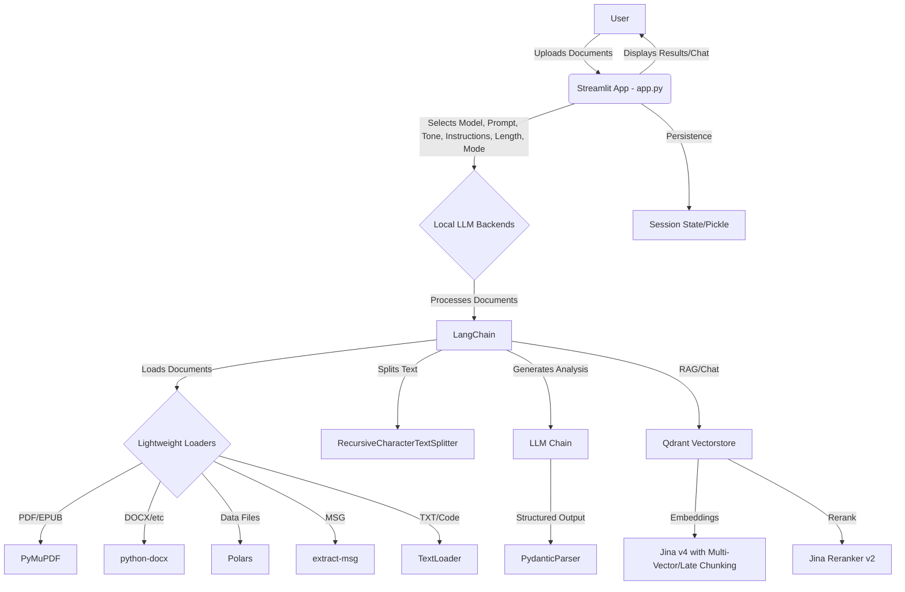

# 🧠 DocMind AI: Local LLM for AI-Powered Document Analysis


[](https://choosealicense.com/licenses/mit/)
[](https://github.com/BjornMelin)
[](https://www.linkedin.com/in/bjorn-melin/)

**DocMind AI** is a powerful, open-source Streamlit application that leverages the capabilities of Large Language Models (LLMs) running locally on your machine through [Ollama](https://ollama.com/). Analyze a vast array of document types, extract key insights, generate summaries, identify action items, and surface open questions – all without sending your data to the cloud!

## ✨ Features of DocMind AI

- **Privacy-Focused:** Your documents are processed locally, ensuring data privacy and security.
- **Versatile Document Handling:** Supports a wide range of file formats:
  - 📄 PDF
  - 📑 DOCX
  - 📝 TXT
  - 📊 XLSX
  - 🌐 MD (Markdown)
  - 🗃️ JSON
  - 🗂️ XML
  - 🔤 RTF
  - 📇 CSV
  - 📧 MSG (Email)
  - 🖥️ PPTX (PowerPoint)
  - 📘 ODT (OpenDocument Text)
  - 📚 EPUB (E-book)
  - 💻 Code files (PY, JS, JAVA, TS, TSX, C, CPP, H, and more!)
- **Powerful AI Analysis:** Uses the power of LangChain to provide in-depth analysis.
- **Structured Output:** Get results in a well-defined format using Pydantic.
- **Customizable Prompts:** Tailor the analysis to your specific needs with pre-defined or custom prompts.
- **Tone and Instruction Control:** Fine-tune the LLM's responses by selecting the desired tone (e.g., professional, informal, academic) and specific instructions (e.g., act as a researcher, software engineer, business analyst).
- **Length/Detail Selection:** Control the length and level of detail of the generated responses (e.g., concise, detailed, comprehensive).
- **Flexible Analysis Modes:** Choose to analyze each document individually or combine them for a holistic analysis.
- **Interactive Chat:** Continue the conversation with the LLM to explore the documents further.
- **Docker Support:** Easily deploy the application using Docker or Docker Compose.
- **Multimodal Support:** Preview images from PDFs, embed multimodal data.
- **Advanced RAG:** Hybrid search with Qdrant, late chunking, multi-vector embeddings with Jina v4, SOTA reranking with Jina v2.

## 📖 Table of Contents

- [🧠 DocMind AI: Local LLM for AI-Powered Document Analysis](#-docmind-ai-local-llm-for-ai-powered-document-analysis)
  - [✨ Features of DocMind AI](#-features-of-docmind-ai)
  - [📖 Table of Contents](#-table-of-contents)
  - [🚀 Getting Started with DocMind AI: Local LLM Analysis](#-getting-started-with-docmind-ai-local-llm-analysis)
    - [📋 Prerequisites](#-prerequisites)
    - [⚙️ Installation](#️-installation)
    - [▶️ Running the App](#️-running-the-app)
  - [💻 Usage](#-usage)
    - [🎛️ Selecting a Model](#️-selecting-a-model)
    - [📁 Uploading Documents](#-uploading-documents)
    - [✍️ Choosing Prompts](#️-choosing-prompts)
    - [😃 Selecting Tone](#-selecting-tone)
    - [🧮 Selecting Instructions](#-selecting-instructions)
    - [📏 Setting Length/Detail](#-setting-lengthdetail)
    - [🗂️ Choosing Analysis Mode](#️-choosing-analysis-mode)
    - [🧠 Analyzing Documents](#-analyzing-documents)
    - [💬 Interacting with the LLM](#-interacting-with-the-llm)
  - [🏗️ Architecture](#️-architecture)
  - [📖 How to Cite](#-how-to-cite)
  - [🙌 Contributing](#-contributing)
  - [📃 License](#-license)

## 🚀 Getting Started with DocMind AI: Local LLM Analysis

### 📋 Prerequisites

- [Ollama](https://ollama.com/) installed and running.
- Python 3.8 or higher.
- (Optional) Docker and Docker Compose for containerized deployment.

### ⚙️ Installation

1. **Clone the repository:**

   ```bash
   git clone https://github.com/BjornMelin/docmind-ai.git
   cd docmind-ai
   ```

2. **Install dependencies:**

   ```bash
   pip install -r requirements.txt
   ```

### ▶️ Running the App

**Locally:**

```bash
streamlit run app.py
```

**With Docker:**

```bash
docker-compose up --build
```

The app will be accessible at `http://localhost:8501`.

## 💻 Usage

### 🎛️ Selecting a Model

1. Enter the **Ollama Base URL** (default: `http://localhost:11434`).
2. Choose your desired **Ollama Model Name** (e.g., `llama2`) from the dropdown.

### 📁 Uploading Documents

Click the **"Browse files"** button to upload one or more documents. Supported file types are listed above in the [Features](#-features-of-docmind-ai) section.

### ✍️ Choosing Prompts

Select a pre-defined prompt from the dropdown:

- **Comprehensive Document Analysis:** Get a summary, key insights, action items, and open questions.
- **Extract Key Insights and Action Items:** Focus on extracting these two elements.
- **Summarize and Identify Open Questions:** Generate a summary and a list of open questions.
- **Custom Prompt:** Enter your own prompt to guide the analysis.

### 😃 Selecting Tone

Choose the desired tone for the LLM's response:

- **Professional:** Objective and formal.
- **Academic:** Scholarly and research-oriented.
- **Informal:** Casual and conversational.
- **Creative:** Imaginative and artistic.
- **Neutral:** Unbiased and objective.
- **Direct:** Concise and to-the-point.
- **Empathetic:** Understanding and compassionate.
- **Humorous:** Witty and lighthearted.
- **Authoritative:** Confident and expert.
- **Inquisitive:** Curious and exploratory.

### 🧮 Selecting Instructions

Select the persona or instructions that the LLM should follow:

- **General Assistant:** Act as a helpful assistant.
- **Researcher:** Provide in-depth research and analysis.
- **Software Engineer:** Focus on technical details and code.
- **Product Manager:** Consider product strategy and user experience.
- **Data Scientist:** Emphasize data analysis and modeling.
- **Business Analyst:** Analyze from a business and strategic perspective.
- **Technical Writer:** Create clear and concise documentation.
- **Marketing Specialist:** Focus on branding and customer engagement.
- **HR Manager:** Consider human resources aspects.
- **Legal Advisor:** Provide information from a legal standpoint.
- **Custom Instructions:** Enter your own specific instructions.

### 📏 Setting Length/Detail

Choose the desired length and level of detail for the LLM's response:

- **Concise:** Brief and to-the-point.
- **Detailed:** Thorough and comprehensive.
- **Comprehensive:** Extensive and in-depth.
- **Bullet Points:** Provide response in bullet point format.

### 🗂️ Choosing Analysis Mode

Select the analysis mode:

- **Analyze each document separately:** Process and analyze each document individually.
- **Combine analysis for all documents:** Treat all uploaded documents as a single unit for analysis.

### 🧠 Analyzing Documents

1. Upload your documents.
2. Choose your analysis prompt, tone, instructions, desired length, and analysis mode.
3. Click the **"Extract and Analyze"** button.

The application will display the analysis results, attempting to format them according to the defined output schema. If parsing fails, the raw LLM output will be shown.

### 💬 Interacting with the LLM

Use the chat interface to ask follow-up questions about the analyzed documents. The LLM will use the extracted information as context for its responses.

## 🏗️ Architecture

Here's a Mermaid diagram illustrating the application's architecture:



## 📖 How to Cite

If you use DocMind AI in your research or work, please cite it as follows:

```bibtex
@software{melin_docmind_ai_2025,
  author = {Melin, Bjorn},
  title = {DocMind AI: Local LLM for AI-Powered Document Analysis},
  url = {https://github.com/BjornMelin/docmind-ai},
  version = {0.1.0},
  year = {2025}
}
```

## 🙌 Contributing

We welcome contributions! Please see the [CONTRIBUTING.md](CONTRIBUTING.md) file for details on how to contribute to this project.

## 📃 License

This project is licensed under the MIT License - see the [LICENSE](LICENSE) file for details.

---

<div align="center">

Built with ❤️ by [Bjorn Melin](https://bjornmelin.io)

</div>
