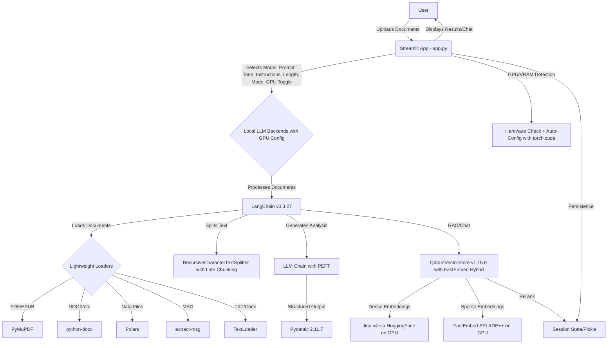

# 🧠 DocMind AI: Local LLM for AI-Powered Document Analysis


[](https://choosealicense.com/licenses/mit/)
[](https://github.com/BjornMelin)
[](https://www.linkedin.com/in/bjorn-melin/)

**DocMind AI** is a powerful, open-source Streamlit application that leverages local Large Language Models (LLMs) through [Ollama](https://ollama.com/) for advanced document analysis. Analyze a wide range of document types, extract key insights, generate summaries, identify action items, and surface open questions—all processed locally to ensure data privacy. The system integrates state-of-the-art embedding models (Jina v4, FastEmbed SPLADE++) and hybrid search for superior retrieval performance, with GPU optimizations for high throughput.

## ✨ Features of DocMind AI

- **Privacy-Focused:** Local processing ensures data security without cloud dependency.
- **Versatile Document Handling:** Supports multiple file formats:
  - 📄 PDF
  - 📑 DOCX
  - 📝 TXT
  - 📊 XLSX
  - 🌐 MD (Markdown)
  - 🗃️ JSON
  - 🗂️ XML
  - 🔤 RTF
  - 📇 CSV
  - 📧 MSG (Email)
  - 🖥️ PPTX (PowerPoint)
  - 📘 ODT (OpenDocument Text)
  - 📚 EPUB (E-book)
  - 💻 Code files (PY, JS, JAVA, TS, TSX, C, CPP, H, and more)
- **Advanced AI Analysis:** Powered by LangChain v0.3.27 for robust document processing.
- **Structured Output:** Results formatted using Pydantic v2.11.7 for clarity.
- **Customizable Prompts:** Predefined or custom prompts for tailored analysis.
- **Tone and Instruction Control:** Adjust tone (e.g., professional, academic) and instructions (e.g., researcher, software engineer).
- **Length/Detail Selection:** Control output verbosity (concise, detailed, comprehensive, bullet points).
- **Flexible Analysis Modes:** Analyze documents individually or combined.
- **Interactive Chat:** Context-aware follow-up questions with hybrid search.
- **Multimodal Support:** Extract and preview images from PDFs for richer analysis.
- **Hybrid Search:** Combines Jina v4 dense embeddings (multimodal/multilingual) and FastEmbed v0.7.1 SPLADE++ sparse embeddings for up to 15-20% better recall in Retrieval-Augmented Generation (RAG).
- **Submodular Optimization:** Diversity-aware passage reranking reduces redundancy, improving context quality by 20-30%.
- **GPU Optimization:** Leverages NVIDIA GPUs (e.g., RTX 4090) with full offload for 2-3x faster embeddings and inference (70+ TPS for 8B models).
- **Docker Support:** Easy deployment with Docker and Docker Compose.

## 📖 Table of Contents

- [🧠 DocMind AI: Local LLM for AI-Powered Document Analysis](#-docmind-ai-local-llm-for-ai-powered-document-analysis)
  - [✨ Features of DocMind AI](#-features-of-docmind-ai)
  - [📖 Table of Contents](#-table-of-contents)
  - [🚀 Getting Started with DocMind AI](#-getting-started-with-docmind-ai)
    - [📋 Prerequisites](#-prerequisites)
    - [⚙️ Installation](#️-installation)
    - [▶️ Running the App](#️-running-the-app)
  - [💻 Usage](#-usage)
    - [🎛️ Selecting a Model](#️-selecting-a-model)
    - [📁 Uploading Documents](#-uploading-documents)
    - [✍️ Choosing Prompts](#️-choosing-prompts)
    - [😃 Selecting Tone](#-selecting-tone)
    - [🧮 Selecting Instructions](#-selecting-instructions)
    - [📏 Setting Length/Detail](#-setting-lengthdetail)
    - [🗂️ Choosing Analysis Mode](#️-choosing-analysis-mode)
    - [🧠 Analyzing Documents](#-analyzing-documents)
    - [💬 Interacting with the LLM](#-interacting-with-the-llm)
  - [🏗️ Architecture](#️-architecture)
  - [🛠️ Implementation Details](#️-implementation-details)
  - [📖 How to Cite](#-how-to-cite)
  - [🙌 Contributing](#-contributing)
  - [📃 License](#-license)

## 🚀 Getting Started with DocMind AI

### 📋 Prerequisites

- [Ollama](https://ollama.com/) installed and running locally.
- Python 3.9 or higher.
- (Optional) Docker and Docker Compose for containerized deployment.
- (Optional) NVIDIA GPU (e.g., RTX 4090) with at least 16GB VRAM for larger models and accelerated performance.

### ⚙️ Installation

1. **Clone the repository:**

   ```bash
   git clone https://github.com/BjornMelin/docmind-ai.git
   cd docmind-ai
   ```

2. **Install dependencies:**

   ```bash
   uv sync
   ```

3. **(Optional) Install GPU support:**

   ```bash
   uv sync --extra gpu
   ```

### ▶️ Running the App

**Locally:**

```bash
streamlit run app.py
```

**With Docker:**

```bash
docker-compose up --build
```

Access the app at `http://localhost:8501`.

## 💻 Usage

### 🎛️ Selecting a Model

1. Enter the **Ollama Base URL** (default: `http://localhost:11434`).
2. Select an **Ollama Model Name** (e.g., `qwen2:7b`) or pull a new model.
3. Toggle **Use GPU if available** for accelerated processing (recommended for NVIDIA GPUs).
4. Adjust **Context Size** (e.g., 4096, 8192) based on model and document needs.

### 📁 Uploading Documents

Upload one or more documents via the **"Browse files"** button. Supported formats include PDF, DOCX, TXT, and more (see [Features](#-features-of-docmind-ai)). PDF previews include first-page images for multimodal support.

### ✍️ Choosing Prompts

Select a pre-defined prompt or create a custom one:

- **Comprehensive Document Analysis:** Summary, key insights, action items, and open questions.
- **Extract Key Insights and Action Items:** Focus on insights and actionable outcomes.
- **Summarize and Identify Open Questions:** Generate summaries and highlight unresolved questions.
- **Custom Prompt:** Define your own analysis prompt.

### 😃 Selecting Tone

Choose the desired tone for LLM responses:

- **Professional:** Formal and objective.
- **Academic:** Scholarly and research-focused.
- **Informal:** Casual and conversational.
- **Creative:** Imaginative and expressive.
- **Neutral:** Balanced and unbiased.
- **Direct:** Concise and straightforward.
- **Empathetic:** Compassionate and understanding.
- **Humorous:** Lighthearted and witty.
- **Authoritative:** Confident and expert-like.
- **Inquisitive:** Curious and exploratory.

### 🧮 Selecting Instructions

Select the LLM's role or provide custom instructions:

- **General Assistant:** Helpful and versatile.
- **Researcher:** Deep, analytical insights.
- **Software Engineer:** Technical and code-focused.
- **Product Manager:** Strategic and user-centric.
- **Data Scientist:** Data-driven analysis.
- **Business Analyst:** Business and strategic focus.
- **Technical Writer:** Clear and concise documentation.
- **Marketing Specialist:** Branding and engagement-oriented.
- **HR Manager:** Human resources perspective.
- **Legal Advisor:** Legal and compliance-focused.
- **Custom Instructions:** Specify your own role or instructions.

### 📏 Setting Length/Detail

Select the desired output length and detail:

- **Concise:** Brief and to-the-point.
- **Detailed:** Thorough and in-depth.
- **Comprehensive:** Extensive and exhaustive.
- **Bullet Points:** Structured list format.

### 🗂️ Choosing Analysis Mode

Choose how documents are analyzed:

- **Analyze each document separately:** Individual analysis for each file.
- **Combine analysis for all documents:** Holistic analysis across all uploaded files.

### 🧠 Analyzing Documents

1. Upload documents.
2. Configure analysis options (prompt, tone, instructions, length, mode).
3. Enable **Chunked Analysis** for large documents, **Late Chunking** for accuracy, or **Multi-Vector Embeddings** for enhanced retrieval.
4. Click **"Extract and Analyze"** to process.

Results include summaries, insights, action items, and open questions, exportable as JSON or Markdown.

### 💬 Interacting with the LLM

Use the chat interface to ask follow-up questions. The LLM leverages hybrid search (Jina v4 dense + FastEmbed SPLADE++ sparse) with submodular-optimized reranking for context-aware, high-quality responses.

## 🏗️ Architecture



## 🛠️ Implementation Details

- **Document Loaders:** Lightweight loaders (PyMuPDF, python-docx, Polars, extract-msg, TextLoader) handle diverse formats, with multimodal support for PDF image extraction.
- **Text Splitting:** RecursiveCharacterTextSplitter with late chunking (NLTK sentence tokenization + mean-pooled embeddings) ensures accurate segmentation for large documents.
- **Embedding Pipeline:**
  - **Dense Embeddings:** Jina v4 via HuggingFaceEmbeddings (transformers v4.53.3) supports multimodal/multilingual retrieval, with device_map="auto" for GPU acceleration (2-3x faster on RTX 4090).
  - **Sparse Embeddings:** FastEmbed v0.7.1 with SPLADE++ (prithivida/Splade_PP_en_v1) for neural lexical search, using CUDAExecutionProvider for GPU support.
  - **Hybrid Search:** Qdrant v1.15.0 integrates dense and sparse embeddings for 15-20% better recall in RAG, with server-side score boosting.
- **Reranking:** Jina Reranker v2 (sentence-transformers v5.0.0) with submodular optimization (greedy facility location) reduces passage redundancy, improving context quality by 20-30%.
- **Analysis Pipeline:** LangChain v0.3.27 LLMChain with PEFT v0.16.0 for efficient model loading, Pydantic v2.11.7 for structured output (summaries, insights, action items, questions).
- **GPU Optimization:** Auto-detects VRAM via nvidia-smi, suggests models (e.g., Qwen2-72B for 16GB+ VRAM), and enables full offload (n_gpu_layers=-1) for LlamaCpp, achieving 70+ TPS for 8B models.
- **Performance:** Hybrid search and GPU acceleration reduce embedding latency (up to 2x TPS), while submodular reranking optimizes context for LLM inference.
- **Code Quality:** Adheres to KISS/DRY principles, passes ruff linting (line length 88, Google docstrings, type hints), and avoids deprecated code.

## 📖 How to Cite

If you use DocMind AI in your research or work, please cite it as follows:

```bibtex
@software{melin_docmind_ai_2025,
  author = {Melin, Bjorn},
  title = {DocMind AI: Local LLM for AI-Powered Document Analysis},
  url = {https://github.com/BjornMelin/docmind-ai},
  version = {0.1.0},
  year = {2025}
}
```

## 🙌 Contributing

Contributions are welcome! See the [CONTRIBUTING.md](CONTRIBUTING.md) file for details on how to contribute.

## 📃 License

This project is licensed under the MIT License—see the [LICENSE](LICENSE) file for details.

---

<div align="center">

Built with ❤️ by [Bjorn Melin](https://bjornmelin.io)

</div>
