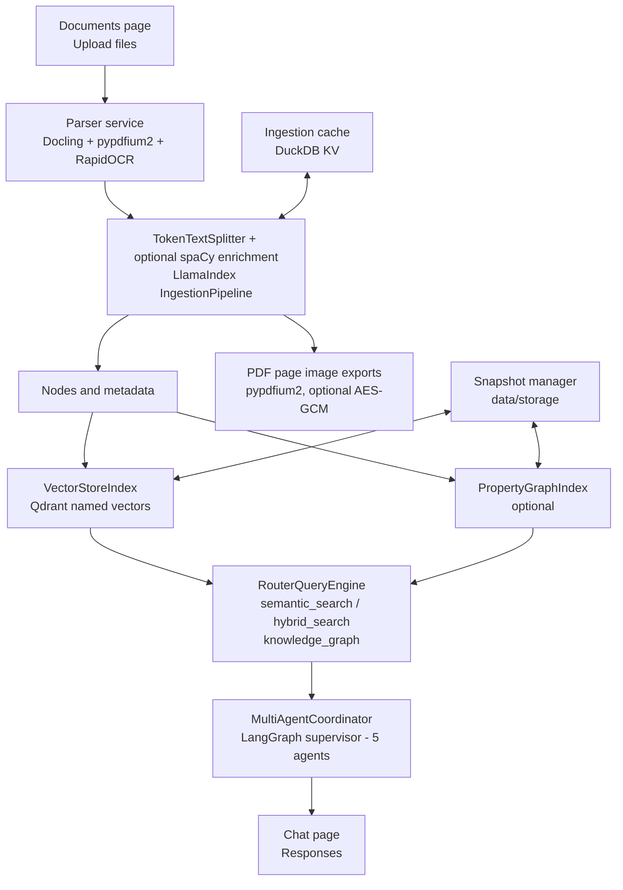

# 🧠 DocMind AI: Local LLM for AI-Powered Document Analysis


[](https://choosealicense.com/licenses/mit/)

**DocMind AI** is a local-first document analysis application. It combines dense and sparse retrieval, optional GraphRAG, multimodal page retrieval, and LangGraph-supervised analysis. Local parsing and retrieval are the default. An explicitly enabled remote language model endpoint crosses the local trust boundary.

Design goals:

- Privacy by default: remote endpoints are blocked unless explicitly allowed.
- Reproducibility: deterministic ingestion caching and snapshot manifests.
- Extensibility: RouterQueryEngine routes across vector, hybrid, and optional graph retrieval.

## ✨ Features of DocMind AI

- **Privacy-focused, local-first:** Remote LLM endpoints are blocked by default; enable explicitly when needed.
- **CPU-safe ingestion pipeline:** LlamaIndex `IngestionPipeline` fed by DocMind's local parser service: Docling conversion, pypdfium2 PDF inspection/rasterization, RapidOCR CPU OCR, `TokenTextSplitter`, and optional spaCy enrichment.
- **Multi-format parsing:** Docling covers PDFs and common office/HTML formats; only explicit text formats use the direct UTF-8 loader. Binary parser failures stop ingestion instead of decoding source bytes as text.
- **Hybrid retrieval with routing:** RouterQueryEngine with `semantic_search`, optional `hybrid_search` (Qdrant server-side fusion), and optional `knowledge_graph` (GraphRAG).
- **Qdrant server-side fusion:** Query API RRF (default) or DBSF over named vectors `text-dense` and `text-sparse`; sparse queries use FastEmbed BM42/BM25 when available.
- **Reranking and multimodal:** Text rerank via BGE cross-encoder; SigLIP visual rerank runs when visual nodes are present; ColPali optional via the `multimodal` extra.
- **Multi-agent coordination:** LangGraph supervisor orchestrates five agents (router, planner, retrieval, synthesis, validation).
- **Snapshots and reproducibility:** DuckDB KV cache plus snapshot manifests with corpus/config hashes; graph exports as JSONL/Parquet (Parquet requires PyArrow).
- **PDF page images:** pypdfium2 renders page images to WebP/JPEG; optional AES-GCM encryption with `.enc` outputs and just-in-time decryption for visual scoring.
- **ArtifactStore (multimodal durability):** Page images/thumbnails are stored as content-addressed `ArtifactRef(sha256, suffix)` (no base64 blobs or host paths in durable stores).
- **Multimodal UX:** Chat renders image sources and supports query-by-image “Visual search” (SigLIP) for image-rich PDFs.
- **Offline-first design:** Designed to run locally once models are present;
  remote endpoints must be explicitly enabled. The release benchmark does not
  claim independently measured zero egress.
- **GPU acceleration:** The optional NVIDIA profile accelerates PyTorch-based dense/image embeddings and reranking; sparse FastEmbed remains CPU-based. vLLM runs as an external OpenAI-compatible server.
- **Robust retries and logging:** Tenacity-backed retries for LLM calls and structured logging via Loguru.
- **Observability and operations:** Optional OTLP tracing/metrics plus JSONL telemetry; Docker and Compose included for local deployments.

## Table of Contents

- [🧠 DocMind AI: Local LLM for AI-Powered Document Analysis](#-docmind-ai-local-llm-for-ai-powered-document-analysis)
  - [✨ Features of DocMind AI](#-features-of-docmind-ai)
  - [Table of Contents](#table-of-contents)
  - [Get started with DocMind AI](#get-started-with-docmind-ai)
    - [Prerequisites](#prerequisites)
    - [Installation](#installation)
    - [Running the App](#running-the-app)
  - [Usage](#usage)
    - [Configure LLM Runtime (Settings page)](#configure-llm-runtime-settings-page)
    - [Ingest Documents and Build Snapshots (Documents page)](#ingest-documents-and-build-snapshots-documents-page)
    - [Chat with Documents (Chat page)](#chat-with-documents-chat-page)
    - [Analytics (optional)](#analytics-optional)
  - [API Usage Examples](#api-usage-examples)
    - [Programmatic Ingestion](#programmatic-ingestion)
    - [Programmatic Query (Router + Coordinator)](#programmatic-query-router--coordinator)
    - [Prompt Templates (developer API)](#prompt-templates-developer-api)
    - [Custom Configuration](#custom-configuration)
    - [Batch Document Processing](#batch-document-processing)
  - [Architecture](#architecture)
  - [Implementation Details](#implementation-details)
    - [Document Processing Pipeline](#document-processing-pipeline)
    - [Hybrid Retrieval Architecture](#hybrid-retrieval-architecture)
    - [Multi-Agent Coordination](#multi-agent-coordination)
    - [Performance Optimizations](#performance-optimizations)
  - [Configuration](#configuration)
    - [Understand `DOCMIND_*` provider variables](#understand-docmind_-provider-variables)
    - [Configuration Philosophy](#configuration-philosophy)
    - [Environment Variables](#environment-variables)
    - [Enable DSPy Optimization (optional)](#enable-dspy-optimization-optional)
    - [Additional Configuration](#additional-configuration)
  - [Performance Defaults and Monitoring](#performance-defaults-and-monitoring)
    - [Configured Defaults](#configured-defaults)
    - [Measure Locally](#measure-locally)
    - [Retrieval \& Reranking Defaults](#retrieval--reranking-defaults)
      - [Operational Flags (local-first)](#operational-flags-local-first)
  - [Offline Operation](#offline-operation)
    - [Prerequisites for Offline Use](#prerequisites-for-offline-use)
    - [Prefetch Model Weights](#prefetch-model-weights)
    - [Snapshots \& Staleness](#snapshots--staleness)
    - [GraphRAG Exports \& Seeds](#graphrag-exports--seeds)
    - [Model Requirements](#model-requirements)
  - [Troubleshooting](#troubleshooting)
    - [Common Issues](#common-issues)
      - [1. Ollama Connection Errors](#1-ollama-connection-errors)
      - [2. GPU Not Detected](#2-gpu-not-detected)
      - [3. Model Download Issues](#3-model-download-issues)
      - [4. Memory Issues](#4-memory-issues)
      - [5. Document Processing Errors](#5-document-processing-errors)
      - [6. vLLM Server Connectivity Issues](#6-vllm-server-connectivity-issues)
      - [7. PyTorch Compatibility Issues](#7-pytorch-compatibility-issues)
      - [8. GPU memory issues](#8-gpu-memory-issues)
      - [9. Performance Validation](#9-performance-validation)
    - [Performance Optimization](#performance-optimization)
    - [Getting Help](#getting-help)
  - [How to Cite](#how-to-cite)
  - [Contributing](#contributing)
    - [Development Guidelines](#development-guidelines)
      - [Tests and CI](#tests-and-ci)
  - [License](#license)
  - [Observability](#observability)

## Get started with DocMind AI

### Prerequisites

- One supported LLM backend running locally: [Ollama](https://ollama.com/) (default), vLLM OpenAI-compatible server, LM Studio, or a llama.cpp server.

- Python `>=3.12,<3.14`; CPython 3.12.13 is the primary CI and container
  baseline, with a CPython 3.13.12 compatibility lane.

- (Optional) Docker and Docker Compose for containerized deployment.

- (Optional) An NVIDIA GPU and compatible driver for the locked CUDA 12.8 extra. Configure external vLLM hardware separately.

Linux x86_64 is the release-validated host platform. WSL2 and macOS paths are
best effort until they have dedicated CI coverage.

### Installation

1. **Clone the repository:**

   ```bash
   git clone https://github.com/BjornMelin/docmind-ai-llm.git
   cd docmind-ai-llm
   ```

2. **Install dependencies:**

   ```bash
   uv sync --frozen
   ```

   Install the optional observability extra for LlamaIndex OpenTelemetry instrumentation:

   ```bash
   uv sync --frozen --extra observability
   ```

   GraphRAG uses LlamaIndex core's built-in property graph store. Install the optional multimodal extra when you need ColPali reranking:

   ```bash
   uv sync --frozen --extra multimodal
   ```

   Searchable-PDF export is POSIX-only (Linux, macOS, or WSL2; native Windows
   is unsupported) and requires the OCRmyPDF and Tesseract executables:

   ```bash
   uv sync --frozen --extra searchable-pdf
   ```

   Prefetch the required parser and BGE-M3 artifacts, then verify the parser
   manifests:

   ```bash
   uv run python tools/models/pull.py \
     --bge-m3 \
     --cache_dir ./models_cache \
     --parser-defaults \
     --rapidocr-cache-dir ./cache/models
   uv run python scripts/parser_health.py --check
   ```

   Regenerate the schema 3 parser benchmark artifact after the code is frozen:

   ```bash
   uv run python scripts/benchmark_parsing.py \
     --generate-minimal-fixtures \
     --repeat 3 \
     --output docs/benchmarks/parser-runtime-validation.json
   ```

   The checked-in schema 3 artifact is bound to its clean source commit and
   runtime identity. The validation record, current baseline, and measurement
   limits live in `docs/developers/parser-runtime-validation.md`.

   Start loopback-only Qdrant and run the system gate when you need end-to-end validation:

   ```bash
   ./scripts/start_qdrant_local.sh
   DOCMIND_RUN_SYSTEM=1 \
     DOCMIND_QDRANT_SYSTEM_URL=http://127.0.0.1:6333 \
     uv run pytest tests/system/test_e2e_offline.py -q
   ```

   **Key Dependencies Included:**

   - **LlamaIndex Core (>=0.14.21,<0.15.0)**: Ingestion, retrieval, selectors, and query engines, with selected LLM, Hugging Face, Qdrant, and DuckDB adapters
   - **LangGraph (>=1.0.10,<2.0.0)**: 5-agent supervisor orchestration (graph-native `StateGraph`, no external supervisor wrapper)
   - **Streamlit (>=1.52.2,<2.0.0)**: Web interface framework
   - **Ollama (0.6.2)**: Local LLM integration
   - **Qdrant Client (>=1.15.1,<2.0.0)**: Vector database operations
   - **Docling (>=2.92,<3)**: Multi-format document conversion.
   - **pypdfium2 (>=5.7,<6)**: PDF inspection and page rasterization.
   - **RapidOCR (>=3.8,<4)**: CPU-safe local OCR with explicit model prefetch.
   - **FastEmbed (>=0.5.1)**: Direct CPU sparse query encoding
   - **Tenacity (>=9.1.2,<10.0.0)**: Retry strategies with exponential backoff
   - **Loguru (>=0.7.3,<1.0.0)**: Structured logging
   - **Pydantic (2.12.5)**: Data validation and settings.

3. **Install spaCy language model:**

   spaCy is bundled for optional **NLP enrichment** (sentence segmentation + entity extraction during ingestion). Install a language model if you plan to use enrichment:

   ```bash
   # Install the small English model (recommended, ~15MB)
   uv run python -m spacy download en_core_web_sm

   # Optional: Install larger models for better accuracy
   # Medium model (~50MB): uv run python -m spacy download en_core_web_md
   # Large model (~560MB): uv run python -m spacy download en_core_web_lg
   ```

   **Note:** spaCy models are downloaded and cached locally. The app does not auto-download models; install them explicitly for offline use.

   Optional configuration (defaults shown):

   ```bash
   # Enable/disable enrichment
   DOCMIND_SPACY__ENABLED=true
   # Pipeline name or path (blank fallback when missing)
   DOCMIND_SPACY__MODEL=en_core_web_sm
   # cpu|cuda|apple|auto (auto prefers CUDA, then Apple, else CPU)
   DOCMIND_SPACY__DEVICE=auto
   DOCMIND_SPACY__GPU_ID=0
   ```

   Cross-platform acceleration:

   - NVIDIA CUDA (validated on Linux x86_64): `uv sync --frozen --no-group cpu --extra gpu` and set `DOCMIND_SPACY__DEVICE=auto|cuda`; WSL2 is best effort
   - Apple Silicon (best effort, macOS arm64 with CPython 3.12): `uv sync --frozen --extra apple` and set `DOCMIND_SPACY__DEVICE=auto|apple`

   See `docs/specs/spec-015-nlp-enrichment-spacy.md` and `docs/developers/gpu-setup.md`.

4. **Set up environment configuration:**

   Copy the example environment file and configure your settings:

   ```bash
   cp .env.example .env
   # Edit .env with your preferred settings

   # Model names are backend-specific:
   #   - Ollama: use the local tag (e.g., qwen3:4b-instruct)
   #   - vLLM/LM Studio/llama.cpp: use the served model name
   # NOTE: DOCMIND_MODEL (top-level) overrides backend-specific model vars such as DOCMIND_VLLM__MODEL at runtime.

   # Example - Ollama (local, default):
   #   DOCMIND_LLM_BACKEND=ollama
   #   DOCMIND_OLLAMA_BASE_URL=http://localhost:11434
   #   DOCMIND_MODEL=qwen3:4b-instruct

   # Example - LM Studio (local, OpenAI-compatible):
   #   DOCMIND_LLM_BACKEND=lmstudio
   #   DOCMIND_OPENAI__BASE_URL=http://localhost:1234/v1
   #   DOCMIND_OPENAI__API_KEY=not-needed
   #   DOCMIND_MODEL=your-model-name

   # Example - vLLM OpenAI-compatible server:
   #   DOCMIND_LLM_BACKEND=vllm
   #   DOCMIND_OPENAI__BASE_URL=http://localhost:8000/v1
   #   DOCMIND_OPENAI__API_KEY=not-needed
   #   DOCMIND_VLLM__MODEL=Qwen/Qwen3-4B-Instruct-2507-FP8

   # Example - llama.cpp server:
   #   DOCMIND_LLM_BACKEND=llamacpp
   #   DOCMIND_LLAMACPP_BASE_URL=http://localhost:8080/v1
   #   DOCMIND_OPENAI__API_KEY=not-needed
   #   DOCMIND_MODEL=local-gguf

   # Offline-first recommended:
   #   HF_HUB_OFFLINE=1
   #   TRANSFORMERS_OFFLINE=1

   # Optional - OpenAI-compatible cloud or gateway (changes the privacy boundary):
   #   DOCMIND_LLM_BACKEND=openai_compatible
   #   DOCMIND_OPENAI__BASE_URL=https://api.openai.com/v1
   #   DOCMIND_OPENAI__API_KEY=sk-...
   #   DOCMIND_OPENAI__API_MODE=responses
   #   DOCMIND_SECURITY__ALLOW_REMOTE_ENDPOINTS=true
   ```

   Start llama.cpp as an OpenAI-compatible GGUF server:

   ```bash
   # CPU / portable baseline
   llama-server -m ./models/model.gguf --alias local-gguf \
     --ctx-size 8192 --host 127.0.0.1 --port 8080

   # CUDA or other GPU backends
   llama-server -m ./models/model.gguf --alias local-gguf \
     --ctx-size 8192 -ngl 999 -fa --host 127.0.0.1 --port 8080
   ```

   Use the `--alias` value as `DOCMIND_MODEL`, keep `/v1` in
   `DOCMIND_LLAMACPP_BASE_URL`, and bind to loopback unless remote access is
   explicitly required. For remote access, start `llama-server` with
   `--api-key` and configure `DOCMIND_OPENAI__API_KEY`.

   For a complete overview, see `docs/developers/configuration.md`. The relevant section is `LLM Backend Selection`.

5. **(Optional) Install NVIDIA support:**

   Replace the default CPU dependency group with the locked GPU extra. Native
   uv source rules select the official CUDA 12.8 PyTorch wheels. This
   accelerates dense/image embeddings, reranking, and spaCy; sparse FastEmbed
   remains CPU-based:

   ```bash
   nvidia-smi
   uv sync --frozen --no-group cpu --extra gpu
   uv run python -c "import torch; print(torch.__version__); print(torch.cuda.is_available())"
   ```

   **Hardware guidance:**

   - Use an NVIDIA driver compatible with the locked CUDA 12.8 wheels
   - Size external vLLM hardware for its model and context settings

   **Notes:**

   - vLLM is supported via an external OpenAI-compatible server (see Troubleshooting section 6 for connectivity checks).
   - Measure performance on your hardware with `uv run python scripts/performance_monitor.py`.

   See [GPU Setup Guide](docs/developers/gpu-setup.md) (installation) and [Hardware Policy](docs/developers/hardware_policy.md) (hardware/VRAM guidance).

### Running the App

**Locally:**

```bash
uv run streamlit run app.py
```

To honor `DOCMIND_UI__STREAMLIT_PORT`, use:

```bash
./scripts/run_app.sh
```

**With Docker (CPU):**

```bash
docker compose up --build -d
docker compose exec ollama ollama pull qwen3:4b-instruct
```

The base stack runs DocMind, Qdrant, and the single bundled Ollama backend on CPU. It configures `DOCMIND_MODEL=qwen3:4b-instruct` unless you override `DOCMIND_MODEL` in the shell or `.env`. Pull the model once per Ollama volume, then open `http://localhost:8501`.

Use the NVIDIA override with Docker Compose v2 and the NVIDIA Container Toolkit:

```bash
docker compose -f docker-compose.yml -f docker-compose.gpu.yml up --build -d
docker compose exec ollama ollama pull qwen3:4b-instruct
```

The GPU override changes only Ollama's device reservation. DocMind keeps one bundled language model backend in both modes.

## Usage

### Configure LLM Runtime (Settings page)

- Select the active provider (`ollama`, `vllm`, `lmstudio`, `llamacpp`).
- Set model, context window, timeout, and GPU acceleration toggle.
- Model IDs are backend-specific (Ollama tags vs OpenAI-compatible model names).
- OpenAI-compatible base URLs are normalized to include `/v1` (LM Studio enforces `/v1`).
- When `DOCMIND_SECURITY__ALLOW_REMOTE_ENDPOINTS=false` (default), loopback hosts are always allowed, but non-loopback hosts must be allowlisted via `DOCMIND_SECURITY__ENDPOINT_ALLOWLIST` and must DNS-resolve to public IPs (private/link-local/reserved ranges are rejected).
- Set `DOCMIND_SECURITY__ALLOW_REMOTE_ENDPOINTS=true` to opt out (required for private/internal endpoints like Docker service hostnames).

### Ingest Documents and Build Snapshots (Documents page)

- Upload files in the Documents page.
- Optional toggles:
  - **Build GraphRAG (beta)** to create a PropertyGraphIndex when enabled.
  - **Encrypt page images (AES-GCM)** to store rendered PDF images as `.enc`.
- GraphRAG uses the required LlamaIndex core Property Graph API; the Settings
  page shows its runtime status.
- Ingestion builds a vector index (Qdrant) and optional graph index, then writes a snapshot to `data/storage/`.
- Graph exports (JSONL/Parquet) are available when a graph index exists.

### Chat with Documents (Chat page)

- The Chat page autoloads the latest snapshot per `graphrag_cfg.autoload_policy`.
- Stale snapshots trigger a warning; rebuild from the Documents page.
- Responses are generated via `MultiAgentCoordinator` and the router engine; the UI streams chunks for readability.

### Analytics (optional)

- Enable `DOCMIND_ANALYTICS_ENABLED=true` to use the Analytics page.
- Charts read from `data/analytics/analytics.duckdb` when query metrics are present.

## API Usage Examples

### Programmatic Ingestion

```python
from pathlib import Path

from src.models.processing import IngestionConfig, IngestionInput
from src.processing.ingestion_pipeline import ingest_documents_sync

cfg = IngestionConfig(cache_dir=Path("./cache/ingestion"))
inputs = [
    IngestionInput(
        document_id="doc-1",
        source_path=Path("path/to/document.pdf"),
        metadata={"source": "local"},
    )
]

result = ingest_documents_sync(cfg, inputs)
print(result.manifest.model_dump())
```

### Programmatic Query (Router + Coordinator)

```python
from llama_index.core import StorageContext, VectorStoreIndex

from src.agents.coordinator import MultiAgentCoordinator
from src.config import settings
from src.retrieval.router_factory import build_router_engine
from src.utils.storage import create_vector_store

# Requires Qdrant running and embeddings configured.
# Uses `result.nodes` from the ingestion example above.
store = create_vector_store(
    settings.database.qdrant_collection,
    enable_hybrid=settings.retrieval.enable_server_hybrid,
)
storage_context = StorageContext.from_defaults(vector_store=store)
vector_index = VectorStoreIndex(result.nodes, storage_context=storage_context, show_progress=False)

router = build_router_engine(vector_index, pg_index=None, settings=settings)
coord = MultiAgentCoordinator()
resp = coord.process_query(
    "Summarize the key findings and action items",
    context=None,
    settings_override={"router_engine": router, "vector": vector_index},
)
print(resp.content)
```

### Prompt Templates (developer API)

```python
from src.prompting import list_presets, list_templates, render_prompt

tpl = next(t for t in list_templates() if t.id == "comprehensive-analysis")
tones = list_presets("tones")
roles = list_presets("roles")
ctx = {
    "context": "Example context",
    "tone": tones["professional"],
    "role": roles["assistant"],
}
prompt = render_prompt(tpl.id, ctx)
print(prompt)
```

Templates live in `src/prompting/templates/prompts/*.prompt.md`. Presets are in
`src/prompting/templates/presets/*.yaml` and are included in built wheels.

### Custom Configuration

```python
import os

from src.config.settings import DocMindSettings

os.environ["DOCMIND_LLM_BACKEND"] = "vllm"
os.environ["DOCMIND_VLLM__MODEL"] = "Qwen/Qwen3-4B-Instruct-2507-FP8"
os.environ["DOCMIND_VLLM__CONTEXT_WINDOW"] = "131072"
os.environ["DOCMIND_ENABLE_GPU_ACCELERATION"] = "true"

settings = DocMindSettings()
print(settings.llm_backend, settings.vllm.model, settings.effective_context_window)
```

### Batch Document Processing

```python
import hashlib
from pathlib import Path

from src.models.processing import IngestionConfig, IngestionInput
from src.processing.ingestion_pipeline import ingest_documents_sync
from src.utils.hashing import document_id_from_sha256

folder = Path("/path/to/documents")
extensions = {".pdf", ".docx", ".txt", ".md", ".pptx", ".xlsx"}
paths = [p for p in folder.rglob("*") if p.suffix.lower() in extensions]

inputs = []
for path in paths:
    digest = hashlib.sha256(path.read_bytes()).hexdigest()
    inputs.append(
        IngestionInput(
            document_id=document_id_from_sha256(digest),
            source_path=path,
            metadata={"source": path.name},
        )
    )

result = ingest_documents_sync(IngestionConfig(cache_dir=Path("./cache/ingestion")), inputs)
print(f"Processed {len(result.nodes)} nodes from {len(inputs)} files")
```

### Full-SHA ingestion identity migration

Current file ingestion uses `doc-<full lowercase SHA-256>` plus the
`docmind_document_id` Qdrant payload key. This is a forward-only break from
older builds that used 16-character digest prefixes. There is no legacy ID
fallback, so old points are not replaced or deleted by a new ingestion run.

For an existing corpus, stop all writers, back up retained state, and then use
fresh Qdrant text and image collections (or explicitly remove the legacy
collections). Remove the old ingestion DuckDB cache and LlamaIndex docstore,
retire snapshots backed by the old collections, re-ingest every source, and
rebuild the active snapshot. Old chats or snapshots can retain legacy node and
artifact references; keep their backing data if historical rendering matters.
See [SPEC-002](docs/specs/spec-002-ingestion-pipeline.md#breaking-full-sha-identity-migration)
for the canonical checklist.

## Architecture


```mermaid
flowchart TD
    A["Documents page<br/>Upload files"] --> B["Parser service<br/>Docling + pypdfium2 + RapidOCR"]
    B --> C["TokenTextSplitter + optional spaCy enrichment<br/>LlamaIndex IngestionPipeline"]
    C --> D["Nodes and metadata"]
    D --> E["VectorStoreIndex<br/>Qdrant named vectors"]
    C --> F["PDF page image exports<br/>pypdfium2, optional AES-GCM"]
    D --> G["PropertyGraphIndex<br/>optional"]
    E --> H["RouterQueryEngine<br/>semantic_search / hybrid_search<br/>knowledge_graph"]
    G --> H
    H --> I["MultiAgentCoordinator<br/>LangGraph supervisor - 5 agents"]
    I --> J["Chat page<br/>Responses"]

    K["Snapshot manager<br/>data/storage"] <--> E
    K <--> G
    L["Ingestion cache<br/>DuckDB KV"] <--> C
```

## Implementation Details

### Document Processing Pipeline

- **Parsing:** Uses one local CPU path in `src/processing/parsing/`: Docling, pypdfium2, and RapidOCR. Searchable-PDF export is a separate optional OCRmyPDF artifact step.
- **Failure boundary:** PDF and other binary parse failures raise a typed `DocumentParseError` before documents, nodes, page artifacts, or snapshots are published. The asynchronous boundary uses a killable worker process and a configured hard timeout. Direct UTF-8 fallback is limited to `.txt`, `.md`, `.markdown`, and `.rst` inputs.
- **Chunking:** `TokenTextSplitter` with configurable `chunk_size` and `chunk_overlap`.
- **NLP enrichment (optional):** spaCy sentence segmentation + entity extraction during ingestion; outputs are stored as safe node metadata (`docmind_nlp`). See `docs/specs/spec-015-nlp-enrichment-spacy.md`.
- **Caching:** DuckDB KV ingestion cache with optional docstore persistence.
- **PDF page images:** pypdfium2 renders page images; optional AES-GCM encryption and `.enc` handling.
- **Observability:** OpenTelemetry spans are recorded when observability is enabled.

### Hybrid Retrieval Architecture

- **Unified Text Embeddings:** BGE-M3 (BAAI/bge-m3) via LlamaIndex for dense vectors (1024D); sparse query vectors via FastEmbed BM42/BM25 when available.
- **Multimodal:** SigLIP visual scoring uses the shared pinned `src/utils/vision_siglip.py` loader. ColPali reranking is optional through the `multimodal` extra.
- **Multimodal retrieval (PDF images):** `multimodal_search` fuses text hybrid with SigLIP text→image retrieval over a dedicated Qdrant image collection and returns image-bearing sources for rendering.
- **Fusion:** Server-side RRF via Qdrant Query API when `DOCMIND_RETRIEVAL__ENABLE_SERVER_HYBRID=true` (DBSF optional).
- **Deduplication:** Configurable key via `DOCMIND_RETRIEVAL__DEDUP_KEY` (page_id|doc_id); default = `page_id`.
- **Router composition:** See `src/retrieval/router_factory.py` (tools: `semantic_search`, `hybrid_search`, `knowledge_graph`). Selector preference: `PydanticSingleSelector` (preferred) → `LLMSingleSelector` fallback. The `knowledge_graph` tool is activated only when a PropertyGraphIndex is present and healthy; otherwise the router uses vector/hybrid only.

- **Storage:** Qdrant vector database with metadata filtering and concurrent access

### Multi-Agent Coordination

- **Supervisor Pattern:** LangGraph `StateGraph` supervisor (repo-local implementation in `src/agents/supervisor_graph.py`) with checkpoint/store support

- **5 Specialized Agents:**

  - **Query Router:** Analyzes query complexity and determines optimal retrieval strategy
  - **Query Planner:** Decomposes complex queries into manageable sub-tasks for better processing
  - **Retrieval Expert:** Executes optimized retrieval with server-side hybrid (Qdrant) and optional GraphRAG; supports optional DSPy query optimization when enabled
  - **Result Synthesizer:** Combines and reconciles results from multiple retrieval passes with deduplication
  - **Response Validator:** Validates response quality, accuracy, and completeness before final output

- **Enhanced Capabilities:** Optional GraphRAG for multi-hop reasoning and optional DSPy query optimization for query rewriting

- **Workflow Coordination:** The supervisor routes between agents and records coordination timing.
- **Session State:** Streamlit session state holds chat history; snapshots persist retrieval artifacts to disk.

- **Async Execution:** Concurrent agent operations with automatic resource management and fallback mechanisms

### Performance Optimizations

- **GPU Acceleration:** The optional NVIDIA profile accelerates PyTorch-based
  dense/image embeddings and reranking; sparse FastEmbed remains CPU-based.
  vLLM runs as an external OpenAI-compatible server.
- **Async processing:** Asynchronous ingestion is supported; retrieval/rerank stages use bounded timeouts and fail open.
- **Reranking:** Text cross-encoder + SigLIP visual stage with rank-level RRF merge; ColPali optional.
- **Memory Management:** Device selection and VRAM checks are centralized in `src/utils/core.py`.

## Configuration

DocMind AI uses a unified Pydantic Settings model (`src/config/settings.py`). Environment variables use the `DOCMIND_` prefix with `__` for nested fields. The Streamlit entrypoint calls `bootstrap_settings()` to load `.env` (no import-time `.env` IO).

### Understand `DOCMIND_*` provider variables

DocMind’s `DOCMIND_*` variables configure the **application** (routing, security, and provider selection) and are intentionally separate from provider/server variables such as `OLLAMA_*`, `OPENAI_*`, or `VLLM_*` that control those services directly. Keeping a single, app-scoped config surface:

- avoids collisions with provider/daemon env vars on the same machine,
- keeps security policy (remote endpoint allowlisting) centralized, and
- ensures consistent behavior across backends.

Use `DOCMIND_OLLAMA_API_KEY` for Ollama Cloud access; `OLLAMA_*` remains reserved for the Ollama server/CLI itself.

### Configuration Philosophy

Configuration is centralized and strongly typed. Prefer `.env` overrides and keep runtime toggles in one place for repeatable local runs.

### Environment Variables

DocMind AI uses environment variables for configuration. Copy the example file and customize:

```bash
cp .env.example .env
```

Key configuration options in `.env`:

```bash
# LLM backend
DOCMIND_LLM_BACKEND=ollama
DOCMIND_OLLAMA_BASE_URL=http://localhost:11434
# Optional (Ollama Cloud / web search)
# DOCMIND_OLLAMA_API_KEY=
# DOCMIND_OLLAMA_ENABLE_WEB_SEARCH=false
# DOCMIND_OLLAMA_EMBED_DIMENSIONS=
# DOCMIND_OLLAMA_ENABLE_LOGPROBS=false
# DOCMIND_OLLAMA_TOP_LOGPROBS=0
# DOCMIND_LLM_BACKEND=vllm
# DOCMIND_MODEL=Qwen/Qwen3-4B-Instruct-2507-FP8  # top-level override
# DOCMIND_VLLM__VLLM_BASE_URL=http://localhost:8000
# DOCMIND_VLLM__MODEL=Qwen/Qwen3-4B-Instruct-2507-FP8
# DOCMIND_VLLM__CONTEXT_WINDOW=131072

# Embeddings
DOCMIND_EMBEDDING__MODEL_NAME=BAAI/bge-m3
# Optional: only set when pinning a custom SigLIP model to a matching revision.
# The default SigLIP model uses DocMind's curated revision automatically.
# DOCMIND_EMBEDDING__SIGLIP_MODEL_REVISION=7fd15f0689c79d79e38b1c2e2e2370a7bf2761ed

# Retrieval / reranking
# The model default is false; the starter configuration opts into Qdrant hybrid.
DOCMIND_RETRIEVAL__ENABLE_SERVER_HYBRID=true
DOCMIND_RETRIEVAL__FUSION_MODE=rrf
DOCMIND_RETRIEVAL__USE_RERANKING=true
DOCMIND_RETRIEVAL__RERANKING_TOP_K=5

# Cache
DOCMIND_CACHE__DIR=./cache
DOCMIND_CACHE__FILENAME=docmind.duckdb
DOCMIND_CACHE__MAX_SIZE_MB=1000

# GraphRAG (requires both flags)
DOCMIND_ENABLE_GRAPHRAG=false
DOCMIND_GRAPHRAG_CFG__ENABLED=false

# GPU and security toggles
DOCMIND_ENABLE_GPU_ACCELERATION=true
DOCMIND_SECURITY__ALLOW_REMOTE_ENDPOINTS=false
```

See the complete [.env.example](.env.example) file for all available configuration options.

### Enable DSPy Optimization (optional)

To turn on query optimization via DSPy, enable the feature flag in your `.env`:

```bash
DOCMIND_ENABLE_DSPY_OPTIMIZATION=true
```

Optional tuning (defaults are sensible):

```bash
DOCMIND_DSPY_OPTIMIZATION_ITERATIONS=10
DOCMIND_DSPY_OPTIMIZATION_SAMPLES=20
DOCMIND_DSPY_MAX_RETRIES=3
DOCMIND_DSPY_TEMPERATURE=0.1
DOCMIND_DSPY_METRIC_THRESHOLD=0.8
DOCMIND_ENABLE_DSPY_BOOTSTRAPPING=true
```

Notes:

- DSPy runs in the agents layer and augments retrieval by refining the query; retrieval remains library-first (server-side hybrid via Qdrant + reranking).
- `DOCMIND_ENABLE_DSPY_OPTIMIZATION=true` only takes effect when DSPy is
  installed. DSPy is not installed by default while its dependency chain
  conflicts with the project security floors, so on the supported baseline the
  flag falls back gracefully to standard retrieval unless you install DSPy
  separately.

### Additional Configuration

**Streamlit UI Configuration**:

The tracked `.streamlit/config.toml` disables Streamlit usage statistics by
default. Add local theme or server overrides to that file when needed:

```toml
[theme]
base = "light"
primaryColor = "#FF4B4B"

[server]
maxUploadSize = 200
```

**Cache Configuration**:

- Ingestion cache: DuckDB KV store under `./cache/ingestion/docmind.duckdb`
  (see `DOCMIND_CACHE__DIR` and `DOCMIND_CACHE__FILENAME`).
- PDF page images: rendered under `./cache/page_images/` and stored durably as content-addressed artifacts under `./data/artifacts/` by default.
- Model weights: cached via Hugging Face defaults (`~/.cache/huggingface`).

## Performance Defaults and Monitoring

> **Note**: Performance depends on hardware, model size, and corpus size. Use the scripts below to measure on your machine.

### Configured Defaults

- Rerank timeouts: text 250ms, SigLIP 150ms, ColPali 400ms, total budget 800ms (`DOCMIND_RETRIEVAL__*`).
- Coordination overhead target: 200ms (`COORDINATION_OVERHEAD_THRESHOLD` in `src/agents/coordinator.py`).
- Context cap: 131072 by default, max 200000 (`DOCMIND_LLM_CONTEXT_WINDOW_MAX`).
- Monitoring thresholds: `DOCMIND_MONITORING__MAX_QUERY_LATENCY_MS`, `DOCMIND_MONITORING__MAX_MEMORY_GB`, `DOCMIND_MONITORING__MAX_VRAM_GB`.

### Measure Locally

- `uv run python scripts/performance_monitor.py --run-tests --check-regressions --report`
- `uv run python scripts/test_gpu.py --quick`

### Retrieval & Reranking Defaults

- Hybrid retrieval uses Qdrant named vectors `text-dense` (1024D COSINE; BGE-M3) and `text-sparse` (FastEmbed BM42/BM25 + IDF) when `DOCMIND_RETRIEVAL__ENABLE_SERVER_HYBRID=true`.
- Default fusion is RRF; DBSF is available with `DOCMIND_RETRIEVAL__FUSION_MODE=dbsf`.
- Prefetch defaults: dense 200, sparse 400; `fused_top_k=60`; `page_id` de-dup.
- Reranking is enabled by default: BGE v2-m3 (text) + SigLIP (visual), with optional ColPali; timeouts are enforced and fail open.
- Feature flags (hybrid, reranking) are env-only; RRF K and timeouts are adjustable in the Settings page.
- Router parity: RouterQueryEngine tools (vector/hybrid/KG) apply the same reranking policy via `node_postprocessors` behind `DOCMIND_RETRIEVAL__USE_RERANKING`.

#### Operational Flags (local-first)

- `HF_HUB_OFFLINE=1` and `TRANSFORMERS_OFFLINE=1` to prevent Hugging Face and Transformers downloads after prefetch.
- `DOCMIND_RETRIEVAL__FUSION_MODE=rrf|dbsf` to control Qdrant fusion.
- `DOCMIND_RETRIEVAL__USE_RERANKING=true|false` (canonical env override).
- LLM base URLs are validated when `DOCMIND_SECURITY__ALLOW_REMOTE_ENDPOINTS=false`: loopback is always allowed; allowlisted non-loopback hosts are DNS-resolved and rejected if they map to private/link-local/reserved ranges.

## Offline Operation

DocMind can run offline after you install dependencies and prefetch every required model. Remote language model endpoints and optional web tools require explicit configuration and cross the local trust boundary.

### Prerequisites for Offline Use

1. **Install Ollama locally:**

   ```bash
   # Download from https://ollama.com/download
   ollama serve  # Start the service
   ```

2. **Pull required models:**

   ```bash
   ollama pull qwen3:4b-instruct
   ollama pull qwen2:7b  # Alternative lightweight model
   ```

3. **Verify GPU setup (optional):**

   ```bash
   nvidia-smi  # Check GPU availability
   uv run python scripts/test_gpu.py --quick  # Validate CUDA setup
   ```

### Prefetch Model Weights

Run once (online) to predownload required models for offline use:

```bash
uv run python tools/models/pull.py \
  --bge-m3 \
  --cache_dir ./models_cache \
  --parser-defaults \
  --rapidocr-cache-dir ./cache/models
```

### Snapshots & Staleness

DocMind snapshots persist indices atomically for reproducible retrieval.

- `manifest.meta.json` fields include `schema_version`, `persist_format_version`, `complete`, `created_at`, `index_id`, `graph_store_type`, `vector_store_type`, `corpus_hash`, `config_hash`, `versions`, and `graph_exports` when present.
- Hashing: `corpus_hash` computed with POSIX relpaths relative to a stable base dir (the Documents UI uses `uploads/`) for OS-agnostic stability.
- Chat autoload: the Chat page loads the latest non-stale snapshot when available; otherwise it shows a staleness badge and offers to rebuild.

### GraphRAG Exports & Seeds

- Graph exports preserve relation labels when provided by `get_rel_map` (fallback label `related`). Exports: JSONL baseline (portable) and Parquet (optional, requires PyArrow). Export seeding follows a retriever-first policy: graph -> vector -> deterministic fallback.

Set env for offline operation:

```bash
export HF_HUB_OFFLINE=1
export TRANSFORMERS_OFFLINE=1
```

### Model Requirements

Model sizing depends on your hardware and chosen backend. See [Hardware Policy](docs/developers/hardware_policy.md) for device and VRAM guidance.

## Troubleshooting

### Common Issues

#### 1. Ollama Connection Errors

```bash
# Check if Ollama is running
curl http://localhost:11434/api/version

# If not running, start it
ollama serve
```

#### 2. GPU Not Detected

```bash
# Install GPU dependencies
uv sync --frozen --no-group cpu --extra gpu

# Verify CUDA installation
nvidia-smi
uv run python -c "import torch; print(torch.cuda.is_available())"
```

The CPU group and GPU extra are mutually exclusive; uv selects their official
wheel indexes from the lockfile.

#### 3. Model Download Issues

```bash
# Pull models manually
ollama pull qwen3:4b-instruct
ollama pull qwen2:7b  # Alternative
ollama list  # Verify installation
```

#### 4. Memory Issues

- Reduce context size in Settings (131072 → 65536 → 32768 → 4096)

- Use smaller models (4B instead of 7B/14B for lower VRAM)

- Adjust chunking via `DOCMIND_PROCESSING__CHUNK_SIZE` and `DOCMIND_PROCESSING__CHUNK_OVERLAP`

- Close other applications to free RAM

#### 5. Document Processing Errors

```bash
# Smoke test ingestion (no external services)
uv run python scripts/run_ingestion_demo.py

# If a specific file fails in the UI, reproduce via a targeted ingest:
uv run python -c "from pathlib import Path; from src.models.processing import IngestionConfig, IngestionInput; from src.processing.ingestion_pipeline import ingest_documents_sync; p=Path('path/to/problem-file.pdf'); r=ingest_documents_sync(IngestionConfig(cache_dir=Path('./cache/ingestion-debug')), [IngestionInput(document_id='debug', source_path=p, metadata={'source': p.name})]); print(f'nodes={len(r.nodes)} exports={len(r.exports)}')"
```

#### 6. vLLM Server Connectivity Issues

```bash
# Confirm the app is pointing at the right server
echo "$DOCMIND_LLM_BACKEND"
echo "$DOCMIND_OPENAI__BASE_URL"

# vLLM is OpenAI-compatible; this should return JSON.
curl --fail --silent "$DOCMIND_OPENAI__BASE_URL/models" | head
```

Notes:

- vLLM does not support Windows natively; use WSL2 or run vLLM on a Linux host.
- vLLM performance features (FlashInfer, FP8 KV cache) are configured on the vLLM server process, not inside this app.

#### 7. PyTorch Compatibility Issues

This repo pins **PyTorch 2.8.0** for reproducibility. The default sync installs
official CPU wheels. For the locked CUDA 12.8 wheel set:

```bash
uv sync --frozen --no-group cpu --extra gpu
uv run python -c "import torch; print(torch.__version__); print(torch.cuda.is_available())"
```

#### 8. GPU memory issues

```bash
# Reduce external vLLM memory use in its server configuration

# Monitor GPU memory usage
nvidia-smi --query-gpu=memory.used,memory.total --format=csv --loop=1

# Clear GPU memory cache
uv run python -c "import torch; torch.cuda.empty_cache()"
```

#### 9. Performance Validation

```bash
# Run performance validation script
uv run python scripts/performance_monitor.py --run-tests --check-regressions --report
```

### Performance Optimization

1. **Enable GPU acceleration** in the Settings page
2. **Use appropriate model sizes** for your hardware
3. **Enable caching** to speed up repeat analysis
4. **Adjust chunk sizes** based on document complexity
5. **Use hybrid search** for better retrieval quality

### Getting Help

- Check logs in `logs/` directory for detailed errors

- Review [troubleshooting FAQ](docs/user/troubleshooting-faq.md)

- Search existing [GitHub Issues](https://github.com/BjornMelin/docmind-ai-llm/issues)

- Open a new issue with: steps to reproduce, error logs, system info

- Review the [support policy](SUPPORT.md). Report vulnerabilities through the
  private process in [SECURITY.md](SECURITY.md), not a public issue.

## How to Cite

If you use DocMind AI in your research or work, please cite it as follows:

```bibtex
@software{melin_docmind_ai_2025,
  author = {Melin, Bjorn},
  title = {DocMind AI: Local LLM for AI-Powered Document Analysis},
  url = {https://github.com/BjornMelin/docmind-ai-llm},
  version = {0.1.0},
  year = {2025}
}
```

## Contributing

Contributions are welcome! Please follow these steps:

1. **Fork the repository** and create a feature branch
2. **Set up development environment:**

   ```bash
   git clone https://github.com/your-username/docmind-ai-llm.git
   cd docmind-ai-llm
   uv sync --group dev
   ```

3. **Make your changes** following the established patterns
4. **Run tests and linting:**

   ```bash
   # Lint & format
   uv run ruff format .
   uv run ruff check . --fix
   uv run pyright --threads 4

   # Fast tiered validation (unit + integration)
   uv run python scripts/run_tests.py --fast

   # Coverage gate
   uv run python scripts/run_tests.py --coverage

   # Quality gates (CI-style report)
   uv run python scripts/run_quality_gates.py --ci --report
   ```

5. **Submit a pull request** with clear description of changes

### Development Guidelines

- Follow PEP 8 style guide (enforced by Ruff)

- Add type hints for all functions

- Include docstrings for public APIs

- Write tests for new functionality

- Update documentation as needed

#### Tests and CI

We use a tiered test strategy with offline configuration and deterministic
local fixtures. These gates do not claim a process-level zero-egress proof:

- Unit (fast, offline): mocks only; no network/GPU.
- Integration (offline): component interactions; router uses a session-autouse MockLLM fixture in `tests/integration/conftest.py`, preventing any Ollama/remote calls.
- E2E (required in CI): deterministic application workflows with service
  boundaries mocked.
- System (required in CI): direct-text parsing plus a real Qdrant
  ingest-index-query roundtrip.

Quick local commands:

```bash
# Fast unit + integration sweep (offline)
uv run python scripts/run_tests.py --fast

# Full coverage gate (unit + integration)
uv run python scripts/run_tests.py --coverage

# Targeted module or pattern
uv run python scripts/run_tests.py tests/unit/persistence/test_snapshot_manager.py
```

Default `pytest` invocations now run without implicit coverage gates. Use the
scripted `--coverage` workflow (or run `coverage report`) when you need HTML,
XML, or JSON artifacts for CI or local analysis.

CI runs Ruff, Pyright, the enabled E2E suite, the Qdrant system smoke, wheel
validation, and the unit/integration coverage gate. See ADR-014 for quality
gates and ADR-029 for the boundary-first testing strategy.

See the [Developer Handbook](docs/developers/developer-handbook.md) for detailed guidelines. For an overview of the unit test layout and fixture strategy, see tests/README.md.

## License

This project is licensed under the MIT License - see the [LICENSE](LICENSE) file for details.

## Observability

DocMind AI configures OpenTelemetry tracing and metrics via `configure_observability` (see SPEC-012).

- Observability is disabled by default; enable with `DOCMIND_OBSERVABILITY__ENABLED=true`.
- OTLP exporters are used when enabled; set `DOCMIND_OBSERVABILITY__ENDPOINT` and `DOCMIND_OBSERVABILITY__PROTOCOL` as needed.
- LlamaIndex instrumentation requires the `observability` extra (`uv sync --frozen --extra observability`).
- Core spans cover ingestion runs, snapshot promotion, GraphRAG exports, router selection, and UI actions.
- Telemetry events (`router_selected`, `export_performed`, `snapshot_stale_detected`) are persisted as JSONL for local audits.

For a local metrics smoke test, run:

```bash
uv run python scripts/demo_metrics_console.py
```

Use `tests/unit/telemetry/test_observability_config.py` as a reference for wiring custom exporters in extensions.

---

<div align="center">

Built by [Bjorn Melin](https://bjornmelin.io)

</div>
