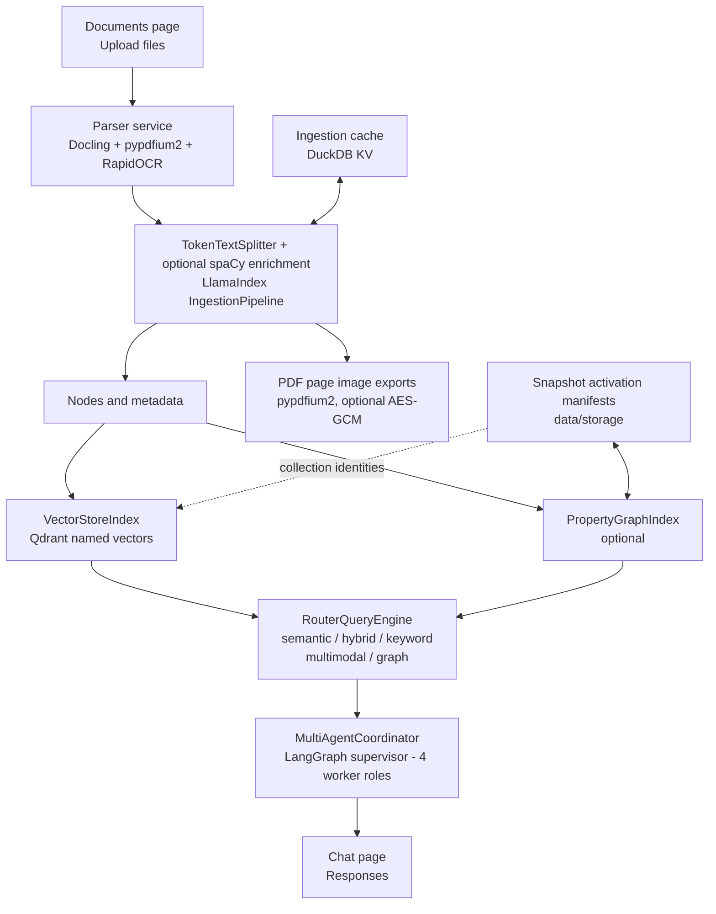

# 🧠 DocMind AI: Local LLM for AI-Powered Document Analysis


[](https://choosealicense.com/licenses/mit/)

**DocMind AI** is a local-first document analysis application. It combines dense and sparse retrieval, optional GraphRAG, multimodal page retrieval, and LangGraph-supervised analysis. Local parsing and retrieval are the default. An explicitly enabled remote language model endpoint crosses the local trust boundary.

Design goals:

- Privacy by default: remote endpoints are blocked unless explicitly allowed.
- Reproducibility: deterministic ingestion caching and snapshot manifests.
- Extensibility: `RouterQueryEngine` owns vector, hybrid, keyword, multimodal,
  and graph retrieval selection.

## ✨ Features of DocMind AI

- **Privacy-focused, local-first:** Remote LLM endpoints are blocked by default; enable explicitly when needed.
- **CPU-safe ingestion pipeline:** LlamaIndex `IngestionPipeline` fed by DocMind's local parser service: Docling conversion, pypdfium2 PDF inspection/rasterization, RapidOCR CPU OCR, `TokenTextSplitter`, and optional spaCy enrichment.
- **Multi-format parsing:** Docling covers PDFs and common office/HTML formats; only explicit text formats use the direct UTF-8 loader. Binary parser failures stop ingestion instead of decoding source bytes as text.
- **Hybrid retrieval with routing:** `RouterQueryEngine` with required
  `semantic_search` plus configured `hybrid_search`, `keyword_search`,
  `multimodal_search`, and `knowledge_graph` tools.
- **Qdrant server-side fusion:** Query API RRF (default) or DBSF over named vectors `text-dense` and `text-sparse`; sparse queries use FastEmbed BM42/BM25 when available.
- **Reranking and multimodal:** Text rerank uses a BGE cross-encoder; SigLIP reranks visual nodes.
- **Multi-agent coordination:** LangGraph supervisor orchestrates four agents (planner, retrieval, synthesis, validation); LlamaIndex owns retrieval routing.
- **Snapshots and reproducibility:** Qdrant owns live vectors; app snapshots bind
  immutable physical text/image collections to corpus/config hashes and package
  optional graph exports as JSONL/Parquet (Parquet requires PyArrow).
- **PDF page images:** pypdfium2 renders page images to WebP/JPEG; optional AES-GCM encryption with `.enc` outputs and just-in-time decryption for visual scoring.
- **ArtifactStore (multimodal durability):** Page images/thumbnails are stored as content-addressed `ArtifactRef(sha256, suffix)` (no base64 blobs or host paths in durable stores).
- **Multimodal UX:** Chat renders image sources and supports query-by-image “Visual search” (SigLIP) for image-rich PDFs.
- **Offline-first design:** Designed to run locally once models are present;
  remote endpoints must be explicitly enabled. The release benchmark does not
  claim independently measured zero egress.
- **GPU acceleration:** The optional NVIDIA profile accelerates PyTorch-based dense/image embeddings and reranking; sparse FastEmbed remains CPU-based. vLLM runs as an external OpenAI-compatible server.
- **Bounded model calls and logging:** Provider-native timeouts/retry controls and structured logging via Loguru.
- **Observability and operations:** Optional OTLP tracing/metrics plus JSONL telemetry; Docker and Compose included for local deployments.

## Table of Contents

- [🧠 DocMind AI: Local LLM for AI-Powered Document Analysis](#-docmind-ai-local-llm-for-ai-powered-document-analysis)
  - [✨ Features of DocMind AI](#-features-of-docmind-ai)
  - [Table of Contents](#table-of-contents)
  - [Get started with DocMind AI](#get-started-with-docmind-ai)
    - [Prerequisites](#prerequisites)
    - [Installation](#installation)
    - [Running the App](#running-the-app)
  - [Upgrade from v1](#upgrade-from-v1)
  - [Usage](#usage)
    - [Configure LLM Runtime (Settings page)](#configure-llm-runtime-settings-page)
    - [Ingest Documents and Build Snapshots (Documents page)](#ingest-documents-and-build-snapshots-documents-page)
    - [Chat with Documents (Chat page)](#chat-with-documents-chat-page)
    - [Analytics (optional)](#analytics-optional)
  - [API Usage Examples](#api-usage-examples)
    - [Programmatic Ingestion](#programmatic-ingestion)
    - [Programmatic Query (Router + Coordinator)](#programmatic-query-router--coordinator)
    - [Prompt Templates (developer API)](#prompt-templates-developer-api)
    - [Custom Configuration](#custom-configuration)
    - [Batch Document Processing](#batch-document-processing)
  - [Architecture](#architecture)
  - [Implementation Details](#implementation-details)
    - [Document Processing Pipeline](#document-processing-pipeline)
    - [Hybrid Retrieval Architecture](#hybrid-retrieval-architecture)
    - [Multi-Agent Coordination](#multi-agent-coordination)
    - [Performance Optimizations](#performance-optimizations)
  - [Configuration](#configuration)
    - [Understand `DOCMIND_*` provider variables](#understand-docmind_-provider-variables)
    - [Configuration Philosophy](#configuration-philosophy)
    - [Environment Variables](#environment-variables)
    - [Additional Configuration](#additional-configuration)
  - [Performance Defaults and Measurement](#performance-defaults-and-measurement)
    - [Configured Defaults](#configured-defaults)
    - [Measure Locally](#measure-locally)
    - [Retrieval \& Reranking Defaults](#retrieval--reranking-defaults)
      - [Operational Flags (local-first)](#operational-flags-local-first)
  - [Offline Operation](#offline-operation)
    - [Prerequisites for Offline Use](#prerequisites-for-offline-use)
    - [Prefetch Model Weights](#prefetch-model-weights)
    - [Snapshots \& Staleness](#snapshots--staleness)
    - [GraphRAG Exports \& Seeds](#graphrag-exports--seeds)
    - [Model Requirements](#model-requirements)
  - [Troubleshooting](#troubleshooting)
    - [Common Issues](#common-issues)
      - [1. Ollama Connection Errors](#1-ollama-connection-errors)
      - [2. GPU Not Detected](#2-gpu-not-detected)
      - [3. Model Download Issues](#3-model-download-issues)
      - [4. Memory Issues](#4-memory-issues)
      - [5. Document Processing Errors](#5-document-processing-errors)
      - [6. vLLM Server Connectivity Issues](#6-vllm-server-connectivity-issues)
      - [7. PyTorch Compatibility Issues](#7-pytorch-compatibility-issues)
      - [8. GPU memory issues](#8-gpu-memory-issues)
      - [9. Performance Validation](#9-performance-validation)
    - [Performance Optimization](#performance-optimization)
    - [Getting Help](#getting-help)
  - [How to Cite](#how-to-cite)
  - [Contributing](#contributing)
    - [Development Guidelines](#development-guidelines)
      - [Tests and CI](#tests-and-ci)
  - [License](#license)
  - [Observability](#observability)

## Get started with DocMind AI

### Prerequisites

- One supported LLM backend running locally: [Ollama](https://ollama.com/) (default), vLLM OpenAI-compatible server, LM Studio, or a llama.cpp server.

- Python `>=3.12,<3.14`; CPython 3.12.13 is the primary CI and container
  baseline, with a CPython 3.13.12 compatibility lane.

- (Optional) Docker and Docker Compose for containerized deployment.

- (Optional) An NVIDIA GPU and compatible driver for the locked CUDA 12.8 extra. Configure external vLLM hardware separately.

Linux x86_64 is the release-validated host platform. WSL2 and macOS paths are
best effort until they have dedicated CI coverage.

### Installation

1. **Clone the repository:**

   ```bash
   git clone https://github.com/BjornMelin/docmind-ai-llm.git
   cd docmind-ai-llm
   ```

2. **Install dependencies:**

   ```bash
   uv sync --frozen
   ```

   Install the optional observability extra for LlamaIndex OpenTelemetry instrumentation:

   ```bash
   uv sync --frozen --extra observability
   ```

   Searchable-PDF export is POSIX-only (Linux, macOS, or WSL2; native Windows
   is unsupported) and requires the OCRmyPDF and Tesseract executables:

   ```bash
   uv sync --frozen --extra searchable-pdf
   ```

   Prefetch the default retrieval and parser artifacts, then verify the parser
   manifests:

   ```bash
   uv run python tools/models/pull.py \
     --all \
     --cache_dir ./models_cache \
     --parser-defaults \
     --parser-cache-dir ./cache/models
   uv run python scripts/parser_health.py --check
   ```

   When a requested download's cache destination is omitted, the pull command
   bootstraps `.env` and uses `embedding.cache_folder` or
   `parsing.model_cache_dir`. Explicit `--cache_dir` and
   `--parser-cache-dir` values remain authoritative.

   Regenerate the schema 3 parser benchmark artifact after the code is frozen:

   ```bash
   uv run python scripts/benchmark_parsing.py \
     --generate-minimal-fixtures \
     --repeat 3 \
     --output docs/benchmarks/parser-runtime-validation.json
   ```

   The checked-in schema 3 artifact is bound to its clean source commit and
   runtime identity. The validation record, current baseline, and measurement
   limits live in `docs/developers/parser-runtime-validation.md`.

   Start loopback-only Qdrant and run the system gate when you need end-to-end validation:

   ```bash
   ./scripts/start_qdrant_local.sh
   DOCMIND_RUN_SYSTEM=1 \
     DOCMIND_QDRANT_SYSTEM_URL=http://127.0.0.1:6333 \
     uv run pytest tests/system/test_e2e_offline.py -q
   ```

   **Key Dependencies Included:**

   - **LlamaIndex Core (>=0.14.21,<0.15.0)**: Ingestion, retrieval, selectors, and query engines, with selected LLM, Hugging Face, Qdrant, and DuckDB adapters
   - **LangGraph (>=1.0.10,<2.0.0)**: Four-worker supervisor orchestration (graph-native `StateGraph`, no external supervisor wrapper)
   - **Streamlit (>=1.52.2,<2.0.0)**: Web interface framework
   - **Ollama (0.6.2)**: Local LLM integration
   - **Qdrant Client (>=1.15.1,<2.0.0)**: Vector database operations
   - **Docling (>=2.111,<3)**: Multi-format document conversion.
   - **pypdfium2 (>=5.7,<6)**: PDF inspection and page rasterization.
   - **RapidOCR (>=3.8,<4)**: CPU-safe local OCR using the locked wheel's hash-verified packaged models.
   - **FastEmbed (>=0.5.1)**: Direct CPU sparse query encoding
   - **Loguru (>=0.7.3,<1.0.0)**: Structured logging
   - **Pydantic (2.13.4)**: Data validation and settings.

3. **Install spaCy language model:**

   spaCy is bundled for optional **NLP enrichment** (sentence segmentation + entity extraction during ingestion). Install a language model if you plan to use enrichment:

   ```bash
   # Install the small English model (recommended, ~15MB)
   uv run python -m spacy download en_core_web_sm

   # Optional: Install larger models for better accuracy
   # Medium model (~50MB): uv run python -m spacy download en_core_web_md
   # Large model (~560MB): uv run python -m spacy download en_core_web_lg
   ```

   **Note:** spaCy models are downloaded and cached locally. The app does not auto-download models; install them explicitly for offline use.

   Optional configuration (defaults shown):

   ```bash
   # Enable/disable enrichment
   DOCMIND_SPACY__ENABLED=true
   # Pipeline name or path (blank fallback when missing)
   DOCMIND_SPACY__MODEL=en_core_web_sm
   # cpu|cuda|apple|auto (auto prefers CUDA, then Apple, else CPU)
   DOCMIND_SPACY__DEVICE=auto
   DOCMIND_SPACY__GPU_ID=0
   ```

   Cross-platform acceleration:

   - NVIDIA CUDA (validated on Linux x86_64): `uv sync --frozen --no-group cpu --extra gpu` and set `DOCMIND_SPACY__DEVICE=auto|cuda`; WSL2 is best effort
   - Apple Silicon (best effort, macOS arm64 with CPython 3.12): `uv sync --frozen --extra apple` and set `DOCMIND_SPACY__DEVICE=auto|apple`

   See `docs/specs/spec-015-nlp-enrichment-spacy.md` and `docs/developers/gpu-setup.md`.

4. **Set up environment configuration:**

   Copy the example environment file and configure your settings:

   ```bash
   cp .env.example .env
   # Edit .env with your preferred settings

   # Model names are backend-specific:
   #   - Ollama: use the local tag (e.g., qwen3:4b-instruct)
   #   - vLLM/LM Studio/llama.cpp: use the served model name
   # DOCMIND_LLM_REQUEST__MODEL is the optional model override for every backend.

   # Example - Ollama (local, default):
   #   DOCMIND_LLM_BACKEND=ollama
   #   DOCMIND_OLLAMA_BASE_URL=http://localhost:11434
   #   DOCMIND_LLM_REQUEST__MODEL=qwen3:4b-instruct

   # Example - LM Studio (local, OpenAI-compatible):
   #   DOCMIND_LLM_BACKEND=lmstudio
   #   DOCMIND_LMSTUDIO_BASE_URL=http://localhost:1234/v1
   #   DOCMIND_OPENAI__API_KEY=not-needed
   #   DOCMIND_LLM_REQUEST__MODEL=your_model_name

   # Example - vLLM OpenAI-compatible server:
   #   DOCMIND_LLM_BACKEND=vllm
   #   DOCMIND_VLLM_BASE_URL=http://localhost:8000/v1
   #   DOCMIND_OPENAI__API_KEY=not-needed
   #   DOCMIND_LLM_REQUEST__MODEL=Qwen/Qwen3-4B-Instruct-2507-FP8

   # Example - llama.cpp server:
   #   DOCMIND_LLM_BACKEND=llamacpp
   #   DOCMIND_LLAMACPP_BASE_URL=http://localhost:8080/v1
   #   DOCMIND_OPENAI__API_KEY=not-needed
   #   DOCMIND_LLM_REQUEST__MODEL=local-gguf

   # Offline-first recommended:
   #   HF_HUB_OFFLINE=1
   #   TRANSFORMERS_OFFLINE=1

   # Optional - OpenAI-compatible cloud or gateway (changes the privacy boundary):
   #   DOCMIND_LLM_BACKEND=openai_compatible
   #   DOCMIND_OPENAI__BASE_URL=https://api.openai.com/v1
   #   DOCMIND_OPENAI__API_KEY=sk-...
   #   DOCMIND_OPENAI__API_MODE=responses
   #   DOCMIND_SECURITY__ALLOW_REMOTE_ENDPOINTS=true
   ```

   Start llama.cpp as an OpenAI-compatible GGUF server:

   ```bash
   # CPU / portable baseline
   llama-server -m ./models/model.gguf --alias local-gguf \
     --ctx-size 8192 --host 127.0.0.1 --port 8080

   # CUDA or other GPU backends
   llama-server -m ./models/model.gguf --alias local-gguf \
     --ctx-size 8192 -ngl 999 -fa --host 127.0.0.1 --port 8080
   ```

   Use the `--alias` value as `DOCMIND_LLM_REQUEST__MODEL`, keep `/v1` in
   `DOCMIND_LLAMACPP_BASE_URL`, and bind to loopback unless remote access is
   explicitly required. For remote access, start `llama-server` with
   `--api-key` and configure `DOCMIND_OPENAI__API_KEY`.

   For a complete overview, see `docs/developers/configuration.md`. The relevant section is `LLM Backend Selection`.

5. **(Optional) Install NVIDIA support:**

   Replace the default CPU dependency group with the locked GPU extra. Native
   uv source rules select the official CUDA 12.8 PyTorch wheels. This
   accelerates dense/image embeddings, reranking, and spaCy; sparse FastEmbed
   remains CPU-based:

   ```bash
   nvidia-smi
   uv sync --frozen --no-group cpu --extra gpu
   uv run --no-sync python -c "import torch; print(torch.__version__); print(torch.cuda.is_available())"
   ```

   `--no-sync` is required for GPU validation commands. A plain `uv run`
   reconciles the environment to the default CPU profile before running.

   **Hardware guidance:**

   - Use an NVIDIA driver compatible with the locked CUDA 12.8 wheels
   - Size external vLLM hardware for its model and context settings

   **Notes:**

   - vLLM is supported via an external OpenAI-compatible server (see Troubleshooting section 6 for connectivity checks).
   - Validate the GPU profile with `uv run --no-sync python scripts/test_gpu.py --quick` and benchmark parsing with the reproducible harness below.

   See [GPU Setup Guide](docs/developers/gpu-setup.md) (installation) and [Hardware Policy](docs/developers/hardware_policy.md) (hardware/VRAM guidance).

### Running the App

**Locally:**

```bash
uv run streamlit run app.py
```

To use the repository's standard Streamlit launch options, run:

```bash
./scripts/run_app.sh
```

**With Docker (CPU):**

```bash
docker compose up --build -d
docker compose exec ollama ollama pull qwen3:4b-instruct
```

The base stack runs DocMind, Qdrant, and the bundled Ollama backend on CPU. It configures `DOCMIND_LLM_REQUEST__MODEL=qwen3:4b-instruct` unless you override that variable in the shell or `.env`. Pull the model once per Ollama volume, then open `http://localhost:8501`.

Use the NVIDIA override with Docker Compose v2 and the NVIDIA Container Toolkit:

```bash
docker compose -f docker-compose.yml -f docker-compose.gpu.yml up --build -d
docker compose exec ollama ollama pull qwen3:4b-instruct
```

The GPU override changes only Ollama's device reservation. DocMind keeps one bundled language model backend in both modes.

## Upgrade from v1

DocMind v2 is a forward-only application release, not a compatible Python
library update.

- Use a fresh repository checkout with `uv sync --frozen`, or rebuild the
  production container. When reusing a v1 checkout, repair the retired
  `typer-slim` overlap once with
  `uv sync --frozen --reinstall-package typer`. DocMind no longer publishes or
  supports a Python wheel.
- Construct `MultiAgentCoordinator` with keyword-only runtime seams. Call
  `process_query(query, *, settings_override, thread_id, user_id,
  checkpoint_id)`; model, backend, context-window, and default timeout policy
  come from canonical settings. Role tools under `src/agents/tools/` are
  internal graph details.
- Remove v1 DSPy/RAGAS integrations and obsolete no-op environment variables
  from local automation. Reconcile `.env` against the tracked `.env.example`;
  removed agent fallback, UI, cache-limit, monitoring-limit, and legacy
  GraphRAG knobs no longer change runtime behavior.
- Do not point v2 at retained pre-v2 data or Qdrant state when
  `data/.deployment-id` is absent. V2 cannot safely prove ownership of that
  state and does not adopt it in place. Preserve the old state and follow the
  [pre-v2 no-adoption procedure](docs/developers/operations-guide.md#preserve-activation-identity-and-journals).
  Never fabricate a deployment identity.
- Stop DocMind before the v2 upgrade. V1 stored raw public thread IDs, while v2 hashes each `(user_id, public_thread_id)` pair for LangGraph checkpoints. V2 has no checkpoint-key migration. Startup rejects a Chat DB that contains raw v1 checkpoint identities. Archive the database and its write-ahead log (WAL) sidecars, then let v2 create a fresh database:

  ```bash
  mkdir -p data/archive/v1-chat
  find data -maxdepth 1 -type f \
    \( -name 'chat.db' -o -name 'chat.db-wal' -o -name 'chat.db-shm' \) \
    -exec mv {} data/archive/v1-chat/ \;
  ```

  The one-shot legacy memory-table migration does not migrate checkpoints and is not a supported path for retaining v1 chat history.
- Back up retained data before upgrading. Builds that predate full-SHA document
  identity must also follow the
  [full-SHA ingestion migration](#full-sha-ingestion-identity-migration) and
  re-ingest their corpus.

## Usage

### Configure LLM Runtime (Settings page)

- Select the active provider (`ollama`, `vllm`, `lmstudio`, `llamacpp`, or `openai_compatible`).
- Set the optional model override, context window, output limit, temperature,
  timeout, and GPU acceleration preference.
- Model IDs are backend-specific (Ollama tags vs OpenAI-compatible model names).
- OpenAI-compatible base URLs are normalized to include `/v1` (LM Studio enforces `/v1`).
- When `DOCMIND_SECURITY__ALLOW_REMOTE_ENDPOINTS=false` (default), loopback hosts are always allowed, but non-loopback hosts must be allowlisted via `DOCMIND_SECURITY__ENDPOINT_ALLOWLIST` and must DNS-resolve to public IPs (private/link-local/reserved ranges are rejected).
- Set `DOCMIND_SECURITY__ALLOW_REMOTE_ENDPOINTS=true` to opt out (required for private/internal endpoints like Docker service hostnames).

### Ingest Documents and Build Snapshots (Documents page)

- Upload files in the Documents page.
- Optional toggles:
  - **Build GraphRAG (beta)** to create a PropertyGraphIndex when enabled.
  - **Encrypt page images (AES-GCM)** to store rendered PDF images as `.enc`.
- GraphRAG uses the required LlamaIndex core Property Graph API; the Settings
  page shows its runtime status.
- Ingestion builds new physical Qdrant text/image collections, then atomically
  activates their manifest and optional graph artifacts through
  `data/storage/CURRENT`.
- Snapshot activation never deletes Qdrant collections while readers may still
  use them. To inspect orphaned generations, stop every DocMind process and run
  `uv run python scripts/cleanup_collections.py --confirm-app-stopped`. The
  command is dry-run by default; review its deployment-scoped output before
  adding `--delete`.
- Graph exports (JSONL/Parquet) are available when a graph index exists.

### Chat with Documents (Chat page)

- The Chat page autoloads the latest snapshot per `graphrag_cfg.autoload_policy`.
- Stale snapshots trigger a warning; rebuild from the Documents page.
- Responses are generated via `MultiAgentCoordinator` and the router engine; the UI streams chunks for readability.

### Analytics (optional)

- Enable `DOCMIND_ANALYTICS_ENABLED=true` to use the Analytics page.
- Charts read from `data/analytics/analytics.duckdb` when query metrics are present.

## API Usage Examples

### Programmatic Ingestion

```python
from pathlib import Path

from src.models.processing import IngestionConfig, IngestionInput
from src.processing.ingestion_pipeline import ingest_documents_sync

cfg = IngestionConfig(cache_dir=Path("./cache/ingestion"))
inputs = [
    IngestionInput(
        document_id="doc-1",
        source_path=Path("path/to/document.pdf"),
        metadata={"source": "local"},
    )
]

result = ingest_documents_sync(cfg, inputs)
print(result.manifest.model_dump())
```

### Programmatic Query (Router + Coordinator)

```python
from llama_index.core import StorageContext, VectorStoreIndex

from src.agents.coordinator import MultiAgentCoordinator
from src.config import settings
from src.retrieval.router_factory import build_router_engine
from src.utils.storage import create_vector_store

# Requires Qdrant running and embeddings configured.
# Uses `result.nodes` from the ingestion example above.
store = create_vector_store(
    settings.database.qdrant_collection,
    enable_hybrid=settings.retrieval.enable_server_hybrid,
)
router = None
coord = None
try:
    storage_context = StorageContext.from_defaults(vector_store=store)
    vector_index = VectorStoreIndex(
        result.nodes,
        storage_context=storage_context,
        show_progress=False,
    )
    router = build_router_engine(vector_index, pg_index=None, settings=settings)
    coord = MultiAgentCoordinator()
    resp = coord.process_query(
        "Summarize the key findings and action items",
        settings_override={"router_engine": router},
    )
    print(resp.content)
finally:
    # Retire the loop-bound router before its store and coordinator-owned loop.
    if router is not None:
        router.close()
    store.client.close()
    if coord is not None:
        coord.close()
```

### Prompt Templates (developer API)

```python
from src.prompting import list_presets, list_templates, render_prompt

tpl = next(t for t in list_templates() if t.id == "comprehensive-analysis")
tones = list_presets("tones")
roles = list_presets("roles")
ctx = {
    "context": "Example context",
    "tone": tones["professional"],
    "role": roles["assistant"],
}
prompt = render_prompt(tpl.id, ctx)
print(prompt)
```

Templates live in `src/prompting/templates/prompts/*.prompt.md`. Presets are in
`src/prompting/templates/presets/*.yaml`. DocMind is a repository application,
not a published Python library; run it from the locked uv environment or image.

### Custom Configuration

```python
import os

from src.config.settings import DocMindSettings

os.environ["DOCMIND_LLM_BACKEND"] = "vllm"
os.environ["DOCMIND_LLM_REQUEST__MODEL"] = "Qwen/Qwen3-4B-Instruct-2507-FP8"
os.environ["DOCMIND_LLM_REQUEST__CONTEXT_WINDOW"] = "131072"
os.environ["DOCMIND_VLLM_BASE_URL"] = "http://localhost:8000/v1"
os.environ["DOCMIND_ENABLE_GPU_ACCELERATION"] = "true"

settings = DocMindSettings()
print(settings.llm_backend, settings.effective_model, settings.effective_context_window)
```

### Batch Document Processing

```python
from pathlib import Path

from src.models.processing import IngestionConfig, IngestionInput
from src.processing.ingestion_pipeline import ingest_documents_sync
from src.utils.hashing import document_id_from_sha256, sha256_file

folder = Path("/path/to/documents")
extensions = {".pdf", ".docx", ".txt", ".md", ".pptx", ".xlsx"}
paths = [p for p in folder.rglob("*") if p.suffix.lower() in extensions]

inputs = []
for path in paths:
    digest = sha256_file(path)
    inputs.append(
        IngestionInput(
            document_id=document_id_from_sha256(digest),
            source_path=path,
            metadata={"source": path.name},
        )
    )

result = ingest_documents_sync(IngestionConfig(cache_dir=Path("./cache/ingestion")), inputs)
print(f"Processed {len(result.nodes)} nodes from {len(inputs)} files")
```

### Full-SHA ingestion identity migration

Current file ingestion uses `doc-<full lowercase SHA-256>` plus the
`docmind_document_id` Qdrant payload key. This is a forward-only break from
older builds that used 16-character digest prefixes. There is no legacy ID
fallback, so old points are not replaced or deleted by a new ingestion run.

For an existing corpus, stop all writers, back up retained state, and then use
fresh Qdrant text and image collections (or explicitly remove the legacy
collections). Remove the old ingestion DuckDB cache and LlamaIndex docstore,
retire snapshots backed by the old collections, re-ingest every source, and
rebuild the active snapshot. Old chats or snapshots can retain legacy node and
artifact references; keep their backing data if historical rendering matters.
See [SPEC-002](docs/specs/spec-002-ingestion-pipeline.md#breaking-full-sha-identity-migration)
for the canonical checklist.

## Architecture


```mermaid
flowchart TD
    A["Documents page<br/>Upload files"] --> B["Parser service<br/>Docling + pypdfium2 + RapidOCR"]
    B --> C["TokenTextSplitter + optional spaCy enrichment<br/>LlamaIndex IngestionPipeline"]
    C --> D["Nodes and metadata"]
    D --> E["VectorStoreIndex<br/>Qdrant named vectors"]
    C --> F["PDF page image exports<br/>pypdfium2, optional AES-GCM"]
    D --> G["PropertyGraphIndex<br/>optional"]
    E --> H["RouterQueryEngine<br/>semantic / hybrid / keyword<br/>multimodal / graph"]
    G --> H
    H --> I["MultiAgentCoordinator<br/>LangGraph supervisor - 4 worker roles"]
    I --> J["Chat page<br/>Responses"]

    K["Snapshot activation manifests<br/>data/storage"] -.->|collection identities| E
    K <--> G
    L["Ingestion cache<br/>DuckDB KV"] <--> C
```

## Implementation Details

### Document Processing Pipeline

- **Parsing:** Uses one local CPU path in `src/processing/parsing/`: Docling, pypdfium2, and RapidOCR. Searchable-PDF export is a separate optional OCRmyPDF artifact step.
- **Failure boundary:** PDF and other binary parse failures raise a typed `DocumentParseError` before documents, nodes, page artifacts, or snapshots are published. The asynchronous boundary uses a killable worker process and a configured hard timeout. Direct UTF-8 fallback is limited to `.txt`, `.md`, `.markdown`, and `.rst` inputs.
- **Chunking:** `TokenTextSplitter` with configurable `chunk_size` and `chunk_overlap`.
- **NLP enrichment (optional):** spaCy sentence segmentation + entity extraction during ingestion; outputs are stored as safe node metadata (`docmind_nlp`). See `docs/specs/spec-015-nlp-enrichment-spacy.md`.
- **Caching:** DuckDB KV ingestion cache with optional docstore persistence.
- **PDF page images:** pypdfium2 renders page images; optional AES-GCM encryption and `.enc` handling.
- **Observability:** OpenTelemetry spans are recorded when observability is enabled.

### Hybrid Retrieval Architecture

- **Unified Text Embeddings:** BGE-M3 (BAAI/bge-m3) via LlamaIndex for dense vectors (1024D); sparse query vectors via FastEmbed BM42/BM25 when available.
- **Multimodal:** SigLIP visual scoring uses the shared pinned `src/utils/vision_siglip.py` loader.
- **Multimodal retrieval (PDF images):** `multimodal_search` fuses text hybrid with SigLIP text→image retrieval over a dedicated Qdrant image collection and returns image-bearing sources for rendering.
- **Fusion:** Server-side RRF via Qdrant Query API when `DOCMIND_RETRIEVAL__ENABLE_SERVER_HYBRID=true` (DBSF optional).
- **Deduplication:** Configurable key via `DOCMIND_RETRIEVAL__DEDUP_KEY` (page_id|doc_id); default = `page_id`.
- **Router composition:** `src/retrieval/router_factory.py` always registers
  `semantic_search` and conditionally adds `hybrid_search`, `keyword_search`,
  `multimodal_search`, and `knowledge_graph`. LlamaIndex's native
  `RouterQueryEngine` owns selection. Graph search requires a supplied, healthy
  `PropertyGraphIndex`; the GraphRAG setting controls the ingestion default.

- **Storage:** Qdrant vector database with metadata filtering and concurrent access

### Multi-Agent Coordination

- **Supervisor Pattern:** LangGraph `StateGraph` supervisor (repo-local implementation in `src/agents/supervisor_graph.py`) with checkpoint/store support

- **Four worker roles:**

  - **Query Planner:** Decomposes complex queries into manageable sub-tasks for better processing
  - **Retrieval Expert:** Delegates strategy selection to LlamaIndex's native `RouterQueryEngine`, including server-side hybrid and optional GraphRAG
  - **Result Synthesizer:** Combines and reconciles results from multiple retrieval passes with deduplication
  - **Response Validator:** Validates response quality, accuracy, and completeness before final output

- **Enhanced Capabilities:** Optional GraphRAG for multi-hop reasoning

- **Workflow Coordination:** `src/agents/supervisor_graph.py` coordinates the
  workers, `src/agents/tools/retrieval.py` owns the retrieval tool boundary, and
  `src/retrieval/router_factory.py` constructs the native retrieval router.
- **Session State:** Streamlit session state holds chat history; snapshots persist
  activation metadata and optional graph artifacts.

- **Async Execution:** Concurrent agent operations with bounded timeouts and explicit error responses

### Performance Optimizations

- **GPU Acceleration:** The optional NVIDIA profile accelerates PyTorch-based
  dense/image embeddings and reranking; sparse FastEmbed remains CPU-based.
  vLLM runs as an external OpenAI-compatible server.
- **Async processing:** Asynchronous ingestion is supported. The router owns the total request deadline; reranking stages are bounded and fail open, while storage clients own retrieval timeouts.
- **Reranking:** A text cross-encoder and SigLIP visual stage merge results with rank-level RRF.
- **Memory Management:** Device selection and VRAM checks are centralized in `src/utils/core.py`.

## Configuration

DocMind AI uses a unified Pydantic Settings model (`src/config/settings.py`). Environment variables use the `DOCMIND_` prefix with `__` for nested fields. The Streamlit entrypoint calls `bootstrap_settings()` to load `.env` (no import-time `.env` IO).

### Understand `DOCMIND_*` provider variables

DocMind’s `DOCMIND_*` variables configure the **application** (routing, security, and provider selection) and are intentionally separate from provider/server variables such as `OLLAMA_*`, `OPENAI_*`, or `VLLM_*` that control those services directly. Keeping a single, app-scoped config surface:

- avoids collisions with provider/daemon env vars on the same machine,
- keeps security policy (remote endpoint allowlisting) centralized, and
- ensures consistent behavior across backends.

Use `DOCMIND_OLLAMA_API_KEY` for Ollama Cloud access; `OLLAMA_*` remains reserved for the Ollama server/CLI itself.

### Configuration Philosophy

Configuration is centralized and strongly typed. Prefer `.env` overrides and keep runtime toggles in one place for repeatable local runs.

### Environment Variables

DocMind AI uses environment variables for configuration. Copy the example file and customize:

```bash
cp .env.example .env
```

Key configuration options in `.env`:

```bash
# LLM backend
DOCMIND_LLM_BACKEND=ollama
DOCMIND_OLLAMA_BASE_URL=http://localhost:11434
# Optional (Ollama Cloud / web search)
# DOCMIND_OLLAMA_API_KEY=
# DOCMIND_OLLAMA_ENABLE_WEB_SEARCH=false
# DOCMIND_OLLAMA_ENABLE_LOGPROBS=false
# DOCMIND_OLLAMA_TOP_LOGPROBS=0
# DOCMIND_LLM_BACKEND=vllm
# DOCMIND_LLM_REQUEST__MODEL=Qwen/Qwen3-4B-Instruct-2507-FP8
# DOCMIND_LLM_REQUEST__CONTEXT_WINDOW=131072
# DOCMIND_LLM_REQUEST__MAX_OUTPUT_TOKENS=2048
# DOCMIND_LLM_REQUEST__TEMPERATURE=0.1
# DOCMIND_VLLM_BASE_URL=http://localhost:8000/v1

# Embeddings
DOCMIND_EMBEDDING__MODEL_NAME=BAAI/bge-m3
# Optional: only set when pinning a custom SigLIP model to a matching revision.
# The default SigLIP model uses DocMind's curated revision automatically.
# DOCMIND_EMBEDDING__SIGLIP_MODEL_REVISION=7fd15f0689c79d79e38b1c2e2e2370a7bf2761ed

# Retrieval / reranking
# The model default is false; the starter configuration opts into Qdrant hybrid.
DOCMIND_RETRIEVAL__ENABLE_SERVER_HYBRID=true
DOCMIND_RETRIEVAL__FUSION_MODE=rrf
DOCMIND_RETRIEVAL__USE_RERANKING=true
DOCMIND_RETRIEVAL__RERANKING_TOP_K=5

# Cache
DOCMIND_CACHE__DIR=./cache
DOCMIND_CACHE__FILENAME=docmind.duckdb

# GraphRAG ingestion default
DOCMIND_GRAPHRAG_CFG__ENABLED=false

# GPU and security toggles
DOCMIND_ENABLE_GPU_ACCELERATION=true
DOCMIND_SECURITY__ALLOW_REMOTE_ENDPOINTS=false
```

See the complete [.env.example](.env.example) file for all available configuration options.

### Additional Configuration

**Streamlit UI Configuration**:

The tracked `.streamlit/config.toml` disables Streamlit usage statistics by
default. Add local theme or server overrides to that file when needed:

```toml
[theme]
base = "light"
primaryColor = "#FF4B4B"

[server]
maxUploadSize = 200
```

**Cache Configuration**:

- Ingestion cache: DuckDB KV store under `./cache/ingestion/docmind.duckdb`
  (see `DOCMIND_CACHE__DIR` and `DOCMIND_CACHE__FILENAME`).
- PDF page images: rendered under `./cache/page_images/` and stored durably as content-addressed artifacts under `./data/artifacts/` by default.
- Model weights: cached via Hugging Face defaults (`~/.cache/huggingface`).

## Performance Defaults and Measurement

> **Note**: Performance depends on hardware, model size, and corpus size. Use the scripts below to measure on your machine.

### Configured Defaults

- Rerank timeouts: text 250 ms, SigLIP 150 ms, total budget 400 ms (`DOCMIND_RETRIEVAL__*`).
- Coordination overhead target: 200ms (`COORDINATION_OVERHEAD_THRESHOLD` in `src/agents/coordinator.py`).
- Context cap: 131072 by default, max 200000
  (`DOCMIND_LLM_REQUEST__CONTEXT_WINDOW`).
- Hardware capacity is measured by `scripts/test_gpu.py`; it is not represented
  by application configuration thresholds.

### Measure Locally

- `uv run python scripts/benchmark_parsing.py --generate-minimal-fixtures --output cache/benchmarks/parsing/results.json`
- `uv run --no-sync python scripts/test_gpu.py --quick`

Compare parser benchmark JSON only across equivalent hardware, model caches,
fixtures, and clean commits. Missing samples or baselines are not a passing
performance result.

### Retrieval & Reranking Defaults

- Hybrid retrieval uses Qdrant named vectors `text-dense` (1024D COSINE; BGE-M3) and `text-sparse` (FastEmbed BM42/BM25 + IDF) when `DOCMIND_RETRIEVAL__ENABLE_SERVER_HYBRID=true`.
- Default fusion is RRF; DBSF is available with `DOCMIND_RETRIEVAL__FUSION_MODE=dbsf`.
- Prefetch defaults: dense 200, sparse 400; `fused_top_k=60`; `page_id` de-dup.
- Reranking is enabled by default: BGE v2-m3 for text and SigLIP for visual nodes. Timeouts fail open.
- Feature flags (hybrid, reranking) are env-only; RRF K and timeouts are adjustable in the Settings page.
- Router parity: semantic, hybrid, multimodal, and graph query engines apply the
  configured reranking policy through native LlamaIndex `node_postprocessors`.

#### Operational Flags (local-first)

- `HF_HUB_OFFLINE=1` and `TRANSFORMERS_OFFLINE=1` to prevent Hugging Face and Transformers downloads after prefetch.
- `DOCMIND_RETRIEVAL__FUSION_MODE=rrf|dbsf` to control Qdrant fusion.
- `DOCMIND_RETRIEVAL__USE_RERANKING=true|false` (canonical env override).
- LLM base URLs are validated when `DOCMIND_SECURITY__ALLOW_REMOTE_ENDPOINTS=false`: loopback is always allowed; allowlisted non-loopback hosts are DNS-resolved and rejected if they map to private/link-local/reserved ranges.

## Offline Operation

DocMind can run offline after you install dependencies and prefetch every required model. Remote language model endpoints and optional web tools require explicit configuration and cross the local trust boundary.

### Prerequisites for Offline Use

1. **Install Ollama locally:**

   ```bash
   # Download from https://ollama.com/download
   ollama serve  # Start the service
   ```

2. **Pull required models:**

   ```bash
   ollama pull qwen3:4b-instruct
   ollama pull qwen2:7b  # Alternative lightweight model
   ```

3. **Verify GPU setup (optional):**

   ```bash
   nvidia-smi  # Check GPU availability
   uv run --no-sync python scripts/test_gpu.py --quick  # Validate CUDA setup
   ```

### Prefetch Model Weights

Run once (online) to predownload required models for offline use:

```bash
uv run python tools/models/pull.py \
  --all \
  --cache_dir ./models_cache \
  --parser-defaults \
  --parser-cache-dir ./cache/models
```

`--all` stores four pinned snapshots in one Hugging Face cache: BGE-M3, BM42, the BGE reranker, and SigLIP.

### Snapshots & Staleness

DocMind snapshots atomically activate immutable physical Qdrant collections and
optional property-graph artifacts. Qdrant backups own point-in-time vectors.

- `manifest.meta.json` includes `collections.text`, `collections.image`, optional
  immutable collection metadata, schema/persist versions, corpus/config hashes,
  component versions, graph type, and optional graph exports.
- Hashing: `corpus_hash` computed with POSIX relpaths relative to a stable base dir (the Documents UI uses `uploads/`) for OS-agnostic stability.
- Chat autoload: the Chat page loads only the non-stale snapshot referenced by
  `CURRENT`; invalid or missing pointers fail closed and require a rebuild.
- Retention deletes only old, complete snapshot manifest directories and always
  preserves `CURRENT`. It never deletes Qdrant collections. After stopping every
  reader and writer, inspect deployment-owned orphan generations with
  `scripts/cleanup_collections.py` and add `--delete` only after reviewing the dry run.

### GraphRAG Exports & Seeds

- Graph exports preserve relation labels when provided by `get_rel_map` (fallback label `related`). Exports: JSONL baseline (portable) and Parquet (optional, requires PyArrow). Export seeding follows a retriever-first policy: graph -> vector -> deterministic fallback.

Set env for offline operation:

```bash
export HF_HUB_OFFLINE=1
export TRANSFORMERS_OFFLINE=1
```

### Model Requirements

Model sizing depends on your hardware and chosen backend. See [Hardware Policy](docs/developers/hardware_policy.md) for device and VRAM guidance.

## Troubleshooting

### Common Issues

#### 1. Ollama Connection Errors

```bash
# Check if Ollama is running
curl http://localhost:11434/api/version

# If not running, start it
ollama serve
```

#### 2. GPU Not Detected

```bash
# Install GPU dependencies
uv sync --frozen --no-group cpu --extra gpu

# Verify CUDA installation
nvidia-smi
uv run --no-sync python -c "import torch; print(torch.cuda.is_available())"
```

The CPU group and GPU extra are mutually exclusive; uv selects their official
wheel indexes from the lockfile.

#### 3. Model Download Issues

```bash
# Pull models manually
ollama pull qwen3:4b-instruct
ollama pull qwen2:7b  # Alternative
ollama list  # Verify installation
```

#### 4. Memory Issues

- Reduce context size in Settings (131072 → 65536 → 32768 → 4096)

- Use smaller models (4B instead of 7B/14B for lower VRAM)

- Adjust chunking via `DOCMIND_PROCESSING__CHUNK_SIZE` and `DOCMIND_PROCESSING__CHUNK_OVERLAP`

- Close other applications to free RAM

#### 5. Document Processing Errors

```bash
# Smoke test ingestion (no external services)
uv run python scripts/run_ingestion_demo.py

# If a specific file fails in the UI, reproduce via a targeted ingest:
uv run python -c "from pathlib import Path; from src.models.processing import IngestionConfig, IngestionInput; from src.processing.ingestion_pipeline import ingest_documents_sync; p=Path('path/to/problem-file.pdf'); r=ingest_documents_sync(IngestionConfig(cache_dir=Path('./cache/ingestion-debug')), [IngestionInput(document_id='debug', source_path=p, metadata={'source': p.name})]); print(f'nodes={len(r.nodes)} exports={len(r.exports)}')"
```

#### 6. vLLM Server Connectivity Issues

```bash
# Confirm the app is pointing at the right server
echo "$DOCMIND_LLM_BACKEND"
echo "$DOCMIND_OPENAI__BASE_URL"

# vLLM is OpenAI-compatible; this should return JSON.
curl --fail --silent "$DOCMIND_OPENAI__BASE_URL/models" | head
```

Notes:

- vLLM does not support Windows natively; use WSL2 or run vLLM on a Linux host.
- vLLM performance features (FlashInfer, FP8 KV cache) are configured on the vLLM server process, not inside this app.

#### 7. PyTorch Compatibility Issues

This repo pins **PyTorch 2.11.0** for reproducibility. The default sync installs
official CPU wheels. For the locked CUDA 12.8 wheel set:

```bash
uv sync --frozen --no-group cpu --extra gpu
uv run --no-sync python -c "import torch; print(torch.__version__); print(torch.cuda.is_available())"
```

#### 8. GPU memory issues

```bash
# Reduce external vLLM memory use in its server configuration

# Monitor GPU memory usage
nvidia-smi --query-gpu=memory.used,memory.total --format=csv --loop=1

# Clear GPU memory cache
uv run --no-sync python -c "import torch; torch.cuda.empty_cache()"
```

#### 9. Performance Validation

```bash
# Run the reproducible parser benchmark
uv run python scripts/benchmark_parsing.py \
  --generate-minimal-fixtures \
  --output cache/benchmarks/parsing/results.json
```

### Performance Optimization

1. **Enable GPU acceleration** in the Settings page
2. **Use appropriate model sizes** for your hardware
3. **Enable caching** to speed up repeat analysis
4. **Adjust chunk sizes** based on document complexity
5. **Use hybrid search** for better retrieval quality

### Getting Help

- Check logs in `logs/` directory for detailed errors

- Review [troubleshooting FAQ](docs/user/troubleshooting-faq.md)

- Search existing [GitHub Issues](https://github.com/BjornMelin/docmind-ai-llm/issues)

- Open a new issue with: steps to reproduce, error logs, system info

- Review the [support policy](SUPPORT.md). Report vulnerabilities through the
  private process in [SECURITY.md](SECURITY.md), not a public issue.

## How to Cite

If you use DocMind AI in your research or work, please cite it as follows:

```bibtex
@software{melin_docmind_ai_2026,
  author = {Melin, Bjorn},
  title = {DocMind AI: Local LLM for AI-Powered Document Analysis},
  url = {https://github.com/BjornMelin/docmind-ai-llm},
  version = {1.0.0},
  year = {2026}
}
```

## Contributing

Contributions are welcome! Please follow these steps:

1. **Fork the repository** and create a feature branch
2. **Set up development environment:**

   ```bash
   git clone https://github.com/your-username/docmind-ai-llm.git
   cd docmind-ai-llm
   uv sync --group dev
   ```

3. **Make your changes** following the established patterns
4. **Run tests and linting:**

   ```bash
   # Lint & format
   uv run ruff format .
   uv run ruff check . --fix
   uv run pyright --threads 4

   # Fast validation (unit + integration)
   uv run pytest tests/unit tests/integration -q --no-cov

   # Coverage gate
   uv run pytest tests/unit tests/integration -q \
     --cov=src \
     --cov-branch \
     --cov-report=term-missing \
     --cov-report=html:htmlcov \
     --cov-report=xml:coverage.xml \
     --cov-report=json:coverage.json \
     --cov-fail-under=80 \
     --junitxml=junit.xml

   # Documentation and schema contracts
   uv run python scripts/check_links.py
   uv run python scripts/verify_structural_parity.py
   uv run python scripts/validate_schemas.py
   ```

5. **Submit a pull request** with clear description of changes

### Development Guidelines

- Follow PEP 8 style guide (enforced by Ruff)

- Add type hints for all functions

- Include docstrings for public APIs

- Write tests for new functionality

- Update documentation as needed

#### Tests and CI

We use a tiered test strategy with offline configuration and deterministic
local fixtures. These gates do not claim a process-level zero-egress proof:

- Unit (fast, offline): mocks only; no network/GPU.
- Integration (offline): component interactions; router uses a session-autouse MockLLM fixture in `tests/integration/conftest.py`, preventing any Ollama/remote calls.
- E2E (required in CI): deterministic application workflows with service
  boundaries mocked.
- System (required in CI): direct-text parsing plus a real Qdrant
  ingest-index-query roundtrip.

Local test commands:

```bash
# Unit and integration sweep (offline)
uv run pytest tests/unit tests/integration -q --no-cov

# Unit and integration coverage gate
uv run pytest tests/unit tests/integration -q \
  --cov=src \
  --cov-branch \
  --cov-report=term-missing \
  --cov-report=html:htmlcov \
  --cov-report=xml:coverage.xml \
  --cov-report=json:coverage.json \
  --cov-fail-under=80 \
  --junitxml=junit.xml

# Targeted module or pattern
uv run pytest tests/unit/persistence/test_snapshot_manager.py -vv --no-cov
```

Default Pytest invocations run without implicit coverage gates. Pass the explicit coverage options when you need terminal, HTML, XML, JSON, or JUnit artifacts.

CI runs Ruff, Pyright, the enabled E2E suite, the Qdrant system smoke,
container validation, and the unit/integration coverage gate. See ADR-014 for quality
gates and ADR-029 for the boundary-first testing strategy.

See the [Developer Handbook](docs/developers/developer-handbook.md) for detailed guidelines. For an overview of the unit test layout and fixture strategy, see tests/README.md.

## License

This project is licensed under the MIT License - see the [LICENSE](LICENSE) file for details.

## Observability

DocMind AI configures OpenTelemetry tracing and metrics via `configure_observability` (see SPEC-012).

- Observability is disabled by default; enable with `DOCMIND_OBSERVABILITY__ENABLED=true`.
- OTLP exporters are used when enabled; set `DOCMIND_OBSERVABILITY__ENDPOINT` and `DOCMIND_OBSERVABILITY__PROTOCOL` as needed.
- LlamaIndex instrumentation requires the `observability` extra (`uv sync --frozen --extra observability`).
- Core spans cover ingestion runs, snapshot operations, GraphRAG exports, router construction, and UI actions.
- Local JSONL records retrieval backend/outcome, `export_performed`, and
  `snapshot_stale_detected`. The `router_selected` signal is an OpenTelemetry
  router-construction event, not a per-query JSONL event.

For a local metrics smoke test, run:

```bash
uv run python scripts/demo_metrics_console.py
```

Use `tests/unit/telemetry/test_observability_config.py` as a reference for wiring custom exporters in extensions.

---

<div align="center">

Built by [Bjorn Melin](https://bjornmelin.io)

</div>
