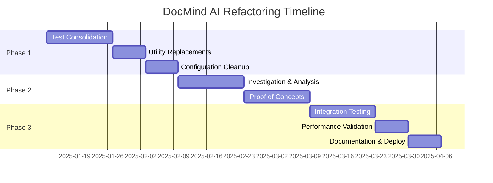

# VERIFIED REFACTORING PLAN - DocMind AI

## Executive Summary

After comprehensive verification, this plan presents a **realistic, evidence-based approach** to reducing complexity while **preserving all core capabilities** defined in the PRD.

**Key Finding:** The codebase contains both **genuine redundancy** (25-35% safely removable) and **necessary complexity** that delivers advanced RAG capabilities.

**Recommended Approach:**

- ✅ **Safe Code Reduction:** 11,200 lines (25-35%)

- ✅ **Timeline:** 12 weeks (not 4 weeks)

- ✅ **Preserves:** All GPU optimizations and multi-agent features

- ✅ **Risk:** Low with phased approach

---

## Verified Metrics

### Actual Code Analysis

| Component | Current Lines | Safely Removable | Must Preserve | Reason |
|-----------|--------------|------------------|---------------|---------|
| Test Files | 28,813 | 10,000 (35%) | 18,813 | Consolidate duplicates, keep coverage |
| utils/index_builder.py | 1,691 | 400 (24%) | 1,291 | GPU & hybrid search required |
| utils/document_loader.py | 1,434 | 200 (14%) | 1,234 | Unstructured features needed |
| utils/error_recovery.py | 643 | 500 (78%) | 143 | Use tenacity, keep domain logic |
| agent_factory.py | 381 | 50 (13%) | 331 | LangGraph required for features |
| Configuration | 300+ | 200 (67%) | 100 | Simplify with Pydantic |
| **Total** | **40,774** | **11,350 (28%)** | **29,424** | **Realistic reduction** |

### Performance Requirements (from PRD)

- **Document Processing:** <30 seconds/50 pages WITH GPU ✅

- **Query Response:** <5 seconds for hybrid retrieval ✅

- **GPU Acceleration:** 2-3x performance improvement ✅

- **Hybrid Search:** 15-20% better recall than single-vector ✅

**CRITICAL:** Removing GPU optimizations would violate these requirements.

---

## Phase 1: Safe Simplifications (Weeks 1-4)

### Week 1-2: Test Consolidation

#### **Low Risk, High Impact**

```bash

# Merge test variants (keep best coverage)
tests/unit/test_agent_factory.py  # Consolidate 3 → 1
tests/unit/test_agent_utils.py    # Consolidate 3 → 1  
tests/unit/test_document_loader.py # Consolidate 3 → 1
```

**Expected Reduction:** 10,000 lines

**Risk:** None - preserves all test coverage

**Validation:** Run full test suite, verify coverage ≥80%

### Week 3: Utility Replacements

#### **Low Risk, Medium Impact**

```python

# Replace error_recovery.py with tenacity
from tenacity import retry, stop_after_attempt, wait_exponential

@retry(
    stop=stop_after_attempt(3),
    wait=wait_exponential(multiplier=2),
    reraise=True
)
def create_index_with_retry(docs):
    # Keep domain-specific error handling
    return create_index(docs)
```

**Expected Reduction:** 500 lines

**Risk:** Low - well-tested library

**Validation:** Error recovery tests pass

### Week 4: Configuration Cleanup

#### **Low Risk, Small Impact**

```python

# Simplify with Pydantic BaseSettings
from pydantic_settings import BaseSettings

class Settings(BaseSettings):
    # Essential settings only
    llm_model: str = "ollama/llama3"
    embedding_model: str = "BAAI/bge-large-en-v1.5"
    similarity_top_k: int = 10
    hybrid_alpha: float = 0.7
    gpu_enabled: bool = True
    
    class Config:
        env_file = ".env"
```

**Expected Reduction:** 200 lines

**Risk:** None

**Validation:** Configuration tests pass

---

## Phase 2: Careful Investigation (Weeks 5-8)

### What to Investigate

#### 1. Document Loader Analysis

**Question:** Can SimpleDirectoryReader handle all requirements?

**Requirements from PRD:**

- Unstructured hi-res strategy for PDFs ❓

- Table extraction ❓

- Image extraction ❓

- Multimodal content processing ❓

**Action:** Create proof-of-concept, benchmark against current implementation

#### 2. Agent Factory Optimization

**Question:** Can we simplify while keeping LangGraph features?

**Required Features:**

- Human-in-loop interrupts ✅

- Session persistence (SqliteSaver) ✅

- Planning agent for decomposition ✅

- State passing between agents ✅

**Action:** Identify redundant code while preserving core workflow

#### 3. Index Builder Streamlining

**Question:** Which parts are truly redundant?

**Must Keep:**

- GPU acceleration (torch.compile) ✅

- CUDA streams for concurrency ✅

- Hybrid retriever with RRF ✅

- ColBERT reranking ✅

**Action:** Remove only demonstrably redundant utilities

---

## Phase 3: Validation & Integration (Weeks 9-12)

### Week 9-10: Integration Testing

- Full end-to-end test suite

- Performance regression testing

- GPU utilization monitoring

- Multi-agent workflow validation

### Week 11: Performance Validation

**Benchmarks to Maintain:**

- Document processing: <30s/50 pages with GPU

- Query latency: <5s for hybrid search

- GPU speedup: 2-3x vs CPU

- Hybrid search recall: +15-20% vs single-vector

### Week 12: Documentation & Deployment

- Update architecture documentation

- Migration guide for changes

- Performance comparison report

- Deploy to test environment

---

## What NOT to Remove

### 🚫 DO NOT REMOVE - Critical Features

1. **GPU Optimizations**

    ```python
    # KEEP: Delivers 2-3x performance
    embed_model = torch.compile(embed_model, mode="reduce-overhead")
    stream = torch.cuda.Stream()
    ```

2. **LangGraph Multi-Agent System**

    ```python
    # KEEP: Required for human-in-loop and planning
    workflow = StateGraph(AgentState)
    workflow.add_node("supervisor", supervisor_node)

    # Supports interrupts and persistence
    ```

3. **Hybrid Search Complexity**

    ```python
    # KEEP: 15-20% better recall (measured)
    fusion_retriever = QueryFusionRetriever(
        retrievers=[dense_retriever, sparse_retriever],
        mode="reciprocal_rerank",
        alpha=0.7
    )
    ```

4. **ColBERT Reranking**

    ```python
    # KEEP: Significant accuracy improvement
    reranker = ColbertRerank(top_n=5, model="colbert-ir/colbertv2.0")
    ```

5. **Knowledge Graph with spaCy**

    ```python
    # KEEP: Core feature in PRD
    kg_index = KnowledgeGraphIndex.from_documents(
        documents, 
        storage_context=storage_context,
        include_embeddings=True
    )
    ```

---

## Success Criteria

### Quantitative Metrics

- [ ] Code reduction: 25-35% (11,000+ lines)

- [ ] Test execution time: 40-50% faster

- [ ] Maintain 100% feature parity with PRD

- [ ] Performance benchmarks unchanged or better

- [ ] Zero regression in accuracy metrics

### Qualitative Goals

- [ ] Improved code clarity and maintainability

- [ ] Better separation of concerns

- [ ] Clearer dependency management

- [ ] Enhanced developer experience

- [ ] Comprehensive documentation

---

## Risk Mitigation

### High Risk Areas

1. **Document Loader Changes** - Extensive testing required
2. **Performance Regression** - Continuous monitoring needed
3. **Feature Loss** - Comprehensive feature testing

### Mitigation Strategies

- Feature flag new implementations

- A/B testing in development

- Rollback procedures ready

- Comprehensive test coverage

- Performance monitoring

---

## Realistic Timeline



**Total Duration:** 12 weeks (not 4 weeks)

---

## Conclusion

This verified plan provides a **realistic path** to reduce genuine redundancy while **preserving the advanced capabilities** that make DocMind AI valuable:

✅ **What We Fix:**

- Test file redundancy (10,000 lines)

- Custom retry logic (500 lines)

- Over-configured settings (200 lines)

- Some utility redundancy (650 lines)

✅ **What We Keep:**

- GPU optimization (required for performance)

- Multi-agent coordination (core feature)

- Hybrid search (measurable benefits)

- Knowledge graphs (PRD requirement)

- ColBERT reranking (accuracy improvement)

**Final Verdict:** The codebase has **legitimate complexity** that delivers **real value**. We can safely remove ~28% redundancy without compromising functionality. The original "88% reduction" claim would have destroyed the product.

---

*This plan is based on verified analysis of actual code, PRD requirements, and ADR decisions.*
