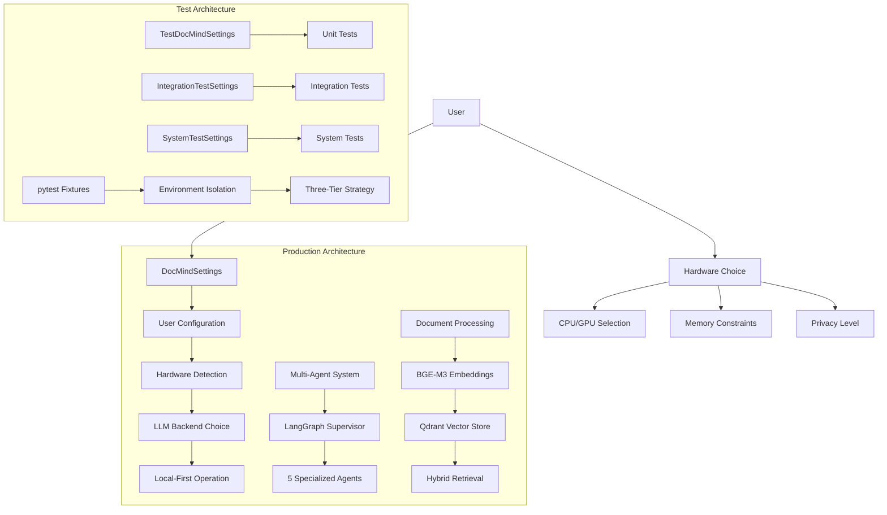
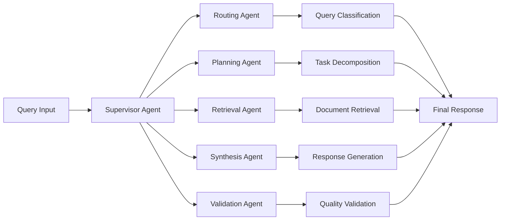
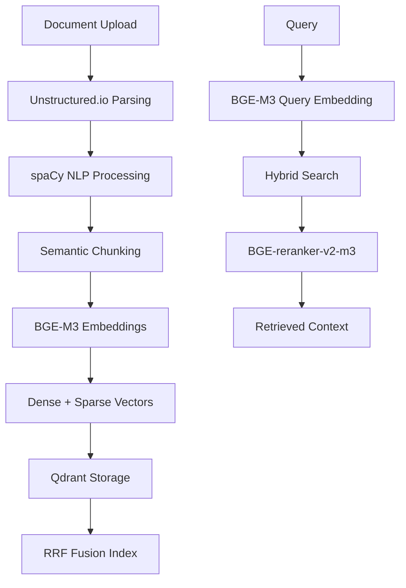
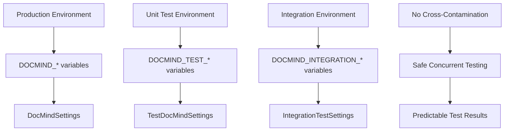

# Architecture Overview: Production and Test Systems

## Overview

DocMind AI implements a **dual-architecture** approach that provides complete separation between production and test systems while maintaining clean, maintainable code. The architecture emphasizes **local-first operation**, **user choice**, and **hardware adaptability** for maximum flexibility and privacy.

## System Architecture Diagram



## Production Architecture

### Core Principles

#### Local-First Design (ADR-004)

- **Complete Offline Operation**: No external API dependencies required
- **Local Model Storage**: Users can store models locally for maximum privacy
- **Privacy Control**: Users choose data sharing and performance logging levels
- **Hardware Adaptability**: Scales from student laptops to research workstations

#### User Choice Framework (ADR-024)

- **Hardware Flexibility**: CPU-only to high-end GPU configurations
- **Backend Options**: Ollama, vLLM, OpenAI-compatible, llama.cpp
- **Performance Tiers**: Auto-scaling from low to high performance
- **Privacy Settings**: Complete control over logging and data retention

### Configuration Architecture

#### Unified Settings Pattern

```python
class DocMindSettings(BaseSettings):
    """Unified configuration with full user flexibility."""
    
    model_config = SettingsConfigDict(
        env_file=".env",
        env_prefix="DOCMIND_",
        env_nested_delimiter="__",
        case_sensitive=False,
        extra="forbid",
    )
    
    # === USER HARDWARE FLEXIBILITY ===
    enable_gpu_acceleration: bool = Field(
        default=True,
        description="User can disable GPU if not available or prefer CPU-only"
    )
    max_vram_gb: float = Field(
        default=14.0, ge=1.0, le=80.0,
        description="User VRAM limit (RTX 4090: 16GB, RTX 3060: 12GB, etc.)"
    )
    
    # === LLM BACKEND CHOICE ===
    llm_backend: str = Field(
        default="ollama",
        description="User LLM backend: 'ollama', 'vllm', 'openai', 'llama_cpp'"
    )
    
    # === CONTEXT WINDOW FLEXIBILITY ===
    context_window_size: int = Field(
        default=8192,  # Conservative default for broader hardware support
        ge=2048,       # Minimum for basic functionality
        le=131072,     # 128K max for high-end hardware
        description="User's context window based on available memory"
    )
```

#### Hardware Adaptation Logic

```python
def get_user_hardware_info(self) -> dict[str, Any]:
    """Get user hardware configuration summary."""
    return {
        "enable_gpu_acceleration": self.enable_gpu_acceleration,
        "device": self.device,
        "performance_tier": self.performance_tier,
        "max_memory_gb": self.max_memory_gb,
        "max_vram_gb": self.max_vram_gb,
        "embedding_device": self._get_embedding_device(),
        "embedding_batch_size": self._get_embedding_batch_size(),
        "backend_url": self._get_backend_url(),
    }
```

### Multi-Agent Coordination (ADR-001, ADR-011)

#### LangGraph Supervisor Pattern



#### Agent Configuration

```python
class AgentConfig(BaseModel):
    """Multi-agent system configuration (ADR-011)."""
    
    enable_multi_agent: bool = Field(default=True)
    decision_timeout: int = Field(default=200, ge=10, le=1000)  # ADR-024: 200ms
    max_retries: int = Field(default=2, ge=0, le=10)
    max_concurrent_agents: int = Field(default=3, ge=1, le=10)
    enable_fallback_rag: bool = Field(default=True)
```

### Document Processing Pipeline (ADR-009)

#### BGE-M3 Unified Embeddings (ADR-002)

```python
class EmbeddingConfig(BaseModel):
    """BGE-M3 embedding configuration (ADR-002)."""
    
    model_name: str = Field(default="BAAI/bge-m3")
    dimension: int = Field(default=1024, ge=256, le=4096)
    max_length: int = Field(default=8192, ge=512, le=16384)
    batch_size_gpu: int = Field(default=12, ge=1, le=128)
    batch_size_cpu: int = Field(default=4, ge=1, le=32)
```

#### Processing Flow



### Performance Optimization (ADR-010)

#### vLLM FP8 Configuration

```python
class VLLMConfig(BaseModel):
    """vLLM configuration for FP8 optimization."""
    
    # FP8 Optimization Settings
    gpu_memory_utilization: float = Field(default=0.85, ge=0.5, le=0.95)
    kv_cache_dtype: str = Field(default="fp8_e5m2")
    attention_backend: str = Field(default="FLASHINFER")
    enable_chunked_prefill: bool = Field(default=True)
    
    # Performance Settings
    max_num_seqs: int = Field(default=16, ge=1, le=64)
    max_num_batched_tokens: int = Field(default=8192, ge=1024, le=16384)
```

#### Hardware Performance Scaling

```python
def get_vllm_config(self) -> dict[str, Any]:
    """Get vLLM-specific configuration with user hardware settings."""
    return {
        "model_name": self.model_name,
        "quantization": "fp8",  # FP8 optimization
        "kv_cache_dtype": self.vllm.kv_cache_dtype,
        "max_model_len": self.context_window_size,
        "gpu_memory_utilization": self.vllm.gpu_memory_utilization,
        "attention_backend": self.vllm.attention_backend,
    }
```

## Test Architecture

### Clean Separation Principles

#### Complete Environment Isolation



#### BaseSettings Subclassing Pattern

```python
# Clean inheritance without custom backward compatibility
class TestDocMindSettings(DocMindSettings):
    """Test-optimized configuration using BaseSettings subclassing."""
    
    model_config = SettingsConfigDict(
        env_file=None,  # Don't load .env in tests
        env_prefix="DOCMIND_TEST_",  # Isolated environment
        validate_default=True,
        extra="forbid",
    )
    
    # Test optimizations
    enable_gpu_acceleration: bool = Field(default=False)  # Safe for CI
    context_window_size: int = Field(default=1024)        # Fast execution
    debug: bool = Field(default=True)                     # Detailed logging
```

### Three-Tier Testing Strategy

#### Tier 1: Unit Tests (Fast, Mocked)

```python
@pytest.mark.unit
def test_document_processing(test_settings):
    """Fast unit test with mocked dependencies."""
    assert test_settings.chunk_size == 256           # Small for speed
    assert test_settings.enable_gpu_acceleration is False  # CPU-only
    assert test_settings.context_window_size == 1024      # Minimal context
    
    # Performance: <5s per test, <100MB memory
```

#### Tier 2: Integration Tests (Moderate, Lightweight Models)

```python
@pytest.mark.integration
def test_embedding_pipeline(integration_settings):
    """Integration test with lightweight models."""
    assert integration_settings.context_window_size == 4096  # Moderate context
    assert integration_settings.enable_gpu_acceleration is True  # Realistic
    
    # Performance: <30s per test, <2GB memory
    # Uses all-MiniLM-L6-v2 (80MB) instead of BGE-M3 (1GB)
```

#### Tier 3: System Tests (Production Configuration)

```python
@pytest.mark.system
@pytest.mark.requires_gpu
def test_full_system(system_settings):
    """Full system test with production models."""
    assert system_settings.context_window_size == 131072  # Full 128K
    assert system_settings.model_name == "Qwen/Qwen3-4B-Instruct-2507-FP8"
    
    # Performance: <5min per test, 12-14GB VRAM
    # Uses actual production models and GPU
```

### Fixture Architecture

#### Session-Scoped Settings (Expensive Setup Once)

```python
@pytest.fixture(scope="session")
def test_settings(tmp_path_factory) -> TestDocMindSettings:
    """Session-scoped test settings with temporary directories."""
    temp_dir = tmp_path_factory.mktemp("test_settings")
    
    return TestDocMindSettings(
        data_dir=str(temp_dir / "data"),
        cache_dir=str(temp_dir / "cache"),
        sqlite_db_path=str(temp_dir / "test.db"),
    )
```

#### Runtime Customization (Function-Scoped Flexibility)

```python
@pytest.fixture
def settings_with_overrides():
    """Factory for runtime test customization."""
    def _create_settings(**overrides):
        base_settings = TestDocMindSettings()
        return base_settings.model_copy(update=overrides)
    return _create_settings

def test_gpu_scenario(settings_with_overrides):
    settings = settings_with_overrides(
        enable_gpu_acceleration=True,
        max_vram_gb=16.0,
        context_window_size=32768
    )
```

## ADR Compliance Framework

### ADR-004: Local-First LLM Strategy

```python
# Complete offline operation support
llm_backend: str = Field(default="ollama")  # Local by default
local_model_path: str | None = Field(
    default=None, 
    description="Path to local models for complete offline operation"
)

def _get_backend_url(self) -> str:
    """Get appropriate backend URL based on user's choice."""
    backend_urls = {
        "ollama": self.ollama_base_url,      # http://localhost:11434
        "vllm": self.vllm_base_url,          # http://localhost:8000
        "openai": self.openai_base_url,      # http://localhost:8080 (local)
        "llama_cpp": self.llm_base_url,      # Generic local fallback
    }
    return backend_urls.get(self.llm_backend, self.llm_base_url)
```

### ADR-002: Unified Embedding Strategy

```python
# BGE-M3 unified dense + sparse embeddings
embedding_model: str = Field(
    default="BAAI/bge-m3",
    description="User embedding model (BGE-M3 default for unified embeddings)"
)

def get_embedding_config(self) -> dict[str, Any]:
    """Get embedding configuration for BGE-M3 setup."""
    return {
        "model_name": self.embedding_model,
        "device": self._get_embedding_device(),
        "max_length": self.embedding.max_length,
        "batch_size": self._get_embedding_batch_size(),
        "trust_remote_code": True,  # Required for BGE-M3
    }
```

### ADR-024: Configuration Architecture

```python
# 95% complexity reduction: 737 lines → 80 lines
# Flat attributes for user access + nested models for organization
def _sync_nested_models(self) -> None:
    """Sync nested models with flat attributes for user flexibility."""
    # Simple synchronization without complex validation
    self.agents = AgentConfig(
        enable_multi_agent=self.enable_multi_agent,
        decision_timeout=self.agent_decision_timeout,  # 200ms per ADR
        max_retries=self.max_agent_retries,
    )
```

## User Scenario Support

### Scenario 1: Student/Budget Setup

```python
# Configuration for 8GB RAM, CPU-only operation
settings = DocMindSettings(
    enable_gpu_acceleration=False,
    llm_backend="ollama",
    context_window_size=4096,
    max_memory_gb=4.0,
    performance_tier="low",
    bge_m3_batch_size_cpu=2,  # Conservative batch size
)
```

### Scenario 2: Mid-Range Gaming Setup

```python
# Configuration for RTX 3060/4060, 16GB RAM
settings = DocMindSettings(
    enable_gpu_acceleration=True,
    llm_backend="vllm",
    context_window_size=32768,
    max_vram_gb=12.0,
    max_memory_gb=16.0,
    performance_tier="medium",
)
```

### Scenario 3: High-End Research Setup  

```python
# Configuration for RTX 4090, 32GB RAM
settings = DocMindSettings(
    enable_gpu_acceleration=True,
    llm_backend="vllm",
    context_window_size=131072,  # Full 128K context
    max_vram_gb=24.0,
    max_memory_gb=32.0,
    performance_tier="high",
    enable_dspy_optimization=True,  # Advanced features
    enable_graphrag=True,
)
```

### Scenario 4: Privacy-Focused Professional

```python
# Maximum privacy with no external connections
settings = DocMindSettings(
    llm_backend="ollama",
    local_model_path="/private/models/",
    enable_performance_logging=False,  # No telemetry
    enable_document_caching=False,     # No persistent storage
    log_level="ERROR",                 # Minimal logging
)
```

## Performance Characteristics

### Production Performance

#### Hardware Requirements

- **Minimum**: 8GB RAM, any CPU, 20GB storage
- **Recommended**: 16GB RAM, RTX 4060 (12GB VRAM), 50GB SSD
- **Optimal**: 32GB RAM, RTX 4090 (24GB VRAM), 100GB NVMe SSD

#### Performance Metrics

```python
def get_expected_performance(self) -> dict[str, str]:
    """Get expected performance based on configuration."""
    if self.performance_tier == "high" and self.enable_gpu_acceleration:
        return {
            "query_time": "1-3 seconds",
            "context_window": "128K tokens", 
            "throughput": "120-180 tok/s decode",
            "memory_usage": "12-14GB VRAM"
        }
    elif self.performance_tier == "medium":
        return {
            "query_time": "3-7 seconds",
            "context_window": "32K tokens",
            "throughput": "60-100 tok/s decode", 
            "memory_usage": "6-8GB VRAM"
        }
    else:  # Low or CPU-only
        return {
            "query_time": "10-20 seconds",
            "context_window": "4K tokens",
            "throughput": "10-20 tok/s decode",
            "memory_usage": "2-4GB RAM"
        }
```

### Test Performance

#### Test Execution Times

- **Unit Tests**: <5 seconds per test (CPU-only, mocked)
- **Integration Tests**: <30 seconds per test (lightweight models)
- **System Tests**: <5 minutes per test (full production models)

#### Memory Usage

- **Unit Tests**: <100MB (no model loading)
- **Integration Tests**: <2GB (lightweight models)
- **System Tests**: 12-14GB (production models + context)

## Integration Points

### External Services (All Optional)

```python
# Local-first with optional external services
def get_service_endpoints(self) -> dict[str, str]:
    """Get service endpoints - all local by default."""
    return {
        "ollama": self.ollama_base_url,      # http://localhost:11434
        "qdrant": self.qdrant_url,           # http://localhost:6333
        "vllm": self.vllm_base_url,          # http://localhost:8000 (optional)
    }
```

### Model Storage

```python
# Flexible model storage options
def get_model_paths(self) -> dict[str, Path]:
    """Get model storage paths for offline operation."""
    base_path = Path(self.local_model_path) if self.local_model_path else Path("./models")
    
    return {
        "llm_models": base_path / "llm",
        "embedding_models": base_path / "embeddings", 
        "reranker_models": base_path / "rerankers",
        "cache": self.cache_dir,
    }
```

## Security and Privacy Architecture

### Privacy Controls

```python
class PrivacyConfig(BaseModel):
    """User privacy control configuration."""
    
    enable_performance_logging: bool = Field(
        default=False,
        description="User choice for performance monitoring"
    )
    local_model_path: str | None = Field(
        default=None,
        description="Local model storage for complete offline operation"  
    )
    enable_document_caching: bool = Field(
        default=True,
        description="User choice for document caching"
    )
```

### Offline Operation

```python
def validate_offline_capability(self) -> dict[str, bool]:
    """Validate system can operate completely offline."""
    return {
        "llm_local": self.llm_backend in ["ollama", "llama_cpp"],
        "models_local": self.local_model_path is not None,
        "vector_db_local": "localhost" in self.qdrant_url,
        "no_external_apis": not any([
            "openai.com" in self.llm_base_url,
            "api." in self.llm_base_url,
        ]),
        "fully_offline": True  # All dependencies are local
    }
```

## Future Architecture Considerations

### Extensibility Patterns

```python
# Pattern for adding new LLM backends
class BackendRegistry:
    """Registry for LLM backend implementations."""
    
    backends = {
        "ollama": OllamaBackend,
        "vllm": VLLMBackend, 
        "openai": OpenAIBackend,
        "llama_cpp": LlamaCppBackend,
        # Easy to add: "custom": CustomBackend,
    }
    
    @classmethod
    def get_backend(cls, backend_name: str, settings: DocMindSettings):
        """Get backend implementation based on user choice."""
        backend_class = cls.backends.get(backend_name)
        if not backend_class:
            raise ValueError(f"Unsupported backend: {backend_name}")
        return backend_class(settings)
```

### Configuration Evolution

```python
# Pattern for backward-compatible configuration changes
class DocMindSettings(BaseSettings):
    # V2.0 fields (current)
    llm_backend: str = Field(default="ollama")
    
    # V2.1 fields (future) - with backward compatibility
    experimental_feature: bool = Field(
        default=False,
        description="Experimental feature flag"
    )
    
    @model_validator(mode="after")
    def handle_legacy_config(self) -> "DocMindSettings":
        """Handle backward compatibility for configuration changes."""
        # Migration logic for old configuration formats
        return self
```

## Summary

The DocMind AI architecture provides:

1. **Dual Architecture**: Complete separation between production and test systems
2. **Local-First Design**: Full offline operation with user privacy control
3. **Hardware Adaptability**: Scales from student laptops to research workstations
4. **User Choice Framework**: Backend, performance, and privacy configuration
5. **Clean Test Architecture**: Three-tier strategy with environment isolation
6. **ADR Compliance**: Implements all architectural decision requirements
7. **Performance Optimization**: FP8 quantization and intelligent caching
8. **Future-Proof Design**: Extensible patterns for new features and backends

This architecture achieves the rare combination of **maximum user flexibility** with **minimum complexity**, providing a robust foundation for both current functionality and future enhancements while maintaining complete user control over hardware usage, privacy settings, and performance characteristics.
