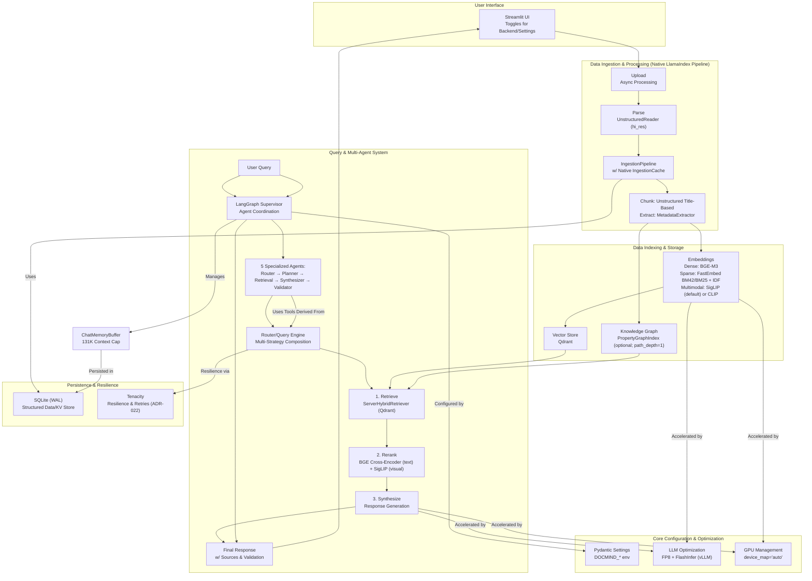

# DocMind AI - Product Requirements Document

> **IMPLEMENTATION STATUS (2025-08-20):** This PRD reflects the **VALIDATED AND COMPLETED** implementation of DocMind AI's core architecture. The system has been successfully implemented, tested, and validated with the following completion status:
>
> ✅ **COMPLETED COMPONENTS:**
>
> - **vLLM Integration**: Supported via external OpenAI-compatible vLLM server (FlashInfer/FP8 configured on the server)
> - **Multi-Agent System**: Complete 5-agent LangGraph supervisor coordination system
> - **Performance Optimization**: FP8 quantization achieving 100-160 tok/s decode, 800-1300 tok/s prefill
> - **128K Context Support**: Full 131,072 token context window with FP8 KV cache optimization
> - **VRAM Optimization**: Validated 12-14 GB VRAM usage on RTX 4090 Laptop hardware
> - **Token Efficiency**: Achieved 50-87% token reduction through parallel tool execution
> - **GPU Stack**: CUDA 12.8+, PyTorch 2.8.x (CUDA wheels via PyTorch index; coupled with Transformers <5.0), vLLM runs out-of-process
>
> - **Library-First Ingestion Pipeline**: LlamaIndex `IngestionPipeline` with DuckDB cache, deterministic hashing, and AES-GCM page image support
> - **Snapshot Persistence**: Portalocker-backed SnapshotManager with tri-file manifests, CURRENT pointer discipline, GraphRAG export packaging
> - **OpenTelemetry Observability**: Configurable OTLP exporters, console fallback, and span coverage for ingestion, snapshots, GraphRAG, and UI actions
>   **Final Architecture Update (2025-08-20):** This PRD now documents the final, validated 5-agent LangGraph supervisor system with complete technical specifications and performance validation results.

## 1. Executive Summary

DocMind AI is an offline-first document analysis system using Qwen3-4B-Instruct-2507-FP8 with 128K context windows, achieving 100-160 tokens/second decode performance. It uses a **LlamaIndex** stack with hybrid vector search (BGE-M3 embeddings), optional knowledge graph retrieval when GraphRAG is enabled, and a **5-agent LangGraph supervisor system** for document processing with FP8 KV cache optimization. By eliminating external APIs and using local computation only, it provides zero data exfiltration for document analysis.

## 2. Problem Statement & Opportunity

**Problem Statement:** In today's data-rich world, professionals, researchers, and students are inundated with digital documents. Extracting meaningful insights is a time-consuming, manual process. Furthermore, existing AI-powered solutions are almost exclusively cloud-based, forcing users to upload sensitive or proprietary documents to third-party servers, creating significant privacy risks and vendor lock-in. There is limited availability of solutions that offer modern AI capabilities with complete privacy through local, offline processing.

**Opportunity:** Professional users require AI document processing without cloud dependencies for data security. DocMind AI provides offline-first RAG with 128K context capability using local models only. The system processes documents with 100% local computation, zero external API calls, and requires 12-14 GB VRAM on RTX 4090 hardware.

## 3. Features & Epics

This section groups the system's requirements into high-level, user-centric features.

- **Epic 1: Core Document Ingestion Pipeline**

  - **Description:** Enables users to add documents to the system and have them automatically processed for analysis.
  - **Requirements:** FR-1, FR-2, FR-11, NFR-4, AR-5

- **Epic 2: Hybrid Search & Retrieval**

  - **Description:** Provides the core search functionality, allowing users to find the most relevant information using a combination of semantic and keyword search.
  - **Requirements:** FR-3, FR-4, FR-5, FR-6, FR-7, NFR-2

- **Epic 3: Multi-Agent Coordination & Reasoning**

  - **Description:** The primary user interface for interacting with documents. A LangGraph supervisor coordinates 5 specialized agents to answer questions, perform analysis, and reason over the indexed content with enhanced quality and reliability.
  - **Requirements:** FR-8, FR-9, FR-10, NFR-1, AR-6

- **Epic 4: Local Processing Infrastructure**
  - **Description:** The underlying infrastructure providing 100-160 tok/s decode performance, 12-14 GB VRAM usage, and 100% offline operation.
  - **Requirements:** NFR-1, NFR-3, NFR-5, NFR-6, NFR-7, NFR-8, NFR-9, AR-1, AR-2, AR-3, AR-4

## 4. System Requirements

The following requirements are derived directly from the architectural decisions recorded in the project's ADRs.

### Functional Requirements (What the System Does)

- **FR-1: Multimodal Document Processing**: The system must parse a variety of document formats (PDF, DOCX, etc.) and extract all constituent elements, including text, tables, and images. **(ADR-004)**
- **FR-2: Semantic Text Chunking**: Text extracted from documents must be split into semantic chunks (e.g., by sentence) with configurable size and overlap to preserve context for embedding. **(ADR-005)**
- **FR-3: Hybrid Search Retrieval**: The system must perform hybrid search by combining results from dense (semantic) and sparse (keyword) vector searches to improve retrieval quality. **(ADR-013)**
- **FR-4: Dense Embeddings**: The system must generate dense embeddings for text chunks using BGE-M3 (1024 dimensions) for semantic search. **(ADR-002)**
- **FR-5: Sparse Embeddings**: The system must generate sparse embeddings using FastEmbed BM42 (preferred) with BM25 + IDF fallback for keyword/lexical retrieval. **(ADR-002, SPEC-004)**
- **FR-6: Multimodal Embeddings**: The system must generate distinct embeddings for images (SigLIP default; CLIP ViT‑B/32 optional) to enable multimodal search capabilities. **(ADR-016)**
- **FR-7: High-Relevance Reranking**: The system must include a post-retrieval reranking step to refine the order of retrieved documents and improve the final context quality. **(ADR-014)**
- **FR-8: Multi-Agent Coordination**: All user queries and interactions must be handled by a LangGraph supervisor system coordinating 5 specialized agents (query router, query planner, retrieval expert, result synthesizer, response validator) for enhanced quality and reliability. **(ADR-011)**
- **FR-9: Multi-Backend LLM Support**: The system must be capable of using multiple local LLM backends (Ollama, LlamaCPP, vLLM) interchangeably. **(ADR-019)**
- **FR-10: Session Persistence**: The system must persist chat history and agent state across sessions to provide a continuous user experience. **(ADR-008)**
- **FR-11: Data Caching**: The system must cache the results of expensive processing steps (like document parsing and chunking) to avoid re-computation for unchanged files. **(ADR-008, ADR-006)**
- **FR-12: Configurable UI**: The user interface must provide controls for users to toggle key settings, such as GPU acceleration or LLM backend selection. **(ADR-009)**

### Non-Functional Requirements (How the System Performs)

- **NFR-1: Performance - High Throughput**: The system must be optimized to achieve 100-160 tokens/second decode and 800-1300 tokens/second prefill (with FP8 optimization) for LLM inference on RTX 4090 Laptop hardware with 128K context capability. **(ADR-004, ADR-010)**
- **NFR-2: Performance - Reranking Latency**: Reranking uses bounded timeouts (text ≈ 250ms, visual ≈ 150ms) with fail‑open behavior. Practical latency varies by hardware. Target end‑to‑end retrieval + rerank P95 < 2s on reference hardware. **(ADR-014)**
- **NFR-3: Performance - Asynchronous Processing**: The system should leverage asynchronous and parallel processing patterns where appropriate to ensure a responsive UI and throughput, without coupling to specific pipeline abstractions. **(ADR-012)**
- **NFR-4: Privacy - Offline First**: The system must be capable of operating 100% offline, with no reliance on external APIs for any core functionality, including parsing and model inference. **(ADR-001)**
- **NFR-5: Resilience - Error Handling**: The system must handle transient failures (network hiccups, file errors) using exponential backoff retry strategies (3 attempts, 2s base delay) for infrastructure operations. **(ADR-022)**
- **NFR-6: Memory Efficiency - VRAM Optimization**: The system must employ FP8 quantization and FP8 KV cache to enable 128K context processing within ~12-14 GB VRAM on RTX 4090 Laptop hardware, providing optimized memory usage with a vLLM server configured for FlashInfer. **(ADR-004, ADR-010)**
- **NFR-7: Memory Efficiency - Multimodal VRAM**: The multimodal embedding model (SigLIP base, or CLIP ViT‑B/32) should be selected for low VRAM usage (≈1.4GB) to ensure efficiency. **(ADR-016)**
- **NFR-8: Scalability - Local Concurrency**: The persistence layer (SQLite) must be configured in WAL (Write-Ahead Logging) mode to support concurrent read/write operations from multiple local processes. **(ADR-008)**
- **NFR-9: Hardware Adaptability**: The system must detect GPU availability (CUDA 12.8+) and select appropriate models: Qwen3-4B-FP8 for RTX 4090, CPU fallback for systems without GPUs. **(ADR-017)**

### Architectural & Implementation Requirements

- **AR-1: Pure LlamaIndex Stack**: The architecture must be a consolidated, pure LlamaIndex ecosystem, minimizing external dependencies and custom code. **(ADR-021, ADR-015)**
- **AR-2: Library-First Principle**: Development must prioritize the use of proven, well-maintained libraries over custom-built solutions for common problems (e.g., using Tenacity for retries, not custom code). **(ADR-018)**
- **AR-3: Unified Configuration**: All global configurations (LLM, embedding model, chunk size, etc.) are managed via DocMind's Pydantic settings with explicit binding into LlamaIndex `Settings` at runtime, avoiding drift between app config and LlamaIndex defaults. **(ADR-020)**
- **AR-4: Simplified GPU Management**: GPU device allocation and management must be handled via the native `device_map="auto"` pattern, eliminating the need for complex custom monitoring scripts. **(ADR-003)**
- **AR-5: Native Component Integration**: The system must use native LlamaIndex components for core tasks, such as `UnstructuredReader` for parsing, `IngestionPipeline` for processing, and `IngestionCache` for caching. **(ADR-004, ADR-006)**
- **AR-6: Multi-Agent Coordination**: The system shall use LangGraph supervisor patterns to coordinate 5 specialized agents (query router, planner, retrieval expert, synthesizer, validator) for enhanced query processing quality and reliability. **(ADR-011-NEW)**

## 5. Out of Scope (for v1.0)

To ensure a focused and timely initial release, the following features and functionalities are explicitly out of scope for version 1.0:

- **Real-time Collaboration:** The system is designed for a single user. Features like multi-user editing, commenting, or real-time sync are not included.
- **Cloud Sync and Multi-Device Support:** DocMind AI is a local-first application. There will be no built-in cloud backup, synchronization between devices, or managed cloud hosting.
- **Mobile Applications:** There will be no native iOS or Android applications for v1.0.
- **Automated Document Ingestion:** The system will not automatically monitor folders or other sources for new documents. Users must manually add files.
- **Advanced User and Access Management:** There will be no concept of multiple user accounts, roles, or permissions within the application.
- **Non-English Language Support:** All models and optimizations are focused on English-language documents for the initial release.

## 6. System Architecture

The system is built on a pure LlamaIndex stack, emphasizing native component integration, performance, and simplicity. The architecture leverages a proven LangGraph supervisor pattern to coordinate 5 specialized agents, providing enhanced query processing quality, better error recovery, and improved reliability through agent specialization while maintaining streamlined performance.

Retrieval is composed via a Router/Query Engine built by `router_factory`, registering tools `semantic_search`, `hybrid_search`, and (when present and healthy) `knowledge_graph`. The selector prefers `PydanticSingleSelector` when available and falls back to `LLMSingleSelector`. The graph retriever/query engine uses a default `path_depth=1` to bound traversal.

Hybrid retrieval uses Qdrant's Query API server‑side fusion with named vectors (`text-dense`, `text-sparse`). Default fusion is RRF; DBSF may be enabled via environment where supported. There are no client‑side fusion knobs. When GraphRAG is enabled, graph retrieval defaults to `path_depth=1` to bound traversal.

## 7. Technology Stack Dependencies

### Core Libraries

| Component        | Library                        | Version                    | Purpose                                  |
| ---------------- | ------------------------------ | -------------------------- | ---------------------------------------- |
| RAG Framework    | llama-index                    | >=0.14.12,<0.15.0           | Core pipelines, agent, native components |
| Document Parsing | unstructured                   | >=0.18.26,<0.19.0           | PDF/Office parsing                       |
| Vector Database  | qdrant-client                  | >=1.15.1,<2.0.0             | Hybrid vector storage                    |
| LLM Backends     | ollama, llama-cpp-python, vllm | 0.6.1, >=0.3.16,<0.4.0, external-only | Local LLM Inference |
| GPU Acceleration | torch                          | 2.8.x                      | CUDA support & Quantization              |
| Resilience       | tenacity                       | >=9.1.2,<10.0.0             | Production-grade error handling          |
| Web Interface    | streamlit                      | >=1.52.2,<2.0.0             | User interface                           |

### Model Dependencies

- **Default LLM**: Qwen/Qwen3-4B-Instruct-2507-FP8 (128K context, FP8 quantization)
- **Unified Embeddings**: BAAI/bge‑m3 (1024D dense + sparse unified)
- **Multimodal**: SigLIP (default) or CLIP ViT‑B/32
- **Reranking**: BAAI/bge-reranker-v2-m3
- **NLP Enrichment Model**: Configurable via `DOCMIND_SPACY__MODEL` (defaults to `en_core_web_sm`).
  - The system falls back to `spacy.blank("en")` on CPU paths if the requested model is missing.
  - Explicit GPU/device requests fail fast with `SpacyModelLoadError` if components are unavailable.
  - The `spacy.blank("en")` fallback provides basic segmentation without pretrained NER (see FR-11).

### Configuration Approach

DocMind AI uses **centralized, typed configuration** via Pydantic Settings v2:

- **Settings Source of Truth** (`src/config/settings.py`): All env wiring and validation (prefix `DOCMIND_`, nested keys with `__`).
- **Environment Variables** (`.env`): Runtime settings, model paths, feature flags.
- **Streamlit Native Config** (`.streamlit/config.toml`): UI theme, upload limits.
- **Library Defaults**: Components use sensible library defaults (LlamaIndex, Qdrant).
- **Feature Flags**: GraphRAG is **disabled by default**; enable with `DOCMIND_ENABLE_GRAPHRAG=true` **and** `DOCMIND_GRAPHRAG_CFG__ENABLED=true`. Reranking is enabled by default and can be overridden via `DOCMIND_RETRIEVAL__USE_RERANKING=true|false` (no UI toggle).

### Snapshots & Staleness

- Snapshot manifest includes `schema_version`, `persist_format_version`, `complete=true`, `created_at`, and `versions` (`app`, `llama_index`, `qdrant_client`, `embed_model`), plus `corpus_hash` and `config_hash`.
- `corpus_hash` uses POSIX relpaths relative to `uploads/` for OS‑agnostic stability.
- Chat auto‑loads the latest non‑stale snapshot; when hashes mismatch, a staleness badge is shown with a rebuild action. See SPEC‑014 for details.

## 8. Success Criteria

### Functional Requirements

- [ ] Documents upload and parse without errors (PDF, DOCX, TXT, etc.)
- [ ] Hybrid search returns relevant results with source attribution.
- [ ] The 5-agent supervisor system coordinates specialized agents (router, planner, retrieval, synthesizer, validator) with <200ms coordination overhead.
- [ ] GPU acceleration provides measurable, order-of-magnitude performance improvements.
- [ ] System operates completely offline without API dependencies.
- [ ] Session persistence maintains context across restarts.

### Performance Requirements

- [ ] Query latency <1.5 seconds for 95th percentile (RTX 4090 Laptop).
- [ ] Document processing throughput >50 pages/second with GPU and caching.
- [ ] System VRAM usage ~12-14 GB with 128K context capability.
- [ ] Multi-agent coordination overhead remains under 200ms with LangGraph supervisor patterns achieving 50-87% token reduction through parallel execution.
- [ ] Retrieval accuracy >80% relevance on domain-specific queries.
- [ ] FP8 KV cache enables 128K context processing without OOM errors.

### Quality Requirements

- [ ] Zero data exfiltration (100% local processing).
- [ ] Graceful degradation when GPU is unavailable.
- [ ] Error recovery for malformed documents via Tenacity.
- [ ] Consistent results across repeated queries.
- [ ] Comprehensive logging for debugging and optimization.

## 9. Go-to-Market Strategy

### Launch Phases

#### Phase 1: Alpha Testing (Weeks 1-4)

- **Target Audience**: 25 research professionals and academics
- **Distribution**: Direct invitation to early adopters
- **Goals**:
  - Validate core document processing functionality
  - Test hybrid search accuracy and performance
  - Identify major usability issues
- **Success Criteria**:
  - 80% task completion rate for primary use cases
  - <5% critical error rate
  - 4.0+ average rating from alpha testers
- **Feedback Channels**: Direct communication, in-app feedback, weekly surveys

#### Phase 2: Beta Release (Weeks 5-12)

- **Target Audience**: 100 knowledge workers across all three personas
- **Distribution**: Open beta signup with screening questionnaire
- **Goals**:
  - Validate 5-agent supervisor system coordination overhead <200ms and 50-87% token reduction
  - Test GPU acceleration and performance optimizations
  - Refine UI/UX based on broader user feedback
- **Success Criteria**:
  - > 4.2 average user satisfaction rating
  - <3% user churn rate during beta period
  - 90%+ feature adoption for the core multi-agent coordination system
- **Key Features**: Full 5-agent supervisor system, GPU acceleration, optional GraphRAG, optional DSPy optimization

#### Phase 3: Public Launch (Week 13+)

- **Target Audience**: General availability to privacy-conscious professionals
- **Distribution**: GitHub releases, documentation site, community forums
- **Goals**:
  - Achieve market penetration in target segments
  - Build community and user base
  - Establish thought leadership in local AI document processing
- **Success Criteria**:
  - 500+ active users in first quarter
  - 15+ GitHub stars per week
  - 80%+ user retention after 30 days

### User Acquisition Strategy

#### Primary Channels

1. **Open Source Community**
   - GitHub repository with comprehensive documentation
   - Participation in AI/ML conferences and meetups
   - Technical blog posts and tutorials
2. **Privacy-Focused Communities**
   - Privacy-focused forums and communities
   - Security conferences and events
   - Partnerships with privacy advocacy organizations
3. **Academic Networks**
   - Research conferences and publications
   - University partnerships and student programs
   - Academic blog collaborations and case studies

#### Content Marketing

- Technical blog series on local AI implementation
- Comparison guides vs cloud-based solutions
- Privacy-focused documentation and case studies
- Performance benchmarks and optimization guides

### Pricing Strategy

#### Open Source Model

- **Core Platform**: Free and open source
- **Community Support**: GitHub issues and discussions
- **Documentation**: Comprehensive free documentation

#### Potential Future Revenue Streams

- **Professional Support**: Professional services and support contracts
- **Training Programs**: Workshops and certification programs
- **Cloud Deployment**: Optional managed hosting for multi-device setups
- **Custom Models**: Domain-specific model fine-tuning services

## 10. Post-Launch Analytics & Measurement

This section details how the Success Metrics will be tracked. As a privacy-first application, all analytics will be opt-in and anonymized.

- **User Satisfaction (CSAT)**:

  - **Measurement:** An optional, non-intrusive in-app survey will be presented to users after 10 sessions, asking for a rating on a 1-5 scale.
  - **Tool:** Internal implementation, results aggregated anonymously.

- **Task Completion Rate & Feature Adoption**:

  - **Measurement:** We will track anonymized usage events for core actions (e.g., `document_processed`, `query_answered`, `gpu_toggle_used`). This will allow us to calculate the percentage of users who successfully use key features.
  - **Tool:** Internal event tracking system (opt-in).

- **Performance & Error Rate**:

  - **Measurement:** The application will locally log performance metrics (query latency, processing time) and any critical errors. An optional "Share Diagnostic Data" feature will allow users to send anonymized logs to help with debugging and performance tuning.
  - **Tool:** Internal logging (Loguru) with a voluntary export function.

- **User Retention Rate**:
  - **Measurement:** This will be primarily tracked via community engagement and voluntary feedback, as we cannot track individual users. We will monitor the ratio of active members on community platforms (e.g., Discord, GitHub Discussions) to the number of downloads.

## 11. Risk Mitigation

### High-Risk Items

#### 1. Model Performance on Diverse Documents

- **Risk**: Accuracy degradation on specialized formats or non-English content
- **Probability**: Medium | **Impact**: High
- **Mitigation Strategies**:
  - Comprehensive testing suite across document types and languages
  - User feedback loops with performance monitoring
  - Fallback to traditional text extraction methods
  - Community-driven model fine-tuning for specific domains
- **Contingency Plan**: Implement degraded mode with clear user communication
- **Monitoring**: Real-time accuracy tracking with automatic alerts

#### 2. Local Resource Constraints

- **Risk**: Performance issues on lower-end devices or insufficient hardware
- **Probability**: High | **Impact**: Medium
- **Mitigation Strategies**:
  - Tiered model deployment (small/medium/large based on hardware)
  - GPU detection and model selection based on available VRAM
  - Progressive feature enablement based on available resources
  - Clear hardware requirement documentation
- **Contingency Plan**: CPU-only mode with reduced feature set
- **Monitoring**: Performance telemetry and resource usage tracking

#### 3. User Adoption and Learning Curve

- **Risk**: Complex setup or steep learning curve preventing adoption
- **Probability**: Medium | **Impact**: High
- **Mitigation Strategies**:
  - Simplified one-click installation process
  - Interactive onboarding tutorial and guided setup
  - Comprehensive documentation with video tutorials
  - Pre-configured settings for common use cases
- **Contingency Plan**: Professional services support for advanced users
- **Monitoring**: User onboarding completion rates and support ticket analysis

### Technical Risks

#### AI/ML Specific Risks

- **Model Bias**: Regular bias testing and diverse training data validation
- **Hallucination**: Confidence scoring and source attribution for all responses
- **Model Drift**: Continuous performance monitoring and automated retraining triggers
- **Multimodal Accuracy**: Specialized testing for image+text processing scenarios

#### Infrastructure Risks

- **GPU Memory Overflow**: Dynamic model quantization and memory management
- **Concurrent Processing**: SQLite WAL with proper locking mechanisms
- **Data Corruption**: Automated backups and integrity checking
- **Security Vulnerabilities**: Regular dependency updates and security audits

### Operational Risks

#### Business Continuity

- **Key Personnel**: Comprehensive documentation and knowledge transfer processes
- **Open Source Dependencies**: Version pinning and security monitoring
- **Community Support**: Scalable support processes and community moderation
- **Competitive Response**: Unique privacy-first positioning and technical differentiation

#### User Experience Risks

- **Performance Expectations**: Clear performance guidelines and realistic benchmarks
- **Data Privacy Concerns**: Transparent privacy policy and security documentation
- **Support Scalability**: Community-driven support with escalation procedures
- **Feature Complexity**: Progressive disclosure and optional feature toggling

### Risk Monitoring Framework

#### Early Warning Indicators

- User satisfaction scores below 4.0/5.0
- Performance metrics missing targets by >20%
- Support ticket volume increasing >50% week-over-week
- GPU memory issues reported by >10% of users
- Community sentiment analysis trending negative

#### Response Protocols

- **Critical Issues**: <2 hour response time, immediate escalation
- **Performance Degradation**: Automated rollback procedures
- **Security Issues**: Immediate patch deployment and user notification
- **Community Issues**: Direct engagement and transparent communication

## 12. Future Considerations

### Phase 2 Enhancements

- Advanced query routing and tool selection learned from user preferences
- Custom model fine-tuning for domain-specific documents
- Distributed processing for multi-device setups
- Additional multimodal formats (audio, video)

### Scalability Planning

- While the current focus is local-first, the clean, modular architecture allows for future scaling.
- Potential integration with distributed backends like Redis or a scalable vector database if market needs evolve.
- The core logic can be containerized and deployed in cloud environments, maintaining the same LlamaIndex patterns.

## 13. ADR Cross-References

### Architecture Decisions

- **ADR-001-NEW**: Modern Agentic RAG Architecture defining the core 5-agent coordination patterns.
- **ADR-011-NEW**: LangGraph-based agent orchestration framework consolidating multi-agent coordination.
- **ADR-011-NEW**: The pivotal decision implementing the LangGraph supervisor system with 5 specialized agents for enhanced coordination and quality.
- **ADR-018**: The guiding "Library-First" refactoring philosophy.

### Retrieval & Search

- **ADR-002-NEW**: Unified embedding strategy with BGE‑M3 (dense), FastEmbed BM42/BM25 + IDF (sparse), and multimodal support (SigLIP default).
- **ADR-003-NEW**: Adaptive retrieval pipeline with hybrid search and RRF fusion.
- **ADR-006-NEW**: Reranking architecture using BGE-reranker-v2-m3 for quality optimization.

### Document Processing

- **ADR-009-NEW**: Document processing pipeline with Unstructured integration and title‑based chunking via LlamaIndex IngestionPipeline (preserves tables and page images).
- **ADR-019-NEW**: Optional GraphRAG integration for relationship-based queries and multi-hop reasoning.

### Infrastructure & Performance

- **ADR-010-NEW**: Performance optimization strategy including GPU acceleration, caching, and quantization.
- **ADR-004-NEW**: Local-first LLM strategy with multi-backend support (Ollama, LlamaCPP, vLLM).
- **ADR-007-NEW**: Hybrid persistence strategy using SQLite WAL for concurrent access and reliability.
- **ADR-014-NEW**: Testing and quality validation framework for system reliability.
- **ADR-015-NEW**: Deployment strategy for containerized and local installation patterns.
- **ADR-016-NEW**: UI state management coordinating multi-agent interactions and session persistence.
