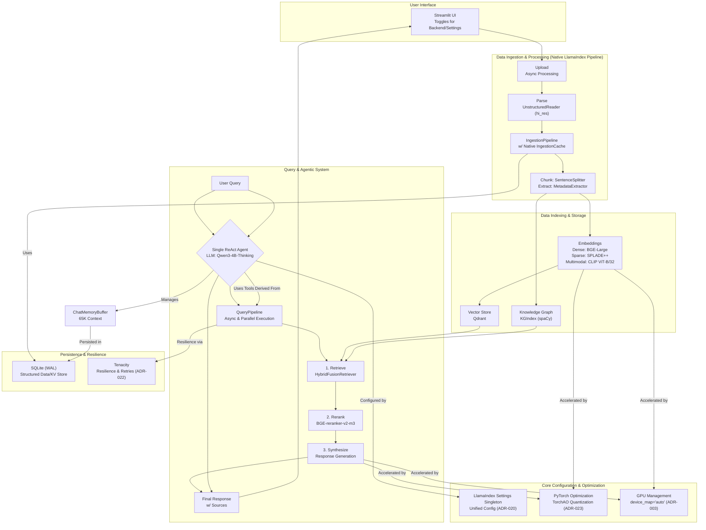

# DocMind AI - Product Requirements Document

## 1. Executive Summary

DocMind AI is an offline-first document analysis system architected for exceptional performance, privacy, and maintainability. It leverages a pure **LlamaIndex** stack to combine hybrid vector search, knowledge graphs, and a powerful **single ReAct agent** for intelligent document processing. By eliminating external APIs and prioritizing local computation, it provides a secure, high-throughput environment for users to analyze their documents.

## 2. Problem Statement & Opportunity

**Problem Statement:** In today's data-rich world, professionals, researchers, and students are inundated with digital documents. Extracting meaningful insights is a time-consuming, manual process. Furthermore, existing AI-powered solutions are almost exclusively cloud-based, forcing users to upload sensitive or proprietary documents to third-party servers, creating significant privacy risks and vendor lock-in. There is no solution on the market that offers elite, modern AI capabilities with the absolute privacy of local, offline processing.

**Opportunity:** There is a clear and growing market demand for a "prosumer" and professional tool that delivers the power of advanced AI without compromising on data security. By building a high-performance, offline-first RAG application, DocMind AI can capture this underserved segment. We will provide a "no-compromise" solution that is fast, intelligent, and completely private, positioning ourselves as the leading choice for security-conscious users.

## 3. Features & Epics

This section groups the system's requirements into high-level, user-centric features.

* **Epic 1: Core Document Ingestion Pipeline**
  * **Description:** Enables users to add documents to the system and have them automatically processed for analysis.
  * **Requirements:** FR-1, FR-2, FR-11, NFR-4, AR-5

* **Epic 2: Advanced Hybrid Search & Retrieval**
  * **Description:** Provides the core search functionality, allowing users to find the most relevant information using a combination of semantic and keyword search.
  * **Requirements:** FR-3, FR-4, FR-5, FR-6, FR-7, NFR-2

* **Epic 3: Agentic Q&A and Reasoning**
  * **Description:** The primary user interface for interacting with documents. A single, intelligent agent answers questions, performs analysis, and reasons over the indexed content.
  * **Requirements:** FR-8, FR-9, FR-10, NFR-1, AR-6

* **Epic 4: High-Performance Infrastructure**
  * **Description:** The underlying non-functional backbone of the application, ensuring it is fast, efficient, and reliable.
  * **Requirements:** NFR-1, NFR-3, NFR-5, NFR-6, NFR-7, NFR-8, NFR-9, AR-1, AR-2, AR-3, AR-4

## 4. System Requirements

The following requirements are derived directly from the architectural decisions recorded in the project's ADRs.

### Functional Requirements (What the System Does)

* **FR-1: Multimodal Document Processing**: The system must parse a variety of document formats (PDF, DOCX, etc.) and extract all constituent elements, including text, tables, and images. **(ADR-004)**
* **FR-2: Semantic Text Chunking**: Text extracted from documents must be split into semantic chunks (e.g., by sentence) with configurable size and overlap to preserve context for embedding. **(ADR-005)**
* **FR-3: Hybrid Search Retrieval**: The system must perform hybrid search by combining results from dense (semantic) and sparse (keyword) vector searches to improve retrieval quality. **(ADR-013)**
* **FR-4: Dense Embeddings**: The system must generate dense embeddings for text chunks using a high-performance model (e.g., BGE-large-en-v1.5) to capture semantic meaning. **(ADR-002)**
* **FR-5: Sparse Embeddings**: The system must generate sparse embeddings (e.g., SPLADE++) to enable effective keyword-based retrieval and term expansion. **(ADR-002)**
* **FR-6: Multimodal Embeddings**: The system must generate distinct embeddings for images (e.g., using CLIP ViT-B/32) to enable multimodal search capabilities. **(ADR-016)**
* **FR-7: High-Relevance Reranking**: The system must include a post-retrieval reranking step to refine the order of retrieved documents and improve the final context quality. **(ADR-014)**
* **FR-8: Single Agent Interface**: All user queries and interactions must be handled by a single, powerful ReAct Agent capable of reasoning, planning, and dynamic tool selection. **(ADR-011)**
* **FR-9: Multi-Backend LLM Support**: The system must be capable of using multiple local LLM backends (Ollama, LlamaCPP, vLLM) interchangeably. **(ADR-019)**
* **FR-10: Session Persistence**: The system must persist chat history and agent state across sessions to provide a continuous user experience. **(ADR-008)**
* **FR-11: Data Caching**: The system must cache the results of expensive processing steps (like document parsing and chunking) to avoid re-computation for unchanged files. **(ADR-008, ADR-006)**
* **FR-12: Configurable UI**: The user interface must provide controls for users to toggle key settings, such as GPU acceleration or LLM backend selection. **(ADR-009)**

### Non-Functional Requirements (How the System Performs)

* **NFR-1: Performance - High Throughput**: The system must be optimized to achieve ~1000 tokens/second for LLM inference on supported hardware (e.g., RTX 4090). **(ADR-003, ADR-017)**
* **NFR-2: Performance - Fast Reranking**: The primary reranking model must be lightweight (`BGE-reranker-v2-m3`) to ensure minimal latency impact on the query pipeline. **(ADR-014)**
* **NFR-3: Performance - Asynchronous Processing**: The system must leverage asynchronous and parallel processing patterns (`QueryPipeline.parallel_run`) for all I/O-bound and compute-intensive tasks to ensure a non-blocking UI and maximum throughput. **(ADR-012)**
* **NFR-4: Privacy - Offline First**: The system must be capable of operating 100% offline, with no reliance on external APIs for any core functionality, including parsing and model inference. **(ADR-001)**
* **NFR-5: Resilience - Robust Error Handling**: The system must be resilient to transient failures (e.g., network hiccups, file errors) by implementing intelligent retry strategies (e.g., exponential backoff) for all critical infrastructure operations. **(ADR-022)**
* **NFR-6: Memory Efficiency - VRAM Optimization**: The system must employ model quantization (TorchAO int4) to reduce the memory footprint of LLMs by ~58%, allowing larger models to run on consumer hardware. **(ADR-023)**
* **NFR-7: Memory Efficiency - Multimodal VRAM**: The multimodal embedding model (CLIP ViT-B/32) must be selected for its low VRAM usage (~1.4GB) to ensure efficiency. **(ADR-016)**
* **NFR-8: Scalability - Local Concurrency**: The persistence layer (SQLite) must be configured in WAL (Write-Ahead Logging) mode to support concurrent read/write operations from multiple local processes. **(ADR-008)**
* **NFR-9: Hardware Adaptability**: The system must automatically detect available hardware (especially GPUs) and adapt its configuration for optimal performance, including model selection and context length. **(ADR-017)**

### Architectural & Implementation Requirements

* **AR-1: Pure LlamaIndex Stack**: The architecture must be a consolidated, pure LlamaIndex ecosystem, minimizing external dependencies and custom code. **(ADR-021, ADR-015)**
* **AR-2: Library-First Principle**: Development must prioritize the use of proven, well-maintained libraries over custom-built solutions for common problems (e.g., using Tenacity for retries, not custom code). **(ADR-018)**
* **AR-3: Unified Configuration**: All global configurations (LLM, embedding model, chunk size, etc.) must be managed through the native LlamaIndex `Settings` singleton, eliminating dual-configuration systems. **(ADR-020)**
* **AR-4: Simplified GPU Management**: GPU device allocation and management must be handled via the native `device_map="auto"` pattern, eliminating the need for complex custom monitoring scripts. **(ADR-003)**
* **AR-5: Native Component Integration**: The system must use native LlamaIndex components for core tasks, such as `UnstructuredReader` for parsing, `IngestionPipeline` for processing, and `IngestionCache` for caching. **(ADR-004, ADR-006)**
* **AR-6: Standardized Model**: The default reasoning LLM shall be `Qwen3-4B-Thinking` due to its superior agentic capabilities and performance with quantization. **(ADR-017)**

## 5. Out of Scope (for v1.0)

To ensure a focused and timely initial release, the following features and functionalities are explicitly out of scope for version 1.0:

* **Real-time Collaboration:** The system is designed for a single user. Features like multi-user editing, commenting, or real-time sync are not included.
* **Cloud Sync and Multi-Device Support:** DocMind AI is a local-first application. There will be no built-in cloud backup, synchronization between devices, or managed cloud hosting.
* **Mobile Applications:** There will be no native iOS or Android applications for v1.0.
* **Automated Document Ingestion:** The system will not automatically monitor folders or other sources for new documents. Users must manually add files.
* **Advanced User and Access Management:** There will be no concept of multiple user accounts, roles, or permissions within the application.
* **Non-English Language Support:** All models and optimizations are focused on English-language documents for the initial release.

## 6. System Architecture

The system is built on a pure LlamaIndex stack, emphasizing native component integration, performance, and simplicity. The architecture avoids complex coordination layers in favor of a powerful, single agent and streamlined processing pipelines.

## 7. Technology Stack Dependencies

### Core Libraries

| Component          | Library                  | Version      | Purpose                               |
| ------------------ | ------------------------ | ------------ | ------------------------------------- |
| RAG Framework      | llama-index              | >=0.12.0     | Core pipelines, agent, native components |
| Document Parsing   | unstructured             | >=0.15.13    | PDF/Office parsing                    |
| Vector Database    | qdrant-client            | 1.15.0       | Hybrid vector storage                 |
| LLM Backends       | ollama, llama-cpp-python, vllm | Latest       | Local LLM Inference                   |
| GPU Acceleration   | torch, torchao           | >=2.7.1, >=0.1.0 | CUDA support & Quantization           |
| Resilience         | tenacity                 | >=9.1.2      | Production-grade error handling       |
| Web Interface      | streamlit                | >=1.47.1     | User interface                        |

### Model Dependencies

* **Default LLM**: Qwen/Qwen3-4B-Thinking-2507
* **Dense Embeddings**: BAAI/bge-large-en-v1.5 (1024D)
* **Sparse Embeddings**: prithvida/Splade_PP_en_v1
* **Multimodal**: openai/clip-vit-base-patch32 (ViT-B/32)
* **Reranking (Primary)**: BAAI/bge-reranker-v2-m3
* **Reranking (Fallback)**: colbert-ir/colbertv2.0
* **NER Model**: en_core_web_sm (spaCy)

## 8. Success Criteria

### Functional Requirements

* [ ] Documents upload and parse without errors (PDF, DOCX, TXT, etc.)
* [ ] Hybrid search returns relevant results with source attribution.
* [ ] The single ReAct agent intelligently uses tools to answer complex queries.
* [ ] GPU acceleration provides measurable, order-of-magnitude performance improvements.
* [ ] System operates completely offline without API dependencies.
* [ ] Session persistence maintains context across restarts.

### Performance Requirements

* [ ] Query latency <2 seconds for 95th percentile.
* [ ] Document processing throughput >50 pages/second with GPU and caching.
* [ ] System memory usage <4GB for typical workloads.
* [ ] Agentic reasoning overhead is negligible due to high-performance LLM.
* [ ] Retrieval accuracy >80% relevance on domain-specific queries.

### Quality Requirements

* [ ] Zero data exfiltration (100% local processing).
* [ ] Graceful degradation when GPU is unavailable.
* [ ] Error recovery for malformed documents via Tenacity.
* [ ] Consistent results across repeated queries.
* [ ] Comprehensive logging for debugging and optimization.

## 9. Go-to-Market Strategy

### Launch Phases

#### Phase 1: Alpha Testing (Weeks 1-4)

* **Target Audience**: 25 research professionals and academics
* **Distribution**: Direct invitation to early adopters
* **Goals**:
  * Validate core document processing functionality
  * Test hybrid search accuracy and performance
  * Identify major usability issues
* **Success Criteria**:
  * 80% task completion rate for primary use cases
  * <5% critical error rate
  * 4.0+ average rating from alpha testers
* **Feedback Channels**: Direct communication, in-app feedback, weekly surveys

#### Phase 2: Beta Release (Weeks 5-12)

* **Target Audience**: 100 knowledge workers across all three personas
* **Distribution**: Open beta signup with screening questionnaire
* **Goals**:
  * Validate single agent system effectiveness
  * Test GPU acceleration and performance optimizations
  * Refine UI/UX based on broader user feedback
* **Success Criteria**:
  * >4.2 average user satisfaction rating
  * <3% user churn rate during beta period
  * 90%+ feature adoption for the core agentic chat
* **Key Features**: Full single-agent system, GPU acceleration, knowledge graph

#### Phase 3: Public Launch (Week 13+)

* **Target Audience**: General availability to privacy-conscious professionals
* **Distribution**: GitHub releases, documentation site, community forums
* **Goals**:
  * Achieve market penetration in target segments
  * Build community and user base
  * Establish thought leadership in local AI document processing
* **Success Criteria**:
  * 500+ active users in first quarter
  * 15+ GitHub stars per week
  * 80%+ user retention after 30 days

### User Acquisition Strategy

#### Primary Channels

1. **Open Source Community**
    * GitHub repository with comprehensive documentation
    * Participation in AI/ML conferences and meetups
    * Technical blog posts and tutorials
2. **Privacy-Focused Communities**
    * Privacy-focused forums and communities
    * Security conferences and events
    * Partnerships with privacy advocacy organizations
3. **Academic Networks**
    * Research conferences and publications
    * University partnerships and student programs
    * Academic blog collaborations and case studies

#### Content Marketing

* Technical blog series on local AI implementation
* Comparison guides vs cloud-based solutions
* Privacy-focused documentation and case studies
* Performance benchmarks and optimization guides

### Pricing Strategy

#### Open Source Model

* **Core Platform**: Free and open source
* **Community Support**: GitHub issues and discussions
* **Documentation**: Comprehensive free documentation

#### Potential Future Revenue Streams

* **Professional Support**: Professional services and support contracts
* **Training Programs**: Workshops and certification programs
* **Cloud Deployment**: Optional managed hosting for multi-device setups
* **Custom Models**: Domain-specific model fine-tuning services

## 10. Post-Launch Analytics & Measurement

This section details how the Success Metrics will be tracked. As a privacy-first application, all analytics will be opt-in and anonymized.

* **User Satisfaction (CSAT)**:
  * **Measurement:** An optional, non-intrusive in-app survey will be presented to users after 10 sessions, asking for a rating on a 1-5 scale.
  * **Tool:** Internal implementation, results aggregated anonymously.

* **Task Completion Rate & Feature Adoption**:
  * **Measurement:** We will track anonymized usage events for core actions (e.g., `document_processed`, `query_answered`, `gpu_toggle_used`). This will allow us to calculate the percentage of users who successfully use key features.
  * **Tool:** Internal event tracking system (opt-in).

* **Performance & Error Rate**:
  * **Measurement:** The application will locally log performance metrics (query latency, processing time) and any critical errors. An optional "Share Diagnostic Data" feature will allow users to send anonymized logs to help with debugging and performance tuning.
  * **Tool:** Internal logging (Loguru) with a voluntary export function.

* **User Retention Rate**:
  * **Measurement:** This will be primarily tracked via community engagement and voluntary feedback, as we cannot track individual users. We will monitor the ratio of active members on community platforms (e.g., Discord, GitHub Discussions) to the number of downloads.

## 11. Risk Mitigation

### High-Risk Items

#### 1. Model Performance on Diverse Documents

* **Risk**: Accuracy degradation on specialized formats or non-English content
* **Probability**: Medium | **Impact**: High
* **Mitigation Strategies**:
  * Comprehensive testing suite across document types and languages
  * User feedback loops with performance monitoring
  * Fallback to traditional text extraction methods
  * Community-driven model fine-tuning for specific domains
* **Contingency Plan**: Implement degraded mode with clear user communication
* **Monitoring**: Real-time accuracy tracking with automatic alerts

#### 2. Local Resource Constraints

* **Risk**: Performance issues on lower-end devices or insufficient hardware
* **Probability**: High | **Impact**: Medium
* **Mitigation Strategies**:
  * Tiered model deployment (small/medium/large based on hardware)
  * Intelligent resource detection and optimization
  * Progressive feature enablement based on available resources
  * Clear hardware requirement documentation
* **Contingency Plan**: CPU-only mode with reduced feature set
* **Monitoring**: Performance telemetry and resource usage tracking

#### 3. User Adoption and Learning Curve

* **Risk**: Complex setup or steep learning curve preventing adoption
* **Probability**: Medium | **Impact**: High
* **Mitigation Strategies**:
  * Simplified one-click installation process
  * Interactive onboarding tutorial and guided setup
  * Comprehensive documentation with video tutorials
  * Pre-configured settings for common use cases
* **Contingency Plan**: Professional services support for advanced users
* **Monitoring**: User onboarding completion rates and support ticket analysis

### Technical Risks

#### AI/ML Specific Risks

* **Model Bias**: Regular bias testing and diverse training data validation
* **Hallucination**: Confidence scoring and source attribution for all responses
* **Model Drift**: Continuous performance monitoring and automated retraining triggers
* **Multimodal Accuracy**: Specialized testing for image+text processing scenarios

#### Infrastructure Risks

* **GPU Memory Overflow**: Dynamic model quantization and memory management
* **Concurrent Processing**: SQLite WAL with proper locking mechanisms
* **Data Corruption**: Automated backups and integrity checking
* **Security Vulnerabilities**: Regular dependency updates and security audits

### Operational Risks

#### Business Continuity

* **Key Personnel**: Comprehensive documentation and knowledge transfer processes
* **Open Source Dependencies**: Version pinning and security monitoring
* **Community Support**: Scalable support processes and community moderation
* **Competitive Response**: Unique privacy-first positioning and technical differentiation

#### User Experience Risks

* **Performance Expectations**: Clear performance guidelines and realistic benchmarks
* **Data Privacy Concerns**: Transparent privacy policy and security documentation
* **Support Scalability**: Community-driven support with escalation procedures
* **Feature Complexity**: Progressive disclosure and optional feature toggling

### Risk Monitoring Framework

#### Early Warning Indicators

* User satisfaction scores below 4.0/5.0
* Performance metrics missing targets by >20%
* Support ticket volume increasing >50% week-over-week
* GPU memory issues reported by >10% of users
* Community sentiment analysis trending negative

#### Response Protocols

* **Critical Issues**: <2 hour response time, immediate escalation
* **Performance Degradation**: Automated rollback procedures
* **Security Issues**: Immediate patch deployment and user notification
* **Community Issues**: Direct engagement and transparent communication

## 12. Future Considerations

### Phase 2 Enhancements

* Advanced query routing and tool selection learned from user preferences
* Custom model fine-tuning for domain-specific documents
* Distributed processing for multi-device setups
* Additional multimodal formats (audio, video)

### Scalability Planning

* While the current focus is local-first, the clean, modular architecture allows for future scaling.
* Potential integration with distributed backends like Redis or a scalable vector database if market needs evolve.
* The core logic can be containerized and deployed in cloud environments, maintaining the same LlamaIndex patterns.

## 13. ADR Cross-References

### Architecture Decisions

* **ADR-021**: The capstone decision for LlamaIndex Native Architecture Consolidation.
* **ADR-015**: The final migration from LangChain to a pure LlamaIndex ecosystem.
* **ADR-011**: The pivotal decision to replace the multi-agent system with a single, powerful ReAct Agent.
* **ADR-018**: The guiding "Library-First" refactoring philosophy.

### Retrieval & Search

* **ADR-002**: Selection of BGE-Large, SPLADE++, and CLIP embedding models.
* **ADR-013**: RRF hybrid search implementation using `HybridFusionRetriever`.
* **ADR-014**: Optimized reranking strategy using `BGE-reranker-v2-m3`.

### Document Processing

* **ADR-004**: Use of `UnstructuredReader` within a native `IngestionPipeline`.
* **ADR-005**: Semantic chunking using `SentenceSplitter` in the pipeline.
* **ADR-016**: Adoption of CLIP ViT-B/32 for efficient multimodal embeddings.

### Infrastructure & Performance

* **ADR-003**: GPU optimization simplified to `device_map="auto"`, targeting ~1000 t/s.
* **ADR-023**: Core PyTorch optimization strategy using TorchAO for quantization.
* **ADR-012**: Async and parallel processing strategy using `QueryPipeline.parallel_run()`.
* **ADR-008**: Simplified persistence using SQLite and native `IngestionCache`.
* **ADR-019**: Multi-backend LLM support (Ollama, LlamaCPP, vLLM) via the `Settings` singleton.
* **ADR-020**: Migration to the native LlamaIndex `Settings` singleton for unified configuration.
* **ADR-022**: Integration of `Tenacity` for production-grade system resilience.
* **ADR-017**: Standardization on `Qwen3-4B-Thinking` as the default LLM.
