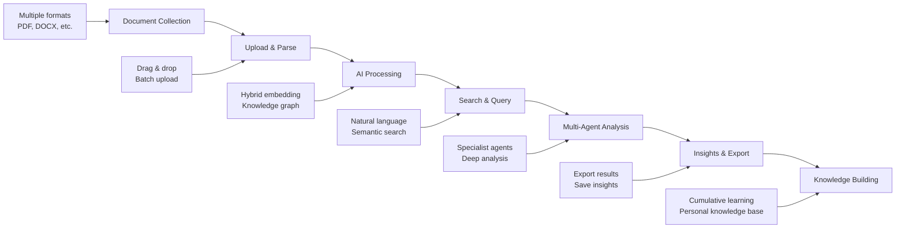
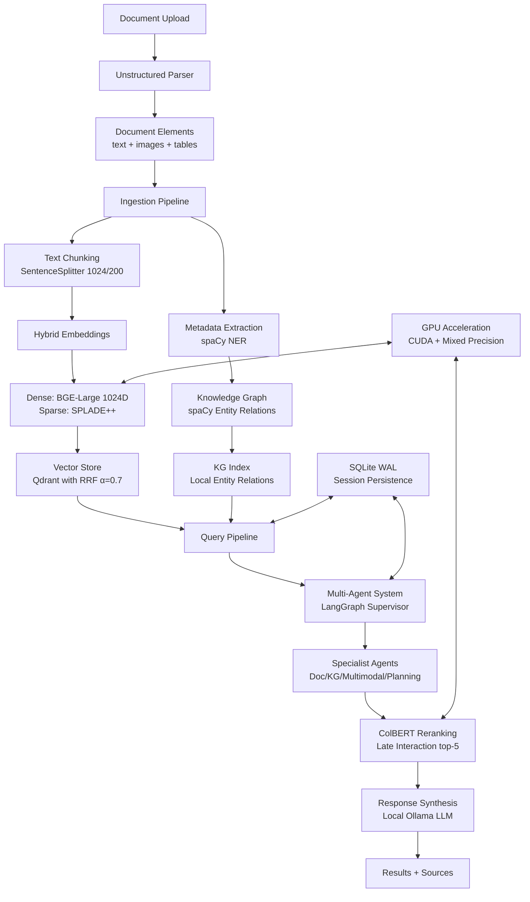

# DocMind AI - Product Requirements Document

## Executive Summary

DocMind AI is an offline-first document analysis system that combines hybrid vector search, knowledge graphs, and multi-agent coordination for intelligent document processing. Built on LlamaIndex pipelines and LangGraph agents, it provides local multimodal retrieval without external APIs while leveraging GPU acceleration for performance.

**Problem**: Organizations need secure, offline document analysis with multimodal capabilities (text, images, tables) that can handle complex queries requiring multiple reasoning approaches.

**Solution**: Local RAG system with hybrid dense/sparse embeddings, knowledge graph extraction, multi-agent coordination, and GPU optimization for processing PDFs, Office documents, and multimedia content.

## Success Metrics

### User Experience Metrics

- **Document Processing Accuracy**: >95% for standard formats (PDF, DOCX, TXT)

- **Average Processing Time**: <30 seconds per 50-page document (with GPU)

- **User Satisfaction (CSAT)**: >4.5/5.0 rating

- **Task Completion Rate**: >90% for primary use cases

- **Search Result Relevance**: >90% user satisfaction with retrieval accuracy

### Business Impact Metrics

- **User Productivity Improvement**: >40% time savings in document analysis tasks

- **Document Search Accuracy**: >90% relevant results in top-5 responses

- **User Retention Rate**: >80% after 30 days of usage

- **Feature Adoption Rate**: >70% of users engage with multi-agent features

- **Privacy Compliance**: 100% local processing, zero data exfiltration

### Technical Performance Metrics

- **System Availability**: >99.5% uptime during active usage

- **Query Response Time**: <2 seconds for simple queries, <5 seconds for complex multi-agent queries

- **Error Rate**: <1% for document processing operations

- **GPU Acceleration Benefit**: 2-3x performance improvement when available

- **Memory Efficiency**: <8GB RAM usage for typical workloads (1000+ documents)

### AI Model Performance

- **Text Extraction Accuracy**: >98% for typed documents, >95% for scanned documents

- **Semantic Search Precision**: >85% relevance for domain-specific queries

- **Knowledge Graph Accuracy**: >85% relationship identification

- **Multimodal Processing**: >90% accuracy for text+image content analysis

- **Hybrid Search Improvement**: 15-20% better recall vs single-vector search

## Competitive Landscape

### Direct Competitors

| Solution | Strengths | Weaknesses | Our Advantage |
|----------|-----------|------------|---------------|
| Notion AI | Excellent UI/UX, Team collaboration | Privacy concerns, API dependency | Local processing, No data transmission |
| Obsidian | Strong plugin ecosystem, Graph view | Steep learning curve, No AI-native features | AI-first design, Multi-agent coordination |
| Roam Research | Knowledge graph innovation, Block-based | Performance issues, Complex interface | Speed + Privacy + Modern AI |
| ChatGPT + Plugins | Powerful language model, Broad capabilities | Privacy risks, Token limits | Unlimited local processing, Document-focused |
| Microsoft Copilot | Office integration, Enterprise features | Cloud dependency, Subscription cost | Free, Local, No vendor lock-in |

### Competitive Advantages

1. **Privacy-First Architecture**: Local processing ensures documents never leave user device
2. **AI-Native Design**: Built from ground up for intelligent document processing with multi-agent coordination
3. **Multi-Modal Support**: Seamlessly handles text, images, tables, and structured data
4. **Performance at Scale**: GPU acceleration with hybrid search for superior retrieval
5. **Zero Vendor Lock-in**: Open source, self-hosted, works with any local LLM
6. **Cost Effectiveness**: No recurring API costs or subscription fees

### Market Positioning

DocMind AI targets privacy-conscious professionals who need powerful document intelligence without compromising data security. Unlike cloud-based solutions, we provide AI capabilities that run entirely on user hardware.

## User Research & Personas

### Primary Personas

#### 1. Research Professional (40% of target users)

- **Role**: Academic researchers, analysts, consultants

- **Needs**: Fast document processing, accurate search, citation tracking

- **Pain Points**: Information silos, time-consuming research, privacy concerns

- **Success Metrics**: 50% reduction in research time, improved research quality

- **Use Cases**: Literature reviews, competitive analysis, report generation

#### 2. Knowledge Worker (35% of target users)  

- **Role**: Product managers, engineers, business analysts

- **Needs**: Document organization, intelligent insights, cross-reference capabilities

- **Pain Points**: Information overload, context switching, knowledge silos

- **Success Metrics**: 30% improvement in decision-making speed

- **Use Cases**: Requirements analysis, technical documentation, meeting notes

#### 3. Student/Academic (25% of target users)

- **Role**: Graduate students, researchers, lifelong learners  

- **Needs**: Study material organization, concept connections, note-taking

- **Pain Points**: Note-taking inefficiency, knowledge retention, information synthesis

- **Success Metrics**: 40% improvement in study effectiveness

- **Use Cases**: Research papers, thesis writing, course material analysis

### User Journey Mapping

## System Architecture

The system follows a pipeline-based architecture with multi-agent coordination:

## Technical Requirements

### Core Technologies

- **LlamaIndex 0.12.52**: RAG pipelines, retrieval, indexing

- **LangGraph 0.5.4**: Multi-agent coordination and routing

- **Unstructured ≥0.18.11**: Offline document parsing with hi-res strategy

- **Qdrant 1.15.0**: Vector database with hybrid search

- **FastEmbed 0.7.1**: SPLADE++ sparse embeddings with GPU support

- **Transformers 4.54.1**: BGE-Large dense embeddings and Jina v4 multimodal

- **spaCy 3.8.7**: Named entity recognition for knowledge graphs

- **Ollama**: Local LLM inference with GPU offload

- **SQLite WAL**: Concurrent session persistence

- **Streamlit 1.47.1**: Web interface

### Document Processing Pipeline

1. **Parsing**: UnstructuredReader with hi_res strategy extracts text, tables, images
2. **Chunking**: SentenceSplitter with 1024 token chunks, 200 token overlap
3. **Embedding**: Dual embedding strategy (dense + sparse) for hybrid retrieval
4. **Storage**: Qdrant vector store with metadata and persistence

### Retrieval Architecture

- **Hybrid Search**: RRF fusion (α=0.7) combining dense and sparse retrievals

- **Dense Embeddings**: BGE-Large 1024D for semantic similarity

- **Sparse Embeddings**: SPLADE++ for term expansion and lexical matching

- **Multimodal**: Jina v4 512D embeddings for images and mixed content

- **Knowledge Graph**: spaCy entity extraction with relationship mapping

- **Reranking**: ColBERT late-interaction model, top-5 from top-20 prefetch

### Multi-Agent System

- **Supervisor Agent**: Query analysis and task delegation

- **Document Agent**: Text retrieval and summarization specialist

- **Knowledge Graph Agent**: Entity relationship queries

- **Multimodal Agent**: Image and table analysis

- **Planning Agent**: Complex query decomposition

- **Human-in-Loop**: Interrupts for approval workflows

## Performance Specifications

### Latency Targets

- Document processing: <30 seconds for 50-page PDF (with GPU)

- Query response: <5 seconds for hybrid retrieval + reranking

- Multi-agent queries: <10 seconds for complex coordination

- Embedding generation: 2-3x faster with GPU vs CPU

### Scalability Metrics

- Document capacity: 1000+ documents per index

- Concurrent users: 10+ via SQLite WAL (local multi-process)

- Memory usage: <8GB RAM for typical workloads

- GPU memory: Supports models up to available VRAM with quantization

### Quality Benchmarks

- Retrieval recall: 15-20% improvement over single-vector search

- Context relevance: 20-30% improvement with ColBERT reranking

- Multimodal accuracy: 84% on CLIP benchmark (Jina v4)

- Offline operation: 100% local processing, no external API calls

## Implementation Status

### Completed Features ✅

- Application initialization and GPU detection

- BGE-Large dense embeddings (1024D)

- SPLADE++ sparse embeddings with term expansion

- RRF hybrid search with configurable alpha (0.7/0.3)

- ColBERT reranking with late interaction

- Basic document upload and processing

- Streamlit UI with model selection

### In Progress 🔄

- **Group 1** (Week 1 MVP): SPLADE++ refinement, KG tools, GPU optimization

- **Group 2** (Week 1 MVP): Jina v4 multimodal, Unstructured parsing integration

- Multi-agent system implementation with LangGraph supervisor

### Planned Features 📋

- **Group 3** (Week 2): Query pipeline optimization, caching with diskcache

- **Group 4** (Week 2): Advanced multi-agent coordination with planning

- **Group 5** (Week 3): UI improvements, error handling, documentation

## Technology Stack Dependencies

### Core Libraries

| Component | Library | Version | Purpose |
|-----------|---------|---------|---------|
| RAG Framework | llama-index | 0.12.52 | Pipelines, retrieval, indexing |
| Multi-Agent | langgraph | 0.5.4 | Agent coordination, routing |
| Document Parsing | unstructured[all-docs] | ≥0.18.11 | PDF/Office parsing |
| Vector Database | qdrant-client | 1.15.0 | Hybrid vector storage |
| Embeddings | fastembed | 0.7.1 | SPLADE++ sparse embeddings |
| Transformers | transformers | 4.54.1 | BGE-Large, Jina v4 models |
| NLP Processing | spacy | 3.8.7 | Entity extraction |
| GPU Acceleration | torch | 2.7.1 | CUDA support |
| Web Interface | streamlit | 1.47.1 | User interface |

### Model Dependencies

- **Dense Embeddings**: BAAI/bge-large-en-v1.5 (1024D)

- **Sparse Embeddings**: prithvida/Splade_PP_en_v1

- **Multimodal**: jinaai/jina-embeddings-v4 (512D)

- **Reranking**: colbert-ir/colbertv2.0

- **NER Model**: en_core_web_sm (spaCy)

- **LLM**: User-configurable Ollama models

## Success Criteria

### Functional Requirements

- [ ] Documents upload and parse without errors (PDF, DOCX, TXT, etc.)

- [ ] Hybrid search returns relevant results with source attribution

- [ ] Multi-agent system routes queries to appropriate specialists

- [ ] GPU acceleration provides measurable performance improvement

- [ ] System operates completely offline without API dependencies

- [ ] Session persistence maintains context across restarts

### Performance Requirements

- [ ] Query latency <5 seconds for 90th percentile

- [ ] Document processing throughput >10 pages/minute with GPU

- [ ] System memory usage <8GB for typical workloads

- [ ] Multi-agent coordination overhead <2x single-agent latency

- [ ] Retrieval accuracy >80% relevance on domain-specific queries

### Quality Requirements

- [ ] Zero data exfiltration (100% local processing)

- [ ] Graceful degradation when GPU unavailable

- [ ] Error recovery for malformed documents

- [ ] Consistent results across repeated queries

- [ ] Comprehensive logging for debugging and optimization

## ADR Cross-References

### Architecture Decisions

- **ADR-001**: High-level architecture with LlamaIndex + LangGraph

- **ADR-015**: Migration from LangChain to LlamaIndex

- **ADR-011**: Multi-agent coordination with LangGraph supervisor

### Retrieval & Search

- **ADR-002**: BGE-Large dense + SPLADE++ sparse embeddings

- **ADR-013**: RRF hybrid search with configurable fusion

- **ADR-007**: Reranking strategy with ColBERT

- **ADR-014**: ColBERT late-interaction implementation

### Document Processing

- **ADR-004**: Unstructured parsing for offline multimodal extraction

- **ADR-005**: Text chunking with SentenceSplitter

- **ADR-016**: Jina v4 multimodal embeddings

### Infrastructure

- **ADR-003**: GPU optimization with mixed precision

- **ADR-008**: SQLite WAL persistence for local multi-process

- **ADR-006**: Multi-stage query pipeline with async processing

- **ADR-009**: Streamlit UI framework

- **ADR-012**: Async performance optimization

## Go-to-Market Strategy

### Launch Phases

#### Phase 1: Alpha Testing (Weeks 1-4)

- **Target Audience**: 25 research professionals and academics

- **Distribution**: Direct invitation to early adopters

- **Goals**:
  - Validate core document processing functionality
  - Test hybrid search accuracy and performance
  - Identify major usability issues

- **Success Criteria**:
  - 80% task completion rate for primary use cases
  - <5% critical error rate
  - 4.0+ average rating from alpha testers

- **Feedback Channels**: Direct communication, in-app feedback, weekly surveys

#### Phase 2: Beta Release (Weeks 5-12)

- **Target Audience**: 100 knowledge workers across all three personas

- **Distribution**: Open beta signup with screening questionnaire

- **Goals**:
  - Validate multi-agent system effectiveness
  - Test GPU acceleration and performance optimizations
  - Refine UI/UX based on broader user feedback

- **Success Criteria**:
  - >4.2 average user satisfaction rating
  - <3% user churn rate during beta period
  - 70%+ feature adoption for multi-agent capabilities

- **Key Features**: Full multi-agent system, GPU acceleration, knowledge graph

#### Phase 3: Public Launch (Week 13+)

- **Target Audience**: General availability to privacy-conscious professionals

- **Distribution**: GitHub releases, documentation site, community forums

- **Goals**:
  - Achieve market penetration in target segments
  - Build community and user base
  - Establish thought leadership in local AI document processing

- **Success Criteria**:
  - 500+ active users in first quarter
  - 15+ GitHub stars per week
  - 80%+ user retention after 30 days

### User Acquisition Strategy

#### Primary Channels

1. **Open Source Community**
   - GitHub repository with comprehensive documentation
   - Participation in AI/ML conferences and meetups
   - Technical blog posts and tutorials

2. **Privacy-Focused Communities**
   - Privacy-focused forums and communities
   - Security conferences and events
   - Partnerships with privacy advocacy organizations

3. **Academic Networks**
   - Research conferences and publications
   - University partnerships and student programs
   - Academic blog collaborations and case studies

#### Content Marketing

- Technical blog series on local AI implementation

- Comparison guides vs cloud-based solutions

- Privacy-focused documentation and case studies

- Performance benchmarks and optimization guides

### Pricing Strategy

#### Open Source Model

- **Core Platform**: Free and open source

- **Community Support**: GitHub issues and discussions

- **Documentation**: Comprehensive free documentation

#### Potential Future Revenue Streams

- **Professional Support**: Professional services and support contracts

- **Training Programs**: Workshops and certification programs  

- **Cloud Deployment**: Optional managed hosting for multi-device setups

- **Custom Models**: Domain-specific model fine-tuning services

### Launch Success Metrics

#### User Adoption

- **Week 4**: 25 active alpha testers with >80% retention

- **Week 12**: 100 active beta users with >70% retention  

- **Week 26**: 500+ total users with >60% monthly active rate

#### Community Growth

- **Month 1**: 50+ GitHub stars

- **Month 3**: 150+ GitHub stars, 10+ contributors

- **Month 6**: 300+ GitHub stars, 25+ contributors, active community forum

#### Technical Performance

- **User Satisfaction**: Maintain >4.5/5.0 rating

- **Performance**: Meet all technical success criteria

- **Support**: <24 hour response time for GitHub issues

## Risk Mitigation

### High-Risk Items

#### 1. Model Performance on Diverse Documents

- **Risk**: Accuracy degradation on specialized formats or non-English content

- **Probability**: Medium | **Impact**: High

- **Mitigation Strategies**:
  - Comprehensive testing suite across document types and languages
  - User feedback loops with performance monitoring
  - Fallback to traditional text extraction methods
  - Community-driven model fine-tuning for specific domains

- **Contingency Plan**: Implement degraded mode with clear user communication

- **Monitoring**: Real-time accuracy tracking with automatic alerts

#### 2. Local Resource Constraints  

- **Risk**: Performance issues on lower-end devices or insufficient hardware

- **Probability**: High | **Impact**: Medium

- **Mitigation Strategies**:
  - Tiered model deployment (small/medium/large based on hardware)
  - Intelligent resource detection and optimization
  - Progressive feature enablement based on available resources
  - Clear hardware requirement documentation

- **Contingency Plan**: CPU-only mode with reduced feature set

- **Monitoring**: Performance telemetry and resource usage tracking

#### 3. User Adoption and Learning Curve

- **Risk**: Complex setup or steep learning curve preventing adoption

- **Probability**: Medium | **Impact**: High  

- **Mitigation Strategies**:
  - Simplified one-click installation process
  - Interactive onboarding tutorial and guided setup
  - Comprehensive documentation with video tutorials
  - Pre-configured settings for common use cases

- **Contingency Plan**: Professional services support for advanced users

- **Monitoring**: User onboarding completion rates and support ticket analysis

### Technical Risks

#### AI/ML Specific Risks

- **Model Bias**: Regular bias testing and diverse training data validation

- **Hallucination**: Confidence scoring and source attribution for all responses

- **Model Drift**: Continuous performance monitoring and automated retraining triggers

- **Multimodal Accuracy**: Specialized testing for image+text processing scenarios

#### Infrastructure Risks  

- **GPU Memory Overflow**: Dynamic model quantization and memory management

- **Concurrent Processing**: SQLite WAL with proper locking mechanisms

- **Data Corruption**: Automated backups and integrity checking

- **Security Vulnerabilities**: Regular dependency updates and security audits

### Operational Risks

#### Business Continuity

- **Key Personnel**: Comprehensive documentation and knowledge transfer processes

- **Open Source Dependencies**: Version pinning and security monitoring

- **Community Support**: Scalable support processes and community moderation

- **Competitive Response**: Unique privacy-first positioning and technical differentiation

#### User Experience Risks

- **Performance Expectations**: Clear performance guidelines and realistic benchmarks

- **Data Privacy Concerns**: Transparent privacy policy and security documentation  

- **Support Scalability**: Community-driven support with escalation procedures

- **Feature Complexity**: Progressive disclosure and optional feature toggling

### Risk Monitoring Framework

#### Early Warning Indicators

- User satisfaction scores below 4.0/5.0

- Performance metrics missing targets by >20%

- Support ticket volume increasing >50% week-over-week

- GPU memory issues reported by >10% of users

- Community sentiment analysis trending negative

#### Response Protocols

- **Critical Issues**: <2 hour response time, immediate escalation

- **Performance Degradation**: Automated rollback procedures

- **Security Issues**: Immediate patch deployment and user notification

- **Community Issues**: Direct engagement and transparent communication

## Future Considerations

### Phase 2 Enhancements

- Advanced query routing with learned preferences

- Custom model fine-tuning for domain-specific documents

- Distributed processing for multi-device setups

- Additional multimodal formats (audio, video)

### Scalability Planning

- Redis integration for distributed agent coordination

- Horizontal scaling with multiple Qdrant instances

- Cloud deployment options while maintaining offline-first design

- Advanced caching strategies for frequently accessed content

---

*This PRD reflects the current architectural decisions as of July 2025. For implementation details and rationale, refer to the linked ADRs in the docs/adrs/ directory.*
