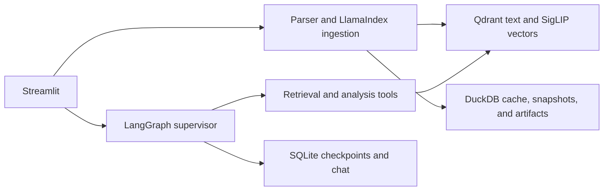

# DocMind AI product requirements

This document defines DocMind AI’s current product contract and release acceptance criteria. It separates implemented behavior from targets that still need reproducible evidence.

## Current state

The `feat/local-first-doc-parser` working tree contains the July 10, 2026 modernization effort. It is not a shipped release yet.

Implemented behavior:

- Docling, pypdfium2, RapidOCR, and ONNX Runtime form the one supported local parser path
- Direct UTF-8 loading is limited to `.txt`, `.md`, `.markdown`, and `.rst`
- LlamaIndex owns ingestion, chunking, caching, indexing, retrieval, and query-engine integration
- LangGraph owns multi-agent orchestration, with LangChain role agents inside the graph
- Qdrant owns dense, sparse, and SigLIP image vectors
- SigLIP is the only image embedding backend
- The default uv and Docker environments use official CPU-only PyTorch wheels
- GPU, multimodal reranking, observability, evaluation, and searchable-PDF capabilities are explicit extras; GraphRAG uses LlamaIndex core
- Parser model bundles use pinned revisions, file sizes, and SHA-256 hashes from `src/processing/parsing/model_artifacts.py`
- Package wheels include the parser, version module, and prompt resources

The current branch has passed focused and complete tiered tests, dependency
locking, byte-identical wheel builds and isolated content smoke, the real local
Qdrant system test, a production Docker build and container health smoke, and
independent code, runtime, and documentation reviews. The checked-in schema 3
parser artifact validates all eight fixtures over three deterministic isolated
runs. Pull-request CI, merge, and release publication remain pending. Separate
security hardening is tracked in issues #145–#150 and is not part of this
release lane.

The parser benchmark records network egress as `NOT_MEASURED`. It does not prove zero egress.

## Product goal

DocMind helps one local operator ingest documents, retrieve source-grounded context, and run analysis through a configurable language model backend.

The primary audiences are:

- Professionals handling private or proprietary documents
- Researchers who need source attribution and repeatable local indexes
- Developers who want a typed, testable retrieval and agent stack

## Product scope

DocMind supports these primary workflows:

1. Configure a local or explicitly approved OpenAI-compatible language model endpoint
2. Ingest supported local documents or explicit in-memory text
3. Parse, chunk, enrich, embed, and index the content
4. Retrieve text and page images through hybrid search
5. Run a LangGraph-supervised analysis flow
6. Persist chat, snapshot, artifact, and index metadata locally
7. Inspect readiness, validation, and operator diagnostics

## Functional requirements

### Ingest documents

- PRD-FR-001: Parse PDF, Office, HTML, and supported text formats through the canonical parser boundary
- PRD-FR-002: Preserve physical PDF pages and stable page identifiers
- PRD-FR-003: Reject malformed or partially converted binary documents before publication
- PRD-FR-004: Accept exactly one `source_path` or strict `payload_text` value for normalized ingestion inputs
- PRD-FR-005: Apply bounded source size, page count, render pixels, extracted text, and parser timeouts
- PRD-FR-006: Generate optional searchable-PDF artifacts after successful parsing

### Index and retrieve content

- PRD-FR-007: Chunk text through LlamaIndex `TokenTextSplitter`
- PRD-FR-008: Generate 1024-dimensional BGE-M3 dense text embeddings
- PRD-FR-009: Generate sparse vectors through direct FastEmbed support, with the documented BM25 and IDF fallback
- PRD-FR-010: Store named dense and sparse vectors in Qdrant
- PRD-FR-011: Fuse hybrid results through Qdrant Reciprocal Rank Fusion (RRF) by default, with Distribution-Based Score Fusion (DBSF) as an option
- PRD-FR-012: Deduplicate results by `page_id` or `doc_id` before the final result cut
- PRD-FR-013: Index and retrieve page images in the SigLIP embedding space
- PRD-FR-014: Apply bounded, fail-open text and visual reranking
- PRD-FR-015: Add the `knowledge_graph` tool only when GraphRAG configuration and an index are available

### Coordinate analysis

- PRD-FR-016: Use the repo-owned LangGraph `StateGraph` supervisor for agent orchestration
- PRD-FR-017: Build role agents through LangChain’s `create_agent` API
- PRD-FR-018: Expose retrieval and analysis tools through the central registry
- PRD-FR-019: Preserve deadline, retry, fallback, and checkpoint behavior across graph execution
- PRD-FR-020: Support Ollama and OpenAI-compatible endpoints for vLLM, LM Studio, llama.cpp server, and approved remote providers

### Persist local state

- PRD-FR-021: Persist snapshots through atomic staging and finalization
- PRD-FR-022: Record corpus, configuration, version, and artifact identity in snapshot manifests
- PRD-FR-023: Keep chat and LangGraph checkpoint data in SQLite with write-ahead logging where configured
- PRD-FR-024: Store page images through content-addressed artifact references
- PRD-FR-025: Keep raw document text, prompt text, model output, secrets, and absolute host paths out of telemetry

### Operate the application

- PRD-FR-026: Expose parser, package, Qdrant, and container readiness checks
- PRD-FR-027: Refuse automatic mutation of an incompatible existing Qdrant collection
- PRD-FR-028: Permit explicit Qdrant rebuild only when an exact count proves the collection empty and writers are quiescent
- PRD-FR-029: Run the Streamlit application with typed `DOCMIND_*` configuration
- PRD-FR-030: Keep remote endpoints disabled unless the operator enables and configures them

## Quality requirements

### Security and privacy

- NFR-1: Use local parser models with no hosted parser fallback
- NFR-2: Validate parser model files against the canonical immutable manifest before model initialization
- NFR-3: Reject symlink traversal and remove path-like metadata before persistence
- NFR-4: Validate non-loopback endpoints through explicit policy and DNS checks
- NFR-5: Keep secrets and raw content out of logs and telemetry
- NFR-6: Treat no-egress as a separately measured property, not an inference from offline configuration

### Reliability

- NFR-7: Terminate and reap the parser worker process after timeout or cancellation
- NFR-8: Terminate and reap the full OCRmyPDF process group on supported POSIX systems
- NFR-9: Fail closed when required parsing or model validation fails
- NFR-10: Fail open only for documented optional post-parse work
- NFR-11: Keep Qdrant schema inspection read-only during normal startup
- NFR-12: Preserve deterministic parser output across repeated fixture runs

### Maintainability

- NFR-13: Keep Python support at `>=3.12,<3.14` with CPython 3.12.13 as the primary runtime
- NFR-14: Use `pyproject.toml` and `uv.lock` as dependency authorities
- NFR-15: Require LlamaIndex core and only the selected integration packages
- NFR-16: Keep package `__init__.py` modules import-light
- NFR-17: Keep one owner for parser models, SigLIP loading, configuration, and package versioning
- NFR-18: Keep active specifications, architecture decisions, tests, and operator docs aligned with source

## Architecture boundaries

| Boundary | Owner | Responsibility |
| --- | --- | --- |
| User interface | Streamlit | Upload, settings, chat, diagnostics, and local operator actions |
| Parsing | `src/processing/parsing` | Format routing, bounded conversion, OCR, integrity checks, and canonical parser output |
| Ingestion and retrieval | LlamaIndex core and selected adapters | Documents, chunking, cache, indexes, retrievers, selectors, and query engines |
| Vector storage | Qdrant | Named dense, sparse, and SigLIP image vectors |
| Agent orchestration | LangGraph | Supervisor state, routing, deadlines, and checkpoints |
| Role agents | LangChain | Tool-calling agents created inside the LangGraph runtime |
| Persistence | SQLite, DuckDB, and artifact stores | Chat, checkpoints, caches, snapshots, and content-addressed files |
| Telemetry | OpenTelemetry and local JSON Lines | Metadata-only traces and events |

```mermaid
flowchart LR
    UI["Streamlit"] --> INGEST["Parser and LlamaIndex ingestion"]
    INGEST --> QDRANT["Qdrant text and SigLIP vectors"]
    UI --> GRAPH["LangGraph supervisor"]
    GRAPH --> TOOLS["Retrieval and analysis tools"]
    TOOLS --> QDRANT
    GRAPH --> STATE["SQLite checkpoints and chat"]
    INGEST --> SNAP["DuckDB cache, snapshots, and artifacts"]
```

## Runtime and package contract

The exact dependency contract lives in `pyproject.toml` and `uv.lock`.

| Surface | Current contract |
| --- | --- |
| Python | `>=3.12,<3.14`; primary CPython 3.12.13 |
| LlamaIndex | `llama-index-core>=0.14.21,<0.15.0` plus selected LLM, Hugging Face, Qdrant, and DuckDB adapters |
| Agent runtime | `langgraph>=1.0.10,<2.0.0` and LangChain 1.x |
| Parser | Docling 2.x, pypdfium2 5.x, RapidOCR 3.x, and ONNX Runtime 1.x |
| Text embeddings | BGE-M3 through the LlamaIndex Hugging Face adapter |
| Sparse embeddings | Direct `fastembed>=0.5.1` |
| Image embeddings | SigLIP through Transformers and Torch |
| PyTorch | `torch==2.8.0`; official CPU wheel by default |
| Vector database | `qdrant-client>=1.15.1,<2.0.0` |
| Local LLM client | `ollama==0.6.2` |

The package does not publish the `llama-index` meta-package, a `llama` extra, the removed OpenAI, FastEmbed, or CLIP LlamaIndex embedding adapters, or Whisper. It retains selected LlamaIndex LLM adapters, including OpenAI and OpenAI-compatible clients.

The wheel smoke test validates package contents and metadata. It installs the built wheel with `--no-deps`, so it does not prove pip dependency resolution. Supported installations use the locked uv environment or the repository Docker image.

## Verified behavior

The following evidence exists for the current modernization branch:

| Evidence | Result |
| --- | --- |
| Fast and complete tiered test gates | Passed after the final review-fix wave |
| Parser benchmark | Schema 3; 8/8 content-valid and deterministic over three isolated runs; zero errors |
| Package lock check | 306 locked packages validated |
| Package-focused tests | Passed after final release fixes |
| Wheel build and isolated smoke | Byte-identical repeated builds passed with `--no-deps` installation and packaged prompt loading |
| Parser-config hard cut | Focused tests passed |
| Ruff and configured Pyright | Passed for the complete tree |
| Runtime validation | Real Qdrant system test and production container health smoke passed |
| Independent review | Final code, release/runtime, and documentation passes returned no findings |

The parser benchmark artifact records clean source commit
`00265f92accf9f08993c7366fa0baa8e9b14b680`, the runtime identity, fixture
hashes, content assertions, and repeat-three output hashes. Its performance
values are a workstation-specific regression baseline.

## Release acceptance

### Required behavior

- [ ] Supported documents parse without publishing partial binary output
- [ ] Parser model integrity failures block parser readiness
- [ ] Hybrid retrieval returns source-attributed results
- [ ] SigLIP image retrieval uses the canonical image collection
- [ ] LangGraph orchestration preserves state and tool boundaries
- [ ] Snapshot creation and restore preserve manifest integrity
- [ ] The default install resolves official CPU-only Torch
- [ ] The wheel contains required source and prompt resources
- [ ] Remote endpoints remain opt-in

### Required release gates

- [x] Fast unit and integration gate
- [x] Wheel build, metadata validation, and content smoke
- [x] Schema 3 repeat-three parser benchmark regeneration
- [x] Final full test suite after all combined edits
- [x] Explicit system test with local Qdrant
- [x] Live Docker build and canonical container health check
- [x] Fresh independent code and documentation review
- [ ] Commit, pull request, hosted continuous integration, and merge

Security hardening outside this release lane is tracked in issues #145–#150.

## Product targets that still need evidence

These targets require a documented fixture set, hardware profile, command, and retained artifact:

- Retrieval relevance on representative document sets
- Query and reranking latency distributions
- Document parsing throughput
- CPU and GPU memory use
- Long-context model behavior
- Agent coordination overhead
- Network egress measurement

No throughput, latency, video memory, token-reduction, or zero-egress figure is accepted as verified without that evidence.

## Out of scope for version 1

- Multi-user accounts, permissions, and real-time collaboration
- Managed cloud hosting, cloud synchronization, or automatic backup
- Native mobile applications
- Automatic folder monitoring
- Hosted parser fallback
- PaddleOCR, VLM OCR, GPU OCR profiles, or Tesseract as the parser
- Alternate image embedding backends
- In-process vLLM or llama.cpp runtimes

## Product risks

- Local model and service setup can block first use
- Hardware differences can change latency and memory behavior
- Optional GraphRAG indexing and ColPali reranking expand the validation matrix
- Schema or embedding changes can require explicit reindexing
- A stale or incompatible Qdrant collection requires an operator decision
- Remote model endpoints change the privacy boundary

## Architecture references

- ADR-002: Text, sparse, and SigLIP embedding strategy
- ADR-004: Local-first language model strategy
- ADR-011: LangGraph supervisor
- ADR-019 and ADR-038: Optional GraphRAG and persistence
- ADR-031: Qdrant storage
- ADR-037: Multimodal reranking
- ADR-042: Container hardening
- ADR-045 and SPEC-002: Parser and ingestion pipeline
- ADR-058: Multimodal persistence
- ADR-063: Provider architecture
- ADR-065 and SPEC-044: Python and toolchain baseline
