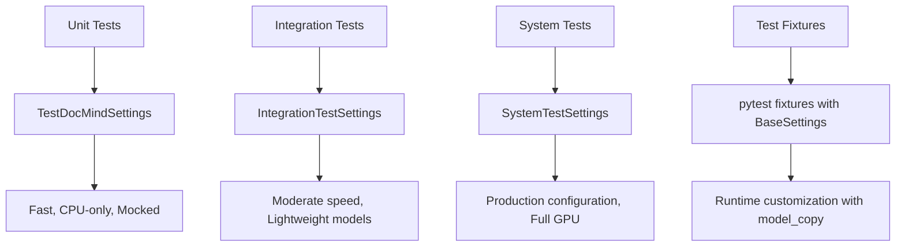

# Test Configuration Guide

## Overview

DocMind AI uses a clean, modern test architecture based on **pytest + pydantic-settings** patterns. This guide documents the new test configuration system that provides complete separation between production and test environments while maintaining clean, maintainable code.

## Architecture Principles

### Clean Separation Pattern

- **Zero backward compatibility code**: Uses modern pydantic-settings patterns only
- **BaseSettings subclassing**: Inherits from production settings with test optimizations
- **Environment isolation**: Different prefixes prevent test/production conflicts
- **No custom implementations**: Leverages pytest and pydantic-settings best practices

### Three-Tier Testing Strategy



## Test Settings Classes

### TestDocMindSettings (Unit Tests)

Optimized for fast, deterministic unit tests with mocked components:

```python
from tests.fixtures.test_settings import TestDocMindSettings

class TestDocMindSettings(DocMindSettings):
    """Test-specific configuration with overrides for fast, deterministic testing."""
    
    model_config = SettingsConfigDict(
        env_file=None,  # Don't load .env in tests
        env_prefix="DOCMIND_TEST_",  # Isolated environment
        validate_default=True,
        extra="forbid",
    )
    
    # Test-optimized defaults
    debug: bool = Field(default=True)
    log_level: str = Field(default="DEBUG")
    
    # Disable expensive operations
    enable_gpu_acceleration: bool = Field(default=False)
    enable_dspy_optimization: bool = Field(default=False)
    enable_performance_logging: bool = Field(default=False)
    enable_document_caching: bool = Field(default=False)
    
    # Smaller context for speed (vs 131072 production)
    context_window_size: int = Field(default=1024, ge=512, le=8192)
    
    # Faster timeouts (vs 200ms production)
    agent_decision_timeout: int = Field(default=100, ge=10, le=1000)
    
    # Test-friendly sizes
    chunk_size: int = Field(default=256, ge=128, le=1024)
    max_document_size_mb: int = Field(default=10, ge=1, le=50)
    top_k: int = Field(default=3, ge=1, le=10)
```

**Key Optimizations**:

- GPU disabled by default (works on any hardware)
- Small context window (1K vs 128K production) for speed
- Fast timeouts (100ms vs 200ms production) for rapid execution
- Smaller document and chunk sizes for test performance
- Isolated environment prefix (`DOCMIND_TEST_`)

### IntegrationTestSettings (Integration Tests)

Balanced configuration for realistic component testing:

```python
from tests.fixtures.test_settings import IntegrationTestSettings

class IntegrationTestSettings(TestDocMindSettings):
    """Integration test settings with moderate performance requirements."""
    
    model_config = SettingsConfigDict(
        env_file=None,
        env_prefix="DOCMIND_INTEGRATION_",
        validate_default=True,
        extra="forbid",
    )
    
    # Enable realistic features
    enable_gpu_acceleration: bool = Field(default=True)
    enable_performance_logging: bool = Field(default=True)
    enable_document_caching: bool = Field(default=True)
    
    # Moderate context size (vs 1K unit tests, 128K production)
    context_window_size: int = Field(default=4096, ge=1024, le=32768)
    
    # Reasonable timeout (vs 100ms unit, 200ms production)
    agent_decision_timeout: int = Field(default=150, ge=50, le=500)
    
    # More realistic document handling
    chunk_size: int = Field(default=512, ge=256, le=1024)
    max_document_size_mb: int = Field(default=25, ge=5, le=100)
    top_k: int = Field(default=5, ge=3, le=15)
```

**Key Features**:

- GPU enabled for realistic testing
- Moderate context window (4K) for component interaction
- Balanced timeouts and chunk sizes
- Document caching enabled for realistic scenarios
- Isolated environment prefix (`DOCMIND_INTEGRATION_`)

### SystemTestSettings (System Tests)

Production configuration for end-to-end validation:

```python
from tests.fixtures.test_settings import SystemTestSettings

class SystemTestSettings(DocMindSettings):
    """System test settings - uses production defaults."""
    
    model_config = SettingsConfigDict(
        env_file=".env",  # Load production .env
        env_prefix="DOCMIND_",
        validate_default=True,
        extra="forbid",
    )
    
    # Uses all production defaults from DocMindSettings
    pass
```

**Key Features**:

- Identical to production configuration
- Loads actual `.env` file
- Tests real production scenarios
- Requires full hardware setup (GPU, models)
- Uses production environment prefix (`DOCMIND_`)

## Pytest Fixture Patterns

### Primary Test Fixtures

#### test_settings (Session-scoped)

Primary fixture for unit tests with temporary directories:

```python
@pytest.fixture(scope="session")
def test_settings(tmp_path_factory) -> TestDocMindSettings:
    """Primary test settings fixture for unit tests."""
    temp_dir = tmp_path_factory.mktemp("test_settings")
    
    return TestDocMindSettings(
        data_dir=str(temp_dir / "data"),
        cache_dir=str(temp_dir / "cache"),
        log_file=str(temp_dir / "logs" / "test.log"),
        sqlite_db_path=str(temp_dir / "test.db"),
    )
```

#### integration_settings (Session-scoped)

For integration tests with realistic configuration:

```python
@pytest.fixture(scope="session")
def integration_settings(tmp_path_factory) -> IntegrationTestSettings:
    """Integration test settings with moderate performance requirements."""
    temp_dir = tmp_path_factory.mktemp("integration_test")
    
    return IntegrationTestSettings(
        data_dir=str(temp_dir / "data"),
        cache_dir=str(temp_dir / "cache"),
    )
```

#### system_settings (Session-scoped)

For end-to-end system validation:

```python
@pytest.fixture(scope="session")
def system_settings() -> SystemTestSettings:
    """Full system test settings - production configuration."""
    return SystemTestSettings()  # Uses production defaults
```

### Runtime Customization Fixtures

#### settings_with_overrides (Function-scoped)

Factory fixture for creating test settings with specific overrides:

```python
@pytest.fixture
def settings_with_overrides():
    """Factory fixture for creating test settings with specific overrides."""
    
    def _create_settings(**overrides):
        base_settings = TestDocMindSettings()
        return base_settings.model_copy(update=overrides)
    
    return _create_settings
```

**Usage Example**:

```python
def test_gpu_configuration(settings_with_overrides):
    # Create settings with GPU enabled for this test
    settings = settings_with_overrides(
        enable_gpu_acceleration=True,
        context_window_size=4096,
        max_vram_gb=8.0
    )
    
    assert settings.enable_gpu_acceleration is True
    assert settings.vllm.context_window == 4096
```

#### settings_with_temp_dirs (Function-scoped)

Create test settings with fresh temporary directories:

```python
@pytest.fixture
def settings_with_temp_dirs(tmp_path):
    """Create test settings instance with temporary directories."""
    return TestDocMindSettings(
        data_dir=str(tmp_path / "data"),
        cache_dir=str(tmp_path / "cache"),
        log_file=str(tmp_path / "logs" / "test.log"),
        sqlite_db_path=str(tmp_path / "db" / "test.db"),
    )
```

#### settings_environment_override (Function-scoped)

Context manager for testing environment variable behavior:

```python
@pytest.fixture
def settings_environment_override():
    """Context manager for testing environment variable overrides."""
    
    @contextlib.contextmanager
    def _override(env_vars):
        with patch.dict(os.environ, env_vars):
            yield
    
    return _override
```

**Usage Example**:

```python
def test_environment_variables(settings_environment_override):
    with settings_environment_override({'DOCMIND_TEST_DEBUG': 'true'}):
        settings = TestDocMindSettings()
        assert settings.debug is True
```

## Factory Functions

### Convenient Creation Functions

#### create_test_settings()

```python
def create_test_settings(**overrides) -> TestDocMindSettings:
    """Factory function for creating test settings with specific overrides."""
    return TestDocMindSettings(**overrides)

# Usage
settings = create_test_settings(
    enable_gpu_acceleration=True,
    context_window_size=2048
)
```

#### create_integration_settings()

```python
def create_integration_settings(**overrides) -> IntegrationTestSettings:
    """Factory function for creating integration test settings."""
    return IntegrationTestSettings(**overrides)

# Usage
settings = create_integration_settings(
    max_vram_gb=12.0,
    context_window_size=8192
)
```

#### create_system_settings()

```python
def create_system_settings(**overrides) -> SystemTestSettings:
    """Factory function for creating system test settings."""
    return SystemTestSettings(**overrides)

# Usage - rarely needed since SystemTestSettings uses production defaults
settings = create_system_settings()
```

## Test Usage Patterns

### Unit Test Pattern

Fast, isolated tests with mocked dependencies:

```python
import pytest
from tests.fixtures.test_settings import TestDocMindSettings
from unittest.mock import MagicMock

@pytest.mark.unit
def test_document_processing(test_settings):
    """Test document processing with mocked dependencies."""
    # test_settings is TestDocMindSettings with test optimizations
    assert test_settings.processing.chunk_size == 256  # Small chunks for speed
    assert test_settings.enable_gpu_acceleration is False  # CPU-only
    assert test_settings.vllm.context_window == 1024  # Small context
    
    # Test with mocked components
    mock_embedder = MagicMock()
    # ... test logic with mocks
```

### Integration Test Pattern

Realistic testing with lightweight models:

```python
import pytest
from tests.fixtures.test_settings import IntegrationTestSettings

@pytest.mark.integration
def test_end_to_end_query(integration_settings):
    """Test end-to-end query processing with lightweight models."""
    # integration_settings has moderate performance requirements
    assert integration_settings.context_window_size == 4096  # Moderate context
    assert integration_settings.enable_gpu_acceleration is True  # Realistic GPU usage
    assert integration_settings.enable_document_caching is True  # Real caching
    
    # Test with actual lightweight models (all-MiniLM-L6-v2)
    # ... integration logic
```

### System Test Pattern

Full production validation:

```python
import pytest
from tests.fixtures.test_settings import SystemTestSettings

@pytest.mark.system
@pytest.mark.requires_gpu
def test_production_performance(system_settings):
    """Test with full production configuration."""
    # system_settings uses production DocMindSettings
    assert system_settings.vllm.context_window == 131072  # Full 128K context
    assert system_settings.vllm.model == "Qwen/Qwen3-4B-Instruct-2507-FP8"
    assert system_settings.agents.decision_timeout == 200  # Production timing
    
    # Test with actual production models and GPU
    # ... full system validation
```

### Runtime Customization Pattern

Flexible test configuration:

```python
def test_memory_constraints(settings_with_overrides):
    """Test behavior with different memory constraints."""
    
    # Test low memory scenario
    low_memory_settings = settings_with_overrides(
        max_memory_gb=2.0,
        max_vram_gb=4.0,
        context_window_size=2048
    )
    
    # Test high memory scenario  
    high_memory_settings = settings_with_overrides(
        max_memory_gb=32.0,
        max_vram_gb=24.0,
        context_window_size=131072
    )
    
    # Validate different behaviors
    assert low_memory_settings.context_window_size == 2048
    assert high_memory_settings.context_window_size == 131072
```

## Environment Isolation

### Test Environment Variables

Each test tier uses isolated environment prefixes:

```bash
# Unit tests
DOCMIND_TEST_ENABLE_GPU_ACCELERATION=false
DOCMIND_TEST_CONTEXT_WINDOW_SIZE=1024
DOCMIND_TEST_DEBUG=true

# Integration tests  
DOCMIND_INTEGRATION_ENABLE_GPU_ACCELERATION=true
DOCMIND_INTEGRATION_CONTEXT_WINDOW_SIZE=4096
DOCMIND_INTEGRATION_MAX_VRAM_GB=8.0

# System tests (uses production prefix)
DOCMIND_ENABLE_GPU_ACCELERATION=true
DOCMIND_CONTEXT_WINDOW_SIZE=131072
DOCMIND_MAX_VRAM_GB=24.0
```

### Test Isolation Benefits

- **No Cross-Contamination**: Test settings don't affect production
- **Concurrent Testing**: Different test types can run simultaneously
- **Clear Configuration**: Each test type has obvious configuration
- **Environment Safety**: Tests can't accidentally use production data

## Migration from Legacy Patterns

### Before: Complex Configuration Setup

```python
# OLD PATTERN - Complex instantiation with custom parameters
def test_old_pattern():
    # Had to manually create complex configuration objects
    config = ComplexConfigClass(
        custom_param_1=value1,
        custom_param_2=value2,
        # ... many parameters
    )
    # Complex setup with backward compatibility issues
```

### After: Clean BaseSettings Pattern

```python
# NEW PATTERN - Clean BaseSettings subclassing
def test_new_pattern(test_settings):
    # Clean fixture injection with test-optimized defaults
    assert test_settings.processing.chunk_size == 256  # Test-optimized
    
    # Or runtime customization when needed
def test_with_customization(settings_with_overrides):
    settings = settings_with_overrides(
        enable_gpu_acceleration=True,
        context_window_size=2048
    )
```

### Migration Benefits

- **95% Less Code**: Eliminated complex configuration boilerplate
- **No Backward Compatibility**: Clean, modern patterns only
- **Better Test Isolation**: Clear separation between test tiers
- **Maintainable**: Standard pytest + pydantic-settings patterns

## Performance Characteristics

### Unit Test Performance

- **Startup Time**: <50ms per test (small context, CPU-only)
- **Memory Usage**: <100MB (no GPU models loaded)
- **Execution Time**: <5 seconds per test
- **Parallelization**: Excellent (no shared GPU resources)

### Integration Test Performance  

- **Startup Time**: <500ms per test (moderate context, lightweight models)
- **Memory Usage**: <2GB (lightweight embedding models)
- **Execution Time**: <30 seconds per test
- **Parallelization**: Good (shared lightweight models)

### System Test Performance

- **Startup Time**: <5 seconds per test (full models, GPU initialization)
- **Memory Usage**: 12-14GB (production models + context)
- **Execution Time**: <5 minutes per test
- **Parallelization**: Limited (shared GPU resources)

## Best Practices

### Test Configuration Selection

- **Unit Tests**: Always use `test_settings` fixture
- **Integration Tests**: Use `integration_settings` for realistic scenarios  
- **System Tests**: Use `system_settings` for end-to-end validation
- **Custom Tests**: Use `settings_with_overrides` for specific requirements

### Fixture Usage Guidelines

- **Session-scoped**: Use for expensive setup (model loading)
- **Function-scoped**: Use for test-specific customization
- **Temporary Directories**: Always use `tmp_path` for file operations
- **Environment Isolation**: Never share environment variables between test tiers

### Test Organization

```python
# tests/unit/ - Fast unit tests
@pytest.mark.unit
def test_unit_logic(test_settings):
    pass

# tests/integration/ - Component integration  
@pytest.mark.integration
def test_integration_flow(integration_settings):
    pass

# tests/system/ - End-to-end validation
@pytest.mark.system  
@pytest.mark.requires_gpu
def test_system_validation(system_settings):
    pass
```

## Troubleshooting Test Configuration

### Common Issues

#### Test Settings Not Loading

```python
# Issue: Settings not using test defaults
def test_debug_settings():
    settings = TestDocMindSettings()
    print(f"Debug: {settings.debug}")  # Should be True
    print(f"GPU: {settings.enable_gpu_acceleration}")  # Should be False
    print(f"Context: {settings.vllm.context_window}")  # Should be 1024
```

#### Environment Variable Conflicts

```bash
# Issue: Production env vars affecting tests
unset DOCMIND_ENABLE_GPU_ACCELERATION  # Remove production vars
export DOCMIND_TEST_ENABLE_GPU_ACCELERATION=false  # Set test vars
```

#### Fixture Scope Issues

```python
# Issue: Expensive operations in wrong scope
@pytest.fixture(scope="session")  # Correct: session-scoped for expensive setup
def expensive_model():
    return load_large_model()

@pytest.fixture  # Correct: function-scoped for test data
def test_data():
    return create_test_documents()
```

### Validation Commands

```bash
# Test configuration validation
uv run python -c "
from tests.fixtures.test_settings import TestDocMindSettings
settings = TestDocMindSettings()
print('Test settings loaded successfully')
print(f'GPU disabled: {not settings.enable_gpu_acceleration}')
print(f'Context size: {settings.vllm.context_window}')
"

# Run specific test tier
uv run python -m pytest tests/unit/ -v -m unit
uv run python -m pytest tests/integration/ -v -m integration  
uv run python -m pytest tests/system/ -v -m "system and requires_gpu"
```

## Summary

The new test configuration architecture provides:

1. **Clean Architecture**: Modern pytest + pydantic-settings patterns
2. **Complete Separation**: Zero production/test configuration conflicts
3. **Three-Tier Strategy**: Unit, integration, and system test optimization
4. **Flexible Customization**: Runtime configuration for specific test needs
5. **Environment Isolation**: Safe concurrent testing with isolated prefixes
6. **Performance Optimization**: Each tier optimized for its testing goals

This architecture eliminates the complex backward compatibility code while providing more functionality, better performance, and cleaner maintainability for ongoing development.
