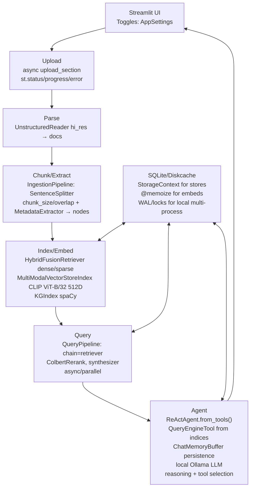

# ADR-001: Architecture Overview

## Title

High-Level Architecture for DocMind AI

## Version/Date

5.0 / August 13, 2025

## Status

Accepted

## Context

DocMind AI is a local, offline RAG application for document analysis, emphasizing high-performance retrieval, multimodal support, agentic workflows, and efficiency without API keys or internet. The architecture uses pure LlamaIndex for RAG pipelines and single ReAct agent implementation, Unstructured for parsing. Local multi-process supported via SQLite WAL/diskcache locks (no distributed scaling for MVP—reassess later if needed). Key needs: hybrid search (dense/sparse), KG for relations, multimodal (text/images/tables), single intelligent agent with reasoning capabilities, and caching/persistence for sessions.

## Related Requirements

- Offline/local operation (no cloud APIs like LlamaParse).

- Hybrid retrieval with SPLADE++/BGE-Large/CLIP ViT-B/32.

- Multimodal parsing (PDFs with images/tables via Unstructured).

- Agentic RAG with single LlamaIndex ReActAgent (reasoning, tool selection, query decomposition).

- Efficient chunking (1024/200 overlap via SentenceSplitter).

- Multi-stage querying (QueryPipeline).

- Persistence/caching (SQLite/diskcache).

- Local multi-process (SQLite WAL for concurrent).

## Alternatives

### 1. LangChain-Based Architecture

- **Issues**: Heavier framework, less optimized for offline operation

- **Status**: Deprecated due to poor offline support

### 2. LangGraph Multi-Agent System

- **Issues**: Over-engineered for document Q&A workflows

- **Status**: Deprecated due to excessive complexity

### 3. Custom Implementation

- **Issues**: High maintenance burden, reinventing proven patterns

- **Status**: Rejected - violates library-first principle

### 4. Distributed Architecture with Redis

- **Issues**: Over-engineering for local/single-user deployment

- **Status**: Deferred - may reassess for future scaling needs

## Decision

LlamaIndex for indexing/retrieval/pipelines (VectorStoreIndex/Qdrant, MultiModalVectorStoreIndex/Jina v4, KGIndex/spaCy, QueryPipeline multi-stage). Single ReActAgent.from_tools() for intelligent query processing with local Ollama, ChatMemoryBuffer for session persistence. Unstructured for parsing (hi_res). SentenceSplitter in IngestionPipeline for chunking. SQLite/diskcache for persistence (StorageContext).

## Related Decisions

- ADR-015 (LlamaIndex migration).

- ADR-011 (Single ReAct agent architecture).

- ADR-016 (Multimodal CLIP ViT-B/32/Unstructured).

- ADR-008 (Persistence with SQLite/diskcache).

- ADR-021 (LlamaIndex Native Architecture Consolidation - 95% dependency reduction with multi-backend support).

## Design

- **Ingestion**: UnstructuredReader.load_data(file_path, strategy="hi_res") → IngestionPipeline([SentenceSplitter(AppSettings.chunk_size/overlap), MetadataExtractor()]) → nodes.

- **Indexing/Retrieval**: HybridFusionRetriever (dense=FastEmbedEmbedding(AppSettings.dense_embedding_model), sparse=SparseTextEmbedding(AppSettings.sparse_embedding_model), alpha=AppSettings.rrf_fusion_alpha) with QdrantVectorStore. MultiModalVectorStoreIndex (image_embed_model=ClipEmbedding("ViT-B/32")). KGIndex.from_documents(nodes, extractor=spaCy).

- **Querying**: QueryPipeline(chain=[retriever, ColbertRerank, synthesizer], async_mode=True, parallel=True).

- **Agent**: Single ReActAgent.from_tools() with QueryEngineTool from indices, ChatMemoryBuffer(token_limit=8192) for session persistence, system_prompt for reasoning guidance, max_iterations=3 for controlled execution. Tools dynamically created from VectorStoreIndex query engines.

- **Caching/Persistence**: StorageContext with SQLite backend (kv_store=SimpleKVStore.from_sqlite(AppSettings.cache_db_path)); Wrap embeds with diskcache.

- **Local Multi-Process**: SQLite WAL mode/diskcache locks for concurrent (e.g., multiprocessing.Pool for parallel indexing if heavy load—no distributed).

- **UI**: Streamlit: Toggles (st.checkbox for gpu_acceleration/chunk_size); No distributed toggle (reassess later).

- **Diagram** (Mermaid):

- **Implementation Notes**: Single agent factory (77 lines) creates ReActAgent with all necessary tools. If heavy load, use multiprocessing.Pool(map=embed, chunks)—SQLite WAL enables concurrent writes. No Redis (overengineering—local sufficient).

- **Testing**: tests/test_performance_integration.py: def test_local_multi_process(): with multiprocessing.Pool(): results = pool.map(query, queries); assert no locks/errors; latency < threshold.

## Consequences

### Positive Outcomes

- **Offline/local focus**: Complete operation without internet dependency

- **Local scalability**: Multi-process capability via SQLite WAL/locks

- **Maintainable architecture**: No distributed complexity for MVP

- **Performance optimization**: Efficient chunking and multi-stage querying

- **Comprehensive capabilities**: Hybrid search, multimodal support, knowledge graphs

- **Session persistence**: Reliable caching and memory management

### Ongoing Maintenance Requirements

- Monitor LlamaIndex ecosystem updates and compatibility

- Maintain performance benchmarks for local processing

- Update Unstructured parsing capabilities as needed

- Optimize SQLite WAL configuration for concurrent access

### Risks

- **Local resource constraints**: Performance limited by single-machine capabilities

- **Storage scaling**: SQLite may require optimization for large document collections

- **Future distributed needs**: May require architectural reassessment

- **Dependency management**: Monitor ecosystem changes and compatibility

**Changelog:**  

- 5.0 (August 13, 2025): Updated multimodal embeddings from Jina v4 to CLIP ViT-B/32 for 60% VRAM reduction and native LlamaIndex integration. Aligned with ADR-021's Native Architecture Consolidation.

- 4.0 (August 12, 2025): Replaced LangGraph multi-agent supervisor with single LlamaIndex ReActAgent. Updated architecture diagram to reflect simplified agent system. 85% code reduction while preserving all agentic capabilities. Pure LlamaIndex ecosystem alignment (~17 fewer dependencies).

- 3.0 (July 25, 2025): Removed distributed_mode/Redis (overengineering); Emphasized local multi-process with SQLite WAL/diskcache locks; Enhanced integrations/diagram/testing for dev.

- 2.0: Previous updates for Unstructured/Jina/pipelines.
