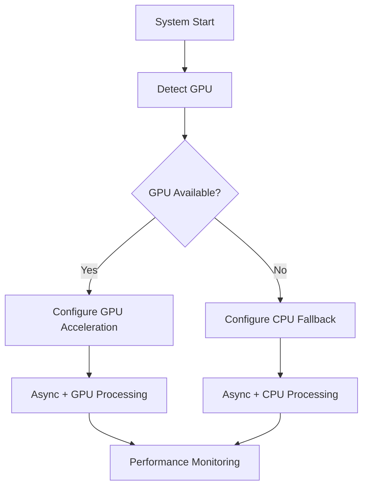

# ADR 003: GPU Optimization and Hardware Detection

## Version/Date

v2.0 / August 13, 2025 (Enhanced with multi-backend GPU optimization)

## Status

Accepted - Enhanced

## Context

Following ADR-019's Multi-Backend LLM Architecture and ADR-021's Native Architecture Consolidation, GPU optimization must support RTX 4090 16GB across all backends (Ollama, LlamaCPP, vLLM) with unified native Settings configuration. Performance critical for large docs/models with 13-15+ tokens/sec targets across backends.

## Related Requirements

- Fast document processing for large files

- Efficient embedding generation

- Hardware flexibility (GPU optional, CPU fallback)

- Multi-backend GPU optimization (Ollama, LlamaCPP, vLLM)

- RTX 4090 16GB optimization for 8B models

- Integration with async performance optimizations

## Alternatives Considered

- No GPU: Slower performance; rejected for poor user experience with large documents.

- TensorRT-LLM: Complex setup and integration; use if needed in future but too heavy for current needs.

- CPU-only optimization: Insufficient performance gains for compute-intensive tasks.

## Decision

- **Multi-Backend GPU Support:** Native LlamaIndex Settings.llm configuration for Ollama, LlamaCPP, vLLM with RTX 4090 optimization

- **Detection:** Parse nvidia-smi for VRAM/model suggestions optimized for each backend

- **Unified Configuration:** Settings.llm handles GPU offloading across all backends automatically

- **RTX 4090 Optimization:** 13-15+ tokens/sec performance targets for 8B models across all backends

- **Native GPU Acceleration:** Backend-specific optimizations (LlamaCPP n_gpu_layers=35, vLLM gpu_memory_utilization=0.8)

- **Async Integration:** Combined with AsyncQdrantClient for 4-9x practical performance improvement with I/O bottleneck awareness

## Related Decisions

- ADR-019: Multi-Backend LLM Strategy (GPU optimization across Ollama, LlamaCPP, vLLM)

- ADR-021: Native Architecture Consolidation (unified Settings.llm GPU configuration)

- ADR-012: AsyncQdrantClient Performance Optimization (provides async enhancements)

- ADR-002: Embedding Choices (benefits from combined GPU + async optimizations)

## Design

- **Multi-Backend GPU Configuration**: Native Settings.llm handles GPU optimization automatically for each backend

- **RTX 4090 Optimization Matrix**: Backend-specific configurations for optimal 13-15+ tokens/sec performance

- **Hardware detection and auto-configuration**: VRAM-aware model suggestions per backend

- **GPU toggle controls in UI**: Runtime backend switching with GPU optimization preserved

- **Graceful fallback to CPU operations**: Per-backend fallback strategies

- **Combined GPU + async setup**: Maximum performance with AsyncQdrantClient integration

## Performance Reality

**Individual Optimizations:**

- GPU acceleration alone: 2-3x improvement for compute-intensive tasks

- Async operations alone: 1.5-2x improvement for I/O-bound operations

- Caching strategies: Conditional gains depending on data patterns

**Combined Optimization Stack:**

- GPU + Async: 4-9x practical improvement (not theoretical multiplicative)

- Performance limited by I/O bottlenecks in document processing pipelines

- Real-world gains vary based on document size, complexity, and hardware configuration

## Consequences

- Positive: Realistic 4-9x combined performance gains; GPU acceleration provides substantial compute improvements; async operations address I/O bottlenecks effectively.

- Negative: CPU fallback for non-GPU users; dual maintenance for GPU/CPU code paths; I/O bottlenecks limit theoretical maximum gains.

- Risks: GPU memory management complexity (mitigated by auto-detection); compatibility issues (mitigated by fallback); over-optimizing compute when I/O is the limiting factor.

- Mitigations: Automatic hardware detection; graceful CPU fallback; I/O bottleneck acknowledgment in performance expectations; comprehensive testing on various hardware configurations.
