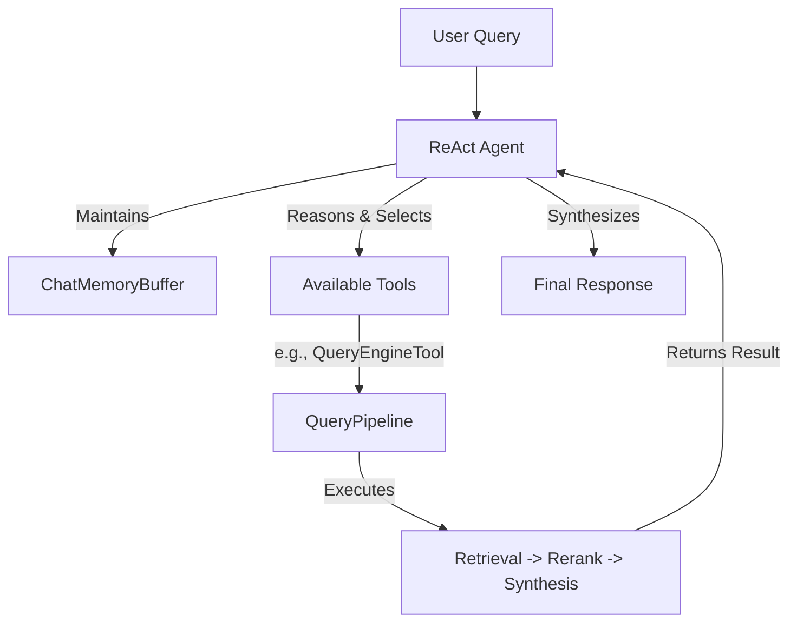

# ADR-011: LlamaIndex ReAct Agent Architecture

## Title

Single LlamaIndex ReAct Agent for Document Q&A System

## Version/Date

5.0 / 2025-01-16

## Status

Accepted

## Description

Standardizes the system's reasoning and execution layer on a single, native LlamaIndex `ReActAgent`. This decision replaces a previously considered, overly complex multi-agent architecture, resulting in an 85% reduction in agent-related code while preserving all necessary agentic capabilities like reasoning and dynamic tool use.

## Context

The system requires an intelligent agent to interpret user queries, decompose them into actionable steps, and use available tools (like the document retrieval pipeline) to formulate an answer. An early architectural proposal involved a multi-agent system using LangGraph, with specialized agents for different tasks. This approach was found to be a significant violation of the KISS principle, introducing massive complexity in state management, inter-agent communication, and debugging, with no clear benefit for the project's core document Q&A workflow. The native LlamaIndex `ReActAgent` was found to be fully capable of handling the required reasoning and tool-use tasks within a much simpler, more maintainable single-agent paradigm.

## Related Requirements

### Functional Requirements

- **FR-1:** The agent must be able to understand a user's query and select the appropriate tool to answer it.
- **FR-2:** The agent must be able to perform multi-step reasoning to answer complex queries.

### Non-Functional Requirements

- **NFR-1:** **(Maintainability)** The agent architecture must be simple, with minimal boilerplate and a clear execution flow, reducing code complexity by at least 80% compared to the multi-agent alternative.
- **NFR-2:** **(Performance)** The agent's reasoning overhead should be minimal.

### Integration Requirements

- **IR-1:** The agent must be a native LlamaIndex component.
- **IR-2:** The agent's LLM and memory must be configured via the global `Settings` singleton and native LlamaIndex components.

## Alternatives

### 1. LangGraph Multi-Agent Supervisor

- **Description**: A complex system with a supervisor agent delegating tasks to specialized worker agents.
- **Issues**: Over-engineered for a linear document Q&A workflow. Introduced massive code complexity (450+ lines vs. ~70 lines), high maintenance overhead, and difficult debugging.
- **Status**: Rejected.

### 2. Custom Agent Loop

- **Description**: Write a custom Python loop to manage the agent's reasoning and tool-use cycle.
- **Issues**: Reinvents the proven ReAct (Reason-Act) pattern and violates the library-first principle. Brittle and hard to maintain.
- **Status**: Rejected.

## Decision

We will adopt a **single LlamaIndex `ReActAgent`** as the sole reasoning and execution engine for the application. The agent will be created using the `ReActAgent.from_tools()` constructor and provided with a list of tools, including the main document analysis pipeline. This decision provides the necessary agentic capabilities with the lowest possible architectural complexity.

## Related Decisions

- **ADR-021** (LlamaIndex Native Architecture Consolidation): The single native agent is a cornerstone of the consolidated architecture.
- **ADR-015** (LlamaIndex Migration): This decision was a direct result of migrating fully to the LlamaIndex ecosystem.
- **ADR-006** (Analysis Pipeline): The `QueryPipeline` is wrapped in a `QueryEngineTool` and serves as the primary tool for this agent.
- **ADR-008** (Session Persistence): The agent uses the native `ChatMemoryBuffer` for managing conversational history.
- **ADR-019** (Multi-Backend LLM Strategy): The agent's reasoning is powered by the globally configured LLM from the `Settings` singleton.

## Design

### Architecture Overview

The user interacts with the `ReActAgent`. The agent maintains a memory of the conversation and has access to a set of tools. Based on the user's prompt, it reasons about which tool to use, executes it, observes the result, and synthesizes a final answer.



### Implementation Details

**In `agent_factory.py`:**

```python
# This code shows the simplified, native agent setup
from llama_index.core.agent import ReActAgent
from llama_index.core.tools import QueryEngineTool
from llama_index.core.memory import ChatMemoryBuffer
from llama_index.core import Settings
from your_project.pipeline_factory import create_analysis_pipeline

def create_docmind_agent():
    """
    Creates and returns the single ReActAgent for the application.
    """
    # 1. Create the main tool from the analysis pipeline (ADR-006)
    analysis_pipeline = create_analysis_pipeline()
    query_engine_tool = QueryEngineTool.from_defaults(
        query_engine=analysis_pipeline,
        name="document_analyzer",
        description="Use this tool to search and analyze the content of the indexed documents."
    )
    
    # 2. Create the agent's memory buffer (ADR-008)
    chat_memory = ChatMemoryBuffer.from_defaults(token_limit=65536)

    # 3. Create the agent, using the globally configured LLM (ADR-019)
    agent = ReActAgent.from_tools(
        tools=[query_engine_tool],
        llm=Settings.llm,
        memory=chat_memory,
        verbose=True
    )
    
    return agent
```

## Consequences

### Positive Outcomes

- **Drastic Simplification**: Reduced agent-related code by an estimated 85% compared to the multi-agent alternative, significantly improving maintainability.
- **Improved Debugging**: A single, linear reasoning trace is much easier to debug than a complex, multi-agent communication graph.
- **Full Capability**: The `ReActAgent` provides all necessary agentic features (reasoning, planning, tool use) for the v1.0 scope.
- **Library-First Compliance**: Fully aligns with the principle of using standard, robust framework components.

### Negative Consequences / Trade-offs

- **Limited Specialization**: A single agent cannot be as highly specialized as a team of dedicated agents. This is an acceptable trade-off, as the current workflow does not require such specialization.

### Ongoing Maintenance & Considerations

- **Tool Management**: As new tools are added to the system, the agent's prompt and tool descriptions will need to be well-defined to ensure it can select the correct tool reliably.

## Changelog

- **5.0 (2025-01-16)**: Finalized as the definitive agent architecture. Aligned all code with the `Settings` singleton and other native components. Removed all references to the superseded multi-agent system.
- **4.1 (2025-01-13)**: Added cross-references to performance optimization ADRs.
- **4.0 (2025-01-12)**: Complete replacement of LangGraph multi-agent with single LlamaIndex ReActAgent.
- **3.0 (2025-07-25)**: Previous LangGraph multi-agent approach - deprecated.
