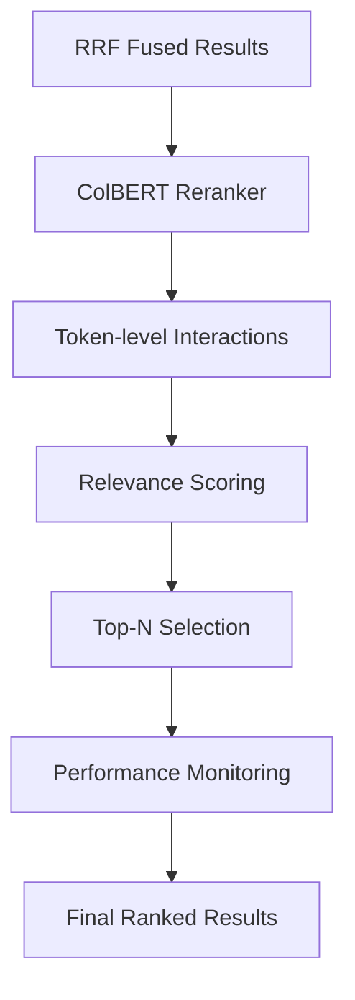

# ADR 014: ColBERT Reranking Strategy

## Version/Date

v1.0 / July 25, 2025

## Status

Accepted

## Context

Post-retrieval reranking is essential for improving RAG quality after RRF fusion. ColBERT (Late Interaction) provides superior ranking performance compared to traditional cross-encoders by using token-level interactions while maintaining efficiency. Required for Phase 2.2 completion.

## Related Requirements

- High-quality document reranking after RRF fusion

- Performance monitoring and optimization

- GPU acceleration support

- Integration with LlamaIndex postprocessors

## Alternatives Considered

- Jina Reranker v2: Good performance but superseded by ColBERT for better token-level interactions.

- BM25-based reranking: Fast but less effective than neural models; rejected for quality.

- No reranking: Lower context quality; rejected for production requirements.

- Cross-encoder models: Slower than ColBERT late interaction; rejected for performance.

## Decision

Implement ColBERT reranking as a postprocessor with:

- **Model**: ColBERT v2.0 (colbert-ir/colbertv2.0) via LlamaIndex ColbertRerank

- **Performance Monitoring**: Wrapper class tracking reranking time and query counts

- **Parameters**: top_n=reranking_top_k (default 5), keep_retrieval_score=True

- **Integration**: LlamaIndex postprocessor pipeline after RRF retrieval

## Related Decisions

- ADR 013: RRF Hybrid Search (provides input for ColBERT reranking)

- ADR 007: Reranking Strategy (superseded by this ColBERT implementation)

- ADR 003: GPU Optimization (enables ColBERT GPU acceleration)

## Design

- ColBERT reranker with performance monitoring wrapper

- Integration as LlamaIndex postprocessor

- Real-time performance metrics (timing, query counts)

- Graceful fallback if initialization fails

## Consequences

- Positive: Superior ranking quality with token-level interactions, performance monitoring, efficient late interaction architecture.

- Negative: Higher compute overhead vs. no reranking; additional model loading time.

- Risks: Model initialization failure (mitigated by graceful fallback); GPU memory usage (mitigated by monitoring).

- Mitigations: Performance monitoring for optimization; fallback handling; GPU resource management.
