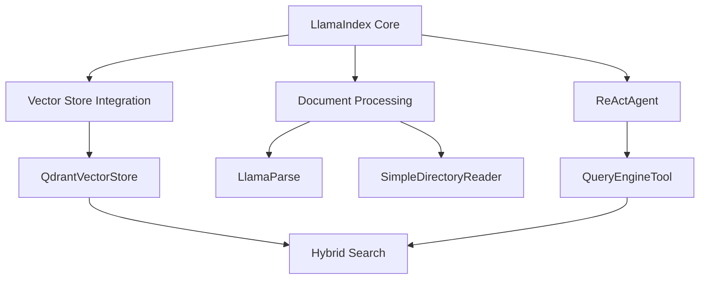

# ADR 015: Migration from LangChain to LlamaIndex

## Version/Date

v1.0 / July 25, 2025

## Status

Accepted

## Context

The project initially used LangChain as the primary orchestration framework based on its ecosystem maturity and extensive tooling. However, during development phase, several factors led to reconsidering this architectural choice:

1. **Agent Capabilities**: LlamaIndex's ReActAgent provided superior out-of-the-box functionality for document-centric workflows
2. **Integration Simplicity**: Native integration with Qdrant vector store and embedding models reduced complexity
3. **Performance**: Lower overhead and better memory management for document processing pipelines
4. **Documentation**: More comprehensive examples and patterns for RAG-specific use cases
5. **Hybrid Search**: Built-in support for dense/sparse vector combinations without custom implementations

## Related Requirements

- Simplified development and maintenance overhead

- Better performance for document indexing and retrieval

- Native hybrid search capabilities

- Streamlined agent orchestration for RAG workflows

## Alternatives Considered

- **Stay with LangChain**: Familiar ecosystem but higher complexity for document-focused use cases; rejected for performance overhead.

- **Dual Framework Approach**: Use both LangChain and LlamaIndex for different components; rejected for maintenance complexity.

- **Custom Framework**: Build lightweight orchestration layer; rejected for development time and maintenance burden.

- **Haystack Migration**: Alternative document AI framework; rejected for smaller ecosystem and learning curve.

## Decision

Migrate the entire orchestration layer from LangChain to LlamaIndex as the primary framework for:

- **Document Processing**: LlamaIndex SimpleDirectoryReader and LlamaParse integration

- **Agent Orchestration**: ReActAgent with native tool integration

- **Vector Store Management**: Native QdrantVectorStore with hybrid search support

- **Query Processing**: Unified query engines with built-in retrieval strategies

- **Memory Management**: ChatMemoryBuffer for conversational context

Retain LangGraph as optional dependency for future multi-agent implementations while using LlamaIndex as the core framework.

## Related Decisions

- ADR 010: LangChain Integration (superseded by this decision)

- ADR 011: LangGraph Multi-Agent (updated to use LlamaIndex as primary with optional LangGraph)

- ADR 013: RRF Hybrid Search (benefits from LlamaIndex native hybrid support)

## Design

- Single framework architecture with LlamaIndex as core orchestrator

- ReActAgent with QueryEngineTool for document interactions

- Native hybrid search using dense + sparse embeddings

- Simplified dependency tree removing LangChain orchestration components

## Consequences

- Positive: Simplified codebase with single framework, better performance for document processing, native hybrid search support, improved agent capabilities, reduced dependency complexity.

- Negative: Need to rewrite existing LangChain code, learning curve for team members familiar with LangChain, some LangChain-specific features unavailable.

- Risks: Framework lock-in with LlamaIndex (mitigated by strong ecosystem); potential integration issues (mitigated by comprehensive testing).

- Mitigations: Maintain LangGraph compatibility for multi-agent features; use LangChain tools via adapters if needed; comprehensive migration testing.
