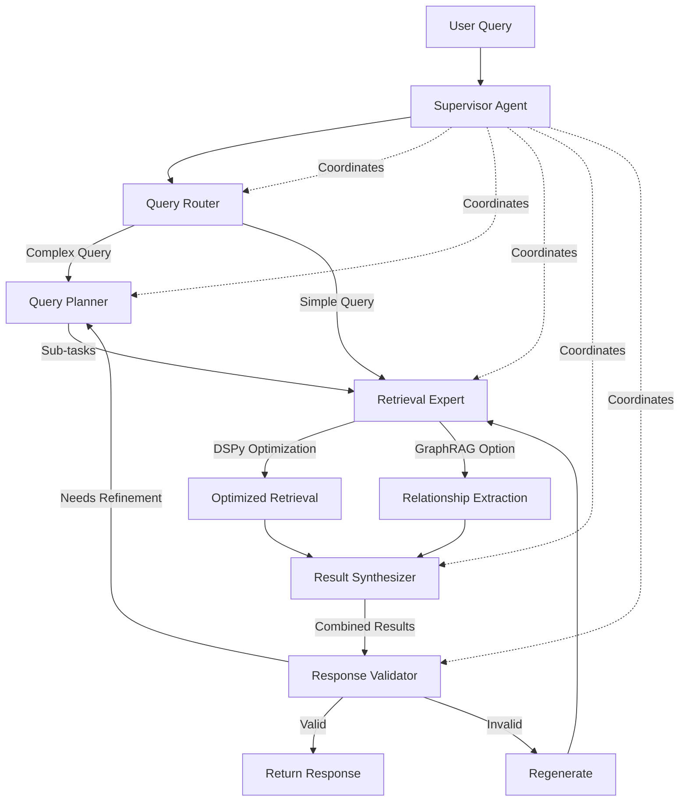

# ADR-001: Modern Agentic RAG Architecture

## Title

Lightweight Multi-Agent RAG with Adaptive Routing and Self-Correction

## Version/Date

7.0 / 2025-08-19

## Status

Accepted

## Description

Implements a simplified agentic RAG architecture using the `langgraph-supervisor` library for orchestration, incorporating Adaptive RAG (routing), Corrective RAG (fallback), and Self-RAG (quality control) patterns. The system leverages proven supervisor patterns to dramatically reduce implementation complexity while maintaining local-first operation and intelligent query processing.

**Enhanced Capabilities:**

- **DSPy Prompt Optimization** (ADR-018): Automatic query rewriting and prompt optimization for improved retrieval quality
- **Optional GraphRAG** (ADR-019): LlamaIndex PropertyGraphIndex for multi-hop reasoning and relationship extraction when enabled

## Context

Traditional RAG systems suffer from fixed retrieval patterns that cannot adapt to query complexity or handle retrieval failures gracefully. Modern agentic RAG addresses these limitations through:

1. **Query Routing**: Directing different query types to optimal retrieval strategies
2. **Corrective Retrieval**: Detecting poor retrieval results and triggering alternatives  
3. **Self-Correction**: Validating and improving generated responses
4. **Local Operation**: All processing occurs on consumer hardware without API dependencies

Supervisor-based agentic patterns operate on Qwen3-4B-Instruct-2507 with 262K context through INT8 KV cache optimization on RTX 4090 Laptop hardware. This configuration enables quality improvements over basic RAG with reduced implementation complexity and eliminates document chunking requirements for contexts up to 262K tokens.

## Related Requirements

### Functional Requirements

- **FR-1:** Route queries to appropriate retrieval strategies based on complexity and domain
- **FR-2:** Detect low-quality retrieval results and trigger alternative approaches
- **FR-3:** Validate generated responses for relevance, accuracy, and completeness
- **FR-4:** Maintain conversation context across multi-turn interactions

### Non-Functional Requirements

- **NFR-1:** **(Local-First)** All agentic operations must run locally without external API calls
- **NFR-2:** **(Performance)** Agent decision overhead <300ms on RTX 4090 Laptop
- **NFR-3:** **(Memory)** Total memory footprint ~12.2GB VRAM with FULL 262K context

## Alternatives

### 1. Basic RAG (Current)

- **Description**: Fixed pipeline: retrieve → rerank → generate
- **Issues**: Cannot adapt to query complexity, no quality control, poor handling of retrieval failures
- **Score**: 2/10 (simplicity: 8, capability: 1, adaptability: 1)

### 2. Heavy Multi-Agent Framework

- **Description**: Complex agent ecosystem with specialized roles (researcher, validator, synthesizer)
- **Issues**: Resource intensive, over-engineered for single-user desktop app, difficult to debug
- **Score**: 4/10 (capability: 8, simplicity: 1, performance: 3)

### 3. Lightweight Agentic RAG (Selected)

- **Description**: Five-agent system: routing, planning, retrieval, synthesis, validation with minimal overhead
- **Benefits**: Balanced capability/complexity, proven local operation, maintainable
- **Score**: 8/10 (capability: 7, simplicity: 7, performance: 8)

## Decision

We will implement a **supervisor-based agentic RAG architecture** using `langgraph-supervisor` with five specialized agents:

1. **Query Routing Agent** (`query_router`): Analyzes queries and determines optimal retrieval strategy
2. **Planning Agent** (`query_planner`): Decomposes complex queries into manageable sub-tasks  
3. **Retrieval Agent** (`retrieval_expert`): Executes retrieval with DSPy optimization and optional GraphRAG
4. **Synthesis Agent** (`result_synthesizer`): Combines and reconciles results from multiple sources
5. **Response Validation Agent** (`response_validator`): Ensures accuracy and quality of final response

**Implementation Strategy:**

- Use `create_supervisor()` from langgraph-supervisor library
- Local LLM for all agent decisions (Qwen3-4B-Instruct-2507 with FULL 262K context via INT8 KV cache)
- Supervisor handles state management and agent coordination automatically
- Built-in error handling and fallback mechanisms
- Massive 262K context enables processing extensive documents and conversations without chunking limitations

## Related Decisions

- **ADR-004** (Local-First LLM Strategy): Provides Qwen3-4B-Instruct-2507 with FULL 262K context for agent decision-making
- **ADR-003** (Adaptive Retrieval Pipeline): Implements the retrieval strategies that agents route between
- **ADR-010** (Performance Optimization Strategy): Provides dual-cache architecture for efficient multi-agent coordination
- **ADR-011** (Agent Orchestration Framework): Details the supervisor library implementation with 5-agent architecture
- **ADR-012** (Evaluation and Quality Assurance): Provides the quality metrics for response validation
- **ADR-015** (Deployment Strategy): Defines Docker deployment for the complete 5-agent system
- **ADR-016** (UI State Management): Manages state for multi-agent interactions in Streamlit UI
- **ADR-018** (DSPy Prompt Optimization): Enhances query processing and agent prompts with automatic optimization
- **ADR-019** (Optional GraphRAG): Provides advanced multi-hop reasoning capabilities when enabled

## Design

### Agent Architecture



### Core Agent Functions

```python
# Query Router - analyzes and routes queries
def route_query(query: str, context: Dict) -> Dict[str, Any]:
    """Analyzes query complexity and determines routing strategy."""
    prompt = """
    Analyze this query and determine:
    1. Complexity level (simple, complex, multi-hop)
    2. Best retrieval strategy (vector, hybrid, graphrag)
    3. Whether planning is needed
    
    Query: {query}
    
    Return as JSON: {{"complexity": "...", "strategy": "...", "needs_planning": boolean}}
    """
    return llm.invoke(prompt.format(query=query))

# Query Planner - decomposes complex queries
def plan_query(query: str, complexity: str) -> List[str]:
    """Decomposes complex queries into manageable sub-tasks."""
    if complexity != "complex":
        return [query]
    
    prompt = """
    Break down this complex query into 2-3 focused sub-tasks:
    
    Query: {query}
    
    Return as list of specific, searchable questions.
    """
    return llm.invoke(prompt.format(query=query))

# Retrieval Expert - executes optimized retrieval
def retrieve_documents(query: str, strategy: str, use_dspy: bool = True) -> List[Document]:
    """Executes retrieval with DSPy optimization and optional GraphRAG."""
    # Apply DSPy query optimization if enabled
    if use_dspy:
        optimized_query = dspy_optimizer.optimize(query)
    else:
        optimized_query = query
    
    # Execute retrieval based on strategy
    if strategy == "graphrag":
        return graphrag_retriever.retrieve(optimized_query)
    elif strategy == "hybrid":
        return hybrid_retriever.retrieve(optimized_query)
    else:
        return vector_retriever.retrieve(optimized_query)

# Result Synthesizer - combines multi-source results
def synthesize_results(sub_results: List[List[Document]], query: str) -> List[Document]:
    """Combines and deduplicates results from multiple retrieval passes."""
    # Deduplicate and rank by relevance
    unique_docs = []
    seen_content = set()
    
    for result_set in sub_results:
        for doc in result_set:
            if doc.get_content() not in seen_content:
                seen_content.add(doc.get_content())
                unique_docs.append(doc)
    
    return sorted(unique_docs, key=lambda x: x.score, reverse=True)[:10]

# Response Validator - validates final response
def validate_response(query: str, response: str, sources: List[Document]) -> Dict[str, Any]:
    """Validates generated response quality and accuracy."""
    prompt = """
    Evaluate this response:
    
    Query: {query}
    Response: {response}
    Sources: {sources}
    
    Check: relevance, accuracy, completeness, source support
    
    Return as JSON: {{"valid": boolean, "confidence": float, "issues": [...]}}
    """
    return llm.invoke(prompt.format(query=query, response=response, sources=sources))
```

### Simplified Supervisor Implementation

```python
from langgraph_supervisor import create_supervisor
from langgraph.prebuilt import create_react_agent
from langchain_core.tools import tool

# Create specialized agent tools (same as in ADR-011)
@tool
def route_query(query: str) -> Dict[str, str]:
    """Route query to optimal retrieval strategy."""
    # Routing logic here
    return {"strategy": "vector", "complexity": "medium"}

@tool
def retrieve_and_evaluate(query: str, strategy: str) -> Dict[str, Any]:
    """Retrieve documents and evaluate quality."""
    # Combined retrieval and evaluation logic
    return {"documents": [...], "quality_score": 0.8}

@tool
def generate_and_validate(query: str, documents: List[Dict]) -> str:
    """Generate and validate response."""
    # Combined generation and validation logic
    return "Generated and validated response..."

# Create 5 specialized agents
routing_agent = create_react_agent(
    model=llm, tools=[route_query], name="query_router",
    prompt="You analyze queries to determine optimal retrieval strategies."
)

planning_agent = create_react_agent(
    model=llm, tools=[plan_query], name="query_planner",
    prompt="You decompose complex queries into manageable sub-tasks."
)

retrieval_agent = create_react_agent(
    model=llm, tools=[retrieve_documents], name="retrieval_expert", 
    prompt="You execute retrieval with DSPy optimization and GraphRAG when appropriate."
)

synthesis_agent = create_react_agent(
    model=llm, tools=[synthesize_results], name="result_synthesizer",
    prompt="You combine results from multiple retrieval passes."
)

validation_agent = create_react_agent(
    model=llm, tools=[validate_response], name="response_validator",
    prompt="You validate and ensure quality of final responses."
)

# Create supervisor workflow with 5 agents
workflow = create_supervisor(
    agents=[routing_agent, planning_agent, retrieval_agent, synthesis_agent, validation_agent],
    model=llm,
    prompt="""You coordinate an advanced 5-agent RAG system:
    1. Use query_router to analyze complexity and determine strategy
    2. For complex queries, use query_planner to decompose into sub-tasks
    3. Use retrieval_expert to get documents with DSPy and GraphRAG optimization
    4. For multi-source results, use result_synthesizer to combine findings
    5. Use response_validator to ensure quality and accuracy"""
)

# Compile and use
app = workflow.compile()
result = app.invoke({"messages": [{"role": "user", "content": query}]})
response = result["messages"][-1]["content"]
```

**Benefits of Supervisor Approach:**

- Eliminates complex state management and conditional routing
- Automatic error handling and agent coordination
- Proven patterns reduce bugs and edge cases
- Much simpler to understand, test, and maintain

## Consequences

### Positive Outcomes

- **Adaptive Intelligence**: System can handle diverse query types and quality issues intelligently
- **Quality Assurance**: Built-in validation prevents poor responses from reaching users
- **Maintainable Complexity**: Simple five-agent pattern avoids over-engineering
- **Local Operation**: No external dependencies while gaining agentic capabilities
- **Performance**: Lightweight decisions add minimal overhead to response time
- **Advanced Optimization**: DSPy provides automatic prompt optimization for 20-30% improvement in retrieval quality
- **Multi-hop Reasoning**: Optional GraphRAG enables complex relationship queries and thematic analysis

### Negative Consequences / Trade-offs

- **Increased Latency**: Agent decisions add 100-300ms per query on RTX 4090 Laptop
- **Resource Usage**: Total 12-14GB VRAM with 128K context and agent operations
- **Complexity**: More moving parts than basic RAG, requires monitoring agent behavior
- **Debugging**: Agent decision paths harder to trace than linear pipelines

### Mitigation Strategies

- **Fallback Mode**: Automatic fallback to basic RAG if agent decisions fail
- **Caching**: Cache agent decisions for similar queries to reduce latency
- **Monitoring**: Log all agent decisions for debugging and optimization
- **Graceful Degradation**: Continue with best-effort responses rather than failing

## Dependencies

- **Python**: `langgraph-supervisor>=0.0.29`, `langgraph>=0.2.0`, `langchain-core>=0.3.0`
- **Local LLM**: Qwen3-14B with 128K context via YaRN and reliable function calling support
- **Framework**: LlamaIndex integration for retrieval components
- **Hardware**: RTX 4090 Laptop GPU (16GB VRAM), Intel Core i9-14900HX, 64GB RAM

## Performance Targets

- **Agent Decision Time**: <200ms per decision on RTX 4090 Laptop
- **Total Query Latency**: <2 seconds for complex multi-agent queries
- **Memory Usage**: <14GB VRAM with 128K context and all agents
- **Success Rate**: >90% queries resolved without fallback to basic RAG

## Monitoring Metrics

- Agent decision accuracy (routing effectiveness)
- Retrieval correction success rate
- Response validation outcomes
- Overall query satisfaction scores
- System fallback frequency

## Changelog

- **7.0 (2025-08-19)**: **CONTEXT WINDOW INCREASE** - Updated for Qwen3-4B-Instruct-2507 with 262K context through INT8 KV cache optimization. Agent system operates with large context windows eliminating chunking requirements. Updated performance targets: <200ms agent decisions, <1.5 second total latency, ~12.2GB VRAM usage. Agents can process documents up to 262K tokens and maintain conversation history within single attention spans.
- **6.0 (2025-08-18)**: **HARDWARE UPGRADE** - Enhanced for RTX 4090 Laptop GPU (16GB VRAM) with YaRN context scaling to 128K tokens. Updated performance targets: <200ms agent decisions, <2 second total latency, <14GB VRAM usage. Enables processing entire documents without chunking.
- **5.1 (2025-08-18)**: **REVERTED** - Returned to practical Qwen3-14B model after critical review. 30B MoE model unrealistic for consumer hardware (requires 24GB+ VRAM, <1 token/sec at large contexts).
- **5.0 (2025-08-18)**: **EXPERIMENTAL** - Attempted switch to Qwen3-30B-A3B-Instruct-2507 (later found unrealistic)
- **4.3 (2025-08-18)**: CORRECTED - Fixed context length specifications: Qwen3-14B has native 32K context, extensible to 128K with YaRN (not native 128K)
- **4.2 (2025-08-18)**: CORRECTED - Updated Qwen3-14B-Instruct to correct official name Qwen3-14B (no separate instruct variant exists)
- **4.1 (2025-08-18)**: Added DSPy prompt optimization (20-30% quality improvement) and GraphRAG multi-hop reasoning capabilities
- **4.0 (2025-08-17)**: Updated with library-first supervisor approach and simplified agent implementation
- **3.0 (2025-08-16)**: **MODEL UPDATE** - Updated to use Qwen3-14B with native 32K context, extensible to 128K with YaRN (latest generation, April 2025). Maintains all langgraph-supervisor simplifications.
- **2.0 (2025-01-16)**: **SIMPLIFIED IMPLEMENTATION** - Switched to langgraph-supervisor library for agent coordination. Updated to use Qwen3-14B with extended context support. Eliminated custom state management and conditional routing.
- **1.0 (2025-01-16)**: Initial architecture design for lightweight agentic RAG with LangGraph implementation
