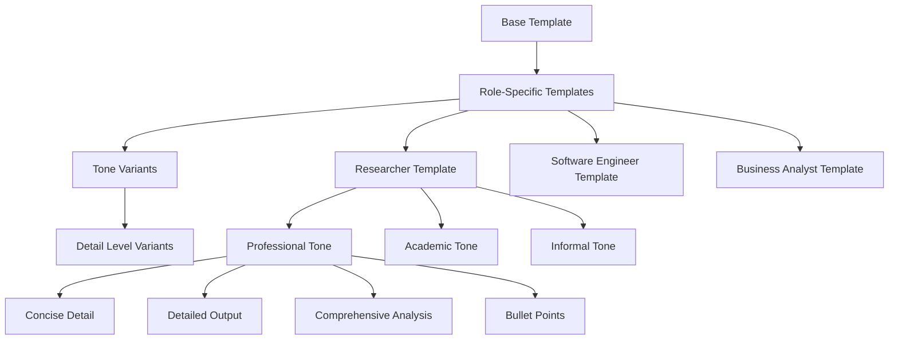

# ADR-020: Dynamic Prompt Template & Response Configuration

## Title

Dynamic Prompt Template System with Multi-Dimensional Customization

## Version/Date

2.0 / 2025-08-19

## Status

Accepted

## Description

Implements a prompt template system optimized for Qwen3-4B-Instruct-2507's 262K context capability, enabling dynamic customization across four dimensions: prompt types, tones, roles, and detail levels. This system leverages large context windows to include examples, instructions, and context within prompt templates. The system uses LlamaIndex RichPromptTemplate with Jinja2 templating and DSPy signatures to provide 1,600+ possible combinations utilizing the 262K context for prompt flexibility.

## Context

The application requires sophisticated prompt customization to serve diverse user needs and use cases. Users need the ability to:

1. **Select Analysis Types**: Different approaches to document analysis (detailed, insights, summary, custom)
2. **Choose Communication Tones**: Adapt responses to context and audience preferences
3. **Specify Roles**: Leverage domain expertise for specialized analysis
4. **Control Detail Levels**: Match output verbosity to specific requirements

Manual prompt engineering for all combinations would be unmaintainable. A systematic template system with inheritance and optimization provides the solution.

## Related Requirements

### Functional Requirements

- **FR-1:** Support 4 prompt types for different analysis approaches
- **FR-2:** Provide 10 tone variations for communication style adaptation
- **FR-3:** Enable 10 role-based specializations for domain expertise
- **FR-4:** Offer 4 detail levels for output control
- **FR-5:** Allow custom prompt overrides for advanced users
- **FR-6:** Maintain template versioning and rollback capabilities

### Non-Functional Requirements

- **NFR-1:** **(Performance)** Template compilation and rendering <50ms
- **NFR-2:** **(Scalability)** Support 1,600+ template combinations efficiently
- **NFR-3:** **(Maintainability)** Template inheritance reduces duplication
- **NFR-4:** **(Quality)** DSPy optimization improves prompt effectiveness

## Alternatives

### 1. Static Prompt Library

- **Description**: Pre-written prompts for each combination
- **Issues**: 1,600+ static prompts unmaintainable, no optimization, poor consistency
- **Score**: 3/10 (maintenance: 1, consistency: 2, optimization: 0)

### 2. Simple String Templates

- **Description**: Basic string formatting with variables
- **Issues**: No inheritance, limited customization, no optimization
- **Score**: 5/10 (simplicity: 8, capability: 3, optimization: 0)

### 3. Dynamic Template System with DSPy (Selected)

- **Description**: Jinja2 templates with inheritance, DSPy optimization, and caching
- **Benefits**: Maintainable, optimizable, 1,600+ combinations, consistent
- **Score**: 9/10 (maintainability: 9, capability: 10, performance: 8)

### 4. LangChain PromptTemplate

- **Description**: LangChain's prompt template system
- **Issues**: Less flexible inheritance, no DSPy integration, framework lock-in
- **Score**: 6/10 (capability: 7, integration: 5, optimization: 4)

## Decision

We will implement a **Dynamic Prompt Template System** with:

1. **Template Hierarchy**: Base → Role → Tone → Detail level inheritance
2. **Jinja2 Rendering**: Dynamic template compilation with variables
3. **DSPy Integration**: Automatic prompt optimization for each role
4. **Intelligent Caching**: Compiled template caching for performance
5. **Template Registry**: Centralized template management and versioning

## Related Decisions

- **ADR-018** (DSPy Prompt Optimization): Provides automatic optimization for role-specific templates
- **ADR-016** (UI State Management): Manages user selections for template dimensions
- **ADR-024** (Configuration Management): Centralizes template configuration and feature flags
- **ADR-001** (Modern Agentic RAG): Uses optimized templates for agent prompts
- **ADR-011** (Agent Orchestration): Coordinates template usage across multiple agents

## Design

### Template Hierarchy Structure



### Core Template System Implementation

```python
from typing import Dict, Any, List, Optional
from enum import Enum
import jinja2
from pathlib import Path
from llama_index.core.prompts import PromptTemplate
from llama_index.core.prompts.base import BasePromptTemplate
import dspy
from pydantic import BaseModel, Field
import hashlib
import os

class PromptType(str, Enum):
    """Available prompt types for document analysis."""
    COMPREHENSIVE = "comprehensive_analysis"
    INSIGHTS = "extract_insights"
    SUMMARIZE = "summarize_questions"
    CUSTOM = "custom"

class ToneType(str, Enum):
    """Available communication tones."""
    PROFESSIONAL = "professional"
    ACADEMIC = "academic"
    INFORMAL = "informal"
    CREATIVE = "creative"
    NEUTRAL = "neutral"
    DIRECT = "direct"
    EMPATHETIC = "empathetic"
    HUMOROUS = "humorous"
    AUTHORITATIVE = "authoritative"
    INQUISITIVE = "inquisitive"

class RoleType(str, Enum):
    """Available role specializations."""
    GENERAL = "general_assistant"
    RESEARCHER = "researcher"
    SOFTWARE_ENGINEER = "software_engineer"
    PRODUCT_MANAGER = "product_manager"
    DATA_SCIENTIST = "data_scientist"
    BUSINESS_ANALYST = "business_analyst"
    TECHNICAL_WRITER = "technical_writer"
    MARKETING_SPECIALIST = "marketing_specialist"
    HR_MANAGER = "hr_manager"
    LEGAL_ADVISOR = "legal_advisor"

class DetailLevel(str, Enum):
    """Available detail levels for output."""
    CONCISE = "concise"
    DETAILED = "detailed"
    COMPREHENSIVE = "comprehensive"
    BULLET_POINTS = "bullet_points"

class PromptConfiguration(BaseModel):
    """Configuration for prompt template selection."""
    prompt_type: PromptType = PromptType.COMPREHENSIVE
    tone: ToneType = ToneType.PROFESSIONAL
    role: RoleType = RoleType.GENERAL
    detail_level: DetailLevel = DetailLevel.DETAILED
    custom_prompt: Optional[str] = None
    custom_instructions: Optional[str] = None

class TemplateRegistry:
    """Central registry for prompt templates with inheritance and caching."""
    
    def __init__(self, template_dir: Path = Path("templates")):
        self.template_dir = template_dir
        self.jinja_env = jinja2.Environment(
            loader=jinja2.FileSystemLoader(template_dir),
            trim_blocks=True,
            lstrip_blocks=True
        )
        self.template_cache: Dict[str, str] = {}
        self.dspy_cache: Dict[str, dspy.Module] = {}
        self._load_base_templates()
    
    def _load_base_templates(self):
        """Load base templates from filesystem."""
        self.base_templates = {
            PromptType.COMPREHENSIVE: self._load_template("base/comprehensive.j2"),
            PromptType.INSIGHTS: self._load_template("base/insights.j2"),
            PromptType.SUMMARIZE: self._load_template("base/summarize.j2"),
            PromptType.CUSTOM: "{{ custom_prompt }}"
        }
    
    def _load_template(self, template_path: str) -> str:
        """Load template from file with error handling."""
        try:
            return self.jinja_env.get_template(template_path).source
        except jinja2.TemplateNotFound:
            # Fallback to embedded template
            return self._get_embedded_template(template_path)
    
    def _get_embedded_template(self, template_path: str) -> str:
        """Embedded templates as fallback."""
        embedded_templates = {
            "base/comprehensive.j2": """
You are a {{ role_description }} with a {{ tone_description }} communication style.

Your task is to analyze the provided documents and deliver a comprehensive analysis that includes:

1. **Executive Summary**: Key findings and main themes
2. **Detailed Analysis**: In-depth examination of content
3. **Key Insights**: Important discoveries and patterns
4. **Action Items**: Specific, actionable recommendations
5. **Open Questions**: Areas requiring further investigation


**Additional Instructions**: {{ custom_instructions }}


**Output Format**: {{ detail_instructions }}

**Context Documents**: {{ documents }}

**User Query**: {{ query }}

Please provide your analysis following the structure above.
""",
            "base/insights.j2": """
You are a {{ role_description }} with a {{ tone_description }} communication style.

Focus on extracting the most important insights and actionable items from the documents.

Your analysis should include:
1. **Key Insights**: The most important discoveries and patterns
2. **Action Items**: Specific, prioritized recommendations
3. **Impact Assessment**: Potential consequences and opportunities


**Additional Instructions**: {{ custom_instructions }}


**Output Format**: {{ detail_instructions }}

**Context Documents**: {{ documents }}

**User Query**: {{ query }}

Provide focused insights and clear action items.
""",
            "base/summarize.j2": """
You are a {{ role_description }} with a {{ tone_description }} communication style.

Summarize the documents and identify important questions that arise from the content.

Your response should include:
1. **Summary**: Concise overview of main points
2. **Open Questions**: Important questions raised by the content
3. **Areas for Investigation**: Topics requiring deeper exploration


**Additional Instructions**: {{ custom_instructions }}


**Output Format**: {{ detail_instructions }}

**Context Documents**: {{ documents }}

**User Query**: {{ query }}

Focus on clear summarization and thought-provoking questions.
"""
        }
        return embedded_templates.get(template_path, "{{ query }}")
    
    def get_template(self, config: PromptConfiguration) -> str:
        """Get compiled template for given configuration."""
        # Generate cache key
        cache_key = self._generate_cache_key(config)
        
        if cache_key in self.template_cache:
            return self.template_cache[cache_key]
        
        # Build template with inheritance
        template = self._build_template(config)
        
        # Cache compiled template
        self.template_cache[cache_key] = template
        
        return template
    
    def _build_template(self, config: PromptConfiguration) -> str:
        """Build template with role/tone/detail customization."""
        # Start with base template
        base_template = self.base_templates[config.prompt_type]
        
        if config.prompt_type == PromptType.CUSTOM and config.custom_prompt:
            base_template = config.custom_prompt
        
        # Create Jinja2 template
        template = self.jinja_env.from_string(base_template)
        
        # Render with role/tone/detail variables
        rendered = template.render(
            role_description=self._get_role_description(config.role),
            tone_description=self._get_tone_description(config.tone),
            detail_instructions=self._get_detail_instructions(config.detail_level),
            custom_instructions=config.custom_instructions
        )
        
        return rendered
    
    def _get_role_description(self, role: RoleType) -> str:
        """Get description for role specialization."""
        descriptions = {
            RoleType.GENERAL: "helpful and versatile assistant",
            RoleType.RESEARCHER: "experienced researcher focused on deep, analytical insights",
            RoleType.SOFTWARE_ENGINEER: "technical expert specializing in code and system analysis",
            RoleType.PRODUCT_MANAGER: "strategic product manager with user-centric perspective",
            RoleType.DATA_SCIENTIST: "data scientist with expertise in analytical reasoning",
            RoleType.BUSINESS_ANALYST: "business analyst focused on strategic insights",
            RoleType.TECHNICAL_WRITER: "technical writer emphasizing clear documentation",
            RoleType.MARKETING_SPECIALIST: "marketing expert focused on engagement and branding",
            RoleType.HR_MANAGER: "human resources professional with organizational perspective",
            RoleType.LEGAL_ADVISOR: "legal expert focused on compliance and risk assessment"
        }
        return descriptions.get(role, descriptions[RoleType.GENERAL])
    
    def _get_tone_description(self, tone: ToneType) -> str:
        """Get description for communication tone."""
        descriptions = {
            ToneType.PROFESSIONAL: "formal and objective",
            ToneType.ACADEMIC: "scholarly and research-focused",
            ToneType.INFORMAL: "casual and conversational",
            ToneType.CREATIVE: "imaginative and expressive",
            ToneType.NEUTRAL: "balanced and unbiased",
            ToneType.DIRECT: "concise and straightforward",
            ToneType.EMPATHETIC: "compassionate and understanding",
            ToneType.HUMOROUS: "lighthearted with appropriate wit",
            ToneType.AUTHORITATIVE: "confident and expert-like",
            ToneType.INQUISITIVE: "curious and exploratory"
        }
        return descriptions.get(tone, descriptions[ToneType.PROFESSIONAL])
    
    def _get_detail_instructions(self, detail_level: DetailLevel) -> str:
        """Get formatting instructions for detail level."""
        instructions = {
            DetailLevel.CONCISE: "Provide brief, to-the-point responses. Aim for clarity and brevity.",
            DetailLevel.DETAILED: "Provide thorough analysis with supporting details and examples.",
            DetailLevel.COMPREHENSIVE: "Provide extensive, exhaustive analysis covering all relevant aspects.",
            DetailLevel.BULLET_POINTS: "Format response as structured bullet points and numbered lists."
        }
        return instructions.get(detail_level, instructions[DetailLevel.DETAILED])
    
    def _generate_cache_key(self, config: PromptConfiguration) -> str:
        """Generate cache key for template configuration."""
        config_str = f"{config.prompt_type}_{config.tone}_{config.role}_{config.detail_level}"
        if config.custom_prompt:
            config_str += f"_custom_{hashlib.md5(config.custom_prompt.encode()).hexdigest()[:8]}"
        return config_str

class DSPyOptimizedTemplate(dspy.Module):
    """DSPy module for optimized prompt templates."""
    
    def __init__(self, base_template: str, role: RoleType):
        super().__init__()
        self.base_template = base_template
        self.role = role
        self.predictor = dspy.ChainOfThought("context, query -> response")
    
    def forward(self, context: str, query: str) -> dspy.Prediction:
        """Execute optimized prediction."""
        return self.predictor(
            context=context,
            query=f"{self.base_template}\n\nContext: {context}\nQuery: {query}"
        )

class PromptTemplateManager:
    """High-level manager for prompt template operations."""
    
    def __init__(self, enable_dspy: bool = True):
        self.registry = TemplateRegistry()
        self.enable_dspy = enable_dspy
        self.dspy_optimizer = None
        
        if enable_dspy:
            self._initialize_dspy()
    
    def _initialize_dspy(self):
        """Initialize DSPy optimization components."""
        try:
            from src.models import AppSettings
            settings = AppSettings()
            
            # Configure DSPy with local model
            dspy.settings.configure(
                lm=dspy.LM(f"ollama/{settings.default_model}")
            )
        except Exception as e:
            print(f"DSPy initialization failed: {e}")
            self.enable_dspy = False
    
    def get_optimized_template(
        self, 
        config: PromptConfiguration,
        context: str = "",
        query: str = ""
    ) -> str:
        """Get template optimized for specific configuration."""
        base_template = self.registry.get_template(config)
        
        if not self.enable_dspy or not context:
            return base_template
        
        # Use DSPy optimization for role-specific templates
        cache_key = f"dspy_{config.role}_{config.tone}"
        
        if cache_key not in self.registry.dspy_cache:
            optimized_module = DSPyOptimizedTemplate(base_template, config.role)
            self.registry.dspy_cache[cache_key] = optimized_module
        
        try:
            result = self.registry.dspy_cache[cache_key](context, query)
            return result.response
        except Exception as e:
            print(f"DSPy optimization failed: {e}")
            return base_template
    
    def create_llamaindex_template(
        self, 
        config: PromptConfiguration
    ) -> PromptTemplate:
        """Create LlamaIndex PromptTemplate from configuration."""
        template_str = self.registry.get_template(config)
        
        return PromptTemplate(
            template=template_str,
            template_var_mappings={
                "documents": "context_str",
                "query": "query_str"
            }
        )
    
    def get_all_combinations(self) -> List[PromptConfiguration]:
        """Get all possible template combinations."""
        combinations = []
        
        for prompt_type in PromptType:
            for tone in ToneType:
                for role in RoleType:
                    for detail_level in DetailLevel:
                        combinations.append(PromptConfiguration(
                            prompt_type=prompt_type,
                            tone=tone,
                            role=role,
                            detail_level=detail_level
                        ))
        
        return combinations
    
    def precompile_templates(self, common_configs: List[PromptConfiguration] = None):
        """Precompile common template combinations for performance."""
        configs = common_configs or self._get_common_configurations()
        
        for config in configs:
            self.registry.get_template(config)
    
    def _get_common_configurations(self) -> List[PromptConfiguration]:
        """Get most commonly used template configurations."""
        return [
            PromptConfiguration(),  # Default
            PromptConfiguration(role=RoleType.RESEARCHER, tone=ToneType.ACADEMIC),
            PromptConfiguration(role=RoleType.SOFTWARE_ENGINEER, tone=ToneType.TECHNICAL),
            PromptConfiguration(prompt_type=PromptType.INSIGHTS, detail_level=DetailLevel.CONCISE),
            PromptConfiguration(prompt_type=PromptType.SUMMARIZE, detail_level=DetailLevel.BULLET_POINTS)
        ]
```

### Integration with Streamlit UI

```python
import streamlit as st
from typing import Dict, Any

def render_prompt_configuration() -> PromptConfiguration:
    """Render prompt configuration UI in Streamlit sidebar."""
    
    st.sidebar.subheader("🎯 Prompt Configuration")
    
    # Prompt Type Selection
    prompt_type = st.sidebar.selectbox(
        "Analysis Type",
        options=[
            ("Comprehensive Document Analysis", PromptType.COMPREHENSIVE),
            ("Extract Key Insights and Action Items", PromptType.INSIGHTS),
            ("Summarize and Identify Open Questions", PromptType.SUMMARIZE),
            ("Custom Prompt", PromptType.CUSTOM)
        ],
        format_func=lambda x: x[0],
        help="Choose the type of analysis to perform"
    )[1]
    
    # Tone Selection
    tone = st.sidebar.selectbox(
        "Communication Tone",
        options=[
            ("Professional", ToneType.PROFESSIONAL),
            ("Academic", ToneType.ACADEMIC),
            ("Informal", ToneType.INFORMAL),
            ("Creative", ToneType.CREATIVE),
            ("Neutral", ToneType.NEUTRAL),
            ("Direct", ToneType.DIRECT),
            ("Empathetic", ToneType.EMPATHETIC),
            ("Humorous", ToneType.HUMOROUS),
            ("Authoritative", ToneType.AUTHORITATIVE),
            ("Inquisitive", ToneType.INQUISITIVE)
        ],
        format_func=lambda x: x[0],
        help="Select the desired communication style"
    )[1]
    
    # Role Selection
    role = st.sidebar.selectbox(
        "Role Specialization",
        options=[
            ("General Assistant", RoleType.GENERAL),
            ("Researcher", RoleType.RESEARCHER),
            ("Software Engineer", RoleType.SOFTWARE_ENGINEER),
            ("Product Manager", RoleType.PRODUCT_MANAGER),
            ("Data Scientist", RoleType.DATA_SCIENTIST),
            ("Business Analyst", RoleType.BUSINESS_ANALYST),
            ("Technical Writer", RoleType.TECHNICAL_WRITER),
            ("Marketing Specialist", RoleType.MARKETING_SPECIALIST),
            ("HR Manager", RoleType.HR_MANAGER),
            ("Legal Advisor", RoleType.LEGAL_ADVISOR)
        ],
        format_func=lambda x: x[0],
        help="Choose the role perspective for analysis"
    )[1]
    
    # Detail Level Selection
    detail_level = st.sidebar.selectbox(
        "Output Detail Level",
        options=[
            ("Concise", DetailLevel.CONCISE),
            ("Detailed", DetailLevel.DETAILED),
            ("Comprehensive", DetailLevel.COMPREHENSIVE),
            ("Bullet Points", DetailLevel.BULLET_POINTS)
        ],
        format_func=lambda x: x[0],
        help="Control the length and detail of responses"
    )[1]
    
    # Custom Prompt for Custom Type
    custom_prompt = None
    custom_instructions = None
    
    if prompt_type == PromptType.CUSTOM:
        custom_prompt = st.sidebar.text_area(
            "Custom Prompt",
            placeholder="Enter your custom analysis prompt...",
            help="Define your own analysis approach"
        )
    
    # Optional Custom Instructions
    custom_instructions = st.sidebar.text_area(
        "Additional Instructions",
        placeholder="Any specific requirements or focus areas...",
        help="Optional additional guidance for the analysis"
    )
    
    return PromptConfiguration(
        prompt_type=prompt_type,
        tone=tone,
        role=role,
        detail_level=detail_level,
        custom_prompt=custom_prompt if custom_prompt else None,
        custom_instructions=custom_instructions if custom_instructions else None
    )

# Usage in main application
def analyze_documents_with_template(documents, query, prompt_config: PromptConfiguration):
    """Analyze documents using configured prompt template."""
    
    # Initialize template manager
    template_manager = PromptTemplateManager(enable_dspy=True)
    
    # Get optimized template
    optimized_template = template_manager.get_optimized_template(
        config=prompt_config,
        context=documents,
        query=query
    )
    
    # Create LlamaIndex template
    llamaindex_template = template_manager.create_llamaindex_template(prompt_config)
    
    # Use in query engine
    query_engine = index.as_query_engine(
        text_qa_template=llamaindex_template,
        similarity_top_k=10
    )
    
    return query_engine.query(query)
```

### Performance Optimization

```python
class TemplateCache:
    """High-performance template caching system."""
    
    def __init__(self, max_size: int = 1000):
        self.max_size = max_size
        self.cache: Dict[str, str] = {}
        self.access_count: Dict[str, int] = {}
    
    def get(self, key: str) -> Optional[str]:
        """Get template from cache."""
        if key in self.cache:
            self.access_count[key] += 1
            return self.cache[key]
        return None
    
    def put(self, key: str, template: str):
        """Store template in cache with LRU eviction."""
        if len(self.cache) >= self.max_size:
            # Evict least recently used
            lru_key = min(self.access_count.keys(), key=self.access_count.get)
            del self.cache[lru_key]
            del self.access_count[lru_key]
        
        self.cache[key] = template
        self.access_count[key] = 1

# Configuration for template precompilation
TEMPLATE_CONFIG = {
    "precompile_on_startup": True,
    "cache_size": 1000,
    "enable_dspy_optimization": True,
    "template_directory": "templates",
    "fallback_to_embedded": True
}
```

## Consequences

### Positive Outcomes

- **Flexible Customization**: 1,600+ prompt combinations without code duplication
- **Maintainable Architecture**: Template inheritance eliminates redundancy
- **Performance Optimization**: DSPy automatic improvement and intelligent caching
- **User Experience**: Rich customization options with simple interface
- **Type Safety**: Pydantic models prevent configuration errors
- **Extensibility**: Easy to add new roles, tones, or detail levels

### Negative Consequences / Trade-offs

- **Initial Complexity**: Template hierarchy requires careful design
- **DSPy Dependency**: Optional but provides significant quality benefits
- **Memory Usage**: Template caching uses additional memory
- **Template Maintenance**: Updates require testing across multiple combinations

### Migration Strategy

1. **Gradual Rollout**: Start with basic templates, add complexity incrementally
2. **Fallback System**: Embedded templates ensure system works without external files
3. **Performance Monitoring**: Track template compilation and rendering times
4. **User Testing**: Validate template quality across different role/tone combinations
5. **Documentation**: Complete template guide for advanced users

## Performance Targets

- **Template Compilation**: <50ms for any combination
- **Cache Hit Rate**: >80% for common template combinations
- **Memory Usage**: <100MB for full template cache
- **DSPy Optimization**: 15-25% improvement in response quality

## Dependencies

- **Python**: `jinja2>=3.1.0`, `dspy-ai>=2.4.0`
- **LlamaIndex**: Native prompt template integration
- **Storage**: Local template files with embedded fallbacks
- **Configuration**: Pydantic settings management

## Monitoring Metrics

- Template compilation latency
- Cache hit/miss rates
- DSPy optimization success rates
- User template combination preferences
- Response quality metrics by template type

## Future Enhancements

- Template A/B testing framework
- User-contributed template marketplace
- Multi-language template support
- Advanced template inheritance patterns
- Real-time template performance analytics

## Changelog

- **1.0 (2025-08-18)**: Initial dynamic prompt template system with 1,600+ combinations, DSPy optimization, and intelligent caching
