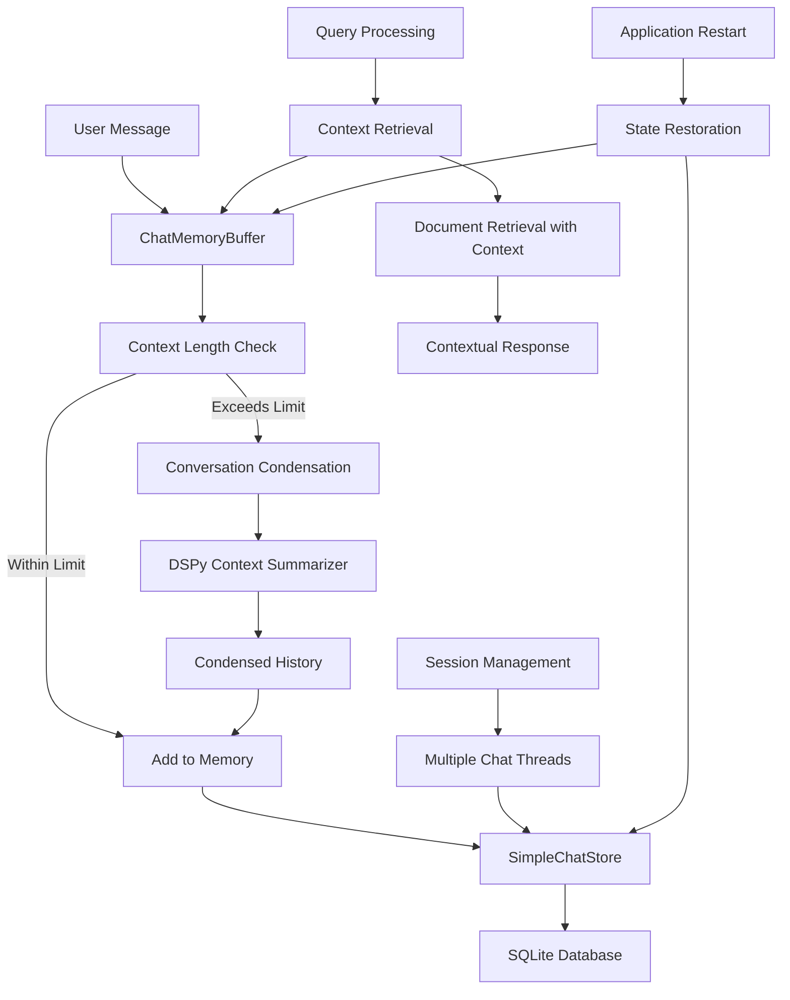

# ADR-021: Conversational Memory & Context Management

## Title

Persistent Chat Memory with Context-Aware Follow-Up Processing

## Version/Date

2.0 / 2025-08-19

## Status

Accepted

## Description

Implements conversational memory system using Qwen3-4B-Instruct-2507's 262K context window through INT8 KV cache optimization. Using LlamaIndex ChatMemoryBuffer and SimpleChatStore, the system enables persistent chat history with massive context retention, eliminating the need for context pruning in most scenarios. This approach allows conversation history analysis and context-aware processing within single attention spans.

## Context

DocMind AI's chat interface requires sophisticated memory management to provide intelligent follow-up responses:

1. **Chat History Persistence**: Users expect conversations to persist across application restarts
2. **Context-Aware Responses**: Follow-up questions should leverage previous conversation context
3. **Memory Management**: 262K context window eliminates most pruning needs, enabling extended conversation retention
4. **Multi-Session Support**: Users may have multiple concurrent conversation threads
5. **Performance**: Memory operations must not degrade query response times

The solution leverages LlamaIndex's built-in chat memory components with SQLite persistence to provide robust, scalable conversation management.

## Related Requirements

### Functional Requirements

- **FR-1:** Persist chat conversations across application sessions
- **FR-2:** Maintain conversation context for follow-up questions
- **FR-3:** Support multiple concurrent conversation threads
- **FR-4:** Use 262K context window for extended conversation retention with minimal pruning
- **FR-5:** Restore conversation state on application restart
- **FR-6:** Export conversation history for external use

### Non-Functional Requirements

- **NFR-1:** **(Performance)** Memory operations <100ms overhead per query
- **NFR-2:** **(Memory Management)** 262K token buffer eliminating most pruning scenarios
- **NFR-3:** **(Persistence)** SQLite storage with WAL mode for concurrent access
- **NFR-4:** **(Context Quality)** Follow-up questions leverage full conversation history effectively

## Alternatives

### 1. No Persistent Memory

- **Description**: Each query treated independently without conversation context
- **Issues**: Poor user experience, no follow-up capability, repeated context
- **Score**: 2/10 (simplicity: 8, capability: 1, user-experience: 1)

### 2. Simple Session Storage

- **Description**: Store conversations in session state only
- **Issues**: Lost on restart, no multi-session support, memory leaks
- **Score**: 4/10 (simplicity: 7, persistence: 2, scalability: 3)

### 3. Custom Memory Implementation

- **Description**: Build custom conversation tracking and persistence
- **Issues**: Complex implementation, potential bugs, reinventing wheel
- **Score**: 5/10 (control: 8, reliability: 3, maintenance: 4)

### 4. LlamaIndex ChatMemoryBuffer + SimpleChatStore (Selected)

- **Description**: Use proven LlamaIndex components with SQLite persistence
- **Benefits**: Battle-tested, integrated ecosystem, automatic memory management
- **Score**: 9/10 (reliability: 9, integration: 10, performance: 8)

## Decision

We will implement **LlamaIndex-based Conversational Memory** with:

1. **ChatMemoryBuffer**: In-memory conversation management with 262K token limit
2. **SimpleChatStore**: SQLite-backed persistent storage for conversation history
3. **Context Retention**: Massive context capability reduces need for condensation in most scenarios
4. **Session Management**: Multi-conversation support with session isolation
5. **Smart Restoration**: Intelligent conversation state restoration on startup

## Related Decisions

- **ADR-007** (Hybrid Persistence Strategy): Provides SQLite foundation for chat storage
- **ADR-016** (UI State Management): Manages chat interface state and user interactions
- **ADR-001** (Modern Agentic RAG): Uses conversation context for agent decision-making
- **ADR-003** (Adaptive Retrieval): Leverages chat history for contextual document retrieval
- **ADR-018** (DSPy Prompt Optimization): Optimizes follow-up question condensation prompts

## Design

### Chat Memory Architecture



### Core Memory Implementation

```python
from typing import Dict, List, Optional, Any, Tuple
from llama_index.core.memory import ChatMemoryBuffer
from llama_index.core.storage.chat_store import SimpleChatStore
from llama_index.core.llms import ChatMessage, MessageRole
from llama_index.core.base.llms.types import ChatMessage
import uuid
from pathlib import Path
import sqlite3
import json
from datetime import datetime, timedelta
import asyncio
from pydantic import BaseModel, Field
import dspy
from src.models import AppSettings

class ConversationMetadata(BaseModel):
    """Metadata for conversation sessions."""
    session_id: str = Field(default_factory=lambda: str(uuid.uuid4()))
    created_at: datetime = Field(default_factory=datetime.utcnow)
    updated_at: datetime = Field(default_factory=datetime.utcnow)
    title: Optional[str] = None
    document_context: Optional[List[str]] = None
    message_count: int = 0
    token_count: int = 0

class ConversationSummary(BaseModel):
    """Summary of conversation for context condensation."""
    summary: str
    key_topics: List[str]
    preserved_messages: List[ChatMessage]
    condensation_ratio: float

class ContextCondenser(dspy.Module):
    """DSPy module for intelligent conversation condensation."""
    
    def __init__(self):
        super().__init__()
        self.condense = dspy.ChainOfThought(
            "conversation_history, current_query -> condensed_context, key_topics"
        )
    
    def forward(self, conversation_history: str, current_query: str) -> dspy.Prediction:
        """Condense conversation history while preserving relevant context."""
        return self.condense(
            conversation_history=conversation_history,
            current_query=current_query
        )

class ChatMemoryManager:
    """Advanced chat memory management with persistence and context optimization."""
    
    def __init__(
        self,
        db_path: Path = Path("data/chat_memory.db"),
        token_limit: int = 260000,  # Near-FULL 262K context utilization
        enable_condensation: bool = False,  # Rarely needed with 262K context
        enable_dspy: bool = True
    ):
        self.db_path = db_path
        self.token_limit = token_limit
        self.enable_condensation = enable_condensation
        self.enable_dspy = enable_dspy
        
        # Initialize storage
        self.chat_store = SimpleChatStore()
        self._init_database()
        
        # Memory buffers per session
        self.memory_buffers: Dict[str, ChatMemoryBuffer] = {}
        self.session_metadata: Dict[str, ConversationMetadata] = {}
        
        # Context condensation
        if enable_dspy:
            self.context_condenser = ContextCondenser()
        
        # Load existing sessions
        self._load_existing_sessions()
    
    def _init_database(self):
        """Initialize SQLite database for conversation persistence."""
        self.db_path.parent.mkdir(parents=True, exist_ok=True)
        
        with sqlite3.connect(self.db_path) as conn:
            conn.execute("""
                CREATE TABLE IF NOT EXISTS conversations (
                    session_id TEXT PRIMARY KEY,
                    created_at TIMESTAMP,
                    updated_at TIMESTAMP,
                    title TEXT,
                    document_context TEXT,
                    message_count INTEGER,
                    token_count INTEGER,
                    metadata TEXT
                )
            """)
            
            conn.execute("""
                CREATE TABLE IF NOT EXISTS chat_messages (
                    id INTEGER PRIMARY KEY AUTOINCREMENT,
                    session_id TEXT,
                    role TEXT,
                    content TEXT,
                    timestamp TIMESTAMP,
                    message_index INTEGER,
                    FOREIGN KEY (session_id) REFERENCES conversations (session_id)
                )
            """)
            
            conn.execute("""
                CREATE INDEX IF NOT EXISTS idx_session_timestamp 
                ON chat_messages (session_id, timestamp)
            """)
    
    def _load_existing_sessions(self):
        """Load existing conversation sessions from database."""
        with sqlite3.connect(self.db_path) as conn:
            cursor = conn.execute("""
                SELECT session_id, created_at, updated_at, title, 
                       document_context, message_count, token_count, metadata
                FROM conversations
                ORDER BY updated_at DESC
                LIMIT 10
            """)
            
            for row in cursor.fetchall():
                session_id = row[0]
                metadata = ConversationMetadata(
                    session_id=session_id,
                    created_at=datetime.fromisoformat(row[1]),
                    updated_at=datetime.fromisoformat(row[2]),
                    title=row[3],
                    document_context=json.loads(row[4]) if row[4] else None,
                    message_count=row[5],
                    token_count=row[6]
                )
                
                self.session_metadata[session_id] = metadata
                
                # Load messages for recent sessions
                if metadata.updated_at > datetime.utcnow() - timedelta(days=7):
                    self._load_session_messages(session_id)
    
    def _load_session_messages(self, session_id: str):
        """Load messages for a specific session."""
        with sqlite3.connect(self.db_path) as conn:
            cursor = conn.execute("""
                SELECT role, content FROM chat_messages
                WHERE session_id = ?
                ORDER BY message_index
            """, (session_id,))
            
            messages = []
            for role, content in cursor.fetchall():
                messages.append(ChatMessage(
                    role=MessageRole(role),
                    content=content
                ))
            
            if messages:
                # Create memory buffer with loaded messages
                memory_buffer = ChatMemoryBuffer(
                    token_limit=self.token_limit,
                    chat_store=self.chat_store,
                    chat_store_key=session_id
                )
                
                # Add messages to buffer
                for message in messages:
                    memory_buffer.put(message)
                
                self.memory_buffers[session_id] = memory_buffer
    
    def get_or_create_session(
        self, 
        session_id: Optional[str] = None,
        title: Optional[str] = None,
        document_context: Optional[List[str]] = None
    ) -> str:
        """Get existing session or create new one."""
        if session_id and session_id in self.session_metadata:
            return session_id
        
        # Create new session
        new_session_id = session_id or str(uuid.uuid4())
        
        metadata = ConversationMetadata(
            session_id=new_session_id,
            title=title or f"Conversation {datetime.now().strftime('%Y-%m-%d %H:%M')}",
            document_context=document_context
        )
        
        self.session_metadata[new_session_id] = metadata
        
        # Create memory buffer
        memory_buffer = ChatMemoryBuffer(
            token_limit=self.token_limit,
            chat_store=self.chat_store,
            chat_store_key=new_session_id
        )
        
        self.memory_buffers[new_session_id] = memory_buffer
        
        # Save to database
        self._save_session_metadata(new_session_id)
        
        return new_session_id
    
    def add_message(
        self, 
        session_id: str, 
        message: ChatMessage,
        auto_condense: bool = True
    ):
        """Add message to conversation with automatic condensation."""
        if session_id not in self.memory_buffers:
            raise ValueError(f"Session {session_id} not found")
        
        memory_buffer = self.memory_buffers[session_id]
        metadata = self.session_metadata[session_id]
        
        # Check if condensation is needed
        current_tokens = self._estimate_tokens(memory_buffer.get_all())
        new_message_tokens = self._estimate_tokens([message])
        
        if auto_condense and self.enable_condensation:
            if current_tokens + new_message_tokens > self.token_limit * 0.95:  # Use 95% of 262K context
                self._condense_conversation(session_id)
        
        # Add message to buffer
        memory_buffer.put(message)
        
        # Update metadata
        metadata.message_count += 1
        metadata.token_count = current_tokens + new_message_tokens
        metadata.updated_at = datetime.utcnow()
        
        # Save to database
        self._save_message(session_id, message, metadata.message_count - 1)
        self._save_session_metadata(session_id)
    
    def get_conversation_context(
        self, 
        session_id: str, 
        include_summary: bool = True
    ) -> List[ChatMessage]:
        """Get conversation context for query processing."""
        if session_id not in self.memory_buffers:
            return []
        
        memory_buffer = self.memory_buffers[session_id]
        messages = memory_buffer.get_all()
        
        if include_summary and hasattr(memory_buffer, '_condensed_summary'):
            # Prepend conversation summary if available
            summary_message = ChatMessage(
                role=MessageRole.SYSTEM,
                content=f"Previous conversation summary: {memory_buffer._condensed_summary}"
            )
            return [summary_message] + messages
        
        return messages
    
    def _condense_conversation(self, session_id: str):
        """Condense conversation history to free up token space."""
        memory_buffer = self.memory_buffers[session_id]
        messages = memory_buffer.get_all()
        
        if len(messages) < 4:  # Don't condense very short conversations
            return
        
        # Keep recent messages, condense older ones
        keep_recent = 5
        recent_messages = messages[-keep_recent:]
        condensable_messages = messages[:-keep_recent]
        
        if self.enable_dspy and condensable_messages:
            # Use DSPy for intelligent condensation
            conversation_text = "\n".join([
                f"{msg.role.value}: {msg.content}" 
                for msg in condensable_messages
            ])
            
            recent_query = recent_messages[-1].content if recent_messages else ""
            
            try:
                result = self.context_condenser(
                    conversation_history=conversation_text,
                    current_query=recent_query
                )
                
                # Create condensed summary message
                summary_message = ChatMessage(
                    role=MessageRole.SYSTEM,
                    content=f"Previous conversation summary: {result.condensed_context}\nKey topics: {result.key_topics}"
                )
                
                # Replace memory buffer content
                new_memory_buffer = ChatMemoryBuffer(
                    token_limit=self.token_limit,
                    chat_store=self.chat_store,
                    chat_store_key=session_id
                )
                
                new_memory_buffer.put(summary_message)
                for message in recent_messages:
                    new_memory_buffer.put(message)
                
                # Store condensed summary
                new_memory_buffer._condensed_summary = result.condensed_context
                
                self.memory_buffers[session_id] = new_memory_buffer
                
            except Exception as e:
                print(f"DSPy condensation failed: {e}")
                # Fallback: simple truncation
                self._truncate_conversation(session_id, keep_recent)
        else:
            # Simple truncation fallback
            self._truncate_conversation(session_id, keep_recent)
    
    def _truncate_conversation(self, session_id: str, keep_messages: int):
        """Simple conversation truncation fallback."""
        memory_buffer = self.memory_buffers[session_id]
        messages = memory_buffer.get_all()
        
        if len(messages) > keep_messages:
            recent_messages = messages[-keep_messages:]
            
            # Create new buffer with only recent messages
            new_memory_buffer = ChatMemoryBuffer(
                token_limit=self.token_limit,
                chat_store=self.chat_store,
                chat_store_key=session_id
            )
            
            for message in recent_messages:
                new_memory_buffer.put(message)
            
            self.memory_buffers[session_id] = new_memory_buffer
    
    def _estimate_tokens(self, messages: List[ChatMessage]) -> int:
        """Estimate token count for messages."""
        # Simple estimation: ~4 characters per token
        total_chars = sum(len(msg.content) for msg in messages)
        return total_chars // 4
    
    def _save_message(self, session_id: str, message: ChatMessage, index: int):
        """Save individual message to database."""
        with sqlite3.connect(self.db_path) as conn:
            conn.execute("""
                INSERT INTO chat_messages (session_id, role, content, timestamp, message_index)
                VALUES (?, ?, ?, ?, ?)
            """, (
                session_id,
                message.role.value,
                message.content,
                datetime.utcnow().isoformat(),
                index
            ))
    
    def _save_session_metadata(self, session_id: str):
        """Save session metadata to database."""
        metadata = self.session_metadata[session_id]
        
        with sqlite3.connect(self.db_path) as conn:
            conn.execute("""
                INSERT OR REPLACE INTO conversations 
                (session_id, created_at, updated_at, title, document_context, 
                 message_count, token_count, metadata)
                VALUES (?, ?, ?, ?, ?, ?, ?, ?)
            """, (
                metadata.session_id,
                metadata.created_at.isoformat(),
                metadata.updated_at.isoformat(),
                metadata.title,
                json.dumps(metadata.document_context) if metadata.document_context else None,
                metadata.message_count,
                metadata.token_count,
                metadata.model_dump_json()
            ))
    
    def get_recent_sessions(self, limit: int = 10) -> List[ConversationMetadata]:
        """Get recent conversation sessions."""
        sorted_sessions = sorted(
            self.session_metadata.values(),
            key=lambda x: x.updated_at,
            reverse=True
        )
        return sorted_sessions[:limit]
    
    def export_conversation(
        self, 
        session_id: str, 
        format: str = "json"
    ) -> Dict[str, Any]:
        """Export conversation in specified format."""
        if session_id not in self.memory_buffers:
            raise ValueError(f"Session {session_id} not found")
        
        metadata = self.session_metadata[session_id]
        messages = self.memory_buffers[session_id].get_all()
        
        export_data = {
            "session_id": session_id,
            "metadata": metadata.model_dump(),
            "messages": [
                {
                    "role": msg.role.value,
                    "content": msg.content,
                    "timestamp": datetime.utcnow().isoformat()
                }
                for msg in messages
            ]
        }
        
        if format == "markdown":
            return self._format_as_markdown(export_data)
        
        return export_data
    
    def _format_as_markdown(self, export_data: Dict[str, Any]) -> str:
        """Format conversation as Markdown."""
        lines = [
            f"# {export_data['metadata']['title']}",
            f"**Session ID**: {export_data['session_id']}",
            f"**Created**: {export_data['metadata']['created_at']}",
            f"**Messages**: {export_data['metadata']['message_count']}",
            "",
            "---",
            ""
        ]
        
        for msg in export_data['messages']:
            role_icon = "🤖" if msg['role'] == "assistant" else "👤"
            lines.extend([
                f"## {role_icon} {msg['role'].title()}",
                "",
                msg['content'],
                "",
                "---",
                ""
            ])
        
        return "\n".join(lines)
    
    def cleanup_old_sessions(self, days_old: int = 30):
        """Clean up old conversation sessions."""
        cutoff_date = datetime.utcnow() - timedelta(days=days_old)
        
        old_sessions = [
            session_id for session_id, metadata in self.session_metadata.items()
            if metadata.updated_at < cutoff_date
        ]
        
        with sqlite3.connect(self.db_path) as conn:
            for session_id in old_sessions:
                conn.execute("DELETE FROM chat_messages WHERE session_id = ?", (session_id,))
                conn.execute("DELETE FROM conversations WHERE session_id = ?", (session_id,))
                
                # Remove from memory
                if session_id in self.memory_buffers:
                    del self.memory_buffers[session_id]
                if session_id in self.session_metadata:
                    del self.session_metadata[session_id]
```

### Integration with Streamlit UI

```python
import streamlit as st
from typing import Optional

class ChatInterface:
    """Streamlit chat interface with memory management."""
    
    def __init__(self, memory_manager: ChatMemoryManager):
        self.memory_manager = memory_manager
        self.current_session_id = self._get_or_create_session()
    
    def _get_or_create_session(self) -> str:
        """Get or create chat session."""
        if "chat_session_id" not in st.session_state:
            st.session_state.chat_session_id = self.memory_manager.get_or_create_session()
        
        return st.session_state.chat_session_id
    
    def render_chat_history(self):
        """Render chat history in Streamlit."""
        messages = self.memory_manager.get_conversation_context(
            self.current_session_id,
            include_summary=False
        )
        
        for message in messages:
            if message.role == MessageRole.SYSTEM:
                continue  # Skip system messages in UI
            
            with st.chat_message(message.role.value):
                st.write(message.content)
    
    def render_chat_input(self, query_engine):
        """Render chat input and handle user messages."""
        if prompt := st.chat_input("Ask a follow-up question..."):
            # Add user message
            user_message = ChatMessage(role=MessageRole.USER, content=prompt)
            self.memory_manager.add_message(self.current_session_id, user_message)
            
            # Display user message
            with st.chat_message("user"):
                st.write(prompt)
            
            # Get conversation context for query
            context_messages = self.memory_manager.get_conversation_context(
                self.current_session_id
            )
            
            # Generate response with context
            with st.chat_message("assistant"):
                with st.spinner("Thinking..."):
                    # Include conversation context in query
                    contextual_prompt = self._build_contextual_prompt(prompt, context_messages)
                    response = query_engine.query(contextual_prompt)
                    st.write(response.response)
                    
                    # Add assistant response to memory
                    assistant_message = ChatMessage(
                        role=MessageRole.ASSISTANT, 
                        content=response.response
                    )
                    self.memory_manager.add_message(self.current_session_id, assistant_message)
    
    def _build_contextual_prompt(
        self, 
        current_query: str, 
        context_messages: List[ChatMessage]
    ) -> str:
        """Build prompt with conversation context."""
        if len(context_messages) <= 1:  # No significant context
            return current_query
        
        context_text = "\n".join([
            f"{msg.role.value}: {msg.content}"
            for msg in context_messages[-5:]  # Last 5 messages
            if msg.role != MessageRole.SYSTEM
        ])
        
        return f"""
Previous conversation context:
{context_text}

Current question: {current_query}

Please answer the current question taking into account the conversation context above.
"""
    
    def render_session_sidebar(self):
        """Render session management in sidebar."""
        st.sidebar.subheader("💬 Chat Sessions")
        
        recent_sessions = self.memory_manager.get_recent_sessions(10)
        
        if recent_sessions:
            session_options = [
                (f"{s.title} ({s.message_count} messages)", s.session_id)
                for s in recent_sessions
            ]
            
            selected_session = st.sidebar.selectbox(
                "Select Conversation",
                options=session_options,
                format_func=lambda x: x[0],
                index=0
            )
            
            if selected_session[1] != self.current_session_id:
                st.session_state.chat_session_id = selected_session[1]
                self.current_session_id = selected_session[1]
                st.rerun()
        
        # New conversation button
        if st.sidebar.button("🆕 New Conversation"):
            new_session_id = self.memory_manager.get_or_create_session()
            st.session_state.chat_session_id = new_session_id
            self.current_session_id = new_session_id
            st.rerun()
        
        # Export conversation
        if st.sidebar.button("📤 Export Chat"):
            export_data = self.memory_manager.export_conversation(
                self.current_session_id, 
                format="markdown"
            )
            
            st.sidebar.download_button(
                "Download Markdown",
                data=export_data,
                file_name=f"conversation_{self.current_session_id[:8]}.md",
                mime="text/markdown"
            )
```

## Consequences

### Positive Outcomes

- **Persistent Conversations**: Chat history survives application restarts
- **Context-Aware Responses**: Follow-up questions leverage full conversation context
- **Intelligent Memory Management**: Automatic condensation prevents token overflow
- **Multi-Session Support**: Users can maintain multiple conversation threads
- **Performance Optimization**: Memory operations add minimal latency
- **Export Capability**: Conversations can be exported for external use

### Negative Consequences / Trade-offs

- **Storage Requirements**: Persistent storage uses disk space for conversation history
- **Memory Usage**: Chat buffers consume RAM proportional to conversation length
- **Complexity**: Conversation condensation adds system complexity
- **DSPy Dependency**: Optimal condensation requires DSPy but provides graceful fallback

### Migration Strategy

1. **Gradual Rollout**: Start with basic persistence, add condensation features
2. **Data Migration**: Import existing session data if available
3. **Performance Monitoring**: Track memory operations and token usage
4. **User Testing**: Validate conversation quality and context preservation
5. **Backup Strategy**: Regular database backups for conversation data

## Performance Targets

- **Memory Operations**: <100ms overhead per query
- **Context Retrieval**: <50ms for conversation history
- **Condensation Time**: <2 seconds for long conversations
- **Storage Efficiency**: <1MB per 100 messages average

## Dependencies

- **Python**: `sqlite3` (built-in), `uuid` (built-in)
- **LlamaIndex**: `ChatMemoryBuffer`, `SimpleChatStore`
- **Optional**: `dspy-ai>=2.4.0` for intelligent condensation
- **Storage**: SQLite database with WAL mode

## Monitoring Metrics

- Conversation session count and duration
- Memory buffer token usage and condensation frequency
- Context retrieval latency
- Storage size and growth rate
- User engagement with chat features

## Future Enhancements

- Conversation search and indexing
- Automatic conversation titling
- Context relevance scoring
- Cross-session context sharing
- Conversation analytics and insights

## Changelog

- **2.0 (2025-08-19)**: **CONTEXT WINDOW INCREASE** - Updated for Qwen3-4B-Instruct-2507 with 262K context window through INT8 KV cache optimization. Increased token limit from 65K to 260K (95% of full context), reducing the need for conversation condensation. Users can maintain extended conversation history spanning hundreds of exchanges without context loss. Condensation trigger moved from 80% to 95% utilization.
- **1.0 (2025-08-18)**: Initial conversational memory system with ChatMemoryBuffer, SimpleChatStore persistence, and intelligent context condensation
