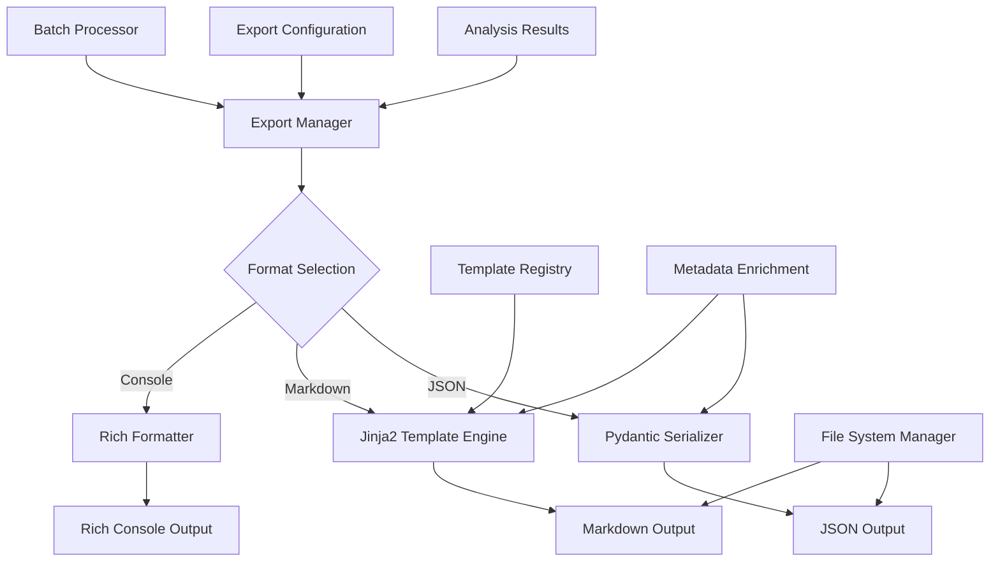

# ADR-022: Export & Structured Output System

## Title

Type-Safe Export System with JSON and Markdown Output Formatting

## Version/Date

1.0 / 2025-08-18

## Status

Accepted

## Description

Implements a comprehensive export and structured output system that enables users to export analysis results in JSON and Markdown formats. The system leverages existing Pydantic models throughout the architecture to provide type-safe data portability, Jinja2 templates for customizable Markdown formatting, and Rich console formatting for enhanced terminal output.

## Context

DocMind AI generates complex analysis results that users need to export for external use:

1. **Data Portability**: Users need to export analysis results for integration with other tools
2. **Format Flexibility**: Different use cases require different output formats (JSON for APIs, Markdown for documentation)
3. **Type Safety**: Export operations must maintain data integrity and structure
4. **Customization**: Users may need customized formatting for specific use cases
5. **Performance**: Export operations should not significantly impact response times

The solution builds on the existing Pydantic model ecosystem to provide seamless, type-safe exports with minimal additional complexity.

## Related Requirements

### Functional Requirements

- **FR-1:** Export analysis results in JSON format with full data fidelity
- **FR-2:** Generate Markdown exports with customizable formatting templates
- **FR-3:** Support batch export of multiple analysis sessions
- **FR-4:** Provide metadata preservation in exported formats
- **FR-5:** Enable custom export templates for specialized use cases
- **FR-6:** Maintain referential integrity for source documents and citations

### Non-Functional Requirements

- **NFR-1:** **(Performance)** Export operations <500ms for typical analysis results
- **NFR-2:** **(Type Safety)** All exports preserve original data types and structure
- **NFR-3:** **(Format Standards)** JSON follows RFC 8259, Markdown follows CommonMark
- **NFR-4:** **(File Size)** Efficient serialization to minimize export file sizes

## Alternatives

### 1. Manual String Formatting

- **Description**: Build export formats using string concatenation and manual formatting
- **Issues**: Error-prone, no type safety, difficult maintenance, inconsistent formats
- **Score**: 3/10 (control: 5, reliability: 2, maintainability: 2)

### 2. Simple JSON Dumps

- **Description**: Use basic json.dumps() without structure or templates
- **Issues**: No Markdown support, limited customization, poor readability
- **Score**: 5/10 (simplicity: 8, capability: 3, usability: 4)

### 3. Third-Party Export Libraries

- **Description**: Libraries like pandas.to_excel(), reportlab for PDFs
- **Issues**: Heavy dependencies, limited integration, format-specific complexity
- **Score**: 6/10 (capability: 8, integration: 4, dependency-weight: 5)

### 4. Pydantic + Jinja2 + Rich (Selected)

- **Description**: Leverage existing Pydantic models with template-based rendering
- **Benefits**: Type-safe, customizable, lightweight, consistent with architecture
- **Score**: 9/10 (type-safety: 10, integration: 10, performance: 8)

## Decision

We will implement a **Type-Safe Export System** with:

1. **Pydantic Model Integration**: Use existing models for type-safe serialization
2. **JSON Export**: Standard JSON with metadata preservation and pretty printing
3. **Markdown Templates**: Jinja2-based customizable Markdown generation
4. **Rich Formatting**: Enhanced console output with syntax highlighting
5. **Batch Operations**: Export multiple analysis results efficiently
6. **Template Registry**: Centralized template management for different output styles

## Related Decisions

- **ADR-016** (UI State Management): Provides export triggers and user interface integration
- **ADR-021** (Chat Memory): Enables conversation export functionality
- **ADR-020** (Prompt Templates): Uses template system patterns for export formatting
- **ADR-001** (Agentic RAG): Exports structured results from multi-agent analysis
- **ADR-024** (Configuration Management): Centralizes export format preferences

## Design

### Export System Architecture



### Core Export Models

````python
from typing import Dict, List, Optional, Any, Union, Literal
from pydantic import BaseModel, Field, ConfigDict
from datetime import datetime
from pathlib import Path
import json
import jinja2
from rich.console import Console
from rich.syntax import Syntax
from rich.table import Table
from rich.panel import Panel
from enum import Enum
import hashlib
import asyncio

class ExportFormat(str, Enum):
    """Available export formats."""
    JSON = "json"
    MARKDOWN = "markdown"
    RICH_CONSOLE = "console"
    PLAIN_TEXT = "text"

class ExportTemplate(str, Enum):
    """Available export templates."""
    STANDARD = "standard"
    ACADEMIC = "academic"
    EXECUTIVE = "executive"
    TECHNICAL = "technical"
    MINIMAL = "minimal"
    CUSTOM = "custom"

class DocumentReference(BaseModel):
    """Reference to source document in export."""
    filename: str
    path: Optional[str] = None
    size_bytes: Optional[int] = None
    format: Optional[str] = None
    checksum: Optional[str] = None
    processed_at: datetime

class AnalysisMetadata(BaseModel):
    """Metadata for analysis export."""
    analysis_id: str = Field(default_factory=lambda: str(uuid.uuid4()))
    created_at: datetime = Field(default_factory=datetime.utcnow)
    model_used: str
    prompt_configuration: Optional[Dict[str, Any]] = None
    processing_time_seconds: Optional[float] = None
    token_usage: Optional[Dict[str, int]] = None
    agent_decisions: Optional[List[Dict[str, Any]]] = None

class ExportableAnalysis(BaseModel):
    """Structured analysis result for export."""
    model_config = ConfigDict(
        json_encoders={datetime: lambda v: v.isoformat()},
        validate_assignment=True
    )
    
    metadata: AnalysisMetadata
    source_documents: List[DocumentReference]
    query: str
    response: str
    key_insights: List[str] = []
    action_items: List[str] = []
    open_questions: List[str] = []
    citations: List[Dict[str, Any]] = []
    confidence_scores: Optional[Dict[str, float]] = None
    related_topics: List[str] = []

class BatchExportResult(BaseModel):
    """Result of batch export operation."""
    export_id: str = Field(default_factory=lambda: str(uuid.uuid4()))
    created_at: datetime = Field(default_factory=datetime.utcnow)
    format: ExportFormat
    template: ExportTemplate
    analysis_count: int
    file_path: Optional[Path] = None
    file_size_bytes: Optional[int] = None
    processing_time_seconds: float

class ExportConfiguration(BaseModel):
    """Configuration for export operations."""
    format: ExportFormat = ExportFormat.JSON
    template: ExportTemplate = ExportTemplate.STANDARD
    include_metadata: bool = True
    include_citations: bool = True
    include_confidence_scores: bool = False
    pretty_print: bool = True
    custom_template_path: Optional[Path] = None
    output_directory: Path = Path("exports")
    filename_pattern: str = "analysis_{timestamp}_{id}"

class ExportManager:
    """Central manager for export operations."""
    
    def __init__(self, config: ExportConfiguration = None):
        self.config = config or ExportConfiguration()
        self.template_env = self._create_template_environment()
        self.console = Console()
        self._ensure_output_directory()
    
    def _create_template_environment(self) -> jinja2.Environment:
        """Create Jinja2 environment with export templates."""
        template_dir = Path(__file__).parent / "templates" / "export"
        
        # Create template loader with fallback
        loaders = []
        if template_dir.exists():
            loaders.append(jinja2.FileSystemLoader(template_dir))
        loaders.append(jinja2.DictLoader(self._get_embedded_templates()))
        
        loader = jinja2.ChoiceLoader(loaders)
        
        return jinja2.Environment(
            loader=loader,
            trim_blocks=True,
            lstrip_blocks=True,
            autoescape=jinja2.select_autoescape(['html', 'xml'])
        )
    
    def _get_embedded_templates(self) -> Dict[str, str]:
        """Embedded templates as fallback."""
        return {
            "standard.md": """# Analysis Report

**Generated**: {{ metadata.created_at.strftime('%Y-%m-%d %H:%M:%S') }}
**Model**: {{ metadata.model_used }}
**Analysis ID**: {{ metadata.analysis_id }}

## Query

{{ query }}

## Response

{{ response }}


## Key Insights


- {{ insight }}




## Action Items


- [ ] {{ item }}




## Open Questions


- {{ question }}




## Source Documents


- **{{ doc.filename }}** ({{ doc.format }})
  - Size: {{ doc.size_bytes | filesizeformat if doc.size_bytes else 'Unknown' }}
  - Processed: {{ doc.processed_at.strftime('%Y-%m-%d %H:%M:%S') }}


## Processing Details

- **Processing Time**: {{ metadata.processing_time_seconds }}s

- **Tokens Used**: {{ metadata.token_usage.total }} (Input: {{ metadata.token_usage.input }}, Output: {{ metadata.token_usage.output }})



---
*Generated by DocMind AI*
""",
            
            "academic.md": """# {{ query }}

## Abstract

{{ response[:300] }}...

## Introduction

{{ response }}

## Methodology


This analysis was conducted using the following configuration:
- **Role**: {{ metadata.prompt_configuration.role }}
- **Tone**: {{ metadata.prompt_configuration.tone }}
- **Detail Level**: {{ metadata.prompt_configuration.detail_level }}


## Findings


### Key Insights


{{ loop.index }}. {{ insight }}



## Conclusions and Recommendations


### Recommendations


{{ loop.index }}. {{ item }}



## Future Research



- {{ question }}



## References


[{{ loop.index }}] {{ doc.filename }}. Processed {{ doc.processed_at.strftime('%Y-%m-%d') }}.


---
**Analysis Metadata**:
- ID: {{ metadata.analysis_id }}
- Generated: {{ metadata.created_at.isoformat() }}
- Model: {{ metadata.model_used }}
""",
            
            "executive.md": """# Executive Summary

## Key Question
{{ query }}

## Executive Response
{{ response }}

## Strategic Insights

• {{ insight }}


## Immediate Actions Required

{{ loop.index }}. **{{ item }}**


## Risk Considerations

⚠️ {{ question }}


---
**Source**: Analysis of {{ source_documents|length }} document(s) | Generated: {{ metadata.created_at.strftime('%Y-%m-%d') }}
""",
            
            "technical.md": """# Technical Analysis Report

```yaml
Analysis ID: {{ metadata.analysis_id }}
Timestamp: {{ metadata.created_at.isoformat() }}
Model: {{ metadata.model_used }}
Processing Time: {{ metadata.processing_time_seconds }}s
```

## Query

```
{{ query }}
```

## Analysis Output

{{ response }}

## Technical Details

### Key Insights

```json
{{ key_insights | tojson(indent=2) }}
```

### Action Items

```json
{{ action_items | tojson(indent=2) }}
```

### Open Questions

```json
{{ open_questions | tojson(indent=2) }}
```

### Source Documents



- `{{ doc.filename }}` ({{ doc.format }}, {{ doc.size_bytes }} bytes)




### Agent Decision Log

```json
{{ metadata.agent_decisions | tojson(indent=2) }}
```



---
*Technical Report Generated by DocMind AI*
"""
        }

    def _ensure_output_directory(self):
        """Ensure output directory exists."""
        self.config.output_directory.mkdir(parents=True, exist_ok=True)
    
    def export_analysis(
        self, 
        analysis: ExportableAnalysis,
        format_override: Optional[ExportFormat] = None,
        template_override: Optional[ExportTemplate] = None
    ) -> Path:
        """Export single analysis result."""
        format_type = format_override or self.config.format
        template_type = template_override or self.config.template
        
        if format_type == ExportFormat.JSON:
            return self._export_json(analysis)
        elif format_type == ExportFormat.MARKDOWN:
            return self._export_markdown(analysis, template_type)
        elif format_type == ExportFormat.RICH_CONSOLE:
            self._export_console(analysis)
            return None
        else:
            raise ValueError(f"Unsupported export format: {format_type}")
    
    def _export_json(self, analysis: ExportableAnalysis) -> Path:
        """Export analysis as JSON."""
        filename = self._generate_filename(analysis.metadata.analysis_id, "json")
        file_path = self.config.output_directory / filename
        
        # Serialize with Pydantic
        json_data = analysis.model_dump(mode="json")
        
        with open(file_path, 'w', encoding='utf-8') as f:
            if self.config.pretty_print:
                json.dump(json_data, f, indent=2, ensure_ascii=False)
            else:
                json.dump(json_data, f, ensure_ascii=False)
        
        return file_path
    
    def _export_markdown(
        self, 
        analysis: ExportableAnalysis, 
        template_type: ExportTemplate
    ) -> Path:
        """Export analysis as Markdown."""
        template_name = f"{template_type.value}.md"
        
        try:
            template = self.template_env.get_template(template_name)
        except jinja2.TemplateNotFound:
            # Fallback to standard template
            template = self.template_env.get_template("standard.md")
        
        # Render template with analysis data
        content = template.render(
            **analysis.model_dump(),
            include_metadata=self.config.include_metadata,
            include_citations=self.config.include_citations
        )
        
        filename = self._generate_filename(analysis.metadata.analysis_id, "md")
        file_path = self.config.output_directory / filename
        
        with open(file_path, 'w', encoding='utf-8') as f:
            f.write(content)
        
        return file_path
    
    def _export_console(self, analysis: ExportableAnalysis):
        """Export analysis to Rich console."""
        # Create analysis panel
        analysis_panel = Panel(
            analysis.response,
            title=f"Analysis: {analysis.metadata.analysis_id[:8]}",
            border_style="green"
        )
        
        self.console.print(analysis_panel)
        
        # Create insights table
        if analysis.key_insights:
            insights_table = Table(title="Key Insights")
            insights_table.add_column("#", style="cyan", width=4)
            insights_table.add_column("Insight", style="white")
            
            for i, insight in enumerate(analysis.key_insights, 1):
                insights_table.add_row(str(i), insight)
            
            self.console.print(insights_table)
        
        # Create action items
        if analysis.action_items:
            self.console.print("\n[bold green]Action Items:[/bold green]")
            for i, item in enumerate(analysis.action_items, 1):
                self.console.print(f"  {i}. {item}")
        
        # Show metadata
        if self.config.include_metadata:
            metadata_json = analysis.metadata.model_dump_json(indent=2)
            syntax = Syntax(metadata_json, "json", theme="monokai", line_numbers=True)
            
            metadata_panel = Panel(
                syntax,
                title="Analysis Metadata",
                border_style="blue"
            )
            
            self.console.print(metadata_panel)
    
    def batch_export(
        self, 
        analyses: List[ExportableAnalysis],
        format_type: ExportFormat = None,
        combine_files: bool = True
    ) -> BatchExportResult:
        """Export multiple analyses in batch."""
        start_time = datetime.utcnow()
        format_type = format_type or self.config.format
        
        if combine_files:
            return self._batch_export_combined(analyses, format_type, start_time)
        else:
            return self._batch_export_separate(analyses, format_type, start_time)
    
    def _batch_export_combined(
        self, 
        analyses: List[ExportableAnalysis], 
        format_type: ExportFormat,
        start_time: datetime
    ) -> BatchExportResult:
        """Export all analyses to single combined file."""
        batch_id = hashlib.md5(f"{start_time}{len(analyses)}".encode()).hexdigest()[:8]
        
        if format_type == ExportFormat.JSON:
            # Combine all analyses into single JSON
            combined_data = {
                "batch_id": batch_id,
                "created_at": start_time.isoformat(),
                "analysis_count": len(analyses),
                "analyses": [analysis.model_dump(mode="json") for analysis in analyses]
            }
            
            filename = f"batch_export_{batch_id}.json"
            file_path = self.config.output_directory / filename
            
            with open(file_path, 'w', encoding='utf-8') as f:
                json.dump(combined_data, f, indent=2, ensure_ascii=False)
        
        elif format_type == ExportFormat.MARKDOWN:
            # Combine all analyses into single Markdown
            content_parts = [
                f"# Batch Analysis Report",
                f"**Batch ID**: {batch_id}",
                f"**Generated**: {start_time.strftime('%Y-%m-%d %H:%M:%S')}",
                f"**Analysis Count**: {len(analyses)}",
                "\n---\n"
            ]
            
            for i, analysis in enumerate(analyses, 1):
                content_parts.append(f"## Analysis {i}: {analysis.metadata.analysis_id[:8]}")
                content_parts.append(f"**Query**: {analysis.query}")
                content_parts.append(f"**Response**: {analysis.response}")
                
                if analysis.key_insights:
                    content_parts.append("**Key Insights**:")
                    for insight in analysis.key_insights:
                        content_parts.append(f"- {insight}")
                
                content_parts.append("\n---\n")
            
            filename = f"batch_export_{batch_id}.md"
            file_path = self.config.output_directory / filename
            
            with open(file_path, 'w', encoding='utf-8') as f:
                f.write("\n\n".join(content_parts))
        
        else:
            raise ValueError(f"Batch export not supported for format: {format_type}")
        
        end_time = datetime.utcnow()
        file_size = file_path.stat().st_size if file_path.exists() else 0
        
        return BatchExportResult(
            export_id=batch_id,
            format=format_type,
            template=self.config.template,
            analysis_count=len(analyses),
            file_path=file_path,
            file_size_bytes=file_size,
            processing_time_seconds=(end_time - start_time).total_seconds()
        )
    
    def _batch_export_separate(
        self, 
        analyses: List[ExportableAnalysis], 
        format_type: ExportFormat,
        start_time: datetime
    ) -> BatchExportResult:
        """Export each analysis to separate file."""
        batch_id = hashlib.md5(f"{start_time}{len(analyses)}".encode()).hexdigest()[:8]
        
        # Create batch directory
        batch_dir = self.config.output_directory / f"batch_{batch_id}"
        batch_dir.mkdir(exist_ok=True)
        
        total_size = 0
        for analysis in analyses:
            # Temporarily change output directory
            original_dir = self.config.output_directory
            self.config.output_directory = batch_dir
            
            try:
                file_path = self.export_analysis(analysis, format_override=format_type)
                if file_path and file_path.exists():
                    total_size += file_path.stat().st_size
            finally:
                self.config.output_directory = original_dir
        
        end_time = datetime.utcnow()
        
        return BatchExportResult(
            export_id=batch_id,
            format=format_type,
            template=self.config.template,
            analysis_count=len(analyses),
            file_path=batch_dir,
            file_size_bytes=total_size,
            processing_time_seconds=(end_time - start_time).total_seconds()
        )
    
    def _generate_filename(self, analysis_id: str, extension: str) -> str:
        """Generate filename for export."""
        timestamp = datetime.utcnow().strftime("%Y%m%d_%H%M%S")
        pattern = self.config.filename_pattern
        
        filename = pattern.format(
            timestamp=timestamp,
            id=analysis_id[:8],
            format=self.config.format.value
        )
        
        return f"{filename}.{extension}"

# Convenience functions for common export operations

def export_to_json(analysis: ExportableAnalysis, output_path: Path = None) -> Path:
    """Quick JSON export."""
    config = ExportConfiguration(format=ExportFormat.JSON, output_directory=output_path or Path("exports"))
    manager = ExportManager(config)
    return manager.export_analysis(analysis)

def export_to_markdown(
    analysis: ExportableAnalysis,
    template: ExportTemplate = ExportTemplate.STANDARD,
    output_path: Path = None
) -> Path:
    """Quick Markdown export."""
    config = ExportConfiguration(
        format=ExportFormat.MARKDOWN,
        template=template,
        output_directory=output_path or Path("exports")
    )
    manager = ExportManager(config)
    return manager.export_analysis(analysis)

def print_to_console(analysis: ExportableAnalysis):
    """Quick console output with Rich formatting."""
    config = ExportConfiguration(format=ExportFormat.RICH_CONSOLE)
    manager = ExportManager(config)
    manager.export_analysis(analysis)

````

### Integration with Streamlit UI

```python
import streamlit as st
from pathlib import Path
import zipfile
import io

def render_export_interface(analysis_result) -> Optional[Path]:
    """Render export interface in Streamlit."""
    
    st.subheader("📤 Export Results")
    
    col1, col2 = st.columns(2)
    
    with col1:
        export_format = st.selectbox(
            "Export Format",
            options=[
                ("JSON (Structured Data)", ExportFormat.JSON),
                ("Markdown (Documentation)", ExportFormat.MARKDOWN),
                ("Plain Text", ExportFormat.PLAIN_TEXT)
            ],
            format_func=lambda x: x[0]
        )[1]
    
    with col2:
        if export_format == ExportFormat.MARKDOWN:
            template = st.selectbox(
                "Template Style",
                options=[
                    ("Standard Report", ExportTemplate.STANDARD),
                    ("Academic Paper", ExportTemplate.ACADEMIC),
                    ("Executive Summary", ExportTemplate.EXECUTIVE),
                    ("Technical Documentation", ExportTemplate.TECHNICAL)
                ],
                format_func=lambda x: x[0]
            )[1]
        else:
            template = ExportTemplate.STANDARD
    
    # Export options
    include_metadata = st.checkbox("Include Processing Metadata", value=True)
    include_citations = st.checkbox("Include Source Citations", value=True)
    pretty_print = st.checkbox("Pretty Print (Readable Formatting)", value=True)
    
    if st.button("📥 Export Analysis"):
        with st.spinner("Generating export..."):
            # Convert analysis result to exportable format
            exportable = convert_to_exportable_analysis(analysis_result)
            
            # Configure export
            config = ExportConfiguration(
                format=export_format,
                template=template,
                include_metadata=include_metadata,
                include_citations=include_citations,
                pretty_print=pretty_print
            )
            
            # Export
            manager = ExportManager(config)
            file_path = manager.export_analysis(exportable)
            
            if file_path:
                # Offer download
                with open(file_path, 'rb') as f:
                    file_data = f.read()
                
                st.download_button(
                    label=f"📁 Download {export_format.value.upper()}",
                    data=file_data,
                    file_name=file_path.name,
                    mime=get_mime_type(export_format)
                )
                
                st.success(f"Export saved to: {file_path}")
                
                # Preview for text formats
                if export_format in [ExportFormat.MARKDOWN, ExportFormat.PLAIN_TEXT]:
                    with st.expander("📋 Preview Export"):
                        st.text(file_data.decode('utf-8')[:2000] + "..." if len(file_data) > 2000 else file_data.decode('utf-8'))
                
                return file_path
    
    return None

def convert_to_exportable_analysis(analysis_result) -> ExportableAnalysis:
    """Convert internal analysis result to exportable format."""
    # This would be implemented based on your internal result structure
    return ExportableAnalysis(
        metadata=AnalysisMetadata(
            model_used=analysis_result.get("model", "unknown"),
            processing_time_seconds=analysis_result.get("processing_time", 0.0)
        ),
        source_documents=[],  # Extract from analysis_result
        query=analysis_result.get("query", ""),
        response=analysis_result.get("response", ""),
        key_insights=analysis_result.get("insights", []),
        action_items=analysis_result.get("action_items", []),
        open_questions=analysis_result.get("questions", [])
    )

def get_mime_type(format_type: ExportFormat) -> str:
    """Get MIME type for export format."""
    mime_types = {
        ExportFormat.JSON: "application/json",
        ExportFormat.MARKDOWN: "text/markdown",
        ExportFormat.PLAIN_TEXT: "text/plain"
    }
    return mime_types.get(format_type, "application/octet-stream")
```

## Consequences

### Positive Outcomes

- **Type Safety**: Pydantic models ensure data integrity across all export formats
- **Format Flexibility**: JSON and Markdown support different use cases
- **Template System**: Customizable Markdown templates for various audiences
- **Rich Console Output**: Enhanced terminal experience with syntax highlighting
- **Batch Operations**: Efficient export of multiple analysis results
- **Integration**: Seamless integration with existing Pydantic architecture

### Negative Consequences / Trade-offs

- **Template Maintenance**: Multiple export templates require ongoing maintenance
- **File System Dependency**: Export operations require disk write permissions
- **Format Complexity**: Advanced templates may be complex for non-technical users
- **Memory Usage**: Large batch exports consume significant memory

### Migration Strategy

1. **Incremental Implementation**: Start with basic JSON/Markdown, add templates gradually
2. **Template Testing**: Validate all templates across different analysis types
3. **Performance Optimization**: Monitor export performance and optimize as needed
4. **User Training**: Provide documentation for template customization
5. **Backward Compatibility**: Ensure exported formats remain stable across versions

## Performance Targets

- **Export Time**: <500ms for typical analysis results
- **File Size**: Efficient serialization with <10% overhead
- **Template Rendering**: <100ms for complex Markdown templates
- **Batch Processing**: <5 seconds for 100 analysis exports

## Dependencies

- **Python**: `json` (built-in), `pathlib` (built-in)
- **Templates**: `jinja2>=3.1.0`
- **Console**: `rich>=13.0.0`
- **Validation**: Uses existing Pydantic models
- **File System**: Local storage for export files

## Monitoring Metrics

- Export operation frequency and success rate
- Export file sizes and processing times
- Template usage patterns
- User export format preferences
- File system storage usage

## Future Enhancements

- Additional export formats (PDF, XLSX, CSV)
- Cloud storage integration (S3, Google Drive)
- Export scheduling and automation
- Custom template marketplace
- Export analytics and reporting

## Changelog

- **1.0 (2025-08-18)**: Initial export system with JSON and Markdown formats, Jinja2 templates, and Rich console output
