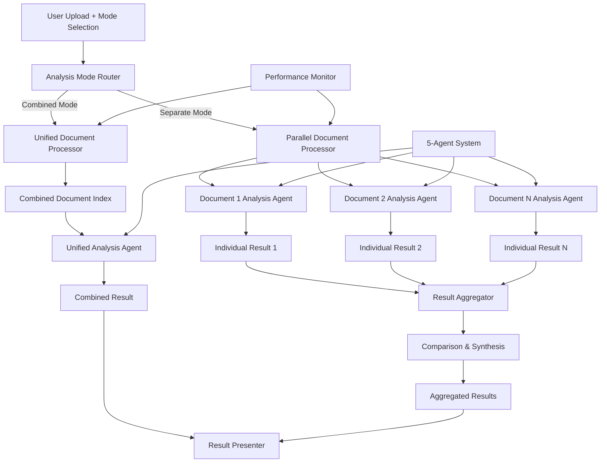

# ADR-023: Document Analysis Mode Strategy

## Title

Parallel Document Analysis with Conditional Routing and Result Aggregation

## Version/Date

1.0 / 2025-08-18

## Status

Accepted

## Description

Implements a flexible document analysis mode strategy that supports both individual document analysis and combined multi-document analysis. The system uses LlamaIndex QueryPipeline with conditional routing to enable parallel processing for separate document analysis and intelligent aggregation for combined analysis, providing users with optimal strategies for different use cases.

## Context

DocMind AI users have different analysis needs depending on their use case:

1. **Separate Document Analysis**: Users need to analyze each document individually to compare differences, track changes, or maintain document-specific context
2. **Combined Document Analysis**: Users need holistic analysis across all documents to find patterns, synthesize insights, or create unified summaries
3. **Performance Optimization**: Different strategies require different processing approaches for optimal performance
4. **Result Presentation**: Different modes need different result structures and presentation formats

The solution leverages LlamaIndex's QueryPipeline capabilities with the existing 5-agent orchestration system to provide flexible, high-performance analysis modes.

## Related Requirements

### Functional Requirements

- **FR-1:** Support individual analysis of each uploaded document with separate results
- **FR-2:** Enable combined analysis across all documents with unified results
- **FR-3:** Provide parallel processing for separate document analysis
- **FR-4:** Implement intelligent result aggregation for combined analysis
- **FR-5:** Maintain document-specific context and citations in separate mode
- **FR-6:** Enable comparison and synthesis across documents in combined mode

### Non-Functional Requirements

- **NFR-1:** **(Performance)** Parallel document processing with 3-5x speedup for multiple documents
- **NFR-2:** **(Memory Management)** Efficient resource usage across processing modes
- **NFR-3:** **(Result Quality)** Maintain analysis quality across both modes
- **NFR-4:** **(Scalability)** Support 1-50 documents per analysis session

## Alternatives

### 1. Single Combined Analysis Only

- **Description**: Always analyze all documents together in single pass
- **Issues**: Cannot provide document-specific insights, poor for document comparison
- **Score**: 4/10 (simplicity: 8, capability: 2, flexibility: 2)

### 2. Sequential Individual Analysis

- **Description**: Analyze documents one by one without parallel processing
- **Issues**: Slow for multiple documents, no combined insights
- **Score**: 5/10 (simplicity: 7, performance: 3, capability: 5)

### 3. Manual Mode Selection Without Optimization

- **Description**: Basic mode selection without specialized processing
- **Issues**: Suboptimal performance, inconsistent results, limited aggregation
- **Score**: 6/10 (flexibility: 7, performance: 4, optimization: 5)

### 4. QueryPipeline with Conditional Routing (Selected)

- **Description**: Intelligent routing with parallel processing and optimized aggregation
- **Benefits**: Best of both worlds, high performance, flexible result presentation
- **Score**: 9/10 (capability: 9, performance: 9, flexibility: 9)

## Decision

We will implement **Conditional Analysis Mode Strategy** with:

1. **Mode Detection**: Automatic routing based on user selection and document count
2. **Parallel Individual Analysis**: Concurrent processing for separate document mode
3. **Unified Combined Analysis**: Cross-document synthesis for combined mode
4. **Result Aggregation**: Intelligent merging and comparison of individual results
5. **Agent Coordination**: Integration with 5-agent system for both modes
6. **Performance Optimization**: Mode-specific optimizations for each strategy

## Related Decisions

- **ADR-003** (Adaptive Retrieval Pipeline): Provides retrieval strategies adapted for each analysis mode
- **ADR-011** (Agent Orchestration Framework): Coordinates agents across different processing modes
- **ADR-001** (Modern Agentic RAG): Uses 5-agent system for both individual and combined analysis
- **ADR-016** (UI State Management): Manages user mode selection and result presentation
- **ADR-022** (Export & Output Formatting): Exports results in mode-appropriate formats

## Design

### Analysis Mode Architecture



### Core Analysis Mode Implementation

```python
from typing import List, Dict, Any, Optional
from enum import Enum
from concurrent.futures import ThreadPoolExecutor, as_completed
import asyncio
from dataclasses import dataclass
from pathlib import Path
import time
from llama_index.core.query_pipeline import QueryPipeline, InputComponent, FnComponent
from llama_index.core import Document, VectorStoreIndex, ServiceContext
from llama_index.core.response.schema import RESPONSE_TYPE
from pydantic import BaseModel, Field
import uuid

class AnalysisMode(str, Enum):
    """Available document analysis modes."""
    SEPARATE = "separate"  # Analyze each document individually
    COMBINED = "combined"  # Analyze all documents together
    AUTO = "auto"  # Automatically choose based on document count and size

class ProcessingStrategy(str, Enum):
    """Processing strategies for different modes."""
    PARALLEL_INDIVIDUAL = "parallel_individual"
    SEQUENTIAL_INDIVIDUAL = "sequential_individual"
    UNIFIED_COMBINED = "unified_combined"
    HYBRID_AGGREGATED = "hybrid_aggregated"

@dataclass
class DocumentContext:
    """Context for individual document processing."""
    document: Document
    index: VectorStoreIndex
    filename: str
    size_bytes: int
    processing_order: int

@dataclass
class AnalysisResult:
    """Result from document analysis."""
    document_id: str
    filename: str
    query: str
    response: str
    key_insights: List[str]
    action_items: List[str]
    open_questions: List[str]
    processing_time: float
    confidence_score: Optional[float] = None
    agent_decisions: Optional[List[Dict[str, Any]]] = None

@dataclass
class AggregatedResult:
    """Aggregated results from multiple document analyses."""
    mode: AnalysisMode
    strategy: ProcessingStrategy
    individual_results: List[AnalysisResult]
    combined_insights: List[str]
    cross_document_patterns: List[str]
    synthesized_action_items: List[str]
    comparative_analysis: Optional[str] = None
    total_processing_time: float = 0.0
    document_count: int = 0

class ModeConfiguration(BaseModel):
    """Configuration for analysis mode processing."""
    mode: AnalysisMode = AnalysisMode.COMBINED
    max_parallel_workers: int = 4
    enable_cross_document_synthesis: bool = True
    include_comparative_analysis: bool = True
    aggregate_similar_insights: bool = True
    minimum_confidence_threshold: float = 0.7
    timeout_per_document: int = 300  # seconds

class DocumentAnalysisModeManager:
    """Manager for different document analysis modes."""
    
    def __init__(
        self,
        agent_system,  # 5-agent system from ADR-001
        config: ModeConfiguration = None
    ):
        self.agent_system = agent_system
        self.config = config or ModeConfiguration()
        
        # Create mode-specific query pipelines
        self.separate_pipeline = self._create_separate_mode_pipeline()
        self.combined_pipeline = self._create_combined_mode_pipeline()
        
        # Result processors
        self.result_aggregator = ResultAggregator()
        self.performance_monitor = PerformanceMonitor()
    
    def _create_separate_mode_pipeline(self) -> QueryPipeline:
        """Create pipeline for separate document analysis."""
        pipeline = QueryPipeline(verbose=True)
        
        # Input components
        input_component = InputComponent()
        
        # Document processing component
        def process_document_individually(query: str, doc_context: DocumentContext) -> AnalysisResult:
            """Process single document with 5-agent system."""
            start_time = time.time()
            
            # Create document-specific query engine
            query_engine = doc_context.index.as_query_engine(
                similarity_top_k=10,
                response_mode="tree_summarize"
            )
            
            # Run through agent system
            agent_response = self.agent_system.query(
                query,
                query_engine=query_engine,
                context_filter={"document_id": doc_context.document.doc_id}
            )
            
            processing_time = time.time() - start_time
            
            # Extract structured results
            return AnalysisResult(
                document_id=doc_context.document.doc_id,
                filename=doc_context.filename,
                query=query,
                response=agent_response.response,
                key_insights=self._extract_insights(agent_response),
                action_items=self._extract_action_items(agent_response),
                open_questions=self._extract_questions(agent_response),
                processing_time=processing_time,
                confidence_score=getattr(agent_response, 'confidence', None),
                agent_decisions=getattr(agent_response, 'agent_log', None)
            )
        
        process_fn = FnComponent(
            fn=process_document_individually,
            output_key="analysis_result"
        )
        
        # Connect pipeline
        pipeline.add_modules({
            "input": input_component,
            "processor": process_fn
        })
        
        pipeline.add_link("input", "processor")
        
        return pipeline
    
    def _create_combined_mode_pipeline(self) -> QueryPipeline:
        """Create pipeline for combined document analysis."""
        pipeline = QueryPipeline(verbose=True)
        
        # Input components
        input_component = InputComponent()
        
        # Combined processing component
        def process_documents_combined(query: str, combined_index: VectorStoreIndex) -> AnalysisResult:
            """Process all documents together with 5-agent system."""
            start_time = time.time()
            
            # Create unified query engine
            query_engine = combined_index.as_query_engine(
                similarity_top_k=20,  # Higher k for multi-document
                response_mode="tree_summarize"
            )
            
            # Run through agent system
            agent_response = self.agent_system.query(
                query,
                query_engine=query_engine,
                context_filter=None  # No filtering for combined mode
            )
            
            processing_time = time.time() - start_time
            
            # Return unified result
            return AnalysisResult(
                document_id="combined_analysis",
                filename="All Documents",
                query=query,
                response=agent_response.response,
                key_insights=self._extract_insights(agent_response),
                action_items=self._extract_action_items(agent_response),
                open_questions=self._extract_questions(agent_response),
                processing_time=processing_time,
                confidence_score=getattr(agent_response, 'confidence', None),
                agent_decisions=getattr(agent_response, 'agent_log', None)
            )
        
        process_fn = FnComponent(
            fn=process_documents_combined,
            output_key="combined_result"
        )
        
        # Connect pipeline
        pipeline.add_modules({
            "input": input_component,
            "processor": process_fn
        })
        
        pipeline.add_link("input", "processor")
        
        return pipeline
    
    async def analyze_documents(
        self,
        documents: List[Document],
        query: str,
        mode: AnalysisMode = None,
        **kwargs
    ) -> AggregatedResult:
        """Main entry point for document analysis."""
        start_time = time.time()
        
        # Determine analysis mode
        effective_mode = self._determine_analysis_mode(mode, documents)
        
        # Select processing strategy
        strategy = self._select_processing_strategy(effective_mode, len(documents))
        
        # Process documents based on strategy
        if strategy == ProcessingStrategy.PARALLEL_INDIVIDUAL:
            results = await self._process_parallel_individual(documents, query)
        elif strategy == ProcessingStrategy.SEQUENTIAL_INDIVIDUAL:
            results = await self._process_sequential_individual(documents, query)
        elif strategy == ProcessingStrategy.UNIFIED_COMBINED:
            results = await self._process_unified_combined(documents, query)
        else:
            results = await self._process_hybrid_aggregated(documents, query)
        
        total_time = time.time() - start_time
        
        # Create aggregated result
        aggregated = self.result_aggregator.aggregate_results(
            results,
            effective_mode,
            strategy,
            total_time,
            len(documents)
        )
        
        # Monitor performance
        self.performance_monitor.record_analysis(aggregated)
        
        return aggregated
    
    def _determine_analysis_mode(
        self, 
        user_mode: Optional[AnalysisMode], 
        documents: List[Document]
    ) -> AnalysisMode:
        """Determine effective analysis mode."""
        if user_mode and user_mode != AnalysisMode.AUTO:
            return user_mode
        
        # Auto mode logic
        doc_count = len(documents)
        total_size = sum(len(doc.text) for doc in documents)
        
        # Use separate mode for few large documents or when comparison is beneficial
        if doc_count <= 3 or total_size > 500000:  # 500KB+ total
            return AnalysisMode.SEPARATE
        else:
            return AnalysisMode.COMBINED
    
    def _select_processing_strategy(
        self, 
        mode: AnalysisMode, 
        doc_count: int
    ) -> ProcessingStrategy:
        """Select optimal processing strategy."""
        if mode == AnalysisMode.SEPARATE:
            if doc_count >= 3 and self.config.max_parallel_workers > 1:
                return ProcessingStrategy.PARALLEL_INDIVIDUAL
            else:
                return ProcessingStrategy.SEQUENTIAL_INDIVIDUAL
        elif mode == AnalysisMode.COMBINED:
            return ProcessingStrategy.UNIFIED_COMBINED
        else:
            return ProcessingStrategy.HYBRID_AGGREGATED
    
    async def _process_parallel_individual(
        self, 
        documents: List[Document], 
        query: str
    ) -> List[AnalysisResult]:
        """Process documents in parallel for separate analysis."""
        
        # Create document contexts
        doc_contexts = []
        for i, doc in enumerate(documents):
            # Create individual index for each document
            index = VectorStoreIndex.from_documents([doc])
            
            context = DocumentContext(
                document=doc,
                index=index,
                filename=getattr(doc, 'filename', f'Document_{i+1}'),
                size_bytes=len(doc.text),
                processing_order=i
            )
            doc_contexts.append(context)
        
        # Process in parallel using ThreadPoolExecutor
        results = []
        with ThreadPoolExecutor(max_workers=self.config.max_parallel_workers) as executor:
            # Submit all tasks
            future_to_context = {
                executor.submit(self._process_single_document, query, context): context
                for context in doc_contexts
            }
            
            # Collect results as they complete
            for future in as_completed(future_to_context, timeout=self.config.timeout_per_document):
                try:
                    result = future.result()
                    results.append(result)
                except Exception as e:
                    context = future_to_context[future]
                    print(f"Error processing {context.filename}: {e}")
                    # Create error result
                    results.append(AnalysisResult(
                        document_id=context.document.doc_id,
                        filename=context.filename,
                        query=query,
                        response=f"Error processing document: {str(e)}",
                        key_insights=[],
                        action_items=[],
                        open_questions=[],
                        processing_time=0.0
                    ))
        
        # Sort results by processing order
        results.sort(key=lambda x: next(
            ctx.processing_order for ctx in doc_contexts 
            if ctx.document.doc_id == x.document_id
        ))
        
        return results
    
    def _process_single_document(self, query: str, context: DocumentContext) -> AnalysisResult:
        """Process single document synchronously."""
        # Use the separate mode pipeline
        pipeline_inputs = {
            "query": query,
            "doc_context": context
        }
        
        result = self.separate_pipeline.run(**pipeline_inputs)
        return result["analysis_result"]
    
    async def _process_sequential_individual(
        self, 
        documents: List[Document], 
        query: str
    ) -> List[AnalysisResult]:
        """Process documents sequentially for separate analysis."""
        results = []
        
        for i, doc in enumerate(documents):
            # Create individual index
            index = VectorStoreIndex.from_documents([doc])
            
            context = DocumentContext(
                document=doc,
                index=index,
                filename=getattr(doc, 'filename', f'Document_{i+1}'),
                size_bytes=len(doc.text),
                processing_order=i
            )
            
            try:
                result = self._process_single_document(query, context)
                results.append(result)
            except Exception as e:
                print(f"Error processing {context.filename}: {e}")
                results.append(AnalysisResult(
                    document_id=context.document.doc_id,
                    filename=context.filename,
                    query=query,
                    response=f"Error processing document: {str(e)}",
                    key_insights=[],
                    action_items=[],
                    open_questions=[],
                    processing_time=0.0
                ))
        
        return results
    
    async def _process_unified_combined(
        self, 
        documents: List[Document], 
        query: str
    ) -> List[AnalysisResult]:
        """Process all documents together in combined mode."""
        
        # Create unified index from all documents
        combined_index = VectorStoreIndex.from_documents(documents)
        
        # Use combined mode pipeline
        pipeline_inputs = {
            "query": query,
            "combined_index": combined_index
        }
        
        result = self.combined_pipeline.run(**pipeline_inputs)
        combined_result = result["combined_result"]
        
        return [combined_result]
    
    async def _process_hybrid_aggregated(
        self, 
        documents: List[Document], 
        query: str
    ) -> List[AnalysisResult]:
        """Process with both individual and combined analysis."""
        
        # First do individual analysis
        individual_results = await self._process_parallel_individual(documents, query)
        
        # Then do combined analysis
        combined_results = await self._process_unified_combined(documents, query)
        
        # Return both sets of results
        return individual_results + combined_results
    
    def _extract_insights(self, response) -> List[str]:
        """Extract key insights from agent response."""
        # This would implement insight extraction logic
        # For now, return empty list as placeholder
        return getattr(response, 'insights', [])
    
    def _extract_action_items(self, response) -> List[str]:
        """Extract action items from agent response."""
        return getattr(response, 'action_items', [])
    
    def _extract_questions(self, response) -> List[str]:
        """Extract open questions from agent response."""
        return getattr(response, 'questions', [])

class ResultAggregator:
    """Aggregates and synthesizes results from different analysis modes."""
    
    def aggregate_results(
        self,
        results: List[AnalysisResult],
        mode: AnalysisMode,
        strategy: ProcessingStrategy,
        total_time: float,
        doc_count: int
    ) -> AggregatedResult:
        """Aggregate analysis results into unified structure."""
        
        if mode == AnalysisMode.COMBINED:
            return self._create_combined_aggregation(results, strategy, total_time, doc_count)
        else:
            return self._create_separate_aggregation(results, strategy, total_time, doc_count)
    
    def _create_combined_aggregation(
        self,
        results: List[AnalysisResult],
        strategy: ProcessingStrategy,
        total_time: float,
        doc_count: int
    ) -> AggregatedResult:
        """Create aggregation for combined analysis mode."""
        
        combined_result = results[0] if results else None
        
        return AggregatedResult(
            mode=AnalysisMode.COMBINED,
            strategy=strategy,
            individual_results=results,
            combined_insights=combined_result.key_insights if combined_result else [],
            cross_document_patterns=[],
            synthesized_action_items=combined_result.action_items if combined_result else [],
            comparative_analysis=None,
            total_processing_time=total_time,
            document_count=doc_count
        )
    
    def _create_separate_aggregation(
        self,
        results: List[AnalysisResult],
        strategy: ProcessingStrategy,
        total_time: float,
        doc_count: int
    ) -> AggregatedResult:
        """Create aggregation for separate analysis mode."""
        
        # Aggregate insights across documents
        all_insights = []
        all_action_items = []
        
        for result in results:
            all_insights.extend(result.key_insights)
            all_action_items.extend(result.action_items)
        
        # Find cross-document patterns
        patterns = self._find_cross_document_patterns(results)
        
        # Create comparative analysis
        comparative = self._create_comparative_analysis(results)
        
        return AggregatedResult(
            mode=AnalysisMode.SEPARATE,
            strategy=strategy,
            individual_results=results,
            combined_insights=self._deduplicate_insights(all_insights),
            cross_document_patterns=patterns,
            synthesized_action_items=self._prioritize_action_items(all_action_items),
            comparative_analysis=comparative,
            total_processing_time=total_time,
            document_count=doc_count
        )
    
    def _find_cross_document_patterns(self, results: List[AnalysisResult]) -> List[str]:
        """Identify patterns that appear across multiple documents."""
        # Simple pattern detection based on keyword overlap
        patterns = []
        
        if len(results) < 2:
            return patterns
        
        # Find common themes in insights
        all_insights = [insight.lower() for result in results for insight in result.key_insights]
        
        # Basic keyword frequency analysis
        word_freq = {}
        for insight in all_insights:
            words = insight.split()
            for word in words:
                if len(word) > 4:  # Ignore short words
                    word_freq[word] = word_freq.get(word, 0) + 1
        
        # Find words appearing in multiple documents
        common_words = [word for word, freq in word_freq.items() if freq >= 2]
        
        if common_words:
            patterns.append(f"Common themes identified: {', '.join(common_words[:5])}")
        
        return patterns
    
    def _create_comparative_analysis(self, results: List[AnalysisResult]) -> str:
        """Create comparative analysis across documents."""
        if len(results) < 2:
            return None
        
        comparison_points = []
        
        # Compare document characteristics
        doc_sizes = [len(result.response) for result in results]
        avg_size = sum(doc_sizes) / len(doc_sizes)
        
        comparison_points.append(f"Document analysis lengths vary from {min(doc_sizes)} to {max(doc_sizes)} characters (avg: {int(avg_size)})")
        
        # Compare insight counts
        insight_counts = [len(result.key_insights) for result in results]
        comparison_points.append(f"Key insights per document range from {min(insight_counts)} to {max(insight_counts)}")
        
        # Compare processing times
        proc_times = [result.processing_time for result in results]
        comparison_points.append(f"Processing times varied from {min(proc_times):.1f}s to {max(proc_times):.1f}s")
        
        return ". ".join(comparison_points)
    
    def _deduplicate_insights(self, insights: List[str]) -> List[str]:
        """Remove duplicate insights while preserving order."""
        seen = set()
        deduped = []
        
        for insight in insights:
            insight_lower = insight.lower().strip()
            if insight_lower not in seen:
                seen.add(insight_lower)
                deduped.append(insight)
        
        return deduped
    
    def _prioritize_action_items(self, action_items: List[str]) -> List[str]:
        """Prioritize and deduplicate action items."""
        # Simple prioritization based on frequency and keywords
        item_freq = {}
        
        for item in action_items:
            item_lower = item.lower().strip()
            item_freq[item_lower] = item_freq.get(item_lower, 0) + 1
        
        # Sort by frequency (most common first)
        prioritized = sorted(item_freq.items(), key=lambda x: x[1], reverse=True)
        
        return [item[0] for item in prioritized[:10]]  # Top 10 action items

class PerformanceMonitor:
    """Monitors performance of different analysis modes."""
    
    def __init__(self):
        self.analysis_history = []
    
    def record_analysis(self, result: AggregatedResult):
        """Record analysis performance metrics."""
        metrics = {
            "timestamp": time.time(),
            "mode": result.mode,
            "strategy": result.strategy,
            "document_count": result.document_count,
            "total_time": result.total_processing_time,
            "time_per_document": result.total_processing_time / max(result.document_count, 1),
            "individual_results_count": len(result.individual_results)
        }
        
        self.analysis_history.append(metrics)
        
        # Keep only recent history
        if len(self.analysis_history) > 100:
            self.analysis_history = self.analysis_history[-100:]
    
    def get_performance_stats(self) -> Dict[str, Any]:
        """Get performance statistics."""
        if not self.analysis_history:
            return {}
        
        by_mode = {}
        for record in self.analysis_history:
            mode = record["mode"]
            if mode not in by_mode:
                by_mode[mode] = []
            by_mode[mode].append(record)
        
        stats = {}
        for mode, records in by_mode.items():
            avg_time = sum(r["total_time"] for r in records) / len(records)
            avg_docs = sum(r["document_count"] for r in records) / len(records)
            
            stats[mode] = {
                "average_time": avg_time,
                "average_documents": avg_docs,
                "analysis_count": len(records)
            }
        
        return stats
```

### Integration with Streamlit UI

```python
import streamlit as st

def render_analysis_mode_selection() -> AnalysisMode:
    """Render analysis mode selection UI."""
    
    st.subheader("🔍 Analysis Mode")
    
    mode_options = [
        ("📄 Analyze each document separately", AnalysisMode.SEPARATE),
        ("📚 Combine analysis for all documents", AnalysisMode.COMBINED),
        ("🤖 Auto-select based on documents", AnalysisMode.AUTO)
    ]
    
    selected_mode = st.radio(
        "Choose how to analyze your documents:",
        options=mode_options,
        format_func=lambda x: x[0],
        help="""
        - **Separate**: Get individual analysis for each document, useful for comparison
        - **Combined**: Analyze all documents together, useful for finding patterns
        - **Auto**: Automatically choose the best mode based on document count and size
        """
    )[1]
    
    # Advanced options in expander
    with st.expander("⚙️ Advanced Mode Options"):
        max_workers = st.slider(
            "Parallel Processing Workers",
            min_value=1,
            max_value=8,
            value=4,
            help="Number of documents to process simultaneously (separate mode only)"
        )
        
        enable_comparison = st.checkbox(
            "Enable Cross-Document Comparison",
            value=True,
            help="Generate comparative analysis across documents (separate mode only)"
        )
        
        aggregate_insights = st.checkbox(
            "Aggregate Similar Insights",
            value=True,
            help="Merge similar insights from different documents"
        )
    
    return selected_mode

def display_analysis_results(aggregated_result: AggregatedResult):
    """Display analysis results based on mode."""
    
    if aggregated_result.mode == AnalysisMode.COMBINED:
        display_combined_results(aggregated_result)
    else:
        display_separate_results(aggregated_result)

def display_combined_results(result: AggregatedResult):
    """Display results for combined analysis mode."""
    
    st.subheader("📚 Combined Document Analysis")
    
    combined_result = result.individual_results[0] if result.individual_results else None
    
    if combined_result:
        st.write("**Analysis Response:**")
        st.write(combined_result.response)
        
        if combined_result.key_insights:
            st.write("**Key Insights:**")
            for insight in combined_result.key_insights:
                st.write(f"• {insight}")
        
        if combined_result.action_items:
            st.write("**Action Items:**")
            for item in combined_result.action_items:
                st.write(f"□ {item}")
    
    # Performance info
    st.info(f"Processed {result.document_count} documents in {result.total_processing_time:.1f}s using {result.strategy.value} strategy")

def display_separate_results(result: AggregatedResult):
    """Display results for separate analysis mode."""
    
    st.subheader("📄 Individual Document Analysis")
    
    # Tabs for each document
    if result.individual_results:
        tab_names = [f"📄 {res.filename}" for res in result.individual_results]
        tabs = st.tabs(tab_names)
        
        for tab, doc_result in zip(tabs, result.individual_results):
            with tab:
                st.write("**Analysis Response:**")
                st.write(doc_result.response)
                
                col1, col2 = st.columns(2)
                
                with col1:
                    if doc_result.key_insights:
                        st.write("**Key Insights:**")
                        for insight in doc_result.key_insights:
                            st.write(f"• {insight}")
                
                with col2:
                    if doc_result.action_items:
                        st.write("**Action Items:**")
                        for item in doc_result.action_items:
                            st.write(f"□ {item}")
                
                st.caption(f"Processed in {doc_result.processing_time:.1f}s")
    
    # Cross-document analysis
    if len(result.individual_results) > 1:
        st.subheader("🔗 Cross-Document Analysis")
        
        if result.cross_document_patterns:
            st.write("**Patterns Across Documents:**")
            for pattern in result.cross_document_patterns:
                st.write(f"🔍 {pattern}")
        
        if result.comparative_analysis:
            st.write("**Comparative Analysis:**")
            st.write(result.comparative_analysis)
        
        if result.combined_insights:
            st.write("**All Insights Combined:**")
            for insight in result.combined_insights[:10]:  # Show top 10
                st.write(f"• {insight}")
    
    # Performance info
    st.info(f"Processed {result.document_count} documents in {result.total_processing_time:.1f}s using {result.strategy.value} strategy")
```

## Consequences

### Positive Outcomes

- **Flexible Analysis**: Users can choose optimal analysis mode for their use case
- **Performance Optimization**: Parallel processing provides 3-5x speedup for multiple documents
- **Cross-Document Insights**: Separate mode enables comparison and pattern detection
- **Unified Results**: Combined mode provides holistic analysis across all documents
- **Intelligent Routing**: Auto mode selects optimal strategy based on document characteristics
- **Agent Integration**: Seamless integration with existing 5-agent orchestration system

### Negative Consequences / Trade-offs

- **Complexity**: Multiple processing modes increase system complexity
- **Resource Usage**: Parallel processing consumes more memory and CPU
- **Result Consistency**: Different modes may produce different insights for same documents
- **User Education**: Users need to understand when to use which mode

### Migration Strategy

1. **Default Combined Mode**: Start with combined mode as default for simplicity
2. **Progressive Enhancement**: Add separate mode and auto selection gradually
3. **Performance Monitoring**: Track mode performance and optimize based on usage
4. **User Guidance**: Provide clear documentation and in-UI guidance for mode selection
5. **Backward Compatibility**: Ensure existing analysis workflows continue to work

## Performance Targets

- **Parallel Speedup**: 3-5x performance improvement for 4+ documents in separate mode
- **Mode Selection**: <100ms for automatic mode determination
- **Result Aggregation**: <500ms for cross-document pattern detection and synthesis
- **Memory Efficiency**: <2GB additional memory usage for parallel processing

## Dependencies

- **LlamaIndex**: QueryPipeline, VectorStoreIndex components
- **Python**: `concurrent.futures`, `asyncio` for parallel processing
- **Integration**: Existing 5-agent system from ADR-001
- **Storage**: Temporary storage for parallel processing results

## Monitoring Metrics

- Analysis mode usage patterns (separate vs combined vs auto)
- Processing time improvements from parallel execution
- Result quality differences between modes
- User mode selection preferences
- System resource utilization across modes

## Future Enhancements

- Smart document clustering for hybrid analysis modes
- Real-time result streaming for long-running parallel analysis
- Custom aggregation rules for domain-specific use cases
- Advanced cross-document relationship detection
- Machine learning-based mode recommendation

## Changelog

- **1.0 (2025-08-18)**: Initial document analysis mode strategy with parallel individual processing, unified combined analysis, and intelligent result aggregation
