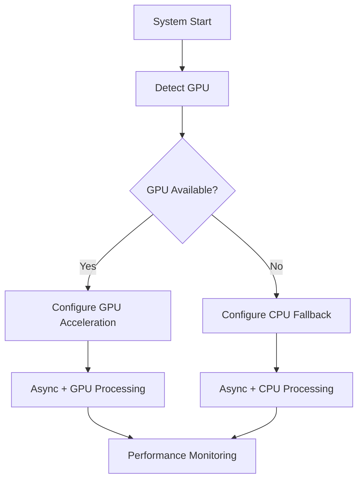

# ADR 003: GPU Optimization and Hardware Detection

## Version/Date

v1.1 / July 25, 2025 (Updated with async performance enhancements)

## Status

Accepted - Enhanced

## Context

Performance critical for large docs/models; leverage NVIDIA GPUs without mandating them. Combined with async operations, GPU acceleration provides significant performance improvements for document processing and embedding generation.

## Related Requirements

- Fast document processing for large files

- Efficient embedding generation

- Hardware flexibility (GPU optional, CPU fallback)

- Integration with async performance optimizations

## Alternatives Considered

- No GPU: Slower performance; rejected for poor user experience with large documents.

- TensorRT-LLM: Complex setup and integration; use if needed in future but too heavy for current needs.

- CPU-only optimization: Insufficient performance gains for compute-intensive tasks.

## Decision

- **Detection:** Parse nvidia-smi for VRAM/model suggestions (e.g., 72B for 16GB+).

- **Offload:** Full (n_gpu_layers=-1) for LlamaCpp; device='cuda' for embeddings/reranking.

- **Toggles:** UI checkbox; auto-config.

- **Efficiency:** PEFT for parameter-efficient loading.

- **Async Integration:** Combined with AsyncQdrantClient for up to 4-5x total performance improvement.

## Related Decisions

- ADR 012: AsyncQdrantClient Performance Optimization (provides async enhancements)

- ADR 002: Embedding Choices (benefits from combined GPU + async optimizations)

- ADR 001: Architecture (GPU support integrated into overall design)

## Design

- Hardware detection and auto-configuration

- GPU toggle controls in UI

- Graceful fallback to CPU operations

- Combined GPU + async setup for maximum performance

- Real-time performance monitoring

## Consequences

- Positive: 2-3x speed gains from GPU acceleration; 50-80% from async operations; up to 4-5x total improvement for document processing.

- Negative: CPU fallback for non-GPU users; dual maintenance for GPU/CPU code paths.

- Risks: GPU memory management complexity (mitigated by auto-detection); compatibility issues (mitigated by fallback).

- Mitigations: Automatic hardware detection; graceful CPU fallback; comprehensive testing on various hardware configurations.
