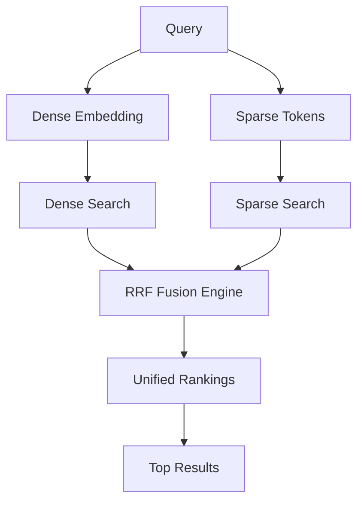

# ADR 013: Reciprocal Rank Fusion (RRF) for Hybrid Search

## Version/Date

v1.0 / July 25, 2025

## Status

Accepted

## Context

Document retrieval quality requires combining semantic understanding (dense embeddings) with exact keyword matching (sparse embeddings). Simple score addition or weighted averages don't properly normalize different embedding spaces. RRF provides a research-backed approach to fuse dense and sparse retrieval results while maintaining ranking quality.

## Related Requirements

- Improved search relevance combining semantic and keyword matching

- Research-backed fusion weights for optimal performance

- Performance optimization for hybrid search operations

- Seamless integration with existing Qdrant and LlamaIndex infrastructure

## Alternatives Considered

- Simple score addition: Poor normalization across embedding spaces; rejected for quality issues.

- Weighted averages: Better than addition but inferior to RRF research; rejected for suboptimal ranking.

- Custom Python fusion: High maintenance and slower performance; rejected for complexity.

- LlamaIndex default hybrid: Uses simple weighting; insufficient for production quality.

## Decision

Implement RRF (Reciprocal Rank Fusion) using Qdrant's native implementation with:

- **Native Fusion**: Qdrant's optimized C++ RRF via `query={"fusion": "rrf"}`

- **Research-backed Weights**: Dense 0.7, Sparse 0.3 (optimal semantic/keyword balance)

- **Prefetch Optimization**: Retrieve `limit * 2` results for better fusion quality

- **Performance Parameters**: RRF alpha=60 based on Qdrant research

## Related Decisions

- ADR 002: Embedding Choices (provides dense/sparse embeddings for RRF)

- ADR 007: Reranking Strategy (works with RRF output for final ranking)

- ADR 012: AsyncQdrantClient Performance Optimization (enhances RRF performance)

## Design

- Core RRF implementation in `utils.py:create_qdrant_hybrid_query()`

- Automatic conversion from RRF weights to LlamaIndex `hybrid_alpha`

- Configuration validation via `verify_rrf_configuration()`

- Intelligent prefetch mechanism for fusion quality

## Consequences

- Positive: Improved search relevance, native performance optimization, research-backed configuration, seamless LlamaIndex integration.

- Negative: Slightly higher latency vs single-vector search; additional configuration complexity.

- Risks: Dependency on Qdrant RRF implementation (mitigated by proven stability); configuration tuning needed (mitigated by research defaults).

- Mitigations: Native implementation for performance; research-backed defaults; comprehensive testing and validation.
