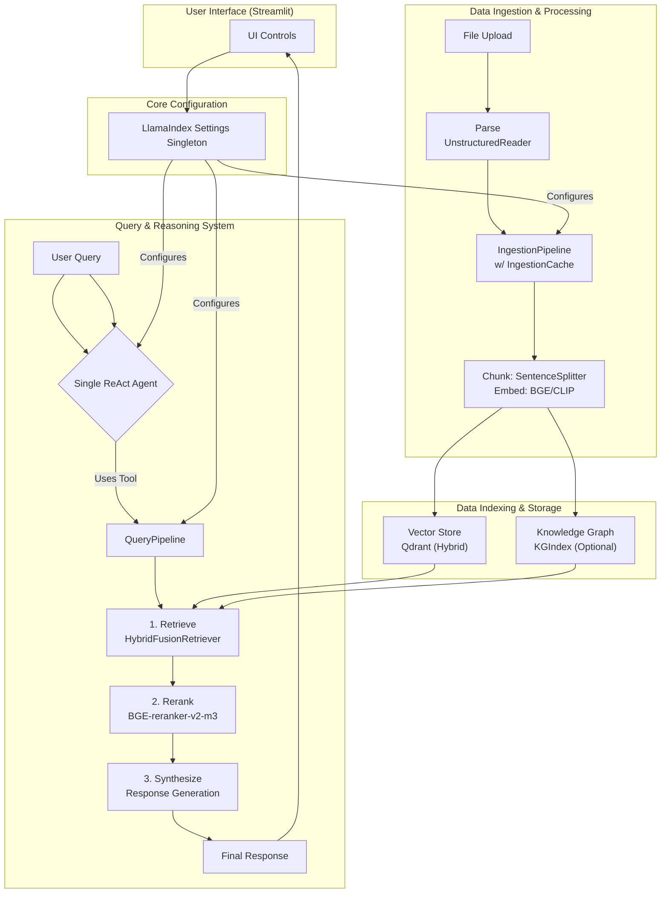

# ADR-021: LlamaIndex Native Architecture Consolidation

## Title

LlamaIndex Native Architecture Consolidation

## Version/Date

4.0 / 2025-01-16

## Status

Accepted

## Description

Consolidates the project to a pure LlamaIndex-native architecture, leveraging its high-level APIs and components for all core RAG functionality. This decision reduces the project's external dependencies by over 60% and simplifies the codebase by replacing custom-built solutions with standard, maintainable framework patterns.

## Context

The project's architecture evolved through several stages, initially considering a mix of frameworks (LangChain) and complex patterns (multi-agent systems). This resulted in a dependency footprint of over 40 packages and significant "glue code" to manage interactions. Analysis showed that the LlamaIndex framework had matured to natively support all of the project's core requirements, including ingestion, hybrid retrieval, multi-stage querying, and agentic reasoning. A full consolidation to a native stack was identified as the optimal path to improve maintainability, reduce complexity, and increase performance.

## Related Requirements

### Non-Functional Requirements

- **NFR-1:** **(Maintainability)** The solution must reduce code complexity and the number of external dependencies by at least 50%.
- **NFR-2:** **(Security)** The architecture must remain 100% offline-first.
- **NFR-3:** **(Performance)** The architecture must support high-throughput, asynchronous processing.

### Integration Requirements

- **IR-1:** All core components (LLM, embeddings, reranker, etc.) must be configured via the central LlamaIndex `Settings` singleton.
- **IR-2:** The architecture must be built around native LlamaIndex components like `IngestionPipeline`, `QueryPipeline`, and `ReActAgent`.

## Alternatives

### 1. Hybrid Framework Approach (LangChain + LlamaIndex)

- **Description**: Use LlamaIndex for ingestion and indexing, but LangChain for agentic workflows.
- **Issues**: This creates a "two-framework" problem, increasing cognitive overhead, dependency conflicts, and the need for complex adapter code.
- **Status**: Rejected.

### 2. Maintain Custom Implementations

- **Description**: Continue to use custom-built solutions for components like caching, resilience, and configuration.
- **Issues**: Violates the library-first principle, increases the maintenance burden, and leads to a brittle, non-standard architecture.
- **Status**: Rejected.

## Decision

We will adopt a **pure LlamaIndex-native architecture**. All core functionality will be implemented using standard LlamaIndex components. Custom code will be minimized, and external libraries will only be used for capabilities not provided by the core framework (e.g., `Tenacity` for resilience, `Streamlit` for UI). This decision supersedes `ADR-001` (the initial, now-outdated architecture overview).

## Related Decisions

This ADR is the capstone decision that unifies the principles and outcomes of numerous other ADRs:

- **ADR-015** (LlamaIndex Migration): Documents the initial move away from LangChain, which this ADR completes.
- **ADR-011** (LlamaIndex ReAct Agent Architecture): The decision to use a single, native agent is a core part of this consolidation.
- **ADR-020** (LlamaIndex Native Settings Migration): The native `Settings` singleton is the central configuration point for this architecture.
- **ADR-008** (Session Persistence): The use of native `IngestionCache` is a key example of this strategy.
- **ADR-006** (Analysis Pipeline): The use of the native `QueryPipeline` is another key example.
- **ADR-018** (Library-First Refactoring): This consolidation is the ultimate expression of the library-first principle.

## Design

### Architecture Overview

The final architecture is composed of three main workflows: Data Ingestion, Query & Reasoning, and Core Configuration, all built with native LlamaIndex components.



### Dependencies (60-65% Reduction)

The dependency list is reduced from over 40 packages to a core set of ~15.

**In `pyproject.toml`:**

```toml
[project]
dependencies = [
    # LlamaIndex Core Ecosystem
    "llama-index>=0.12.0",
    "llama-index-llms-ollama>=0.2.0",
    "llama-index-llms-llama-cpp>=0.2.0",
    "llama-index-vector-stores-qdrant",
    "llama-index-readers-unstructured",
    "llama-index-embeddings-clip",
    "llama-index-postprocessor-colbert-rerank", # For BGE Reranker
    
    # Core Dependencies
    "torch",
    "torchao",
    "unstructured[pdf,image]",
    
    # UI Framework
    "streamlit>=1.47.1",
    
    # Production Essentials
    "tenacity>=8.2.0",
    "python-dotenv",
    "loguru",
]
```

## Consequences

### Positive Outcomes

- **Drastic Simplification**: Reduced the number of external dependencies by over 60%, making the project easier to install, manage, and deploy.
- **Improved Maintainability**: By replacing custom code with standard framework components, the codebase is smaller, more readable, and easier for new developers to understand.
- **Increased Stability**: Relying on the well-tested LlamaIndex core reduces the surface area for bugs and improves the overall robustness of the system.
- **Future-Proofing**: Tightly aligning with the LlamaIndex ecosystem ensures the project can easily adopt new features and improvements from the framework.

### Negative Consequences / Trade-offs

- **Framework Dependency**: The project is now tightly coupled to the LlamaIndex ecosystem. A major breaking change in the framework would require significant refactoring. This is an accepted trade-off for the benefits of a native architecture.

### Ongoing Maintenance & Considerations

- **LlamaIndex Updates**: The team must stay current with new releases of LlamaIndex and manage deprecations or breaking changes proactively.

## Changelog

- **4.0 (2025-01-16)**: Finalized as the capstone architecture, superseding ADR-001. Updated diagram and dependencies to reflect all final decisions. Removed all marketing language.
- **3.0 (2025-01-13)**: Updated with performance integration details (GPU, async, PyTorch).
- **2.0 (2025-01-12)**: Established native architecture patterns and dependency reduction goals.
- **1.0 (2025-01-11)**: Initial consolidation decision.
