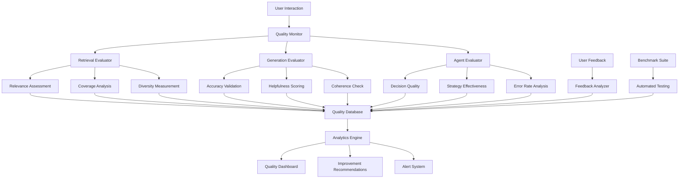

# ADR-012-NEW: Evaluation and Quality Assurance

## Title

Comprehensive Quality Assurance with Automated Evaluation and Continuous Improvement

## Version/Date

1.0 / 2025-01-16

## Status

Proposed

## Description

Implements a comprehensive evaluation and quality assurance system that provides automated assessment of RAG performance, continuous quality monitoring, and evidence-based system improvements. The system includes retrieval evaluation, generation quality assessment, user feedback integration, and automated benchmarking while maintaining local-first operation.

## Context

The modernized architecture introduces sophisticated components that require quality assurance:

1. **Complex Retrieval**: Hierarchical and agentic retrieval needs quality validation
2. **Multiple Models**: BGE-M3, local LLM, and reranker performance must be monitored
3. **Agent Decisions**: Agent quality and decision accuracy require evaluation
4. **User Experience**: Actual user satisfaction and system effectiveness need measurement
5. **Continuous Improvement**: System should learn and improve from usage patterns

A systematic evaluation framework enables objective quality assessment, identifies performance issues, and guides optimization efforts while preserving user privacy in a local-first environment.

## Related Requirements

### Functional Requirements

- **FR-1:** Automatically evaluate retrieval relevance and quality
- **FR-2:** Assess generated response accuracy and helpfulness
- **FR-3:** Monitor agent decision quality and effectiveness
- **FR-4:** Collect and analyze user feedback for continuous improvement
- **FR-5:** Provide actionable insights for system optimization

### Non-Functional Requirements

- **NFR-1:** **(Performance)** Evaluation overhead <10% of total system resources
- **NFR-2:** **(Privacy)** All evaluation data remains local with user consent
- **NFR-3:** **(Accuracy)** Evaluation metrics correlate ≥0.8 with human judgment
- **NFR-4:** **(Timeliness)** Quality issues detected within 24 hours of occurrence

## Alternatives

### 1. Manual Quality Assessment

- **Description**: Periodic manual review of system outputs
- **Issues**: Not scalable, subjective, delayed feedback, resource intensive
- **Score**: 3/10 (accuracy: 6, scalability: 1, timeliness: 2)

### 2. Cloud-Based Evaluation Services

- **Description**: Use external evaluation APIs for quality assessment
- **Issues**: Violates local-first principle, privacy concerns, ongoing costs
- **Score**: 5/10 (capability: 8, local-first: 0, privacy: 2)

### 3. Basic Metrics Only

- **Description**: Simple metrics like response time and error rates
- **Issues**: Insufficient quality insight, no improvement guidance, limited scope
- **Score**: 4/10 (simplicity: 8, insight: 2, actionability: 2)

### 4. Comprehensive Local Evaluation (Selected)

- **Description**: Multi-faceted evaluation with automated assessment and user feedback
- **Benefits**: Complete quality coverage, local-first, actionable insights
- **Score**: 9/10 (coverage: 9, privacy: 10, actionability: 8)

## Decision

We will implement **Comprehensive Local Evaluation and Quality Assurance** with:

### Core Components

1. **Retrieval Evaluation**: Automated assessment of retrieval relevance and coverage
2. **Generation Quality Assessment**: Response accuracy, helpfulness, and coherence evaluation
3. **Agent Performance Monitoring**: Agent decision quality and effectiveness tracking
4. **User Feedback Integration**: Systematic collection and analysis of user satisfaction
5. **Benchmarking System**: Automated testing against golden datasets
6. **Continuous Improvement Engine**: Data-driven optimization recommendations

## Related Decisions

- **ADR-001-NEW** (Modern Agentic RAG): Evaluates agent decision quality and effectiveness
- **ADR-003-NEW** (Adaptive Retrieval Pipeline): Monitors retrieval strategy performance
- **ADR-008-NEW** (Production Observability): Integrates with monitoring infrastructure
- **ADR-011-NEW** (Agent Orchestration Framework): Provides agent performance metrics

## Design

### Quality Assurance Architecture



### Retrieval Evaluation Framework

```python
import numpy as np
import time
from typing import List, Dict, Optional, Any, Tuple
from dataclasses import dataclass
from enum import Enum
import json
import sqlite3
from pathlib import Path
import threading
from concurrent.futures import ThreadPoolExecutor

class EvaluationMetric(Enum):
    PRECISION = "precision"
    RECALL = "recall"
    NDCG = "ndcg"
    MAP = "map"
    MRR = "mrr"
    DIVERSITY = "diversity"
    COVERAGE = "coverage"

class QualityLevel(Enum):
    EXCELLENT = "excellent"
    GOOD = "good"
    FAIR = "fair"
    POOR = "poor"
    UNACCEPTABLE = "unacceptable"

@dataclass
class EvaluationResult:
    """Result of quality evaluation."""
    metric_name: str
    score: float
    quality_level: QualityLevel
    details: Dict[str, Any]
    timestamp: float
    evaluation_context: Dict[str, Any]

@dataclass
class RetrievalEvaluation:
    """Comprehensive retrieval evaluation results."""
    query: str
    retrieved_documents: List[Dict]
    relevance_scores: List[float]
    precision_at_k: Dict[int, float]
    recall_at_k: Dict[int, float]
    ndcg_at_k: Dict[int, float]
    diversity_score: float
    coverage_score: float
    overall_quality: QualityLevel

class RetrievalEvaluator:
    """Automated evaluation of retrieval quality."""
    
    def __init__(self, llm_interface, observability_manager=None):
        self.llm = llm_interface
        self.observability = observability_manager
        self.logger = observability_manager.get_logger("RetrievalEvaluator") if observability_manager else None
        
        # Evaluation thresholds
        self.quality_thresholds = {
            QualityLevel.EXCELLENT: 0.9,
            QualityLevel.GOOD: 0.7,
            QualityLevel.FAIR: 0.5,
            QualityLevel.POOR: 0.3,
            QualityLevel.UNACCEPTABLE: 0.0
        }
    
    def evaluate_retrieval(
        self,
        query: str,
        retrieved_documents: List[Dict],
        ground_truth_relevance: Optional[List[float]] = None,
        correlation_id: Optional[str] = None
    ) -> RetrievalEvaluation:
        """Comprehensive evaluation of retrieval results."""
        
        start_time = time.time()
        
        try:
            # Generate relevance scores if not provided
            if ground_truth_relevance is None:
                relevance_scores = self._assess_relevance(query, retrieved_documents)
            else:
                relevance_scores = ground_truth_relevance
            
            # Calculate precision at k
            precision_at_k = self._calculate_precision_at_k(relevance_scores)
            
            # Calculate recall at k (requires ideal recall, estimated)
            recall_at_k = self._calculate_recall_at_k(relevance_scores, query)
            
            # Calculate NDCG at k
            ndcg_at_k = self._calculate_ndcg_at_k(relevance_scores)
            
            # Calculate diversity score
            diversity_score = self._calculate_diversity(retrieved_documents)
            
            # Calculate coverage score
            coverage_score = self._calculate_coverage(query, retrieved_documents)
            
            # Determine overall quality
            overall_quality = self._determine_overall_quality(
                precision_at_k.get(5, 0.0),
                ndcg_at_k.get(5, 0.0),
                diversity_score,
                coverage_score
            )
            
            evaluation = RetrievalEvaluation(
                query=query,
                retrieved_documents=retrieved_documents,
                relevance_scores=relevance_scores,
                precision_at_k=precision_at_k,
                recall_at_k=recall_at_k,
                ndcg_at_k=ndcg_at_k,
                diversity_score=diversity_score,
                coverage_score=coverage_score,
                overall_quality=overall_quality
            )
            
            # Log evaluation results
            if self.logger:
                self.logger.info(
                    "Retrieval evaluation completed",
                    correlation_id=correlation_id,
                    evaluation_time=time.time() - start_time,
                    overall_quality=overall_quality.value,
                    precision_at_5=precision_at_k.get(5, 0.0),
                    ndcg_at_5=ndcg_at_k.get(5, 0.0)
                )
            
            return evaluation
            
        except Exception as e:
            if self.logger:
                self.logger.error(
                    "Retrieval evaluation failed",
                    correlation_id=correlation_id,
                    error=str(e)
                )
            
            # Return default evaluation on error
            return RetrievalEvaluation(
                query=query,
                retrieved_documents=retrieved_documents,
                relevance_scores=[0.5] * len(retrieved_documents),
                precision_at_k={1: 0.5, 3: 0.5, 5: 0.5, 10: 0.5},
                recall_at_k={1: 0.5, 3: 0.5, 5: 0.5, 10: 0.5},
                ndcg_at_k={1: 0.5, 3: 0.5, 5: 0.5, 10: 0.5},
                diversity_score=0.5,
                coverage_score=0.5,
                overall_quality=QualityLevel.FAIR
            )
    
    def _assess_relevance(self, query: str, documents: List[Dict]) -> List[float]:
        """Assess relevance of documents to query using LLM."""
        relevance_scores = []
        
        for doc in documents:
            relevance_prompt = f"""
            Assess the relevance of this document to the given query on a scale of 0.0 to 1.0:
            
            Query: "{query}"
            
            Document: "{doc['content'][:500]}..."
            
            Consider:
            - Does the document directly address the query topic?
            - Does it contain information that would help answer the query?
            - Is the information accurate and up-to-date?
            
            Respond with only a number between 0.0 and 1.0 (e.g., 0.8):
            """
            
            try:
                response = self.llm.complete(relevance_prompt, temperature=0.1, max_tokens=10)
                score = float(response.strip())
                score = max(0.0, min(1.0, score))  # Clamp to valid range
                relevance_scores.append(score)
            except Exception:
                relevance_scores.append(0.5)  # Default neutral score
        
        return relevance_scores
    
    def _calculate_precision_at_k(self, relevance_scores: List[float], threshold: float = 0.5) -> Dict[int, float]:
        """Calculate precision at various k values."""
        precision_at_k = {}
        
        for k in [1, 3, 5, 10]:
            if k > len(relevance_scores):
                precision_at_k[k] = 0.0
                continue
            
            relevant_count = sum(1 for score in relevance_scores[:k] if score >= threshold)
            precision_at_k[k] = relevant_count / k
        
        return precision_at_k
    
    def _calculate_recall_at_k(self, relevance_scores: List[float], query: str, threshold: float = 0.5) -> Dict[int, float]:
        """Calculate recall at various k values (estimated)."""
        # Estimate total relevant documents (simplified approach)
        estimated_total_relevant = max(5, len([s for s in relevance_scores if s >= threshold]) * 2)
        
        recall_at_k = {}
        
        for k in [1, 3, 5, 10]:
            if k > len(relevance_scores):
                recall_at_k[k] = 0.0
                continue
            
            relevant_found = sum(1 for score in relevance_scores[:k] if score >= threshold)
            recall_at_k[k] = relevant_found / estimated_total_relevant
        
        return recall_at_k
    
    def _calculate_ndcg_at_k(self, relevance_scores: List[float]) -> Dict[int, float]:
        """Calculate Normalized Discounted Cumulative Gain at various k values."""
        ndcg_at_k = {}
        
        for k in [1, 3, 5, 10]:
            if k > len(relevance_scores):
                ndcg_at_k[k] = 0.0
                continue
            
            # Calculate DCG
            dcg = 0.0
            for i, score in enumerate(relevance_scores[:k]):
                dcg += score / np.log2(i + 2)  # i+2 because log2(1) = 0
            
            # Calculate IDCG (ideal DCG)
            ideal_scores = sorted(relevance_scores[:k], reverse=True)
            idcg = 0.0
            for i, score in enumerate(ideal_scores):
                idcg += score / np.log2(i + 2)
            
            # Calculate NDCG
            ndcg_at_k[k] = dcg / idcg if idcg > 0 else 0.0
        
        return ndcg_at_k
    
    def _calculate_diversity(self, documents: List[Dict]) -> float:
        """Calculate diversity of retrieved documents."""
        if len(documents) < 2:
            return 1.0
        
        # Simple lexical diversity measure
        all_words = set()
        doc_words = []
        
        for doc in documents[:5]:  # Top 5 for efficiency
            words = set(doc['content'].lower().split())
            doc_words.append(words)
            all_words.update(words)
        
        # Calculate average pairwise Jaccard distance
        total_distance = 0.0
        pairs = 0
        
        for i in range(len(doc_words)):
            for j in range(i + 1, len(doc_words)):
                intersection = len(doc_words[i].intersection(doc_words[j]))
                union = len(doc_words[i].union(doc_words[j]))
                jaccard_similarity = intersection / max(union, 1)
                jaccard_distance = 1.0 - jaccard_similarity
                
                total_distance += jaccard_distance
                pairs += 1
        
        return total_distance / max(pairs, 1)
    
    def _calculate_coverage(self, query: str, documents: List[Dict]) -> float:
        """Calculate how well documents cover the query topics."""
        query_words = set(query.lower().split())
        
        covered_words = set()
        for doc in documents:
            doc_words = set(doc['content'].lower().split())
            covered_words.update(query_words.intersection(doc_words))
        
        coverage = len(covered_words) / max(len(query_words), 1)
        return coverage
    
    def _determine_overall_quality(
        self,
        precision_at_5: float,
        ndcg_at_5: float,
        diversity: float,
        coverage: float
    ) -> QualityLevel:
        """Determine overall quality level based on multiple metrics."""
        
        # Weighted combination of metrics
        overall_score = (
            0.4 * precision_at_5 +
            0.3 * ndcg_at_5 +
            0.2 * diversity +
            0.1 * coverage
        )
        
        # Map to quality levels
        for level in [QualityLevel.EXCELLENT, QualityLevel.GOOD, QualityLevel.FAIR, QualityLevel.POOR]:
            if overall_score >= self.quality_thresholds[level]:
                return level
        
        return QualityLevel.UNACCEPTABLE

class GenerationEvaluator:
    """Automated evaluation of response generation quality."""
    
    def __init__(self, llm_interface, observability_manager=None):
        self.llm = llm_interface
        self.observability = observability_manager
        self.logger = observability_manager.get_logger("GenerationEvaluator") if observability_manager else None
    
    def evaluate_generation(
        self,
        query: str,
        generated_response: str,
        source_documents: List[Dict],
        correlation_id: Optional[str] = None
    ) -> Dict[str, Any]:
        """Comprehensive evaluation of generated response quality."""
        
        start_time = time.time()
        
        try:
            # Evaluate different aspects
            accuracy_score = self._evaluate_accuracy(query, generated_response, source_documents)
            helpfulness_score = self._evaluate_helpfulness(query, generated_response)
            coherence_score = self._evaluate_coherence(generated_response)
            completeness_score = self._evaluate_completeness(query, generated_response)
            
            # Calculate overall quality
            overall_score = (
                0.3 * accuracy_score +
                0.25 * helpfulness_score +
                0.25 * coherence_score +
                0.2 * completeness_score
            )
            
            # Determine quality level
            quality_level = self._score_to_quality_level(overall_score)
            
            evaluation_result = {
                'accuracy_score': accuracy_score,
                'helpfulness_score': helpfulness_score,
                'coherence_score': coherence_score,
                'completeness_score': completeness_score,
                'overall_score': overall_score,
                'quality_level': quality_level.value,
                'evaluation_time': time.time() - start_time
            }
            
            # Log evaluation results
            if self.logger:
                self.logger.info(
                    "Generation evaluation completed",
                    correlation_id=correlation_id,
                    overall_score=overall_score,
                    quality_level=quality_level.value
                )
            
            return evaluation_result
            
        except Exception as e:
            if self.logger:
                self.logger.error(
                    "Generation evaluation failed",
                    correlation_id=correlation_id,
                    error=str(e)
                )
            
            return {
                'accuracy_score': 0.5,
                'helpfulness_score': 0.5,
                'coherence_score': 0.5,
                'completeness_score': 0.5,
                'overall_score': 0.5,
                'quality_level': QualityLevel.FAIR.value,
                'evaluation_error': str(e)
            }
    
    def _evaluate_accuracy(self, query: str, response: str, sources: List[Dict]) -> float:
        """Evaluate factual accuracy of response against sources."""
        
        source_content = "\n".join([doc['content'] for doc in sources[:3]])
        
        accuracy_prompt = f"""
        Evaluate the factual accuracy of this response based on the provided sources:
        
        Query: "{query}"
        Response: "{response}"
        
        Sources:
        {source_content[:1500]}
        
        Rate accuracy on 0.0-1.0 scale:
        - 1.0: All facts are correct and supported by sources
        - 0.8: Mostly accurate with minor unsupported details
        - 0.6: Generally accurate but some questionable claims
        - 0.4: Mix of accurate and inaccurate information
        - 0.2: Mostly inaccurate or unsupported claims
        - 0.0: Factually incorrect or contradicts sources
        
        Respond with only a number (e.g., 0.8):
        """
        
        try:
            response_text = self.llm.complete(accuracy_prompt, temperature=0.1, max_tokens=10)
            score = float(response_text.strip())
            return max(0.0, min(1.0, score))
        except Exception:
            return 0.6  # Default moderate accuracy
    
    def _evaluate_helpfulness(self, query: str, response: str) -> float:
        """Evaluate how helpful the response is for the query."""
        
        helpfulness_prompt = f"""
        Rate how helpful this response is for answering the query on a 0.0-1.0 scale:
        
        Query: "{query}"
        Response: "{response}"
        
        Consider:
        - Does it directly address the query?
        - Is the information useful and actionable?
        - Does it provide sufficient detail?
        - Is it clear and understandable?
        
        Respond with only a number (e.g., 0.8):
        """
        
        try:
            response_text = self.llm.complete(helpfulness_prompt, temperature=0.1, max_tokens=10)
            score = float(response_text.strip())
            return max(0.0, min(1.0, score))
        except Exception:
            return 0.6  # Default moderate helpfulness
    
    def _evaluate_coherence(self, response: str) -> float:
        """Evaluate logical coherence and flow of the response."""
        
        coherence_prompt = f"""
        Rate the coherence and logical flow of this response on a 0.0-1.0 scale:
        
        Response: "{response}"
        
        Consider:
        - Is the response well-structured?
        - Do ideas flow logically?
        - Are there contradictions?
        - Is the language clear and consistent?
        
        Respond with only a number (e.g., 0.8):
        """
        
        try:
            response_text = self.llm.complete(coherence_prompt, temperature=0.1, max_tokens=10)
            score = float(response_text.strip())
            return max(0.0, min(1.0, score))
        except Exception:
            return 0.7  # Default good coherence
    
    def _evaluate_completeness(self, query: str, response: str) -> float:
        """Evaluate how completely the response addresses the query."""
        
        completeness_prompt = f"""
        Rate how completely this response addresses the query on a 0.0-1.0 scale:
        
        Query: "{query}"
        Response: "{response}"
        
        Consider:
        - Are all aspects of the query addressed?
        - Is sufficient detail provided?
        - Are there important omissions?
        
        Respond with only a number (e.g., 0.8):
        """
        
        try:
            response_text = self.llm.complete(completeness_prompt, temperature=0.1, max_tokens=10)
            score = float(response_text.strip())
            return max(0.0, min(1.0, score))
        except Exception:
            return 0.6  # Default moderate completeness
    
    def _score_to_quality_level(self, score: float) -> QualityLevel:
        """Convert numeric score to quality level."""
        if score >= 0.9:
            return QualityLevel.EXCELLENT
        elif score >= 0.7:
            return QualityLevel.GOOD
        elif score >= 0.5:
            return QualityLevel.FAIR
        elif score >= 0.3:
            return QualityLevel.POOR
        else:
            return QualityLevel.UNACCEPTABLE

class UserFeedbackCollector:
    """Collect and analyze user feedback for quality improvement."""
    
    def __init__(self, storage_manager, observability_manager=None):
        self.storage = storage_manager
        self.observability = observability_manager
        self.logger = observability_manager.get_logger("UserFeedback") if observability_manager else None
    
    def collect_feedback(
        self,
        conversation_id: str,
        query: str,
        response: str,
        satisfaction_rating: int,  # 1-5 scale
        relevance_rating: int,    # 1-5 scale
        helpfulness_rating: int,  # 1-5 scale
        feedback_text: Optional[str] = None
    ) -> bool:
        """Collect user feedback for a query-response pair."""
        
        try:
            feedback_data = {
                'conversation_id': conversation_id,
                'query': query[:100],  # Truncate for privacy
                'response': response[:200],  # Truncate for privacy
                'satisfaction_rating': satisfaction_rating,
                'relevance_rating': relevance_rating,
                'helpfulness_rating': helpfulness_rating,
                'feedback_text': feedback_text[:500] if feedback_text else None,
                'timestamp': time.time()
            }
            
            # Store feedback in SQLite
            success = self.storage.store_data(
                "sqlite",
                f"feedback_{conversation_id}_{int(time.time())}",
                feedback_data
            )
            
            if success and self.logger:
                self.logger.info(
                    "User feedback collected",
                    conversation_id=conversation_id,
                    satisfaction_rating=satisfaction_rating,
                    relevance_rating=relevance_rating
                )
            
            return success
            
        except Exception as e:
            if self.logger:
                self.logger.error(
                    "Failed to collect user feedback",
                    conversation_id=conversation_id,
                    error=str(e)
                )
            return False
    
    def analyze_feedback_trends(self, days: int = 30) -> Dict[str, Any]:
        """Analyze feedback trends over the specified period."""
        
        try:
            # Query recent feedback from DuckDB analytics
            query = f"""
            SELECT 
                AVG(satisfaction_rating) as avg_satisfaction,
                AVG(relevance_rating) as avg_relevance,
                AVG(helpfulness_rating) as avg_helpfulness,
                COUNT(*) as total_feedback
            FROM user_feedback 
            WHERE timestamp > NOW() - INTERVAL '{days} days'
            """
            
            results = self.storage.query_data("duckdb", query)
            
            if results:
                return results[0]
            else:
                return {
                    'avg_satisfaction': 0.0,
                    'avg_relevance': 0.0,
                    'avg_helpfulness': 0.0,
                    'total_feedback': 0
                }
                
        except Exception as e:
            if self.logger:
                self.logger.error(f"Failed to analyze feedback trends: {e}")
            return {'error': str(e)}

class QualityAssuranceManager:
    """Central manager for all quality assurance activities."""
    
    def __init__(
        self,
        llm_interface,
        storage_manager,
        observability_manager=None
    ):
        self.llm = llm_interface
        self.storage = storage_manager
        self.observability = observability_manager
        
        # Initialize evaluators
        self.retrieval_evaluator = RetrievalEvaluator(llm_interface, observability_manager)
        self.generation_evaluator = GenerationEvaluator(llm_interface, observability_manager)
        self.feedback_collector = UserFeedbackCollector(storage_manager, observability_manager)
        
        # Quality tracking
        self.quality_history = []
        self.alert_thresholds = {
            'min_overall_quality': 0.6,
            'min_satisfaction_rating': 3.0,
            'max_error_rate': 0.1
        }
    
    def evaluate_complete_interaction(
        self,
        query: str,
        retrieved_documents: List[Dict],
        generated_response: str,
        correlation_id: Optional[str] = None
    ) -> Dict[str, Any]:
        """Evaluate complete query-response interaction."""
        
        # Evaluate retrieval
        retrieval_eval = self.retrieval_evaluator.evaluate_retrieval(
            query, retrieved_documents, correlation_id=correlation_id
        )
        
        # Evaluate generation
        generation_eval = self.generation_evaluator.evaluate_generation(
            query, generated_response, retrieved_documents, correlation_id=correlation_id
        )
        
        # Combine evaluations
        complete_evaluation = {
            'retrieval_evaluation': {
                'overall_quality': retrieval_eval.overall_quality.value,
                'precision_at_5': retrieval_eval.precision_at_k.get(5, 0.0),
                'ndcg_at_5': retrieval_eval.ndcg_at_k.get(5, 0.0),
                'diversity_score': retrieval_eval.diversity_score,
                'coverage_score': retrieval_eval.coverage_score
            },
            'generation_evaluation': generation_eval,
            'correlation_id': correlation_id,
            'timestamp': time.time()
        }
        
        # Store evaluation results
        self._store_evaluation_results(complete_evaluation)
        
        # Check for quality alerts
        self._check_quality_alerts(complete_evaluation)
        
        return complete_evaluation
    
    def _store_evaluation_results(self, evaluation: Dict[str, Any]):
        """Store evaluation results for trend analysis."""
        
        try:
            # Store in DuckDB for analytics
            eval_data = {
                'timestamp': evaluation['timestamp'],
                'correlation_id': evaluation['correlation_id'],
                'retrieval_quality': evaluation['retrieval_evaluation']['overall_quality'],
                'generation_overall_score': evaluation['generation_evaluation']['overall_score'],
                'precision_at_5': evaluation['retrieval_evaluation']['precision_at_5'],
                'ndcg_at_5': evaluation['retrieval_evaluation']['ndcg_at_5']
            }
            
            self.storage.store_data("duckdb", "evaluation_results", eval_data)
            
            # Keep in-memory history for quick access
            self.quality_history.append(evaluation)
            if len(self.quality_history) > 1000:
                self.quality_history = self.quality_history[-500:]
                
        except Exception as e:
            if self.observability:
                logger = self.observability.get_logger("QualityAssurance")
                logger.error(f"Failed to store evaluation results: {e}")
    
    def _check_quality_alerts(self, evaluation: Dict[str, Any]):
        """Check evaluation results against alert thresholds."""
        
        try:
            generation_score = evaluation['generation_evaluation']['overall_score']
            retrieval_quality = evaluation['retrieval_evaluation']['overall_quality']
            
            alerts = []
            
            # Check generation quality
            if generation_score < self.alert_thresholds['min_overall_quality']:
                alerts.append(f"Low generation quality: {generation_score:.2f}")
            
            # Check retrieval quality
            if retrieval_quality in ['poor', 'unacceptable']:
                alerts.append(f"Poor retrieval quality: {retrieval_quality}")
            
            # Trigger alerts if any issues found
            if alerts and self.observability:
                logger = self.observability.get_logger("QualityAssurance")
                for alert in alerts:
                    logger.warning(
                        f"Quality alert: {alert}",
                        correlation_id=evaluation['correlation_id']
                    )
                    
        except Exception as e:
            if self.observability:
                logger = self.observability.get_logger("QualityAssurance")
                logger.error(f"Failed to check quality alerts: {e}")
    
    def get_quality_dashboard_data(self) -> Dict[str, Any]:
        """Get comprehensive quality data for dashboard."""
        
        try:
            # Recent quality trends
            recent_evaluations = self.quality_history[-100:] if self.quality_history else []
            
            if recent_evaluations:
                avg_generation_score = np.mean([
                    e['generation_evaluation']['overall_score'] 
                    for e in recent_evaluations
                ])
                
                quality_distribution = {
                    'excellent': len([e for e in recent_evaluations 
                                   if e['retrieval_evaluation']['overall_quality'] == 'excellent']),
                    'good': len([e for e in recent_evaluations 
                               if e['retrieval_evaluation']['overall_quality'] == 'good']),
                    'fair': len([e for e in recent_evaluations 
                               if e['retrieval_evaluation']['overall_quality'] == 'fair']),
                    'poor': len([e for e in recent_evaluations 
                               if e['retrieval_evaluation']['overall_quality'] in ['poor', 'unacceptable']])
                }
            else:
                avg_generation_score = 0.0
                quality_distribution = {'excellent': 0, 'good': 0, 'fair': 0, 'poor': 0}
            
            # User feedback trends
            feedback_trends = self.feedback_collector.analyze_feedback_trends()
            
            return {
                'recent_evaluation_count': len(recent_evaluations),
                'avg_generation_score': avg_generation_score,
                'quality_distribution': quality_distribution,
                'feedback_trends': feedback_trends,
                'last_updated': time.time()
            }
            
        except Exception as e:
            return {'error': str(e)}
    
    def generate_improvement_recommendations(self) -> List[str]:
        """Generate actionable recommendations for system improvement."""
        
        recommendations = []
        
        try:
            # Analyze recent quality trends
            recent_evaluations = self.quality_history[-50:] if self.quality_history else []
            
            if not recent_evaluations:
                return ["Insufficient data for recommendations. Continue using the system to collect quality metrics."]
            
            # Analyze retrieval quality
            poor_retrieval_count = len([
                e for e in recent_evaluations 
                if e['retrieval_evaluation']['overall_quality'] in ['poor', 'unacceptable']
            ])
            
            if poor_retrieval_count > len(recent_evaluations) * 0.2:
                recommendations.append(
                    "High rate of poor retrieval quality detected. Consider adjusting retrieval strategy or reranking parameters."
                )
            
            # Analyze generation quality
            low_generation_scores = [
                e['generation_evaluation']['overall_score'] 
                for e in recent_evaluations 
                if e['generation_evaluation']['overall_score'] < 0.6
            ]
            
            if len(low_generation_scores) > len(recent_evaluations) * 0.3:
                recommendations.append(
                    "Frequent low generation quality scores. Consider reviewing response generation prompts or model parameters."
                )
            
            # Analyze diversity
            low_diversity_count = len([
                e for e in recent_evaluations 
                if e['retrieval_evaluation']['diversity_score'] < 0.5
            ])
            
            if low_diversity_count > len(recent_evaluations) * 0.4:
                recommendations.append(
                    "Low result diversity detected. Consider enhancing diversity filtering in retrieval pipeline."
                )
            
            # User feedback analysis
            feedback_trends = self.feedback_collector.analyze_feedback_trends()
            if feedback_trends.get('avg_satisfaction', 0) < 3.0:
                recommendations.append(
                    "User satisfaction ratings are below average. Focus on improving response relevance and helpfulness."
                )
            
            if not recommendations:
                recommendations.append("System quality metrics are within acceptable ranges. Continue monitoring for trends.")
            
        except Exception as e:
            recommendations.append(f"Error generating recommendations: {str(e)}")
        
        return recommendations
```

## Consequences

### Positive Outcomes

- **Comprehensive Quality Monitoring**: Complete coverage of retrieval, generation, and user experience
- **Objective Assessment**: Automated evaluation reduces subjectivity and provides consistent metrics
- **Continuous Improvement**: Data-driven insights enable systematic system optimization
- **User-Centric Focus**: Integration of user feedback ensures real-world quality assessment
- **Privacy Preservation**: All evaluation occurs locally while maintaining detailed insights
- **Actionable Intelligence**: Clear recommendations guide specific improvement efforts

### Negative Consequences / Trade-offs

- **Resource Overhead**: Evaluation processes consume additional CPU and memory resources
- **Complexity**: Sophisticated evaluation system requires careful implementation and maintenance
- **Latency Impact**: Quality assessment adds overhead to query processing pipeline
- **False Positives**: Automated evaluation may occasionally misassess quality

### Performance Targets

- **Evaluation Overhead**: <10% of total system resource usage
- **Assessment Accuracy**: ≥80% correlation with human quality judgments
- **Alert Timeliness**: Quality issues detected within 24 hours
- **Feedback Response**: User feedback processed and analyzed in real-time

## Dependencies

- **Python**: `numpy>=1.24.0`, `sqlite3` (built-in)
- **Integration**: LLM interface, storage manager, observability system
- **Storage**: DuckDB for analytics, SQLite for feedback storage

## Monitoring Metrics

- Evaluation system performance and accuracy
- Quality score distributions and trends
- User feedback collection rates and satisfaction scores
- Alert frequency and resolution times
- System improvement metric correlations

## Future Enhancements

- Machine learning models for quality prediction
- Automated A/B testing for system improvements
- Advanced user behavior analysis
- Quality benchmarking against external datasets
- Personalized quality metrics per user

## Changelog

- **1.0 (2025-08-17)**: ADR deleted; initial comprehensive evaluation and quality assurance system with automated assessment and user feedback integration
