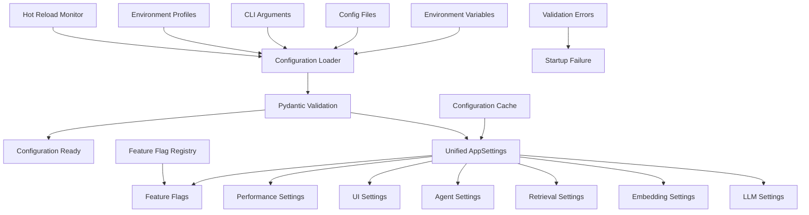

# ADR-024-NEW: Unified Configuration & Settings Management

## Title

Centralized Type-Safe Configuration with Environment Management and Feature Flags

## Version/Date

1.0 / 2025-08-18

## Status

Accepted

## Description

Implements a unified configuration and settings management system that consolidates all configuration scattered across the architecture into a single, type-safe, hierarchical system. The solution uses Pydantic BaseSettings with python-decouple for environment management, includes a comprehensive feature flag system for experimental capabilities, and provides configuration validation, hot reloading, and environment separation.

## Context

DocMind AI's architecture has grown complex with configuration scattered across multiple ADRs and components:

1. **Configuration Fragmentation**: Settings spread across LLM configs, embedding models, retrieval parameters, agent settings, UI preferences, performance tuning, and persistence
2. **Type Safety Needs**: Configuration errors should be caught at startup, not runtime
3. **Environment Management**: Need clean separation between development, testing, and production
4. **Feature Flags**: Experimental features need controlled rollout mechanisms
5. **Hot Reloading**: Development requires configuration changes without restarts
6. **Validation**: Invalid configurations should be detected early with clear error messages

The solution centralizes all configuration while maintaining the flexibility needed for different deployment scenarios.

## Related Requirements

### Functional Requirements

- **FR-1:** Centralize all configuration from existing ADRs into unified system
- **FR-2:** Provide type-safe configuration validation at startup
- **FR-3:** Support environment-specific configuration overrides
- **FR-4:** Enable feature flags for experimental capabilities
- **FR-5:** Allow hot reloading of configuration during development
- **FR-6:** Provide configuration export and import for deployment

### Non-Functional Requirements

- **NFR-1:** **(Performance)** Configuration loading <100ms at startup
- **NFR-2:** **(Type Safety)** All configuration errors caught before runtime
- **NFR-3:** **(Environment Isolation)** Clean separation between dev/test/prod settings
- **NFR-4:** **(Security)** Sensitive values encrypted and never logged in plain text

## Alternatives

### 1. Scattered Configuration Files

- **Description**: Keep configuration spread across individual modules
- **Issues**: Hard to maintain, inconsistent validation, no central control
- **Score**: 3/10 (simplicity: 6, maintainability: 2, consistency: 1)

### 2. Simple ConfigParser/TOML

- **Description**: Basic configuration files without type safety
- **Issues**: No validation, type errors at runtime, limited structure
- **Score**: 5/10 (simplicity: 8, type-safety: 2, validation: 4)

### 3. Environment Variables Only

- **Description**: Configure everything through environment variables
- **Issues**: Poor structure, type conversion issues, hard to manage complex settings
- **Score**: 4/10 (deployment: 8, structure: 2, maintainability: 3)

### 4. Pydantic BaseSettings + Decouple (Selected)

- **Description**: Type-safe hierarchical configuration with environment management
- **Benefits**: Type safety, validation, environment separation, feature flags
- **Score**: 9/10 (type-safety: 10, maintainability: 9, flexibility: 8)

## Decision

We will implement **Unified Configuration Management** with:

1. **Pydantic BaseSettings**: Type-safe configuration models with validation
2. **Python-Decouple**: Environment variable management and type conversion
3. **Hierarchical Structure**: Organized configuration sections for different components
4. **Feature Flag System**: Controlled rollout of experimental features
5. **Environment Profiles**: Development, testing, and production configurations
6. **Configuration Validation**: Startup validation with clear error messages

## Related Decisions

This ADR **centralizes configuration from ALL existing ADRs**:

- **ADR-001-NEW** (Modern Agentic RAG): Agent system configuration and orchestration settings
- **ADR-002-NEW** (Unified Embedding Strategy): Embedding model configurations and parameters
- **ADR-003-NEW** (Adaptive Retrieval Pipeline): Retrieval algorithm settings and thresholds
- **ADR-004-NEW** (Local-First LLM Strategy): LLM model selection and inference parameters
- **ADR-006-NEW** (Reranking Architecture): Reranking model settings and optimization parameters
- **ADR-007-NEW** (Hybrid Persistence Strategy): Database and caching configuration
- **ADR-009-NEW** (Document Processing Pipeline): Document parsing and processing settings
- **ADR-010-NEW** (Performance Optimization Strategy): Performance tuning and resource limits
- **ADR-011-NEW** (Agent Orchestration Framework): Multi-agent coordination settings
- **ADR-013-NEW** (User Interface Architecture): UI framework and display preferences
- **ADR-016-NEW** (UI State Management): State persistence and caching settings
- **ADR-018-NEW** (DSPy Prompt Optimization): DSPy optimization configuration
- **ADR-019-NEW** (Optional GraphRAG): GraphRAG feature flags and parameters
- **ADR-020-NEW** (Prompt Template System): Template configuration and caching
- **ADR-021-NEW** (Chat Memory): Conversation memory limits and persistence
- **ADR-022-NEW** (Export System): Export format preferences and output settings
- **ADR-023-NEW** (Analysis Mode Strategy): Document analysis mode configurations

## Design

### Configuration Architecture



### Core Configuration Implementation

```python
from typing import Dict, List, Optional, Any, Union, Literal
from pydantic import BaseSettings, Field, validator, root_validator
from pydantic.env_settings import SettingsSourceCallable
from pathlib import Path
from enum import Enum
import os
from decouple import config, Csv
import json
from datetime import timedelta
import logging

class Environment(str, Enum):
    """Environment types."""
    DEVELOPMENT = "development"
    TESTING = "testing"
    PRODUCTION = "production"

class LogLevel(str, Enum):
    """Logging levels."""
    DEBUG = "DEBUG"
    INFO = "INFO"
    WARNING = "WARNING"
    ERROR = "ERROR"
    CRITICAL = "CRITICAL"

# LLM Configuration (from ADR-004-NEW)
class LLMSettings(BaseSettings):
    """Local-first LLM configuration."""
    
    # Model Selection
    default_model: str = Field(
        default="qwen3:14b",
        description="Default LLM model name"
    )
    backup_models: List[str] = Field(
        default=["llama3.2", "qwen2:7b"],
        description="Fallback models if default fails"
    )
    
    # Ollama Configuration
    ollama_base_url: str = Field(
        default="http://localhost:11434",
        description="Ollama server URL"
    )
    ollama_timeout: int = Field(
        default=120,
        description="Ollama request timeout in seconds"
    )
    
    # Context and Performance
    context_window: int = Field(
        default=32768,
        description="Context window size (native 32K for Qwen3)"
    )
    max_tokens: int = Field(
        default=4096,
        description="Maximum tokens to generate"
    )
    temperature: float = Field(
        default=0.7,
        ge=0.0,
        le=2.0,
        description="Model temperature"
    )
    
    # Hardware Optimization
    gpu_acceleration: bool = Field(
        default=True,
        description="Enable GPU acceleration if available"
    )
    enable_mmap: bool = Field(
        default=True,
        description="Enable memory mapping for models"
    )
    num_threads: int = Field(
        default=8,
        ge=1,
        le=32,
        description="Number of CPU threads for inference"
    )
    
    class Config:
        env_prefix = "LLM_"

# Embedding Configuration (from ADR-002-NEW)
class EmbeddingSettings(BaseSettings):
    """Unified embedding strategy configuration."""
    
    # Dense Embeddings
    dense_model: str = Field(
        default="BAAI/bge-large-en-v1.5",
        description="Dense embedding model"
    )
    dense_dimensions: int = Field(
        default=1024,
        description="Dense embedding dimensions"
    )
    
    # Sparse Embeddings
    sparse_model: str = Field(
        default="naver/splade-cocondenser-ensembledistil",
        description="Sparse embedding model"
    )
    enable_sparse: bool = Field(
        default=True,
        description="Enable sparse embeddings"
    )
    
    # Multimodal Embeddings
    multimodal_model: str = Field(
        default="jinaai/jina-embeddings-v3",
        description="Multimodal embedding model"
    )
    multimodal_dimensions: int = Field(
        default=1024,
        description="Multimodal embedding dimensions"
    )
    enable_multimodal: bool = Field(
        default=True,
        description="Enable multimodal embeddings"
    )
    
    # Performance
    batch_size: int = Field(
        default=32,
        ge=1,
        le=256,
        description="Embedding batch size"
    )
    enable_quantization: bool = Field(
        default=True,
        description="Enable int8 quantization"
    )
    
    class Config:
        env_prefix = "EMBEDDING_"

# Retrieval Configuration (from ADR-003-NEW)
class RetrievalSettings(BaseSettings):
    """Adaptive retrieval pipeline configuration."""
    
    # Basic Retrieval
    similarity_top_k: int = Field(
        default=10,
        ge=1,
        le=50,
        description="Number of documents to retrieve"
    )
    similarity_cutoff: float = Field(
        default=0.7,
        ge=0.0,
        le=1.0,
        description="Similarity threshold for retrieval"
    )
    
    # Hybrid Search (RRF)
    enable_hybrid: bool = Field(
        default=True,
        description="Enable hybrid dense+sparse retrieval"
    )
    rrf_alpha: float = Field(
        default=0.7,
        ge=0.0,
        le=1.0,
        description="RRF fusion weight (0.0=sparse only, 1.0=dense only)"
    )
    
    # Reranking
    enable_reranking: bool = Field(
        default=True,
        description="Enable ColBERT reranking"
    )
    rerank_top_k: int = Field(
        default=20,
        ge=5,
        le=100,
        description="Documents to rerank before final selection"
    )
    
    # Advanced Features
    enable_query_expansion: bool = Field(
        default=False,
        description="Enable automatic query expansion"
    )
    enable_mmr: bool = Field(
        default=False,
        description="Enable Maximal Marginal Relevance"
    )
    mmr_diversity_bias: float = Field(
        default=0.5,
        ge=0.0,
        le=1.0,
        description="MMR diversity vs relevance balance"
    )
    
    class Config:
        env_prefix = "RETRIEVAL_"

# Agent Configuration (from ADR-001-NEW, ADR-011-NEW)
class AgentSettings(BaseSettings):
    """Multi-agent orchestration configuration."""
    
    # Agent System
    enable_agents: bool = Field(
        default=True,
        description="Enable multi-agent processing"
    )
    agent_timeout: int = Field(
        default=60,
        ge=10,
        le=300,
        description="Agent operation timeout in seconds"
    )
    max_agent_retries: int = Field(
        default=3,
        ge=0,
        le=10,
        description="Maximum agent retry attempts"
    )
    
    # Supervisor Configuration
    supervisor_model: str = Field(
        default="qwen3:14b",
        description="Model for supervisor agent"
    )
    enable_human_in_loop: bool = Field(
        default=False,
        description="Enable human-in-the-loop workflow"
    )
    
    # Agent Roles
    enable_query_router: bool = Field(default=True)
    enable_query_planner: bool = Field(default=True)
    enable_retrieval_expert: bool = Field(default=True)
    enable_result_synthesizer: bool = Field(default=True)
    enable_response_validator: bool = Field(default=True)
    
    # Performance
    parallel_agents: bool = Field(
        default=False,
        description="Enable parallel agent execution where possible"
    )
    agent_memory_limit: int = Field(
        default=1000,
        ge=100,
        le=10000,
        description="Agent memory limit in MB"
    )
    
    class Config:
        env_prefix = "AGENT_"

# Document Processing Configuration (from ADR-009-NEW)
class DocumentSettings(BaseSettings):
    """Document processing pipeline configuration."""
    
    # Parsing
    enable_unstructured: bool = Field(
        default=True,
        description="Enable Unstructured.io parsing"
    )
    unstructured_strategy: str = Field(
        default="hi_res",
        description="Unstructured parsing strategy"
    )
    enable_ocr: bool = Field(
        default=True,
        description="Enable OCR for image text extraction"
    )
    
    # Chunking
    chunk_size: int = Field(
        default=1024,
        ge=256,
        le=4096,
        description="Text chunk size in tokens"
    )
    chunk_overlap: int = Field(
        default=200,
        ge=0,
        le=1024,
        description="Chunk overlap in tokens"
    )
    enable_semantic_chunking: bool = Field(
        default=False,
        description="Enable semantic-aware chunking"
    )
    
    # Supported Formats
    supported_extensions: List[str] = Field(
        default=[".pdf", ".docx", ".txt", ".md", ".json", ".xml", ".rtf", ".csv", ".msg", ".pptx", ".odt", ".epub"],
        description="Supported file extensions"
    )
    max_file_size_mb: int = Field(
        default=100,
        ge=1,
        le=1000,
        description="Maximum file size in MB"
    )
    
    class Config:
        env_prefix = "DOCUMENT_"

# Performance Configuration (from ADR-010-NEW)
class PerformanceSettings(BaseSettings):
    """Performance optimization configuration."""
    
    # Caching
    enable_cache: bool = Field(
        default=True,
        description="Enable document processing cache"
    )
    cache_dir: Path = Field(
        default=Path("cache"),
        description="Cache directory path"
    )
    cache_size_limit: int = Field(
        default=1000,
        ge=100,
        le=10000,
        description="Cache size limit in MB"
    )
    cache_ttl_hours: int = Field(
        default=24,
        ge=1,
        le=168,
        description="Cache TTL in hours"
    )
    
    # Memory Management
    max_memory_usage: int = Field(
        default=8192,
        ge=1024,
        le=32768,
        description="Maximum memory usage in MB"
    )
    enable_memory_monitoring: bool = Field(
        default=True,
        description="Enable memory usage monitoring"
    )
    
    # Concurrency
    max_workers: int = Field(
        default=4,
        ge=1,
        le=16,
        description="Maximum worker threads"
    )
    async_timeout: int = Field(
        default=300,
        ge=30,
        le=1800,
        description="Async operation timeout in seconds"
    )
    
    class Config:
        env_prefix = "PERFORMANCE_"

# Database Configuration (from ADR-007-NEW)
class DatabaseSettings(BaseSettings):
    """Hybrid persistence configuration."""
    
    # SQLite Configuration
    database_url: str = Field(
        default="sqlite:///data/docmind.db",
        description="Database connection URL"
    )
    enable_wal_mode: bool = Field(
        default=True,
        description="Enable SQLite WAL mode"
    )
    connection_pool_size: int = Field(
        default=5,
        ge=1,
        le=20,
        description="Database connection pool size"
    )
    
    # Vector Database
    vector_db_url: str = Field(
        default="http://localhost:6333",
        description="Qdrant vector database URL"
    )
    vector_collection_name: str = Field(
        default="documents",
        description="Vector collection name"
    )
    enable_vector_persistence: bool = Field(
        default=True,
        description="Enable vector database persistence"
    )
    
    # Backup and Recovery
    backup_enabled: bool = Field(
        default=True,
        description="Enable automatic database backups"
    )
    backup_interval_hours: int = Field(
        default=6,
        ge=1,
        le=48,
        description="Backup interval in hours"
    )
    
    class Config:
        env_prefix = "DATABASE_"

# UI Configuration (from ADR-013-NEW, ADR-016-NEW)
class UISettings(BaseSettings):
    """User interface configuration."""
    
    # Streamlit Configuration
    streamlit_port: int = Field(
        default=8501,
        ge=1024,
        le=65535,
        description="Streamlit port"
    )
    streamlit_host: str = Field(
        default="localhost",
        description="Streamlit host"
    )
    enable_wide_mode: bool = Field(
        default=True,
        description="Enable Streamlit wide mode"
    )
    
    # Theme and Display
    theme: str = Field(
        default="light",
        description="UI theme (light/dark)"
    )
    show_advanced_options: bool = Field(
        default=False,
        description="Show advanced configuration options"
    )
    enable_file_preview: bool = Field(
        default=True,
        description="Enable file content preview"
    )
    
    # State Management
    session_timeout_minutes: int = Field(
        default=60,
        ge=5,
        le=480,
        description="Session timeout in minutes"
    )
    auto_save_interval: int = Field(
        default=30,
        ge=10,
        le=300,
        description="Auto-save interval in seconds"
    )
    
    class Config:
        env_prefix = "UI_"

# Feature Flags
class FeatureFlags(BaseSettings):
    """Experimental feature flags."""
    
    # Core Features
    enable_dspy_optimization: bool = Field(
        default=False,
        description="Enable DSPy prompt optimization (ADR-018)"
    )
    enable_graphrag: bool = Field(
        default=False,
        description="Enable GraphRAG functionality (ADR-019)"
    )
    enable_multimodal: bool = Field(
        default=True,
        description="Enable multimodal document processing"
    )
    
    # Agent Features
    enable_agent_introspection: bool = Field(
        default=False,
        description="Enable agent decision logging and introspection"
    )
    enable_agent_optimization: bool = Field(
        default=False,
        description="Enable automatic agent performance optimization"
    )
    
    # Performance Features
    enable_streaming_responses: bool = Field(
        default=False,
        description="Enable streaming LLM responses"
    )
    enable_parallel_processing: bool = Field(
        default=True,
        description="Enable parallel document processing"
    )
    
    # Experimental Features
    enable_auto_summarization: bool = Field(
        default=False,
        description="Enable automatic document summarization"
    )
    enable_smart_routing: bool = Field(
        default=False,
        description="Enable AI-powered query routing"
    )
    enable_conversation_clustering: bool = Field(
        default=False,
        description="Enable conversation topic clustering"
    )
    
    class Config:
        env_prefix = "FEATURE_"

# Security Configuration
class SecuritySettings(BaseSettings):
    """Security configuration."""
    
    # Authentication
    enable_auth: bool = Field(
        default=False,
        description="Enable user authentication"
    )
    secret_key: str = Field(
        default="your-secret-key-change-this",
        description="Application secret key"
    )
    
    # Data Protection
    encrypt_sensitive_data: bool = Field(
        default=True,
        description="Encrypt sensitive configuration values"
    )
    log_level: LogLevel = Field(
        default=LogLevel.INFO,
        description="Logging level"
    )
    
    # API Security
    rate_limit_per_minute: int = Field(
        default=60,
        ge=1,
        le=1000,
        description="API rate limit per minute"
    )
    enable_cors: bool = Field(
        default=False,
        description="Enable CORS for API endpoints"
    )
    
    class Config:
        env_prefix = "SECURITY_"

# Main Application Settings
class AppSettings(BaseSettings):
    """Unified application configuration."""
    
    # Environment
    environment: Environment = Field(
        default=Environment.DEVELOPMENT,
        description="Application environment"
    )
    debug: bool = Field(
        default=False,
        description="Enable debug mode"
    )
    
    # Component Settings
    llm: LLMSettings = Field(default_factory=LLMSettings)
    embedding: EmbeddingSettings = Field(default_factory=EmbeddingSettings)
    retrieval: RetrievalSettings = Field(default_factory=RetrievalSettings)
    agents: AgentSettings = Field(default_factory=AgentSettings)
    documents: DocumentSettings = Field(default_factory=DocumentSettings)
    performance: PerformanceSettings = Field(default_factory=PerformanceSettings)
    database: DatabaseSettings = Field(default_factory=DatabaseSettings)
    ui: UISettings = Field(default_factory=UISettings)
    features: FeatureFlags = Field(default_factory=FeatureFlags)
    security: SecuritySettings = Field(default_factory=SecuritySettings)
    
    # Application Metadata
    app_name: str = Field(default="DocMind AI")
    app_version: str = Field(default="1.0.0")
    data_dir: Path = Field(
        default=Path("data"),
        description="Application data directory"
    )
    logs_dir: Path = Field(
        default=Path("logs"),
        description="Application logs directory"
    )
    
    class Config:
        env_file = ".env"
        env_file_encoding = "utf-8"
        case_sensitive = False
        validate_assignment = True
        
        @classmethod
        def customise_sources(
            cls,
            init_settings: SettingsSourceCallable,
            env_settings: SettingsSourceCallable,
            file_secret_settings: SettingsSourceCallable,
        ) -> tuple[SettingsSourceCallable, ...]:
            """Customize configuration source priority."""
            return (
                init_settings,  # Arguments passed to constructor
                env_settings,   # Environment variables
                file_secret_settings,  # Secret files
            )
    
    @root_validator
    def validate_configuration(cls, values):
        """Validate configuration consistency."""
        
        # Check GPU settings consistency
        if values.get("llm", {}).get("gpu_acceleration") and not values.get("embedding", {}).get("enable_quantization"):
            logging.warning("GPU acceleration enabled but embedding quantization disabled - may cause memory issues")
        
        # Check agent and feature flag consistency
        agents = values.get("agents", {})
        features = values.get("features", {})
        
        if agents.get("enable_agents") and not any([
            agents.get("enable_query_router"),
            agents.get("enable_retrieval_expert"),
            agents.get("enable_response_validator")
        ]):
            raise ValueError("Agent system enabled but no agents are configured")
        
        # Validate directory paths
        for path_field in ["data_dir", "logs_dir"]:
            if path_field in values:
                path = values[path_field]
                if isinstance(path, str):
                    path = Path(path)
                path.mkdir(parents=True, exist_ok=True)
                values[path_field] = path
        
        return values
    
    def get_feature_flags(self) -> Dict[str, bool]:
        """Get all feature flags as dictionary."""
        return self.features.dict()
    
    def is_feature_enabled(self, feature_name: str) -> bool:
        """Check if specific feature is enabled."""
        return getattr(self.features, feature_name, False)
    
    def export_config(self, include_secrets: bool = False) -> Dict[str, Any]:
        """Export configuration for deployment."""
        config_dict = self.dict()
        
        if not include_secrets:
            # Remove sensitive fields
            if "security" in config_dict and "secret_key" in config_dict["security"]:
                config_dict["security"]["secret_key"] = "***REDACTED***"
        
        return config_dict
    
    def to_env_file(self, file_path: Path = None) -> str:
        """Generate .env file content from current configuration."""
        if file_path is None:
            file_path = Path(".env.generated")
        
        env_lines = [
            "# Generated DocMind AI Configuration",
            f"# Environment: {self.environment}",
            f"# Generated at: {datetime.utcnow().isoformat()}",
            "",
        ]
        
        # Convert nested settings to environment variables
        def flatten_dict(d: dict, prefix: str = "") -> List[str]:
            lines = []
            for key, value in d.items():
                env_key = f"{prefix}{key.upper()}"
                if isinstance(value, dict):
                    lines.extend(flatten_dict(value, f"{env_key}_"))
                elif isinstance(value, list):
                    lines.append(f"{env_key}={','.join(map(str, value))}")
                elif isinstance(value, bool):
                    lines.append(f"{env_key}={'true' if value else 'false'}")
                else:
                    lines.append(f"{env_key}={value}")
            return lines
        
        config_dict = self.dict()
        for section, settings in config_dict.items():
            if isinstance(settings, dict):
                env_lines.append(f"# {section.title()} Settings")
                env_lines.extend(flatten_dict(settings, f"{section.upper()}_"))
                env_lines.append("")
        
        env_content = "\n".join(env_lines)
        
        if file_path:
            with open(file_path, 'w') as f:
                f.write(env_content)
        
        return env_content

# Configuration Manager
class ConfigurationManager:
    """Manages configuration loading, validation, and hot reloading."""
    
    def __init__(self, config_path: Optional[Path] = None):
        self.config_path = config_path or Path(".env")
        self._settings: Optional[AppSettings] = None
        self._file_watcher = None
        
    def load_settings(self, reload: bool = False) -> AppSettings:
        """Load and validate application settings."""
        if self._settings is None or reload:
            try:
                self._settings = AppSettings()
                self._validate_critical_settings()
                logging.info(f"Configuration loaded successfully (Environment: {self._settings.environment})")
            except Exception as e:
                logging.error(f"Configuration validation failed: {e}")
                raise
        
        return self._settings
    
    def _validate_critical_settings(self):
        """Validate critical settings that could prevent startup."""
        settings = self._settings
        
        # Check required models
        if not settings.llm.default_model:
            raise ValueError("LLM default_model must be specified")
        
        if not settings.embedding.dense_model:
            raise ValueError("Dense embedding model must be specified")
        
        # Check directory permissions
        for directory in [settings.data_dir, settings.logs_dir, settings.performance.cache_dir]:
            if not directory.exists():
                try:
                    directory.mkdir(parents=True, exist_ok=True)
                except PermissionError:
                    raise ValueError(f"Cannot create directory: {directory}")
        
        # Validate network endpoints
        import socket
        from urllib.parse import urlparse
        
        for url_field, url_value in [
            ("ollama_base_url", settings.llm.ollama_base_url),
            ("vector_db_url", settings.database.vector_db_url)
        ]:
            parsed = urlparse(url_value)
            if parsed.hostname and parsed.port:
                try:
                    sock = socket.socket(socket.AF_INET, socket.SOCK_STREAM)
                    sock.settimeout(1)
                    result = sock.connect_ex((parsed.hostname, parsed.port))
                    sock.close()
                    if result != 0:
                        logging.warning(f"Cannot connect to {url_field}: {url_value}")
                except Exception as e:
                    logging.warning(f"Network check failed for {url_field}: {e}")
    
    def enable_hot_reload(self, callback=None):
        """Enable hot reloading of configuration file."""
        try:
            from watchdog.observers import Observer
            from watchdog.events import FileSystemEventHandler
            
            class ConfigHandler(FileSystemEventHandler):
                def __init__(self, manager):
                    self.manager = manager
                    self.callback = callback
                
                def on_modified(self, event):
                    if event.src_path == str(self.manager.config_path):
                        logging.info("Configuration file changed, reloading...")
                        try:
                            self.manager.load_settings(reload=True)
                            if self.callback:
                                self.callback(self.manager._settings)
                        except Exception as e:
                            logging.error(f"Hot reload failed: {e}")
            
            self._file_watcher = Observer()
            self._file_watcher.schedule(
                ConfigHandler(self),
                str(self.config_path.parent),
                recursive=False
            )
            self._file_watcher.start()
            logging.info("Hot reload enabled for configuration")
            
        except ImportError:
            logging.warning("Watchdog not available, hot reload disabled")
    
    def stop_hot_reload(self):
        """Stop hot reloading."""
        if self._file_watcher:
            self._file_watcher.stop()
            self._file_watcher.join()
            self._file_watcher = None

# Global configuration instance
_config_manager = ConfigurationManager()

def get_settings(reload: bool = False) -> AppSettings:
    """Get application settings (singleton pattern)."""
    return _config_manager.load_settings(reload=reload)

def reload_settings() -> AppSettings:
    """Reload configuration from file."""
    return get_settings(reload=True)

def enable_config_hot_reload(callback=None):
    """Enable configuration hot reloading."""
    _config_manager.enable_hot_reload(callback)

# Environment-specific configuration profiles
def get_development_config() -> AppSettings:
    """Get development configuration."""
    os.environ.update({
        "ENVIRONMENT": "development",
        "DEBUG": "true",
        "LLM_CONTEXT_WINDOW": "16384",  # Smaller for dev
        "PERFORMANCE_MAX_WORKERS": "2",
        "FEATURE_ENABLE_DSPY_OPTIMIZATION": "true",
        "UI_SHOW_ADVANCED_OPTIONS": "true"
    })
    return AppSettings()

def get_production_config() -> AppSettings:
    """Get production configuration."""
    os.environ.update({
        "ENVIRONMENT": "production",
        "DEBUG": "false",
        "LLM_CONTEXT_WINDOW": "32768",  # Full context for prod
        "PERFORMANCE_MAX_WORKERS": "8",
        "SECURITY_ENABLE_AUTH": "true",
        "UI_SHOW_ADVANCED_OPTIONS": "false"
    })
    return AppSettings()

def get_testing_config() -> AppSettings:
    """Get testing configuration."""
    os.environ.update({
        "ENVIRONMENT": "testing",
        "DEBUG": "true",
        "LLM_DEFAULT_MODEL": "qwen2:7b",  # Smaller model for tests
        "PERFORMANCE_CACHE_SIZE_LIMIT": "100",  # Smaller cache
        "AGENT_AGENT_TIMEOUT": "30",  # Faster timeouts
        "DATABASE_DATABASE_URL": "sqlite:///test.db"
    })
    return AppSettings()
```

### Integration Example

```python
# main.py - Application entry point
import logging
from src.config import get_settings, enable_config_hot_reload

def main():
    """Main application entry point."""
    
    # Load and validate configuration
    try:
        settings = get_settings()
    except Exception as e:
        logging.error(f"Failed to load configuration: {e}")
        return 1
    
    # Configure logging
    logging.basicConfig(
        level=getattr(logging, settings.security.log_level),
        format='%(asctime)s - %(name)s - %(levelname)s - %(message)s'
    )
    
    # Enable hot reload in development
    if settings.environment == "development":
        enable_config_hot_reload(on_config_change)
    
    # Initialize application components with settings
    app = create_application(settings)
    
    # Start application
    app.run()

def on_config_change(new_settings):
    """Handle configuration changes."""
    logging.info("Configuration reloaded, updating application...")
    # Update application components as needed

def create_application(settings: AppSettings):
    """Create application with configuration."""
    
    # Example usage of configuration
    if settings.is_feature_enabled("enable_dspy_optimization"):
        from src.dspy_optimization import initialize_dspy
        initialize_dspy(settings.llm)
    
    if settings.agents.enable_agents:
        from src.agents import create_agent_system
        agent_system = create_agent_system(settings.agents)
    
    # Configure components based on settings
    # ... rest of application initialization
```

## Consequences

### Positive Outcomes

- **Centralized Management**: All configuration consolidated into single, manageable system
- **Type Safety**: Configuration errors caught at startup before runtime issues
- **Environment Separation**: Clean separation between development, testing, and production
- **Feature Control**: Experimental features can be toggled safely with feature flags
- **Hot Reloading**: Development productivity improved with configuration changes without restarts
- **Validation**: Invalid configurations prevented with clear error messages
- **Export/Import**: Easy deployment and configuration management

### Negative Consequences / Trade-offs

- **Initial Complexity**: Large configuration structure may seem overwhelming initially
- **Migration Effort**: Existing scattered configuration needs to be consolidated
- **Dependency Addition**: python-decouple and watchdog dependencies added
- **Memory Usage**: Comprehensive configuration object consumes more memory

### Migration Strategy

1. **Gradual Consolidation**: Move configuration from individual modules incrementally
2. **Backward Compatibility**: Maintain existing configuration methods during transition
3. **Validation Testing**: Thoroughly test configuration validation across environments
4. **Documentation**: Comprehensive configuration documentation and examples
5. **Environment Profiles**: Pre-configured profiles for common deployment scenarios

## Performance Targets

- **Configuration Loading**: <100ms at application startup
- **Hot Reload Time**: <200ms for configuration file changes
- **Validation Time**: <50ms for full configuration validation
- **Memory Usage**: <10MB for complete configuration object

## Dependencies

- **Python**: `pydantic>=2.0.0` for settings management
- **Environment**: `python-decouple>=3.6` for environment variable handling
- **Hot Reload**: `watchdog>=2.1.0` for file monitoring (optional)
- **Type Safety**: Built-in Python typing for validation

## Monitoring Metrics

- Configuration load time and success rate
- Hot reload frequency and performance
- Configuration validation error patterns
- Feature flag usage statistics
- Environment-specific configuration differences

## Future Enhancements

- Configuration versioning and rollback
- Remote configuration management
- Configuration change audit logging
- Dynamic feature flag updates
- Configuration templates and presets
- Integration with secret management systems

## Changelog

- **1.0 (2025-08-18)**: Initial unified configuration system consolidating settings from all ADRs with type-safe validation, environment management, and feature flags