# ADR-003: GPU Optimization

## Title

GPU Optimization and Hardware Detection

## Version/Date

4.0 / 2025-01-16

## Status

Accepted

## Description

Standardizes the system's GPU management strategy on the native `device_map="auto"` pattern provided by the underlying libraries (PyTorch, HuggingFace Transformers). This approach simplifies the architecture by eliminating over 180 lines of custom GPU monitoring code and enables the system to achieve its target performance of ~1000 tokens/second on supported hardware.

## Context

High-performance document analysis requires leveraging available GPU hardware for compute-intensive tasks like LLM inference and embedding generation. An initial architectural approach involved a complex, custom-built `GPUManager` class to detect hardware and manually configure memory and layer offloading. This was found to be brittle, hard to maintain, and redundant, as modern libraries provide robust, automatic device management. The goal is to achieve optimal GPU utilization with minimal configuration and code complexity.

## Related Requirements

### Non-Functional Requirements

- **NFR-1:** **(Maintainability)** The solution must reduce code complexity by at least 90% compared to the custom management approach.
- **NFR-2:** **(Usability)** The system must automatically detect and use available GPU hardware without requiring manual user configuration.
- **NFR-3:** **(Flexibility)** The system must gracefully fall back to CPU-only operation if no compatible GPU is detected.

### Performance Requirements

- **PR-1:** The system must achieve ~1000 tokens/second for LLM inference on target hardware (e.g., RTX 4090).
- **PR-2:** The solution must efficiently utilize GPU VRAM, enabling large models to run on consumer hardware.

### Integration Requirements

- **IR-1:** The GPU management strategy must be compatible with all supported LLM backends (Ollama, LlamaCPP, vLLM).
- **IR-2:** The strategy must integrate with PyTorch-level optimizations like quantization and mixed precision.

## Alternatives

### 1. Custom GPU Management Class

- **Description**: A 180+ line Python class to parse `nvidia-smi` output, estimate VRAM, and manually set parameters like `n_gpu_layers`.
- **Issues**: Brittle (breaks with driver updates), complex, and reinvents functionality already provided by the core libraries.
- **Status**: Rejected.

### 2. TensorRT-LLM

- **Description**: A highly optimized inference library from NVIDIA.
- **Issues**: Adds significant build complexity and is less flexible for the rapid model switching required by the project. Overkill for the current scope.
- **Status**: Rejected.

## Decision

We will adopt the **`device_map="auto"`** pattern as the sole mechanism for GPU device management. This parameter, supported by the underlying HuggingFace Transformers and PyTorch libraries, automatically handles device detection, layer offloading, and memory balancing. This decision eliminates all custom GPU management code and is the simplest, most robust path to achieving high-performance inference.

## Related Decisions

- **ADR-021** (LlamaIndex Native Architecture Consolidation): This simplified GPU strategy is a key enabler of the clean, native architecture.
- **ADR-019** (Multi-Backend LLM Strategy): The `device_map="auto"` pattern is applied consistently across the configurations for all supported backends.
- **ADR-023** (PyTorch Optimization Strategy): This strategy is a prerequisite. Optimizations like int4 quantization are what make it feasible to automatically fit large models onto consumer GPUs.
- **ADR-017** (Default Model Strategy): The hardware-adaptive model selection relies on this automatic placement to function correctly.

## Design

### Architecture Overview

The design removes the custom management layer entirely. The application's setup process simply passes the `device_map="auto"` parameter during the initialization of GPU-accelerated components (LLMs, embeddings, rerankers).

```mermaid
graph TD
    subgraph "Before: Custom Management"
        A["Application"] --> B["Custom GPUManager Class"];
        B -- Parses nvidia-smi --> C["Detect VRAM"];
        C --> D["Calculate n_gpu_layers"];
        D --> E["Manually Configure Model"];
    end

    subgraph "After: Native Pattern"
        F["Application"] -- Sets device_map='auto' --> G["Library (PyTorch/HF)"];
        G -- Automatically --> H["Detect Hardware"];
        H -- Automatically --> I["Balance Layers on GPU/CPU"];
        I -- Automatically --> J["Instantiate Optimized Model"];
    end
```



### Implementation Details

#### **The 90% Code Reduction: Before vs. After**

**In `gpu_manager.py` (BEFORE - Now Deleted):**

```python
# BEFORE: 183 lines of brittle, custom GPU monitoring code
class GPUManager:
    def __init__(self):
        # ... extensive custom logic to run subprocesses, parse XML, ...
        # ... calculate memory, and guess at optimal layer counts ...
        pass
```

**In `application_setup.py` (AFTER):**

```python
# AFTER: A single, declarative parameter in the component's configuration.
from llama_index.core import Settings
from llama_index.llms.vllm import vLLM
from llama_index.embeddings.huggingface import HuggingFaceEmbedding

# Example for the vLLM backend
Settings.llm = vLLM(
    model="Qwen/Qwen3-4B-Thinking-2507",
    device_map="auto", # The library handles all GPU logic
    torch_dtype="float16"
)

# Example for the embedding model
Settings.embed_model = HuggingFaceEmbedding(
    model_name="BAAI/bge-large-en-v1.5",
    device_map="auto" # The library handles all GPU logic
)
```

## Consequences

### Positive Outcomes

- **Code Simplification**: Eliminated over 180 lines of complex, custom code, a >90% reduction in GPU management complexity.
- **Improved Robustness**: The native library implementation is more stable and reliable than a custom script.
- **High Performance**: This approach, combined with PyTorch optimizations from `ADR-023`, enables the ~1000 tokens/second performance target.
- **Enhanced Maintainability**: The solution is declarative and easy to understand. There is no custom logic to maintain.

### Negative Consequences / Trade-offs

- **Less Granular Control**: The `auto` setting cedes fine-grained control over layer placement to the library. This is an acceptable trade-off, as the library's heuristics are generally excellent and sufficient for this project.

### Dependencies

- **Python**: `torch`, `transformers`, `accelerate` (as a dependency of transformers for `device_map`).

## Changelog

- **4.0 (2025-01-16)**: Finalized decision to standardize on `device_map="auto"`. Removed all custom management logic and updated performance targets to align with the final architecture.
- **3.0 (2025-01-13)**: Simplified GPU management and integrated PyTorch optimizations.
- **2.0 (2025-07-25)**: Updated with async performance enhancements.
