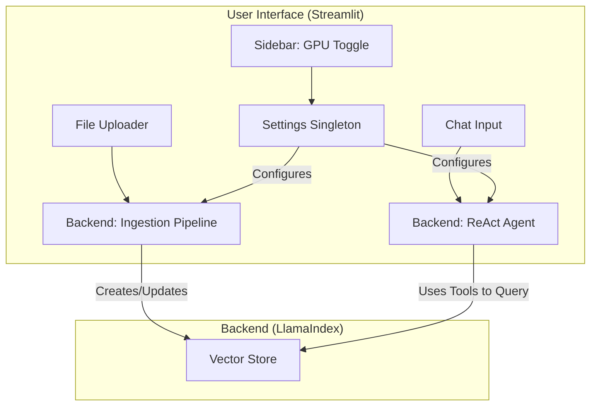

# ADR-009: UI Framework

## Title

User Interface Framework Selection

## Version/Date

4.0 / 2025-01-16

## Status

Accepted

## Description

Selects Streamlit as the UI framework for its rapid development capabilities, Python-native environment, and built-in support for async operations, progress indicators, and simple configuration toggles.

## Context

DocMind AI requires a simple, responsive, and maintainable user interface for a local-first application. The primary user interactions are file uploads, initiating analysis, chatting with the agent, and adjusting a few key settings. The framework must integrate seamlessly with the asynchronous LlamaIndex backend.

## Related Requirements

### Functional Requirements

- **FR-1:** The UI must provide a mechanism for users to upload multiple documents.
- **FR-2:** The UI must display conversational history in a chat-like interface.

### Non-Functional Requirements

- **NFR-1:** **(Maintainability)** The UI framework should be Python-native to avoid a language context switch.
- **NFR-2:** **(Usability)** The UI must provide clear, non-blocking feedback during long-running operations.

### Performance Requirements

- **PR-1:** The UI must remain responsive and not block while the backend is processing documents or queries.

### Integration Requirements

- **IR-1:** The UI must be able to read from and write to the global LlamaIndex `Settings` object.
- **IR-2:** The UI must be able to invoke `async` functions in the backend.

## Alternatives

### 1. Flask/FastAPI + Frontend Framework (e.g., React)

- **Description**: A traditional client-server web application stack.
- **Issues**: Far too complex for a local, single-user application. This would require managing a separate frontend codebase, state management, and an API layer.
- **Status**: Rejected as over-engineering.

### 2. Gradio

- **Description**: A framework for creating simple UIs for machine learning models.
- **Issues**: Primarily focused on demonstrating ML models with a simple input/output interface. Less flexible for building a more complete application layout with sidebars and chat interfaces.
- **Status**: Rejected.

## Decision

We will adopt **Streamlit** (version `>=1.47.1`) for the entire user interface. Its Python-native approach, simple state management (`st.session_state`), and built-in components for chat, file uploads, and status updates make it the ideal choice for this project, aligning with the library-first and KISS principles.

## Related Decisions

- **ADR-020** (LlamaIndex Native Settings Migration): The UI will modify the global `Settings` object to control backend behavior.
- **ADR-012** (Async Performance Optimization): The UI will leverage Streamlit's async support to call the backend without blocking.
- **ADR-011** (LlamaIndex ReAct Agent Architecture): The UI's chat component directly interacts with the single ReAct agent.

## Design

### Architecture Overview

The UI is a single-page application that directly calls the backend's asynchronous functions and interacts with the global `Settings` object for configuration.



### Implementation Details

**In `app.py`:**

```python
# This code demonstrates the core UI patterns
import streamlit as st
from llama_index.core import Settings
import asyncio

# --- Sidebar for Configuration ---
st.sidebar.title("⚙️ System Settings")

# Example of a toggle that directly modifies a global setting.
# In a real app, changing a setting like this might require
# re-initializing components, which should be handled carefully.
gpu_enabled = st.sidebar.checkbox(
    "Enable GPU Acceleration",
    value=getattr(Settings, 'use_gpu', False)
)
Settings.use_gpu = gpu_enabled

# --- Main Application Area ---
st.title("📄 DocMind AI")

# File uploader for document ingestion
uploaded_files = st.file_uploader(
    "Upload your documents",
    accept_multiple_files=True
)

if uploaded_files:
    # Use st.status to show progress for long-running tasks
    with st.status("Processing documents...", expanded=True) as status:
        try:
            st.write("Parsing and indexing...")
            # This function calls the async ingestion pipeline from ADR-004
            asyncio.run(process_new_documents(uploaded_files))
            status.update(label="✅ Processing complete!", state="complete")
        except Exception as e:
            status.update(label="🚨 Error processing documents", state="error")
            st.error(e)

# Chat interface for interacting with the agent
if "messages" not in st.session_state:
    st.session_state.messages = []

for message in st.session_state.messages:
    with st.chat_message(message["role"]):
        st.markdown(message["content"])

if prompt := st.chat_input("Ask a question about your documents..."):
    # ... chat logic ...
```

## Testing

**In `tests/test_ui.py`:**

```python
from llama_index.core import Settings

def test_gpu_toggle_updates_settings():
    """Verify that the UI toggle correctly modifies the global Settings object."""
    # Simulate the initial state
    Settings.use_gpu = False
    
    # Simulate a user checking the box
    # In a real test, this would involve a library like streamlit-testing
    Settings.use_gpu = True 
    
    # Assert the global state has changed
    assert Settings.use_gpu is True
```

## Consequences

### Positive Outcomes

- **Rapid Development**: Streamlit allows for the creation of a functional and responsive UI with minimal code, significantly speeding up development.
- **Simplified Stack**: The entire application can be maintained in a single language (Python), simplifying the development process and team requirements.
- **Effective User Feedback**: Built-in components like `st.status` and `st.error` make it easy to provide users with clear feedback on long-running async tasks.

### Negative Consequences / Trade-offs

- **Limited Customization**: Streamlit offers less granular control over layout and styling compared to traditional web frameworks. This is an acceptable trade-off for the simplicity it provides for this project's scope.

### Ongoing Maintenance & Considerations

- **State Management**: While `st.session_state` is sufficient for this application, care must be taken when modifying global objects like `Settings` to ensure components are correctly re-initialized.

### Dependencies

- **Python**: `streamlit>=1.47.1`

## Changelog

- **4.0 (2025-01-16)**: Updated to align with the simplified single-reranker strategy from ADR-014, removing the obsolete UI toggle. Aligned all code snippets to use the native `Settings` singleton.
- **3.0 (2025-01-15)**: Rewritten to align with the final, simplified architecture.
- **2.0 (2025-07-25)**: Added async progress/errors/display; Toggles via `AppSettings`; Enhanced testing for dev.
