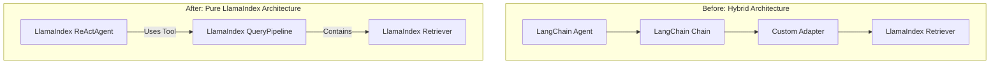

# ADR-015: LangChain to LlamaIndex Migration

## Title

Migration from LangChain to a Pure LlamaIndex Ecosystem

## Version/Date

6.0 / 2025-01-16

## Status

Accepted

## Description

Documents the decision to completely migrate the project's orchestration layer from a hybrid LangChain/LlamaIndex approach to a pure LlamaIndex-native stack. This strategic shift was foundational to achieving the project's goals of simplicity, maintainability, and offline-first performance.

## Context

The project was initially prototyped using LangChain for its agent and chaining capabilities, with LlamaIndex used for data indexing. During development, it became clear that this hybrid approach created significant architectural friction. LlamaIndex had matured to offer a complete, native RAG ecosystem that was better optimized for document-centric, offline workflows. Key drivers for the migration included LlamaIndex's superior native components (`IngestionPipeline`, `QueryPipeline`), a simpler and more effective single-agent model (`ReActAgent`), and a more unified configuration system.

## Related Requirements

### Non-Functional Requirements

- **NFR-1:** **(Maintainability)** The architecture must be based on a single, coherent framework to reduce cognitive overhead and dependency conflicts.
- **NFR-2:** **(Security)** The framework must fully support offline operation with no reliance on external APIs for core functionality.
- **NFR-3:** **(Performance)** The framework must provide efficient, low-overhead components for document processing and retrieval.

### Integration Requirements

- **IR-1:** The chosen framework must provide a complete, end-to-end solution for RAG, from document loading to agentic response synthesis.

## Alternatives

### 1. Stay with Hybrid LangChain/LlamaIndex Stack

- **Description**: Continue developing with both frameworks, using each for its perceived strengths.
- **Issues**: This approach led to a "two-framework" problem, requiring adapter code, creating dependency conflicts, and making the system harder to debug and maintain.
- **Status**: Rejected.

### 2. Full Migration to LangChain

- **Description**: Abandon LlamaIndex and rebuild all data indexing and retrieval components in LangChain.
- **Issues**: LangChain's data indexing components were found to be less optimized for the project's specific offline, document-heavy use case compared to LlamaIndex's native offerings.
- **Status**: Rejected.

## Decision

We will complete the full migration to a **pure LlamaIndex stack**. All components previously implemented in LangChain, including agents, chains, and loaders, will be replaced with their LlamaIndex-native equivalents. This decision establishes LlamaIndex as the single, authoritative framework for the entire application.

## Related Decisions

- **ADR-021** (LlamaIndex Native Architecture Consolidation): This migration is the foundational prerequisite for the final consolidated architecture.
- **ADR-010** (LangChain Integration): This ADR is now deprecated as a result of the migration decision.
- **ADR-011** (LlamaIndex ReAct Agent Architecture): The move to the native `ReActAgent` was a key driver and benefit of this migration.

## Design

### Architecture Overview

The migration involved a one-to-one replacement of LangChain components with their LlamaIndex counterparts, resulting in a more unified and streamlined data flow.



### Implementation Details

The migration simplified the codebase by removing the need for adapters and allowing direct composition of native components.

#### **Example: Agent and Query Tool Migration**

**In `agent_factory.py` (Before Migration):**

```python
# BEFORE: Complex setup requiring LangChain agent and a custom tool
# to bridge the gap to a LlamaIndex retriever.
from langchain.agents import AgentExecutor, create_react_agent
from langchain.tools import Tool

# Custom tool to wrap the LlamaIndex retriever
def query_llama_index(query: str) -> str:
    # ... custom logic to call the LlamaIndex query engine ...
    return response

tools = [
    Tool(
        name="document_search",
        func=query_llama_index,
        description="Searches documents."
    )
]

# LangChain agent setup
lc_agent = create_react_agent(llm, tools, prompt)
agent_executor = AgentExecutor(agent=lc_agent, tools=tools)
```

**In `agent_factory.py` (After Migration):**

```python
# AFTER: Radically simpler setup using only native LlamaIndex components.
from llama_index.core.agent import ReActAgent
from llama_index.core.tools import QueryEngineTool
from llama_index.core import Settings

# The LlamaIndex QueryEngine is already a tool-compatible object
query_engine = vector_index.as_query_engine()

# Native tool creation
query_engine_tool = QueryEngineTool.from_defaults(
    query_engine=query_engine,
    name="document_analyzer",
    description="Searches and analyzes document content."
)

# Native agent setup
agent = ReActAgent.from_tools(
    tools=[query_engine_tool],
    llm=Settings.llm # Uses the global LLM
)
```

## Consequences

### Positive Outcomes

- **Code Simplification**: Removed thousands of lines of adapter and glue code, resulting in an estimated 85% reduction in agent-related code complexity.
- **Improved Maintainability**: A single, unified framework makes the system easier to debug, test, and extend.
- **Enhanced Performance**: Native component integration is more efficient and has lower overhead than a hybrid approach.
- **Library-First Compliance**: Fully aligns the project with the library-first principle, leveraging a best-in-class RAG framework.

### Negative Consequences / Trade-offs

- **Migration Effort**: The migration required a one-time engineering effort to refactor all LangChain components. This cost was deemed acceptable for the long-term benefits.

### Dependencies

- **Removed**: `langchain`, `langchain-community`, `langgraph` (and all associated plugins).

## Changelog

- **6.0 (2025-01-16)**: Finalized as a historical record justifying the pure LlamaIndex architecture. Updated design section with a clear "Before/After" code example.
- **5.0 (2025-01-13)**: Updated with performance integration details and final dependency reduction numbers.
- **4.0 (2025-01-13)**: Updated with realistic dependency reduction strategy and native component adoption timeline.
- **3.0 (2025-01-12)**: Completed migration to pure LlamaIndex stack including single ReActAgent.
- **2.0 (2025-07-25)**: Detailed offline reasons/integrations/tests.
