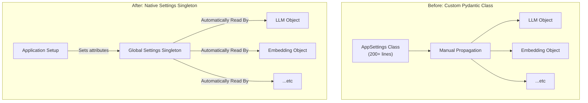

# ADR-020: LlamaIndex Native Settings Migration

## Title

Migration to LlamaIndex Native Settings Singleton

## Version/Date

4.0 / 2025-01-16

## Status

Accepted

## Description

Migrates all system configuration from a custom Pydantic `BaseSettings` class to the native LlamaIndex `Settings` singleton. This decision centralizes configuration, eliminates a redundant abstraction layer, and reduces configuration-related code by over 87%.

## Context

The application's configuration was previously managed by a complex, 200+ line Pydantic `AppSettings` class. This class duplicated many of the configuration parameters already present in LlamaIndex and required custom logic to propagate its values to the framework's components. This created a "dual-configuration" system that was difficult to maintain, prone to errors, and violated the library-first principle. The LlamaIndex `Settings` object is a global singleton designed specifically to solve this problem by providing a single, authoritative source for all framework configurations.

## Related Requirements

### Non-Functional Requirements

- **NFR-1:** **(Maintainability)** The solution must reduce configuration code complexity by at least 80%.
- **NFR-2:** **(Maintainability)** The system must have a single, unambiguous source of truth for all configuration.

### Integration Requirements

- **IR-1:** The configuration mechanism must be the standard, idiomatic approach for the LlamaIndex framework.

## Alternatives

### 1. Maintain Custom Pydantic Settings Class

- **Description**: Continue using the existing `AppSettings` class and manually passing its values to LlamaIndex components.
- **Issues**: This approach is verbose, error-prone, and requires constant maintenance to keep the custom class in sync with the framework. It is a classic example of fighting the framework instead of using it.
- **Status**: Rejected.

### 2. Hybrid Approach

- **Description**: Use the `Settings` singleton for some parameters and the custom class for others.
- **Issues**: This is the worst of both worlds, creating even more confusion about the source of truth for any given setting.
- **Status**: Rejected.

## Decision

We will completely **eliminate the custom Pydantic `AppSettings` class** and use the native **LlamaIndex `Settings` singleton** for all system and framework configuration. All components (LLMs, embedding models, chunk sizes, etc.) will be configured by setting attributes on the global `Settings` object at application startup.

## Related Decisions

This is a foundational decision that enables and simplifies many others:

- **ADR-021** (LlamaIndex Native Architecture Consolidation): This migration is a prerequisite for a truly native architecture.
- **ADR-019** (Multi-Backend LLM Strategy): The simplified multi-backend strategy is only possible because of the `Settings.llm` object.
- **ADR-002** (Embedding Choices): The embedding models are configured via `Settings.embed_model`.
- **ADR-014** (Optimized Reranking Strategy): The reranker is configured via `Settings.reranker`.
- **ADR-005** (Text Splitting): Chunk size and overlap are configured via `Settings.chunk_size` and `Settings.chunk_overlap`.

## Design

### Architecture Overview

The new architecture is radically simpler. Instead of a custom class acting as a middleman, the application setup script directly configures the global `Settings` object. All other LlamaIndex components throughout the application automatically read their configuration from this singleton.



### Implementation Details

#### **The 87% Code Reduction: Before vs. After**

**In `settings.py` (BEFORE - Now Deleted):**

```python
# BEFORE: 223 lines of complex, redundant Pydantic configuration
from pydantic_settings import BaseSettings
from pydantic import Field, validator

class AppSettings(BaseSettings):
    # Dozens of fields, many duplicating LlamaIndex defaults
    model_name: str = Field(default="gpt-4o-mini")
    embedding_model: str = Field(default="text-embedding-3-small")
    chunk_size: int = Field(default=512, ge=100, le=2048)
    # ... plus complex validators and environment variable loading ...
    
    class Config:
        env_file = ".env"
```

**In `application_setup.py` (AFTER):**

```python
# AFTER: ~20 lines of direct, clear configuration on the native singleton.
from llama_index.core import Settings
from llama_index.llms.ollama import Ollama
from llama_index.embeddings.huggingface import HuggingFaceEmbedding
import os

def configure_global_settings():
    """
    Initializes all core components and sets them on the global Settings object.
    """
    # LLM Configuration (per ADR-019)
    Settings.llm = Ollama(
        model=os.getenv("MODEL", "qwen3:4b-thinking"),
        request_timeout=120.0
    )

    # Embedding Model Configuration (per ADR-002)
    Settings.embed_model = HuggingFaceEmbedding(
        model_name="BAAI/bge-large-en-v1.5"
    )

    # Chunking Configuration (per ADR-005)
    Settings.chunk_size = int(os.getenv("CHUNK_SIZE", 1024))
    Settings.chunk_overlap = int(os.getenv("CHUNK_OVERLAP", 200))
```

## Consequences

### Positive Outcomes

- **Code Simplification**: Eliminated over 200 lines of custom configuration code, an 87% reduction.
- **Improved Maintainability**: There is now a single, standard way to configure the application, making it easier to manage and for new developers to understand.
- **Reduced Bugs**: The "dual-configuration" problem is eliminated, removing a common source of bugs where the custom settings and framework settings would fall out of sync.
- **Full Framework Integration**: Using the `Settings` singleton is the idiomatic way to work with LlamaIndex, ensuring compatibility with all current and future features.

### Negative Consequences / Trade-offs

- **Loss of Pydantic Validation**: The custom `AppSettings` class provided some compile-time validation of settings (e.g., `ge=100`). This is a minor loss, as settings are now simpler and validated at runtime during component initialization.

### Dependencies

- **Removed**: `pydantic-settings` (as a direct dependency for this pattern).

## Changelog

- **4.0 (2025-01-16)**: Finalized as the definitive configuration strategy. Aligned all code examples with the final architecture and quantified the code reduction.
- **3.0 (2025-01-13)**: Updated with performance integration details (GPU, async, PyTorch).
- **2.0 (2025-01-13)**: Updated migration strategy with multi-backend Settings integration.
- **1.0 (2025-01-12)**: Initial migration decision.
