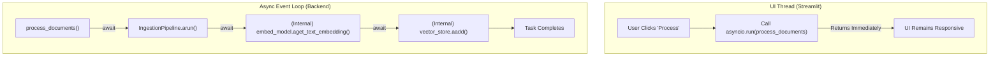

# ADR-012: Async Performance Optimization

## Title

Asynchronous Processing Strategy

## Version/Date

5.0 / 2025-01-16

## Status

Accepted

## Description

Implements an "async-first" processing strategy for all I/O-bound and long-running operations. This is achieved by exclusively using the native asynchronous methods provided by LlamaIndex components (e.g., `arun`, `achat`, `aretrieve`) to ensure a responsive, non-blocking user interface.

## Context

Many core operations in the application, such as document ingestion, embedding generation, and LLM queries, are I/O-bound and can take several seconds to complete. In a synchronous application, these operations would block the main thread, causing the user interface to freeze and become unresponsive. To provide a fluid user experience, it is mandatory that these tasks are executed asynchronously, allowing the UI to remain active while work is being done in the background.

## Related Requirements

### Non-Functional Requirements

- **NFR-1:** **(Usability)** The user interface must remain responsive at all times, even during document ingestion or complex queries.
- **NFR-2:** **(Performance)** The system must leverage asynchronous I/O to maximize throughput for operations like querying a vector database or making LLM calls.

### Integration Requirements

- **IR-1:** The asynchronous strategy must use the native `async/await` patterns provided by the LlamaIndex framework.
- **IR-2:** The chosen UI framework (Streamlit) must be compatible with invoking and managing these asynchronous backend tasks.

## Alternatives

### 1. Synchronous Execution

- **Description**: Run all operations synchronously on the main thread.
- **Issues**: This would result in a completely unusable application, as the UI would freeze for the duration of any significant backend task.
- **Status**: Rejected.

### 2. Custom Threading Model

- **Description**: Use Python's `threading` or `multiprocessing` libraries to manually offload long-running tasks from the main thread.
- **Issues**: This adds significant complexity and state management challenges. It is also less efficient for I/O-bound tasks than a native `asyncio` approach due to the Global Interpreter Lock (GIL). LlamaIndex provides native async support, making a custom solution unnecessary.
- **Status**: Rejected.

## Decision

We will adopt a **native async-first strategy**. All interactions with LlamaIndex components that support asynchronous execution will be performed using their `async` methods (e.g., `QueryPipeline.arun()` instead of `run()`, `ReActAgent.achat()` instead of `chat()`). The Streamlit UI will be responsible for invoking these `async` functions within an `asyncio` event loop.

## Related Decisions

This decision is a cross-cutting concern that impacts nearly every other component in the system:

- **ADR-009** (UI Framework): The UI is the primary initiator of these asynchronous tasks.
- **ADR-004** (Document Loading): The `IngestionPipeline` is executed asynchronously via `arun()`.
- **ADR-006** (Analysis Pipeline): The `QueryPipeline` is executed asynchronously via `arun()`.
- **ADR-011** (LlamaIndex ReAct Agent Architecture): All user interactions with the agent are handled by its `achat()` method.
- **ADR-013** (RRF Hybrid Search): The retriever's `aretrieve()` method is called within the async pipeline.

## Design

### Architecture Overview

The architecture is simple: the UI (running in its own thread) calls `asyncio.run()` to execute the top-level asynchronous function in the backend. This function then uses `await` to call the native async methods of the LlamaIndex components in a non-blocking manner.



### Implementation Details

#### **Example 1: Asynchronous Document Ingestion**

```python
# In app.py (Streamlit UI)
import streamlit as st
import asyncio
from your_project.ingestion import process_new_documents # This is an async function

if uploaded_files:
    with st.status("Processing documents..."):
        try:
            # Run the top-level async function from the synchronous Streamlit script
            asyncio.run(process_new_documents(uploaded_files))
            st.success("Processing complete!")
        except Exception as e:
            st.error(f"An error occurred: {e}")

# In your_project/ingestion.py (Backend)
from llama_index.core.ingestion import IngestionPipeline

async def process_new_documents(files):
    # ... logic to load files into LlamaIndex Document objects ...
    
    # Get the globally configured ingestion pipeline
    ingestion_pipeline = get_ingestion_pipeline() # Returns a configured IngestionPipeline
    
    # Use the native async method to run the pipeline
    await ingestion_pipeline.arun(documents=loaded_documents)
```

#### **Example 2: Asynchronous Agent Chat**

```python
# In app.py (Streamlit UI)
if prompt := st.chat_input("Ask a question..."):
    # ... display user message ...
    with st.chat_message("assistant"):
        with st.spinner("Thinking..."):
            # Run the async agent chat function
            response = asyncio.run(get_agent_response(prompt))
            st.markdown(response)

# In your_project/agent.py (Backend)
from llama_index.core.agent import ReActAgent

async def get_agent_response(prompt: str) -> str:
    # Get the globally configured agent instance
    agent = get_docmind_agent() # Returns the configured ReActAgent
    
    # Use the native async chat method
    response = await agent.achat(prompt)
    return str(response)
```

## Consequences

### Positive Outcomes

- **Responsive User Interface**: The primary benefit is a fluid, non-blocking UI, which is critical for a good user experience.
- **Increased Throughput**: Asynchronous execution allows the application to handle multiple I/O operations concurrently (e.g., making multiple calls to a local LLM server), improving overall throughput.
- **Simplified Code**: By using the framework's native async methods, we avoid the complexity of managing our own threads or subprocesses.

### Negative Consequences / Trade-offs

- **Increased Complexity**: Writing and debugging asynchronous code can be more complex than synchronous code. This is a necessary trade-off for achieving a responsive application.

## Changelog

- **5.0 (2025-01-16)**: Finalized as the definitive async strategy. Aligned all code examples with the final native LlamaIndex architecture and its `arun`/`achat` methods.
- **4.0 (2025-01-13)**: Updated with `QueryPipeline.parallel_run()` and PyTorch optimization integration.
- **3.0 (2025-01-13)**: Aligned with ADR-003 GPU optimization.
- **2.0 (2025-07-25)**: Added `QueryPipeline` async/parallel; Integrated with GPU streams.
