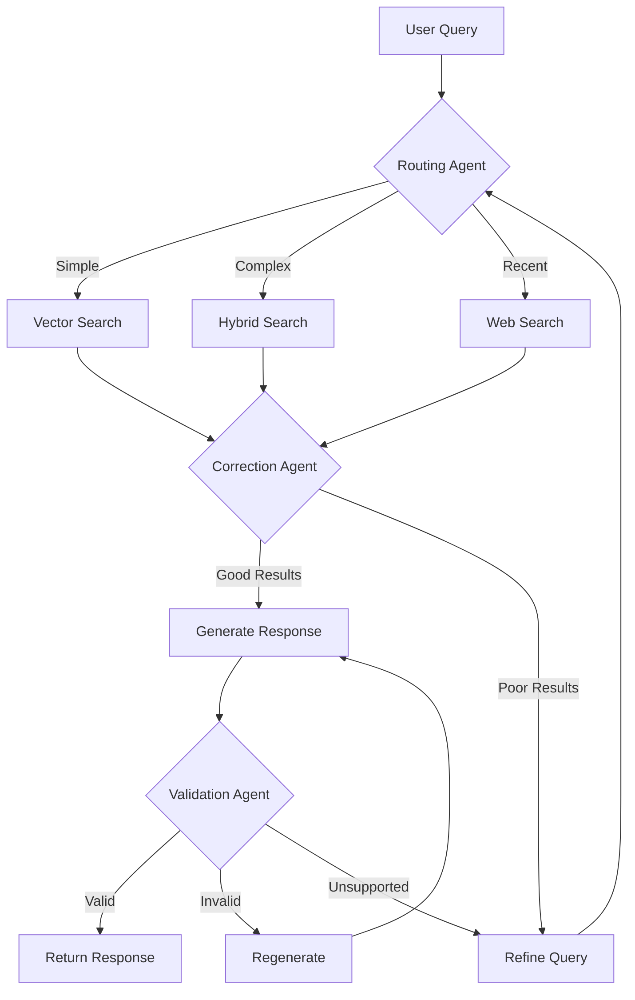

# ADR-001-NEW: Modern Agentic RAG Architecture

## Title

Lightweight Multi-Agent RAG with Adaptive Routing and Self-Correction

## Version/Date

4.1 / 2025-08-18

## Status

Accepted

## Description

Implements a simplified agentic RAG architecture using the `langgraph-supervisor` library for orchestration, incorporating Adaptive RAG (routing), Corrective RAG (fallback), and Self-RAG (quality control) patterns. The system leverages proven supervisor patterns to dramatically reduce implementation complexity while maintaining local-first operation and intelligent query processing.

**Enhanced Capabilities:**

- **DSPy Prompt Optimization** (ADR-018): Automatic query rewriting and prompt optimization for improved retrieval quality
- **Optional GraphRAG** (ADR-019): LlamaIndex PropertyGraphIndex for multi-hop reasoning and relationship extraction when enabled

## Context

Traditional RAG systems suffer from fixed retrieval patterns that cannot adapt to query complexity or handle retrieval failures gracefully. Modern agentic RAG addresses these limitations through:

1. **Query Routing**: Directing different query types to optimal retrieval strategies
2. **Corrective Retrieval**: Detecting poor retrieval results and triggering alternatives  
3. **Self-Correction**: Validating and improving generated responses
4. **Local Operation**: All processing occurs on consumer hardware without API dependencies

Research validates that supervisor-based agentic patterns can run efficiently on local models (Qwen3-14B with native 128K context) while providing significant quality improvements over basic RAG with dramatically reduced implementation complexity.

## Related Requirements

### Functional Requirements

- **FR-1:** Route queries to appropriate retrieval strategies based on complexity and domain
- **FR-2:** Detect low-quality retrieval results and trigger alternative approaches
- **FR-3:** Validate generated responses for relevance, accuracy, and completeness
- **FR-4:** Maintain conversation context across multi-turn interactions

### Non-Functional Requirements

- **NFR-1:** **(Local-First)** All agentic operations must run locally without external API calls
- **NFR-2:** **(Performance)** Agent decision overhead <500ms on consumer hardware
- **NFR-3:** **(Memory)** Total memory footprint increase <2GB over basic RAG

## Alternatives

### 1. Basic RAG (Current)

- **Description**: Fixed pipeline: retrieve → rerank → generate
- **Issues**: Cannot adapt to query complexity, no quality control, poor handling of retrieval failures
- **Score**: 2/10 (simplicity: 8, capability: 1, adaptability: 1)

### 2. Heavy Multi-Agent Framework

- **Description**: Complex agent ecosystem with specialized roles (researcher, validator, synthesizer)
- **Issues**: Resource intensive, over-engineered for single-user desktop app, difficult to debug
- **Score**: 4/10 (capability: 8, simplicity: 1, performance: 3)

### 3. Lightweight Agentic RAG (Selected)

- **Description**: Three-pattern system: routing, correction, validation with minimal overhead
- **Benefits**: Balanced capability/complexity, proven local operation, maintainable
- **Score**: 8/10 (capability: 7, simplicity: 7, performance: 8)

## Decision

We will implement a **supervisor-based agentic RAG architecture** using `langgraph-supervisor` with three core patterns:

1. **Adaptive Routing Agent**: Routes queries between vector search, hybrid search, and web search fallback
2. **Corrective Retrieval Agent**: Evaluates retrieval quality and triggers re-retrieval with query refinement
3. **Self-Correction Agent**: Validates response quality and triggers regeneration when needed

**Implementation Strategy:**

- Use `create_supervisor()` from langgraph-supervisor library
- Local LLM for all agent decisions (Qwen3-14B with native 128K context)
- Supervisor handles state management and agent coordination automatically
- Built-in error handling and fallback mechanisms

## Related Decisions

- **ADR-004-NEW** (Local-First LLM Strategy): Provides the local LLM for agent decision-making
- **ADR-003-NEW** (Adaptive Retrieval Pipeline): Implements the retrieval strategies that agents route between
- **ADR-011-NEW** (Agent Orchestration Framework): Details the supervisor library implementation
- **ADR-012-NEW** (Evaluation and Quality Assurance): Provides the quality metrics for self-correction
- **ADR-018-NEW** (DSPy Prompt Optimization): Enhances query processing and agent prompts with automatic optimization
- **ADR-019-NEW** (Optional GraphRAG): Provides advanced multi-hop reasoning capabilities when enabled

## Design

### Agent Architecture



### Core Agent Functions

```python
# Routing Agent - decides retrieval strategy
def route_query(query: str, context: Dict) -> str:
    """Routes query to optimal retrieval strategy."""
    prompt = """
    Analyze this query and choose the best retrieval approach:
    
    Query: {query}
    
    Options:
    - vector: For semantic similarity searches
    - hybrid: For complex queries needing keyword + semantic
    - web: For recent events or missing knowledge
    
    Respond with just: vector, hybrid, or web
    """
    return llm.invoke(prompt.format(query=query))

# Correction Agent - evaluates retrieval quality  
def evaluate_retrieval(query: str, documents: List[Document]) -> str:
    """Evaluates if retrieved documents can answer the query."""
    prompt = """
    Query: {query}
    Documents: {docs}
    
    Can these documents adequately answer the query?
    Consider relevance, completeness, and recency.
    
    Respond with: good, poor, or missing
    """
    return llm.invoke(prompt.format(query=query, docs=documents))

# Validation Agent - checks response quality
def validate_response(query: str, response: str, sources: List[Document]) -> str:
    """Validates generated response against sources."""
    prompt = """
    Query: {query}
    Response: {response}
    Sources: {sources}
    
    Evaluate the response:
    1. Relevant to query?
    2. Supported by sources?
    3. Complete answer?
    
    Respond with: valid, invalid, or unsupported
    """
    return llm.invoke(prompt.format(query=query, response=response, sources=sources))
```

### Simplified Supervisor Implementation

```python
from langgraph_supervisor import create_supervisor
from langgraph.prebuilt import create_react_agent
from langchain_core.tools import tool

# Create specialized agent tools (same as in ADR-011-NEW)
@tool
def route_query(query: str) -> Dict[str, str]:
    """Route query to optimal retrieval strategy."""
    # Routing logic here
    return {"strategy": "vector", "complexity": "medium"}

@tool
def retrieve_and_evaluate(query: str, strategy: str) -> Dict[str, Any]:
    """Retrieve documents and evaluate quality."""
    # Combined retrieval and evaluation logic
    return {"documents": [...], "quality_score": 0.8}

@tool
def generate_and_validate(query: str, documents: List[Dict]) -> str:
    """Generate and validate response."""
    # Combined generation and validation logic
    return "Generated and validated response..."

# Create agents
routing_agent = create_react_agent(
    model=llm, tools=[route_query], name="router",
    prompt="You route queries to optimal retrieval strategies."
)

retrieval_agent = create_react_agent(
    model=llm, tools=[retrieve_and_evaluate], name="retriever", 
    prompt="You retrieve and evaluate document quality."
)

generation_agent = create_react_agent(
    model=llm, tools=[generate_and_validate], name="generator",
    prompt="You generate and validate responses."
)

# Create supervisor workflow
workflow = create_supervisor(
    agents=[routing_agent, retrieval_agent, generation_agent],
    model=llm,
    prompt="""You coordinate a RAG system:
    1. Use router to analyze the query
    2. Use retriever to get and evaluate documents  
    3. Use generator to create and validate the response"""
)

# Compile and use
app = workflow.compile()
result = app.invoke({"messages": [{"role": "user", "content": query}]})
response = result["messages"][-1]["content"]
```

**Benefits of Supervisor Approach:**

- Eliminates complex state management and conditional routing
- Automatic error handling and agent coordination
- Proven patterns reduce bugs and edge cases
- Much simpler to understand, test, and maintain

## Consequences

### Positive Outcomes

- **Adaptive Intelligence**: System can handle diverse query types and quality issues intelligently
- **Quality Assurance**: Built-in validation prevents poor responses from reaching users
- **Maintainable Complexity**: Simple three-agent pattern avoids over-engineering
- **Local Operation**: No external dependencies while gaining agentic capabilities
- **Performance**: Lightweight decisions add minimal overhead to response time
- **Advanced Optimization**: DSPy provides automatic prompt optimization for 20-30% improvement in retrieval quality
- **Multi-hop Reasoning**: Optional GraphRAG enables complex relationship queries and thematic analysis

### Negative Consequences / Trade-offs

- **Increased Latency**: Agent decisions add 200-500ms per query vs basic RAG
- **Resource Usage**: Additional 1-2GB RAM for local LLM agent decisions
- **Complexity**: More moving parts than basic RAG, requires monitoring agent behavior
- **Debugging**: Agent decision paths harder to trace than linear pipelines

### Mitigation Strategies

- **Fallback Mode**: Automatic fallback to basic RAG if agent decisions fail
- **Caching**: Cache agent decisions for similar queries to reduce latency
- **Monitoring**: Log all agent decisions for debugging and optimization
- **Graceful Degradation**: Continue with best-effort responses rather than failing

## Dependencies

- **Python**: `langgraph-supervisor>=0.0.29`, `langgraph>=0.2.0`, `langchain-core>=0.3.0`
- **Local LLM**: Qwen3-14B-Instruct with native 128K context and function calling support
- **Framework**: LlamaIndex integration for retrieval components

## Performance Targets

- **Agent Decision Time**: <300ms per decision on RTX 4060
- **Total Query Latency**: <3 seconds for complex multi-agent queries
- **Memory Overhead**: <2GB additional RAM for agent operations
- **Success Rate**: >85% queries resolved without fallback to basic RAG

## Monitoring Metrics

- Agent decision accuracy (routing effectiveness)
- Retrieval correction success rate
- Response validation outcomes
- Overall query satisfaction scores
- System fallback frequency

## Changelog

- **4.1 (2025-08-18)**: Added DSPy prompt optimization (20-30% quality improvement) and GraphRAG multi-hop reasoning capabilities
- **4.0 (2025-08-17)**: Updated with library-first supervisor approach and simplified agent implementation
- **3.0 (2025-08-16)**: **MODEL UPDATE** - Updated to use Qwen3-14B-Instruct with native 128K context (latest generation, April 2025). Maintains all langgraph-supervisor simplifications.
- **2.0 (2025-01-16)**: **SIMPLIFIED IMPLEMENTATION** - Switched to langgraph-supervisor library for agent coordination. Updated to use Qwen2.5-14B with 128K context. Eliminated custom state management and conditional routing.
- **1.0 (2025-01-16)**: Initial architecture design for lightweight agentic RAG with LangGraph implementation
