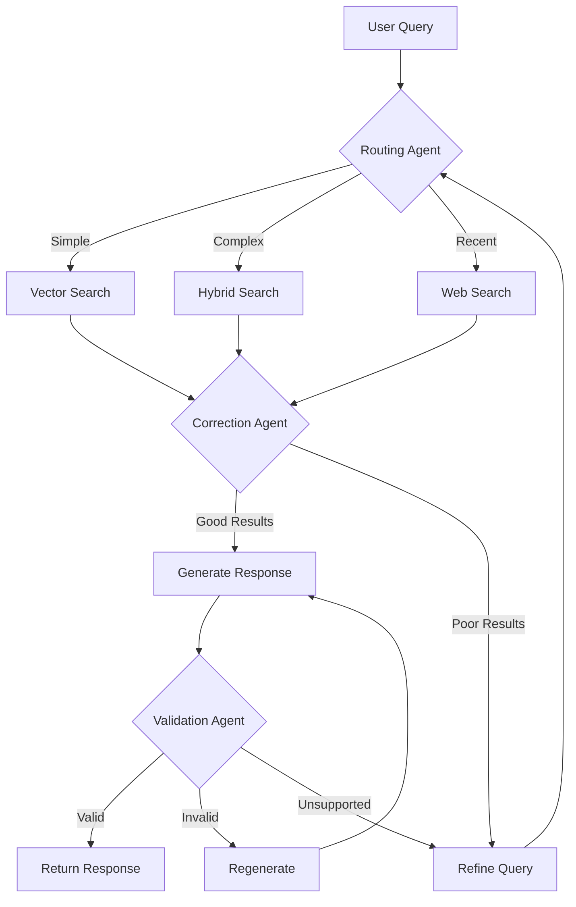

# ADR-001-NEW: Modern Agentic RAG Architecture

## Title

Lightweight Multi-Agent RAG with Adaptive Routing and Self-Correction

## Version/Date

1.0 / 2025-01-16

## Status

Proposed

## Description

Implements a lightweight agentic RAG architecture using LangGraph for orchestration, incorporating Adaptive RAG (routing), Corrective RAG (fallback), and Self-RAG (quality control) patterns. The system maintains local-first operation while providing intelligent query routing, retrieval correction, and response validation without the complexity of heavy multi-agent frameworks.

## Context

Traditional RAG systems suffer from fixed retrieval patterns that cannot adapt to query complexity or handle retrieval failures gracefully. Modern agentic RAG addresses these limitations through:

1. **Query Routing**: Directing different query types to optimal retrieval strategies
2. **Corrective Retrieval**: Detecting poor retrieval results and triggering alternatives  
3. **Self-Correction**: Validating and improving generated responses
4. **Local Operation**: All processing occurs on consumer hardware without API dependencies

Research validates that lightweight agentic patterns can run efficiently on local models (Qwen3, Mistral) while providing significant quality improvements over basic RAG.

## Related Requirements

### Functional Requirements

- **FR-1:** Route queries to appropriate retrieval strategies based on complexity and domain
- **FR-2:** Detect low-quality retrieval results and trigger alternative approaches
- **FR-3:** Validate generated responses for relevance, accuracy, and completeness
- **FR-4:** Maintain conversation context across multi-turn interactions

### Non-Functional Requirements

- **NFR-1:** **(Local-First)** All agentic operations must run locally without external API calls
- **NFR-2:** **(Performance)** Agent decision overhead <500ms on consumer hardware
- **NFR-3:** **(Memory)** Total memory footprint increase <2GB over basic RAG

## Alternatives

### 1. Basic RAG (Current)

- **Description**: Fixed pipeline: retrieve → rerank → generate
- **Issues**: Cannot adapt to query complexity, no quality control, poor handling of retrieval failures
- **Score**: 2/10 (simplicity: 8, capability: 1, adaptability: 1)

### 2. Heavy Multi-Agent Framework

- **Description**: Complex agent ecosystem with specialized roles (researcher, validator, synthesizer)
- **Issues**: Resource intensive, over-engineered for single-user desktop app, difficult to debug
- **Score**: 4/10 (capability: 8, simplicity: 1, performance: 3)

### 3. Lightweight Agentic RAG (Selected)

- **Description**: Three-pattern system: routing, correction, validation with minimal overhead
- **Benefits**: Balanced capability/complexity, proven local operation, maintainable
- **Score**: 8/10 (capability: 7, simplicity: 7, performance: 8)

## Decision

We will implement a **lightweight agentic RAG architecture** using LangGraph with three core patterns:

1. **Adaptive Routing Agent**: Routes queries between vector search, hybrid search, and web search fallback
2. **Corrective Retrieval Agent**: Evaluates retrieval quality and triggers re-retrieval with query refinement
3. **Self-Correction Agent**: Validates response quality and triggers regeneration when needed

**Implementation Strategy:**

- Single LangGraph state machine with 5 nodes maximum
- Local LLM for all agent decisions (Qwen3-14B or Mistral-7B)
- Simple binary/ternary decision points to minimize complexity
- Fallback to basic RAG if agent decisions fail

## Related Decisions

- **ADR-004-NEW** (Local-First LLM Strategy): Provides the local LLM for agent decision-making
- **ADR-003-NEW** (Adaptive Retrieval Pipeline): Implements the retrieval strategies that agents route between
- **ADR-011-NEW** (Agent Orchestration Framework): Details the LangGraph implementation
- **ADR-012-NEW** (Evaluation and Quality Assurance): Provides the quality metrics for self-correction

## Design

### Agent Architecture



### Core Agent Functions

```python
# Routing Agent - decides retrieval strategy
def route_query(query: str, context: Dict) -> str:
    """Routes query to optimal retrieval strategy."""
    prompt = """
    Analyze this query and choose the best retrieval approach:
    
    Query: {query}
    
    Options:
    - vector: For semantic similarity searches
    - hybrid: For complex queries needing keyword + semantic
    - web: For recent events or missing knowledge
    
    Respond with just: vector, hybrid, or web
    """
    return llm.invoke(prompt.format(query=query))

# Correction Agent - evaluates retrieval quality  
def evaluate_retrieval(query: str, documents: List[Document]) -> str:
    """Evaluates if retrieved documents can answer the query."""
    prompt = """
    Query: {query}
    Documents: {docs}
    
    Can these documents adequately answer the query?
    Consider relevance, completeness, and recency.
    
    Respond with: good, poor, or missing
    """
    return llm.invoke(prompt.format(query=query, docs=documents))

# Validation Agent - checks response quality
def validate_response(query: str, response: str, sources: List[Document]) -> str:
    """Validates generated response against sources."""
    prompt = """
    Query: {query}
    Response: {response}
    Sources: {sources}
    
    Evaluate the response:
    1. Relevant to query?
    2. Supported by sources?
    3. Complete answer?
    
    Respond with: valid, invalid, or unsupported
    """
    return llm.invoke(prompt.format(query=query, response=response, sources=sources))
```

### LangGraph State Machine

```python
from langgraph.graph import StateGraph, END
from typing import TypedDict

class AgentState(TypedDict):
    query: str
    retrieval_strategy: str
    documents: List[Document]
    response: str
    attempts: int
    max_attempts: int

def create_agentic_rag_graph():
    workflow = StateGraph(AgentState)
    
    # Add nodes
    workflow.add_node("route", route_query_node)
    workflow.add_node("retrieve", retrieve_documents_node)  
    workflow.add_node("evaluate", evaluate_retrieval_node)
    workflow.add_node("generate", generate_response_node)
    workflow.add_node("validate", validate_response_node)
    
    # Add edges with conditions
    workflow.add_edge("route", "retrieve")
    workflow.add_conditional_edges(
        "evaluate",
        lambda x: "generate" if x["quality"] == "good" else "route",
        {"generate": "generate", "route": "route"}
    )
    workflow.add_conditional_edges(
        "validate", 
        lambda x: END if x["valid"] == "valid" else "generate",
        {END: END, "generate": "generate"}
    )
    
    workflow.set_entry_point("route")
    return workflow.compile()
```

## Consequences

### Positive Outcomes

- **Adaptive Intelligence**: System can handle diverse query types and quality issues intelligently
- **Quality Assurance**: Built-in validation prevents poor responses from reaching users
- **Maintainable Complexity**: Simple three-agent pattern avoids over-engineering
- **Local Operation**: No external dependencies while gaining agentic capabilities
- **Performance**: Lightweight decisions add minimal overhead to response time

### Negative Consequences / Trade-offs

- **Increased Latency**: Agent decisions add 200-500ms per query vs basic RAG
- **Resource Usage**: Additional 1-2GB RAM for local LLM agent decisions
- **Complexity**: More moving parts than basic RAG, requires monitoring agent behavior
- **Debugging**: Agent decision paths harder to trace than linear pipelines

### Mitigation Strategies

- **Fallback Mode**: Automatic fallback to basic RAG if agent decisions fail
- **Caching**: Cache agent decisions for similar queries to reduce latency
- **Monitoring**: Log all agent decisions for debugging and optimization
- **Graceful Degradation**: Continue with best-effort responses rather than failing

## Dependencies

- **Python**: `langgraph>=0.2.0`, `langchain-core>=0.3.0`
- **Local LLM**: Qwen3-14B or Mistral-7B with function calling support
- **Framework**: LlamaIndex integration for retrieval components

## Performance Targets

- **Agent Decision Time**: <300ms per decision on RTX 4060
- **Total Query Latency**: <3 seconds for complex multi-agent queries
- **Memory Overhead**: <2GB additional RAM for agent operations
- **Success Rate**: >85% queries resolved without fallback to basic RAG

## Monitoring Metrics

- Agent decision accuracy (routing effectiveness)
- Retrieval correction success rate
- Response validation outcomes
- Overall query satisfaction scores
- System fallback frequency

## Changelog

- **1.0 (2025-01-16)**: Initial architecture design for lightweight agentic RAG with LangGraph implementation
