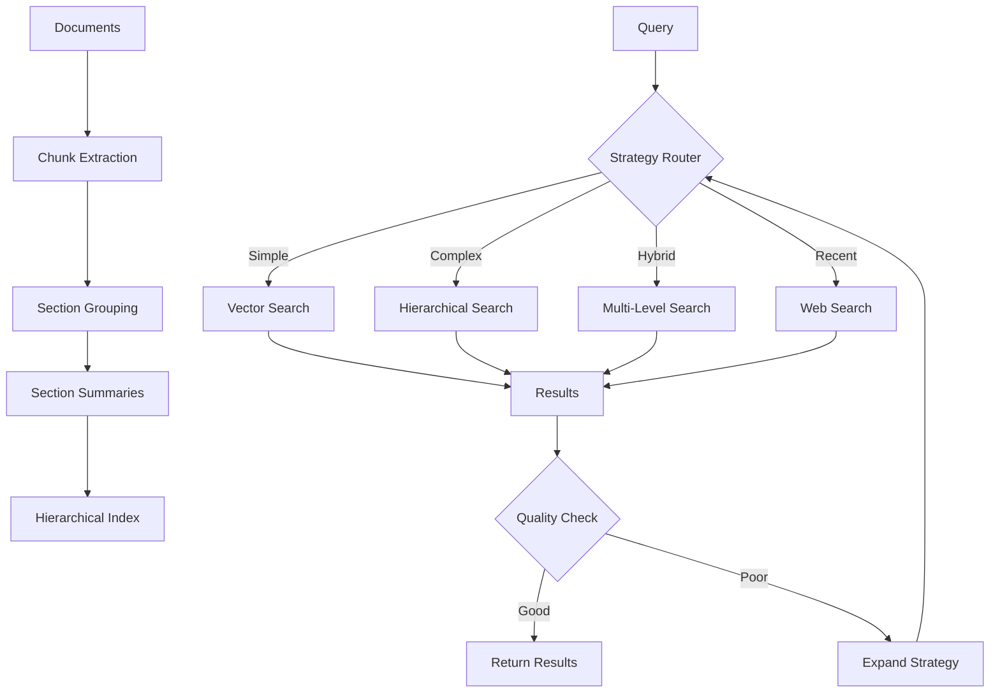

# ADR-003-NEW: Adaptive Retrieval Pipeline with RAPTOR-Lite

## Title

Hierarchical Adaptive Retrieval with Simplified RAPTOR and Multi-Strategy Routing

## Version/Date

1.0 / 2025-01-16

## Status

Proposed

## Description

Implements an adaptive retrieval pipeline that combines simplified hierarchical retrieval (RAPTOR-Lite), multi-strategy routing, and corrective mechanisms. The system automatically selects optimal retrieval approaches based on query characteristics while maintaining hierarchical document organization for complex information synthesis without the full complexity of RAPTOR.

## Context

Current retrieval is limited to flat vector similarity search with basic reranking. Modern retrieval challenges require:

1. **Hierarchical Understanding**: Queries need both specific details and high-level context
2. **Strategy Adaptation**: Different queries benefit from different retrieval approaches
3. **Quality Correction**: Poor initial retrieval should trigger alternative strategies
4. **Local Efficiency**: Complex retrieval must work within consumer hardware constraints

Full RAPTOR implementation is too resource-intensive for local deployment. Our RAPTOR-Lite approach maintains hierarchical benefits while optimizing for local-first constraints.

## Related Requirements

### Functional Requirements

- **FR-1:** Route queries to optimal retrieval strategy based on characteristics
- **FR-2:** Provide hierarchical document access for multi-level information needs
- **FR-3:** Correct poor retrieval results through alternative strategies
- **FR-4:** Support both specific fact queries and broad synthesis queries

### Non-Functional Requirements

- **NFR-1:** **(Performance)** Hierarchical retrieval overhead <1 second on consumer hardware
- **NFR-2:** **(Memory)** RAPTOR-Lite tree storage <500MB for 10,000 documents
- **NFR-3:** **(Quality)** ≥15% improvement in complex query answering vs flat retrieval
- **NFR-4:** **(Local-First)** All hierarchical processing occurs locally

## Alternatives

### 1. Flat Vector Retrieval (Current)

- **Description**: Single-level similarity search with reranking
- **Issues**: Cannot synthesize across document sections, poor for complex queries
- **Score**: 4/10 (simplicity: 9, capability: 2, scalability: 3)

### 2. Full RAPTOR Implementation

- **Description**: Complete recursive tree with clustering and summarization
- **Issues**: Too resource-intensive, complex for local deployment, over-engineered
- **Score**: 5/10 (capability: 9, performance: 2, complexity: 3)

### 3. RAPTOR-Lite + Multi-Strategy (Selected)

- **Description**: Simplified hierarchical retrieval with adaptive routing
- **Benefits**: Balanced capability/performance, local-optimized, maintainable
- **Score**: 8/10 (capability: 7, performance: 8, simplicity: 8)

## Decision

We will implement **RAPTOR-Lite with Multi-Strategy Adaptive Routing**:

### Core Components

1. **RAPTOR-Lite Hierarchy**: Simplified 2-level tree (document chunks + section summaries)
2. **Multi-Strategy Router**: Routes between vector, hybrid, hierarchical, and web search
3. **Corrective Feedback**: Evaluates and retries poor retrieval results
4. **Progressive Expansion**: Starts narrow, expands scope based on result quality

## Related Decisions

- **ADR-002-NEW** (Unified Embedding Strategy): Provides embeddings for hierarchical indexing
- **ADR-001-NEW** (Modern Agentic RAG): Uses adaptive retrieval for intelligent routing
- **ADR-006-NEW** (Modern Reranking Architecture): Reranks hierarchical retrieval results
- **ADR-011-NEW** (Agent Orchestration Framework): Orchestrates adaptive retrieval decisions

## Design

### RAPTOR-Lite Architecture



### RAPTOR-Lite Implementation

```python
from dataclasses import dataclass
from typing import List, Dict, Optional
import numpy as np
from sklearn.cluster import KMeans
from llama_index.core import Document, Settings

@dataclass
class HierarchicalNode:
    """Simplified hierarchical node for RAPTOR-Lite."""
    content: str
    level: int  # 0 = chunk, 1 = section summary, 2 = document summary
    parent_id: Optional[str] = None
    children_ids: List[str] = None
    embedding: Optional[np.ndarray] = None
    metadata: Dict = None

class RAPTORLiteIndexer:
    """Simplified RAPTOR implementation optimized for local deployment."""
    
    def __init__(self, max_levels: int = 2, cluster_size: int = 5):
        self.max_levels = max_levels
        self.cluster_size = cluster_size
        self.nodes = {}
        self.level_index = {0: [], 1: [], 2: []}
    
    def build_hierarchy(self, documents: List[Document]) -> None:
        """Build simplified 2-level hierarchy."""
        # Level 0: Document chunks (existing)
        chunks = self._extract_chunks(documents)
        for chunk in chunks:
            node = HierarchicalNode(
                content=chunk.text,
                level=0,
                metadata=chunk.metadata
            )
            self.nodes[chunk.id_] = node
            self.level_index[0].append(chunk.id_)
        
        # Level 1: Section summaries (simplified clustering)
        if len(chunks) > self.cluster_size:
            section_summaries = self._create_section_summaries(chunks)
            for summary in section_summaries:
                node = HierarchicalNode(
                    content=summary['content'],
                    level=1,
                    children_ids=summary['chunk_ids'],
                    metadata={'topic': summary['topic']}
                )
                self.nodes[summary['id']] = node
                self.level_index[1].append(summary['id'])
    
    def _create_section_summaries(self, chunks: List[Document]) -> List[Dict]:
        """Create section summaries through simple clustering."""
        # Get embeddings for all chunks
        chunk_embeddings = []
        for chunk in chunks:
            embedding = Settings.embed_model.get_text_embedding(chunk.text)
            chunk_embeddings.append(embedding)
        
        # Simple k-means clustering
        n_clusters = max(2, len(chunks) // self.cluster_size)
        kmeans = KMeans(n_clusters=n_clusters, random_state=42)
        cluster_labels = kmeans.fit_predict(chunk_embeddings)
        
        # Generate summaries for each cluster
        summaries = []
        for cluster_id in range(n_clusters):
            cluster_chunks = [chunks[i] for i, label in enumerate(cluster_labels) if label == cluster_id]
            
            if len(cluster_chunks) > 1:
                summary_content = self._summarize_cluster(cluster_chunks)
                summaries.append({
                    'id': f"section_{cluster_id}",
                    'content': summary_content,
                    'chunk_ids': [chunk.id_ for chunk in cluster_chunks],
                    'topic': self._extract_topic(cluster_chunks)
                })
        
        return summaries
    
    def _summarize_cluster(self, chunks: List[Document]) -> str:
        """Generate summary for chunk cluster."""
        combined_text = "\n\n".join([chunk.text for chunk in chunks])
        
        prompt = f"""
        Summarize the following related content sections in 2-3 sentences.
        Focus on the main themes and key information.
        
        Content:
        {combined_text[:4000]}  # Limit for local LLM
        
        Summary:
        """
        
        # Use local LLM for summarization
        response = Settings.llm.complete(prompt)
        return response.text.strip()
    
    def _extract_topic(self, chunks: List[Document]) -> str:
        """Extract main topic from cluster."""
        combined_text = " ".join([chunk.text for chunk in chunks])
        words = combined_text.lower().split()
        
        # Simple keyword extraction (can be enhanced)
        from collections import Counter
        word_counts = Counter(words)
        common_words = [word for word, count in word_counts.most_common(5) 
                       if len(word) > 4 and word.isalpha()]
        
        return ", ".join(common_words[:3])

class AdaptiveRetriever:
    """Multi-strategy adaptive retriever with RAPTOR-Lite support."""
    
    def __init__(self, hierarchical_index: RAPTORLiteIndexer, vector_store):
        self.hierarchical_index = hierarchical_index
        self.vector_store = vector_store
        self.strategy_history = []
    
    def retrieve(self, query: str, strategy: str = "auto") -> List[NodeWithScore]:
        """Adaptive retrieval with multiple strategies."""
        if strategy == "auto":
            strategy = self._route_strategy(query)
        
        if strategy == "vector":
            return self._vector_retrieve(query)
        elif strategy == "hierarchical":
            return self._hierarchical_retrieve(query)
        elif strategy == "hybrid":
            return self._hybrid_retrieve(query)
        elif strategy == "web":
            return self._web_retrieve(query)
        else:
            return self._vector_retrieve(query)  # Fallback
    
    def _route_strategy(self, query: str) -> str:
        """Route query to optimal retrieval strategy."""
        prompt = f"""
        Analyze this query and choose the best retrieval strategy:
        
        Query: "{query}"
        
        Strategies:
        - vector: Simple factual questions, specific information lookup
        - hierarchical: Complex questions needing synthesis across sections
        - hybrid: Questions needing both specific facts and broader context
        - web: Questions about recent events or missing information
        
        Consider:
        - Query complexity and scope
        - Need for synthesis vs specific facts
        - Likely information distribution
        
        Respond with just the strategy name: vector, hierarchical, hybrid, or web
        """
        
        response = Settings.llm.complete(prompt)
        strategy = response.text.strip().lower()
        
        if strategy not in ["vector", "hierarchical", "hybrid", "web"]:
            strategy = "vector"  # Safe fallback
        
        return strategy
    
    def _hierarchical_retrieve(self, query: str, top_k: int = 10) -> List[NodeWithScore]:
        """Retrieve using RAPTOR-Lite hierarchy."""
        results = []
        
        # Search level 1 (section summaries) first
        if self.hierarchical_index.level_index[1]:
            level1_results = self._search_level(query, level=1, top_k=5)
            
            # For each relevant section, get its chunks
            for section_result in level1_results:
                section_node = self.hierarchical_index.nodes[section_result.node.id_]
                if section_node.children_ids:
                    for chunk_id in section_node.children_ids:
                        chunk_node = self.hierarchical_index.nodes[chunk_id]
                        # Re-score chunk in context of section relevance
                        score = section_result.score * 0.8  # Discount for indirection
                        results.append(NodeWithScore(
                            node=Document(text=chunk_node.content, id_=chunk_id),
                            score=score
                        ))
        
        # Add direct chunk matches
        chunk_results = self._search_level(query, level=0, top_k=5)
        results.extend(chunk_results)
        
        # Deduplicate and sort by score
        seen_ids = set()
        unique_results = []
        for result in sorted(results, key=lambda x: x.score, reverse=True):
            if result.node.id_ not in seen_ids:
                unique_results.append(result)
                seen_ids.add(result.node.id_)
        
        return unique_results[:top_k]
    
    def _search_level(self, query: str, level: int, top_k: int) -> List[NodeWithScore]:
        """Search specific hierarchy level."""
        query_embedding = Settings.embed_model.get_text_embedding(query)
        results = []
        
        for node_id in self.hierarchical_index.level_index[level]:
            node = self.hierarchical_index.nodes[node_id]
            
            # Get or compute node embedding
            if node.embedding is None:
                node.embedding = Settings.embed_model.get_text_embedding(node.content)
            
            # Compute similarity
            similarity = np.dot(query_embedding, node.embedding) / (
                np.linalg.norm(query_embedding) * np.linalg.norm(node.embedding)
            )
            
            results.append(NodeWithScore(
                node=Document(text=node.content, id_=node_id),
                score=float(similarity)
            ))
        
        return sorted(results, key=lambda x: x.score, reverse=True)[:top_k]
    
    def _hybrid_retrieve(self, query: str) -> List[NodeWithScore]:
        """Combine multiple retrieval strategies."""
        vector_results = self._vector_retrieve(query, top_k=5)
        hierarchical_results = self._hierarchical_retrieve(query, top_k=5)
        
        # Simple score fusion
        all_results = []
        all_results.extend([(r, 0.6) for r in vector_results])  # Weight vector higher for precision
        all_results.extend([(r, 0.4) for r in hierarchical_results])  # Lower weight for recall
        
        # Combine scores for same documents
        score_map = {}
        for result, weight in all_results:
            doc_id = result.node.id_
            if doc_id in score_map:
                score_map[doc_id] = (score_map[doc_id][0], 
                                   score_map[doc_id][1] + result.score * weight)
            else:
                score_map[doc_id] = (result.node, result.score * weight)
        
        # Sort by combined score
        combined_results = [NodeWithScore(node=node, score=score) 
                          for node, score in score_map.values()]
        
        return sorted(combined_results, key=lambda x: x.score, reverse=True)[:10]
```

### Quality Evaluation and Correction

```python
class RetrievalQualityEvaluator:
    """Evaluates retrieval quality and triggers corrections."""
    
    def evaluate_results(self, query: str, results: List[NodeWithScore]) -> Dict[str, float]:
        """Evaluate retrieval result quality."""
        if not results:
            return {"relevance": 0.0, "coverage": 0.0, "confidence": 0.0}
        
        # Simple heuristic evaluation (can be enhanced with local LLM)
        metrics = {
            "relevance": self._calculate_relevance(query, results),
            "coverage": self._calculate_coverage(query, results),
            "confidence": min(results[0].score, 1.0) if results else 0.0
        }
        
        return metrics
    
    def _calculate_relevance(self, query: str, results: List[NodeWithScore]) -> float:
        """Estimate relevance based on keyword overlap and scores."""
        query_words = set(query.lower().split())
        total_relevance = 0.0
        
        for result in results[:3]:  # Top 3 for efficiency
            content_words = set(result.node.text.lower().split())
            overlap = len(query_words.intersection(content_words)) / len(query_words)
            score_weight = result.score
            total_relevance += overlap * score_weight
        
        return min(total_relevance / 3.0, 1.0)
    
    def _calculate_coverage(self, query: str, results: List[NodeWithScore]) -> float:
        """Estimate query coverage based on result diversity."""
        if len(results) < 2:
            return 0.5
        
        # Simple diversity measure
        embeddings = []
        for result in results[:5]:
            embedding = Settings.embed_model.get_text_embedding(result.node.text[:500])
            embeddings.append(embedding)
        
        # Calculate average pairwise distance
        total_distance = 0.0
        pairs = 0
        for i in range(len(embeddings)):
            for j in range(i + 1, len(embeddings)):
                distance = 1.0 - np.dot(embeddings[i], embeddings[j]) / (
                    np.linalg.norm(embeddings[i]) * np.linalg.norm(embeddings[j])
                )
                total_distance += distance
                pairs += 1
        
        avg_distance = total_distance / max(pairs, 1)
        return min(avg_distance, 1.0)
    
    def should_retry(self, metrics: Dict[str, float]) -> bool:
        """Determine if retrieval should be retried with different strategy."""
        return (metrics["relevance"] < 0.3 or 
                metrics["coverage"] < 0.4 or 
                metrics["confidence"] < 0.2)
```

## Consequences

### Positive Outcomes

- **Adaptive Intelligence**: System selects optimal retrieval strategy per query
- **Hierarchical Access**: Complex queries can access both details and summaries
- **Quality Assurance**: Poor results trigger alternative strategies automatically
- **Local Efficiency**: RAPTOR-Lite provides hierarchical benefits without full complexity
- **Scalable Performance**: Multi-level indexing scales better than flat approaches

### Negative Consequences / Trade-offs

- **Indexing Complexity**: Building hierarchical index adds processing time
- **Storage Overhead**: Additional storage for section summaries and hierarchy
- **Strategy Latency**: Router decisions add 100-300ms per query
- **Maintenance**: More complex index structure requires careful updates

### Performance Targets

- **Hierarchy Build**: <5 minutes for 1000 documents on consumer hardware
- **Storage Overhead**: <50% increase vs flat index for hierarchical structure
- **Retrieval Latency**: <500ms additional overhead for hierarchical vs vector search
- **Quality Improvement**: ≥15% better performance on complex queries

## Dependencies

- **Python**: `scikit-learn>=1.3.0` for clustering, `numpy>=1.24.0`
- **LlamaIndex**: Core retrieval and embedding interfaces
- **Models**: BGE-M3 embeddings, local LLM for summarization

## Monitoring Metrics

- Strategy selection distribution and effectiveness
- Hierarchical vs flat retrieval quality comparison
- Index build time and storage requirements
- Retry frequency and success rates
- Query complexity vs retrieval strategy correlation

## Changelog

- **1.0 (2025-01-16)**: Initial design for adaptive retrieval pipeline with RAPTOR-Lite hierarchical indexing
