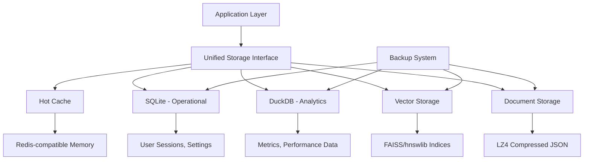

# ADR-007-NEW: Hybrid Persistence Strategy

## Title

Multi-Backend Persistence with SQLite, DuckDB, and Vector Storage Optimization

## Version/Date

1.0 / 2025-01-16

## Status

Proposed

## Description

Implements a hybrid persistence strategy that moves beyond SQLite-only storage to include DuckDB for analytics, optimized vector storage, and intelligent data partitioning. The system maintains local-first operation while providing better performance for different data types and access patterns, supporting both operational queries and analytical workloads.

## Context

Current persistence relies solely on SQLite for all data storage needs. While SQLite works well for basic operations, the modernized architecture has diverse storage requirements:

1. **Vector Data**: Embeddings and similarity indices need optimized storage
2. **Analytical Queries**: RAPTOR-Lite hierarchy and performance metrics need OLAP capabilities  
3. **Operational Data**: User sessions, settings, and metadata need ACID compliance
4. **Document Content**: Large text content needs efficient compression and retrieval
5. **Cache Management**: Temporary data needs fast access with automatic cleanup

A hybrid approach allows each data type to use the most appropriate storage backend while maintaining simplicity and local-first operation.

## Related Requirements

### Functional Requirements

- **FR-1:** Store and retrieve vector embeddings efficiently for similarity search
- **FR-2:** Support analytical queries for performance monitoring and insights
- **FR-3:** Maintain ACID compliance for operational data (sessions, settings)
- **FR-4:** Handle large document content with compression and fast retrieval
- **FR-5:** Provide automatic data lifecycle management and cleanup

### Non-Functional Requirements

- **NFR-1:** **(Performance)** Vector similarity queries <50ms for 10K documents
- **NFR-2:** **(Storage)** 40% reduction in storage space vs current approach
- **NFR-3:** **(Local-First)** All storage remains local with no external dependencies
- **NFR-4:** **(Reliability)** Zero data loss with automatic backup mechanisms

## Alternatives

### 1. SQLite-Only (Current)

- **Description**: Single SQLite database for all storage needs
- **Issues**: Poor vector performance, limited analytics, no specialized optimization
- **Score**: 4/10 (simplicity: 9, performance: 2, scalability: 1)

### 2. External Vector Database (Qdrant Cloud)

- **Description**: Use cloud vector database for embeddings
- **Issues**: Violates local-first principle, ongoing costs, network dependency
- **Score**: 5/10 (performance: 8, local-first: 0, reliability: 6)

### 3. Single Advanced Database (DuckDB Only)

- **Description**: Use DuckDB for all storage including vectors
- **Issues**: Vector extensions still experimental, ACID concerns for some operations
- **Score**: 6/10 (performance: 7, analytics: 8, stability: 4)

### 4. Hybrid Multi-Backend Strategy (Selected)

- **Description**: Specialized storage per data type with unified interface
- **Benefits**: Optimized performance, maintains local-first, balanced complexity
- **Score**: 8/10 (performance: 9, flexibility: 8, complexity: 7)

## Decision

We will implement a **Hybrid Multi-Backend Persistence Strategy**:

### Storage Backends

1. **SQLite**: Operational data (sessions, settings, metadata)
2. **DuckDB**: Analytics and aggregations (metrics, performance data)
3. **Optimized Vector Storage**: Custom format for embeddings with FAISS/hnswlib
4. **Compressed Document Storage**: LZ4-compressed JSON for large text content
5. **Memory Cache**: Redis-compatible in-memory cache for hot data

### Data Partitioning

- **Hot Data**: Frequently accessed (in-memory cache)
- **Warm Data**: Regular access (SQLite/DuckDB)
- **Cold Data**: Archival storage (compressed files)

## Related Decisions

- **ADR-002-NEW** (Unified Embedding Strategy): Stores BGE-M3 unified embeddings efficiently
- **ADR-003-NEW** (Adaptive Retrieval Pipeline): Benefits from optimized vector storage
- **ADR-008-NEW** (Production Observability): Uses DuckDB for analytics storage
- **ADR-010-NEW** (Performance Optimization Strategy): Implements caching layer

## Design

### Storage Architecture



### Unified Storage Interface

```python
from abc import ABC, abstractmethod
from typing import Dict, List, Optional, Any, Union
from dataclasses import dataclass
from enum import Enum
import json
import sqlite3
import duckdb
import numpy as np
import lz4.frame
from pathlib import Path
import threading
import time

class StorageBackend(Enum):
    SQLITE = "sqlite"
    DUCKDB = "duckdb"
    VECTOR = "vector"
    DOCUMENT = "document"
    CACHE = "cache"

@dataclass
class StorageConfig:
    """Configuration for storage backends."""
    base_path: Path
    enable_compression: bool = True
    cache_size_mb: int = 256
    vector_index_type: str = "hnsw"  # or "ivf"
    backup_enabled: bool = True
    backup_interval_hours: int = 24

class StorageManager:
    """Unified interface for hybrid storage backends."""
    
    def __init__(self, config: StorageConfig):
        self.config = config
        self.backends = {}
        self._setup_backends()
        self._setup_backup_system()
    
    def _setup_backends(self):
        """Initialize all storage backends."""
        self.backends[StorageBackend.SQLITE] = SQLiteBackend(self.config)
        self.backends[StorageBackend.DUCKDB] = DuckDBBackend(self.config)
        self.backends[StorageBackend.VECTOR] = VectorBackend(self.config)
        self.backends[StorageBackend.DOCUMENT] = DocumentBackend(self.config)
        self.backends[StorageBackend.CACHE] = CacheBackend(self.config)
    
    def get_backend(self, backend_type: StorageBackend):
        """Get specific storage backend."""
        return self.backends[backend_type]
    
    def store_data(self, backend_type: StorageBackend, key: str, data: Any) -> bool:
        """Store data in specified backend."""
        backend = self.backends[backend_type]
        return backend.store(key, data)
    
    def retrieve_data(self, backend_type: StorageBackend, key: str) -> Optional[Any]:
        """Retrieve data from specified backend."""
        backend = self.backends[backend_type]
        return backend.retrieve(key)
    
    def query_data(self, backend_type: StorageBackend, query: str, params: Optional[Dict] = None) -> List[Dict]:
        """Execute query on specified backend."""
        backend = self.backends[backend_type]
        if hasattr(backend, 'query'):
            return backend.query(query, params or {})
        else:
            raise NotImplementedError(f"Query not supported for {backend_type}")

class SQLiteBackend:
    """SQLite backend for operational data."""
    
    def __init__(self, config: StorageConfig):
        self.config = config
        self.db_path = config.base_path / "operational.db"
        self.connection_pool = {}
        self._setup_database()
    
    def _setup_database(self):
        """Initialize SQLite database with optimizations."""
        conn = self._get_connection()
        
        # Enable WAL mode for better concurrency
        conn.execute("PRAGMA journal_mode=WAL")
        conn.execute("PRAGMA synchronous=NORMAL")
        conn.execute("PRAGMA cache_size=10000")
        conn.execute("PRAGMA temp_store=MEMORY")
        
        # Create core tables
        conn.executescript("""
            CREATE TABLE IF NOT EXISTS user_sessions (
                session_id TEXT PRIMARY KEY,
                user_data TEXT,
                created_at TIMESTAMP DEFAULT CURRENT_TIMESTAMP,
                last_accessed TIMESTAMP DEFAULT CURRENT_TIMESTAMP
            );
            
            CREATE TABLE IF NOT EXISTS application_settings (
                key TEXT PRIMARY KEY,
                value TEXT,
                updated_at TIMESTAMP DEFAULT CURRENT_TIMESTAMP
            );
            
            CREATE TABLE IF NOT EXISTS document_metadata (
                doc_id TEXT PRIMARY KEY,
                filename TEXT,
                file_size INTEGER,
                content_hash TEXT,
                created_at TIMESTAMP DEFAULT CURRENT_TIMESTAMP,
                metadata_json TEXT
            );
            
            CREATE INDEX IF NOT EXISTS idx_sessions_accessed ON user_sessions(last_accessed);
            CREATE INDEX IF NOT EXISTS idx_documents_hash ON document_metadata(content_hash);
        """)
        
        conn.commit()
        conn.close()
    
    def _get_connection(self) -> sqlite3.Connection:
        """Get thread-safe database connection."""
        thread_id = threading.get_ident()
        
        if thread_id not in self.connection_pool:
            conn = sqlite3.connect(str(self.db_path), check_same_thread=False)
            conn.row_factory = sqlite3.Row
            self.connection_pool[thread_id] = conn
        
        return self.connection_pool[thread_id]
    
    def store(self, key: str, data: Any) -> bool:
        """Store data with key-value interface."""
        conn = self._get_connection()
        try:
            data_json = json.dumps(data) if not isinstance(data, str) else data
            conn.execute(
                "INSERT OR REPLACE INTO application_settings (key, value) VALUES (?, ?)",
                (key, data_json)
            )
            conn.commit()
            return True
        except Exception as e:
            print(f"SQLite store error: {e}")
            return False
    
    def retrieve(self, key: str) -> Optional[Any]:
        """Retrieve data by key."""
        conn = self._get_connection()
        try:
            result = conn.execute(
                "SELECT value FROM application_settings WHERE key = ?",
                (key,)
            ).fetchone()
            
            if result:
                try:
                    return json.loads(result['value'])
                except json.JSONDecodeError:
                    return result['value']
            return None
        except Exception as e:
            print(f"SQLite retrieve error: {e}")
            return None
    
    def query(self, sql: str, params: Dict) -> List[Dict]:
        """Execute SQL query."""
        conn = self._get_connection()
        try:
            cursor = conn.execute(sql, params)
            return [dict(row) for row in cursor.fetchall()]
        except Exception as e:
            print(f"SQLite query error: {e}")
            return []

class DuckDBBackend:
    """DuckDB backend for analytics and aggregations."""
    
    def __init__(self, config: StorageConfig):
        self.config = config
        self.db_path = config.base_path / "analytics.duckdb"
        self.connection = None
        self._setup_database()
    
    def _setup_database(self):
        """Initialize DuckDB with analytics tables."""
        self.connection = duckdb.connect(str(self.db_path))
        
        # Configure for analytics workload
        self.connection.execute("SET memory_limit='1GB'")
        self.connection.execute("SET threads=4")
        
        # Create analytics tables
        self.connection.executescript("""
            CREATE TABLE IF NOT EXISTS query_metrics (
                timestamp TIMESTAMP,
                query_type VARCHAR,
                latency_ms FLOAT,
                result_count INTEGER,
                retrieval_strategy VARCHAR,
                success BOOLEAN
            );
            
            CREATE TABLE IF NOT EXISTS embedding_metrics (
                timestamp TIMESTAMP,
                model_name VARCHAR,
                embedding_time_ms FLOAT,
                text_length INTEGER,
                dimension INTEGER
            );
            
            CREATE TABLE IF NOT EXISTS reranking_metrics (
                timestamp TIMESTAMP,
                query_type VARCHAR,
                document_count INTEGER,
                rerank_time_ms FLOAT,
                quality_score FLOAT
            );
            
            CREATE TABLE IF NOT EXISTS system_metrics (
                timestamp TIMESTAMP,
                metric_name VARCHAR,
                metric_value FLOAT,
                metric_unit VARCHAR
            );
        """)
        
        self.connection.commit()
    
    def store(self, key: str, data: Any) -> bool:
        """Store analytics data."""
        try:
            if key.startswith("query_metrics"):
                self.connection.execute(
                    "INSERT INTO query_metrics VALUES (?, ?, ?, ?, ?, ?)",
                    (data['timestamp'], data['query_type'], data['latency_ms'],
                     data['result_count'], data['retrieval_strategy'], data['success'])
                )
            elif key.startswith("embedding_metrics"):
                self.connection.execute(
                    "INSERT INTO embedding_metrics VALUES (?, ?, ?, ?, ?)",
                    (data['timestamp'], data['model_name'], data['embedding_time_ms'],
                     data['text_length'], data['dimension'])
                )
            elif key.startswith("reranking_metrics"):
                self.connection.execute(
                    "INSERT INTO reranking_metrics VALUES (?, ?, ?, ?, ?)",
                    (data['timestamp'], data['query_type'], data['document_count'],
                     data['rerank_time_ms'], data['quality_score'])
                )
            elif key.startswith("system_metrics"):
                self.connection.execute(
                    "INSERT INTO system_metrics VALUES (?, ?, ?, ?)",
                    (data['timestamp'], data['metric_name'], data['metric_value'], data['metric_unit'])
                )
            
            self.connection.commit()
            return True
        except Exception as e:
            print(f"DuckDB store error: {e}")
            return False
    
    def retrieve(self, key: str) -> Optional[Any]:
        """Retrieve latest analytics data."""
        try:
            if key == "latest_query_stats":
                result = self.connection.execute("""
                    SELECT 
                        AVG(latency_ms) as avg_latency,
                        COUNT(*) as total_queries,
                        SUM(CASE WHEN success THEN 1 ELSE 0 END) / COUNT(*) as success_rate
                    FROM query_metrics 
                    WHERE timestamp > NOW() - INTERVAL '24 hours'
                """).fetchone()
                return dict(result) if result else None
            
            return None
        except Exception as e:
            print(f"DuckDB retrieve error: {e}")
            return None
    
    def query(self, sql: str, params: Dict) -> List[Dict]:
        """Execute analytical SQL query."""
        try:
            # Replace named parameters in DuckDB format
            for key, value in params.items():
                sql = sql.replace(f":{key}", str(value))
            
            result = self.connection.execute(sql).fetchall()
            if result:
                columns = [desc[0] for desc in self.connection.description]
                return [dict(zip(columns, row)) for row in result]
            return []
        except Exception as e:
            print(f"DuckDB query error: {e}")
            return []

class VectorBackend:
    """Optimized vector storage using FAISS/hnswlib."""
    
    def __init__(self, config: StorageConfig):
        self.config = config
        self.vector_path = config.base_path / "vectors"
        self.vector_path.mkdir(exist_ok=True)
        self.indices = {}
        self._setup_vector_storage()
    
    def _setup_vector_storage(self):
        """Initialize vector indices."""
        try:
            if self.config.vector_index_type == "hnsw":
                import hnswlib
                self.index_class = hnswlib.Index
            else:
                import faiss
                self.index_class = faiss.IndexIVFFlat
        except ImportError:
            print("Vector backend libraries not available, using fallback")
            self.index_class = None
    
    def store_vectors(self, collection_name: str, vectors: np.ndarray, metadata: List[Dict]) -> bool:
        """Store vector collection with metadata."""
        try:
            collection_path = self.vector_path / collection_name
            collection_path.mkdir(exist_ok=True)
            
            # Save vectors
            np.save(collection_path / "vectors.npy", vectors)
            
            # Save metadata
            with open(collection_path / "metadata.json", 'w') as f:
                json.dump(metadata, f)
            
            # Create/update index
            if self.index_class and self.config.vector_index_type == "hnsw":
                import hnswlib
                
                dim = vectors.shape[1]
                index = hnswlib.Index(space='cosine', dim=dim)
                index.init_index(max_elements=vectors.shape[0] * 2, ef_construction=200, M=16)
                index.add_items(vectors, list(range(len(vectors))))
                index.save_index(str(collection_path / "index.bin"))
                
                self.indices[collection_name] = index
            
            return True
        except Exception as e:
            print(f"Vector store error: {e}")
            return False
    
    def search_vectors(self, collection_name: str, query_vector: np.ndarray, k: int = 10) -> List[Dict]:
        """Search vectors by similarity."""
        try:
            collection_path = self.vector_path / collection_name
            
            if collection_name in self.indices:
                # Use HNSW index
                labels, distances = self.indices[collection_name].knn_query(query_vector, k=k)
                
                # Load metadata
                with open(collection_path / "metadata.json", 'r') as f:
                    metadata = json.load(f)
                
                results = []
                for label, distance in zip(labels[0], distances[0]):
                    if label < len(metadata):
                        result = metadata[label].copy()
                        result['similarity'] = 1.0 - distance  # Convert distance to similarity
                        results.append(result)
                
                return results
            else:
                # Fallback to linear search
                vectors = np.load(collection_path / "vectors.npy")
                similarities = np.dot(vectors, query_vector) / (
                    np.linalg.norm(vectors, axis=1) * np.linalg.norm(query_vector)
                )
                
                top_indices = np.argsort(similarities)[-k:][::-1]
                
                with open(collection_path / "metadata.json", 'r') as f:
                    metadata = json.load(f)
                
                results = []
                for idx in top_indices:
                    if idx < len(metadata):
                        result = metadata[idx].copy()
                        result['similarity'] = float(similarities[idx])
                        results.append(result)
                
                return results
        except Exception as e:
            print(f"Vector search error: {e}")
            return []

class DocumentBackend:
    """Compressed document storage."""
    
    def __init__(self, config: StorageConfig):
        self.config = config
        self.doc_path = config.base_path / "documents"
        self.doc_path.mkdir(exist_ok=True)
    
    def store(self, doc_id: str, content: str) -> bool:
        """Store document with compression."""
        try:
            # Compress content
            if self.config.enable_compression:
                compressed_data = lz4.frame.compress(content.encode('utf-8'))
                file_path = self.doc_path / f"{doc_id}.lz4"
            else:
                compressed_data = content.encode('utf-8')
                file_path = self.doc_path / f"{doc_id}.txt"
            
            with open(file_path, 'wb') as f:
                f.write(compressed_data)
            
            return True
        except Exception as e:
            print(f"Document store error: {e}")
            return False
    
    def retrieve(self, doc_id: str) -> Optional[str]:
        """Retrieve and decompress document."""
        try:
            # Try compressed first
            lz4_path = self.doc_path / f"{doc_id}.lz4"
            txt_path = self.doc_path / f"{doc_id}.txt"
            
            if lz4_path.exists():
                with open(lz4_path, 'rb') as f:
                    compressed_data = f.read()
                content = lz4.frame.decompress(compressed_data).decode('utf-8')
                return content
            elif txt_path.exists():
                with open(txt_path, 'rb') as f:
                    content = f.read().decode('utf-8')
                return content
            
            return None
        except Exception as e:
            print(f"Document retrieve error: {e}")
            return None

class CacheBackend:
    """In-memory cache backend."""
    
    def __init__(self, config: StorageConfig):
        self.config = config
        self.cache = {}
        self.access_times = {}
        self.max_size = config.cache_size_mb * 1024 * 1024  # Convert to bytes
        self.current_size = 0
    
    def store(self, key: str, data: Any) -> bool:
        """Store data in memory cache with LRU eviction."""
        try:
            # Estimate data size
            data_size = len(json.dumps(data, default=str).encode('utf-8'))
            
            # Evict if necessary
            while self.current_size + data_size > self.max_size and self.cache:
                self._evict_lru()
            
            # Store data
            self.cache[key] = data
            self.access_times[key] = time.time()
            self.current_size += data_size
            
            return True
        except Exception as e:
            print(f"Cache store error: {e}")
            return False
    
    def retrieve(self, key: str) -> Optional[Any]:
        """Retrieve data from cache."""
        if key in self.cache:
            self.access_times[key] = time.time()
            return self.cache[key]
        return None
    
    def _evict_lru(self):
        """Evict least recently used item."""
        if not self.access_times:
            return
        
        lru_key = min(self.access_times.keys(), key=lambda k: self.access_times[k])
        
        if lru_key in self.cache:
            del self.cache[lru_key]
        if lru_key in self.access_times:
            del self.access_times[lru_key]
        
        # Recalculate size (simplified)
        self.current_size = sum(
            len(json.dumps(data, default=str).encode('utf-8'))
            for data in self.cache.values()
        )

class BackupManager:
    """Automated backup system for all storage backends."""
    
    def __init__(self, storage_manager: StorageManager):
        self.storage_manager = storage_manager
        self.backup_path = storage_manager.config.base_path / "backups"
        self.backup_path.mkdir(exist_ok=True)
    
    def create_backup(self) -> bool:
        """Create backup of all storage backends."""
        try:
            import shutil
            from datetime import datetime
            
            timestamp = datetime.now().strftime("%Y%m%d_%H%M%S")
            backup_dir = self.backup_path / f"backup_{timestamp}"
            backup_dir.mkdir(exist_ok=True)
            
            # Backup SQLite
            sqlite_backend = self.storage_manager.get_backend(StorageBackend.SQLITE)
            if hasattr(sqlite_backend, 'db_path'):
                shutil.copy2(sqlite_backend.db_path, backup_dir / "operational.db")
            
            # Backup DuckDB
            duckdb_backend = self.storage_manager.get_backend(StorageBackend.DUCKDB)
            if hasattr(duckdb_backend, 'db_path'):
                shutil.copy2(duckdb_backend.db_path, backup_dir / "analytics.duckdb")
            
            # Backup vectors and documents
            shutil.copytree(
                self.storage_manager.config.base_path / "vectors",
                backup_dir / "vectors",
                dirs_exist_ok=True
            )
            shutil.copytree(
                self.storage_manager.config.base_path / "documents",
                backup_dir / "documents",
                dirs_exist_ok=True
            )
            
            # Cleanup old backups (keep last 7)
            self._cleanup_old_backups()
            
            return True
        except Exception as e:
            print(f"Backup error: {e}")
            return False
    
    def _cleanup_old_backups(self):
        """Keep only the most recent backups."""
        backup_dirs = sorted([d for d in self.backup_path.iterdir() if d.is_dir()])
        
        # Remove old backups, keep most recent 7
        for old_backup in backup_dirs[:-7]:
            shutil.rmtree(old_backup)
```

## Consequences

### Positive Outcomes

- **Optimized Performance**: Each data type uses the most appropriate storage backend
- **Analytics Capabilities**: DuckDB enables complex analytical queries and reporting
- **Storage Efficiency**: Compression and optimized formats reduce storage requirements
- **Scalability**: Vector storage scales better for large document collections
- **Data Safety**: Automated backups and redundancy protect against data loss
- **Flexibility**: Easy to optimize individual backends without affecting others

### Negative Consequences / Trade-offs

- **Complexity**: Multiple storage backends increase operational complexity
- **Dependency Management**: More components to maintain and update
- **Consistency Challenges**: Transactions across backends need careful coordination
- **Initial Setup**: More complex configuration and initialization process
- **Debugging**: Issues may span multiple storage systems

### Migration Strategy

1. **Parallel Operation**: Run new backends alongside SQLite initially
2. **Gradual Migration**: Move data types one at a time to new backends
3. **Validation**: Extensive testing to ensure data integrity during migration
4. **Rollback Plan**: Ability to revert to SQLite-only if issues arise

## Performance Targets

- **Vector Search**: <50ms for similarity search in 10K document collection
- **Analytics Queries**: <100ms for common performance metric queries
- **Storage Efficiency**: 40% reduction in total storage space vs SQLite-only
- **Backup Speed**: Complete backup in <30 seconds for typical document collection
- **Cache Hit Rate**: >70% for frequently accessed data

## Dependencies

- **Python**: `sqlite3` (built-in), `duckdb>=0.9.0`, `lz4>=4.0.0`
- **Vector Libraries**: `hnswlib>=0.7.0` or `faiss-cpu>=1.7.0`
- **Storage**: Local filesystem with sufficient space for document collection

## Monitoring Metrics

- Storage backend performance (query latency, throughput)
- Storage space utilization by backend
- Cache hit rates and memory usage
- Backup success rates and timing
- Cross-backend data consistency checks
- Vector index build and search performance

## Changelog

- **1.0 (2025-01-16)**: Initial hybrid persistence design with SQLite, DuckDB, vector storage, and automated backup system
