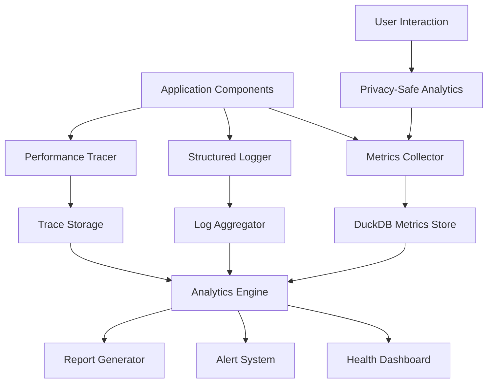

# ADR-008-DELETED: Production Observability

## Title

DELETED - Over-Engineered for Local App

## Version/Date

2.0 / 2025-08-17

## Status

DELETED (Over-Engineering)

## Decision

**DELETE THIS ADR** - Production observability is over-engineered for a local Streamlit app.

## Rationale for Deletion

DocMind AI is a single-user desktop application, not a cloud service. The proposed observability stack includes:

- OpenTelemetry integration
- Prometheus metrics
- Grafana dashboards
- Distributed tracing
- User analytics

This is massive over-engineering. Instead, use:

```python
# Simple Python logging is sufficient
import logging

logging.basicConfig(level=logging.INFO)
logger = logging.getLogger(__name__)

logger.info("Query processed", extra={"query": query, "latency": latency})
```

That's it. No need for complex observability infrastructure.

## Context

Current architecture lacks systematic observability, making it difficult to:

1. **Diagnose Issues**: No structured logging or error tracking for debugging
2. **Monitor Performance**: Limited visibility into system bottlenecks and resource usage
3. **Track Quality**: No metrics for retrieval accuracy, user satisfaction, or system health
4. **Optimize Operations**: Insufficient data for performance tuning and capacity planning
5. **User Experience**: No insights into actual usage patterns and pain points

A modern observability system enables proactive issue resolution, performance optimization, and evidence-based product improvements while respecting user privacy in a local-first application.

## Related Requirements

### Functional Requirements

- **FR-1:** Collect and analyze system performance metrics in real-time
- **FR-2:** Provide structured logging with configurable verbosity levels
- **FR-3:** Monitor user interaction patterns and system usage analytics
- **FR-4:** Track RAG quality metrics (retrieval accuracy, response relevance)
- **FR-5:** Generate automated health reports and alerts

### Non-Functional Requirements

- **NFR-1:** **(Performance)** Observability overhead <2% of system resources
- **NFR-2:** **(Privacy)** All data collection remains local with opt-in user analytics
- **NFR-3:** **(Storage)** Metrics retention configurable (1 day to 30 days)
- **NFR-4:** **(Real-time)** Key metrics updated within 1 second of events

## Alternatives

### 1. Basic Logging Only

- **Description**: Simple file-based logging without metrics or analytics
- **Issues**: Limited debugging capability, no performance insights, reactive-only
- **Score**: 3/10 (simplicity: 8, capability: 1, value: 1)

### 2. Cloud Observability (DataDog/New Relic)

- **Description**: Use external observability platforms
- **Issues**: Violates local-first principle, ongoing costs, privacy concerns
- **Score**: 5/10 (capability: 9, local-first: 0, privacy: 2)

### 3. Self-hosted Monitoring Stack (Prometheus/Grafana)

- **Description**: Deploy full monitoring infrastructure locally
- **Issues**: Over-engineered for single-user app, complex setup, resource intensive
- **Score**: 6/10 (capability: 8, complexity: 3, resource-usage: 4)

### 4. Embedded Observability System (Selected)

- **Description**: Lightweight observability built into the application
- **Benefits**: Local-first, privacy-preserving, tailored to RAG workloads
- **Score**: 9/10 (capability: 8, simplicity: 9, privacy: 10)

## Decision

We will implement an **Embedded Observability System** with:

### Core Components

1. **Structured Logging**: JSON-formatted logs with correlation IDs
2. **Metrics Collection**: Time-series metrics stored in DuckDB
3. **Performance Monitoring**: Real-time latency and resource tracking
4. **Quality Analytics**: RAG-specific quality and accuracy metrics
5. **Health Dashboard**: Web interface for system status and insights
6. **Alert System**: Configurable thresholds with notification support

## Related Decisions

- **ADR-007-NEW** (Hybrid Persistence Strategy): Uses DuckDB for metrics storage
- **ADR-001-NEW** (Modern Agentic RAG): Monitors agent decision quality
- **ADR-003-NEW** (Adaptive Retrieval Pipeline): Tracks retrieval strategy effectiveness
- **ADR-006-NEW** (Modern Reranking Architecture): Monitors reranking performance

## Design

### Observability Architecture



### Core Observability Infrastructure

```python
import logging
import time
import threading
import uuid
from typing import Dict, List, Optional, Any, Callable
from dataclasses import dataclass, asdict
from enum import Enum
from contextlib import contextmanager
from functools import wraps
import json
import psutil
import threading
from datetime import datetime, timedelta

class LogLevel(Enum):
    DEBUG = "DEBUG"
    INFO = "INFO"
    WARNING = "WARNING"
    ERROR = "ERROR"
    CRITICAL = "CRITICAL"

class MetricType(Enum):
    COUNTER = "counter"
    GAUGE = "gauge"
    HISTOGRAM = "histogram"
    TIMER = "timer"

@dataclass
class MetricPoint:
    """Individual metric data point."""
    timestamp: datetime
    metric_name: str
    metric_type: MetricType
    value: float
    labels: Dict[str, str]
    correlation_id: Optional[str] = None

@dataclass
class LogEntry:
    """Structured log entry."""
    timestamp: datetime
    level: LogLevel
    message: str
    component: str
    correlation_id: Optional[str] = None
    metadata: Optional[Dict[str, Any]] = None
    stack_trace: Optional[str] = None

class ObservabilityConfig:
    """Configuration for observability system."""
    
    def __init__(self):
        self.log_level = LogLevel.INFO
        self.metrics_retention_days = 7
        self.enable_performance_tracing = True
        self.enable_user_analytics = False  # Opt-in
        self.alert_thresholds = {
            'response_latency_p95': 5000,  # ms
            'error_rate': 0.05,  # 5%
            'memory_usage': 0.85,  # 85%
            'disk_usage': 0.90   # 90%
        }
        self.dashboard_update_interval = 5  # seconds

class MetricsCollector:
    """Thread-safe metrics collection system."""
    
    def __init__(self, storage_manager):
        self.storage_manager = storage_manager
        self.metrics_buffer = []
        self.buffer_lock = threading.Lock()
        self.flush_interval = 10  # seconds
        self._start_flush_worker()
    
    def record_metric(
        self,
        name: str,
        value: float,
        metric_type: MetricType,
        labels: Optional[Dict[str, str]] = None,
        correlation_id: Optional[str] = None
    ):
        """Record a metric point."""
        metric = MetricPoint(
            timestamp=datetime.now(),
            metric_name=name,
            metric_type=metric_type,
            value=value,
            labels=labels or {},
            correlation_id=correlation_id
        )
        
        with self.buffer_lock:
            self.metrics_buffer.append(metric)
    
    def increment_counter(self, name: str, labels: Optional[Dict[str, str]] = None):
        """Increment a counter metric."""
        self.record_metric(name, 1.0, MetricType.COUNTER, labels)
    
    def set_gauge(self, name: str, value: float, labels: Optional[Dict[str, str]] = None):
        """Set a gauge metric value."""
        self.record_metric(name, value, MetricType.GAUGE, labels)
    
    def record_timer(self, name: str, duration_ms: float, labels: Optional[Dict[str, str]] = None):
        """Record a timing metric."""
        self.record_metric(name, duration_ms, MetricType.TIMER, labels)
    
    def _start_flush_worker(self):
        """Start background worker to flush metrics to storage."""
        def flush_worker():
            while True:
                time.sleep(self.flush_interval)
                self._flush_metrics()
        
        worker_thread = threading.Thread(target=flush_worker, daemon=True)
        worker_thread.start()
    
    def _flush_metrics(self):
        """Flush buffered metrics to storage."""
        with self.buffer_lock:
            if not self.metrics_buffer:
                return
            
            metrics_to_flush = self.metrics_buffer.copy()
            self.metrics_buffer.clear()
        
        # Store metrics in DuckDB
        for metric in metrics_to_flush:
            metric_data = {
                'timestamp': metric.timestamp,
                'metric_name': metric.metric_name,
                'metric_type': metric.metric_type.value,
                'metric_value': metric.value,
                'labels_json': json.dumps(metric.labels),
                'correlation_id': metric.correlation_id
            }
            
            self.storage_manager.store_data(
                StorageBackend.DUCKDB,
                f"metrics_{metric.metric_name}",
                metric_data
            )

class StructuredLogger:
    """Structured logging with correlation ID support."""
    
    def __init__(self, component_name: str, config: ObservabilityConfig):
        self.component_name = component_name
        self.config = config
        self.logger = logging.getLogger(component_name)
        self._setup_logger()
    
    def _setup_logger(self):
        """Configure structured JSON logging."""
        handler = logging.StreamHandler()
        formatter = StructuredFormatter()
        handler.setFormatter(formatter)
        
        self.logger.addHandler(handler)
        self.logger.setLevel(getattr(logging, self.config.log_level.value))
    
    def log(
        self,
        level: LogLevel,
        message: str,
        correlation_id: Optional[str] = None,
        **metadata
    ):
        """Log a structured message."""
        log_entry = LogEntry(
            timestamp=datetime.now(),
            level=level,
            message=message,
            component=self.component_name,
            correlation_id=correlation_id,
            metadata=metadata
        )
        
        # Convert to dict for JSON serialization
        log_data = asdict(log_entry)
        log_data['timestamp'] = log_data['timestamp'].isoformat()
        log_data['level'] = log_data['level'].value
        
        getattr(self.logger, level.value.lower())(json.dumps(log_data))
    
    def debug(self, message: str, **kwargs):
        self.log(LogLevel.DEBUG, message, **kwargs)
    
    def info(self, message: str, **kwargs):
        self.log(LogLevel.INFO, message, **kwargs)
    
    def warning(self, message: str, **kwargs):
        self.log(LogLevel.WARNING, message, **kwargs)
    
    def error(self, message: str, **kwargs):
        self.log(LogLevel.ERROR, message, **kwargs)
    
    def critical(self, message: str, **kwargs):
        self.log(LogLevel.CRITICAL, message, **kwargs)

class StructuredFormatter(logging.Formatter):
    """Custom formatter for structured JSON logs."""
    
    def format(self, record):
        # The record.msg should already be JSON from StructuredLogger
        return record.msg

class PerformanceTracer:
    """Performance tracing and measurement."""
    
    def __init__(self, metrics_collector: MetricsCollector):
        self.metrics_collector = metrics_collector
        self.active_traces = {}
        self.trace_lock = threading.Lock()
    
    @contextmanager
    def trace_operation(self, operation_name: str, correlation_id: Optional[str] = None):
        """Context manager for tracing operation performance."""
        trace_id = str(uuid.uuid4())
        start_time = time.time()
        
        with self.trace_lock:
            self.active_traces[trace_id] = {
                'operation': operation_name,
                'start_time': start_time,
                'correlation_id': correlation_id
            }
        
        try:
            yield trace_id
        finally:
            end_time = time.time()
            duration_ms = (end_time - start_time) * 1000
            
            # Record timing metric
            self.metrics_collector.record_timer(
                f"{operation_name}_duration",
                duration_ms,
                labels={'operation': operation_name},
                correlation_id=correlation_id
            )
            
            with self.trace_lock:
                if trace_id in self.active_traces:
                    del self.active_traces[trace_id]
    
    def measure_function(self, operation_name: Optional[str] = None):
        """Decorator for automatic function performance measurement."""
        def decorator(func: Callable):
            @wraps(func)
            def wrapper(*args, **kwargs):
                op_name = operation_name or f"{func.__module__}.{func.__name__}"
                with self.trace_operation(op_name):
                    return func(*args, **kwargs)
            return wrapper
        return decorator

class SystemMetricsCollector:
    """Collects system-level performance metrics."""
    
    def __init__(self, metrics_collector: MetricsCollector):
        self.metrics_collector = metrics_collector
        self.collection_interval = 30  # seconds
        self._start_collection()
    
    def _start_collection(self):
        """Start background system metrics collection."""
        def collect_worker():
            while True:
                self._collect_system_metrics()
                time.sleep(self.collection_interval)
        
        worker_thread = threading.Thread(target=collect_worker, daemon=True)
        worker_thread.start()
    
    def _collect_system_metrics(self):
        """Collect current system metrics."""
        # CPU usage
        cpu_percent = psutil.cpu_percent(interval=1)
        self.metrics_collector.set_gauge("system_cpu_usage", cpu_percent)
        
        # Memory usage
        memory = psutil.virtual_memory()
        self.metrics_collector.set_gauge("system_memory_usage", memory.percent)
        self.metrics_collector.set_gauge("system_memory_available_gb", memory.available / (1024**3))
        
        # Disk usage
        disk = psutil.disk_usage('.')
        disk_percent = (disk.used / disk.total) * 100
        self.metrics_collector.set_gauge("system_disk_usage", disk_percent)
        
        # GPU metrics if available
        try:
            import GPUtil
            gpus = GPUtil.getGPUs()
            if gpus:
                gpu = gpus[0]  # Primary GPU
                self.metrics_collector.set_gauge("gpu_memory_usage", gpu.memoryUtil * 100)
                self.metrics_collector.set_gauge("gpu_utilization", gpu.load * 100)
                self.metrics_collector.set_gauge("gpu_temperature", gpu.temperature)
        except ImportError:
            pass  # GPU monitoring not available

class RAGQualityAnalyzer:
    """Analyzes RAG-specific quality metrics."""
    
    def __init__(self, metrics_collector: MetricsCollector, logger: StructuredLogger):
        self.metrics_collector = metrics_collector
        self.logger = logger
        self.quality_history = []
    
    def analyze_retrieval_quality(
        self,
        query: str,
        retrieved_docs: List[Any],
        final_answer: str,
        user_feedback: Optional[Dict] = None,
        correlation_id: Optional[str] = None
    ):
        """Analyze quality of retrieval and response generation."""
        
        # Basic quality metrics
        retrieval_count = len(retrieved_docs)
        avg_doc_length = sum(len(doc.content) for doc in retrieved_docs) / max(retrieval_count, 1)
        
        self.metrics_collector.set_gauge(
            "retrieval_document_count",
            retrieval_count,
            labels={'query_type': self._classify_query_type(query)}
        )
        
        self.metrics_collector.set_gauge(
            "retrieval_avg_doc_length",
            avg_doc_length
        )
        
        # Response quality metrics
        response_length = len(final_answer)
        self.metrics_collector.set_gauge("response_length", response_length)
        
        # User feedback integration
        if user_feedback:
            satisfaction = user_feedback.get('satisfaction', 0)  # 1-5 scale
            relevance = user_feedback.get('relevance', 0)  # 1-5 scale
            
            self.metrics_collector.set_gauge("user_satisfaction", satisfaction)
            self.metrics_collector.set_gauge("response_relevance", relevance)
            
            self.logger.info(
                "User feedback received",
                correlation_id=correlation_id,
                satisfaction=satisfaction,
                relevance=relevance,
                query_length=len(query),
                response_length=response_length
            )
        
        # Store for trend analysis
        quality_point = {
            'timestamp': datetime.now(),
            'query': query[:100],  # Truncate for privacy
            'retrieval_count': retrieval_count,
            'response_length': response_length,
            'user_feedback': user_feedback,
            'correlation_id': correlation_id
        }
        
        self.quality_history.append(quality_point)
        
        # Keep only recent history
        if len(self.quality_history) > 1000:
            self.quality_history = self.quality_history[-500:]
    
    def _classify_query_type(self, query: str) -> str:
        """Simple query classification for metrics."""
        query_lower = query.lower()
        
        if len(query) < 20:
            return "short"
        elif any(word in query_lower for word in ['explain', 'how', 'why']):
            return "explanatory"
        elif any(word in query_lower for word in ['compare', 'vs', 'difference']):
            return "comparative"
        else:
            return "factual"
    
    def get_quality_summary(self, days: int = 7) -> Dict[str, Any]:
        """Get quality metrics summary for the last N days."""
        cutoff_time = datetime.now() - timedelta(days=days)
        
        recent_points = [
            point for point in self.quality_history
            if point['timestamp'] > cutoff_time
        ]
        
        if not recent_points:
            return {'total_queries': 0}
        
        total_queries = len(recent_points)
        avg_retrieval_count = sum(p['retrieval_count'] for p in recent_points) / total_queries
        avg_response_length = sum(p['response_length'] for p in recent_points) / total_queries
        
        # User feedback summary
        feedback_points = [p for p in recent_points if p['user_feedback']]
        if feedback_points:
            avg_satisfaction = sum(
                p['user_feedback']['satisfaction'] for p in feedback_points
                if 'satisfaction' in p['user_feedback']
            ) / len(feedback_points)
        else:
            avg_satisfaction = None
        
        return {
            'total_queries': total_queries,
            'avg_retrieval_count': avg_retrieval_count,
            'avg_response_length': avg_response_length,
            'feedback_count': len(feedback_points),
            'avg_satisfaction': avg_satisfaction
        }

class AlertSystem:
    """Configurable alerting for system health."""
    
    def __init__(self, config: ObservabilityConfig, metrics_collector: MetricsCollector):
        self.config = config
        self.metrics_collector = metrics_collector
        self.alert_states = {}
        self.check_interval = 60  # seconds
        self._start_monitoring()
    
    def _start_monitoring(self):
        """Start background health monitoring."""
        def monitor_worker():
            while True:
                self._check_alert_conditions()
                time.sleep(self.check_interval)
        
        worker_thread = threading.Thread(target=monitor_worker, daemon=True)
        worker_thread.start()
    
    def _check_alert_conditions(self):
        """Check all configured alert thresholds."""
        # Check response latency
        self._check_metric_threshold(
            'response_latency_p95',
            self.config.alert_thresholds['response_latency_p95'],
            'greater'
        )
        
        # Check error rate
        self._check_metric_threshold(
            'error_rate',
            self.config.alert_thresholds['error_rate'],
            'greater'
        )
        
        # Check system metrics
        self._check_metric_threshold(
            'system_memory_usage',
            self.config.alert_thresholds['memory_usage'] * 100,
            'greater'
        )
        
        self._check_metric_threshold(
            'system_disk_usage',
            self.config.alert_thresholds['disk_usage'] * 100,
            'greater'
        )
    
    def _check_metric_threshold(self, metric_name: str, threshold: float, comparison: str):
        """Check if metric exceeds threshold."""
        # This would query recent metric values from DuckDB
        # For now, simplified implementation
        current_value = self._get_current_metric_value(metric_name)
        
        if current_value is None:
            return
        
        is_alert = False
        if comparison == 'greater' and current_value > threshold:
            is_alert = True
        elif comparison == 'less' and current_value < threshold:
            is_alert = True
        
        # Manage alert state
        was_alerting = self.alert_states.get(metric_name, False)
        
        if is_alert and not was_alerting:
            self._trigger_alert(metric_name, current_value, threshold)
        elif not is_alert and was_alerting:
            self._resolve_alert(metric_name, current_value)
        
        self.alert_states[metric_name] = is_alert
    
    def _get_current_metric_value(self, metric_name: str) -> Optional[float]:
        """Get current value for metric (simplified)."""
        # In real implementation, would query DuckDB for recent metric values
        # For now, return None to indicate no data
        return None
    
    def _trigger_alert(self, metric_name: str, current_value: float, threshold: float):
        """Trigger alert for metric threshold breach."""
        alert_message = f"ALERT: {metric_name} = {current_value} exceeds threshold {threshold}"
        
        # Log alert
        logger = StructuredLogger("AlertSystem", self.config)
        logger.warning(
            alert_message,
            metric_name=metric_name,
            current_value=current_value,
            threshold=threshold
        )
        
        # Record alert metric
        self.metrics_collector.increment_counter(
            "alerts_triggered",
            labels={'metric': metric_name}
        )
    
    def _resolve_alert(self, metric_name: str, current_value: float):
        """Resolve alert when metric returns to normal."""
        logger = StructuredLogger("AlertSystem", self.config)
        logger.info(
            f"RESOLVED: {metric_name} returned to normal: {current_value}",
            metric_name=metric_name,
            current_value=current_value
        )

class ObservabilityManager:
    """Central manager for all observability components."""
    
    def __init__(self, storage_manager, config: ObservabilityConfig = None):
        self.config = config or ObservabilityConfig()
        self.storage_manager = storage_manager
        
        # Initialize components
        self.metrics_collector = MetricsCollector(storage_manager)
        self.performance_tracer = PerformanceTracer(self.metrics_collector)
        self.system_metrics = SystemMetricsCollector(self.metrics_collector)
        self.alert_system = AlertSystem(self.config, self.metrics_collector)
        
        # Component loggers
        self.loggers = {}
    
    def get_logger(self, component_name: str) -> StructuredLogger:
        """Get or create logger for component."""
        if component_name not in self.loggers:
            self.loggers[component_name] = StructuredLogger(component_name, self.config)
        return self.loggers[component_name]
    
    def create_quality_analyzer(self, component_name: str) -> RAGQualityAnalyzer:
        """Create quality analyzer for RAG components."""
        logger = self.get_logger(component_name)
        return RAGQualityAnalyzer(self.metrics_collector, logger)
    
    def get_system_health(self) -> Dict[str, Any]:
        """Get current system health status."""
        # Get recent metrics from storage
        # This would query DuckDB for current system state
        return {
            'status': 'healthy',  # or 'warning', 'critical'
            'active_alerts': len([a for a in self.alert_system.alert_states.values() if a]),
            'uptime_hours': 24,  # placeholder
            'total_queries_today': 150,  # placeholder
            'avg_response_time_ms': 1200  # placeholder
        }

# Decorators for easy integration
def observe_performance(observability_manager: ObservabilityManager, operation_name: str = None):
    """Decorator to automatically trace function performance."""
    def decorator(func):
        op_name = operation_name or f"{func.__module__}.{func.__name__}"
        return observability_manager.performance_tracer.measure_function(op_name)(func)
    return decorator

def log_errors(observability_manager: ObservabilityManager, component_name: str):
    """Decorator to automatically log function errors."""
    def decorator(func):
        @wraps(func)
        def wrapper(*args, **kwargs):
            logger = observability_manager.get_logger(component_name)
            try:
                return func(*args, **kwargs)
            except Exception as e:
                logger.error(
                    f"Error in {func.__name__}: {str(e)}",
                    function_name=func.__name__,
                    error_type=type(e).__name__,
                    stack_trace=str(e)
                )
                raise
        return wrapper
    return decorator
```

## Consequences

### Positive Outcomes

- **Proactive Issue Detection**: Real-time monitoring enables early problem identification
- **Performance Optimization**: Detailed metrics guide optimization efforts
- **Quality Assurance**: RAG-specific analytics improve system effectiveness
- **User Experience**: Understanding usage patterns enables better product decisions
- **Privacy Preservation**: Local-first approach protects user data while enabling insights
- **Operational Excellence**: Comprehensive observability supports reliable production deployment

### Negative Consequences / Trade-offs

- **Resource Overhead**: Metrics collection and storage consume system resources
- **Complexity**: Additional components increase system complexity
- **Storage Requirements**: Metrics and logs require additional storage space
- **Development Overhead**: Instrumentation requires additional development effort

### Performance Targets

- **Observability Overhead**: <2% of total system resource usage
- **Metric Collection Latency**: <1ms for metric recording
- **Dashboard Update Frequency**: Real-time updates every 5 seconds
- **Storage Efficiency**: Compressed metrics storage <100MB per month
- **Alert Response Time**: Alerts triggered within 1 minute of threshold breach

## Dependencies

- **Python**: `psutil>=5.9.0`, `GPUtil>=1.4.0` (optional), `logging` (built-in)
- **Storage**: DuckDB for metrics, local filesystem for logs
- **Optional**: Web framework for dashboard (FastAPI/Streamlit)

## Monitoring Metrics

- Observability system performance (collection latency, storage usage)
- Alert accuracy and response times
- Dashboard usage and user engagement
- System health trend analysis
- RAG quality metrics correlations

## Privacy Considerations

- All metrics stored locally, no external transmission
- User analytics are opt-in only
- Query content truncated/hashed for privacy
- Personal information excluded from all logging

## Changelog

- **1.0 (2025-01-16)**: Initial production observability design with comprehensive metrics, logging, and health monitoring
