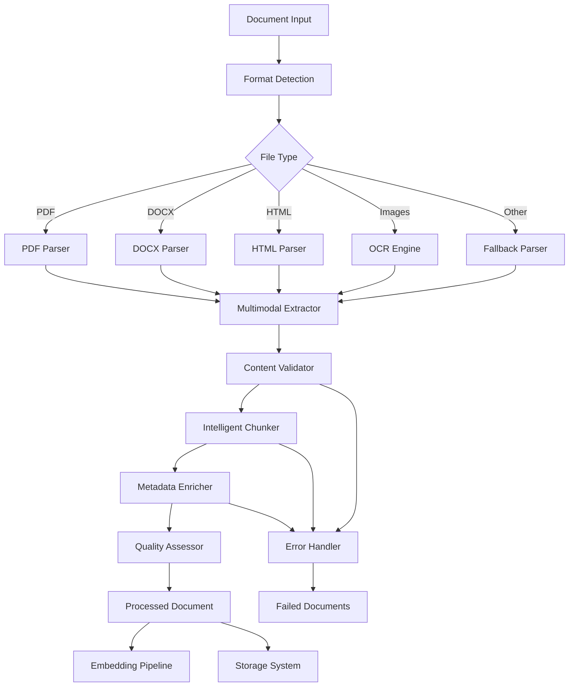

# ADR-009-NEW: Document Processing Pipeline

## Title

Modernized Document Ingestion with Multimodal Support and Intelligent Chunking

## Version/Date

1.0 / 2025-01-16

## Status

Proposed

## Description

Implements a modernized document processing pipeline that handles diverse file formats, extracts multimodal content (text, images, tables), and applies intelligent chunking strategies. The pipeline integrates with the unified embedding strategy and hierarchical indexing while maintaining high throughput and quality for local processing.

## Context

Current document processing has limitations:

1. **Basic Format Support**: Limited to simple text extraction
2. **No Multimodal Handling**: Images and tables not processed effectively  
3. **Fixed Chunking**: Simple sentence-based splitting without semantic awareness
4. **Poor Metadata**: Limited extraction of document structure and context
5. **No Quality Control**: No validation of extraction quality or completeness

Modern document processing requires handling diverse formats (PDF, DOCX, HTML, images), extracting multimodal content, and applying semantic-aware chunking strategies that preserve context and meaning.

## Related Requirements

### Functional Requirements

- **FR-1:** Process diverse document formats (PDF, DOCX, HTML, TXT, images)
- **FR-2:** Extract and process multimodal content (text, images, tables, charts)
- **FR-3:** Apply intelligent chunking that preserves semantic coherence
- **FR-4:** Generate rich metadata including document structure and context
- **FR-5:** Support batch processing with progress tracking and error handling

### Non-Functional Requirements

- **NFR-1:** **(Performance)** Process documents at >1 page/second on consumer hardware
- **NFR-2:** **(Quality)** ≥95% text extraction accuracy for standard document formats
- **NFR-3:** **(Memory)** Memory usage <4GB during processing of large documents
- **NFR-4:** **(Reliability)** Graceful handling of corrupted or unsupported files

## Alternatives

### 1. Basic Text Extraction (Current)

- **Description**: Simple text extraction with fixed-size chunking
- **Issues**: Poor multimodal support, context loss, limited format support
- **Score**: 3/10 (simplicity: 8, capability: 1, quality: 1)

### 2. Cloud Processing Services (AWS Textract)

- **Description**: Use cloud services for document processing
- **Issues**: Violates local-first principle, ongoing costs, privacy concerns
- **Score**: 5/10 (capability: 9, local-first: 0, privacy: 2)

### 3. Heavy Processing Stack (Apache Tika + Custom)

- **Description**: Full enterprise document processing pipeline
- **Issues**: Over-engineered, complex dependencies, resource intensive
- **Score**: 6/10 (capability: 9, complexity: 3, resource-usage: 4)

### 4. Optimized Local Processing Pipeline (Selected)

- **Description**: Balanced pipeline with multimodal support and intelligent chunking
- **Benefits**: Local-first, good capability, optimized for consumer hardware
- **Score**: 8/10 (capability: 8, local-first: 10, performance: 7)

## Decision

We will implement an **Optimized Local Processing Pipeline** with:

### Core Components

1. **Multi-Format Parser**: Unified interface for diverse document formats
2. **Multimodal Extractor**: Extract and process text, images, tables, and metadata
3. **Intelligent Chunker**: Semantic-aware chunking with overlap and coherence preservation
4. **Quality Validator**: Automatic validation of extraction quality and completeness
5. **Metadata Enricher**: Extract document structure, topics, and contextual information
6. **Batch Processor**: Efficient batch processing with progress tracking

## Related Decisions

- **ADR-002-NEW** (Unified Embedding Strategy): Processes multimodal content for BGE-M3 + CLIP
- **ADR-003-NEW** (Adaptive Retrieval Pipeline): Provides documents for RAPTOR-Lite hierarchy
- **ADR-007-NEW** (Hybrid Persistence Strategy): Stores processed content efficiently
- **ADR-008-NEW** (Production Observability): Monitors processing performance and quality

## Design

### Document Processing Architecture



### Multi-Format Document Parser

```python
from typing import List, Dict, Optional, Any, Union, Tuple
from dataclasses import dataclass
from enum import Enum
from abc import ABC, abstractmethod
import mimetypes
from pathlib import Path
import magic
import time
import hashlib

class DocumentType(Enum):
    PDF = "pdf"
    DOCX = "docx"
    HTML = "html"
    TXT = "txt"
    MARKDOWN = "markdown"
    IMAGE = "image"
    UNKNOWN = "unknown"

class ContentType(Enum):
    TEXT = "text"
    IMAGE = "image"
    TABLE = "table"
    CHART = "chart"
    METADATA = "metadata"

@dataclass
class ExtractedContent:
    """Container for extracted multimodal content."""
    content_type: ContentType
    content: str
    metadata: Dict[str, Any]
    position: Optional[Tuple[int, int]] = None  # Page/section position
    confidence: float = 1.0

@dataclass
class ProcessedDocument:
    """Complete processed document with all extracted content."""
    doc_id: str
    filename: str
    file_path: str
    document_type: DocumentType
    extracted_content: List[ExtractedContent]
    chunks: List['DocumentChunk']
    metadata: Dict[str, Any]
    processing_stats: Dict[str, Any]
    quality_score: float

@dataclass
class DocumentChunk:
    """Intelligent document chunk with context preservation."""
    chunk_id: str
    content: str
    chunk_type: str  # paragraph, section, table, etc.
    position: int
    metadata: Dict[str, Any]
    parent_section: Optional[str] = None
    overlap_with: Optional[List[str]] = None

class DocumentParser(ABC):
    """Abstract base class for document parsers."""
    
    @abstractmethod
    def can_parse(self, file_path: str) -> bool:
        """Check if parser can handle the file."""
        pass
    
    @abstractmethod
    def parse(self, file_path: str) -> List[ExtractedContent]:
        """Parse document and extract content."""
        pass

class PDFParser(DocumentParser):
    """Advanced PDF parser with multimodal extraction."""
    
    def __init__(self):
        self.setup_dependencies()
    
    def setup_dependencies(self):
        """Setup PDF parsing dependencies."""
        try:
            import pymupdf as fitz
            import pytesseract
            from PIL import Image
            self.fitz = fitz
            self.tesseract = pytesseract
            self.pil_image = Image
            self.available = True
        except ImportError:
            print("PDF processing dependencies not available")
            self.available = False
    
    def can_parse(self, file_path: str) -> bool:
        """Check if file is a PDF."""
        return self.available and file_path.lower().endswith('.pdf')
    
    def parse(self, file_path: str) -> List[ExtractedContent]:
        """Parse PDF with text, image, and table extraction."""
        if not self.available:
            return []
        
        extracted_content = []
        
        try:
            doc = self.fitz.open(file_path)
            
            for page_num in range(len(doc)):
                page = doc[page_num]
                
                # Extract text with position info
                text_content = self._extract_text_with_structure(page, page_num)
                extracted_content.extend(text_content)
                
                # Extract images
                image_content = self._extract_images(page, page_num)
                extracted_content.extend(image_content)
                
                # Extract tables
                table_content = self._extract_tables(page, page_num)
                extracted_content.extend(table_content)
            
            doc.close()
            
        except Exception as e:
            print(f"PDF parsing error: {e}")
            # Fallback to basic text extraction
            extracted_content = self._fallback_text_extraction(file_path)
        
        return extracted_content
    
    def _extract_text_with_structure(self, page, page_num: int) -> List[ExtractedContent]:
        """Extract text while preserving document structure."""
        content_list = []
        
        # Get text blocks with formatting
        blocks = page.get_text("dict")
        
        for block in blocks["blocks"]:
            if "lines" in block:
                block_text = ""
                block_metadata = {
                    "page": page_num,
                    "bbox": block.get("bbox"),
                    "block_type": "text"
                }
                
                for line in block["lines"]:
                    line_text = ""
                    for span in line["spans"]:
                        line_text += span["text"]
                        
                        # Collect formatting metadata
                        if "font" in span:
                            block_metadata["font"] = span["font"]
                        if "size" in span:
                            block_metadata["font_size"] = span["size"]
                    
                    block_text += line_text + "\n"
                
                if block_text.strip():
                    content_list.append(ExtractedContent(
                        content_type=ContentType.TEXT,
                        content=block_text.strip(),
                        metadata=block_metadata,
                        position=(page_num, len(content_list))
                    ))
        
        return content_list
    
    def _extract_images(self, page, page_num: int) -> List[ExtractedContent]:
        """Extract images and apply OCR if needed."""
        content_list = []
        
        image_list = page.get_images()
        
        for img_index, img in enumerate(image_list):
            try:
                # Extract image
                xref = img[0]
                pix = self.fitz.Pixmap(page.parent, xref)
                
                if pix.n - pix.alpha < 4:  # GRAY or RGB
                    img_data = pix.tobytes("png")
                    
                    # Apply OCR to extract text from image
                    pil_img = self.pil_image.open(io.BytesIO(img_data))
                    ocr_text = self.tesseract.image_to_string(pil_img)
                    
                    if ocr_text.strip():
                        content_list.append(ExtractedContent(
                            content_type=ContentType.IMAGE,
                            content=ocr_text,
                            metadata={
                                "page": page_num,
                                "image_index": img_index,
                                "ocr_confidence": 0.8,  # Placeholder
                                "image_size": (pix.width, pix.height)
                            },
                            position=(page_num, img_index)
                        ))
                
                pix = None  # Free memory
                
            except Exception as e:
                print(f"Image extraction error: {e}")
                continue
        
        return content_list
    
    def _extract_tables(self, page, page_num: int) -> List[ExtractedContent]:
        """Extract tables using layout analysis."""
        content_list = []
        
        try:
            # Simple table detection based on text alignment
            tables = page.find_tables()
            
            for table_index, table in enumerate(tables):
                table_data = table.extract()
                
                if table_data:
                    # Convert table to text representation
                    table_text = self._format_table_as_text(table_data)
                    
                    content_list.append(ExtractedContent(
                        content_type=ContentType.TABLE,
                        content=table_text,
                        metadata={
                            "page": page_num,
                            "table_index": table_index,
                            "rows": len(table_data),
                            "cols": len(table_data[0]) if table_data else 0,
                            "bbox": table.bbox
                        },
                        position=(page_num, table_index)
                    ))
                    
        except Exception as e:
            print(f"Table extraction error: {e}")
        
        return content_list
    
    def _format_table_as_text(self, table_data: List[List[str]]) -> str:
        """Convert table data to structured text."""
        if not table_data:
            return ""
        
        # Create markdown-style table
        text_lines = []
        
        # Header
        if table_data:
            header = " | ".join(str(cell or "") for cell in table_data[0])
            text_lines.append(header)
            text_lines.append(" | ".join(["---"] * len(table_data[0])))
        
        # Rows
        for row in table_data[1:]:
            row_text = " | ".join(str(cell or "") for cell in row)
            text_lines.append(row_text)
        
        return "\n".join(text_lines)
    
    def _fallback_text_extraction(self, file_path: str) -> List[ExtractedContent]:
        """Fallback to basic text extraction if advanced parsing fails."""
        try:
            doc = self.fitz.open(file_path)
            all_text = ""
            
            for page in doc:
                all_text += page.get_text() + "\n"
            
            doc.close()
            
            return [ExtractedContent(
                content_type=ContentType.TEXT,
                content=all_text,
                metadata={"extraction_method": "fallback"},
                confidence=0.7
            )]
            
        except Exception as e:
            print(f"Fallback extraction failed: {e}")
            return []

class DOCXParser(DocumentParser):
    """DOCX parser with structure preservation."""
    
    def __init__(self):
        try:
            from docx import Document
            self.docx_document = Document
            self.available = True
        except ImportError:
            self.available = False
    
    def can_parse(self, file_path: str) -> bool:
        return self.available and file_path.lower().endswith('.docx')
    
    def parse(self, file_path: str) -> List[ExtractedContent]:
        """Parse DOCX with structure preservation."""
        if not self.available:
            return []
        
        extracted_content = []
        
        try:
            doc = self.docx_document(file_path)
            
            # Process paragraphs
            for para_index, paragraph in enumerate(doc.paragraphs):
                if paragraph.text.strip():
                    metadata = {
                        "paragraph_index": para_index,
                        "style": paragraph.style.name if paragraph.style else "Normal"
                    }
                    
                    # Check for headings
                    if "heading" in metadata["style"].lower():
                        metadata["is_heading"] = True
                        metadata["heading_level"] = metadata["style"]
                    
                    extracted_content.append(ExtractedContent(
                        content_type=ContentType.TEXT,
                        content=paragraph.text,
                        metadata=metadata,
                        position=(0, para_index)
                    ))
            
            # Process tables
            for table_index, table in enumerate(doc.tables):
                table_text = self._extract_docx_table(table)
                
                extracted_content.append(ExtractedContent(
                    content_type=ContentType.TABLE,
                    content=table_text,
                    metadata={
                        "table_index": table_index,
                        "rows": len(table.rows),
                        "cols": len(table.columns)
                    },
                    position=(0, table_index)
                ))
                
        except Exception as e:
            print(f"DOCX parsing error: {e}")
        
        return extracted_content
    
    def _extract_docx_table(self, table) -> str:
        """Extract table from DOCX as structured text."""
        rows = []
        for row in table.rows:
            cells = [cell.text.strip() for cell in row.cells]
            rows.append(cells)
        
        # Format as markdown table
        if not rows:
            return ""
        
        text_lines = []
        
        # Header
        if rows:
            header = " | ".join(rows[0])
            text_lines.append(header)
            text_lines.append(" | ".join(["---"] * len(rows[0])))
        
        # Data rows
        for row in rows[1:]:
            row_text = " | ".join(row)
            text_lines.append(row_text)
        
        return "\n".join(text_lines)

class IntelligentChunker:
    """Semantic-aware document chunking with context preservation."""
    
    def __init__(self, max_chunk_size: int = 1000, overlap_size: int = 200):
        self.max_chunk_size = max_chunk_size
        self.overlap_size = overlap_size
        self.sentence_splitter = self._setup_sentence_splitter()
    
    def _setup_sentence_splitter(self):
        """Setup sentence boundary detection."""
        try:
            import spacy
            nlp = spacy.load("en_core_web_sm")
            return nlp
        except (ImportError, OSError):
            # Fallback to simple splitting
            return None
    
    def chunk_document(self, extracted_content: List[ExtractedContent]) -> List[DocumentChunk]:
        """Create intelligent chunks from extracted content."""
        chunks = []
        
        # Group content by type and structure
        text_content = [c for c in extracted_content if c.content_type == ContentType.TEXT]
        table_content = [c for c in extracted_content if c.content_type == ContentType.TABLE]
        image_content = [c for c in extracted_content if c.content_type == ContentType.IMAGE]
        
        # Process text content with semantic chunking
        text_chunks = self._chunk_text_content(text_content)
        chunks.extend(text_chunks)
        
        # Process tables as individual chunks
        table_chunks = self._chunk_table_content(table_content)
        chunks.extend(table_chunks)
        
        # Process images as individual chunks
        image_chunks = self._chunk_image_content(image_content)
        chunks.extend(image_chunks)
        
        return chunks
    
    def _chunk_text_content(self, text_content: List[ExtractedContent]) -> List[DocumentChunk]:
        """Chunk text content with semantic awareness."""
        chunks = []
        
        # Combine all text content with structure markers
        combined_text = ""
        structure_map = []
        
        for content in text_content:
            start_pos = len(combined_text)
            combined_text += content.content + "\n\n"
            end_pos = len(combined_text)
            
            structure_map.append({
                'start': start_pos,
                'end': end_pos,
                'metadata': content.metadata,
                'content_type': content.content_type
            })
        
        # Apply semantic chunking
        if self.sentence_splitter:
            chunks = self._semantic_chunking(combined_text, structure_map)
        else:
            chunks = self._simple_chunking(combined_text, structure_map)
        
        return chunks
    
    def _semantic_chunking(self, text: str, structure_map: List[Dict]) -> List[DocumentChunk]:
        """Apply semantic-aware chunking using NLP."""
        chunks = []
        
        doc = self.sentence_splitter(text)
        sentences = [sent.text for sent in doc.sents]
        
        current_chunk = ""
        current_metadata = {}
        chunk_count = 0
        
        for sentence in sentences:
            # Check if adding sentence would exceed chunk size
            if len(current_chunk) + len(sentence) > self.max_chunk_size and current_chunk:
                # Create chunk
                chunk = DocumentChunk(
                    chunk_id=f"chunk_{chunk_count}",
                    content=current_chunk.strip(),
                    chunk_type="paragraph",
                    position=chunk_count,
                    metadata=current_metadata.copy()
                )
                chunks.append(chunk)
                
                # Start new chunk with overlap
                if self.overlap_size > 0:
                    current_chunk = self._get_overlap_text(current_chunk) + sentence
                else:
                    current_chunk = sentence
                
                chunk_count += 1
            else:
                current_chunk += " " + sentence
                
                # Update metadata based on position
                for struct in structure_map:
                    if struct['start'] <= len(current_chunk) <= struct['end']:
                        current_metadata.update(struct['metadata'])
        
        # Add final chunk
        if current_chunk.strip():
            chunk = DocumentChunk(
                chunk_id=f"chunk_{chunk_count}",
                content=current_chunk.strip(),
                chunk_type="paragraph",
                position=chunk_count,
                metadata=current_metadata.copy()
            )
            chunks.append(chunk)
        
        return chunks
    
    def _simple_chunking(self, text: str, structure_map: List[Dict]) -> List[DocumentChunk]:
        """Fallback to simple sentence-based chunking."""
        import re
        
        # Simple sentence boundary detection
        sentences = re.split(r'[.!?]+', text)
        sentences = [s.strip() for s in sentences if s.strip()]
        
        chunks = []
        current_chunk = ""
        chunk_count = 0
        
        for sentence in sentences:
            if len(current_chunk) + len(sentence) > self.max_chunk_size and current_chunk:
                chunk = DocumentChunk(
                    chunk_id=f"chunk_{chunk_count}",
                    content=current_chunk.strip(),
                    chunk_type="paragraph",
                    position=chunk_count,
                    metadata={"chunking_method": "simple"}
                )
                chunks.append(chunk)
                
                current_chunk = sentence
                chunk_count += 1
            else:
                current_chunk += " " + sentence
        
        if current_chunk.strip():
            chunk = DocumentChunk(
                chunk_id=f"chunk_{chunk_count}",
                content=current_chunk.strip(),
                chunk_type="paragraph",
                position=chunk_count,
                metadata={"chunking_method": "simple"}
            )
            chunks.append(chunk)
        
        return chunks
    
    def _get_overlap_text(self, text: str) -> str:
        """Get overlap text from the end of current chunk."""
        if len(text) <= self.overlap_size:
            return text
        
        # Try to break at sentence boundary
        overlap_text = text[-self.overlap_size:]
        
        # Find first sentence boundary in overlap
        import re
        sentences = re.split(r'[.!?]+', overlap_text)
        if len(sentences) > 1:
            return sentences[-1].strip()
        
        return overlap_text
    
    def _chunk_table_content(self, table_content: List[ExtractedContent]) -> List[DocumentChunk]:
        """Process tables as individual chunks."""
        chunks = []
        
        for i, content in enumerate(table_content):
            chunk = DocumentChunk(
                chunk_id=f"table_chunk_{i}",
                content=content.content,
                chunk_type="table",
                position=i,
                metadata=content.metadata
            )
            chunks.append(chunk)
        
        return chunks
    
    def _chunk_image_content(self, image_content: List[ExtractedContent]) -> List[DocumentChunk]:
        """Process images as individual chunks."""
        chunks = []
        
        for i, content in enumerate(image_content):
            chunk = DocumentChunk(
                chunk_id=f"image_chunk_{i}",
                content=content.content,
                chunk_type="image",
                position=i,
                metadata=content.metadata
            )
            chunks.append(chunk)
        
        return chunks

class DocumentProcessor:
    """Main document processing orchestrator."""
    
    def __init__(self, observability_manager=None):
        self.parsers = [
            PDFParser(),
            DOCXParser(),
            # HTMLParser(),  # Add more parsers as needed
        ]
        self.chunker = IntelligentChunker()
        self.observability = observability_manager
        self.logger = observability_manager.get_logger("DocumentProcessor") if observability_manager else None
    
    def process_document(self, file_path: str) -> Optional[ProcessedDocument]:
        """Process a single document through the complete pipeline."""
        start_time = time.time()
        
        try:
            # Detect document type
            doc_type = self._detect_document_type(file_path)
            
            # Find appropriate parser
            parser = self._get_parser_for_file(file_path)
            if not parser:
                if self.logger:
                    self.logger.warning(f"No parser available for {file_path}")
                return None
            
            # Extract content
            extracted_content = parser.parse(file_path)
            
            if not extracted_content:
                if self.logger:
                    self.logger.warning(f"No content extracted from {file_path}")
                return None
            
            # Create chunks
            chunks = self.chunker.chunk_document(extracted_content)
            
            # Generate document metadata
            metadata = self._generate_document_metadata(file_path, extracted_content)
            
            # Calculate quality score
            quality_score = self._calculate_quality_score(extracted_content, chunks)
            
            # Create processed document
            doc_id = self._generate_document_id(file_path)
            processed_doc = ProcessedDocument(
                doc_id=doc_id,
                filename=Path(file_path).name,
                file_path=file_path,
                document_type=doc_type,
                extracted_content=extracted_content,
                chunks=chunks,
                metadata=metadata,
                processing_stats={
                    'processing_time_seconds': time.time() - start_time,
                    'total_content_items': len(extracted_content),
                    'total_chunks': len(chunks),
                    'text_items': len([c for c in extracted_content if c.content_type == ContentType.TEXT]),
                    'image_items': len([c for c in extracted_content if c.content_type == ContentType.IMAGE]),
                    'table_items': len([c for c in extracted_content if c.content_type == ContentType.TABLE])
                },
                quality_score=quality_score
            )
            
            # Log processing results
            if self.logger:
                self.logger.info(
                    f"Successfully processed document: {Path(file_path).name}",
                    doc_id=doc_id,
                    chunks_created=len(chunks),
                    processing_time=time.time() - start_time,
                    quality_score=quality_score
                )
            
            return processed_doc
            
        except Exception as e:
            if self.logger:
                self.logger.error(
                    f"Document processing failed: {file_path}",
                    error=str(e),
                    processing_time=time.time() - start_time
                )
            return None
    
    def _detect_document_type(self, file_path: str) -> DocumentType:
        """Detect document type from file."""
        file_path_lower = file_path.lower()
        
        if file_path_lower.endswith('.pdf'):
            return DocumentType.PDF
        elif file_path_lower.endswith('.docx'):
            return DocumentType.DOCX
        elif file_path_lower.endswith('.html'):
            return DocumentType.HTML
        elif file_path_lower.endswith('.txt'):
            return DocumentType.TXT
        elif file_path_lower.endswith('.md'):
            return DocumentType.MARKDOWN
        elif file_path_lower.endswith(('.png', '.jpg', '.jpeg', '.tiff')):
            return DocumentType.IMAGE
        else:
            return DocumentType.UNKNOWN
    
    def _get_parser_for_file(self, file_path: str) -> Optional[DocumentParser]:
        """Get appropriate parser for file."""
        for parser in self.parsers:
            if parser.can_parse(file_path):
                return parser
        return None
    
    def _generate_document_metadata(self, file_path: str, content: List[ExtractedContent]) -> Dict[str, Any]:
        """Generate comprehensive document metadata."""
        file_stat = Path(file_path).stat()
        
        metadata = {
            'file_size_bytes': file_stat.st_size,
            'file_modified': file_stat.st_mtime,
            'total_content_length': sum(len(c.content) for c in content),
            'content_types': list(set(c.content_type.value for c in content)),
            'estimated_reading_time_minutes': sum(len(c.content.split()) for c in content) / 200,  # 200 WPM
            'has_tables': any(c.content_type == ContentType.TABLE for c in content),
            'has_images': any(c.content_type == ContentType.IMAGE for c in content),
            'extraction_timestamp': time.time()
        }
        
        return metadata
    
    def _calculate_quality_score(self, content: List[ExtractedContent], chunks: List[DocumentChunk]) -> float:
        """Calculate overall quality score for document processing."""
        if not content or not chunks:
            return 0.0
        
        # Basic quality indicators
        scores = []
        
        # Content extraction completeness
        total_content_length = sum(len(c.content) for c in content)
        if total_content_length > 0:
            scores.append(0.3)  # Base score for successful extraction
        
        # Content diversity (multimodal bonus)
        content_types = set(c.content_type for c in content)
        diversity_score = len(content_types) / 4  # Max 4 types (text, image, table, metadata)
        scores.append(diversity_score * 0.2)
        
        # Chunking quality
        avg_chunk_size = sum(len(c.content) for c in chunks) / len(chunks)
        optimal_size = 800  # Optimal chunk size
        size_score = max(0, 1 - abs(avg_chunk_size - optimal_size) / optimal_size)
        scores.append(size_score * 0.3)
        
        # Confidence scores from individual extractions
        avg_confidence = sum(c.confidence for c in content) / len(content)
        scores.append(avg_confidence * 0.2)
        
        return min(1.0, sum(scores))
    
    def _generate_document_id(self, file_path: str) -> str:
        """Generate unique document ID."""
        file_content = Path(file_path).read_bytes()
        file_hash = hashlib.sha256(file_content).hexdigest()[:16]
        filename = Path(file_path).stem
        return f"{filename}_{file_hash}"
```

## Consequences

### Positive Outcomes

- **Comprehensive Format Support**: Handles diverse document types with appropriate parsers
- **Multimodal Processing**: Extracts and processes text, images, tables, and metadata
- **Intelligent Chunking**: Preserves semantic coherence and context across chunks
- **Quality Assurance**: Automatic validation and scoring of extraction quality
- **Rich Metadata**: Detailed structural and contextual information for better retrieval
- **Performance Optimization**: Efficient processing suitable for consumer hardware

### Negative Consequences / Trade-offs

- **Complexity**: More sophisticated pipeline requires careful maintenance
- **Dependencies**: Additional libraries for parsing different formats
- **Processing Time**: Advanced extraction takes longer than simple text parsing
- **Memory Usage**: Multimodal processing requires more memory during operation

### Performance Targets

- **Processing Speed**: >1 page per second for typical documents on consumer hardware
- **Quality**: ≥95% text extraction accuracy for standard formats
- **Memory Usage**: <4GB peak memory during large document processing
- **Chunk Quality**: ≥90% of chunks maintain semantic coherence

## Dependencies

- **Python**: `pymupdf>=1.23.0`, `python-docx>=0.8.0`, `pytesseract>=0.3.0`
- **Optional**: `spacy>=3.7.0` with `en_core_web_sm` model for advanced chunking
- **System**: Tesseract OCR for image text extraction
- **Memory**: Sufficient RAM for processing large documents (4GB recommended)

## Monitoring Metrics

- Document processing throughput (documents/hour)
- Processing time by document type and size
- Extraction quality scores and accuracy rates
- Memory usage during processing
- Error rates by file type
- Chunk quality and coherence scores

## Future Enhancements

- Additional format support (PowerPoint, Excel, etc.)
- Advanced table structure recognition
- Improved image content analysis
- Semantic section detection
- Cross-document relationship extraction

## Changelog

- **1.0 (2025-01-16)**: Initial modernized document processing pipeline with multimodal support and intelligent chunking
