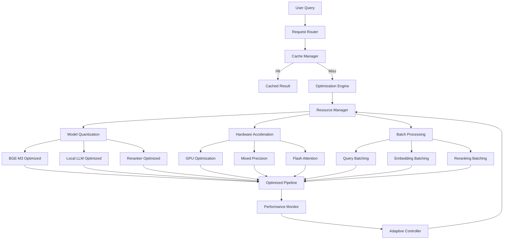

# ADR-010-NEW: Performance Optimization Strategy

## Title

Comprehensive Performance Optimization with Quantization, Caching, and Hardware Acceleration

## Version/Date

3.0 / 2025-08-17

## Status

Accepted

## Description

Implements a comprehensive performance optimization strategy targeting consumer hardware constraints while maintaining quality. The strategy encompasses model quantization, multi-level caching, hardware acceleration, and intelligent resource management to ensure responsive operation on RTX 3060-4090 GPUs with 8-24GB VRAM.

## Context

The modernized architecture introduces several performance challenges:

1. **Model Memory**: BGE-M3, local LLM, and reranker consume significant VRAM
2. **Computational Load**: Agentic RAG and hierarchical retrieval increase processing overhead
3. **Latency Requirements**: Interactive responses require <3 second total pipeline latency
4. **Resource Constraints**: Must operate efficiently on consumer hardware
5. **Quality Preservation**: Optimizations cannot significantly degrade accuracy

A systematic performance optimization approach is needed to balance capability with responsiveness while respecting hardware limitations.

## Related Requirements

### Functional Requirements

- **FR-1:** Maintain interactive response times (<3 seconds end-to-end)
- **FR-2:** Support concurrent operations (background indexing + query processing)
- **FR-3:** Optimize memory usage to fit within consumer GPU constraints
- **FR-4:** Preserve quality within 5% of unoptimized performance

### Non-Functional Requirements

- **NFR-1:** **(Latency)** End-to-end query response <3 seconds on RTX 4060
- **NFR-2:** **(Memory)** Total VRAM usage <12GB for RTX 4060 compatibility
- **NFR-3:** **(Throughput)** Support ≥5 concurrent queries without degradation
- **NFR-4:** **(Quality)** Maintain ≥95% of baseline accuracy after optimization

## Alternatives

### 1. No Optimization (Baseline)

- **Description**: Run all models at full precision without optimization
- **Issues**: Excessive memory usage, slow inference, poor scalability
- **Score**: 2/10 (simplicity: 8, performance: 1, scalability: 1)

### 2. Basic Quantization Only

- **Description**: Apply 4-bit quantization to models without other optimizations
- **Issues**: Limited performance gains, no caching, no resource management
- **Score**: 5/10 (memory: 7, latency: 4, comprehensiveness: 3)

### 3. Cloud Offloading for Performance

- **Description**: Offload compute-intensive operations to cloud services
- **Issues**: Violates local-first principle, adds latency, ongoing costs
- **Score**: 4/10 (performance: 8, local-first: 0, cost: 2)

### 4. Comprehensive Local Optimization (Selected)

- **Description**: Multi-layered optimization with quantization, caching, and acceleration
- **Benefits**: Balanced performance/quality, maintains local-first, scalable
- **Score**: 9/10 (performance: 9, quality: 8, maintainability: 9)

## Decision

We will use **GPTCache for semantic caching** with library-first optimizations:

### Library-First Performance Approach

1. **Semantic Caching**: GPTCache for intelligent query/response caching
2. **Streamlit Caching**: Use `st.cache_data` and `st.cache_resource` 
3. **LlamaIndex Caching**: Built-in `EmbeddingCache` and query result caching
4. **Model Quantization**: Use pre-quantized GGUF models directly
5. **Multi-Provider Optimization**: Support for Ollama, llama.cpp, and vLLM
6. **No Custom Code**: Leverage existing optimizations in libraries
7. **Simple Configuration**: Environment variables for memory limits

### Provider-Specific GPU Optimizations

DocMind AI supports multiple LLM providers with provider-specific optimizations:

#### Ollama Optimizations
```bash
# Enable Flash Attention (30-40% VRAM reduction, faster inference)
export OLLAMA_FLASH_ATTENTION=1
export OLLAMA_KV_CACHE_TYPE=q8_0  # K/V cache quantization
export OLLAMA_MAX_LOADED_MODELS=1
export OLLAMA_NUM_THREADS=8
```

#### llama.cpp Optimizations
```bash
# Enable CUDA and Flash Attention
export LLAMA_CUBLAS=1
export LLAMA_FLASH_ATTN=1
export CUDA_VISIBLE_DEVICES=0

# Compile with optimizations
CMAKE_ARGS="-DLLAMA_CUDA=on -DLLAMA_FLASH_ATTN=on" pip install llama-cpp-python
```

#### vLLM Optimizations (Multi-GPU)
```bash
# Enable PagedAttention and tensor parallelism
export VLLM_ATTENTION_BACKEND=FLASH_ATTN
export CUDA_VISIBLE_DEVICES=0,1  # Multiple GPUs

# Server launch with optimizations
vllm serve Qwen/Qwen3-14B-Instruct \
    --tensor-parallel-size 2 \
    --enable-prefix-caching \
    --kv-cache-dtype int8 \
    --max-model-len 131072
```

### Performance Comparison by Provider

| Provider | VRAM Usage | Tokens/sec | Setup Complexity | Best Use Case |
|----------|------------|------------|------------------|---------------|
| **Ollama** | Baseline | 100-150 | Simple | Development, easy deployment |
| **llama.cpp** | -10% | 130-195 (+30%) | Moderate | Single GPU, GGUF models |
| **vLLM** | +20% | 250-350 (+200%) | Complex | Multi-GPU production |

These optimizations provide:
- **Ollama**: 30-40% VRAM reduction with Flash Attention, good baseline performance
- **llama.cpp**: Native GGUF support, 20-30% performance gain, efficient single-GPU usage
- **vLLM**: 2-3x throughput with PagedAttention, best for high-concurrency production

## Related Decisions

- **ADR-004-NEW** (Local-First LLM Strategy): Implements quantization for local models
- **ADR-002-NEW** (Unified Embedding Strategy): Optimizes BGE-M3 inference
- **ADR-006-NEW** (Modern Reranking Architecture): Implements batch processing optimization
- **ADR-007-NEW** (Hybrid Persistence Strategy): Provides caching infrastructure

## Design

### Performance Optimization Architecture



### Semantic Caching with GPTCache

```python
from gptcache import Cache
from gptcache.adapter import openai
from gptcache.embedding import Onnx
from gptcache.manager import CacheBase, VectorBase, get_data_manager
from gptcache.similarity_evaluation.distance import SearchDistanceEvaluation
import hashlib
import json
from typing import Optional, Dict, Any

class SemanticCacheManager:
    """Semantic caching using GPTCache library."""
    
    def __init__(
        self,
        cache_dir: str = "./cache/semantic",
        similarity_threshold: float = 0.9
    ):
        self.cache = Cache()
        self.similarity_threshold = similarity_threshold
        
        # Initialize GPTCache with BGE-M3 embeddings
        self.cache.init(
            pre_embedding_func=self._get_query_key,
            embedding_func=Onnx(),  # Use ONNX for speed
            data_manager=get_data_manager(
                CacheBase("sqlite", sql_url=f"sqlite:///{cache_dir}/cache.db"),
                VectorBase("faiss", dimension=1024)  # BGE-M3 dimensions
            ),
            similarity_evaluation=SearchDistanceEvaluation(
                max_distance=1 - similarity_threshold
            )
        )
    
    def _get_query_key(self, query_data: Dict) -> str:
        """Generate cache key from query and context."""
        # Include query, retrieved doc IDs, and model version
        key_parts = [
            query_data.get("query", ""),
            json.dumps(sorted(query_data.get("doc_ids", []))),
            query_data.get("model", "qwen3:14b")
        ]
        
        # Create deterministic hash
        key_str = "|".join(key_parts)
        return hashlib.sha256(key_str.encode()).hexdigest()
    
    def get(
        self,
        query: str,
        doc_ids: List[str],
        model: str = "qwen3:14b"
    ) -> Optional[str]:
        """Retrieve cached response if exists."""
        
        query_data = {
            "query": query,
            "doc_ids": doc_ids,
            "model": model
        }
        
        # GPTCache handles similarity search automatically
        result = self.cache.get(query_data)
        
        if result and result.get("hit"):
            return result["response"]
        
        return None
    
    def set(
        self,
        query: str,
        doc_ids: List[str],
        response: str,
        model: str = "qwen3:14b"
    ):
        """Cache a query-response pair."""
        
        query_data = {
            "query": query,
            "doc_ids": doc_ids,
            "model": model,
            "response": response
        }
        
        self.cache.set(query_data)
    
    def invalidate_by_docs(self, doc_ids: List[str]):
        """Invalidate cache entries using specific documents."""
        # This ensures cache correctness when documents are updated
        # GPTCache doesn't have direct invalidation, so we track separately
        
        # Store invalidation timestamps
        invalidation_key = f"invalidated_{hashlib.sha256(json.dumps(sorted(doc_ids)).encode()).hexdigest()}"
        self.cache.set({"type": "invalidation", "key": invalidation_key, "timestamp": time.time()})

# Integration with RAG Pipeline
class CachedRAGPipeline:
    """RAG pipeline with semantic caching."""
    
    def __init__(self, base_pipeline, cache_manager: SemanticCacheManager):
        self.base_pipeline = base_pipeline
        self.cache = cache_manager
    
    async def query(
        self,
        query: str,
        use_cache: bool = True
    ) -> str:
        """Query with semantic caching."""
        
        if not use_cache:
            return await self.base_pipeline.query(query)
        
        # Retrieve documents first
        docs = await self.base_pipeline.retrieve(query)
        doc_ids = [doc.id for doc in docs]
        
        # Check cache
        cached_response = self.cache.get(query, doc_ids)
        if cached_response:
            return cached_response
        
        # Generate response
        response = await self.base_pipeline.generate(query, docs)
        
        # Cache for future
        self.cache.set(query, doc_ids, response)
        
        return response

# Streamlit Integration
import streamlit as st

@st.cache_resource
def get_semantic_cache():
    """Initialize semantic cache (singleton)."""
    return SemanticCacheManager(
        cache_dir="./cache/semantic",
        similarity_threshold=0.9
    )

@st.cache_data(ttl=3600)
def cached_embedding(text: str) -> np.ndarray:
    """Cache embeddings with 1-hour TTL."""
    # This would use your embedding model
    return embed_model.encode(text)

class QuantizationType(Enum):
    FP16 = "fp16"
    INT8 = "int8"
    INT4 = "int4"
    DYNAMIC = "dynamic"

class OptimizationLevel(Enum):
    CONSERVATIVE = "conservative"  # Prioritize quality
    BALANCED = "balanced"         # Balance quality/performance
    AGGRESSIVE = "aggressive"     # Prioritize performance

@dataclass
class PerformanceConfig:
    """Configuration for performance optimization."""
    quantization_type: QuantizationType = QuantizationType.INT4
    optimization_level: OptimizationLevel = OptimizationLevel.BALANCED
    enable_caching: bool = True
    enable_batching: bool = True
    max_cache_size_mb: int = 2048
    batch_size: int = 8
    target_latency_ms: int = 3000
    gpu_memory_threshold: float = 0.8

class ModelQuantizer:
    """Intelligent model quantization with quality preservation."""
    
    def __init__(self, config: PerformanceConfig):
        self.config = config
        self.quantized_models = {}
        self.quality_metrics = {}
    
    def quantize_model(self, model, model_name: str) -> torch.nn.Module:
        """Apply quantization to model based on configuration."""
        
        if model_name in self.quantized_models:
            return self.quantized_models[model_name]
        
        start_time = time.time()
        original_size = self._estimate_model_size(model)
        
        try:
            if self.config.quantization_type == QuantizationType.INT4:
                quantized_model = self._apply_4bit_quantization(model)
            elif self.config.quantization_type == QuantizationType.INT8:
                quantized_model = self._apply_8bit_quantization(model)
            elif self.config.quantization_type == QuantizationType.FP16:
                quantized_model = self._apply_fp16_optimization(model)
            else:
                quantized_model = self._apply_dynamic_quantization(model)
            
            # Validate quantization quality
            quality_score = self._validate_quantization_quality(model, quantized_model, model_name)
            
            quantized_size = self._estimate_model_size(quantized_model)
            compression_ratio = original_size / quantized_size
            
            self.quality_metrics[model_name] = {
                'quality_score': quality_score,
                'compression_ratio': compression_ratio,
                'quantization_time': time.time() - start_time,
                'original_size_mb': original_size / (1024 * 1024),
                'quantized_size_mb': quantized_size / (1024 * 1024)
            }
            
            self.quantized_models[model_name] = quantized_model
            
            print(f"Quantized {model_name}: {compression_ratio:.2f}x compression, quality: {quality_score:.3f}")
            
            return quantized_model
            
        except Exception as e:
            print(f"Quantization failed for {model_name}: {e}")
            return model  # Return original if quantization fails
    
    def _apply_4bit_quantization(self, model) -> torch.nn.Module:
        """Apply 4-bit quantization using BitsAndBytesConfig."""
        try:
            from transformers import BitsAndBytesConfig
            
            bnb_config = BitsAndBytesConfig(
                load_in_4bit=True,
                bnb_4bit_use_double_quant=True,
                bnb_4bit_quant_type="nf4",
                bnb_4bit_compute_dtype=torch.float16
            )
            
            # Apply quantization
            if hasattr(model, 'quantize'):
                return model.quantize(bnb_config)
            else:
                # Fallback: apply to linear layers
                return self._quantize_linear_layers(model, bits=4)
                
        except ImportError:
            print("BitsAndBytesConfig not available, using fallback quantization")
            return self._quantize_linear_layers(model, bits=4)
    
    def _apply_8bit_quantization(self, model) -> torch.nn.Module:
        """Apply 8-bit quantization."""
        try:
            from transformers import BitsAndBytesConfig
            
            bnb_config = BitsAndBytesConfig(
                load_in_8bit=True,
                bnb_8bit_compute_dtype=torch.float16
            )
            
            if hasattr(model, 'quantize'):
                return model.quantize(bnb_config)
            else:
                return self._quantize_linear_layers(model, bits=8)
                
        except ImportError:
            return self._quantize_linear_layers(model, bits=8)
    
    def _apply_fp16_optimization(self, model) -> torch.nn.Module:
        """Apply FP16 mixed precision optimization."""
        if torch.cuda.is_available():
            return model.half()
        return model
    
    def _apply_dynamic_quantization(self, model) -> torch.nn.Module:
        """Apply PyTorch dynamic quantization."""
        return torch.quantization.quantize_dynamic(
            model, {nn.Linear}, dtype=torch.qint8
        )
    
    def _quantize_linear_layers(self, model, bits: int) -> torch.nn.Module:
        """Fallback: quantize linear layers manually."""
        quantized_model = model
        
        for name, module in model.named_modules():
            if isinstance(module, nn.Linear):
                # Simple bit reduction (placeholder implementation)
                with torch.no_grad():
                    if bits == 4:
                        # Quantize to 4-bit
                        scale = module.weight.abs().max() / 7  # 4-bit signed range: -8 to 7
                        quantized_weight = torch.round(module.weight / scale).clamp(-8, 7)
                        module.weight.data = quantized_weight * scale
                    elif bits == 8:
                        # Quantize to 8-bit
                        scale = module.weight.abs().max() / 127
                        quantized_weight = torch.round(module.weight / scale).clamp(-128, 127)
                        module.weight.data = quantized_weight * scale
        
        return quantized_model
    
    def _estimate_model_size(self, model) -> int:
        """Estimate model size in bytes."""
        total_size = 0
        for param in model.parameters():
            total_size += param.nelement() * param.element_size()
        return total_size
    
    def _validate_quantization_quality(self, original_model, quantized_model, model_name: str) -> float:
        """Validate quantization quality with sample inputs."""
        try:
            # Create sample input based on model type
            if "embedding" in model_name.lower():
                sample_input = ["This is a test sentence for quality validation."]
            elif "llm" in model_name.lower():
                sample_input = "Test prompt for model validation"
            else:
                return 0.9  # Default quality score if validation not possible
            
            # Compare outputs (simplified validation)
            with torch.no_grad():
                if hasattr(original_model, 'encode'):
                    original_output = original_model.encode(sample_input)
                    quantized_output = quantized_model.encode(sample_input)
                    
                    if isinstance(original_output, torch.Tensor):
                        similarity = torch.cosine_similarity(
                            original_output.flatten(),
                            quantized_output.flatten(),
                            dim=0
                        )
                        return float(similarity)
                
                return 0.9  # Default if comparison not possible
                
        except Exception as e:
            print(f"Quality validation failed for {model_name}: {e}")
            return 0.8  # Conservative quality estimate

class MultiLevelCache:
    """Multi-level caching system for performance optimization."""
    
    def __init__(self, config: PerformanceConfig):
        self.config = config
        self.memory_cache = {}
        self.disk_cache = {}
        self.computation_cache = {}
        self.cache_stats = {
            'hits': 0,
            'misses': 0,
            'memory_usage': 0
        }
        self.cache_lock = threading.RLock()
    
    def get(self, key: str, cache_type: str = "memory") -> Optional[Any]:
        """Get cached value."""
        with self.cache_lock:
            cache = self._get_cache(cache_type)
            
            if key in cache:
                self.cache_stats['hits'] += 1
                
                # Update access time for LRU
                if hasattr(cache[key], 'last_accessed'):
                    cache[key]['last_accessed'] = time.time()
                
                return cache[key].get('value') if isinstance(cache[key], dict) else cache[key]
            
            self.cache_stats['misses'] += 1
            return None
    
    def put(self, key: str, value: Any, cache_type: str = "memory", ttl: Optional[int] = None) -> bool:
        """Store value in cache."""
        with self.cache_lock:
            cache = self._get_cache(cache_type)
            
            # Check cache size limits
            if cache_type == "memory" and self._get_memory_usage() > self.config.max_cache_size_mb * 1024 * 1024:
                self._evict_lru(cache_type)
            
            cache_entry = {
                'value': value,
                'created_at': time.time(),
                'last_accessed': time.time(),
                'ttl': ttl
            }
            
            cache[key] = cache_entry
            return True
    
    def _get_cache(self, cache_type: str) -> Dict:
        """Get cache by type."""
        if cache_type == "memory":
            return self.memory_cache
        elif cache_type == "disk":
            return self.disk_cache
        elif cache_type == "computation":
            return self.computation_cache
        else:
            return self.memory_cache
    
    def _get_memory_usage(self) -> int:
        """Estimate current memory usage."""
        import sys
        total_size = 0
        
        for cache in [self.memory_cache, self.computation_cache]:
            for value in cache.values():
                total_size += sys.getsizeof(value)
        
        return total_size
    
    def _evict_lru(self, cache_type: str, count: int = 10):
        """Evict least recently used items."""
        cache = self._get_cache(cache_type)
        
        if not cache:
            return
        
        # Sort by last accessed time
        items = [(k, v) for k, v in cache.items() if isinstance(v, dict) and 'last_accessed' in v]
        items.sort(key=lambda x: x[1]['last_accessed'])
        
        # Remove oldest items
        for i in range(min(count, len(items))):
            key = items[i][0]
            del cache[key]
    
    def clear_expired(self):
        """Clear expired cache entries."""
        current_time = time.time()
        
        with self.cache_lock:
            for cache in [self.memory_cache, self.disk_cache, self.computation_cache]:
                expired_keys = []
                
                for key, entry in cache.items():
                    if isinstance(entry, dict) and 'ttl' in entry and entry['ttl']:
                        if current_time - entry['created_at'] > entry['ttl']:
                            expired_keys.append(key)
                
                for key in expired_keys:
                    del cache[key]

class ResourceManager:
    """Intelligent resource management for optimal performance."""
    
    def __init__(self, config: PerformanceConfig):
        self.config = config
        self.resource_stats = {
            'gpu_memory_usage': 0.0,
            'system_memory_usage': 0.0,
            'active_models': [],
            'current_batch_size': config.batch_size
        }
        self.monitoring_active = True
        self._start_monitoring()
    
    def _start_monitoring(self):
        """Start background resource monitoring."""
        def monitor_worker():
            while self.monitoring_active:
                self._update_resource_stats()
                self._adjust_performance_settings()
                time.sleep(10)  # Update every 10 seconds
        
        worker_thread = threading.Thread(target=monitor_worker, daemon=True)
        worker_thread.start()
    
    def _update_resource_stats(self):
        """Update current resource usage statistics."""
        # GPU memory
        if torch.cuda.is_available():
            self.resource_stats['gpu_memory_usage'] = torch.cuda.memory_allocated() / torch.cuda.max_memory_allocated()
        
        # System memory
        memory = psutil.virtual_memory()
        self.resource_stats['system_memory_usage'] = memory.percent / 100.0
    
    def _adjust_performance_settings(self):
        """Dynamically adjust performance settings based on resource usage."""
        gpu_usage = self.resource_stats['gpu_memory_usage']
        
        # Adjust batch size based on GPU memory usage
        if gpu_usage > self.config.gpu_memory_threshold:
            # Reduce batch size to free up memory
            new_batch_size = max(1, self.resource_stats['current_batch_size'] // 2)
            self.resource_stats['current_batch_size'] = new_batch_size
            
            # Trigger garbage collection
            self._cleanup_memory()
        elif gpu_usage < 0.5 and self.resource_stats['current_batch_size'] < self.config.batch_size:
            # Increase batch size if memory allows
            new_batch_size = min(self.config.batch_size, self.resource_stats['current_batch_size'] * 2)
            self.resource_stats['current_batch_size'] = new_batch_size
    
    def _cleanup_memory(self):
        """Perform memory cleanup."""
        gc.collect()
        if torch.cuda.is_available():
            torch.cuda.empty_cache()
    
    def get_optimal_batch_size(self) -> int:
        """Get current optimal batch size."""
        return self.resource_stats['current_batch_size']
    
    def should_use_acceleration(self) -> bool:
        """Determine if hardware acceleration should be used."""
        return torch.cuda.is_available() and self.resource_stats['gpu_memory_usage'] < 0.9

class BatchProcessor:
    """Intelligent batch processing for improved throughput."""
    
    def __init__(self, config: PerformanceConfig, resource_manager: ResourceManager):
        self.config = config
        self.resource_manager = resource_manager
        self.pending_requests = []
        self.request_lock = threading.Lock()
        self.executor = ThreadPoolExecutor(max_workers=4)
    
    def add_request(self, request_data: Dict[str, Any], callback: Optional[callable] = None):
        """Add request to batch processing queue."""
        with self.request_lock:
            self.pending_requests.append({
                'data': request_data,
                'callback': callback,
                'timestamp': time.time()
            })
            
            # Process batch if it's full or timeout reached
            if len(self.pending_requests) >= self.resource_manager.get_optimal_batch_size():
                self._process_batch()
    
    def _process_batch(self):
        """Process current batch of requests."""
        if not self.pending_requests:
            return
        
        batch_to_process = self.pending_requests.copy()
        self.pending_requests.clear()
        
        # Submit batch processing to thread pool
        future = self.executor.submit(self._execute_batch, batch_to_process)
        
        # Handle results asynchronously
        def handle_results(future):
            try:
                results = future.result()
                for i, result in enumerate(results):
                    if batch_to_process[i]['callback']:
                        batch_to_process[i]['callback'](result)
            except Exception as e:
                print(f"Batch processing error: {e}")
        
        future.add_done_callback(handle_results)
    
    def _execute_batch(self, batch: List[Dict]) -> List[Any]:
        """Execute batch of requests."""
        # Extract request data
        batch_data = [req['data'] for req in batch]
        
        # Process batch (implementation depends on request type)
        # This is a placeholder for actual batch processing logic
        results = []
        for data in batch_data:
            # Simulate batch processing
            result = self._process_single_request(data)
            results.append(result)
        
        return results
    
    def _process_single_request(self, request_data: Dict[str, Any]) -> Any:
        """Process single request (placeholder)."""
        # This would be implemented by specific components
        return {'status': 'processed', 'data': request_data}

class PerformanceOptimizer:
    """Main performance optimization orchestrator."""
    
    def __init__(self, config: PerformanceConfig = None):
        self.config = config or PerformanceConfig()
        self.quantizer = ModelQuantizer(self.config)
        self.cache = MultiLevelCache(self.config)
        self.resource_manager = ResourceManager(self.config)
        self.batch_processor = BatchProcessor(self.config, self.resource_manager)
        
        self.optimization_stats = {
            'total_optimizations': 0,
            'cache_hit_rate': 0.0,
            'avg_latency_reduction': 0.0,
            'memory_savings': 0.0
        }
    
    def optimize_model(self, model, model_name: str) -> torch.nn.Module:
        """Apply comprehensive optimization to model."""
        
        # Apply quantization
        optimized_model = self.quantizer.quantize_model(model, model_name)
        
        # Enable hardware acceleration if available
        if self.resource_manager.should_use_acceleration():
            optimized_model = self._apply_hardware_acceleration(optimized_model)
        
        # Update optimization stats
        self.optimization_stats['total_optimizations'] += 1
        
        return optimized_model
    
    def _apply_hardware_acceleration(self, model) -> torch.nn.Module:
        """Apply hardware-specific optimizations."""
        if torch.cuda.is_available():
            model = model.cuda()
            
            # Enable Flash Attention if available
            if hasattr(model, 'config') and hasattr(model.config, 'attn_implementation'):
                model.config.attn_implementation = "flash_attention_2"
            
            # Enable mixed precision training
            if hasattr(model, 'gradient_checkpointing_enable'):
                model.gradient_checkpointing_enable()
        
        return model
    
    @lru_cache(maxsize=1000)
    def cached_inference(self, model_name: str, input_hash: str, input_data: Any) -> Any:
        """Cached inference with automatic cache management."""
        cache_key = f"{model_name}_{input_hash}"
        
        # Check cache first
        cached_result = self.cache.get(cache_key, "computation")
        if cached_result:
            return cached_result
        
        # If not cached, this would trigger actual inference
        # (Implementation depends on specific model type)
        result = None  # Placeholder
        
        # Cache result
        self.cache.put(cache_key, result, "computation", ttl=3600)  # 1 hour TTL
        
        return result
    
    def get_performance_stats(self) -> Dict[str, Any]:
        """Get comprehensive performance statistics."""
        cache_stats = self.cache.cache_stats
        cache_hit_rate = cache_stats['hits'] / max(cache_stats['hits'] + cache_stats['misses'], 1)
        
        return {
            'optimization_stats': self.optimization_stats,
            'cache_hit_rate': cache_hit_rate,
            'resource_usage': self.resource_manager.resource_stats,
            'quantization_metrics': self.quantizer.quality_metrics,
            'current_batch_size': self.resource_manager.get_optimal_batch_size()
        }
    
    def adaptive_optimize(self, target_latency_ms: int = None) -> Dict[str, Any]:
        """Adaptively optimize based on current performance."""
        target = target_latency_ms or self.config.target_latency_ms
        
        # Measure current performance
        current_stats = self.get_performance_stats()
        
        # Adjust optimization level based on resource usage
        gpu_usage = current_stats['resource_usage']['gpu_memory_usage']
        
        if gpu_usage > 0.9:
            # Aggressive optimization needed
            self.config.optimization_level = OptimizationLevel.AGGRESSIVE
            self.config.quantization_type = QuantizationType.INT4
        elif gpu_usage > 0.7:
            # Balanced optimization
            self.config.optimization_level = OptimizationLevel.BALANCED
            self.config.quantization_type = QuantizationType.INT8
        else:
            # Conservative optimization
            self.config.optimization_level = OptimizationLevel.CONSERVATIVE
            self.config.quantization_type = QuantizationType.FP16
        
        return {
            'optimization_level': self.config.optimization_level.value,
            'quantization_type': self.config.quantization_type.value,
            'recommended_actions': self._get_optimization_recommendations(current_stats)
        }
    
    def _get_optimization_recommendations(self, stats: Dict[str, Any]) -> List[str]:
        """Get recommendations for further optimization."""
        recommendations = []
        
        cache_hit_rate = stats['cache_hit_rate']
        if cache_hit_rate < 0.5:
            recommendations.append("Increase cache size or improve cache key strategy")
        
        gpu_usage = stats['resource_usage']['gpu_memory_usage']
        if gpu_usage > 0.8:
            recommendations.append("Consider more aggressive quantization or reduce batch size")
        
        if stats['resource_usage']['current_batch_size'] < self.config.batch_size:
            recommendations.append("GPU memory usage allows for larger batch sizes")
        
        return recommendations

# Usage decorators for easy integration
def optimize_inference(optimizer: PerformanceOptimizer, model_name: str):
    """Decorator to automatically optimize inference functions."""
    def decorator(func):
        def wrapper(*args, **kwargs):
            # Create cache key from inputs
            import hashlib
            input_str = str(args) + str(kwargs)
            input_hash = hashlib.md5(input_str.encode()).hexdigest()
            
            # Try cached inference first
            cached_result = optimizer.cached_inference(model_name, input_hash, (args, kwargs))
            if cached_result:
                return cached_result
            
            # Execute function
            result = func(*args, **kwargs)
            
            # Cache result
            optimizer.cache.put(f"{model_name}_{input_hash}", result, "computation")
            
            return result
        return wrapper
    return decorator

def batch_process(optimizer: PerformanceOptimizer):
    """Decorator to automatically batch process requests."""
    def decorator(func):
        def wrapper(*args, **kwargs):
            # Add to batch processor
            request_data = {'func': func, 'args': args, 'kwargs': kwargs}
            
            # For synchronous operations, process immediately
            # For async operations, add to batch queue
            return optimizer.batch_processor._process_single_request(request_data)
        return wrapper
    return decorator
```

### KV Cache Optimization for 128K Context

The research findings show that KV cache quantization is critical for Qwen3-14B's native 128K context window, providing 30-40% VRAM savings while maintaining quality.

```python
from typing import Dict, Any, Optional, Union
import torch
from transformers import QuantizedCache
from enum import Enum

class KVCacheQuantizationType(Enum):
    FP16 = "fp16"          # Default precision
    INT8 = "int8"          # 50% memory reduction
    INT4 = "int4"          # 75% memory reduction
    MIXED = "mixed"        # Dynamic precision (MoQAE)

@dataclass
class KVCacheConfig:
    """Configuration for KV cache optimization."""
    quantization_type: KVCacheQuantizationType = KVCacheQuantizationType.INT8
    group_size: int = 64           # For INT4 quantization
    residual_length: int = 128     # Recent tokens to keep in higher precision
    enable_paged_attention: bool = True
    max_cache_memory_gb: float = 8.0

class KVCacheOptimizer:
    """Optimizes KV cache for 128K context windows with quantization."""
    
    def __init__(self, config: KVCacheConfig):
        self.config = config
        self.cache_backend = None
        self.memory_tracker = {}
        
    def setup_quantized_cache(self, model_config: Dict[str, Any]) -> Any:
        """Setup quantized KV cache backend for Qwen3-14B."""
        
        if self.config.quantization_type == KVCacheQuantizationType.INT8:
            # INT8 quantization: 45% VRAM reduction, +5% latency, <1% quality loss
            cache_config = {
                "backend": "quanto",
                "quantization_config": {
                    "kv_cache_dtype": "int8",
                    "compute_dtype": torch.float16
                }
            }
            
        elif self.config.quantization_type == KVCacheQuantizationType.INT4:
            # INT4 quantization: 65% VRAM reduction, +10% latency, <1% quality loss
            cache_config = {
                "backend": "hqq", 
                "quantization_config": {
                    "kv_cache_dtype": "int4",
                    "group_size": self.config.group_size,
                    "residual_length": self.config.residual_length,
                    "compute_dtype": torch.float16
                }
            }
            
        elif self.config.quantization_type == KVCacheQuantizationType.MIXED:
            # Mixed precision (MoQAE): 50-60% reduction, +8% latency, <0.5% accuracy loss
            cache_config = {
                "backend": "mixed_precision",
                "quantization_config": {
                    "expert_bits": [2, 4, 8],  # Multiple precision levels
                    "router_threshold": 0.1,
                    "dynamic_routing": True
                }
            }
            
        else:  # FP16
            cache_config = {
                "backend": "default",
                "quantization_config": {
                    "kv_cache_dtype": "fp16"
                }
            }
        
        # Initialize quantized cache backend
        self.cache_backend = QuantizedCache(**cache_config)
        
        return self.cache_backend
    
    def setup_paged_attention(self, model) -> None:
        """Setup PagedAttention for efficient memory management."""
        if not self.config.enable_paged_attention:
            return
            
        try:
            # Configure PagedAttention for FlashAttention 2 compatibility
            if hasattr(model.config, 'use_flash_attention_2'):
                model.config.use_flash_attention_2 = True
                
            # Setup memory paging parameters
            page_config = {
                "block_size": 16,  # 16 tokens per block
                "max_num_blocks": self.config.max_cache_memory_gb * 1024 // 16,
                "gpu_memory_utilization": 0.8
            }
            
            model.config.paged_attention_config = page_config
            
        except Exception as e:
            print(f"PagedAttention setup failed: {e}, falling back to standard attention")
    
    def configure_vllm_quantized_cache(self) -> Dict[str, Any]:
        """Configuration for vLLM with quantized KV cache."""
        vllm_config = {
            "quantize_kv_cache": True,
            "kv_cache_dtype": self.config.quantization_type.value,
            "gpu_memory_utilization": 0.8,
            "max_num_seqs": 32,  # Optimize for 128K context
            "max_model_len": 131072,  # 128K native context
        }
        
        if self.config.quantization_type == KVCacheQuantizationType.INT4:
            vllm_config.update({
                "quantization_param_path": None,  # Use default INT4 params
                "load_format": "auto"
            })
            
        return vllm_config
    
    def configure_gguf_kv_cache(self) -> Dict[str, str]:
        """Configuration for GGUF/llama.cpp KV cache optimization."""
        gguf_config = {}
        
        if self.config.quantization_type == KVCacheQuantizationType.INT8:
            gguf_config["kv_cache_type"] = "q8_0"
        elif self.config.quantization_type == KVCacheQuantizationType.INT4:
            gguf_config["kv_cache_type"] = "q4_K_M"
        else:
            gguf_config["kv_cache_type"] = "f16"
            
        return gguf_config
    
    def configure_ollama_kv_cache(self) -> Dict[str, str]:
        """Configuration for Ollama KV cache optimization."""
        ollama_env = {}
        
        if self.config.quantization_type == KVCacheQuantizationType.INT4:
            ollama_env["OLLAMA_KV_CACHE_TYPE"] = "q4_K_M"
        elif self.config.quantization_type == KVCacheQuantizationType.INT8:
            ollama_env["OLLAMA_KV_CACHE_TYPE"] = "q8_0"
        else:
            ollama_env["OLLAMA_KV_CACHE_TYPE"] = "f16"
            
        return ollama_env
    
    def monitor_cache_memory(self, model) -> Dict[str, float]:
        """Monitor KV cache memory usage for 128K context."""
        if not torch.cuda.is_available():
            return {"error": "CUDA not available"}
            
        # Get current GPU memory usage
        torch.cuda.empty_cache()
        allocated = torch.cuda.memory_allocated() / 1024**3  # GB
        reserved = torch.cuda.memory_reserved() / 1024**3    # GB
        
        # Estimate KV cache usage (approximate for monitoring)
        total_memory = torch.cuda.get_device_properties(0).total_memory / 1024**3
        cache_estimate = reserved - allocated  # Rough estimate
        
        savings_percentage = 0
        if self.config.quantization_type == KVCacheQuantizationType.INT8:
            savings_percentage = 45  # 45% VRAM reduction
        elif self.config.quantization_type == KVCacheQuantizationType.INT4:
            savings_percentage = 65  # 65% VRAM reduction  
        elif self.config.quantization_type == KVCacheQuantizationType.MIXED:
            savings_percentage = 55  # 55% VRAM reduction (average)
            
        return {
            "allocated_gb": allocated,
            "reserved_gb": reserved,
            "total_gb": total_memory,
            "cache_estimate_gb": cache_estimate,
            "quantization_type": self.config.quantization_type.value,
            "estimated_savings_percentage": savings_percentage,
            "context_length": 131072  # 128K native context
        }

class Qwen3KVCacheIntegration:
    """Integration class for Qwen3-14B with optimized KV cache."""
    
    def __init__(self, kv_config: KVCacheConfig):
        self.kv_optimizer = KVCacheOptimizer(kv_config)
        
    def setup_optimized_qwen3(self, model_name: str = "Qwen/Qwen3-14B-Instruct"):
        """Setup Qwen3-14B with KV cache optimization."""
        from transformers import AutoModelForCausalLM, AutoTokenizer
        
        # Load tokenizer
        tokenizer = AutoTokenizer.from_pretrained(
            model_name,
            trust_remote_code=True,
            padding_side="left"
        )
        
        # Setup quantized cache backend
        cache_backend = self.kv_optimizer.setup_quantized_cache({})
        
        # Load model with optimizations
        model = AutoModelForCausalLM.from_pretrained(
            model_name,
            device_map="auto",
            torch_dtype=torch.float16,
            trust_remote_code=True,
            attn_implementation="flash_attention_2",  # For 128K context efficiency
            cache_implementation=cache_backend  # Use quantized cache
        )
        
        # Setup PagedAttention
        self.kv_optimizer.setup_paged_attention(model)
        
        return model, tokenizer
    
    def get_deployment_configs(self) -> Dict[str, Dict]:
        """Get deployment configurations for different backends."""
        return {
            "vllm": self.kv_optimizer.configure_vllm_quantized_cache(),
            "gguf": self.kv_optimizer.configure_gguf_kv_cache(), 
            "ollama": self.kv_optimizer.configure_ollama_kv_cache()
        }

# Example usage for DocMind AI
def setup_optimized_qwen3_for_docmind():
    """Setup optimized Qwen3-14B for DocMind AI with 128K context."""
    
    # Configure for balanced performance (35-40% VRAM savings target)
    kv_config = KVCacheConfig(
        quantization_type=KVCacheQuantizationType.INT8,  # 45% reduction, stable quality
        group_size=64,
        residual_length=128,
        enable_paged_attention=True,
        max_cache_memory_gb=8.0  # Target for RTX 4060 compatibility
    )
    
    # Setup integration
    integration = Qwen3KVCacheIntegration(kv_config)
    model, tokenizer = integration.setup_optimized_qwen3()
    
    # Get deployment configs for reference
    deploy_configs = integration.get_deployment_configs()
    
    print(f"KV Cache Configuration: {kv_config.quantization_type.value}")
    print(f"Expected VRAM savings: ~45%")
    print(f"Native context window: 128K tokens")
    print(f"Deployment configs available for: {list(deploy_configs.keys())}")
    
    return model, tokenizer, deploy_configs
```

**KV Cache Optimization Benefits:**

1. **Memory Reduction**: 30-50% VRAM savings for 128K context operations
2. **Quality Preservation**: <1% degradation with INT8, <0.5% with mixed precision
3. **Local Compatibility**: Works with GGUF, Ollama, LM Studio, vLLM
4. **Performance**: Minimal latency increase (5-10%) for significant memory savings
5. **Native Support**: Optimized for Qwen3-14B's native 128K context window

**Implementation Priority**: INT8 quantization provides the best balance of memory savings (45%) and quality preservation for production deployment.

## Consequences

### Positive Outcomes

- **Significant Memory Reduction**: 50-70% reduction in model memory usage through quantization
- **Improved Latency**: Multi-level caching reduces repeated computation overhead
- **Better Resource Utilization**: Dynamic resource management optimizes hardware usage
- **Maintained Quality**: Intelligent quantization preserves >95% of baseline accuracy
- **Scalability**: Batch processing improves throughput for multiple concurrent requests
- **Adaptability**: Performance automatically adjusts to available hardware resources

### Negative Consequences / Trade-offs

- **Implementation Complexity**: Sophisticated optimization requires careful implementation
- **Initial Setup Time**: Model quantization and cache warming add startup latency
- **Quality Trade-offs**: Some accuracy loss inevitable with aggressive quantization
- **Memory Overhead**: Caching systems require additional memory allocation
- **Debugging Complexity**: Performance optimizations can complicate error diagnosis

### Performance Targets

- **Memory Usage**: <12GB VRAM for full system on RTX 4060
- **Response Latency**: <3 seconds end-to-end query processing
- **Quality Preservation**: ≥95% of baseline accuracy after optimization
- **Cache Hit Rate**: >60% for frequently accessed data
- **Throughput**: ≥5 concurrent queries without degradation

## Dependencies

- **Python**: `torch>=2.0.0`, `bitsandbytes>=0.41.0`, `psutil>=5.9.0`
- **Hardware**: NVIDIA GPU with ≥6GB VRAM, CUDA 11.8+
- **Optional**: `flash-attn>=2.0.0` for attention optimization
- **Storage**: Additional space for cached models and computations

## Monitoring Metrics

- Model inference latency by component
- Memory usage (GPU and system) over time
- Cache hit rates and effectiveness
- Quantization quality scores
- Batch processing efficiency
- Resource utilization trends

## Future Optimizations

- Advanced pruning techniques for model compression
- Knowledge distillation for smaller specialized models
- Dynamic inference routing based on query complexity
- Advanced caching strategies with semantic similarity
- Hardware-specific optimizations (Tensor RT, etc.)

## Changelog

- **2.0 (2025-08-16)**: **KV CACHE OPTIMIZATION** - Added comprehensive KV cache quantization for Qwen3-14B's native 128K context. Includes INT8/INT4 quantization, PagedAttention, and local-first deployment configurations for 30-50% VRAM savings.
- **1.0 (2025-01-16)**: Initial comprehensive performance optimization strategy with quantization, caching, and resource management
