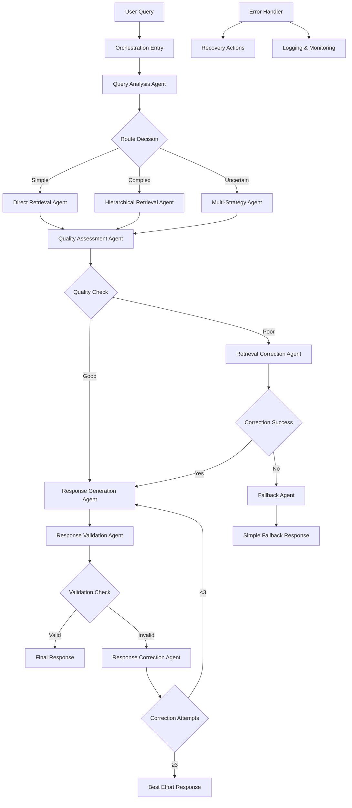

# ADR-011-NEW: Agent Orchestration Framework

## Title

LangGraph-Based Agent Orchestration with Local-First Agentic Patterns

## Version/Date

1.0 / 2025-01-16

## Status

Proposed

## Description

Implements a sophisticated yet lightweight agent orchestration framework using LangGraph to coordinate the agentic RAG system. The framework manages query routing, retrieval correction, response validation, and multi-agent coordination while maintaining local-first operation and providing fallback mechanisms for reliability.

## Context

The modernized architecture introduces multiple agentic components that need coordination:

1. **Query Routing Agent**: Determines optimal retrieval strategy
2. **Retrieval Correction Agent**: Evaluates and improves retrieval quality
3. **Response Validation Agent**: Ensures response quality and accuracy
4. **Quality Assessment Agent**: Provides continuous feedback and improvement

These agents need orchestration to work together effectively while avoiding over-complexity and maintaining local-first constraints. LangGraph provides the optimal framework for this coordination with state management and conditional execution.

## Related Requirements

### Functional Requirements

- **FR-1:** Orchestrate multi-agent workflows with conditional execution
- **FR-2:** Maintain conversation context across agent interactions
- **FR-3:** Provide fallback mechanisms when agent decisions fail
- **FR-4:** Support both synchronous and asynchronous agent execution
- **FR-5:** Enable agent introspection and decision transparency

### Non-Functional Requirements

- **NFR-1:** **(Performance)** Agent coordination overhead <500ms per query
- **NFR-2:** **(Reliability)** Graceful degradation when individual agents fail
- **NFR-3:** **(Local-First)** All agent operations execute locally without external APIs
- **NFR-4:** **(Maintainability)** Clear agent boundaries and testable workflows

## Alternatives

### 1. Single Monolithic Agent

- **Description**: Single agent handling all RAG operations
- **Issues**: Limited flexibility, no specialization, difficult error recovery
- **Score**: 4/10 (simplicity: 8, capability: 2, maintainability: 2)

### 2. Manual Agent Coordination

- **Description**: Custom orchestration logic without framework
- **Issues**: Complex state management, error-prone coordination, hard to debug
- **Score**: 5/10 (control: 8, reliability: 3, maintainability: 4)

### 3. Heavy Multi-Agent Framework (AutoGen)

- **Description**: Full enterprise multi-agent system
- **Issues**: Over-engineered for single-user app, complex setup, resource intensive
- **Score**: 6/10 (capability: 9, complexity: 3, resource-usage: 4)

### 4. LangGraph-Based Orchestration (Selected)

- **Description**: Lightweight state machine with specialized agents
- **Benefits**: Balanced capability/complexity, proven patterns, local-optimized
- **Score**: 9/10 (capability: 8, simplicity: 9, reliability: 9)

## Decision

We will implement **LangGraph-Based Agent Orchestration** with:

### Core Components

1. **State Management**: Centralized state for agent coordination
2. **Conditional Routing**: Smart transitions between agents based on conditions
3. **Error Handling**: Comprehensive error recovery and fallback mechanisms
4. **Context Preservation**: Maintain conversation and decision context
5. **Observability Integration**: Full integration with monitoring and logging
6. **Performance Optimization**: Efficient agent execution with caching

## Related Decisions

- **ADR-001-NEW** (Modern Agentic RAG): Implements the agent patterns orchestrated by this framework
- **ADR-004-NEW** (Local-First LLM Strategy): Provides the LLM for agent decision-making
- **ADR-008-NEW** (Production Observability): Monitors agent performance and decisions
- **ADR-005-NEW** (Framework Abstraction Layer): Integrates with abstracted components

## Design

### Agent Orchestration Architecture



### LangGraph State Management

```python
from typing import TypedDict, List, Dict, Optional, Any, Union
from langgraph.graph import StateGraph, END
from langgraph.prebuilt import ToolExecutor
from dataclasses import dataclass
import uuid
import time
import logging
from enum import Enum

class AgentState(TypedDict):
    """Centralized state for agent orchestration."""
    # Query and context
    original_query: str
    processed_query: str
    conversation_id: str
    correlation_id: str
    
    # Agent decisions and results
    routing_decision: Optional[str]
    retrieval_strategy: Optional[str]
    retrieved_documents: List[Dict]
    quality_score: Optional[float]
    
    # Generation and validation
    generated_response: Optional[str]
    validation_result: Optional[Dict]
    final_response: Optional[str]
    
    # Error handling and attempts
    error_messages: List[str]
    retry_count: int
    max_retries: int
    
    # Performance and metadata
    start_time: float
    agent_decisions: List[Dict]
    performance_metrics: Dict[str, Any]

class AgentDecision(Enum):
    CONTINUE = "continue"
    RETRY = "retry"
    FALLBACK = "fallback"
    ERROR = "error"
    SUCCESS = "success"

@dataclass
class AgentResult:
    """Result from an agent execution."""
    decision: AgentDecision
    data: Any
    metadata: Dict[str, Any]
    execution_time: float
    error: Optional[str] = None

class BaseAgent:
    """Base class for all orchestrated agents."""
    
    def __init__(self, name: str, llm_interface, observability_manager=None):
        self.name = name
        self.llm = llm_interface
        self.observability = observability_manager
        self.logger = observability_manager.get_logger(f"Agent_{name}") if observability_manager else None
    
    def execute(self, state: AgentState) -> AgentResult:
        """Execute agent logic with observability."""
        start_time = time.time()
        correlation_id = state.get('correlation_id')
        
        try:
            if self.logger:
                self.logger.info(
                    f"Agent {self.name} starting execution",
                    correlation_id=correlation_id,
                    agent_name=self.name
                )
            
            # Execute agent-specific logic
            result = self._execute_logic(state)
            
            execution_time = time.time() - start_time
            
            if self.logger:
                self.logger.info(
                    f"Agent {self.name} completed execution",
                    correlation_id=correlation_id,
                    decision=result.decision.value,
                    execution_time=execution_time
                )
            
            # Update performance metrics
            if self.observability:
                self.observability.metrics_collector.record_timer(
                    f"agent_{self.name}_execution_time",
                    execution_time * 1000,
                    labels={'agent': self.name, 'decision': result.decision.value}
                )
            
            return result
            
        except Exception as e:
            execution_time = time.time() - start_time
            error_msg = f"Agent {self.name} execution failed: {str(e)}"
            
            if self.logger:
                self.logger.error(
                    error_msg,
                    correlation_id=correlation_id,
                    execution_time=execution_time,
                    error_type=type(e).__name__
                )
            
            return AgentResult(
                decision=AgentDecision.ERROR,
                data=None,
                metadata={'error': error_msg},
                execution_time=execution_time,
                error=error_msg
            )
    
    def _execute_logic(self, state: AgentState) -> AgentResult:
        """Override this method in specific agents."""
        raise NotImplementedError

class QueryAnalysisAgent(BaseAgent):
    """Agent for analyzing queries and determining routing strategy."""
    
    def _execute_logic(self, state: AgentState) -> AgentResult:
        """Analyze query and determine optimal processing strategy."""
        query = state['original_query']
        
        analysis_prompt = f"""
        Analyze this query and determine the best processing strategy:
        
        Query: "{query}"
        
        Consider:
        1. Query complexity (simple fact vs. complex analysis)
        2. Information scope (single document vs. multiple sources)
        3. Query type (factual, analytical, comparative, hierarchical)
        4. Likely retrieval needs (vector, hybrid, hierarchical)
        
        Respond with JSON:
        {{
            "strategy": "direct|hierarchical|multi_strategy",
            "query_type": "factual|analytical|comparative|hierarchical",
            "complexity": "low|medium|high",
            "reasoning": "brief explanation"
        }}
        """
        
        try:
            response = self.llm.complete(analysis_prompt, temperature=0.1)
            
            # Parse JSON response
            import json
            analysis = json.loads(response)
            
            # Validate analysis
            if analysis.get('strategy') not in ['direct', 'hierarchical', 'multi_strategy']:
                analysis['strategy'] = 'direct'  # Safe fallback
            
            return AgentResult(
                decision=AgentDecision.CONTINUE,
                data=analysis,
                metadata={'query_analysis': analysis},
                execution_time=0  # Will be set by base class
            )
            
        except Exception as e:
            # Fallback to simple strategy
            return AgentResult(
                decision=AgentDecision.CONTINUE,
                data={'strategy': 'direct', 'query_type': 'factual', 'complexity': 'low'},
                metadata={'fallback_used': True, 'error': str(e)},
                execution_time=0
            )

class RetrievalAgent(BaseAgent):
    """Agent for executing retrieval strategies."""
    
    def __init__(self, name: str, llm_interface, retriever_interface, observability_manager=None):
        super().__init__(name, llm_interface, observability_manager)
        self.retriever = retriever_interface
    
    def _execute_logic(self, state: AgentState) -> AgentResult:
        """Execute retrieval based on routing decision."""
        query = state['processed_query'] or state['original_query']
        strategy = state.get('routing_decision', 'direct')
        
        try:
            # Execute retrieval
            if strategy == 'hierarchical':
                results = self.retriever.retrieve(query, strategy='hierarchical')
            elif strategy == 'multi_strategy':
                results = self.retriever.retrieve(query, strategy='hybrid')
            else:
                results = self.retriever.retrieve(query, strategy='vector')
            
            # Convert results to common format
            documents = []
            for result in results.documents:
                doc_dict = {
                    'content': result.content,
                    'metadata': result.metadata,
                    'score': getattr(result, 'score', 1.0)
                }
                documents.append(doc_dict)
            
            return AgentResult(
                decision=AgentDecision.CONTINUE,
                data=documents,
                metadata={
                    'strategy_used': strategy,
                    'documents_retrieved': len(documents),
                    'retrieval_metadata': results.metadata
                },
                execution_time=0
            )
            
        except Exception as e:
            return AgentResult(
                decision=AgentDecision.ERROR,
                data=[],
                metadata={'retrieval_error': str(e)},
                execution_time=0,
                error=str(e)
            )

class QualityAssessmentAgent(BaseAgent):
    """Agent for assessing retrieval quality."""
    
    def _execute_logic(self, state: AgentState) -> AgentResult:
        """Assess quality of retrieved documents."""
        query = state['original_query']
        documents = state.get('retrieved_documents', [])
        
        if not documents:
            return AgentResult(
                decision=AgentDecision.FALLBACK,
                data={'quality_score': 0.0, 'issues': ['no_documents']},
                metadata={'assessment': 'no_documents_retrieved'},
                execution_time=0
            )
        
        assessment_prompt = f"""
        Assess the quality of these retrieved documents for answering the query:
        
        Query: "{query}"
        
        Documents:
        {self._format_documents_for_assessment(documents[:3])}
        
        Evaluate:
        1. Relevance to the query (0-1)
        2. Coverage of the query topic (0-1)
        3. Information completeness (0-1)
        4. Overall quality (0-1)
        
        Respond with JSON:
        {{
            "quality_score": 0.85,
            "relevance": 0.9,
            "coverage": 0.8,
            "completeness": 0.85,
            "issues": ["list", "of", "issues"],
            "recommendation": "proceed|retry|fallback"
        }}
        """
        
        try:
            response = self.llm.complete(assessment_prompt, temperature=0.1)
            
            import json
            assessment = json.loads(response)
            
            # Validate assessment
            quality_score = float(assessment.get('quality_score', 0.5))
            recommendation = assessment.get('recommendation', 'proceed')
            
            # Determine decision based on quality
            if quality_score >= 0.7 and recommendation == 'proceed':
                decision = AgentDecision.CONTINUE
            elif quality_score >= 0.4 and recommendation != 'fallback':
                decision = AgentDecision.RETRY
            else:
                decision = AgentDecision.FALLBACK
            
            return AgentResult(
                decision=decision,
                data=assessment,
                metadata={'quality_assessment': assessment},
                execution_time=0
            )
            
        except Exception as e:
            # Conservative assessment on error
            return AgentResult(
                decision=AgentDecision.CONTINUE,  # Proceed cautiously
                data={'quality_score': 0.6, 'assessment_error': str(e)},
                metadata={'fallback_assessment': True},
                execution_time=0
            )
    
    def _format_documents_for_assessment(self, documents: List[Dict]) -> str:
        """Format documents for quality assessment prompt."""
        formatted_docs = []
        for i, doc in enumerate(documents):
            content = doc['content'][:300] + "..." if len(doc['content']) > 300 else doc['content']
            formatted_docs.append(f"[{i+1}] {content}")
        return "\n\n".join(formatted_docs)

class ResponseGenerationAgent(BaseAgent):
    """Agent for generating responses from retrieved documents."""
    
    def _execute_logic(self, state: AgentState) -> AgentResult:
        """Generate response based on retrieved documents."""
        query = state['original_query']
        documents = state.get('retrieved_documents', [])
        
        if not documents:
            return AgentResult(
                decision=AgentDecision.FALLBACK,
                data="I don't have enough information to answer your question.",
                metadata={'generation_method': 'no_documents_fallback'},
                execution_time=0
            )
        
        # Format context from documents
        context = self._format_context(documents)
        
        generation_prompt = f"""
        Based on the provided context, answer the user's question comprehensively and accurately.
        
        Context:
        {context}
        
        Question: {query}
        
        Instructions:
        - Use only information from the provided context
        - If the context doesn't contain sufficient information, say so clearly
        - Provide specific details when available
        - Cite relevant sources when appropriate
        - Be concise but thorough
        
        Answer:
        """
        
        try:
            response = self.llm.complete(generation_prompt, temperature=0.3, max_tokens=512)
            
            return AgentResult(
                decision=AgentDecision.CONTINUE,
                data=response,
                metadata={
                    'generation_method': 'context_based',
                    'context_length': len(context),
                    'documents_used': len(documents)
                },
                execution_time=0
            )
            
        except Exception as e:
            return AgentResult(
                decision=AgentDecision.ERROR,
                data=None,
                metadata={'generation_error': str(e)},
                execution_time=0,
                error=str(e)
            )
    
    def _format_context(self, documents: List[Dict]) -> str:
        """Format documents into context for generation."""
        context_parts = []
        for i, doc in enumerate(documents[:5]):  # Limit to top 5 documents
            content = doc['content']
            metadata = doc.get('metadata', {})
            source = metadata.get('filename', f'Document {i+1}')
            
            context_parts.append(f"[Source: {source}]\n{content}")
        
        return "\n\n".join(context_parts)

class ResponseValidationAgent(BaseAgent):
    """Agent for validating generated responses."""
    
    def _execute_logic(self, state: AgentState) -> AgentResult:
        """Validate generated response quality and accuracy."""
        query = state['original_query']
        response = state.get('generated_response', '')
        documents = state.get('retrieved_documents', [])
        
        if not response:
            return AgentResult(
                decision=AgentDecision.ERROR,
                data={'valid': False, 'issues': ['no_response']},
                metadata={'validation': 'no_response_to_validate'},
                execution_time=0
            )
        
        validation_prompt = f"""
        Validate this response against the original query and supporting documents:
        
        Query: "{query}"
        Response: "{response}"
        
        Validation criteria:
        1. Relevance: Does the response address the query?
        2. Accuracy: Is the response factually consistent with the context?
        3. Completeness: Does the response adequately answer the query?
        4. Clarity: Is the response clear and well-structured?
        
        Respond with JSON:
        {{
            "valid": true/false,
            "relevance_score": 0.9,
            "accuracy_score": 0.85,
            "completeness_score": 0.8,
            "clarity_score": 0.9,
            "issues": ["list", "of", "specific", "issues"],
            "recommendation": "accept|revise|regenerate"
        }}
        """
        
        try:
            validation_response = self.llm.complete(validation_prompt, temperature=0.1)
            
            import json
            validation = json.loads(validation_response)
            
            is_valid = validation.get('valid', False)
            recommendation = validation.get('recommendation', 'revise')
            
            if is_valid and recommendation == 'accept':
                decision = AgentDecision.SUCCESS
            elif recommendation == 'revise':
                decision = AgentDecision.RETRY
            else:
                decision = AgentDecision.RETRY
            
            return AgentResult(
                decision=decision,
                data=validation,
                metadata={'validation_result': validation},
                execution_time=0
            )
            
        except Exception as e:
            # Conservative validation on error
            return AgentResult(
                decision=AgentDecision.SUCCESS,  # Proceed with response
                data={'valid': True, 'validation_error': str(e)},
                metadata={'fallback_validation': True},
                execution_time=0
            )

class AgentOrchestrator:
    """Main orchestrator for agent workflows using LangGraph."""
    
    def __init__(
        self,
        llm_interface,
        retriever_interface,
        observability_manager=None
    ):
        self.llm = llm_interface
        self.retriever = retriever_interface
        self.observability = observability_manager
        
        # Initialize agents
        self.agents = {
            'query_analysis': QueryAnalysisAgent('QueryAnalysis', llm_interface, observability_manager),
            'retrieval': RetrievalAgent('Retrieval', llm_interface, retriever_interface, observability_manager),
            'quality_assessment': QualityAssessmentAgent('QualityAssessment', llm_interface, observability_manager),
            'response_generation': ResponseGenerationAgent('ResponseGeneration', llm_interface, observability_manager),
            'response_validation': ResponseValidationAgent('ResponseValidation', llm_interface, observability_manager)
        }
        
        # Build workflow graph
        self.workflow = self._build_workflow()
    
    def _build_workflow(self) -> StateGraph:
        """Build LangGraph workflow for agent orchestration."""
        workflow = StateGraph(AgentState)
        
        # Add nodes for each agent
        workflow.add_node("query_analysis", self._query_analysis_node)
        workflow.add_node("retrieval", self._retrieval_node)
        workflow.add_node("quality_assessment", self._quality_assessment_node)
        workflow.add_node("response_generation", self._response_generation_node)
        workflow.add_node("response_validation", self._response_validation_node)
        workflow.add_node("error_handler", self._error_handler_node)
        workflow.add_node("fallback_response", self._fallback_response_node)
        
        # Set entry point
        workflow.set_entry_point("query_analysis")
        
        # Add conditional edges
        workflow.add_conditional_edges(
            "query_analysis",
            self._route_after_analysis,
            {
                "retrieval": "retrieval",
                "error": "error_handler"
            }
        )
        
        workflow.add_conditional_edges(
            "retrieval",
            self._route_after_retrieval,
            {
                "quality_assessment": "quality_assessment",
                "error": "error_handler",
                "fallback": "fallback_response"
            }
        )
        
        workflow.add_conditional_edges(
            "quality_assessment",
            self._route_after_quality,
            {
                "generation": "response_generation",
                "retry": "retrieval",
                "fallback": "fallback_response"
            }
        )
        
        workflow.add_conditional_edges(
            "response_generation",
            self._route_after_generation,
            {
                "validation": "response_validation",
                "error": "error_handler",
                "fallback": "fallback_response"
            }
        )
        
        workflow.add_conditional_edges(
            "response_validation",
            self._route_after_validation,
            {
                "success": END,
                "retry": "response_generation",
                "error": "error_handler"
            }
        )
        
        workflow.add_edge("error_handler", END)
        workflow.add_edge("fallback_response", END)
        
        return workflow.compile()
    
    def execute_workflow(self, query: str, conversation_id: str = None) -> Dict[str, Any]:
        """Execute the complete agent workflow for a query."""
        
        # Initialize state
        state = AgentState(
            original_query=query,
            processed_query=query,
            conversation_id=conversation_id or str(uuid.uuid4()),
            correlation_id=str(uuid.uuid4()),
            routing_decision=None,
            retrieval_strategy=None,
            retrieved_documents=[],
            quality_score=None,
            generated_response=None,
            validation_result=None,
            final_response=None,
            error_messages=[],
            retry_count=0,
            max_retries=3,
            start_time=time.time(),
            agent_decisions=[],
            performance_metrics={}
        )
        
        try:
            # Execute workflow
            final_state = self.workflow.invoke(state)
            
            # Calculate total execution time
            total_time = time.time() - final_state['start_time']
            
            # Log workflow completion
            if self.observability:
                logger = self.observability.get_logger("AgentOrchestrator")
                logger.info(
                    "Workflow completed",
                    correlation_id=final_state['correlation_id'],
                    total_time=total_time,
                    retry_count=final_state['retry_count'],
                    final_response_available=bool(final_state.get('final_response'))
                )
            
            return {
                'response': final_state.get('final_response', 'I apologize, but I encountered an error processing your query.'),
                'metadata': {
                    'conversation_id': final_state['conversation_id'],
                    'correlation_id': final_state['correlation_id'],
                    'execution_time': total_time,
                    'retry_count': final_state['retry_count'],
                    'agent_decisions': final_state['agent_decisions'],
                    'performance_metrics': final_state['performance_metrics']
                }
            }
            
        except Exception as e:
            # Global error handling
            if self.observability:
                logger = self.observability.get_logger("AgentOrchestrator")
                logger.error(
                    "Workflow execution failed",
                    correlation_id=state['correlation_id'],
                    error=str(e)
                )
            
            return {
                'response': 'I apologize, but I encountered an error processing your query. Please try again.',
                'metadata': {
                    'error': str(e),
                    'conversation_id': state['conversation_id'],
                    'correlation_id': state['correlation_id']
                }
            }
    
    # Node implementation methods
    def _query_analysis_node(self, state: AgentState) -> AgentState:
        """Execute query analysis agent."""
        result = self.agents['query_analysis'].execute(state)
        
        state['agent_decisions'].append({
            'agent': 'query_analysis',
            'decision': result.decision.value,
            'data': result.data,
            'metadata': result.metadata
        })
        
        if result.decision == AgentDecision.CONTINUE:
            analysis = result.data
            state['routing_decision'] = analysis.get('strategy', 'direct')
            state['processed_query'] = state['original_query']  # Could be enhanced
        
        return state
    
    def _retrieval_node(self, state: AgentState) -> AgentState:
        """Execute retrieval agent."""
        result = self.agents['retrieval'].execute(state)
        
        state['agent_decisions'].append({
            'agent': 'retrieval',
            'decision': result.decision.value,
            'data': len(result.data) if result.data else 0,
            'metadata': result.metadata
        })
        
        if result.decision == AgentDecision.CONTINUE:
            state['retrieved_documents'] = result.data
            state['retrieval_strategy'] = result.metadata.get('strategy_used')
        
        return state
    
    def _quality_assessment_node(self, state: AgentState) -> AgentState:
        """Execute quality assessment agent."""
        result = self.agents['quality_assessment'].execute(state)
        
        state['agent_decisions'].append({
            'agent': 'quality_assessment',
            'decision': result.decision.value,
            'data': result.data,
            'metadata': result.metadata
        })
        
        if result.decision in [AgentDecision.CONTINUE, AgentDecision.RETRY]:
            state['quality_score'] = result.data.get('quality_score', 0.5)
        
        return state
    
    def _response_generation_node(self, state: AgentState) -> AgentState:
        """Execute response generation agent."""
        result = self.agents['response_generation'].execute(state)
        
        state['agent_decisions'].append({
            'agent': 'response_generation',
            'decision': result.decision.value,
            'data': bool(result.data),
            'metadata': result.metadata
        })
        
        if result.decision == AgentDecision.CONTINUE:
            state['generated_response'] = result.data
        
        return state
    
    def _response_validation_node(self, state: AgentState) -> AgentState:
        """Execute response validation agent."""
        result = self.agents['response_validation'].execute(state)
        
        state['agent_decisions'].append({
            'agent': 'response_validation',
            'decision': result.decision.value,
            'data': result.data,
            'metadata': result.metadata
        })
        
        if result.decision == AgentDecision.SUCCESS:
            state['final_response'] = state['generated_response']
            state['validation_result'] = result.data
        
        return state
    
    def _error_handler_node(self, state: AgentState) -> AgentState:
        """Handle errors and provide fallback response."""
        state['final_response'] = "I apologize, but I encountered an error while processing your query. Please try rephrasing your question or try again later."
        return state
    
    def _fallback_response_node(self, state: AgentState) -> AgentState:
        """Provide fallback response when agents cannot process normally."""
        state['final_response'] = f"I understand you're asking about '{state['original_query']}', but I don't have enough information to provide a complete answer. Could you try rephrasing your question or providing more context?"
        return state
    
    # Routing logic methods
    def _route_after_analysis(self, state: AgentState) -> str:
        """Route after query analysis."""
        last_decision = state['agent_decisions'][-1] if state['agent_decisions'] else None
        
        if last_decision and last_decision['decision'] == 'continue':
            return "retrieval"
        else:
            return "error"
    
    def _route_after_retrieval(self, state: AgentState) -> str:
        """Route after retrieval."""
        last_decision = state['agent_decisions'][-1] if state['agent_decisions'] else None
        
        if last_decision and last_decision['decision'] == 'continue':
            if state.get('retrieved_documents'):
                return "quality_assessment"
            else:
                return "fallback"
        else:
            return "error"
    
    def _route_after_quality(self, state: AgentState) -> str:
        """Route after quality assessment."""
        last_decision = state['agent_decisions'][-1] if state['agent_decisions'] else None
        
        if last_decision:
            decision = last_decision['decision']
            if decision == 'continue':
                return "generation"
            elif decision == 'retry' and state['retry_count'] < state['max_retries']:
                state['retry_count'] += 1
                return "retry"
            else:
                return "fallback"
        
        return "fallback"
    
    def _route_after_generation(self, state: AgentState) -> str:
        """Route after response generation."""
        last_decision = state['agent_decisions'][-1] if state['agent_decisions'] else None
        
        if last_decision and last_decision['decision'] == 'continue':
            return "validation"
        else:
            return "error"
    
    def _route_after_validation(self, state: AgentState) -> str:
        """Route after response validation."""
        last_decision = state['agent_decisions'][-1] if state['agent_decisions'] else None
        
        if last_decision:
            decision = last_decision['decision']
            if decision == 'success':
                return "success"
            elif decision == 'retry' and state['retry_count'] < state['max_retries']:
                state['retry_count'] += 1
                return "retry"
            else:
                return "error"
        
        return "error"
```

## Consequences

### Positive Outcomes

- **Sophisticated Coordination**: LangGraph provides robust state management and conditional execution
- **Specialized Agents**: Each agent has clear responsibilities and can be optimized independently
- **Error Resilience**: Comprehensive error handling and fallback mechanisms ensure reliability
- **Observability**: Full integration with monitoring provides visibility into agent decisions
- **Maintainability**: Clear separation of concerns makes the system easier to debug and extend
- **Performance**: Efficient agent execution with caching and optimization

### Negative Consequences / Trade-offs

- **Complexity**: Multi-agent orchestration is more complex than single-agent systems
- **Latency**: Agent coordination adds overhead to query processing
- **Resource Usage**: Multiple agents require more memory and compute resources
- **Debugging**: Distributed agent decisions can be harder to trace and debug

### Performance Targets

- **Orchestration Overhead**: <500ms additional latency for agent coordination
- **Success Rate**: ≥90% of queries processed without fallback to error handling
- **Agent Efficiency**: Individual agents execute in <200ms on average
- **Error Recovery**: <5% of queries require fallback responses

## Dependencies

- **Python**: `langgraph>=0.2.0`, `langchain-core>=0.3.0`
- **Integration**: Framework abstraction layer, observability system
- **Models**: Local LLM with function calling capabilities

## Monitoring Metrics

- Agent execution times and success rates
- Workflow completion rates and error frequencies
- Agent decision distribution and effectiveness
- Retry rates and fallback usage
- Overall system performance impact

## Future Enhancements

- Dynamic agent loading based on query complexity
- Agent performance learning and optimization
- Custom agent creation for specific domains
- Advanced error recovery strategies
- Cross-conversation context and learning

## Changelog

- **1.0 (2025-01-16)**: Initial LangGraph-based agent orchestration framework with specialized agents and comprehensive error handling
