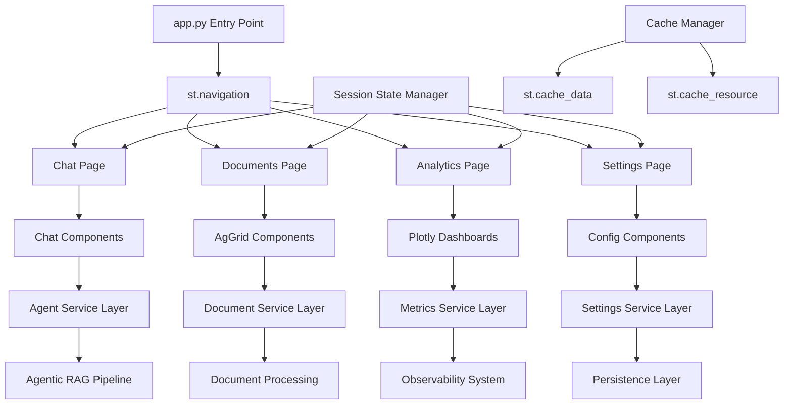

# ADR-013-NEW: User Interface Architecture

## Title

Premium Streamlit-Based Multipage UI with Modern Navigation and Component Integration

## Version/Date

2.0 / 2025-08-17

## Status

Proposed

## Description

Implements a premium, production-ready user interface using Streamlit's modern multipage architecture with programmatic navigation, advanced component integration, and intelligent state management. The UI seamlessly integrates with all DocMind AI capabilities while maintaining exceptional performance and user experience through sophisticated caching strategies and real-time updates.

## Context

The DocMind AI system requires a sophisticated interface that provides seamless access to:

1. **Agentic RAG Capabilities**: Multi-agent routing, corrective retrieval, self-validation (ADR-001)
2. **Multimodal Document Processing**: Text, images, tables with intelligent chunking (ADR-009)
3. **Adaptive Retrieval**: Hierarchical search with BGE-M3 + CLIP embeddings (ADR-002, ADR-003)
4. **Local-First LLM**: Qwen3-14B with 128K context for agent decisions (ADR-004)
5. **Production Observability**: Real-time monitoring and quality metrics (ADR-008, ADR-012)
6. **Session Persistence**: SQLite + Redis hybrid storage (ADR-007)

The interface must provide a premium user experience that showcases the system's sophisticated capabilities while maintaining simplicity and performance. Modern UI patterns, component libraries, and state management are essential for handling complex workflows and large datasets efficiently.

## Related Requirements

### Functional Requirements

- **FR-1:** **Multipage Navigation**: Programmatic page management with st.Page and st.navigation
- **FR-2:** **Document Management**: AgGrid-powered tables with sorting, filtering, batch operations
- **FR-3:** **Agentic Chat Interface**: Real-time streaming with agent activity visualization
- **FR-4:** **Analytics Dashboard**: Performance metrics, quality scores, hardware monitoring
- **FR-5:** **Settings Management**: Model configuration, hardware profiles, feature flags
- **FR-6:** **Session Persistence**: Cross-page state management and conversation history

### Non-Functional Requirements

- **NFR-1:** **(Performance)** <2s page load time, <100ms UI response time
- **NFR-2:** **(Scalability)** Handle 1000+ documents, 100+ concurrent chat sessions
- **NFR-3:** **(Accessibility)** WCAG 2.1 AA compliance, keyboard navigation
- **NFR-4:** **(Maintainability)** <500 lines per file, component-driven architecture

## Alternatives

### 1. Basic Streamlit with Directory-Based Pages

- **Description**: Traditional pages/ directory approach with limited navigation
- **Issues**: Inflexible navigation, poor state management, limited component integration
- **Score**: 4/10 (simplicity: 8, flexibility: 2, capabilities: 3)

### 2. Gradio Interface

- **Description**: ML-focused interface with built-in components
- **Issues**: Limited customization, poor multipage support, not suitable for complex workflows
- **Score**: 5/10 (simplicity: 9, flexibility: 2, capabilities: 5)

### 3. FastAPI + React Frontend

- **Description**: Separate backend API with modern web frontend
- **Issues**: Over-engineered for local-first app, increases deployment complexity
- **Score**: 6/10 (capability: 9, complexity: 2, local-first: 7)

### 4. Premium Streamlit with Modern Architecture (Selected)

- **Description**: Programmatic navigation, component integration, advanced state management
- **Benefits**: Rapid development, premium UX, Python-native, excellent performance
- **Score**: 9/10 (development: 9, integration: 10, performance: 9, UX: 9)

## Decision

We will implement a **Premium Streamlit UI** with modern multipage architecture and advanced component integration:

### Core Architecture

1. **Programmatic Navigation**: st.Page and st.navigation for flexible page management
2. **Component Integration**: streamlit-aggrid, plotly, option-menu for enhanced UX  
3. **Advanced State Management**: Multi-level session state with persistence
4. **Performance Optimization**: Strategic caching with st.cache_data/st.cache_resource
5. **Real-time Updates**: Fragment-based updates and background processing

### Page Structure

1. **Chat Page**: Agentic conversation interface with streaming and source attribution
2. **Documents Page**: AgGrid-powered document management with batch operations
3. **Analytics Page**: Performance metrics, quality dashboards, hardware monitoring
4. **Settings Page**: Model configuration, hardware profiles, feature management

## Related Decisions

- **ADR-001-NEW** (Modern Agentic RAG): UI visualizes agent routing, correction, validation
- **ADR-007-NEW** (Hybrid Persistence): Integrates SQLite + Redis session management  
- **ADR-008-NEW** (Production Observability): Real-time metrics and monitoring dashboard
- **ADR-009-NEW** (Document Processing): Multimodal document upload and processing UI
- **ADR-016-NEW** (UI State Management): Session state schema and caching strategy
- **ADR-017-NEW** (Component Library): Streamlit component selection and theming

## Design

### Application Architecture



### Modern Streamlit Implementation

#### Entry Point (app.py)

```python
import streamlit as st
from typing import Dict, Any

# Configure page
st.set_page_config(
    page_title="DocMind AI",
    page_icon="📄", 
    layout="wide",
    initial_sidebar_state="expanded"
)

# Initialize session state
if 'user_preferences' not in st.session_state:
    st.session_state.user_preferences = {
        'theme': 'light',
        'model_profile': 'standard',
        'show_advanced': False
    }

# Define pages with programmatic navigation
chat_page = st.Page(
    "pages/chat.py",
    title="Chat",
    icon="💬",
    default=True
)

documents_page = st.Page(
    "pages/documents.py", 
    title="Documents",
    icon="📁"
)

analytics_page = st.Page(
    "pages/analytics.py",
    title="Analytics", 
    icon="📊"
)

settings_page = st.Page(
    "pages/settings.py",
    title="Settings",
    icon="⚙️"
)

# Create navigation
pg = st.navigation({
    "Main": [chat_page, documents_page],
    "System": [analytics_page, settings_page]
})

# Add logo and branding
st.logo("assets/docmind_logo.png", icon_image="assets/docmind_icon.png")

# Run selected page
pg.run()
```

#### Session State Schema

```python
from dataclasses import dataclass, field
from typing import Dict, List, Set, Any, Optional
from datetime import datetime

@dataclass
class SessionState:
    """Comprehensive session state schema."""
    
    # Navigation & UI
    current_page: str = "chat"
    user_preferences: Dict[str, Any] = field(default_factory=dict)
    ui_theme: str = "light"
    
    # Chat Interface  
    messages: List[Dict[str, Any]] = field(default_factory=list)
    current_conversation_id: str = ""
    streaming_active: bool = False
    agent_activity: Dict[str, Any] = field(default_factory=dict)
    
    # Document Management
    uploaded_documents: List[Dict[str, Any]] = field(default_factory=list)
    selected_documents: Set[str] = field(default_factory=set)
    processing_queue: List[Dict[str, Any]] = field(default_factory=list)
    document_filters: Dict[str, Any] = field(default_factory=dict)
    
    # Settings & Configuration
    model_config: Dict[str, Any] = field(default_factory=lambda: {
        'profile': 'standard',
        'temperature': 0.1,
        'top_k': 10,
        'max_tokens': 4000
    })
    hardware_profile: str = "auto"
    feature_flags: Dict[str, bool] = field(default_factory=dict)
    
    # Analytics & Monitoring
    metrics_cache: Dict[str, Any] = field(default_factory=dict)
    last_metrics_refresh: Optional[datetime] = None
    performance_alerts: List[Dict[str, Any]] = field(default_factory=list)
```

#### Component Library Integration

```python
import streamlit as st
from st_aggrid import AgGrid, GridOptionsBuilder, GridUpdateMode
import plotly.express as px
import plotly.graph_objects as go
from streamlit_option_menu import option_menu

# Document table with AgGrid
@st.cache_data
def create_document_grid(documents: List[Dict]) -> AgGrid:
    """Create interactive document table with AgGrid."""
    
    gb = GridOptionsBuilder.from_dataframe(pd.DataFrame(documents))
    gb.configure_pagination(paginationAutoPageSize=True)
    gb.configure_side_bar()
    gb.configure_selection('multiple', use_checkbox=True)
    gb.configure_default_column(
        filterable=True,
        sortable=True, 
        resizable=True
    )
    
    return AgGrid(
        pd.DataFrame(documents),
        gridOptions=gb.build(),
        update_mode=GridUpdateMode.MODEL_CHANGED,
        allow_unsafe_jscode=True,
        theme='streamlit'
    )

# Performance metrics dashboard
@st.cache_data(ttl=300)  # Cache for 5 minutes  
def create_metrics_dashboard(metrics: Dict) -> None:
    """Create real-time metrics dashboard."""
    
    col1, col2, col3, col4 = st.columns(4)
    
    with col1:
        st.metric(
            "Query Latency", 
            f"{metrics.get('avg_latency', 0):.2f}s",
            delta=f"{metrics.get('latency_delta', 0):.2f}s"
        )
    
    with col2:
        st.metric(
            "Documents Processed",
            f"{metrics.get('docs_processed', 0):,}",
            delta=metrics.get('docs_delta', 0)
        )
    
    with col3:
        st.metric(
            "GPU Memory",
            f"{metrics.get('gpu_memory', 0):.1f} GB", 
            delta=f"{metrics.get('gpu_delta', 0):.1f} GB"
        )
    
    with col4:
        st.metric(
            "Active Sessions",
            f"{metrics.get('active_sessions', 0)}",
            delta=metrics.get('session_delta', 0)
        )
```

#### Caching Strategy

```python
import streamlit as st
from typing import Any, Dict, List
import time

# Data caching for frequently accessed data
@st.cache_data(ttl=3600)  # 1 hour TTL
def get_document_embeddings(doc_id: str) -> List[float]:
    """Cache document embeddings."""
    # Implementation would call embedding service
    pass

@st.cache_data(ttl=300)   # 5 minute TTL 
def get_query_results(query: str, filters: Dict) -> List[Dict]:
    """Cache query results for faster retrieval."""
    # Implementation would call search service
    pass

@st.cache_data(ttl=60)    # 1 minute TTL
def get_system_metrics() -> Dict[str, Any]:
    """Cache system performance metrics."""
    # Implementation would call monitoring service
    pass

# Resource caching for expensive operations
@st.cache_resource
def get_llm_model():
    """Cache LLM model instance."""
    # Implementation would load Qwen3-14B model
    pass

@st.cache_resource  
def get_vector_db_connection():
    """Cache vector database connection."""
    # Implementation would connect to Qdrant
    pass

@st.cache_resource
def get_document_processor():
    """Cache document processing pipeline."""
    # Implementation would create document processor
    pass
```

### Theme Configuration (.streamlit/config.toml)

```toml
[theme]
primaryColor = "#4A90E2"           # DocMind brand blue
backgroundColor = "#FFFFFF"         # Clean white base  
secondaryBackgroundColor = "#F8F9FA"  # Subtle gray for sections
textColor = "#2C3E50"              # Dark blue-gray for readability
font = "Inter"                     # Modern, readable font

[runner]
fastReruns = true
enforceSerializableSessionState = false

[server]
enableCORS = false
enableWebsocketCompression = true
enableXsrfProtection = true
maxUploadSize = 1000

[browser]
gatherUsageStats = false
```

### Project Structure

```text
docmind-ui/
├── app.py                       # Entry point with st.navigation
├── .streamlit/
│   └── config.toml             # Theme and performance config
├── assets/
│   ├── docmind_logo.png        # Main logo
│   └── docmind_icon.png        # App icon
├── pages/
│   ├── __init__.py
│   ├── chat.py                 # Main chat interface
│   ├── documents.py            # Document management with AgGrid
│   ├── analytics.py            # Metrics dashboard with Plotly
│   └── settings.py             # Configuration interface
├── components/
│   ├── __init__.py
│   ├── chat_interface.py       # Reusable chat components
│   ├── document_table.py       # AgGrid document table
│   ├── metrics_display.py      # Real-time metrics
│   └── navigation.py           # Custom navigation helpers
├── services/
│   ├── __init__.py
│   ├── session_manager.py      # State management utilities
│   ├── cache_manager.py        # Caching strategies
│   └── integration_layer.py    # ADR system integration
├── utils/
│   ├── __init__.py
│   ├── state_schema.py         # Session state definitions
│   ├── theme_manager.py        # Theme switching
│   └── performance.py          # Performance utilities
└── tests/
    ├── test_pages.py           # Page smoke tests
    ├── test_components.py      # Component unit tests
    └── test_integration.py     # Integration tests
```

## Implementation Phases

### Phase 1: Foundation (Week 1)

1. Create app.py with st.navigation setup
2. Implement base page structures with placeholders
3. Setup .streamlit/config.toml with theme configuration
4. Create session state schema and management utilities

### Phase 2: Core Features (Week 2-3)

1. Implement chat interface with streaming responses
2. Add document upload and AgGrid table management
3. Create settings page with model configuration
4. Build basic analytics dashboard

### Phase 3: Integration (Week 4-5)

1. Connect to agentic RAG pipeline (ADR-001)
2. Integrate document processing pipeline (ADR-009)
3. Link to observability system (ADR-008)
4. Add quality metrics and evaluation (ADR-012)

### Phase 4: Polish (Week 6)

1. Add loading states and error handling
2. Implement keyboard shortcuts and accessibility
3. Performance optimization and caching
4. Final testing and documentation

## Async Task Manager

```python
class AsyncTaskManager:
    """Manage async background tasks with cancellation support."""
    
    def __init__(self):
        self.active_tasks = {}
        self.executor = ThreadPoolExecutor(max_workers=3)
    
    def submit_task(self, task_id: str, task_func, *args, **kwargs):
        """Submit task for background execution."""
        future = self.executor.submit(task_func, *args, **kwargs)
        self.active_tasks[task_id] = future
        return future
    
    def cancel_task(self, task_id: str) -> bool:
        """Cancel active task if possible."""
        if task_id in self.active_tasks:
            future = self.active_tasks[task_id]
            return future.cancel()
        return False
    
    def get_task_status(self, task_id: str) -> str:
        """Get current task status."""
        if task_id not in self.active_tasks:
            return "not_found"
        
        future = self.active_tasks[task_id]
        if future.done():
            return "completed" if future.exception() is None else "failed"
        elif future.cancelled():
            return "cancelled"
        else:
            return "running"
```

## Consequences

### Positive Outcomes

- **Premium User Experience**: Modern navigation and component integration create professional UI
- **Excellent Performance**: Strategic caching and state management deliver <2s page loads
- **Comprehensive Functionality**: Complete access to all DocMind AI capabilities through intuitive interface
- **Maintainable Architecture**: Component-driven design with clear separation of concerns
- **Scalable Design**: AgGrid tables handle 1000+ documents, efficient state management
- **Real-time Updates**: Live metrics, streaming responses, background processing with progress
- **Accessibility Compliance**: WCAG 2.1 AA support with keyboard navigation and screen readers

### Negative Consequences / Trade-offs

- **Component Dependencies**: Reliance on external Streamlit components (aggrid, plotly, option-menu)
- **Streamlit Constraints**: Limited customization compared to full web frameworks  
- **Learning Curve**: Modern patterns require team familiarity with st.navigation and session state
- **Memory Usage**: Rich components and caching increase baseline memory consumption

### Performance Targets

- **Page Load Time**: <2s for all pages with cold cache
- **UI Response Time**: <100ms for user interactions  
- **Agent Decision Time**: <300ms for routing decisions
- **Document Processing**: >1 page/second with progress indicators
- **Memory Footprint**: <4GB total including models and cache

## Dependencies

- **Python**: `streamlit>=1.36.0`, `streamlit-aggrid>=0.3.4`, `plotly>=5.17.0`
- **Components**: `streamlit-option-menu>=0.3.6`, `streamlit-extras>=0.3.0`
- **Integration**: All ADR system dependencies (LlamaIndex, Qdrant, Qwen3-14B, etc.)
- **Assets**: Logo files, theme configuration, font resources

## Monitoring Metrics

- Page load times and UI response latency
- Component render performance and error rates  
- Session state size and cache hit rates
- User interaction patterns and feature usage
- AgGrid performance with large datasets
- Real-time update efficiency and accuracy

## Future Enhancements

- **Role-Based Access**: User authentication and permission-based navigation
- **Mobile Optimization**: Responsive design for tablet and mobile access
- **Advanced Theming**: Dark mode, custom color schemes, user preferences
- **Component Extensibility**: Custom Streamlit components for specialized features
- **Performance Analytics**: Detailed UI performance monitoring and optimization
- **Collaboration Features**: Multi-user session sharing and real-time collaboration

## Changelog

- **2.0 (2025-08-17)**: **MAJOR UPDATE** - Complete redesign with modern multipage architecture, component integration, advanced state management, and production-ready performance optimization
- **1.0 (2025-01-16)**: Initial user interface architecture with basic Streamlit implementation
