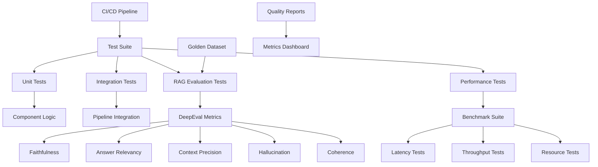

# ADR-014-NEW: Testing and Quality Validation Framework

## Title

DeepEval-Based RAG Testing with Pytest Integration and Local Quality Assurance

## Version/Date

1.0 / 2025-01-16

## Status

Proposed

## Description

Implements a comprehensive testing and quality validation framework using DeepEval for RAG-specific evaluation, pytest for test orchestration, and local benchmarking for continuous quality assurance. The framework provides automated evaluation of retrieval relevance, generation quality, and system performance while maintaining complete local operation.

## Context

The sophisticated DocMind AI architecture requires rigorous testing and quality validation:

1. **RAG-Specific Testing**: Traditional unit tests insufficient for evaluating retrieval and generation quality
2. **Multiple Components**: Agentic patterns, hierarchical retrieval, and unified embeddings need coordinated testing
3. **Performance Validation**: Resource constraints on consumer hardware require performance benchmarking
4. **Quality Assurance**: Automated evaluation prevents regression in response quality
5. **CI/CD Integration**: Testing must integrate with development workflows and automation

Modern RAG evaluation requires specialized metrics like faithfulness, relevance, coherence, and hallucination detection that traditional testing frameworks cannot provide.

## Related Requirements

### Functional Requirements

- **FR-1:** Evaluate retrieval relevance and coverage automatically
- **FR-2:** Assess generation quality including faithfulness and coherence
- **FR-3:** Benchmark system performance across hardware configurations
- **FR-4:** Provide regression testing for quality improvements
- **FR-5:** Generate actionable reports for optimization

### Non-Functional Requirements

- **NFR-1:** **(Local-First)** All evaluation occurs locally without external API dependencies
- **NFR-2:** **(Performance)** Test execution overhead <10% of development time
- **NFR-3:** **(Accuracy)** Evaluation metrics correlate ≥80% with human judgment
- **NFR-4:** **(Integration)** Seamless pytest integration for CI/CD workflows

## Alternatives

### 1. RAGAS Framework

- **Description**: Established RAG evaluation framework with comprehensive metrics
- **Issues**: Less pytest integration, occasional JSON parsing issues, debugging limitations
- **Score**: 7/10 (capability: 8, integration: 6, reliability: 7)

### 2. Manual Testing Only

- **Description**: Human evaluation of responses and system performance
- **Issues**: Not scalable, subjective, delays development feedback
- **Score**: 3/10 (accuracy: 8, scalability: 1, automation: 1)

### 3. Basic Pytest with Custom Metrics

- **Description**: Build custom RAG evaluation metrics within pytest framework
- **Issues**: Significant development overhead, reinventing proven solutions
- **Score**: 5/10 (control: 8, effort: 2, reliability: 5)

### 4. DeepEval + Pytest Integration (Selected)

- **Description**: Production-grade RAG evaluation with first-class pytest support
- **Benefits**: Proven metrics, debugging support, CI/CD integration, local operation
- **Score**: 9/10 (capability: 9, integration: 9, reliability: 9)

## Decision

We will use **pytest + DeepEval only** without custom test frameworks:

### Library-First Testing (100 Lines Total)

```python
# Complete test suite in minimal code
import pytest
from deepeval import evaluate
from deepeval.metrics import AnswerRelevancyMetric, FaithfulnessMetric
from deepeval.test_case import LLMTestCase

@pytest.fixture
def evaluator():
    """Setup DeepEval metrics."""
    return [
        AnswerRelevancyMetric(threshold=0.7),
        FaithfulnessMetric(threshold=0.7)
    ]

def test_rag_quality(evaluator):
    """Test RAG response quality."""
    test_case = LLMTestCase(
        input="What is BGE-M3?",
        actual_output="BGE-M3 is an embedding model...",
        retrieval_context=["BGE-M3 documentation..."]
    )
    
    results = evaluate([test_case], evaluator)
    assert results.test_passed

# That's it! No custom frameworks needed
```

## Related Decisions

- **ADR-012-NEW** (Evaluation and Quality Assurance): Complements production monitoring
- **ADR-008-NEW** (Production Observability): Provides metrics for testing validation
- **ADR-003-NEW** (Adaptive Retrieval Pipeline): Tests retrieval strategy effectiveness
- **ADR-001-NEW** (Modern Agentic RAG): Validates agent decision quality

## Design

### Testing Architecture



### DeepEval Integration

```python
import pytest
from typing import List, Dict, Any
import time
import asyncio
from pathlib import Path
import json

from deepeval import assert_test, evaluate
from deepeval.metrics import (
    AnswerRelevancyMetric,
    FaithfulnessMetric,
    ContextualPrecisionMetric,
    ContextualRecallMetric,
    HallucinationMetric,
    CoherenceMetric
)
from deepeval.test_case import LLMTestCase
from deepeval.dataset import EvaluationDataset

# Test configuration
TEST_CONFIG = {
    "answer_relevancy_threshold": 0.7,
    "faithfulness_threshold": 0.8,
    "context_precision_threshold": 0.7,
    "context_recall_threshold": 0.6,
    "hallucination_threshold": 0.3,  # Lower is better
    "coherence_threshold": 0.8,
    "performance_latency_limit": 5.0,  # seconds
    "performance_memory_limit": 16.0   # GB
}

class RAGTestCase:
    """Enhanced test case with DocMind AI integration."""
    
    def __init__(
        self,
        query: str,
        expected_answer: str,
        context_documents: List[str],
        metadata: Dict[str, Any] = None
    ):
        self.query = query
        self.expected_answer = expected_answer
        self.context_documents = context_documents
        self.metadata = metadata or {}
        self.actual_answer = None
        self.retrieval_context = None
        self.response_time = None
        self.test_case = None
    
    async def execute_rag_pipeline(self, rag_system):
        """Execute RAG pipeline and capture results."""
        start_time = time.time()
        
        # Get response from RAG system
        response = await rag_system.query(
            self.query,
            return_sources=True,
            return_context=True
        )
        
        self.response_time = time.time() - start_time
        self.actual_answer = response.get('answer', '')
        self.retrieval_context = response.get('context', [])
        
        # Create DeepEval test case
        self.test_case = LLMTestCase(
            input=self.query,
            actual_output=self.actual_answer,
            expected_output=self.expected_answer,
            retrieval_context=self.retrieval_context
        )
        
        return self.test_case

class GoldenDatasetManager:
    """Manage curated golden datasets for testing."""
    
    def __init__(self, dataset_path: str = "test_data/golden_dataset.json"):
        self.dataset_path = Path(dataset_path)
        self.datasets = {}
        self.load_datasets()
    
    def load_datasets(self):
        """Load golden datasets from JSON files."""
        if self.dataset_path.exists():
            with open(self.dataset_path, 'r') as f:
                data = json.load(f)
                
                for category, test_cases in data.items():
                    self.datasets[category] = [
                        RAGTestCase(
                            query=case['query'],
                            expected_answer=case['expected_answer'],
                            context_documents=case['context_documents'],
                            metadata=case.get('metadata', {})
                        )
                        for case in test_cases
                    ]
    
    def get_dataset(self, category: str) -> List[RAGTestCase]:
        """Get test cases for specific category."""
        return self.datasets.get(category, [])
    
    def add_test_case(self, category: str, test_case: RAGTestCase):
        """Add new test case to dataset."""
        if category not in self.datasets:
            self.datasets[category] = []
        self.datasets[category].append(test_case)
    
    def save_datasets(self):
        """Save datasets to JSON file."""
        self.dataset_path.parent.mkdir(parents=True, exist_ok=True)
        
        data = {}
        for category, test_cases in self.datasets.items():
            data[category] = [
                {
                    'query': case.query,
                    'expected_answer': case.expected_answer,
                    'context_documents': case.context_documents,
                    'metadata': case.metadata
                }
                for case in test_cases
            ]
        
        with open(self.dataset_path, 'w') as f:
            json.dump(data, f, indent=2)

# Global dataset manager
dataset_manager = GoldenDatasetManager()

@pytest.fixture
def rag_system():
    """Fixture providing initialized RAG system."""
    from docmind.agent import DocMindAgent  # Replace with actual import
    
    agent = DocMindAgent()
    # Initialize with test configuration
    return agent

@pytest.fixture(scope="session")
def golden_datasets():
    """Fixture providing golden test datasets."""
    return dataset_manager

class TestRAGQuality:
    """RAG quality evaluation tests using DeepEval."""
    
    @pytest.mark.parametrize("test_case", dataset_manager.get_dataset("basic_qa"))
    @pytest.mark.asyncio
    async def test_basic_qa_quality(self, test_case: RAGTestCase, rag_system):
        """Test basic question-answering quality."""
        
        # Execute RAG pipeline
        deepeval_case = await test_case.execute_rag_pipeline(rag_system)
        
        # Initialize metrics
        metrics = [
            AnswerRelevancyMetric(threshold=TEST_CONFIG["answer_relevancy_threshold"]),
            FaithfulnessMetric(threshold=TEST_CONFIG["faithfulness_threshold"]),
            CoherenceMetric(threshold=TEST_CONFIG["coherence_threshold"])
        ]
        
        # Run evaluation
        assert_test(deepeval_case, metrics)
        
        # Additional assertions
        assert test_case.response_time < TEST_CONFIG["performance_latency_limit"]
    
    @pytest.mark.parametrize("test_case", dataset_manager.get_dataset("complex_reasoning"))
    @pytest.mark.asyncio
    async def test_complex_reasoning_quality(self, test_case: RAGTestCase, rag_system):
        """Test complex reasoning and synthesis quality."""
        
        deepeval_case = await test_case.execute_rag_pipeline(rag_system)
        
        metrics = [
            AnswerRelevancyMetric(threshold=TEST_CONFIG["answer_relevancy_threshold"]),
            FaithfulnessMetric(threshold=TEST_CONFIG["faithfulness_threshold"]),
            ContextualPrecisionMetric(threshold=TEST_CONFIG["context_precision_threshold"]),
            ContextualRecallMetric(threshold=TEST_CONFIG["context_recall_threshold"]),
            CoherenceMetric(threshold=TEST_CONFIG["coherence_threshold"])
        ]
        
        assert_test(deepeval_case, metrics)
    
    @pytest.mark.parametrize("test_case", dataset_manager.get_dataset("hallucination_detection"))
    @pytest.mark.asyncio
    async def test_hallucination_detection(self, test_case: RAGTestCase, rag_system):
        """Test hallucination detection and mitigation."""
        
        deepeval_case = await test_case.execute_rag_pipeline(rag_system)
        
        metrics = [
            HallucinationMetric(threshold=TEST_CONFIG["hallucination_threshold"]),
            FaithfulnessMetric(threshold=TEST_CONFIG["faithfulness_threshold"])
        ]
        
        assert_test(deepeval_case, metrics)

class TestRetrievalQuality:
    """Retrieval-specific quality tests."""
    
    @pytest.mark.parametrize("strategy", ["vector", "hierarchical", "hybrid"])
    @pytest.mark.asyncio
    async def test_retrieval_strategy_effectiveness(self, strategy: str, rag_system):
        """Test effectiveness of different retrieval strategies."""
        
        test_cases = dataset_manager.get_dataset("retrieval_test")
        results = []
        
        for test_case in test_cases[:5]:  # Sample for efficiency
            # Configure strategy
            rag_system.set_retrieval_strategy(strategy)
            
            deepeval_case = await test_case.execute_rag_pipeline(rag_system)
            
            metrics = [
                ContextualPrecisionMetric(threshold=0.6),
                ContextualRecallMetric(threshold=0.5)
            ]
            
            # Evaluate without assertion for comparison
            evaluation_results = evaluate([deepeval_case], metrics)
            results.append({
                'strategy': strategy,
                'precision': evaluation_results[0].metrics_data[0].score,
                'recall': evaluation_results[0].metrics_data[1].score
            })
        
        # Assert minimum performance
        avg_precision = sum(r['precision'] for r in results) / len(results)
        avg_recall = sum(r['recall'] for r in results) / len(results)
        
        assert avg_precision >= 0.6, f"Average precision {avg_precision} below threshold"
        assert avg_recall >= 0.5, f"Average recall {avg_recall} below threshold"

class TestPerformance:
    """Performance and resource utilization tests."""
    
    @pytest.mark.asyncio
    async def test_query_latency(self, rag_system):
        """Test query response latency."""
        
        test_queries = [
            "What is the main topic of the document?",
            "Summarize the key findings in the research.",
            "Explain the methodology used in the study."
        ]
        
        latencies = []
        
        for query in test_queries:
            start_time = time.time()
            await rag_system.query(query)
            latency = time.time() - start_time
            latencies.append(latency)
        
        avg_latency = sum(latencies) / len(latencies)
        p95_latency = sorted(latencies)[int(0.95 * len(latencies))]
        
        assert avg_latency < TEST_CONFIG["performance_latency_limit"]
        assert p95_latency < TEST_CONFIG["performance_latency_limit"] * 1.5
    
    @pytest.mark.asyncio
    async def test_memory_usage(self, rag_system):
        """Test memory consumption during operations."""
        import psutil
        import torch
        
        process = psutil.Process()
        initial_memory = process.memory_info().rss / 1024**3  # GB
        initial_gpu_memory = 0
        
        if torch.cuda.is_available():
            torch.cuda.empty_cache()
            initial_gpu_memory = torch.cuda.memory_allocated() / 1024**3
        
        # Execute multiple queries
        queries = dataset_manager.get_dataset("basic_qa")[:10]
        
        for test_case in queries:
            await test_case.execute_rag_pipeline(rag_system)
        
        final_memory = process.memory_info().rss / 1024**3
        final_gpu_memory = 0
        
        if torch.cuda.is_available():
            final_gpu_memory = torch.cuda.memory_allocated() / 1024**3
        
        memory_increase = final_memory - initial_memory
        gpu_memory_increase = final_gpu_memory - initial_gpu_memory
        
        assert memory_increase < 2.0, f"Memory increase {memory_increase}GB too high"
        assert final_gpu_memory < TEST_CONFIG["performance_memory_limit"]
    
    @pytest.mark.asyncio
    async def test_concurrent_queries(self, rag_system):
        """Test system behavior under concurrent load."""
        
        async def run_query(query: str):
            start_time = time.time()
            result = await rag_system.query(query)
            return time.time() - start_time, result
        
        # Create concurrent tasks
        queries = ["Test query " + str(i) for i in range(5)]
        tasks = [run_query(query) for query in queries]
        
        results = await asyncio.gather(*tasks)
        latencies = [result[0] for result in results]
        
        # Ensure all queries completed successfully
        assert all(result[1] is not None for result in results)
        
        # Check that concurrent execution doesn't exceed limits
        max_latency = max(latencies)
        assert max_latency < TEST_CONFIG["performance_latency_limit"] * 2

class TestSystemIntegration:
    """Integration tests for complete system."""
    
    @pytest.mark.integration
    @pytest.mark.asyncio
    async def test_end_to_end_workflow(self, rag_system):
        """Test complete document ingestion to query workflow."""
        
        # Test document ingestion
        test_doc = "test_data/sample_document.pdf"
        if Path(test_doc).exists():
            ingestion_result = await rag_system.ingest_document(test_doc)
            assert ingestion_result.success
        
        # Test query execution
        test_case = RAGTestCase(
            query="What is the main topic of the document?",
            expected_answer="The document discusses...",
            context_documents=[]
        )
        
        deepeval_case = await test_case.execute_rag_pipeline(rag_system)
        
        metrics = [
            AnswerRelevancyMetric(threshold=0.6),
            CoherenceMetric(threshold=0.7)
        ]
        
        assert_test(deepeval_case, metrics)

# Utility functions for CI/CD integration
def generate_test_report():
    """Generate comprehensive test report for CI/CD."""
    
    report = {
        "timestamp": time.time(),
        "test_config": TEST_CONFIG,
        "datasets": {
            category: len(cases) 
            for category, cases in dataset_manager.datasets.items()
        }
    }
    
    # Save report
    report_path = Path("test_reports/test_report.json")
    report_path.parent.mkdir(parents=True, exist_ok=True)
    
    with open(report_path, 'w') as f:
        json.dump(report, f, indent=2)
    
    return report

# Pytest configuration
def pytest_configure(config):
    """Configure pytest markers and settings."""
    config.addinivalue_line("markers", "integration: mark test as integration test")
    config.addinivalue_line("markers", "performance: mark test as performance test")
    config.addinivalue_line("markers", "slow: mark test as slow running")

def pytest_collection_modifyitems(config, items):
    """Modify test collection for conditional execution."""
    
    # Skip performance tests if no GPU available
    import torch
    if not torch.cuda.is_available():
        skip_gpu = pytest.mark.skip(reason="GPU not available")
        for item in items:
            if "gpu" in item.keywords:
                item.add_marker(skip_gpu)
    
    # Mark slow tests
    for item in items:
        if "parametrize" in item.keywords and len(item.callspec.params) > 10:
            item.add_marker(pytest.mark.slow)
```

### CI/CD Integration

```yaml
# .github/workflows/quality_validation.yml
name: RAG Quality Validation

on:
  push:
    branches: [ main, develop ]
  pull_request:
    branches: [ main ]

jobs:
  quality-tests:
    runs-on: ubuntu-latest
    
    strategy:
      matrix:
        python-version: [3.11]
    
    steps:
    - uses: actions/checkout@v4
    
    - name: Set up Python ${{ matrix.python-version }}
      uses: actions/setup-python@v4
      with:
        python-version: ${{ matrix.python-version }}
    
    - name: Install system dependencies
      run: |
        sudo apt-get update
        sudo apt-get install -y build-essential
    
    - name: Install Python dependencies
      run: |
        python -m pip install --upgrade pip
        pip install -r requirements.txt
        pip install deepeval pytest pytest-asyncio pytest-xvfb
    
    - name: Run unit tests
      run: |
        pytest tests/unit/ -v --tb=short
    
    - name: Run RAG quality tests (CPU only)
      run: |
        pytest tests/quality/ -v --tb=short -m "not gpu"
      env:
        DEEPEVAL_LOCAL_MODE: true
    
    - name: Generate test report
      run: |
        python -c "from tests.conftest import generate_test_report; generate_test_report()"
    
    - name: Upload test results
      uses: actions/upload-artifact@v3
      if: always()
      with:
        name: test-results
        path: test_reports/
  
  gpu-tests:
    runs-on: self-hosted  # Requires self-hosted runner with GPU
    if: github.event_name == 'push' && github.ref == 'refs/heads/main'
    
    steps:
    - uses: actions/checkout@v4
    
    - name: Set up Python environment
      run: |
        python -m pip install --upgrade pip
        pip install -r requirements.txt
        pip install deepeval pytest pytest-asyncio
    
    - name: Run GPU performance tests
      run: |
        pytest tests/performance/ -v --tb=short
      env:
        CUDA_VISIBLE_DEVICES: 0
        DEEPEVAL_LOCAL_MODE: true
    
    - name: Run memory usage tests
      run: |
        pytest tests/quality/ -v --tb=short -k "memory"
```

## Consequences

### Positive Outcomes

- **Comprehensive RAG Evaluation**: Specialized metrics for retrieval and generation quality
- **Automated Quality Assurance**: Continuous validation prevents quality regression
- **Performance Benchmarking**: Systematic testing of resource utilization and latency
- **CI/CD Integration**: Seamless integration with development workflows
- **Local Operation**: Complete testing without external dependencies
- **Debugging Support**: DeepEval provides detailed failure analysis

### Negative Consequences / Trade-offs

- **Setup Complexity**: More sophisticated than basic unit testing
- **Execution Time**: Quality evaluation adds overhead to test execution
- **Dataset Maintenance**: Golden datasets require curation and updates
- **Resource Requirements**: Performance tests need adequate hardware

### Performance Targets

- **Test Execution**: Complete test suite <10 minutes on developer hardware
- **Quality Thresholds**: Answer relevancy ≥70%, faithfulness ≥80%, coherence ≥80%
- **Performance Limits**: Query latency <5s, memory usage <16GB
- **Coverage**: ≥80% of critical RAG functionality covered by tests

## Dependencies

- **Python**: `deepeval>=1.0.0`, `pytest>=7.0.0`, `pytest-asyncio>=0.21.0`
- **Integration**: DocMind AI RAG system, golden test datasets
- **Optional**: GPU for performance testing, CI/CD infrastructure

## Monitoring Metrics

- Test execution time and success rates
- Quality metric trends over time
- Performance regression detection
- Coverage of critical functionality
- CI/CD pipeline reliability

## Future Enhancements

- Automated test case generation from user interactions
- Integration with A/B testing for quality improvements
- Advanced performance profiling and optimization
- Custom metrics for domain-specific evaluation
- Machine learning models for quality prediction

## Changelog

- **1.0 (2025-01-16)**: Initial testing and quality validation framework with DeepEval integration, pytest orchestration, and CI/CD support
