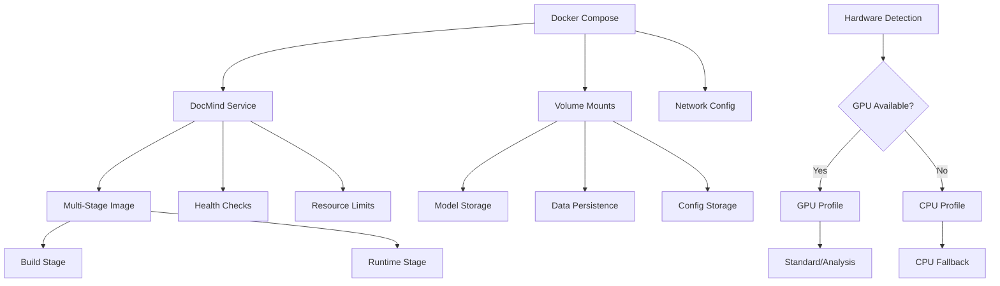

# ADR-015-NEW: Deployment and Packaging Strategy

## Title

Docker-First Local Deployment with GPU Support and Multi-Profile Configuration

## Version/Date

1.0 / 2025-01-16

## Status

Proposed

## Description

Implements a comprehensive deployment and packaging strategy using Docker with NVIDIA GPU runtime support, multi-stage builds for optimization, and multiple deployment profiles for different hardware configurations. The strategy prioritizes local-first operation, ease of setup, and hardware adaptability while maintaining production-quality packaging.

## Context

The DocMind AI system requires sophisticated deployment packaging to handle:

1. **Hardware Diversity**: Support RTX 3060-4090 with varying VRAM and capabilities
2. **Model Management**: Large language models, embeddings, and rerankers require careful packaging
3. **Dependency Complexity**: PyTorch, CUDA, LlamaIndex, and numerous Python packages
4. **Local-First Operation**: No external network dependencies after initial setup
5. **Resource Optimization**: Efficient use of storage, memory, and GPU resources
6. **User Experience**: Simple one-command deployment for end users

The deployment must work seamlessly across Linux, Windows WSL2, and macOS (CPU fallback) while providing clear configuration options for different use cases.

## Related Requirements

### Functional Requirements

- **FR-1:** Support multiple hardware profiles with automatic detection and fallback
- **FR-2:** Package all models and dependencies for offline operation
- **FR-3:** Provide one-command deployment with docker-compose
- **FR-4:** Enable persistent storage for documents, conversations, and model caches
- **FR-5:** Support graceful startup/shutdown with proper resource cleanup

### Non-Functional Requirements

- **NFR-1:** **(Startup Time)** Cold start <60s on RTX 4090, <120s on RTX 3060
- **NFR-2:** **(Image Size)** Compressed Docker images <3GB for efficient distribution
- **NFR-3:** **(Resource Efficiency)** Automatic GPU memory management and CPU fallback
- **NFR-4:** **(Reliability)** Health checks and automatic recovery from failures

## Alternatives

### 1. Native Python Installation

- **Description**: Direct pip/conda installation on host system
- **Issues**: Complex dependency management, version conflicts, difficult GPU setup
- **Score**: 4/10 (simplicity: 2, reliability: 3, portability: 7)

### 2. Virtual Machine Packaging

- **Description**: Complete system packaged as VM image
- **Issues**: Large size, poor performance, complex GPU passthrough
- **Score**: 3/10 (portability: 7, performance: 1, size: 2)

### 3. Kubernetes Deployment

- **Description**: Cloud-native deployment with Kubernetes orchestration
- **Issues**: Over-engineered for local-first single-user application
- **Score**: 5/10 (scalability: 9, complexity: 1, local-first: 2)

### 4. Docker with GPU Support (Selected)

- **Description**: Containerized deployment with NVIDIA runtime and multi-profile support
- **Benefits**: Reproducible, portable, hardware-adaptive, efficient resource usage
- **Score**: 9/10 (portability: 9, performance: 8, usability: 9)

## Decision

We will implement **Docker-first deployment** with comprehensive GPU support and multi-profile configuration:

### Core Components

1. **Multi-Stage Docker Images**: Optimized build and runtime stages
2. **Hardware Profiles**: Standard (32K), Analysis (128K), and CPU-only configurations
3. **Volume Management**: Persistent storage for models, data, and conversations
4. **Health Monitoring**: Startup checks and runtime health validation
5. **Resource Management**: Automatic GPU detection and memory limits

## Related Decisions

- **ADR-004-NEW** (Local-First LLM Strategy): Packages local models for offline operation
- **ADR-010-NEW** (Performance Optimization): Implements resource-adaptive configurations
- **ADR-013-NEW** (User Interface Architecture): Provides web interface through container
- **ADR-007-NEW** (Hybrid Persistence Strategy): Manages persistent storage in containers

## Design

### Deployment Architecture



### Multi-Stage Dockerfile

```dockerfile
# Multi-stage Docker build for DocMind AI
# Stage 1: Build environment
FROM nvidia/cuda:12.1-devel-ubuntu22.04 as builder

# Set non-interactive installation
ENV DEBIAN_FRONTEND=noninteractive

# Install system dependencies
RUN apt-get update && apt-get install -y \
    python3.11 \
    python3.11-dev \
    python3.11-venv \
    python3-pip \
    build-essential \
    git \
    curl \
    && rm -rf /var/lib/apt/lists/*

# Create Python virtual environment
RUN python3.11 -m venv /opt/venv
ENV PATH="/opt/venv/bin:$PATH"

# Upgrade pip and install basic tools
RUN pip install --upgrade pip setuptools wheel

# Copy requirements and install Python dependencies
COPY requirements.txt /tmp/requirements.txt
RUN pip install --no-cache-dir -r /tmp/requirements.txt

# Install PyTorch with CUDA support
RUN pip install torch torchvision torchaudio --index-url https://download.pytorch.org/whl/cu121

# Pre-download and cache models (optional for faster startup)
COPY scripts/download_models.py /tmp/download_models.py
RUN python /tmp/download_models.py --cache-only

# Stage 2: Runtime environment
FROM nvidia/cuda:12.1-runtime-ubuntu22.04

# Set non-interactive installation
ENV DEBIAN_FRONTEND=noninteractive

# Install minimal runtime dependencies
RUN apt-get update && apt-get install -y \
    python3.11 \
    python3.11-venv \
    curl \
    sqlite3 \
    && rm -rf /var/lib/apt/lists/*

# Copy virtual environment from builder
COPY --from=builder /opt/venv /opt/venv
ENV PATH="/opt/venv/bin:$PATH"

# Create application directory
WORKDIR /app

# Create non-root user for security
RUN groupadd -g 1000 docmind && \
    useradd -u 1000 -g docmind -m docmind

# Copy application code
COPY --chown=docmind:docmind . /app

# Create directories for persistent storage
RUN mkdir -p /app/data/{models,documents,conversations,cache} && \
    chown -R docmind:docmind /app/data

# Switch to non-root user
USER docmind

# Environment variables
ENV PYTHONPATH=/app
ENV CUDA_VISIBLE_DEVICES=0
ENV DOCMIND_DATA_DIR=/app/data
ENV DOCMIND_MODEL_CACHE=/app/data/models
ENV DOCMIND_LOG_LEVEL=INFO

# Expose application port
EXPOSE 8501

# Health check
HEALTHCHECK --interval=30s --timeout=10s --start-period=60s --retries=3 \
    CMD curl -f http://localhost:8501/_stcore/health || exit 1

# Default command
CMD ["python", "-m", "streamlit", "run", "app.py", "--server.port=8501", "--server.address=0.0.0.0"]
```

### Docker Compose Configuration

```yaml
# docker-compose.yml - Main configuration
version: '3.8'

services:
  docmind:
    build:
      context: .
      dockerfile: Dockerfile
      args:
        - PROFILE=${DOCMIND_PROFILE:-standard}
    image: docmind-ai:latest
    container_name: docmind-ai
    restart: unless-stopped
    
    # GPU support
    deploy:
      resources:
        reservations:
          devices:
            - driver: nvidia
              count: 1
              capabilities: [gpu]
    
    # Environment configuration
    environment:
      - DOCMIND_PROFILE=${DOCMIND_PROFILE:-standard}
      - DOCMIND_GPU_MEMORY_LIMIT=${DOCMIND_GPU_MEMORY_LIMIT:-12}
      - DOCMIND_CONTEXT_LENGTH=${DOCMIND_CONTEXT_LENGTH:-32768}
      - DOCMIND_LOG_LEVEL=${DOCMIND_LOG_LEVEL:-INFO}
      - CUDA_VISIBLE_DEVICES=0
    
    # Port mapping
    ports:
      - "8501:8501"
    
    # Volume mounts for persistence
    volumes:
      - ./data/models:/app/data/models
      - ./data/documents:/app/data/documents
      - ./data/conversations:/app/data/conversations
      - ./data/cache:/app/data/cache
      - ./config:/app/config
    
    # Health check
    healthcheck:
      test: ["CMD", "curl", "-f", "http://localhost:8501/_stcore/health"]
      interval: 30s
      timeout: 10s
      retries: 3
      start_period: 60s
    
    # Resource limits
    mem_limit: 20g
    memswap_limit: 20g
    
    # Network configuration
    networks:
      - docmind-network

# Separate profiles for different hardware configurations
  docmind-standard:
    extends:
      service: docmind
    environment:
      - DOCMIND_PROFILE=standard
      - DOCMIND_GPU_MEMORY_LIMIT=8
      - DOCMIND_CONTEXT_LENGTH=32768
    deploy:
      resources:
        limits:
          memory: 16g
        reservations:
          devices:
            - driver: nvidia
              count: 1
              capabilities: [gpu]

  docmind-analysis:
    extends:
      service: docmind
    environment:
      - DOCMIND_PROFILE=analysis
      - DOCMIND_GPU_MEMORY_LIMIT=16
      - DOCMIND_CONTEXT_LENGTH=131072
    deploy:
      resources:
        limits:
          memory: 24g
        reservations:
          devices:
            - driver: nvidia
              count: 1
              capabilities: [gpu]

  docmind-cpu:
    extends:
      service: docmind
    environment:
      - DOCMIND_PROFILE=cpu
      - DOCMIND_GPU_MEMORY_LIMIT=0
      - DOCMIND_CONTEXT_LENGTH=32768
      - CUDA_VISIBLE_DEVICES=""
    deploy:
      resources:
        limits:
          memory: 12g
    # Remove GPU reservations for CPU-only mode

networks:
  docmind-network:
    driver: bridge

volumes:
  models:
    driver: local
  documents:
    driver: local
  conversations:
    driver: local
  cache:
    driver: local
```

### Hardware Detection and Configuration

```python
import os
import torch
import psutil
import subprocess
import json
from pathlib import Path
from typing import Dict, Any, Optional

class HardwareProfileManager:
    """Manage hardware detection and profile configuration."""
    
    def __init__(self):
        self.profile = None
        self.hardware_info = {}
        self.detect_hardware()
    
    def detect_hardware(self) -> Dict[str, Any]:
        """Detect available hardware and capabilities."""
        
        # CPU information
        cpu_info = {
            'cores': psutil.cpu_count(logical=False),
            'threads': psutil.cpu_count(logical=True),
            'memory_gb': psutil.virtual_memory().total / (1024**3)
        }
        
        # GPU information
        gpu_info = {
            'available': torch.cuda.is_available(),
            'count': torch.cuda.device_count() if torch.cuda.is_available() else 0,
            'devices': []
        }
        
        if gpu_info['available']:
            for i in range(gpu_info['count']):
                try:
                    device_props = torch.cuda.get_device_properties(i)
                    device_info = {
                        'name': device_props.name,
                        'memory_gb': device_props.total_memory / (1024**3),
                        'compute_capability': f"{device_props.major}.{device_props.minor}"
                    }
                    gpu_info['devices'].append(device_info)
                except Exception as e:
                    print(f"Error detecting GPU {i}: {e}")
        
        self.hardware_info = {
            'cpu': cpu_info,
            'gpu': gpu_info
        }
        
        return self.hardware_info
    
    def determine_optimal_profile(self) -> str:
        """Determine optimal deployment profile based on hardware."""
        
        if not self.hardware_info['gpu']['available']:
            return 'cpu'
        
        # Get primary GPU memory
        if self.hardware_info['gpu']['devices']:
            gpu_memory = self.hardware_info['gpu']['devices'][0]['memory_gb']
            
            # Profile selection based on GPU memory
            if gpu_memory >= 16:
                return 'analysis'  # High-end GPU (RTX 4090, etc.)
            elif gpu_memory >= 8:
                return 'standard'  # Mid-range GPU (RTX 4060, 3070, etc.)
            else:
                return 'cpu'      # Low VRAM, fallback to CPU
        
        return 'cpu'
    
    def get_profile_config(self, profile: str = None) -> Dict[str, Any]:
        """Get configuration for specified profile."""
        
        if profile is None:
            profile = self.determine_optimal_profile()
        
        profiles = {
            'standard': {
                'gpu_memory_limit': 8,
                'context_length': 32768,
                'model_precision': '4bit',
                'batch_size': 1,
                'max_concurrent_queries': 2,
                'description': 'Optimized for RTX 3060-4060 class GPUs'
            },
            'analysis': {
                'gpu_memory_limit': 16,
                'context_length': 131072,
                'model_precision': '4bit',
                'batch_size': 1,
                'max_concurrent_queries': 1,
                'description': 'High-performance mode for RTX 4070+ GPUs'
            },
            'cpu': {
                'gpu_memory_limit': 0,
                'context_length': 32768,
                'model_precision': '8bit',
                'batch_size': 1,
                'max_concurrent_queries': 1,
                'description': 'CPU-only fallback mode'
            }
        }
        
        return profiles.get(profile, profiles['cpu'])
    
    def validate_profile_compatibility(self, profile: str) -> bool:
        """Validate if profile is compatible with current hardware."""
        
        config = self.get_profile_config(profile)
        
        # Check GPU requirements
        if config['gpu_memory_limit'] > 0:
            if not self.hardware_info['gpu']['available']:
                return False
            
            if self.hardware_info['gpu']['devices']:
                available_memory = self.hardware_info['gpu']['devices'][0]['memory_gb']
                required_memory = config['gpu_memory_limit']
                
                if available_memory < required_memory * 0.8:  # 80% margin
                    return False
        
        # Check system memory
        required_ram = 8 if profile == 'cpu' else 12
        available_ram = self.hardware_info['cpu']['memory_gb']
        
        if available_ram < required_ram:
            return False
        
        return True
    
    def generate_docker_env(self, profile: str = None) -> str:
        """Generate .env file for Docker Compose."""
        
        if profile is None:
            profile = self.determine_optimal_profile()
        
        config = self.get_profile_config(profile)
        
        env_content = f"""# DocMind AI Configuration
DOCMIND_PROFILE={profile}
DOCMIND_GPU_MEMORY_LIMIT={config['gpu_memory_limit']}
DOCMIND_CONTEXT_LENGTH={config['context_length']}
DOCMIND_MODEL_PRECISION={config['model_precision']}
DOCMIND_BATCH_SIZE={config['batch_size']}
DOCMIND_MAX_CONCURRENT_QUERIES={config['max_concurrent_queries']}
DOCMIND_LOG_LEVEL=INFO

# Hardware Info (for reference)
# CPU Cores: {self.hardware_info['cpu']['cores']}
# System RAM: {self.hardware_info['cpu']['memory_gb']:.1f}GB
# GPU Available: {self.hardware_info['gpu']['available']}
"""
        
        if self.hardware_info['gpu']['available'] and self.hardware_info['gpu']['devices']:
            gpu = self.hardware_info['gpu']['devices'][0]
            env_content += f"# GPU: {gpu['name']} ({gpu['memory_gb']:.1f}GB)\n"
        
        return env_content

def setup_deployment():
    """Setup deployment configuration based on hardware."""
    
    print("🔍 Detecting hardware configuration...")
    manager = HardwareProfileManager()
    
    hardware = manager.hardware_info
    optimal_profile = manager.determine_optimal_profile()
    
    print(f"\n💻 Hardware Detection Results:")
    print(f"CPU: {hardware['cpu']['cores']} cores, {hardware['cpu']['memory_gb']:.1f}GB RAM")
    
    if hardware['gpu']['available']:
        for i, gpu in enumerate(hardware['gpu']['devices']):
            print(f"GPU {i}: {gpu['name']} ({gpu['memory_gb']:.1f}GB VRAM)")
    else:
        print("GPU: Not available")
    
    print(f"\n🎯 Recommended Profile: {optimal_profile}")
    config = manager.get_profile_config(optimal_profile)
    print(f"Description: {config['description']}")
    
    # Generate .env file
    env_content = manager.generate_docker_env(optimal_profile)
    with open('.env', 'w') as f:
        f.write(env_content)
    
    print(f"\n✅ Generated .env file with {optimal_profile} profile")
    print("\n🚀 To start DocMind AI, run:")
    print("docker-compose up -d")
    
    return optimal_profile, config

if __name__ == "__main__":
    setup_deployment()
```

### Startup and Management Scripts

```bash
#!/bin/bash
# scripts/start.sh - Startup script with hardware detection

set -e

echo "🚀 Starting DocMind AI..."

# Check Docker and Docker Compose
if ! command -v docker &> /dev/null; then
    echo "❌ Docker not found. Please install Docker first."
    exit 1
fi

if ! command -v docker-compose &> /dev/null; then
    echo "❌ Docker Compose not found. Please install Docker Compose first."
    exit 1
fi

# Check for NVIDIA Docker support
if command -v nvidia-smi &> /dev/null; then
    echo "🔍 NVIDIA GPU detected, checking Docker GPU support..."
    if docker run --rm --gpus all nvidia/cuda:11.8-base-ubuntu22.04 nvidia-smi &> /dev/null; then
        echo "✅ NVIDIA Docker runtime available"
        export DOCMIND_GPU_SUPPORT=true
    else
        echo "⚠️  NVIDIA Docker runtime not available, falling back to CPU"
        export DOCMIND_GPU_SUPPORT=false
    fi
else
    echo "ℹ️  No NVIDIA GPU detected, using CPU mode"
    export DOCMIND_GPU_SUPPORT=false
fi

# Run hardware detection and configuration
echo "🔧 Configuring deployment based on hardware..."
python scripts/setup_deployment.py

# Create required directories
mkdir -p data/{models,documents,conversations,cache}
mkdir -p config
mkdir -p logs

# Pull/build images
echo "📦 Building DocMind AI image..."
docker-compose build

# Start services
echo "🚀 Starting services..."
docker-compose up -d

# Wait for health check
echo "⏳ Waiting for DocMind AI to start..."
for i in {1..30}; do
    if docker-compose exec -T docmind curl -f http://localhost:8501/_stcore/health &> /dev/null; then
        echo "✅ DocMind AI is ready!"
        echo "🌐 Access the interface at: http://localhost:8501"
        break
    fi
    
    if [ $i -eq 30 ]; then
        echo "❌ DocMind AI failed to start within 5 minutes"
        echo "📋 Check logs with: docker-compose logs"
        exit 1
    fi
    
    sleep 10
done

# Show status
docker-compose ps
```

```bash
#!/bin/bash
# scripts/stop.sh - Graceful shutdown script

echo "🛑 Stopping DocMind AI..."

# Graceful shutdown
docker-compose down --timeout 30

echo "✅ DocMind AI stopped successfully"

# Optional: show storage usage
echo "📊 Storage usage:"
du -sh data/
```

## Consequences

### Positive Outcomes

- **Reproducible Deployment**: Consistent environment across different systems
- **Hardware Adaptive**: Automatic optimization for available GPU resources
- **User-Friendly**: One-command deployment with intelligent configuration
- **Persistent Storage**: Documents and conversations preserved across restarts
- **Resource Efficient**: Optimized images and memory management
- **Production Ready**: Health checks, logging, and error recovery

### Negative Consequences / Trade-offs

- **Docker Dependency**: Requires Docker installation and GPU runtime setup
- **Initial Download**: Large model downloads on first startup
- **Resource Overhead**: Container overhead vs native installation
- **Configuration Complexity**: Multiple profiles may confuse some users

### Performance Targets

- **Cold Start**: <60s on RTX 4090, <120s on RTX 3060 with cached models
- **Image Size**: <3GB compressed for main application image
- **Memory Efficiency**: <2GB overhead vs native Python installation
- **GPU Detection**: Automatic hardware detection and profile selection

## Dependencies

- **Docker**: Docker Engine ≥24.0.0 with Docker Compose ≥v2.26.1
- **GPU Support**: NVIDIA Container Toolkit for GPU acceleration
- **System**: Linux (native), Windows (WSL2), macOS (CPU fallback)

## Monitoring Metrics

- Container startup time and success rates
- Resource utilization in containerized environment
- Health check status and failure recovery
- Model download and caching effectiveness
- User deployment success across different hardware

## Future Enhancements

- Kubernetes deployment option for enterprise use
- ARM64 support for Apple Silicon and other ARM platforms
- Automated model updates and version management
- Integration with container registries for distribution
- Advanced resource scheduling and load balancing

## Changelog

- **1.0 (2025-01-16)**: Initial deployment and packaging strategy with Docker, GPU support, multi-profile configuration, and hardware detection
