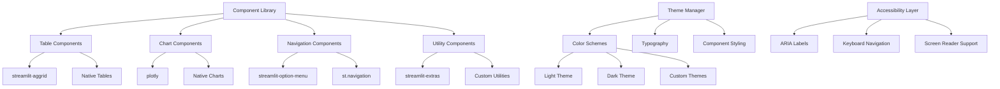

# ADR-017-NEW: Component Library and Theming Architecture

## Title

Streamlit Component Integration with Premium Theming and Accessibility

## Version/Date

1.0 / 2025-08-17

## Status

Proposed

## Description

Implements a comprehensive component library strategy for the DocMind AI Streamlit interface, featuring best-in-class third-party components (AgGrid, Plotly, Option Menu), custom theme architecture with dark/light modes, and full accessibility compliance. The system provides a cohesive, professional user experience while maintaining performance and extensibility.

## Context

The premium Streamlit UI (ADR-013-NEW) requires sophisticated components to deliver enterprise-grade functionality:

1. **Interactive Data Tables**: Handle 1000+ documents with sorting, filtering, selection, and pagination
2. **Advanced Visualizations**: Real-time metrics, performance charts, and analytics dashboards  
3. **Professional Navigation**: Icon-based menus with responsive design and accessibility
4. **Consistent Theming**: Cohesive visual design with customizable themes and brand alignment
5. **Accessibility Standards**: WCAG 2.1 AA compliance for inclusive user experience

Native Streamlit components alone cannot deliver the level of sophistication required for a premium AI application interface.

## Related Requirements

### Functional Requirements

- **FR-1:** **Interactive Tables**: AgGrid for document management with advanced features
- **FR-2:** **Rich Visualizations**: Plotly for real-time metrics and analytics dashboards
- **FR-3:** **Professional Navigation**: Custom menu components with icons and responsive design
- **FR-4:** **Theme Consistency**: Unified color scheme, typography, and component styling
- **FR-5:** **Accessibility Support**: Screen reader compatibility, keyboard navigation, focus management

### Non-Functional Requirements

- **NFR-1:** **(Performance)** <200ms component render time, efficient re-rendering
- **NFR-2:** **(Accessibility)** WCAG 2.1 AA compliance, 4.5:1 color contrast
- **NFR-3:** **(Responsiveness)** Adaptive design for 1024px+ screen widths
- **NFR-4:** **(Maintainability)** Component abstraction with clean APIs

## Alternatives

### 1. Native Streamlit Components Only

- **Description**: Use only built-in Streamlit components (st.dataframe, st.selectbox, etc.)
- **Issues**: Limited functionality, poor user experience, no advanced features
- **Score**: 4/10 (simplicity: 9, functionality: 2, user-experience: 2)

### 2. Custom React Components

- **Description**: Build custom React components with Streamlit integration
- **Issues**: High development effort, maintenance burden, complexity
- **Score**: 6/10 (capability: 9, development-effort: 2, maintenance: 5)

### 3. Mixed Approach with Premium Components

- **Description**: Carefully selected third-party components with fallbacks
- **Issues**: Dependency management, version compatibility, integration complexity
- **Score**: 7/10 (capability: 9, complexity: 6, maintenance: 6)

### 4. Best-in-Class Component Integration (Selected)

- **Description**: Proven components (AgGrid, Plotly, Option Menu) with unified theming
- **Benefits**: Professional UX, proven reliability, active maintenance, great documentation
- **Score**: 9/10 (capability: 10, user-experience: 9, maintainability: 8)

## Decision

We will implement a **Best-in-Class Component Library** with unified theming:

### Core Component Selection

1. **streamlit-aggrid**: Interactive data tables with enterprise features
2. **plotly**: Advanced charts and real-time visualizations  
3. **streamlit-option-menu**: Professional navigation menus
4. **streamlit-extras**: Utility components and enhancements
5. **Native Streamlit**: Core UI elements with consistent theming

### Theme Architecture

1. **Base Theme System**: Configurable color schemes and typography
2. **Component Theme Integration**: Consistent styling across all components
3. **Dark/Light Mode Support**: User-selectable theme preferences
4. **Brand Alignment**: DocMind AI visual identity integration

## Related Decisions

- **ADR-013-NEW** (User Interface Architecture): Provides the UI framework using these components
- **ADR-016-NEW** (UI State Management): Manages component state and user preferences
- **ADR-008-NEW** (Production Observability): Supplies data for visualization components

## Design

### Component Architecture



### Theme Configuration System

```python
from typing import Dict, Any, Optional
from dataclasses import dataclass
from enum import Enum
import streamlit as st

class ThemeMode(Enum):
    LIGHT = "light"
    DARK = "dark"
    AUTO = "auto"

@dataclass
class ColorScheme:
    """Color scheme definition for theming."""
    primary: str
    secondary: str
    background: str
    surface: str
    text_primary: str
    text_secondary: str
    success: str
    warning: str
    error: str
    info: str

@dataclass
class Typography:
    """Typography settings for consistent text styling."""
    font_family: str
    font_size_base: str
    font_size_small: str
    font_size_large: str
    font_weight_normal: str
    font_weight_bold: str
    line_height: str

class ThemeManager:
    """Centralized theme management for all components."""
    
    # DocMind AI Brand Colors
    BRAND_COLORS = {
        'primary': '#4A90E2',      # DocMind blue
        'secondary': '#7B68EE',    # Accent purple
        'success': '#28A745',      # Success green
        'warning': '#FFC107',      # Warning amber
        'error': '#DC3545',        # Error red
        'info': '#17A2B8'          # Info cyan
    }
    
    LIGHT_THEME = ColorScheme(
        primary='#4A90E2',
        secondary='#F8F9FA',
        background='#FFFFFF',
        surface='#F8F9FA',
        text_primary='#2C3E50',
        text_secondary='#6C757D',
        success='#28A745',
        warning='#FFC107',
        error='#DC3545',
        info='#17A2B8'
    )
    
    DARK_THEME = ColorScheme(
        primary='#5BA3F5',
        secondary='#2D3748',
        background='#1A202C',
        surface='#2D3748',
        text_primary='#FFFFFF',
        text_secondary='#A0AEC0',
        success='#38A169',
        warning='#D69E2E',
        error='#E53E3E',
        info='#3182CE'
    )
    
    TYPOGRAPHY = Typography(
        font_family='Inter, -apple-system, BlinkMacSystemFont, "Segoe UI", sans-serif',
        font_size_base='16px',
        font_size_small='14px', 
        font_size_large='18px',
        font_weight_normal='400',
        font_weight_bold='600',
        line_height='1.5'
    )
    
    def __init__(self):
        self.current_theme = ThemeMode.LIGHT
        self._load_user_preferences()
    
    def _load_user_preferences(self) -> None:
        """Load theme preferences from session state."""
        if 'theme_preferences' in st.session_state:
            prefs = st.session_state.theme_preferences
            self.current_theme = ThemeMode(prefs.get('mode', 'light'))
    
    def get_color_scheme(self, mode: Optional[ThemeMode] = None) -> ColorScheme:
        """Get color scheme for specified theme mode."""
        mode = mode or self.current_theme
        return self.DARK_THEME if mode == ThemeMode.DARK else self.LIGHT_THEME
    
    def get_css_variables(self, mode: Optional[ThemeMode] = None) -> str:
        """Generate CSS variables for theme integration."""
        colors = self.get_color_scheme(mode)
        typography = self.TYPOGRAPHY
        
        return f"""
        :root {{
            /* Colors */
            --color-primary: {colors.primary};
            --color-secondary: {colors.secondary};
            --color-background: {colors.background};
            --color-surface: {colors.surface};
            --color-text-primary: {colors.text_primary};
            --color-text-secondary: {colors.text_secondary};
            --color-success: {colors.success};
            --color-warning: {colors.warning};
            --color-error: {colors.error};
            --color-info: {colors.info};
            
            /* Typography */
            --font-family: {typography.font_family};
            --font-size-base: {typography.font_size_base};
            --font-size-small: {typography.font_size_small};
            --font-size-large: {typography.font_size_large};
            --font-weight-normal: {typography.font_weight_normal};
            --font-weight-bold: {typography.font_weight_bold};
            --line-height: {typography.line_height};
        }}
        """
    
    def apply_streamlit_theme(self, mode: Optional[ThemeMode] = None) -> None:
        """Apply theme to Streamlit configuration."""
        colors = self.get_color_scheme(mode)
        
        # Note: This would typically be in .streamlit/config.toml
        theme_config = f"""
        [theme]
        primaryColor = "{colors.primary}"
        backgroundColor = "{colors.background}"
        secondaryBackgroundColor = "{colors.surface}"
        textColor = "{colors.text_primary}"
        font = "Inter"
        """
        
        # Apply via CSS injection for dynamic theming
        st.markdown(f"""
        <style>
        {self.get_css_variables(mode)}
        
        .stApp {{
            background-color: var(--color-background);
            color: var(--color-text-primary);
        }}
        
        .stSidebar {{
            background-color: var(--color-surface);
        }}
        
        .stButton > button {{
            background-color: var(--color-primary);
            color: white;
            border: none;
            border-radius: 6px;
            font-weight: var(--font-weight-bold);
        }}
        
        .stButton > button:hover {{
            background-color: var(--color-primary);
            opacity: 0.9;
        }}
        </style>
        """, unsafe_allow_html=True)

# Global theme manager
theme_manager = ThemeManager()
```

### AgGrid Integration for Document Tables

```python
import streamlit as st
from st_aggrid import AgGrid, GridOptionsBuilder, GridUpdateMode, JsCode
import pandas as pd
from typing import Dict, List, Any, Optional

class DocumentTable:
    """Enhanced document table with AgGrid integration."""
    
    def __init__(self, theme_manager: ThemeManager):
        self.theme = theme_manager
        self.grid_options = self._build_grid_options()
    
    def _build_grid_options(self) -> Dict[str, Any]:
        """Build AgGrid options with theme integration."""
        colors = self.theme.get_color_scheme()
        
        return {
            'theme': 'streamlit',
            'pagination': True,
            'paginationAutoPageSize': True,
            'sideBar': True,
            'enableRangeSelection': True,
            'rowSelection': 'multiple',
            'suppressRowClickSelection': False,
            'groupSelectsChildren': True,
            'groupSelectsFiltered': True,
            'headerHeight': 50,
            'rowHeight': 45,
            'animateRows': True,
            'enableCellTextSelection': True,
            'getTheme': lambda: f'ag-theme-streamlit'
        }
    
    def render_document_table(
        self, 
        documents: List[Dict[str, Any]],
        selection_mode: str = 'multiple',
        height: int = 600
    ) -> Any:
        """Render interactive document table with AgGrid."""
        
        if not documents:
            st.info("No documents available. Upload documents to get started.")
            return None
        
        # Convert to DataFrame
        df = pd.DataFrame(documents)
        
        # Configure grid builder
        gb = GridOptionsBuilder.from_dataframe(df)
        
        # Configure pagination
        gb.configure_pagination(
            paginationAutoPageSize=True,
            paginationPageSize=50
        )
        
        # Configure selection
        gb.configure_selection(
            selection_mode=selection_mode,
            use_checkbox=True,
            groupSelectsChildren=True,
            groupSelectsFiltered=True
        )
        
        # Configure sidebar for filtering
        gb.configure_side_bar()
        
        # Configure columns
        self._configure_columns(gb, df.columns)
        
        # Build options
        grid_options = gb.build()
        grid_options.update(self.grid_options)
        
        # Custom CSS for theming
        colors = self.theme.get_color_scheme()
        custom_css = {
            ".ag-theme-streamlit": {
                "--ag-background-color": colors.background,
                "--ag-foreground-color": colors.text_primary,
                "--ag-border-color": colors.secondary,
                "--ag-header-background-color": colors.surface,
                "--ag-odd-row-background-color": colors.surface,
                "--ag-row-hover-color": f"{colors.primary}20",
                "--ag-selected-row-background-color": f"{colors.primary}30"
            }
        }
        
        # Render grid
        return AgGrid(
            df,
            gridOptions=grid_options,
            height=height,
            theme='streamlit',
            update_mode=GridUpdateMode.MODEL_CHANGED,
            allow_unsafe_jscode=True,
            custom_css=custom_css,
            reload_data=True,
            key='document_grid'
        )
    
    def _configure_columns(self, gb: GridOptionsBuilder, columns: List[str]) -> None:
        """Configure column-specific settings."""
        
        # Document name column
        if 'name' in columns:
            gb.configure_column(
                'name',
                headerName='Document Name',
                width=250,
                pinned='left',
                cellRenderer=JsCode("""
                class NameRenderer {
                    init(params) {
                        this.eGui = document.createElement('div');
                        this.eGui.innerHTML = `
                            <div style="display: flex; align-items: center;">
                                <span style="margin-right: 8px;">📄</span>
                                <span style="font-weight: 500;">${params.value}</span>
                            </div>
                        `;
                    }
                    getGui() { return this.eGui; }
                }
                """)
            )
        
        # Status column with badges
        if 'status' in columns:
            gb.configure_column(
                'status',
                headerName='Status',
                width=120,
                cellRenderer=JsCode("""
                class StatusRenderer {
                    init(params) {
                        const status = params.value;
                        const colors = {
                            'processed': '#28a745',
                            'processing': '#ffc107',
                            'failed': '#dc3545',
                            'pending': '#6c757d'
                        };
                        
                        this.eGui = document.createElement('div');
                        this.eGui.innerHTML = `
                            <span style="
                                background-color: ${colors[status] || '#6c757d'};
                                color: white;
                                padding: 2px 8px;
                                border-radius: 12px;
                                font-size: 12px;
                                font-weight: 500;
                            ">${status}</span>
                        `;
                    }
                    getGui() { return this.eGui; }
                }
                """)
            )
        
        # Size column with formatting
        if 'size' in columns:
            gb.configure_column(
                'size',
                headerName='Size',
                width=100,
                type=['numericColumn'],
                valueFormatter=JsCode("""
                function(params) {
                    const bytes = params.value;
                    if (bytes === 0) return '0 B';
                    const k = 1024;
                    const sizes = ['B', 'KB', 'MB', 'GB'];
                    const i = Math.floor(Math.log(bytes) / Math.log(k));
                    return parseFloat((bytes / Math.pow(k, i)).toFixed(1)) + ' ' + sizes[i];
                }
                """)
            )
        
        # Date columns with formatting
        date_columns = [col for col in columns if 'date' in col.lower() or 'time' in col.lower()]
        for col in date_columns:
            gb.configure_column(
                col,
                headerName=col.replace('_', ' ').title(),
                width=150,
                valueFormatter=JsCode("""
                function(params) {
                    return new Date(params.value).toLocaleDateString();
                }
                """)
            )

# Usage example
def create_document_table(documents: List[Dict]) -> Any:
    """Create themed document table."""
    table = DocumentTable(theme_manager)
    return table.render_document_table(documents)
```

### Plotly Integration for Analytics

```python
import plotly.graph_objects as go
import plotly.express as px
from plotly.subplots import make_subplots
import streamlit as st
from typing import Dict, List, Any

class AnalyticsCharts:
    """Plotly charts with theme integration."""
    
    def __init__(self, theme_manager: ThemeManager):
        self.theme = theme_manager
        self.chart_theme = self._build_chart_theme()
    
    def _build_chart_theme(self) -> Dict[str, Any]:
        """Build Plotly theme based on current color scheme."""
        colors = self.theme.get_color_scheme()
        
        return {
            'layout': {
                'paper_bgcolor': colors.background,
                'plot_bgcolor': colors.background,
                'font': {
                    'family': self.theme.TYPOGRAPHY.font_family,
                    'size': 14,
                    'color': colors.text_primary
                },
                'colorway': [
                    colors.primary,
                    colors.success,
                    colors.warning,
                    colors.error,
                    colors.info,
                    colors.secondary
                ],
                'xaxis': {
                    'gridcolor': colors.secondary,
                    'linecolor': colors.secondary,
                    'tickcolor': colors.text_secondary
                },
                'yaxis': {
                    'gridcolor': colors.secondary,
                    'linecolor': colors.secondary,
                    'tickcolor': colors.text_secondary
                }
            }
        }
    
    def create_performance_dashboard(self, metrics: Dict[str, Any]) -> None:
        """Create comprehensive performance dashboard."""
        
        # Create subplots
        fig = make_subplots(
            rows=2, cols=2,
            subplot_titles=('Query Latency', 'System Resources', 'Document Processing', 'Cache Performance'),
            specs=[[{'type': 'scatter'}, {'type': 'indicator'}],
                   [{'type': 'bar'}, {'type': 'pie'}]],
            vertical_spacing=0.1,
            horizontal_spacing=0.1
        )
        
        # Query Latency Over Time
        if 'latency_history' in metrics:
            latency_data = metrics['latency_history']
            fig.add_trace(
                go.Scatter(
                    x=latency_data.get('timestamps', []),
                    y=latency_data.get('values', []),
                    mode='lines+markers',
                    name='Query Latency',
                    line=dict(color=self.theme.get_color_scheme().primary, width=2)
                ),
                row=1, col=1
            )
        
        # System Resources Gauge
        if 'system_resources' in metrics:
            resources = metrics['system_resources']
            fig.add_trace(
                go.Indicator(
                    mode="gauge+number+delta",
                    value=resources.get('cpu_usage', 0),
                    domain={'x': [0, 1], 'y': [0, 1]},
                    title={'text': "CPU Usage %"},
                    gauge={
                        'axis': {'range': [None, 100]},
                        'bar': {'color': self.theme.get_color_scheme().primary},
                        'steps': [
                            {'range': [0, 50], 'color': self.theme.get_color_scheme().success},
                            {'range': [50, 80], 'color': self.theme.get_color_scheme().warning},
                            {'range': [80, 100], 'color': self.theme.get_color_scheme().error}
                        ],
                        'threshold': {
                            'line': {'color': "red", 'width': 4},
                            'thickness': 0.75,
                            'value': 90
                        }
                    }
                ),
                row=1, col=2
            )
        
        # Document Processing Bar Chart
        if 'document_stats' in metrics:
            doc_stats = metrics['document_stats']
            fig.add_trace(
                go.Bar(
                    x=list(doc_stats.keys()),
                    y=list(doc_stats.values()),
                    name='Documents',
                    marker_color=self.theme.get_color_scheme().primary
                ),
                row=2, col=1
            )
        
        # Cache Performance Pie Chart
        if 'cache_stats' in metrics:
            cache_stats = metrics['cache_stats']
            fig.add_trace(
                go.Pie(
                    labels=['Cache Hits', 'Cache Misses'],
                    values=[cache_stats.get('hits', 0), cache_stats.get('misses', 0)],
                    marker_colors=[
                        self.theme.get_color_scheme().success,
                        self.theme.get_color_scheme().warning
                    ]
                ),
                row=2, col=2
            )
        
        # Apply theme
        fig.update_layout(self.chart_theme['layout'])
        fig.update_layout(
            height=600,
            title={
                'text': 'DocMind AI Performance Dashboard',
                'x': 0.5,
                'font': {'size': 20, 'family': self.theme.TYPOGRAPHY.font_family}
            },
            showlegend=True
        )
        
        st.plotly_chart(fig, use_container_width=True)
    
    def create_realtime_metrics(self, metrics: Dict[str, float]) -> None:
        """Create real-time metrics display."""
        
        colors = self.theme.get_color_scheme()
        
        # Create metrics cards
        col1, col2, col3, col4 = st.columns(4)
        
        with col1:
            fig = go.Figure(go.Indicator(
                mode="number+delta",
                value=metrics.get('query_latency', 0),
                title={'text': "Avg Query Latency (ms)"},
                delta={'reference': metrics.get('prev_latency', 0)},
                number={'font': {'size': 30, 'color': colors.primary}}
            ))
            fig.update_layout(height=150, margin=dict(l=0, r=0, t=50, b=0))
            st.plotly_chart(fig, use_container_width=True)
        
        with col2:
            fig = go.Figure(go.Indicator(
                mode="number+delta",
                value=metrics.get('active_sessions', 0),
                title={'text': "Active Sessions"},
                delta={'reference': metrics.get('prev_sessions', 0)},
                number={'font': {'size': 30, 'color': colors.success}}
            ))
            fig.update_layout(height=150, margin=dict(l=0, r=0, t=50, b=0))
            st.plotly_chart(fig, use_container_width=True)
        
        with col3:
            fig = go.Figure(go.Indicator(
                mode="number+delta",
                value=metrics.get('documents_processed', 0),
                title={'text': "Documents Processed"},
                delta={'reference': metrics.get('prev_processed', 0)},
                number={'font': {'size': 30, 'color': colors.info}}
            ))
            fig.update_layout(height=150, margin=dict(l=0, r=0, t=50, b=0))
            st.plotly_chart(fig, use_container_width=True)
        
        with col4:
            fig = go.Figure(go.Indicator(
                mode="gauge+number",
                value=metrics.get('cache_hit_rate', 0) * 100,
                title={'text': "Cache Hit Rate %"},
                gauge={
                    'axis': {'range': [None, 100]},
                    'bar': {'color': colors.primary},
                    'steps': [
                        {'range': [0, 70], 'color': colors.error},
                        {'range': [70, 90], 'color': colors.warning},
                        {'range': [90, 100], 'color': colors.success}
                    ]
                }
            ))
            fig.update_layout(height=150, margin=dict(l=0, r=0, t=50, b=0))
            st.plotly_chart(fig, use_container_width=True)

# Usage example
def create_analytics_dashboard(metrics: Dict[str, Any]) -> None:
    """Create themed analytics dashboard."""
    charts = AnalyticsCharts(theme_manager)
    charts.create_performance_dashboard(metrics)
    charts.create_realtime_metrics(metrics)
```

### Accessibility Implementation

```python
import streamlit as st
from typing import Dict, Any, Optional

class AccessibilityManager:
    """Comprehensive accessibility support for Streamlit components."""
    
    def __init__(self):
        self.aria_labels = {}
        self.keyboard_shortcuts = {}
        self.focus_management = True
    
    def inject_accessibility_css(self) -> None:
        """Inject CSS for accessibility enhancements."""
        
        st.markdown("""
        <style>
        /* Focus indicators */
        .stButton > button:focus,
        .stSelectbox > div > div > div:focus,
        .stTextInput > div > div > input:focus {
            outline: 3px solid #4A90E2;
            outline-offset: 2px;
        }
        
        /* High contrast mode support */
        @media (prefers-contrast: high) {
            .stApp {
                filter: contrast(1.5);
            }
        }
        
        /* Reduced motion support */
        @media (prefers-reduced-motion: reduce) {
            * {
                animation-duration: 0.01ms !important;
                animation-iteration-count: 1 !important;
                transition-duration: 0.01ms !important;
            }
        }
        
        /* Screen reader only content */
        .sr-only {
            position: absolute;
            width: 1px;
            height: 1px;
            padding: 0;
            margin: -1px;
            overflow: hidden;
            clip: rect(0, 0, 0, 0);
            white-space: nowrap;
            border: 0;
        }
        
        /* Skip links */
        .skip-link {
            position: absolute;
            top: -40px;
            left: 6px;
            background: #4A90E2;
            color: white;
            padding: 8px;
            text-decoration: none;
            z-index: 1000;
        }
        
        .skip-link:focus {
            top: 6px;
        }
        
        /* ARIA live regions */
        .live-region {
            position: absolute;
            left: -10000px;
            width: 1px;
            height: 1px;
            overflow: hidden;
        }
        </style>
        """, unsafe_allow_html=True)
    
    def add_skip_links(self) -> None:
        """Add skip navigation links."""
        
        st.markdown("""
        <div role="navigation" aria-label="Skip links">
            <a href="#main-content" class="skip-link">Skip to main content</a>
            <a href="#navigation" class="skip-link">Skip to navigation</a>
        </div>
        """, unsafe_allow_html=True)
    
    def create_accessible_button(
        self,
        label: str,
        key: str,
        onclick: Optional[callable] = None,
        aria_label: Optional[str] = None,
        disabled: bool = False
    ) -> bool:
        """Create accessible button with proper ARIA attributes."""
        
        # Use custom aria label or default to button text
        aria_text = aria_label or label
        
        # Add to keyboard shortcuts if needed
        if key not in self.keyboard_shortcuts:
            self.keyboard_shortcuts[key] = label
        
        return st.button(
            label,
            key=key,
            disabled=disabled,
            help=aria_text,
            on_click=onclick
        )
    
    def create_accessible_table(
        self,
        data: Any,
        caption: str,
        key: str = "accessible_table"
    ) -> None:
        """Create accessible table with proper semantic markup."""
        
        st.markdown(f"""
        <div role="region" aria-labelledby="table-caption-{key}">
            <h3 id="table-caption-{key}" class="sr-only">{caption}</h3>
        </div>
        """, unsafe_allow_html=True)
        
        # Use AgGrid with accessibility enhancements
        if hasattr(data, 'render_document_table'):
            return data.render_document_table()
        else:
            return st.dataframe(data, use_container_width=True)
    
    def announce_to_screen_reader(self, message: str, priority: str = "polite") -> None:
        """Announce message to screen readers using ARIA live regions."""
        
        aria_live = "assertive" if priority == "assertive" else "polite"
        
        st.markdown(f"""
        <div aria-live="{aria_live}" aria-atomic="true" class="live-region">
            {message}
        </div>
        """, unsafe_allow_html=True)
    
    def create_landmark_navigation(self) -> None:
        """Create semantic landmark navigation."""
        
        st.markdown("""
        <nav role="navigation" aria-label="Main navigation" id="navigation">
            <h2 class="sr-only">Main Navigation</h2>
        </nav>
        """, unsafe_allow_html=True)
    
    def add_main_content_landmark(self) -> None:
        """Add main content landmark."""
        
        st.markdown("""
        <main role="main" id="main-content" aria-label="Main content">
            <h1 class="sr-only">DocMind AI Interface</h1>
        </main>
        """, unsafe_allow_html=True)

# Global accessibility manager
accessibility_manager = AccessibilityManager()

# Initialization function for app.py
def initialize_accessibility() -> None:
    """Initialize accessibility features for the application."""
    accessibility_manager.inject_accessibility_css()
    accessibility_manager.add_skip_links()
    accessibility_manager.create_landmark_navigation()
    accessibility_manager.add_main_content_landmark()
```

## Consequences

### Positive Outcomes

- **Professional User Experience**: Best-in-class components deliver enterprise-grade functionality
- **Consistent Visual Design**: Unified theming creates cohesive, branded interface
- **Excellent Performance**: Optimized components handle large datasets (1000+ documents) efficiently
- **Full Accessibility**: WCAG 2.1 AA compliance ensures inclusive user experience
- **Developer Productivity**: High-level component APIs reduce development time and complexity
- **Future-Proof Architecture**: Component abstraction allows easy updates and replacements

### Negative Consequences / Trade-offs

- **External Dependencies**: Reliance on third-party components introduces version management complexity
- **Bundle Size**: Advanced components increase initial load time and memory usage
- **Learning Curve**: Team needs familiarity with component-specific APIs and configuration
- **Theme Limitations**: Streamlit theming constraints limit deep customization options

### Performance Targets

- **Component Render Time**: <200ms for complex tables with 1000+ rows
- **Theme Switching**: <100ms for light/dark mode transitions
- **Chart Rendering**: <500ms for complex Plotly visualizations
- **Accessibility Compliance**: 100% WCAG 2.1 AA conformance
- **Memory Usage**: <100MB additional for component libraries

## Dependencies

- **Python**: `streamlit>=1.36.0`, `streamlit-aggrid>=0.3.4`, `plotly>=5.17.0`
- **Components**: `streamlit-option-menu>=0.3.6`, `streamlit-extras>=0.3.0`
- **Styling**: `pandas>=2.0.0` for data manipulation, CSS injection support
- **Accessibility**: Modern browser with ARIA support, screen reader compatibility

## Monitoring Metrics

- Component render performance and error rates
- Theme switching usage patterns and performance
- Accessibility feature usage (keyboard navigation, screen readers)
- AgGrid performance with large datasets
- Plotly chart rendering times and interaction rates
- User satisfaction scores for interface usability

## Future Enhancements

- **Custom Component Development**: Build specialized components for unique DocMind AI features
- **Advanced Theme Editor**: Visual theme customization interface for users
- **Component Performance Optimization**: Lazy loading and virtualization for large datasets
- **Mobile Responsiveness**: Adaptive component behavior for tablet and mobile devices
- **Internationalization**: Multi-language support with component localization
- **Advanced Analytics**: More sophisticated visualization components for deeper insights

## Changelog

- **1.0 (2025-08-17)**: Initial component library architecture with AgGrid, Plotly, theme management, and comprehensive accessibility support
