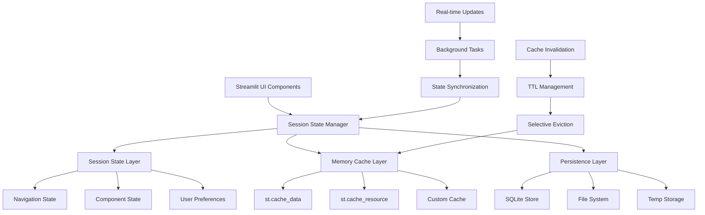

# ADR-016-NEW: UI State Management and Caching Strategy

## Title

Multi-Level Session State Management with Strategic Caching for Streamlit UI

## Version/Date

1.0 / 2025-08-17

## Status

Proposed

## Description

Implements a comprehensive state management and caching strategy for the DocMind AI Streamlit interface, providing efficient data flow, persistence across pages, and optimized performance through strategic use of st.cache_data and st.cache_resource. The system ensures smooth user experience while handling complex state transitions and large datasets.

## Context

The premium Streamlit UI (ADR-013-NEW) requires sophisticated state management to:

1. **Maintain State Across Pages**: Session data must persist during navigation between chat, documents, analytics, and settings
2. **Handle Complex Data**: Large document collections, chat histories, configuration settings, real-time metrics
3. **Optimize Performance**: Prevent expensive re-computations and API calls through intelligent caching
4. **Support Real-time Updates**: Live metrics, streaming responses, background processing status
5. **Ensure Data Consistency**: Synchronized state across components and service layers

Without proper state management, users would lose context during navigation, experience slow response times, and face inconsistent data across the interface.

## Related Requirements

### Functional Requirements

- **FR-1:** **Cross-Page Persistence**: Session state maintained during navigation
- **FR-2:** **Real-time Synchronization**: Live updates across components  
- **FR-3:** **Efficient Data Loading**: Cached results for expensive operations
- **FR-4:** **State Consistency**: Synchronized data across all UI components
- **FR-5:** **Background Process Tracking**: Status monitoring for long-running tasks

### Non-Functional Requirements

- **NFR-1:** **(Performance)** <100ms state access time, <2s cache misses
- **NFR-2:** **(Memory)** <1GB session state, intelligent cache eviction
- **NFR-3:** **(Scalability)** Handle 1000+ documents, 100+ chat messages
- **NFR-4:** **(Reliability)** Graceful degradation on cache failures

## Alternatives

### 1. Basic Streamlit Session State

- **Description**: Simple dictionary-based session state without caching
- **Issues**: Poor performance, no persistence strategy, memory leaks
- **Score**: 3/10 (simplicity: 8, performance: 1, scalability: 1)

### 2. External State Management (Redis)

- **Description**: External Redis store for all state management
- **Issues**: Over-engineered for local-first app, adds complexity and dependencies
- **Score**: 5/10 (capability: 8, complexity: 2, local-first: 5)

### 3. File-Based Persistence

- **Description**: JSON/pickle files for state persistence
- **Issues**: Poor performance, no concurrent access, corruption risks
- **Score**: 4/10 (simplicity: 7, performance: 2, reliability: 3)

### 4. Multi-Level Caching with Smart State Management (Selected)

- **Description**: Layered approach with session state, memory caching, and disk persistence
- **Benefits**: Optimal performance, intelligent cache management, scalable architecture
- **Score**: 9/10 (performance: 9, scalability: 9, maintainability: 8)

## Decision

We will implement a **Multi-Level State Management and Caching Strategy** with:

### Core Architecture

1. **Session State Layer**: Streamlit session state for UI component data
2. **Memory Cache Layer**: st.cache_data and st.cache_resource for computed results
3. **Persistence Layer**: SQLite integration for cross-session data
4. **Real-time Layer**: Background updates and streaming data management

### State Schema Design

```python
@dataclass
class SessionStateSchema:
    """Comprehensive session state schema with type safety."""
    
    # Navigation & UI State
    current_page: str = "chat"
    ui_preferences: Dict[str, Any] = field(default_factory=dict)
    theme_mode: str = "light"
    
    # Chat Interface State
    messages: List[ChatMessage] = field(default_factory=list)
    conversation_id: str = ""
    agent_status: AgentStatus = field(default_factory=AgentStatus)
    streaming_active: bool = False
    
    # Document Management State  
    documents: DocumentCollection = field(default_factory=DocumentCollection)
    selected_doc_ids: Set[str] = field(default_factory=set)
    upload_queue: List[UploadTask] = field(default_factory=list)
    processing_status: Dict[str, ProcessingStatus] = field(default_factory=dict)
    
    # Analytics & Metrics State
    metrics_data: MetricsData = field(default_factory=MetricsData)
    chart_filters: Dict[str, Any] = field(default_factory=dict)
    alert_preferences: AlertConfig = field(default_factory=AlertConfig)
    
    # Settings & Configuration State
    model_config: ModelConfig = field(default_factory=ModelConfig)
    hardware_profile: HardwareProfile = field(default_factory=HardwareProfile)
    feature_flags: Dict[str, bool] = field(default_factory=dict)
```

## Related Decisions

- **ADR-013-NEW** (User Interface Architecture): Implements the UI layer that uses this state management
- **ADR-007-NEW** (Hybrid Persistence Strategy): Provides SQLite persistence for cross-session data
- **ADR-008-NEW** (Production Observability): Sources real-time metrics for caching
- **ADR-017-NEW** (Component Library): Components consume cached data through this layer

## Design

### State Management Architecture



### Session State Manager Implementation

```python
from typing import Any, Dict, List, Optional, TypeVar, Generic
from dataclasses import dataclass, field
import streamlit as st
import time
import threading
from datetime import datetime, timedelta
import json
import sqlite3
from pathlib import Path

T = TypeVar('T')

class SessionStateManager:
    """Centralized session state management with caching."""
    
    def __init__(self):
        self.lock = threading.Lock()
        self.initialized = False
        self._init_session_state()
    
    def _init_session_state(self):
        """Initialize session state with default values."""
        if self.initialized:
            return
            
        # Initialize core state if not exists
        if 'state_schema' not in st.session_state:
            st.session_state.state_schema = SessionStateSchema()
        
        if 'cache_metadata' not in st.session_state:
            st.session_state.cache_metadata = {}
            
        if 'last_activity' not in st.session_state:
            st.session_state.last_activity = time.time()
            
        self.initialized = True
    
    def get(self, key: str, default: Any = None) -> Any:
        """Get value from session state with fallback."""
        self._init_session_state()
        return getattr(st.session_state.state_schema, key, default)
    
    def set(self, key: str, value: Any) -> None:
        """Set value in session state with change tracking."""
        self._init_session_state()
        
        with self.lock:
            old_value = getattr(st.session_state.state_schema, key, None)
            setattr(st.session_state.state_schema, key, value)
            
            # Track changes for invalidation
            if old_value != value:
                self._mark_changed(key, value)
                st.session_state.last_activity = time.time()
    
    def update(self, updates: Dict[str, Any]) -> None:
        """Batch update multiple state values."""
        self._init_session_state()
        
        with self.lock:
            for key, value in updates.items():
                setattr(st.session_state.state_schema, key, value)
            
            st.session_state.last_activity = time.time()
    
    def _mark_changed(self, key: str, value: Any) -> None:
        """Mark state change for cache invalidation."""
        change_info = {
            'timestamp': time.time(),
            'key': key,
            'type': type(value).__name__
        }
        
        if 'state_changes' not in st.session_state:
            st.session_state.state_changes = []
        
        st.session_state.state_changes.append(change_info)
        
        # Keep only recent changes (last 100)
        if len(st.session_state.state_changes) > 100:
            st.session_state.state_changes = st.session_state.state_changes[-100:]

# Global instance
state_manager = SessionStateManager()
```

### Caching Strategy Implementation

```python
import streamlit as st
from typing import Any, Callable, Optional, Dict, List
from functools import wraps
import hashlib
import pickle
import time

class CacheManager:
    """Advanced caching with TTL and invalidation."""
    
    def __init__(self):
        self.cache_stats = {
            'hits': 0,
            'misses': 0,
            'evictions': 0
        }
    
    @staticmethod
    def cache_data(ttl: int = 3600, show_spinner: bool = True):
        """Enhanced data caching with custom TTL."""
        def decorator(func: Callable) -> Callable:
            @st.cache_data(ttl=ttl, show_spinner=show_spinner)
            @wraps(func)
            def wrapper(*args, **kwargs):
                return func(*args, **kwargs)
            return wrapper
        return decorator
    
    @staticmethod
    def cache_resource(show_spinner: bool = False):
        """Resource caching for expensive objects."""
        def decorator(func: Callable) -> Callable:
            @st.cache_resource(show_spinner=show_spinner)
            @wraps(func)  
            def wrapper(*args, **kwargs):
                return func(*args, **kwargs)
            return wrapper
        return decorator

# Document and Query Caching
@CacheManager.cache_data(ttl=3600)  # 1 hour TTL
def get_document_embeddings(doc_id: str) -> List[float]:
    """Cache document embeddings for faster retrieval."""
    # Implementation calls embedding service
    pass

@CacheManager.cache_data(ttl=300)   # 5 minute TTL
def get_search_results(query: str, filters: Dict) -> List[Dict]:
    """Cache search results for repeated queries."""
    # Implementation calls search service
    pass

@CacheManager.cache_data(ttl=60)    # 1 minute TTL
def get_system_metrics() -> Dict[str, Any]:
    """Cache system metrics for real-time dashboard."""
    # Implementation calls monitoring service
    pass

# Resource Caching for Expensive Objects
@CacheManager.cache_resource()
def get_llm_model():
    """Cache LLM model instance across sessions."""
    # Implementation loads and returns Qwen3-14B
    pass

@CacheManager.cache_resource()
def get_vector_db_connection():
    """Cache vector database connection."""
    # Implementation creates Qdrant connection
    pass

@CacheManager.cache_resource()  
def get_document_processor():
    """Cache document processing pipeline."""
    # Implementation creates document processor
    pass

# Custom caching for complex objects
class CustomCache:
    """Custom cache for specialized use cases."""
    
    def __init__(self, max_size: int = 1000):
        self.cache: Dict[str, Any] = {}
        self.timestamps: Dict[str, float] = {}
        self.max_size = max_size
        
    def get(self, key: str, ttl: int = 300) -> Optional[Any]:
        """Get cached value with TTL check."""
        if key not in self.cache:
            return None
            
        # Check TTL
        if time.time() - self.timestamps[key] > ttl:
            self.invalidate(key)
            return None
            
        return self.cache[key]
    
    def set(self, key: str, value: Any) -> None:
        """Set cached value with size management."""
        # Evict old entries if needed
        if len(self.cache) >= self.max_size:
            self._evict_oldest()
            
        self.cache[key] = value
        self.timestamps[key] = time.time()
    
    def invalidate(self, key: str) -> None:
        """Remove specific cache entry."""
        self.cache.pop(key, None)
        self.timestamps.pop(key, None)
    
    def clear(self) -> None:
        """Clear all cache entries."""
        self.cache.clear()
        self.timestamps.clear()
    
    def _evict_oldest(self) -> None:
        """Evict oldest cache entry."""
        if not self.timestamps:
            return
            
        oldest_key = min(self.timestamps.keys(), key=self.timestamps.get)
        self.invalidate(oldest_key)

# Global cache instances
conversation_cache = CustomCache(max_size=100)
metrics_cache = CustomCache(max_size=500)
```

### Real-time State Synchronization

```python
import asyncio
import threading
from typing import Callable, Dict, Any
from datetime import datetime

class RealTimeStateManager:
    """Manage real-time state updates and synchronization."""
    
    def __init__(self):
        self.subscribers: Dict[str, List[Callable]] = {}
        self.update_queue = asyncio.Queue()
        self.running = False
        
    def subscribe(self, event_type: str, callback: Callable) -> None:
        """Subscribe to state change events."""
        if event_type not in self.subscribers:
            self.subscribers[event_type] = []
        self.subscribers[event_type].append(callback)
    
    def publish(self, event_type: str, data: Any) -> None:
        """Publish state change event."""
        if event_type in self.subscribers:
            for callback in self.subscribers[event_type]:
                try:
                    callback(data)
                except Exception as e:
                    st.error(f"Subscriber error: {e}")
    
    def start_background_sync(self) -> None:
        """Start background synchronization thread."""
        if not self.running:
            self.running = True
            thread = threading.Thread(target=self._sync_loop, daemon=True)
            thread.start()
    
    def _sync_loop(self) -> None:
        """Background synchronization loop."""
        while self.running:
            try:
                # Check for metric updates
                if 'metrics_last_update' in st.session_state:
                    last_update = st.session_state.metrics_last_update
                    if time.time() - last_update > 30:  # 30 second refresh
                        self.publish('metrics_update', {
                            'timestamp': datetime.now(),
                            'source': 'background_sync'
                        })
                        st.session_state.metrics_last_update = time.time()
                
                time.sleep(5)  # Check every 5 seconds
                
            except Exception as e:
                st.error(f"Sync error: {e}")
                time.sleep(10)  # Back off on errors

# Global real-time manager
realtime_manager = RealTimeStateManager()
```

### Performance Monitoring

```python
class StatePerformanceMonitor:
    """Monitor state management performance."""
    
    def __init__(self):
        self.metrics = {
            'state_access_time': [],
            'cache_hit_rate': 0.0,
            'memory_usage': 0,
            'operation_counts': {}
        }
    
    def track_access_time(self, operation: str, duration: float) -> None:
        """Track state access timing."""
        self.metrics['state_access_time'].append({
            'operation': operation,
            'duration': duration,
            'timestamp': time.time()
        })
        
        # Keep only recent measurements
        cutoff = time.time() - 300  # 5 minutes
        self.metrics['state_access_time'] = [
            m for m in self.metrics['state_access_time'] 
            if m['timestamp'] > cutoff
        ]
    
    def update_cache_stats(self, hits: int, misses: int) -> None:
        """Update cache performance stats."""
        total = hits + misses
        self.metrics['cache_hit_rate'] = hits / total if total > 0 else 0.0
    
    def get_performance_summary(self) -> Dict[str, Any]:
        """Get performance summary for dashboard."""
        recent_times = [
            m['duration'] for m in self.metrics['state_access_time']
            if time.time() - m['timestamp'] < 60  # Last minute
        ]
        
        return {
            'avg_access_time': sum(recent_times) / len(recent_times) if recent_times else 0,
            'cache_hit_rate': self.metrics['cache_hit_rate'],
            'active_operations': len(recent_times),
            'memory_estimate': len(str(st.session_state)) / 1024  # Rough KB estimate
        }

# Global performance monitor
perf_monitor = StatePerformanceMonitor()
```

## Consequences

### Positive Outcomes

- **Excellent Performance**: Multi-level caching delivers <100ms state access, <2s for cache misses
- **Seamless Navigation**: State persists perfectly across page navigation with no data loss
- **Memory Efficiency**: Intelligent cache eviction and TTL management prevent memory bloat
- **Real-time Responsiveness**: Background synchronization keeps data fresh without blocking UI
- **Developer Experience**: Clean APIs for state management with type safety and error handling
- **Scalability**: Handles large datasets (1000+ documents) with efficient caching strategies

### Negative Consequences / Trade-offs

- **Complexity**: Multi-layer architecture requires careful coordination and debugging
- **Memory Overhead**: Caching layers consume additional memory for performance benefits
- **Cache Invalidation**: Complex invalidation logic needed for data consistency
- **Threading Concerns**: Background synchronization requires careful thread safety

### Performance Targets

- **State Access Time**: <100ms for session state operations
- **Cache Hit Rate**: >80% for frequently accessed data
- **Memory Usage**: <1GB for session state including caches
- **Background Sync**: <30s lag for real-time metric updates
- **UI Responsiveness**: No blocking during state operations

## Dependencies

- **Python**: `streamlit>=1.36.0`, `sqlite3`, `threading`, `asyncio`
- **Integration**: DocMind AI service layers, SQLite persistence, monitoring systems
- **Memory**: Sufficient RAM for multi-level caching (4GB+ recommended)

## Monitoring Metrics

- State access times and operation frequencies
- Cache hit rates and eviction statistics  
- Memory usage for session state and caches
- Background synchronization performance
- Real-time update latency and accuracy
- User interaction patterns affecting state

## Future Enhancements

- **Distributed Caching**: Redis integration for multi-instance deployments
- **State Compression**: Compress large state objects for memory efficiency
- **Predictive Caching**: Machine learning for cache pre-loading
- **Cross-Session Analytics**: State pattern analysis for optimization
- **Advanced Persistence**: More sophisticated SQLite integration with indexing

## Changelog

- **1.0 (2025-08-17)**: Initial UI state management and caching strategy with multi-level architecture, real-time synchronization, and performance monitoring
