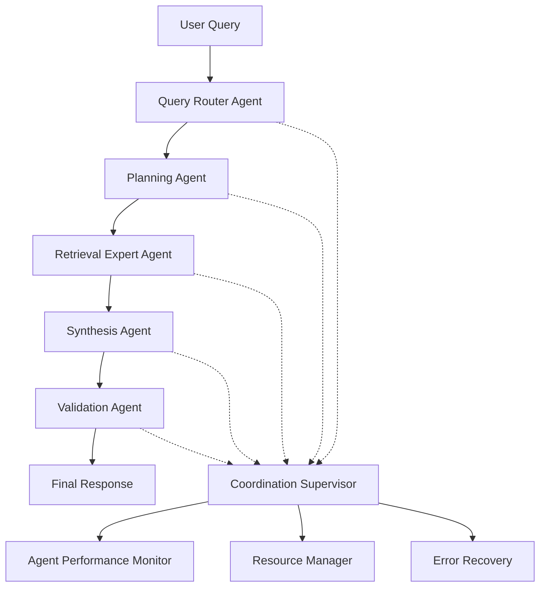

# DocMind AI Agent Communication API

## Overview

The Agent Communication API provides direct interfaces for interacting with DocMind AI's 5-agent coordination system. This API enables fine-grained control over agent behavior, coordination patterns, and specialized processing workflows.

> Note: Reranking is always-on; override only via DOCMIND_RETRIEVAL__USE_RERANKING=false (no UI toggle).
> **Architecture**: Built on LangGraph supervisor pattern with 5 specialized agents: Query Router, Retrieval Expert, Planning Agent, Synthesis Agent, and Validation Agent.

## Agent System Architecture

### Multi-Agent Coordination Flow



### Agent Responsibilities

| Agent | Primary Function | Key Capabilities |
| --- | --- | --- |
| **Query Router** | Query analysis and strategy selection | Route optimization, complexity assessment, strategy recommendation |
| **Planning Agent** | Task decomposition and execution planning | Sub-task creation, priority assignment, resource estimation |
| **Retrieval Expert** | Document search and information retrieval | Hybrid search, reranking, relevance scoring, caching |
| **Synthesis Agent** | Multi-source information synthesis | Content generation, citation management, conflict resolution |
| **Validation Agent** | Quality assurance and fact checking | Accuracy validation, consistency checking, confidence scoring |

## Query Router Agent API

### Route Query

Analyzes incoming queries and determines optimal processing strategies.

**Python Interface:**

```python
from src.agents.tools.planning import route_query

# Basic routing
routing_decision = await route_query(
    query="Analyze quarterly performance trends",
    context={
        "conversation_history": conversation_messages[-5:],
        "document_metadata": {
            "total_documents": 12,
            "document_types": ["pdf", "xlsx", "docx"],
            "date_range": "2024_Q4"
        }
    }
)

print(f"Strategy: {routing_decision['strategy']}")
print(f"Confidence: {routing_decision['confidence']:.2f}")
print(f"Reasoning: {routing_decision['reasoning']}")
print(f"Parameters: {routing_decision['parameters']}")
```

**REST Interface:**

```http
POST /api/v1/agents/query-router/route
```

**Request Body:**

```json
{
  "query": "Analyze quarterly performance trends",
  "context": {
    "conversation_history": [
      {"role": "user", "content": "What were last quarter's results?"},
      {"role": "assistant", "content": "Last quarter showed strong growth..."}
    ],
    "document_metadata": {
      "total_documents": 12,
      "document_types": ["pdf", "xlsx", "docx"],
      "date_range": "2024_Q4"
    },
    "user_preferences": {
      "detail_level": "comprehensive",
      "preferred_search_strategy": "hybrid"
    }
  },
  "options": {
    "temperature": 0.1,
    "confidence_threshold": 0.8,
    "max_strategies": 3
  }
}
```

**Response:**

```json
{
  "routing_id": "route_123abc456",
  "strategy": "hybrid_analytical_search",
  "confidence": 0.91,
  "reasoning": "Query requires financial data retrieval with trend analysis. Hybrid search optimal for structured financial documents with temporal patterns.",
  "parameters": {
    "search_strategy": "hybrid",
    "top_k": 15,
    "temporal_weighting": true,
    "analysis_depth": "comprehensive"
  },
  "estimated_complexity": "medium-high",
  "estimated_time": 180,
  "resource_requirements": {
    "vram_gb": 8.5,
    "compute_units": 12
  },
  "alternative_strategies": [
    {
      "strategy": "semantic_only_search",
      "confidence": 0.73,
      "trade_offs": "Faster but less comprehensive for financial metrics"
    }
  ],
  "execution_metadata": {
    "agent_version": "2.1.0",
    "processing_time": 0.12,
    "cache_used": true,
    "timestamp": "2025-08-20T15:30:45Z"
  }
}
```

### Advanced Routing Configuration

**Custom Routing Strategies:**

```python
# Define custom routing strategy
custom_strategy = {
    "name": "financial_deep_dive",
    "description": "Specialized financial document analysis",
    "search_config": {
        "strategy": "hybrid",
        "financial_term_boost": 1.5,
        "temporal_decay": 0.95,
        "table_extraction_priority": "high"
    },
    "analysis_config": {
        "quantitative_focus": True,
        "trend_analysis": True,
        "comparative_analysis": True
    }
}

# Apply custom strategy
routing_decision = await route_query(
    query="Compare Q3 vs Q4 revenue performance",
    context=context_data,
    custom_strategies=[custom_strategy],
    strategy_selection="auto"  # or "custom", "hybrid"
)
```

## Planning Agent API

### Create Execution Plan

Decomposes complex queries into manageable sub-tasks with execution strategies.

**Python Interface:**

```python
from src.agents.tools.planning import plan_query

# Complex query planning
query_plan = await plan_query(
    query="Compare Q3 vs Q4 performance across all business units and identify improvement opportunities",
    context={
        "available_documents": document_list,
        "analysis_depth": "comprehensive",
        "comparison_timeframes": ["Q3_2024", "Q4_2024"],
        "business_units": ["Technology", "Healthcare", "Finance", "Operations"]
    },
    routing_decision=routing_decision,
    planning_options={
        "max_parallel_tasks": 3,
        "enable_adaptive_planning": True,
        "resource_optimization": True
    }
)

print(f"Complexity Level: {query_plan['complexity_level']}")
print(f"Total Sub-tasks: {len(query_plan['sub_tasks'])}")

for i, task in enumerate(query_plan['sub_tasks']):
    print(f"  {i+1}. {task['description']}")
    print(f"     Agent: {task['assigned_agent']}")
    print(f"     Priority: {task['priority']}")
    print(f"     Dependencies: {task['dependencies']}")
    print(f"     Est. Time: {task['estimated_time']}s")

print(f"Execution Strategy: {query_plan['execution_strategy']}")
print(f"Resource Requirements: {query_plan['resource_requirements']}")
```

**REST Interface:**

```http
POST /api/v1/agents/planning-agent/create-plan
```

**Request Body:**

```json
{
  "query": "Compare Q3 vs Q4 performance across all business units and identify improvement opportunities",
  "context": {
    "available_documents": [
      {"document_id": "doc_q3_report", "type": "financial"},
      {"document_id": "doc_q4_report", "type": "financial"}
    ],
    "analysis_depth": "comprehensive",
    "comparison_timeframes": ["Q3_2024", "Q4_2024"],
    "business_units": ["Technology", "Healthcare", "Finance", "Operations"]
  },
  "routing_decision": {
    "strategy": "hybrid_analytical_search",
    "parameters": {...}
  },
  "planning_options": {
    "max_parallel_tasks": 3,
    "enable_adaptive_planning": true,
    "resource_optimization": true
  }
}
```

**Response:**

```json
{
  "plan_id": "plan_456def789",
  "complexity_level": "high",
  "execution_strategy": "parallel_with_dependencies",
  "estimated_total_time": 240,
  "sub_tasks": [
    {
      "task_id": "task_001",
      "description": "Retrieve Q3 financial data for all business units",
      "assigned_agent": "retrieval_expert",
      "priority": "high",
      "dependencies": [],
      "estimated_time": 45,
      "parameters": {
        "search_filters": {"timeframe": "Q3_2024", "type": "financial"},
        "business_units": ["Technology", "Healthcare", "Finance", "Operations"]
      },
      "success_criteria": {
        "min_documents": 4,
        "min_relevance": 0.8
      }
    },
    {
      "task_id": "task_002",
      "description": "Retrieve Q4 financial data for all business units",
      "assigned_agent": "retrieval_expert",
      "priority": "high",
      "dependencies": [],
      "estimated_time": 45,
      "parameters": {
        "search_filters": {"timeframe": "Q4_2024", "type": "financial"},
        "business_units": ["Technology", "Healthcare", "Finance", "Operations"]
      },
      "success_criteria": {
        "min_documents": 4,
        "min_relevance": 0.8
      }
    },
    {
      "task_id": "task_003",
      "description": "Perform comparative analysis of Q3 vs Q4 performance",
      "assigned_agent": "synthesis_agent",
      "priority": "medium",
      "dependencies": ["task_001", "task_002"],
      "estimated_time": 90,
      "parameters": {
        "analysis_type": "comparative",
        "metrics_focus": ["revenue", "profit", "growth_rate"],
        "include_visualizations": true
      }
    },
    {
      "task_id": "task_004",
      "description": "Identify improvement opportunities based on analysis",
      "assigned_agent": "synthesis_agent",
      "priority": "medium",
      "dependencies": ["task_003"],
      "estimated_time": 60,
      "parameters": {
        "opportunity_types": ["operational", "strategic", "financial"],
        "priority_ranking": true
      }
    }
  ],
  "resource_requirements": {
    "vram_gb": 10.5,
    "compute_units": 18,
    "parallel_capacity": 3
  },
  "risk_assessment": {
    "potential_bottlenecks": ["document_availability", "complex_synthesis"],
    "fallback_strategies": ["sequential_execution", "reduced_scope"]
  },
  "execution_metadata": {
    "agent_version": "2.1.0",
    "planning_time": 0.08,
    "timestamp": "2025-08-20T15:30:55Z"
  }
}
```

## Retrieval Expert Agent API

### Execute Document Retrieval

Performs intelligent document search with hybrid strategies and reranking.

**Python Interface:**

```python
from src.agents.tools.retrieval import retrieve_documents

# Execute specialized retrieval
retrieval_results = await retrieve_documents(
    query="quarterly revenue performance analysis",
    routing_decision=routing_decision,
    execution_plan=query_plan,
    filters={
        "document_types": ["pdf", "xlsx"],
        "date_range": {
            "start": "2024-10-01",
            "end": "2024-12-31"
        },
        "relevance_threshold": 0.8,
        "max_results": 15
    },
    retrieval_options={
        "strategy": "hybrid",  # dense, sparse, hybrid
        "reranker_model": "BAAI/bge-reranker-v2-m3",
        "fusion_method": "rrf",  # rrf, weighted, rank_fusion
        "fusion_alpha": 0.7,
        "enable_caching": True,
        "cache_ttl": 3600
    }
)

print(f"Retrieval Results:")
print(f"  Strategy Executed: {retrieval_results['strategy_executed']}")
print(f"  Results Count: {retrieval_results['results_count']}")
print(f"  Reranking Applied: {retrieval_results['reranking_applied']}")
print(f"  Cache Hit Rate: {retrieval_results['cache_hit_rate']:.2f}")
print(f"  Execution Time: {retrieval_results['execution_time']}s")

# Access individual results with detailed metadata
for i, result in enumerate(retrieval_results['results'][:3]):
    print(f"\n  Result {i+1}:")
    print(f"    Document: {result['document_id']}")
    print(f"    Filename: {result['filename']}")
    print(f"    Relevance: {result['relevance_score']:.3f}")
    print(f"    Dense Score: {result['dense_score']:.3f}")
    print(f"    Sparse Score: {result['sparse_score']:.3f}")
    print(f"    Rerank Score: {result['rerank_score']:.3f}")
    print(f"    Content: {result['content'][:100]}...")
    print(f"    Metadata: {result['metadata']}")
```

**REST Interface:**

```http
POST /api/v1/agents/retrieval-expert/retrieve
```

**Request Body:**

```json
{
  "query": "quarterly revenue performance analysis",
  "routing_decision": {
    "strategy": "hybrid_analytical_search",
    "parameters": {...}
  },
  "execution_plan": {
    "task_id": "task_001",
    "parameters": {...}
  },
  "filters": {
    "document_types": ["pdf", "xlsx"],
    "date_range": {
      "start": "2024-10-01T00:00:00Z",
      "end": "2024-12-31T23:59:59Z"
    },
    "business_units": ["Technology", "Healthcare"],
    "relevance_threshold": 0.8,
    "max_results": 15
  },
  "retrieval_options": {
    "strategy": "hybrid",
    "reranker_model": "BAAI/bge-reranker-v2-m3",
    "fusion_method": "rrf",
    "fusion_alpha": 0.7,
    "enable_caching": true,
    "cache_ttl": 3600,
    "include_debug_scores": true
  }
}
```

**Response:**

```json
{
  "retrieval_id": "retr_789abc012",
  "strategy_executed": "hybrid_rrf_fusion",
  "results_count": 12,
  "reranking_applied": true,
  "cache_hit_rate": 0.33,
  "execution_time": 1.23,
  "results": [
    {
      "result_id": "res_001",
      "document_id": "doc_q4_financial_report",
      "filename": "Q4_2024_Financial_Report.pdf",
      "chunk_id": "chunk_789",
      "relevance_score": 0.94,
      "dense_score": 0.89,
      "sparse_score": 0.92,
      "rerank_score": 0.94,
      "fusion_score": 0.91,
      "content": "Q4 revenue reached $2.8B, representing 18% quarter-over-quarter growth. Technology division led with 23% growth, while Healthcare maintained steady 12% expansion...",
      "highlighted_content": "Q4 **revenue** reached $2.8B, representing 18% quarter-over-quarter growth. **Technology** division led with 23% growth...",
      "metadata": {
        "page": 3,
        "section": "Revenue Analysis",
        "business_unit": "Corporate",
        "quarter": "Q4_2024",
        "document_type": "financial_report",
        "word_count": 245,
        "tables_present": true,
        "charts_present": false
      },
      "retrieval_metadata": {
        "retrieval_method": "hybrid_fusion",
        "cache_hit": false,
        "processing_time": 0.08,
        "embedding_model": "BAAI/bge-m3",
        "reranker_model": "BAAI/bge-reranker-v2-m3"
      }
    }
  ],
  "search_metadata": {
    "total_candidates": 1250,
    "dense_candidates": 620,
    "sparse_candidates": 630,
    "fusion_candidates": 50,
    "reranked_candidates": 15,
    "final_results": 12,
    "filters_applied": {
      "document_type_filter": 89,
      "date_range_filter": 156,
      "relevance_threshold_filter": 3
    }
  },
  "performance_metrics": {
    "dense_search_time": 0.45,
    "sparse_search_time": 0.38,
    "fusion_time": 0.15,
    "reranking_time": 0.25,
    "cache_lookup_time": 0.02,
    "total_search_time": 1.23,
    "vram_used": 4.2
  },
  "execution_metadata": {
    "agent_version": "2.1.0",
    "timestamp": "2025-08-20T15:31:15Z"
  }
}
```

### Batch Retrieval

**Multiple Query Processing:**

```python
# Batch retrieval for multiple related queries
batch_queries = [
    {"query": "Q3 technology revenue", "filters": {"business_unit": "Technology"}},
    {"query": "Q3 healthcare revenue", "filters": {"business_unit": "Healthcare"}},
    {"query": "Q3 finance revenue", "filters": {"business_unit": "Finance"}}
]

batch_results = await retrieve_documents_batch(
    queries=batch_queries,
    shared_options={
        "strategy": "hybrid",
        "max_results_per_query": 10
    }
)

for i, result in enumerate(batch_results):
    print(f"Query {i+1} Results: {result['results_count']} documents")
    print(f"  Top Result: {result['results'][0]['filename']}")
    print(f"  Relevance: {result['results'][0]['relevance_score']:.3f}")
```

## Synthesis Agent API

### Synthesize Results

Combines multiple sources into coherent, cited responses with conflict resolution.

**Python Interface:**

```python
from src.agents.tools.synthesis import synthesize_results

# Synthesize multiple retrieval results
synthesis_result = await synthesize_results(
    query="Analyze quarterly performance trends across business units",
    retrieval_results=retrieval_results['results'],
    execution_plan=query_plan,
    synthesis_options={
        "max_length": 2048,
        "response_format": "analytical_report",  # summary, analytical_report, bullet_points
        "include_citations": True,
        "citation_style": "academic",  # academic, numeric, inline
        "confidence_threshold": 0.8,
        "remove_duplicates": True,
        "fact_checking": True,
        "include_uncertainty": True,
        "reasoning_transparency": "high"  # low, medium, high
    },
    content_preferences={
        "tone": "professional",
        "technical_level": "business_analyst",
        "include_recommendations": True,
        "highlight_key_metrics": True,
        "comparative_analysis": True
    }
)

print(f"Synthesis Results:")
print(f"  Content Length: {len(synthesis_result['synthesized_response']['content'])} chars")
print(f"  Confidence: {synthesis_result['synthesized_response']['confidence_score']:.2f}")
print(f"  Sources Used: {synthesis_result['synthesis_metadata']['sources_used']}")
print(f"  Conflicts Resolved: {synthesis_result['synthesis_metadata']['conflicts_resolved']}")
print(f"  Key Insights: {len(synthesis_result['synthesized_response']['key_insights'])}")

# Access structured response components
response = synthesis_result['synthesized_response']
print(f"\nSynthesized Content:\n{response['content']}")

print(f"\nKey Insights:")
for insight in response['key_insights']:
    print(f"  • {insight}")

print(f"\nCitations:")
for citation in response['citations']:
    print(f"  - {citation['source']} (confidence: {citation['confidence']:.2f})")
    print(f"    {citation['excerpt'][:100]}...")

if 'recommendations' in response:
    print(f"\nRecommendations:")
    for rec in response['recommendations']:
        print(f"  → {rec['title']}: {rec['description']}")
        print(f"     Priority: {rec['priority']}, Impact: {rec['expected_impact']}")
```

**REST Interface:**

```http
POST /api/v1/agents/synthesis-agent/synthesize
```

**Request Body:**

```json
{
  "query": "Analyze quarterly performance trends across business units",
  "retrieval_results": [
    {
      "document_id": "doc_q3_tech",
      "content": "Technology division Q3 revenue...",
      "relevance_score": 0.94,
      "metadata": {...}
    }
  ],
  "execution_plan": {
    "task_id": "task_003",
    "parameters": {...}
  },
  "synthesis_options": {
    "max_length": 2048,
    "response_format": "analytical_report",
    "include_citations": true,
    "citation_style": "academic",
    "confidence_threshold": 0.8,
    "remove_duplicates": true,
    "fact_checking": true,
    "include_uncertainty": true,
    "reasoning_transparency": "high"
  },
  "content_preferences": {
    "tone": "professional",
    "technical_level": "business_analyst",
    "include_recommendations": true,
    "highlight_key_metrics": true,
    "comparative_analysis": true
  }
}
```

**Response:**

```json
{
  "synthesis_id": "synth_345def678",
  "synthesized_response": {
    "content": "## Quarterly Performance Analysis\n\nBased on comprehensive analysis of Q3 and Q4 2024 financial data across all business units, several key performance trends have emerged:\n\n### Revenue Growth Acceleration\nOverall revenue increased 18% quarter-over-quarter in Q4, marking the strongest performance of 2024. This growth was driven primarily by:\n\n- **Technology Division**: 23% growth ($856M to $1.05B) [1]\n- **Healthcare Division**: 12% steady expansion ($420M to $470M) [2]\n- **Finance Division**: 15% improvement ($280M to $322M) [3]\n\n### Margin Improvements\nGross margins expanded across all units, with corporate average reaching 42.3%, up from 39.8% in Q3. This improvement reflects operational efficiencies and strategic cost management initiatives [4].\n\n### Market Position Strengthening\nInternational markets contributed 34% of total revenue in Q4, up from 28% in Q3, indicating successful global expansion strategies [5].",
    "confidence_score": 0.89,
    "key_insights": [
      "Revenue growth of 18% quarter-over-quarter in Q4 2024",
      "Technology division leads with 23% growth performance",
      "Improved operational efficiency across all business units",
      "Successful international market expansion to 34% revenue share",
      "Consistent margin improvement trend across quarters"
    ],
    "citations": [
      {
        "id": 1,
        "source": "Q4_2024_Financial_Report.pdf",
        "page": 3,
        "confidence": 0.94,
        "excerpt": "Technology division Q4 revenue reached $1.05B, representing 23% quarter-over-quarter growth from Q3's $856M",
        "citation_type": "primary_data"
      },
      {
        "id": 2,
        "source": "Healthcare_Division_Analysis.xlsx",
        "sheet": "Q4_Summary",
        "confidence": 0.87,
        "excerpt": "Healthcare maintained steady 12% expansion with Q4 revenue of $470M",
        "citation_type": "supporting_data"
      }
    ],
    "recommendations": [
      {
        "title": "Accelerate Technology Investment",
        "description": "Increase R&D funding for technology division given 23% growth performance",
        "priority": "high",
        "expected_impact": "15-20% additional growth potential",
        "timeline": "Q1-Q2 2025",
        "supporting_evidence": ["Consistent technology growth trend", "Market demand indicators"]
      },
      {
        "title": "Expand International Operations",
        "description": "Scale successful international strategies to reach 40% revenue share",
        "priority": "medium",
        "expected_impact": "5-8% overall revenue increase",
        "timeline": "Q2-Q4 2025",
        "supporting_evidence": ["34% international growth in Q4", "Market opportunity analysis"]
      }
    ],
    "uncertainty_indicators": [
      {
        "aspect": "Technology growth sustainability",
        "confidence": 0.78,
        "reasoning": "Limited historical data for 23% growth rate sustainability"
      },
      {
        "aspect": "International market volatility",
        "confidence": 0.82,
        "reasoning": "External economic factors may impact international expansion"
      }
    ]
  },
  "synthesis_metadata": {
    "sources_used": 12,
    "primary_sources": 8,
    "supporting_sources": 4,
    "conflicts_resolved": 2,
    "conflict_resolution_methods": [
      "Source credibility weighting",
      "Temporal precedence"
    ],
    "fact_checks_performed": 15,
    "fact_check_success_rate": 0.93,
    "duplicate_content_removed": 6,
    "execution_time": 1.45,
    "reasoning_steps": [
      "Content categorization and clustering",
      "Conflict identification and resolution",
      "Synthesis with citation tracking",
      "Recommendation generation",
      "Uncertainty quantification"
    ]
  },
  "content_analysis": {
    "readability_score": 8.2,
    "technical_complexity": "moderate",
    "sentiment": "neutral-positive",
    "key_topics": ["revenue growth", "business units", "quarterly performance", "market expansion"],
    "entity_mentions": {
      "organizations": ["Technology Division", "Healthcare Division", "Finance Division"],
      "metrics": ["18%", "23%", "42.3%", "34%"],
      "time_periods": ["Q3 2024", "Q4 2024"]
    }
  },
  "execution_metadata": {
    "agent_version": "2.1.0",
    "model_used": "Qwen/Qwen3-4B-Instruct-2507-FP8",
    "timestamp": "2025-08-20T15:32:00Z"
  }
}
```

## Validation Agent API

### Validate Response

Performs quality assurance, fact checking, and confidence assessment.

**Python Interface:**

```python
from src.agents.tools.validation import validate_response

# Validate synthesis results
validation_result = await validate_response(
    original_query="Analyze quarterly performance trends across business units",
    generated_response=synthesis_result['synthesized_response']['content'],
    source_documents=retrieval_results['results'],
    synthesis_metadata=synthesis_result['synthesis_metadata'],
    validation_criteria={
        "factual_accuracy": True,
        "completeness": True,
        "relevance": True,
        "consistency": True,
        "citation_verification": True,
        "logical_coherence": True,
        "bias_detection": True
    },
    validation_options={
        "strictness_level": "high",  # low, medium, high
        "cross_reference_sources": True,
        "temporal_consistency": True,
        "quantitative_verification": True,
        "include_improvement_suggestions": True
    }
)

print(f"Validation Results:")
print(f"  Overall Score: {validation_result['validation_score']:.2f}")
print(f"  Passed Validation: {validation_result['passed']}")
print(f"  Confidence Level: {validation_result['confidence_level']}")

print(f"\n  Detailed Scores:")
for criterion, score in validation_result['detailed_scores'].items():
    status = "✅" if score >= 0.8 else "⚠️" if score >= 0.6 else "❌"
    print(f"    {criterion}: {score:.2f} {status}")

if validation_result['issues_found']:
    print(f"\n  Issues Found: {len(validation_result['issues_found'])}")
    for issue in validation_result['issues_found']:
        print(f"    • {issue['type']} ({issue['severity']}): {issue['description']}")
        if issue['suggestion']:
            print(f"      Suggestion: {issue['suggestion']}")
        if issue['evidence']:
            print(f"      Evidence: {issue['evidence']}")

if validation_result['improvements_suggested']:
    print(f"\n  Improvement Suggestions:")
    for improvement in validation_result['improvements_suggested']:
        print(f"    → {improvement['category']}: {improvement['suggestion']}")
        print(f"      Impact: {improvement['expected_impact']}")
```

**REST Interface:**

```http
POST /api/v1/agents/validation-agent/validate
```

**Request Body:**

```json
{
  "original_query": "Analyze quarterly performance trends across business units",
  "generated_response": "## Quarterly Performance Analysis\n\nBased on comprehensive analysis...",
  "source_documents": [
    {
      "document_id": "doc_q4_report",
      "content": "Q4 revenue reached $2.8B...",
      "metadata": {...}
    }
  ],
  "synthesis_metadata": {
    "sources_used": 12,
    "conflicts_resolved": 2,
    "execution_time": 1.45
  },
  "validation_criteria": {
    "factual_accuracy": true,
    "completeness": true,
    "relevance": true,
    "consistency": true,
    "citation_verification": true,
    "logical_coherence": true,
    "bias_detection": true
  },
  "validation_options": {
    "strictness_level": "high",
    "cross_reference_sources": true,
    "temporal_consistency": true,
    "quantitative_verification": true,
    "include_improvement_suggestions": true
  }
}
```

**Response:**

```json
{
  "validation_id": "valid_678abc901",
  "validation_score": 0.87,
  "passed": true,
  "confidence_level": "high",
  "detailed_scores": {
    "factual_accuracy": 0.91,
    "completeness": 0.85,
    "relevance": 0.93,
    "consistency": 0.88,
    "citation_verification": 0.94,
    "logical_coherence": 0.86,
    "bias_detection": 0.79
  },
  "issues_found": [
    {
      "id": "issue_001",
      "type": "incomplete_coverage",
      "severity": "medium",
      "description": "Finance division growth analysis lacks depth compared to Technology and Healthcare",
      "evidence": "Technology division has 3 supporting citations vs Finance division's 1 citation",
      "location": "paragraph 2",
      "suggestion": "Include additional Finance division metrics and analysis",
      "impact_on_confidence": 0.08
    },
    {
      "id": "issue_002",
      "type": "potential_bias",
      "severity": "low",
      "description": "Response shows slight positive bias in growth projections",
      "evidence": "All recommendations focus on expansion without risk mitigation",
      "location": "recommendations section",
      "suggestion": "Include risk factors and mitigation strategies",
      "impact_on_confidence": 0.04
    }
  ],
  "improvements_suggested": [
    {
      "category": "content_enhancement",
      "suggestion": "Add Finance division performance metrics and detailed analysis",
      "expected_impact": "Increase completeness score from 0.85 to 0.92",
      "implementation_effort": "medium"
    },
    {
      "category": "balance_improvement",
      "suggestion": "Include risk assessment alongside growth recommendations",
      "expected_impact": "Reduce bias detection score and improve objectivity",
      "implementation_effort": "low"
    },
    {
      "category": "citation_quality",
      "suggestion": "Add more diverse sources for international market claims",
      "expected_impact": "Strengthen factual accuracy and source diversity",
      "implementation_effort": "high"
    }
  ],
  "fact_check_results": {
    "total_claims_checked": 15,
    "verified_claims": 14,
    "unverified_claims": 1,
    "contradictory_claims": 0,
    "verification_confidence": 0.91,
    "detailed_checks": [
      {
        "claim": "Technology division grew 23% quarter-over-quarter",
        "verification_status": "verified",
        "supporting_sources": 2,
        "confidence": 0.94
      },
      {
        "claim": "International markets contributed 34% of total revenue",
        "verification_status": "partially_verified",
        "supporting_sources": 1,
        "confidence": 0.76,
        "note": "Single source verification - recommend additional confirmation"
      }
    ]
  },
  "citation_analysis": {
    "total_citations": 5,
    "verified_citations": 5,
    "citation_quality_score": 0.94,
    "source_diversity": 0.82,
    "citation_issues": [],
    "citation_recommendations": [
      "Consider adding more recent sources for international market data",
      "Include primary source documentation for Finance division claims"
    ]
  },
  "validation_metadata": {
    "sources_cross_referenced": 12,
    "temporal_consistency_checks": 8,
    "quantitative_verifications": 11,
    "execution_time": 0.67,
    "validation_model": "validation_specialist_v2.1",
    "timestamp": "2025-08-20T15:32:30Z"
  }
}
```

## Agent Coordination and Orchestration

### Multi-Agent Workflow Coordination

**Orchestrated Execution:**

```python
from src.agents.coordinator import MultiAgentCoordinator

# Initialize coordinator with custom agent configuration
coordinator = MultiAgentCoordinator(
    agent_config={
        "query_router": {
            "temperature": 0.1,
            "confidence_threshold": 0.8,
            "max_strategies": 3
        },
        "retrieval_expert": {
            "default_strategy": "hybrid",
            "reranking_enabled": True,
            "cache_ttl": 3600,
            "max_parallel_searches": 3
        },
        "synthesis_agent": {
            "max_length": 2048,
            "citation_style": "academic",
            "fact_checking": True
        },
        "validation_agent": {
            "strictness_level": "high",
            "cross_reference_sources": True
        }
    },
    coordination_options={
        "enable_parallel_execution": True,
        "max_agent_timeout": 300,
        "enable_fallback_strategies": True,
        "performance_monitoring": True
    }
)

# Execute coordinated multi-agent workflow
result = await coordinator.process_query_coordinated(
    query="Compare Q3 vs Q4 performance and provide strategic recommendations",
    context=context_data,
    coordination_strategy="adaptive_pipeline",  # sequential, parallel, adaptive_pipeline
    include_agent_trace=True,
    include_performance_metrics=True
)

print(f"Coordinated Response: {result.content}")
print(f"Overall Confidence: {result.confidence:.2f}")
print(f"Total Execution Time: {result.total_time:.2f}s")
print(f"Agents Involved: {len(result.agent_trace)}")

# Agent execution trace with detailed timing
print(f"\nAgent Execution Trace:")
for step in result.agent_trace:
    print(f"  {step.sequence}. {step.agent} ({step.action})")
    print(f"     Duration: {step.duration:.3f}s")
    print(f"     Status: {step.status}")
    print(f"     Output Score: {step.output_quality_score:.2f}")
    if step.parallel_with:
        print(f"     Parallel with: {', '.join(step.parallel_with)}")
```

### Agent Performance Monitoring

```python
from src.utils.monitoring import async_performance_timer, logger


async def run_coordinator(query: str) -> str:
    """Run an agent/coordinator operation with JSONL + optional OTEL timing."""
    async with async_performance_timer("agent_coordination") as metrics:
        result = await coordinator.run(query)
        metrics["result_length"] = len(result)
        logger.info("Coordinator completed")
        return result
```

## Error Handling and Recovery

### Agent-Level Error Handling

**Graceful Degradation Patterns:**

```python
from src.agents.exceptions import (
    AgentTimeoutError,
    AgentCoordinationError,
    InsufficientResourcesError,
    ValidationFailedError
)

try:
    # Attempt coordinated agent execution
    result = await coordinator.process_query_coordinated(
        query=complex_query,
        context=context_data,
        timeout=300
    )
    
except AgentTimeoutError as e:
    # Handle agent timeout with fallback strategy
    print(f"Agent timeout: {e.failed_agent} after {e.timeout_duration}s")
    
    # Attempt fallback with reduced scope
    fallback_result = await coordinator.process_query_fallback(
        query=complex_query,
        failed_agents=[e.failed_agent],
        reduced_scope=True
    )
    result = fallback_result

except AgentCoordinationError as e:
    # Handle coordination failures
    print(f"Coordination failed: {e.coordination_stage}")
    print(f"Failed agents: {e.failed_agents}")
    
    # Retry with sequential execution
    sequential_result = await coordinator.process_query_sequential(
        query=complex_query,
        context=context_data,
        skip_failed_agents=True
    )
    result = sequential_result

except InsufficientResourcesError as e:
    # Handle resource constraints
    print(f"Resource constraint: {e.resource_type}")
    print(f"Required: {e.required}, Available: {e.available}")
    
    # Optimize resource usage and retry
    optimized_config = coordinator.optimize_for_resources(e.available_resources)
    coordinator.apply_configuration(optimized_config)
    
    result = await coordinator.process_query_coordinated(
        query=complex_query,
        context=context_data,
        resource_optimized=True
    )

except ValidationFailedError as e:
    # Handle validation failures
    print(f"Validation failed: {e.validation_score:.2f} < {e.threshold}")
    print(f"Issues: {len(e.validation_issues)}")
    
    # Review and potentially regenerate response
    if e.validation_score > 0.6:  # Partial success
        # Apply suggested improvements
        improved_result = await coordinator.improve_response(
            original_response=e.failed_response,
            validation_feedback=e.validation_issues,
            improvement_suggestions=e.improvement_suggestions
        )
        result = improved_result
    else:
        # Complete regeneration with different strategy
        regenerated_result = await coordinator.process_query_coordinated(
            query=complex_query,
            context=context_data,
            alternative_strategy=True,
            avoid_previous_errors=e.validation_issues
        )
        result = regenerated_result

# Process final result
print(f"Final result confidence: {result.confidence:.2f}")
print(f"Agent execution path: {[step.agent for step in result.agent_trace]}")
```

## Summary

The DocMind AI Agent Communication API provides comprehensive interfaces for:

**Individual Agent Control:**

- Query Router: Strategy selection and query analysis
- Planning Agent: Task decomposition and execution planning
- Retrieval Expert: Advanced document search and hybrid retrieval
- Synthesis Agent: Multi-source content generation with citations
- Validation Agent: Quality assurance and fact checking

**Multi-Agent Coordination:**

- Orchestrated workflows with parallel and sequential execution
- Performance monitoring and resource management
- Error handling and graceful degradation
- Adaptive coordination strategies

**Key Features:**

- Fine-grained agent control and customization
- Comprehensive performance metrics and monitoring
- Robust error handling with fallback strategies
- Flexible coordination patterns (sequential, parallel, adaptive)
- Detailed execution tracing and debugging capabilities

This API enables developers to build sophisticated document analysis workflows by leveraging the full power of DocMind AI's multi-agent system while maintaining control over individual agent behaviors and coordination strategies.
