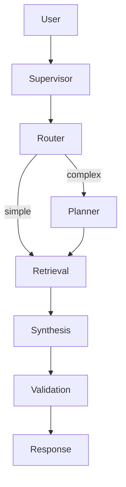

## Description

Adopt a lightweight five‑agent, supervisor‑coordinated RAG architecture that combines Adaptive RAG (routing), Corrective RAG (fallback), and Self‑RAG (quality control) while remaining local‑first and simple to operate.

## Context

Fixed pipelines cannot adapt to query complexity or recover from poor retrieval. We need simple, reliable coordination to route, plan, retrieve, synthesize, and validate — without bespoke state machines or server dependencies — and to operate fully on consumer hardware.

## Decision Drivers

- Simplicity and maintainability over bespoke orchestration
- Local‑first (no external APIs) with consumer GPU
- Quality control and graceful fallbacks
- Alignment with existing retrieval and config patterns

## Alternatives

- A: Basic RAG (linear) — Pros: simple; Cons: no adaptation/quality control
- B: Heavy multi‑agent frameworks — Pros: capability; Cons: complex, overkill
- C: Supervisor‑coordinated 5‑agent (Selected) — Pros: balanced, local‑first; Cons: some coordination overhead

### Decision Framework

| Model / Option                 | Capability (40%) | Simplicity (30%) | Performance (30%) | Total Score | Decision      |
| ------------------------------ | ---------------- | ---------------- | ----------------- | ----------- | ------------- |
| Supervisor‑coordinated 5‑agent | 8                | 8                | 8                 | **8.0**     | ✅ Selected    |
| Basic RAG (linear)             | 3                | 9                | 9                 | 6.3         | Rejected      |
| Heavy multi‑agent framework    | 9                | 3                | 6                 | 6.9         | Rejected      |

## Decision

Use LangGraph Supervisor to coordinate five roles: routing, planning, retrieval, synthesis, and validation. Keep implementation library‑first, minimize custom orchestration, and run on the local LLM (see ADR‑004). Integrates with adaptive retrieval (ADR‑003) and unified settings (ADR‑024).

## High-Level Architecture

User → Supervisor → {Router → Planner → Retrieval → Synthesis → Validation} → Response



## Related Requirements

### Functional Requirements

- FR‑1: Route queries to optimal retrieval strategies
- FR‑2: Validate responses; trigger corrective retrieval when needed
- FR‑3: Maintain conversation context across turns

### Non-Functional Requirements

- NFR‑1: Local‑first; no external services
- NFR‑2: Decision overhead ≤300ms on RTX 4090 Laptop
- NFR‑3: VRAM footprint ~12–14GB at 128K context

### Performance Requirements

- PR‑1: End‑to‑end complex query latency <2s
- PR‑2: Agent decision path measurable and logged

### Integration Requirements

- IR‑1: Use LangGraph Supervisor; avoid custom orchestration layers
- IR‑2: Configure via unified settings (ADR‑024)

## Design

### Architecture Overview

- Five roles coordinated by Supervisor; early exits when not needed
- Uses existing retrieval stack and evaluation signals

### Implementation Details

In `src/agents/supervisor.py` expose a thin factory that assembles the five roles with LangGraph Supervisor. Keep agent prompts minimal and rely on library primitives. Avoid custom state machines.

```python
# src/agents/supervisor.py (skeleton)
from langgraph_supervisor import create_supervisor

def create_app(llm, tools):
    agents = make_agents(llm, tools)  # router, planner, retrieval, synthesis, validation
    return create_supervisor(agents=agents, model=llm, config={
        "parallel_tool_calls": True,
        "output_mode": "structured",
    })
```

### Configuration

- Settings surface: agent enable/disable, logging verbosity
- No bespoke envs beyond existing LLM and retrieval settings

```env
DOCMIND_AGENTS__ENABLE_MULTI_AGENT=true
DOCMIND_AGENTS__PARALLEL_TOOL_CALLS=true
DOCMIND_LOG_LEVEL=INFO
```

## Testing

- Unit: routing decisions with parametrized query types
- Integration: corrective retrieval trigger conditions
- Validate logs contain agent transitions and outcomes

```python
def test_agent_routing(supervisor_app):
    res = supervisor_app.invoke({"messages": [{"role": "user", "content": "find summary"}]})
    assert "messages" in res
```

## Consequences

### Positive Outcomes

- Maintains simplicity while enabling adaptive behavior
- Library‑first approach reduces bugs and maintenance
- Works fully offline on consumer hardware

### Negative Consequences / Trade-offs

- Some coordination overhead vs linear pipeline
- Requires light observability to debug agent flows

### Ongoing Maintenance & Considerations

- Track LangGraph Supervisor releases
- Periodically review routing heuristics and validation criteria

### Dependencies

- Python: `langgraph-supervisor>=0.0.29`, `langgraph>=0.2`, `langchain-core>=0.3`
- Local LLM per ADR‑004

## Changelog

- 7.1 (2025‑09‑04): Standardized to template; restored matrix, config/tests; no behavior change
- 7.0 (2025‑08‑19): FP8 model transition; 128K context; parallel tool execution
- 6.0 (2025‑08‑18): Hardware upgrade; YaRN context scaling to 128K
- 5.1 (2025‑08‑18): Reverted from 30B MoE; 14B practical choice
- 5.0 (2025‑08‑18): Experimental 30B attempt (abandoned)
- 4.3 (2025‑08‑18): Corrected context specs
- 4.2 (2025‑08‑18): Corrected model naming
- 4.1 (2025‑08‑18): Added DSPy and GraphRAG options
- 4.0 (2025‑08‑17): Switched to supervisor approach
- 3.0 (2025‑08‑16): Model/context updates
- 2.0 (2025‑01‑16): Migrated to LangGraph Supervisor
- 1.0 (2025‑01‑16): Initial agentic RAG design
