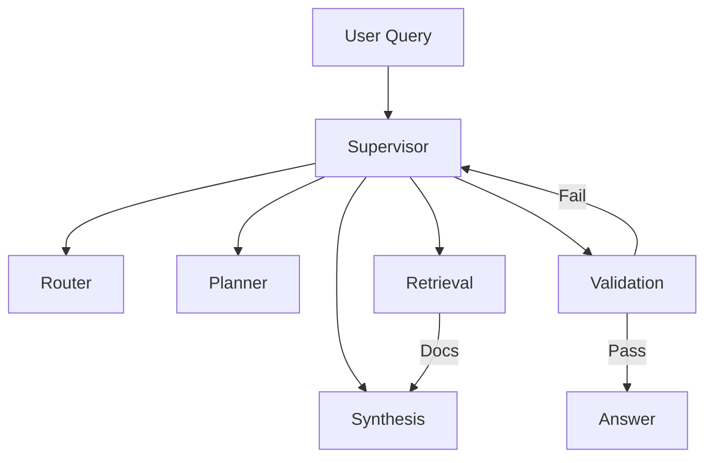

## Description

Adopt a lightweight, supervisor‑based, multi‑agent RAG architecture that routes queries, plans sub‑tasks, retrieves, synthesizes, and validates responses. Prioritize simple orchestration, local‑first operation, and correctness via self‑checks.

## Context

Fixed RAG pipelines fail to adapt to query complexity or recover from poor retrieval. A small set of specialized agents coordinated by a supervisor improves robustness while keeping implementation simple and local‑first. Targets: fast decisions (<200ms), low end‑to‑end latency (<2s), and predictable memory (~12–14GB VRAM with 128K context, ADR‑004/010).

## Decision Drivers

- Simplicity and maintainability (small, well‑scoped agents)
- Local/offline operation on consumer hardware
- Quality via routing, corrective retrieval, and validation
- Integration with adaptive retrieval and multimodal reranking

## Alternatives

- A: Basic fixed RAG — Simple, but no adaptation or self‑checks
- B: Heavy multi‑agent frameworks — Powerful, but over‑engineered for local app
- C: Lightweight supervisor‑based agents (Selected) — Balanced capability and complexity

### Decision Framework

| Model / Option                       | Capability (35%) | Simplicity (35%) | Performance (20%) | Maintenance (10%) | Total Score | Decision    |
| ------------------------------------ | ---------------- | ---------------- | ----------------- | ----------------- | ----------- | ----------- |
| C: Lightweight supervisor (Selected) | 8                | 8                | 9                 | 9                 | **8.4**     | ✅ Selected |
| A: Fixed RAG                         | 4                | 9                | 8                 | 9                 | 6.7         | Rejected    |
| B: Heavy multi‑agent                 | 9                | 3                | 7                 | 5                 | 6.6         | Rejected    |

## Decision

Use a five‑agent pattern coordinated by a supervisor:

- Query Router → picks retrieval strategy
- Planner → decomposes complex queries
- Retrieval Expert → executes adaptive retrieval (ADR‑003)
- Synthesizer → aggregates evidence into answers
- Validator → checks relevance/faithfulness and triggers corrections

## High-Level Architecture



## Related Requirements

### Functional Requirements

- FR‑1: Route queries to optimal retrieval strategy
- FR‑2: Fallback on low‑quality retrieval; re‑route as needed
- FR‑3: Validate answers for relevance and faithfulness
- FR‑4: Maintain multi‑turn context for chat flows

### Non-Functional Requirements

- NFR‑1: Local‑first; no external services
- NFR‑2: Agent decision latency <200ms on RTX 4090 Laptop
- NFR‑3: VRAM usage ~12–14GB at 128K context with FP8 optimizations

### Performance Requirements

- PR‑1: End‑to‑end typical latency <2s for single‑step tasks
- PR‑2: Parallel tool paths reduce tokens by 50–87%

### Integration Requirements

- IR‑1: Integrate with adaptive retrieval (ADR‑003) and multimodal reranking (ADR‑037)
- IR‑2: Use unified settings and UI state (ADR‑024/016)

## Design

### Architecture Overview

- Supervisor orchestrates five small agents via simple tools
- Router selects strategies; validator enforces quality loops
- Retrieval uses adaptive pipeline and modality‑aware reranking

### Implementation Details

In `src/agents/coordinator.py` (illustrative):

```python
from typing import Any, Dict

class Router:
    name = "router"
    def run(self, query: str, meta: Dict[str, Any]) -> Dict[str, Any]:
        # decide path: {"strategy": "hybrid|hierarchical|graph", "needs_planning": bool}
        return {"strategy": "hybrid", "needs_planning": False}

class Planner:
    name = "planner"
    def run(self, query: str) -> list[str]:
        # decompose complex query into sub-queries
        return [query]

class Retriever:
    name = "retrieval"
    def run(self, query: str, strategy: str) -> list[Dict[str, Any]]:
        # call adaptive retrieval (ADR-003), returns evidence chunks
        return []

class Synthesizer:
    name = "synthesis"
    def run(self, evidence: list[Dict[str, Any]]) -> str:
        # merge evidence into an answer with citations
        return ""

class Validator:
    name = "validation"
    def run(self, answer: str, evidence: list[Dict[str, Any]]) -> Dict[str, Any]:
        # check relevance/faithfulness; {"ok": bool, "reason": str}
        return {"ok": True, "reason": ""}

def build_supervisor(tools):
    return Supervisor(
        agents=[Router(), Planner(), Retriever(), Synthesizer(), Validator()],
        tools=tools,
    )

# Optional hooks
def trim_context_hook(state):
    # enforce 128K window (ADR-004/010); drop oldest messages if needed
    return state

def collect_metrics_hook(state, output):
    # record timings, decisions, token counts
    return output

# Reading guardrails and retrieval config from settings
from src.config.settings import settings

def build_supervisor_with_guardrails(tools):
    guard = settings.agents.model_dump()
    sup = build_supervisor(tools)
    # Example: attach hooks or config from guardrails
    sup.pre_model_hook = trim_context_hook
    sup.post_model_hook = collect_metrics_hook
    # Parallel tool execution and depth (if your supervisor surface supports these)
    sup.config = {
        "parallel_tool_calls": bool(settings.agents.enable_parallel_tool_execution),
        "max_workflow_depth": int(guard.get("max_workflow_depth", 5)),
    }
    return sup
```

### Configuration

```env
DOCMIND_AGENTS__ENABLE_MULTI_AGENT=true
DOCMIND_AGENTS__DECISION_TIMEOUT=200
DOCMIND_AGENTS__ENABLE_PARALLEL_TOOL_EXECUTION=true
DOCMIND_AGENTS__MAX_CONCURRENT_AGENTS=3
DOCMIND_AGENTS__CONTEXT_BUFFER_SIZE=8192
```

## Testing

```python
def test_router_picks_strategy(router):
    assert router.route("find table") == "hybrid"
```

## Consequences

### Positive Outcomes

- Robust answers via routing + validation
- Local‑first reliability and predictable performance
- Small, composable agents simplify maintenance

### Negative Consequences / Trade-offs

- Extra coordination logic vs. fixed RAG
- Requires careful guardrails to avoid loops

### Ongoing Maintenance & Considerations

- Track LangGraph/LlamaIndex releases for compatibility
- Monitor decision latency and loop frequency

### Dependencies

- Python: `langgraph`, `llama-index`, `sentence-transformers`

## Changelog

- 7.0 (2025-08-19): FP8 model transition; 128K context with FP8 KV cache and parallel tools; <200ms decisions; <2s E2E; ~12–14GB VRAM
- 6.0 (2025-08-18): Hardware upgrade; 128K via YaRN; latency targets updated
- 5.1 (2025-08-18): Reverted to Qwen3‑14B after 30B MoE experiment
- 5.0 (2025-08-18): Experimental 30B change (later reverted)
- 4.3 (2025-08-18): Corrected context specs (Qwen3‑14B 32K native + YaRN)
- 4.2 (2025-08-18): Corrected model naming
- 4.1 (2025-08-18): Added DSPy and optional GraphRAG
- 4.0 (2025-08-17): Library‑first supervisor; simplified agents
- 3.0 (2025-08-16): Switched to Qwen3‑14B; kept supervisor simplifications
- 2.0 (2025-01-16): Switched to supervisor library; simplified state and routing
- 1.0 (2025-01-16): Initial lightweight agentic RAG
