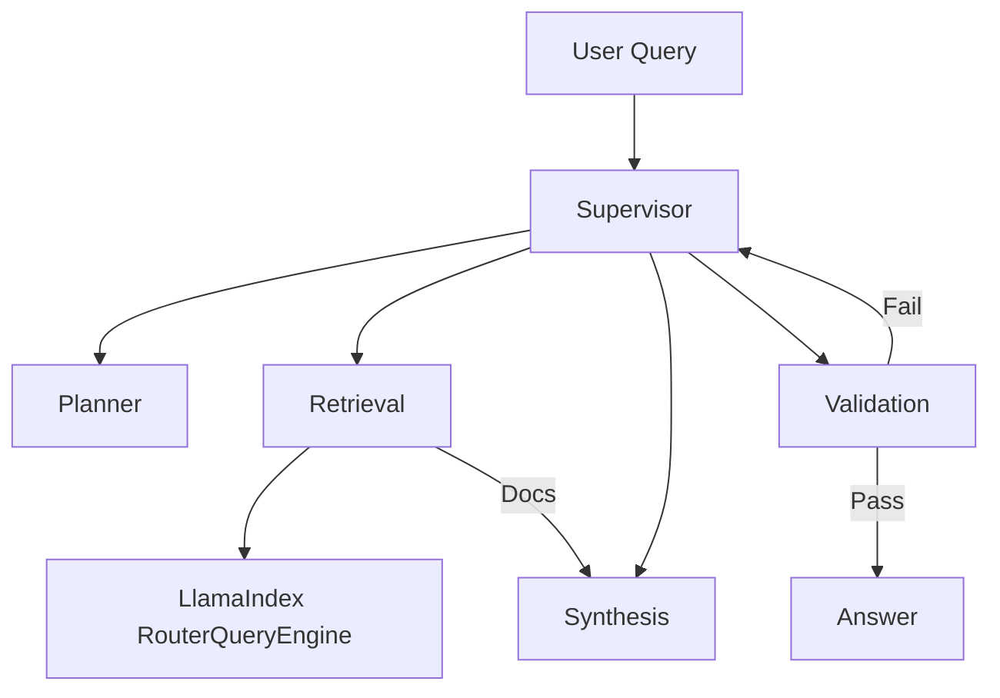

## Description

Adopt a lightweight supervisor-based retrieval-augmented generation (RAG)
architecture with four worker roles: planner, retrieval, synthesis, and
validation. The retrieval worker delegates tool selection to LlamaIndex's native
`RouterQueryEngine`. Keep orchestration local-first and measure performance in
each deployment environment.

## Context

Fixed RAG pipelines cannot adapt to query complexity or recover from poor retrieval. A small set of specialized agents coordinated by a supervisor improves robustness while keeping implementation local-first.

The application defaults to a local Ollama backend. It can also use local or approved remote OpenAI-compatible endpoints. Model, backend, hardware, context size, and retrieval work all affect latency and memory. The repository does not contain an LLM benchmark that supports a fixed latency, throughput, or video memory guarantee.

## Decision Drivers

- Simplicity and maintainability (small, well‑scoped agents)
- Local/offline operation on consumer hardware
- Quality via routing, corrective retrieval, and validation
- Integration with adaptive retrieval and multimodal reranking

## Alternatives

- A: Basic fixed RAG — Simple, but no adaptation or self‑checks
- B: Heavy multi‑agent frameworks — Powerful, but over‑engineered for local app
- C: Lightweight supervisor‑based agents (Selected) — Balanced capability and complexity

### Decision Framework

| Model / Option | Capability (35%) | Simplicity (35%) | Performance (20%) | Maintenance (10%) | Total Score | Decision |
| --- | --- | --- | --- | --- | --- | --- |
| C: Lightweight supervisor (Selected) | 8 | 8 | 9 | 9 | **8.4** | Selected |
| A: Fixed RAG | 4 | 9 | 8 | 9 | 6.7 | Rejected |
| B: Heavy multi‑agent | 9 | 3 | 7 | 5 | 6.6 | Rejected |

## Decision

Use four worker roles coordinated by a supervisor:

- Planner → decomposes complex queries
- Retrieval Expert → calls the native LlamaIndex router for adaptive retrieval (ADR‑003)
- Synthesizer → aggregates evidence into answers
- Validator → checks relevance/faithfulness and triggers corrections

## High-Level Architecture


```mermaid
graph TD
  U["User Query"] --> S["Supervisor"]
  S --> P["Planner"]
  S --> T["Retrieval"]
  S --> Y["Synthesis"]
  S --> V["Validation"]
  T --> R["LlamaIndex RouterQueryEngine"]
  T -->|Docs| Y
  V -->|Pass| O["Answer"]
  V -->|Fail| S
```

## Related Requirements

### Functional Requirements

- FR‑1: Delegate retrieval strategy selection to the native LlamaIndex router
- FR‑2: Fallback on low‑quality retrieval; re‑route as needed
- FR‑3: Validate answers for relevance and faithfulness
- FR‑4: Maintain multi‑turn context for chat flows

### Non-Functional Requirements

- NFR‑1: Default to local endpoints; require explicit policy configuration for remote providers
- NFR‑2: Treat `settings.agents.decision_timeout` as an execution budget, not a measured latency objective
- NFR‑3: Record hardware, model, backend, and context size with every performance result

### Performance Requirements

- PR‑1: Measure time to first token and end-to-end latency per environment
- PR‑2: Compare parallel and sequential tool paths before claiming a reduction

### Integration Requirements

- IR‑1: Integrate with adaptive retrieval (ADR‑003) and multimodal reranking (ADR‑037)
- IR‑2: Use unified settings and UI state (ADR‑024/016)

## Design

### Architecture Overview

- Supervisor orchestrates four small worker roles through one atomic dispatch tool
- The retrieval tool calls `RouterQueryEngine`; the validator enforces quality loops
- Retrieval uses adaptive pipeline and modality‑aware reranking

### Implementation Details

`src/agents/coordinator.py` builds the four LangChain role agents and compiles the
repository-owned graph. `src/agents/supervisor_graph.py` owns atomic worker
dispatch. `src/agents/tools/retrieval.py` calls the router built by
`src/retrieval/router_factory.py`; there is no separate query-router agent or
second retrieval strategy implementation.

### Configuration

```env
DOCMIND_AGENTS__DECISION_TIMEOUT=200
```

## Testing

```bash
uv run pytest tests/unit/agents/test_supervisor_graph.py \
  tests/unit/agents/tools/test_retrieval.py \
  tests/unit/retrieval/test_router_factory_contract.py -q --no-cov
```

## Consequences

### Positive Outcomes

- Robust answers via routing + validation
- Local-first operation with explicit provider boundaries
- Small, composable agents simplify maintenance

### Negative Consequences / Trade-offs

- Extra coordination logic vs. fixed RAG
- Requires careful guardrails to avoid loops

### Ongoing Maintenance & Considerations

- Track LangGraph/LlamaIndex releases for compatibility
- Monitor decision latency and loop frequency

### Dependencies

- Python: `langgraph`, `langchain`, `llama-index-core`, and selected LlamaIndex adapters

## Changelog

- 7.3 (2026-07-14): Align the architecture with four worker roles and native
  LlamaIndex retrieval routing; remove the obsolete illustrative fifth agent.
- 7.2 (2026-07-13): Remove the obsolete shared-client toggle; provider factories
  now own native retry behavior without a parallel compatibility path
- 7.1 (2026-07-10): Mark fixed latency, throughput, and memory figures as unverified historical targets; align provider language with the local-first default and opt-in remote endpoints
- 7.0 (2025-08-19): Record the FP8 model, extended-context, and parallel-tool planning targets; no reproducible LLM benchmark accompanied these targets
- 6.0 (2025-08-18): Hardware upgrade; 128K via YaRN; latency targets updated
- 5.1 (2025-08-18): Reverted to Qwen3‑14B after 30B MoE experiment
- 5.0 (2025-08-18): Experimental 30B change (later reverted)
- 4.3 (2025-08-18): Corrected context specs (Qwen3‑14B 32K native + YaRN)
- 4.2 (2025-08-18): Corrected model naming
- 4.1 (2025-08-18): Added DSPy and optional GraphRAG
- 4.0 (2025-08-17): Library‑first supervisor; simplified agents
- 3.0 (2025-08-16): Switched to Qwen3‑14B; kept supervisor simplifications
- 2.0 (2025-01-16): Switched to supervisor library; simplified state and routing
- 1.0 (2025-01-16): Initial lightweight agentic RAG
