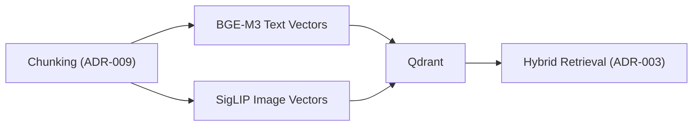

## Description

Replace the three‑model setup (BGE‑large + SPLADE + CLIP) with a two‑model approach: **BGE‑M3** for unified dense+sparse text and **SigLIP** for images. Reduces complexity and memory while improving retrieval quality.

## Context

Separate dense and sparse models increase coordination cost and memory. BGE‑M3 unifies dense/sparse (and supports multi‑granularity) with strong quality and 8K context, enabling simpler hybrid search with fewer moving parts.

## Decision Drivers

- Reduce model count and memory footprint
- Maintain or improve retrieval quality
- 100% local operation on consumer hardware
- Fit adaptive retrieval (ADR‑003) and storage (ADR‑031)

## Alternatives

- A: Current three‑model (BGE‑large + SPLADE + CLIP) — High overhead
- B: BGE‑M3 + CLIP (Selected) — Unified dense/sparse + multimodal
- C: Nomic‑v2 + CLIP — MoE, good multilingual; alternative local setup

### Decision Framework

| Model / Option         | Quality (40%) | Simplicity (30%) | Perf (30%) | Total Score | Decision      |
| ---------------------- | ------------- | ---------------- | ---------- | ----------- | ------------- |
| BGE‑M3 + CLIP          | 9             | 9                | 9          | **9.0**     | ✅ Selected    |
| Nomic‑v2 + CLIP        | 8             | 8                | 8          | 8.0         | Rejected      |
| 3‑model (baseline)     | 7             | 2                | 3          | 4.0         | Rejected      |

## Decision

Adopt BGE‑M3 (1024‑dim) for unified dense+sparse text embeddings and SigLIP base (projection_dim ≈ 768) for images. Vectors are stored in Qdrant (ADR‑031) and consumed by the adaptive retrieval pipeline (ADR‑003). This replaces the previous three‑model setup to reduce complexity and memory while maintaining quality.

## High-Level Architecture



## Related Requirements

### Functional Requirements

- FR‑1: Generate dense embeddings for semantic similarity
- FR‑2: Generate sparse embeddings for keyword retrieval
- FR‑3: Support multimodal search via image vectors

### Non-Functional Requirements

- NFR‑1: >30% embedding memory reduction vs baseline
- NFR‑2: Maintain or improve retrieval accuracy
- NFR‑3: Fully offline on consumer hardware

### Integration Requirements

- IR‑1: Use LlamaIndex embedding interfaces
- IR‑2: Persist in Qdrant with hybrid search enabled

## Local‑First & Privacy

- All embedding models (BGE‑M3 for text; SigLIP for images) run locally and are loaded from local caches; set `HF_HUB_OFFLINE=1` and pre‑download model weights to avoid network access.
- No external APIs or cloud endpoints are required for embedding; the vector store (Qdrant) runs locally on `127.0.0.1`.

Note on model roles: Embeddings = BGE‑M3 (text) and SigLIP (images). Reranking uses BGE v2‑m3 (text cross‑encoder) with SigLIP visual re‑score via normalized cosine; ColPali is optional on capable GPUs.

### Performance Requirements

- PR‑1: <50ms per‑chunk embedding on RTX 4090 Laptop
- PR‑2: Efficient hybrid query latency via unified vectors

## Design

### Architecture Overview

- Unified embedding path for text; separate path for images
- Single ingestion→embedding→storage flow; hybrid retrieval consumes both

### Implementation Details

In `src/utils/embeddings.py`:

```python
from llama_index.embeddings.huggingface import HuggingFaceEmbedding

def get_bgem3_embedding(device: str = "cpu", batch_size: int = 8):
    return HuggingFaceEmbedding(
        model_name="BAAI/bge-m3",
        device=device,
        embed_batch_size=batch_size,
        trust_remote_code=True,
    )
```

In `src/config/integrations.py`:

```python
from llama_index.core import Settings
from src.utils.embeddings import get_bgem3_embedding

def setup_embeddings(use_gpu: bool):
    Settings.embed_model = get_bgem3_embedding(
        device="cuda" if use_gpu else "cpu",
        batch_size=64 if use_gpu else 8,
    )
```

Image embedding (SigLIP) for multimodal search:

In `src/utils/embeddings.py`:

```python
from transformers import AutoModel, AutoProcessor

SIGLIP_CKPT = "google/siglip-base-patch16-224"

def get_siglip(device: str = "cpu"):
    model = AutoModel.from_pretrained(SIGLIP_CKPT)
    proc = AutoProcessor.from_pretrained(SIGLIP_CKPT)
    model = model.to(device)
    model.eval()
    return model, proc
```

Qdrant collection dimensionality (ensure index schema aligns):

- Text vectors (BGE‑M3): 1024 dimensions
- Image vectors (SigLIP base): projection_dim (typically 768)
- Use separate collections or a hybrid schema that matches each embedding’s dimension.

### Configuration

```env
DOCMIND_EMBEDDING__MODEL_NAME=BAAI/bge-m3
DOCMIND_EMBEDDING__BATCH_SIZE_GPU=64
DOCMIND_EMBEDDING__BATCH_SIZE_CPU=8
```

## Testing

```python
def test_bgem3_shape(embed_model):
    vecs = embed_model.get_text_embedding("hello")
    assert len(vecs) == 1024
```

## Consequences

### Positive Outcomes

- Fewer models; lower memory; simpler maintenance
- Improved coordination between dense and sparse signals

### Negative Consequences / Trade-offs

- Requires one‑time re‑indexing of existing documents
- Increased reliance on BGE‑M3 implementation

### Dependencies

- Python: `FlagEmbedding>=1.2.0`, `torch>=2.0.0`, `llama-index>=0.10`
- Models: `BAAI/bge-m3`, `google/siglip-base-patch16-224` (default); Optional: OpenCLIP ViT‑L/14 or ViT‑H/14

### Ongoing Maintenance & Considerations

- Track FlagEmbedding and LlamaIndex releases for embedding API changes
- Re‑evaluate batch sizes when hardware or drivers change
- Validate hybrid performance quarterly with a small benchmark set

## Changelog

- 4.2 (2025-09-07): Switch image backbone default from CLIP to SigLIP; update diagrams and implementation details
- 4.1 (2025-09-02): Replaced ADR-007 with ADR-031; added ADR-034 reference; updated formatting
- 4.1 (2025-08-26): IMPLEMENTATION COMPLETE — BGE-M3 deployed; integrated with ADR-009
- 4.0 (2025-08-18): Updated perf targets for RTX 4090 Laptop
- 3.1 (2025-08-18): DSPy and PropertyGraphIndex integration
- 3.0 (2025-08-17): Removed API-only Voyage-3; set BGE-M3 as primary local
- 2.0 (2025-08-17): INVALID — Voyage-3 selection
- 1.0 (2025-01-16): Initial design
